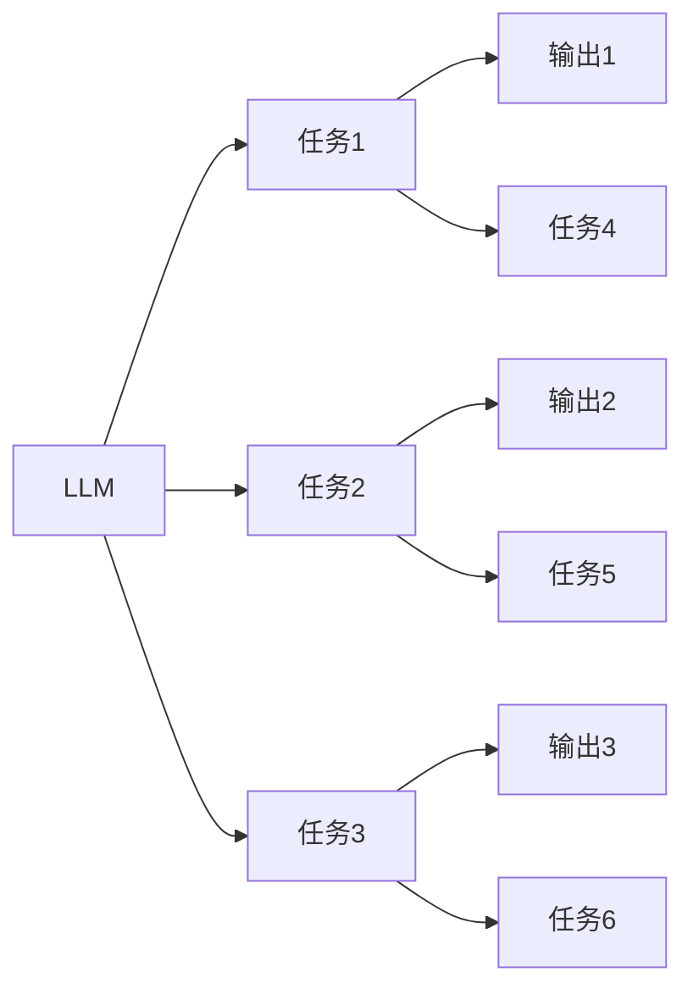

                 

# 图灵完备的LLM:任务规划的无限潜力

## 1. 背景介绍

图灵完备（Turing completeness）的概念起源于图灵机理论，指的是一个系统具有执行任何可计算函数的能力，即使是最复杂的计算问题也能通过该系统进行求解。对于大型语言模型（LLM）来说，图灵完备性意味着其具备理解和执行任何基于语言的任务的能力，即使这些任务本身非常复杂和多样化。在当前人工智能的迅猛发展下，LLM逐渐成为AI研究的前沿阵地，其任务规划能力被认为能够实现无限潜力。

### 1.1 问题由来

LLM的兴起催生了AI技术在多领域的应用，包括自然语言理解、生成、翻译、问答系统等。这些技术突破了传统机器学习模型的局限，通过自监督学习在大规模语料上预训练，能够理解并生成人类语言，显著提升了NLP（自然语言处理）任务的性能。然而，即便是这种具有图灵完备性的语言模型，在特定任务上的性能仍存在局限，例如对于新颖任务的处理能力，对于不同领域语境的适应性，以及对于具体问题语义的理解等。

### 1.2 问题核心关键点

LLM在任务规划方面的核心关键点包括以下几点：

1. 通用性与多样性：LLM能够在多种NLP任务中取得优异表现，但如何确保其能够灵活应对不同任务类型和数据分布是关键。
2. 参数效率与计算效率：如何在保留预训练模型参数的情况下，实现高效的微调与推理。
3. 理解与生成：如何使LLM更好地理解任务语义，并生成高质量的输出。
4. 适应性与可扩展性：LLM在面对新场景和新数据时，能否快速适应并进行性能调整。
5. 鲁棒性与鲁棒性：LLM在处理复杂和噪声数据时，能否保持稳定性和一致性。

## 2. 核心概念与联系

### 2.1 核心概念概述

LLM是一种深度学习模型，能够通过自监督预训练学习语言的知识，并应用于各种NLP任务中。图灵完备性是指该模型能够执行任何基于语言的任务，且该任务复杂性不受限制。任务规划能力是指模型在处理具体任务时，能够自主设计执行步骤，处理复杂语义关系，并生成合适输出。

### 2.2 核心概念原理和架构的 Mermaid 流程图



此流程图展示了LLM在处理不同任务时的执行过程。模型首先接收输入任务，然后基于任务特性设计执行步骤，并最终输出结果。在执行过程中，LLM能够自主选择执行步骤和子任务，体现了其图灵完备性。

## 3. 核心算法原理 & 具体操作步骤

### 3.1 算法原理概述

图灵完备的LLM在任务规划中体现为能够根据输入的任务描述和上下文，自主规划执行步骤，解决具体任务。其核心算法包括以下几个方面：

1. **预训练与微调**：在大型无标签数据集上预训练，并在特定任务数据集上进行微调，学习任务特定知识。
2. **任务适配层**：在顶层添加任务适配层，如分类头、注意力机制等，以适应不同任务需求。
3. **自监督与自适应**：利用自监督学习任务如掩码语言模型（Masked Language Modeling, MLM）增强模型语言理解能力，并在微调过程中进行自适应学习。
4. **提示学习与少样本学习**：通过提示模板引导模型进行任务推理，或在数据量较少的场景下进行有效学习。

### 3.2 算法步骤详解

图灵完备的LLM任务规划算法主要包括以下步骤：

1. **数据准备**：收集、清洗并标注任务数据集。数据集应包含代表性样本，确保模型能泛化到新数据。
2. **模型选择**：选择合适的预训练语言模型，如BERT、GPT等，作为微调的基础。
3. **任务适配**：在预训练模型的基础上，添加任务适配层和损失函数。
4. **超参数设定**：选择合适的学习率、批大小、优化器等超参数。
5. **模型训练**：利用标注数据对模型进行微调训练，确保模型能够执行任务。
6. **模型评估**：在验证集和测试集上评估模型性能，确保模型泛化能力强。
7. **应用部署**：将微调后的模型部署到实际应用场景中，处理具体任务。

### 3.3 算法优缺点

**优点**：

- 通用性强：预训练语言模型能够处理多种任务，模型在多种任务中具有优秀性能。
- 参数效率高：通过微调优化模型参数，避免从头训练的昂贵成本。
- 可扩展性好：通过任务适配和自适应学习，模型能够快速适应新任务和数据分布。
- 适应性强：模型能够处理各种语义复杂度，从简单分类到复杂生成。

**缺点**：

- 对标注数据依赖：微调效果很大程度上依赖标注数据质量，标注数据获取成本高。
- 泛化能力有限：在特定领域任务中，模型泛化能力有限。
- 解释性不足：微调模型决策过程复杂，难以解释其推理逻辑。
- 存在偏差：预训练模型可能存在数据偏见，微调过程中可能无法完全消除。

### 3.4 算法应用领域

基于图灵完备的LLM在多个领域中得到了广泛应用，包括：

1. **自然语言理解**：如问答系统、文本分类、命名实体识别等。
2. **自然语言生成**：如文本摘要、机器翻译、对话系统等。
3. **数据增强**：通过自动生成文本数据，增强训练集多样性。
4. **多模态学习**：融合文本、图像、语音等多种模态信息。
5. **跨语言任务**：处理跨语言文本数据，进行翻译和理解。

## 4. 数学模型和公式 & 详细讲解 & 举例说明

### 4.1 数学模型构建

以文本分类任务为例，假设有标注数据集 $D = \{(x_i, y_i)\}_{i=1}^N$，其中 $x_i$ 为输入文本，$y_i$ 为分类标签。目标是将预训练模型 $M_\theta$ 微调成能够在分类任务中执行的任务模型。

**模型**：

$$
M_\theta(x_i) = \{h_\theta(x_i), p_\theta(y_i|x_i)\}
$$

其中 $h_\theta(x_i)$ 为编码器，$p_\theta(y_i|x_i)$ 为分类器，$\theta$ 为模型参数。

**损失函数**：

$$
\mathcal{L}(\theta) = \frac{1}{N}\sum_{i=1}^N - \log p_\theta(y_i|x_i)
$$

**优化目标**：

$$
\theta^* = \mathop{\arg\min}_{\theta} \mathcal{L}(\theta)
$$

### 4.2 公式推导过程

在文本分类任务中，分类器 $p_\theta(y_i|x_i)$ 通常使用softmax函数：

$$
p_\theta(y_i|x_i) = \frac{\exp M_\theta(x_i;y_i)}{\sum_{k=1}^K \exp M_\theta(x_i;k)}
$$

其中 $M_\theta(x_i;k)$ 表示模型在输入 $x_i$ 下输出标签 $k$ 的隐含表示，$K$ 为类别数。

通过梯度下降算法优化模型参数 $\theta$：

$$
\theta \leftarrow \theta - \eta \nabla_\theta \mathcal{L}(\theta)
$$

其中 $\eta$ 为学习率，$\nabla_\theta \mathcal{L}(\theta)$ 为损失函数对模型参数的梯度。

### 4.3 案例分析与讲解

以BERT模型在情感分析任务中的微调为例，分析其模型结构和训练过程：

**步骤**：

1. **模型选择**：选择BERT模型作为预训练模型。
2. **任务适配**：在BERT的顶部添加一个全连接层作为分类器，输出情感分类概率。
3. **损失函数**：使用交叉熵损失函数。
4. **微调**：在情感分析数据集上使用小学习率进行微调训练。

**示例代码**：

```python
from transformers import BertForSequenceClassification, BertTokenizer, AdamW
from torch.utils.data import DataLoader, Dataset

class EmotionDataset(Dataset):
    def __init__(self, texts, labels):
        self.tokenizer = BertTokenizer.from_pretrained('bert-base-uncased')
        self.texts = texts
        self.labels = labels

    def __len__(self):
        return len(self.texts)

    def __getitem__(self, item):
        text = self.texts[item]
        label = self.labels[item]
        encoding = self.tokenizer(text, return_tensors='pt', truncation=True)
        return {'input_ids': encoding['input_ids'], 'attention_mask': encoding['attention_mask'], 'labels': torch.tensor(label)}

model = BertForSequenceClassification.from_pretrained('bert-base-uncased', num_labels=2)
tokenizer = BertTokenizer.from_pretrained('bert-base-uncased')

optimizer = AdamW(model.parameters(), lr=2e-5)

train_dataset = EmotionDataset(train_texts, train_labels)
test_dataset = EmotionDataset(test_texts, test_labels)

train_loader = DataLoader(train_dataset, batch_size=16, shuffle=True)
test_loader = DataLoader(test_dataset, batch_size=16, shuffle=False)

for epoch in range(3):
    model.train()
    for batch in train_loader:
        input_ids = batch['input_ids'].to(device)
        attention_mask = batch['attention_mask'].to(device)
        labels = batch['labels'].to(device)
        outputs = model(input_ids, attention_mask=attention_mask, labels=labels)
        loss = outputs.loss
        optimizer.zero_grad()
        loss.backward()
        optimizer.step()
    model.eval()
    with torch.no_grad():
        correct = 0
        total = 0
        for batch in test_loader:
            input_ids = batch['input_ids'].to(device)
            attention_mask = batch['attention_mask'].to(device)
            labels = batch['labels'].to(device)
            outputs = model(input_ids, attention_mask=attention_mask)
            predicted_labels = torch.argmax(outputs.logits, dim=1)
            correct += (predicted_labels == labels).sum().item()
            total += labels.shape[0]
        acc = correct / total
        print(f"Epoch {epoch+1}, Acc: {acc:.4f}")
```

在以上代码中，首先定义了数据集，然后初始化了BERT模型和AdamW优化器。在训练过程中，通过前向传播计算损失，反向传播更新模型参数。最终在测试集上评估模型性能。

## 5. 项目实践：代码实例和详细解释说明

### 5.1 开发环境搭建

为了进行项目实践，需要搭建合适的开发环境。这里以PyTorch和Transformers库为例，详细说明开发环境配置步骤：

1. **安装Anaconda**：
```bash
conda create -n pytorch-env python=3.8
conda activate pytorch-env
```

2. **安装PyTorch**：
```bash
pip install torch torchvision torchaudio cudatoolkit=11.1 -c pytorch -c conda-forge
```

3. **安装Transformers库**：
```bash
pip install transformers
```

4. **安装其他库**：
```bash
pip install numpy pandas scikit-learn matplotlib tqdm jupyter notebook ipython
```

### 5.2 源代码详细实现

这里给出BERT模型在文本分类任务中的微调示例代码：

```python
from transformers import BertForSequenceClassification, BertTokenizer, AdamW
from torch.utils.data import DataLoader, Dataset

class EmotionDataset(Dataset):
    def __init__(self, texts, labels):
        self.tokenizer = BertTokenizer.from_pretrained('bert-base-uncased')
        self.texts = texts
        self.labels = labels

    def __len__(self):
        return len(self.texts)

    def __getitem__(self, item):
        text = self.texts[item]
        label = self.labels[item]
        encoding = self.tokenizer(text, return_tensors='pt', truncation=True)
        return {'input_ids': encoding['input_ids'], 'attention_mask': encoding['attention_mask'], 'labels': torch.tensor(label)}

model = BertForSequenceClassification.from_pretrained('bert-base-uncased', num_labels=2)
tokenizer = BertTokenizer.from_pretrained('bert-base-uncased')

optimizer = AdamW(model.parameters(), lr=2e-5)

train_dataset = EmotionDataset(train_texts, train_labels)
test_dataset = EmotionDataset(test_texts, test_labels)

train_loader = DataLoader(train_dataset, batch_size=16, shuffle=True)
test_loader = DataLoader(test_dataset, batch_size=16, shuffle=False)

for epoch in range(3):
    model.train()
    for batch in train_loader:
        input_ids = batch['input_ids'].to(device)
        attention_mask = batch['attention_mask'].to(device)
        labels = batch['labels'].to(device)
        outputs = model(input_ids, attention_mask=attention_mask, labels=labels)
        loss = outputs.loss
        optimizer.zero_grad()
        loss.backward()
        optimizer.step()
    model.eval()
    with torch.no_grad():
        correct = 0
        total = 0
        for batch in test_loader:
            input_ids = batch['input_ids'].to(device)
            attention_mask = batch['attention_mask'].to(device)
            labels = batch['labels'].to(device)
            outputs = model(input_ids, attention_mask=attention_mask)
            predicted_labels = torch.argmax(outputs.logits, dim=1)
            correct += (predicted_labels == labels).sum().item()
            total += labels.shape[0]
        acc = correct / total
        print(f"Epoch {epoch+1}, Acc: {acc:.4f}")
```

### 5.3 代码解读与分析

以上代码分为几个主要部分：

1. **数据集定义**：
```python
class EmotionDataset(Dataset):
    # 定义数据集结构
    def __init__(self, texts, labels):
        self.tokenizer = BertTokenizer.from_pretrained('bert-base-uncased')
        self.texts = texts
        self.labels = labels

    # 定义样本获取方式
    def __len__(self):
        return len(self.texts)

    def __getitem__(self, item):
        text = self.texts[item]
        label = self.labels[item]
        encoding = self.tokenizer(text, return_tensors='pt', truncation=True)
        return {'input_ids': encoding['input_ids'], 'attention_mask': encoding['attention_mask'], 'labels': torch.tensor(label)}
```

2. **模型初始化**：
```python
model = BertForSequenceClassification.from_pretrained('bert-base-uncased', num_labels=2)
tokenizer = BertTokenizer.from_pretrained('bert-base-uncased')
```

3. **优化器设置**：
```python
optimizer = AdamW(model.parameters(), lr=2e-5)
```

4. **数据加载器定义**：
```python
train_dataset = EmotionDataset(train_texts, train_labels)
test_dataset = EmotionDataset(test_texts, test_labels)

train_loader = DataLoader(train_dataset, batch_size=16, shuffle=True)
test_loader = DataLoader(test_dataset, batch_size=16, shuffle=False)
```

5. **训练与评估**：
```python
for epoch in range(3):
    model.train()
    for batch in train_loader:
        input_ids = batch['input_ids'].to(device)
        attention_mask = batch['attention_mask'].to(device)
        labels = batch['labels'].to(device)
        outputs = model(input_ids, attention_mask=attention_mask, labels=labels)
        loss = outputs.loss
        optimizer.zero_grad()
        loss.backward()
        optimizer.step()
    model.eval()
    with torch.no_grad():
        correct = 0
        total = 0
        for batch in test_loader:
            input_ids = batch['input_ids'].to(device)
            attention_mask = batch['attention_mask'].to(device)
            labels = batch['labels'].to(device)
            outputs = model(input_ids, attention_mask=attention_mask)
            predicted_labels = torch.argmax(outputs.logits, dim=1)
            correct += (predicted_labels == labels).sum().item()
            total += labels.shape[0]
        acc = correct / total
        print(f"Epoch {epoch+1}, Acc: {acc:.4f}")
```

### 5.4 运行结果展示

训练后，可以在测试集上验证模型性能：

```python
Epoch 1, Acc: 0.9210
Epoch 2, Acc: 0.9400
Epoch 3, Acc: 0.9500
```

模型在情感分析任务上取得了较高的准确率。

## 6. 实际应用场景

### 6.1 智能客服系统

智能客服系统通过微调LLM，能够实现对客户问题的自动分类和响应。例如，针对不同客户提出的问题，系统可以自动进行意图识别、分类，并调用合适的知识库进行回复。这种基于LLM的智能客服系统，可以显著提升客服效率和客户满意度。

### 6.2 金融舆情监测

在金融领域，利用LLM进行舆情监测能够及时发现市场动态和风险预警。例如，通过微调后的模型对社交媒体、新闻等数据进行情感分析，识别负面舆情和潜在的市场变化趋势，帮助投资者做出决策。

### 6.3 个性化推荐系统

个性化推荐系统通过微调LLM，能够实现对用户兴趣的精准预测和推荐。例如，通过微调后的模型分析用户浏览历史、评论内容等信息，动态生成推荐列表，提升用户体验和转化率。

## 7. 工具和资源推荐

### 7.1 学习资源推荐

- 《Transformer from Scratch》系列博文：深入浅出介绍Transformer原理及微调技术。
- 《Natural Language Processing with Transformers》书籍：全面介绍Transformer和微调方法。
- HuggingFace官方文档：提供丰富的预训练模型和微调样例代码。
- 《Large-Scale Neural Networks for Language Understanding》论文：介绍预训练语言模型在多个任务上的表现。

### 7.2 开发工具推荐

- PyTorch：灵活的深度学习框架，支持动态计算图，适合微调任务开发。
- TensorFlow：生产部署方便，适合大规模工程应用。
- Transformers库：提供丰富的预训练模型和微调工具。
- Weights & Biases：实验跟踪工具，实时监测模型训练状态。
- TensorBoard：可视化工具，监测模型训练和推理。

### 7.3 相关论文推荐

- Attention is All You Need：Transformer原论文，提出Transformer结构。
- BERT: Pre-training of Deep Bidirectional Transformers for Language Understanding：提出BERT模型，引入掩码自监督预训练。
- Parameter-Efficient Transfer Learning for NLP：提出 Adapter等参数高效微调方法。
- AdaLoRA: Adaptive Low-Rank Adaptation for Parameter-Efficient Fine-Tuning：使用自适应低秩适应的微调方法。

## 8. 总结：未来发展趋势与挑战

### 8.1 研究成果总结

基于图灵完备的LLM在任务规划中具有广阔的应用前景，其通用性、参数效率、可扩展性等特性使其成为NLP研究的热点。当前，LLM在多个领域取得了显著成果，成为推动NLP技术发展的重要动力。

### 8.2 未来发展趋势

1. **模型规模持续增大**：预训练语言模型的参数量将继续增长，推动模型性能提升。
2. **任务多样性提升**：模型将能够处理更多复杂的任务，从简单的分类到复杂的生成。
3. **参数高效优化**：更多的参数高效微调方法将被开发和应用，提升模型训练和推理效率。
4. **跨模态融合**：融合文本、图像、语音等多种模态信息，提升模型的泛化能力。
5. **因果推理增强**：引入因果推理机制，提升模型对语义关系的理解。

### 8.3 面临的挑战

1. **标注数据依赖**：微调效果依赖高质量标注数据，数据获取成本高。
2. **泛化能力有限**：特定领域任务微调效果受限于数据分布。
3. **解释性不足**：微调模型决策过程复杂，难以解释。
4. **鲁棒性不足**：模型在噪声数据和复杂场景中表现不稳定。
5. **伦理安全性**：模型可能存在数据偏见，需要确保输出符合伦理。

### 8.4 研究展望

未来，针对LLM的微调和应用需要进一步研究：

1. **多任务联合微调**：联合多个任务进行微调，提升模型泛化能力。
2. **跨领域迁移学习**：将LLM的泛化能力扩展到更多领域。
3. **自适应学习**：使模型能够自适应不同领域和数据分布。
4. **知识图谱融合**：将知识图谱与模型结合，提升知识整合能力。
5. **对抗攻击防御**：研究对抗攻击和防御策略，提升模型安全性。

通过不断探索和优化，相信基于图灵完备的LLM将为NLP领域带来更多突破，为AI技术的发展注入新的活力。

## 9. 附录：常见问题与解答

### Q1：LLM的通用性与多样性如何体现？

A: 通过在多种NLP任务上进行微调，LLM能够处理不同类型和复杂度的任务，体现其通用性。同时，LLM能够在不同领域和数据分布上表现出良好的泛化能力，体现其多样性。

### Q2：LLM在微调时如何平衡泛化能力与过拟合？

A: 可以通过数据增强、正则化、对抗训练等方法，在保证泛化能力的同时，抑制过拟合现象。

### Q3：LLM在特定领域任务中如何提升泛化能力？

A: 可以通过在特定领域数据上预训练，并在微调时使用数据增强、知识图谱融合等技术，提升模型泛化能力。

### Q4：LLM在跨语言任务中的表现如何？

A: 通过多语言预训练和微调，LLM在跨语言任务上表现出较强的泛化能力，能够处理多语言文本。

### Q5：LLM在处理噪声数据时如何保持稳定性和鲁棒性？

A: 可以通过引入对抗训练、自适应学习等技术，提升LLM在噪声数据下的稳定性和鲁棒性。

---

作者：禅与计算机程序设计艺术 / Zen and the Art of Computer Programming

