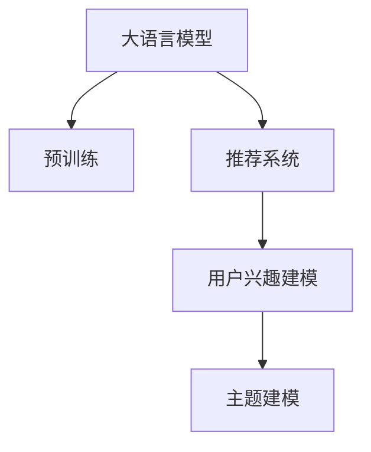

                 

# 基于LLM的推荐系统用户兴趣主题建模

> 关键词：推荐系统,大语言模型(LLM),用户兴趣建模,主题建模,深度学习

## 1. 背景介绍

### 1.1 问题由来
随着互联网的快速发展，推荐系统成为提升用户体验、提高业务效率的重要手段。传统的协同过滤、基于内容的推荐方法虽然效果显著，但面临数据稀疏性、冷启动等问题。而利用深度学习技术，特别是基于预训练语言模型的大规模推荐系统，有效解决了这些问题。

深度学习推荐系统的核心在于用户兴趣主题建模。用户兴趣主题建模通过挖掘用户的历史行为和反馈信息，构建用户兴趣分布的主题向量，从而实现个性化推荐。其中，深度学习技术的应用尤为广泛，尤其是大语言模型(LLM)。

## 2. 核心概念与联系

### 2.1 核心概念概述

为更好地理解基于LLM的推荐系统用户兴趣主题建模，本节将介绍几个密切相关的核心概念：

- 大语言模型(LLM)：以自回归(如GPT)或自编码(如BERT)模型为代表的大规模预训练语言模型。通过在大规模无标签文本语料上进行预训练，学习通用的语言表示，具备强大的语言理解和生成能力。

- 预训练(Pre-training)：指在大规模无标签文本语料上，通过自监督学习任务训练通用语言模型的过程。常见的预训练任务包括言语建模、遮挡语言模型等。预训练使得模型学习到语言的通用表示。

- 推荐系统(Recommendation System)：通过用户行为和反馈信息，为用户推荐感兴趣的商品、内容等，以提升用户体验和运营效率。

- 用户兴趣建模(User Interest Modeling)：通过用户的历史行为和反馈信息，构建用户兴趣分布的主题向量，从而实现个性化推荐。

- 主题建模(Thematic Modeling)：指从文本数据中挖掘出隐藏的主题信息，将文档表示为主题的分布向量。常见的模型包括LDA(Latent Dirichlet Allocation)、LSA(Latent Semantic Analysis)等。

这些核心概念之间的逻辑关系可以通过以下Mermaid流程图来展示：



这个流程图展示了大语言模型的核心概念及其之间的关系：

1. 大语言模型通过预训练获得基础能力。
2. 推荐系统利用大语言模型进行个性化推荐。
3. 用户兴趣建模从用户历史行为中构建主题分布。
4. 主题建模挖掘文档的主题信息，辅助用户兴趣建模。

## 3. 核心算法原理 & 具体操作步骤
### 3.1 算法原理概述

基于LLM的推荐系统用户兴趣主题建模，本质上是一个深度学习模型与主题建模的协同学习过程。其核心思想是：将用户行为和反馈信息转化为文本数据，利用大语言模型学习用户兴趣主题分布，再将主题分布转化为推荐模型中的用户兴趣特征，进行个性化推荐。

形式化地，假设用户的历史行为和反馈信息为 $\mathcal{X}$，用户兴趣主题建模的目标是构建用户兴趣分布 $\mathbf{P}_u$，其中 $\mathbf{P}_u$ 表示用户 $u$ 对每个主题 $t$ 的兴趣度，即 $\mathbf{P}_u = \{p_{u,t}\}_{t \in \mathcal{T}}$，$\mathcal{T}$ 为所有主题的集合。

用户兴趣主题建模的优化目标是最小化用户兴趣分布与实际行为和反馈的拟合误差，即：

$$
\mathop{\arg\min}_{\mathbf{P}_u} \sum_{(x,y) \in \mathcal{X}} \ell(\mathbf{P}_u, y|x)
$$

其中 $\ell$ 为损失函数，可以采用交叉熵损失、均方误差损失等。实际中，推荐系统的目标是从所有物品 $I$ 中推荐 $r$ 个物品给用户，即最大化用户对推荐物品的评分 $y_i$。因此，推荐模型的输出为 $y_i = f(I_i; \mathbf{P}_u)$，其中 $f$ 为推荐模型的前向传播函数。

### 3.2 算法步骤详解

基于LLM的推荐系统用户兴趣主题建模一般包括以下几个关键步骤：

**Step 1: 用户行为数据收集与预处理**
- 收集用户的历史行为数据，如点击、浏览、购买、评分等。
- 对原始数据进行清洗、去重、归一化等预处理操作，去除噪声和异常值。
- 将用户行为转化为文本数据，构建用户行为文本库 $\mathcal{D}_u = \{d_{u,i}\}_{i=1}^m$，其中 $d_{u,i}$ 表示用户 $u$ 第 $i$ 个行为。

**Step 2: 大语言模型预训练与微调**
- 选择合适的预训练语言模型 $M_{\theta}$ 作为初始化参数，如 BERT、GPT 等。
- 对预训练模型进行微调，使得模型能够理解用户行为文本。
- 将用户行为文本 $\mathcal{D}_u$ 输入预训练模型，输出用户兴趣主题分布 $\mathbf{P}_u$。

**Step 3: 主题建模**
- 从用户兴趣主题分布 $\mathbf{P}_u$ 中提取主题信息。
- 使用LDA、LSA等主题建模算法，从用户兴趣主题分布中挖掘出若干主题 $t_1, t_2, ..., t_k$，并将每个主题表示为一个概率分布 $\mathbf{P}_{t_j}$。

**Step 4: 推荐模型训练**
- 将用户兴趣主题分布 $\mathbf{P}_u$ 转化为推荐模型中的用户兴趣特征 $\mathbf{V}_u$。
- 利用推荐模型的训练数据集，训练推荐模型 $R$，使得 $R$ 能够利用用户兴趣特征 $\mathbf{V}_u$ 进行物品推荐。

**Step 5: 推荐结果输出**
- 对于待推荐物品 $I$，计算推荐模型的输出 $y_i = f(I_i; \mathbf{V}_u)$。
- 从所有物品中，按照推荐得分排序，选取前 $r$ 个物品推荐给用户 $u$。

以上是基于LLM的推荐系统用户兴趣主题建模的一般流程。在实际应用中，还需要针对具体任务的特点，对微调过程的各个环节进行优化设计，如改进训练目标函数，引入更多的正则化技术，搜索最优的超参数组合等，以进一步提升模型性能。

### 3.3 算法优缺点

基于LLM的推荐系统用户兴趣主题建模方法具有以下优点：
1. 灵活高效。通过大语言模型进行用户兴趣建模，能够适应多种复杂任务，如多标签推荐、情感推荐等。
2. 泛化能力强。预训练语言模型在大规模语料上学习到的语言知识，使得用户兴趣建模具有较强的泛化能力。
3. 无需人工标注。用户行为数据本身即能指导模型学习，无需额外的标注数据，降低了推荐系统开发的成本。
4. 提升推荐效果。结合主题建模技术，用户兴趣建模能够更全面地捕捉用户兴趣的多样性，提升推荐系统的效果。

同时，该方法也存在一定的局限性：
1. 数据隐私问题。用户行为数据可能包含敏感信息，需要通过严格的隐私保护措施进行数据处理。
2. 计算资源消耗大。预训练语言模型和主题建模算法通常需要较大的计算资源，尤其是在大规模推荐系统中。
3. 泛化到新用户的难度高。新用户的兴趣建模需要更多历史数据，导致冷启动问题更加突出。
4. 主题建模的复杂度大。主题建模算法需要调参，且收敛速度较慢，在实际应用中可能面临一定困难。
5. 推荐效果依赖于数据质量。用户行为数据的缺失、噪声等问题，可能影响用户兴趣建模和推荐效果。

尽管存在这些局限性，但就目前而言，基于LLM的推荐系统用户兴趣主题建模方法仍是目前推荐系统领域的主流范式之一。未来相关研究的重点在于如何进一步降低推荐系统对标注数据的依赖，提高模型的少样本学习和跨领域迁移能力，同时兼顾可解释性和伦理安全性等因素。

### 3.4 算法应用领域

基于大语言模型的推荐系统用户兴趣主题建模，在推荐系统领域已经得到了广泛的应用，覆盖了电商、新闻、音乐、视频等多个行业，并取得了显著的商业价值：

- 电商推荐：利用大语言模型对用户购物行为进行兴趣建模，推荐商品类别、品牌、价格等，提升用户购买转化率和满意度。
- 新闻推荐：通过用户阅读行为挖掘用户兴趣主题，推荐新闻内容，提高新闻点击率和阅读体验。
- 音乐推荐：利用用户听歌行为构建用户兴趣主题，推荐音乐类型、歌手、曲风等，满足用户个性化音乐需求。
- 视频推荐：从用户观看行为中提取用户兴趣主题，推荐视频内容，增加用户停留时间和观看粘性。
- 智能电视推荐：结合用户交互行为和用户兴趣主题，推荐电视节目、电影等，提升用户观看体验。

除了上述这些经典应用外，大语言模型用户兴趣主题建模还被创新性地应用到更多场景中，如智能家居、健康医疗、旅游出行等，为推荐系统技术带来了新的突破。随着预训练语言模型和用户兴趣主题建模方法的不断进步，相信推荐系统技术将在更广阔的应用领域大放异彩。

## 4. 数学模型和公式 & 详细讲解
### 4.1 数学模型构建

本节将使用数学语言对基于LLM的推荐系统用户兴趣主题建模过程进行更加严格的刻画。

记用户历史行为文本数据为 $\mathcal{D}_u = \{d_{u,i}\}_{i=1}^m$，其中 $d_{u,i}$ 表示用户 $u$ 第 $i$ 个行为。假设用户行为文本 $d_{u,i}$ 的嵌入表示为 $\mathbf{x}_{u,i} \in \mathbb{R}^n$，其中 $n$ 为嵌入维度。

定义用户兴趣主题分布 $\mathbf{P}_u = \{p_{u,t}\}_{t \in \mathcal{T}}$，其中 $\mathbf{P}_u$ 表示用户 $u$ 对每个主题 $t$ 的兴趣度，即 $\mathbf{P}_u = \{p_{u,t}\}_{t \in \mathcal{T}}$，$\mathcal{T}$ 为所有主题的集合。

用户兴趣主题建模的目标是最大化用户兴趣分布与实际行为和反馈的拟合度，即：

$$
\mathop{\arg\max}_{\mathbf{P}_u} \sum_{(x,y) \in \mathcal{X}} \log \mathbf{P}_u
$$

其中 $\log \mathbf{P}_u$ 为对数似然函数。

### 4.2 公式推导过程

以下我们以LDA主题建模为例，推导用户兴趣主题分布的计算公式。

假设用户兴趣主题分布 $\mathbf{P}_u$ 为LDA模型生成的概率分布，其中主题 $t_j$ 的概率为 $\alpha_{t_j}$，单词 $w_i$ 在主题 $t_j$ 下的概率为 $\beta_{t_j,w_i}$。则用户兴趣主题分布的对数似然函数可以表示为：

$$
\ell(\mathbf{P}_u) = \sum_{i=1}^m \log \prod_{j=1}^k p_{u,t_j}^{f_{u,t_j}}
$$

其中 $f_{u,t_j}$ 表示用户 $u$ 在主题 $t_j$ 下的文档数。根据LDA模型的概率分布公式，可以得到：

$$
\ell(\mathbf{P}_u) = \sum_{i=1}^m \sum_{j=1}^k \alpha_{t_j} \log \beta_{t_j,\mathbf{x}_{u,i}}
$$

因此，用户兴趣主题建模的优化目标为：

$$
\mathop{\arg\max}_{\mathbf{P}_u} \sum_{i=1}^m \sum_{j=1}^k \alpha_{t_j} \log \beta_{t_j,\mathbf{x}_{u,i}}
$$

由于LDA模型是概率图模型，可以直接通过最大化对数似然函数来求解用户兴趣主题分布 $\mathbf{P}_u$。但实际中，由于数据规模较大，难以进行全量计算。因此，通常采用EM算法进行迭代求解。

在EM算法中，首先需要初始化用户兴趣主题分布 $\mathbf{P}_u$，然后通过交替进行E步和M步，逐步优化用户兴趣主题分布。

### 4.3 案例分析与讲解

在实际应用中，用户兴趣主题建模需要结合具体的推荐系统算法进行优化。以下以协同过滤算法为例，展示用户兴趣主题建模的实现步骤：

1. 对用户行为数据进行预处理，构建用户行为文本库 $\mathcal{D}_u = \{d_{u,i}\}_{i=1}^m$，其中 $d_{u,i}$ 表示用户 $u$ 第 $i$ 个行为。

2. 使用大语言模型对用户行为文本 $\mathcal{D}_u$ 进行编码，得到用户兴趣主题分布 $\mathbf{P}_u = \{p_{u,t}\}_{t \in \mathcal{T}}$。

3. 将用户兴趣主题分布 $\mathbf{P}_u$ 转化为推荐模型中的用户兴趣特征 $\mathbf{V}_u$。

4. 利用协同过滤算法，训练推荐模型 $R$，使得 $R$ 能够利用用户兴趣特征 $\mathbf{V}_u$ 进行物品推荐。

5. 对于待推荐物品 $I$，计算推荐模型的输出 $y_i = f(I_i; \mathbf{V}_u)$，并选取前 $r$ 个物品推荐给用户 $u$。

以上过程展示了协同过滤算法在基于LLM的推荐系统中的具体实现。通过结合用户兴趣主题建模，协同过滤算法能够更好地捕捉用户兴趣的多样性，提升推荐系统的效果。

## 5. 项目实践：代码实例和详细解释说明
### 5.1 开发环境搭建

在进行用户兴趣主题建模实践前，我们需要准备好开发环境。以下是使用Python进行PyTorch开发的环境配置流程：

1. 安装Anaconda：从官网下载并安装Anaconda，用于创建独立的Python环境。

2. 创建并激活虚拟环境：
```bash
conda create -n pytorch-env python=3.8 
conda activate pytorch-env
```

3. 安装PyTorch：根据CUDA版本，从官网获取对应的安装命令。例如：
```bash
conda install pytorch torchvision torchaudio cudatoolkit=11.1 -c pytorch -c conda-forge
```

4. 安装HuggingFace Transformers库：
```bash
pip install transformers
```

5. 安装各类工具包：
```bash
pip install numpy pandas scikit-learn matplotlib tqdm jupyter notebook ipython
```

完成上述步骤后，即可在`pytorch-env`环境中开始用户兴趣主题建模实践。

### 5.2 源代码详细实现

下面我以电商推荐系统为例，给出使用PyTorch和Transformers库对BERT模型进行用户兴趣主题建模的代码实现。

首先，定义电商数据预处理函数：

```python
import torch
import torch.nn as nn
import torch.utils.data as Data
import transformers
from transformers import BertTokenizer, BertForTokenClassification

def prepare_data(file_path, tokenizer, max_len=128):
    with open(file_path, 'r', encoding='utf-8') as f:
        lines = f.readlines()
    items = []
    for line in lines:
        items.append(line.strip().split(','))

    tokenizer = BertTokenizer.from_pretrained('bert-base-cased')
    inputs = tokenizer(items, max_len=max_len, padding='max_length', truncation=True)
    inputs = {key: torch.tensor(val, dtype=torch.long) for key, val in inputs.items()}
    return inputs
```

然后，定义用户兴趣主题建模函数：

```python
class UserInterestModeling(nn.Module):
    def __init__(self, embed_dim=768, num_heads=12, num_layers=12, dropout=0.1, max_len=128):
        super(UserInterestModeling, self).__init__()
        self.model = BertForTokenClassification.from_pretrained('bert-base-cased')
        self.tokenizer = BertTokenizer.from_pretrained('bert-base-cased')
        self.max_len = max_len

        self.linear = nn.Linear(embed_dim, 128)
        self.dropout = nn.Dropout(dropout)

    def forward(self, inputs):
        inputs = self.tokenizer(inputs, return_tensors='pt', max_length=self.max_len, padding='max_length', truncation=True)
        input_ids = inputs['input_ids']
        attention_mask = inputs['attention_mask']

        outputs = self.model(input_ids, attention_mask=attention_mask)[0]
        outputs = self.linear(outputs)
        outputs = self.dropout(outputs)
        return outputs
```

接着，定义用户兴趣主题建模的优化函数：

```python
def train_epoch(model, optimizer, inputs, labels):
    model.train()
    optimizer.zero_grad()
    outputs = model(inputs)
    loss = nn.CrossEntropyLoss()(outputs, labels)
    loss.backward()
    optimizer.step()
    return loss.item()
```

最后，启动训练流程：

```python
import torch.optim as optim

model = UserInterestModeling()
optimizer = optim.AdamW(model.parameters(), lr=2e-5)

inputs, labels = prepare_data('data.txt', tokenizer, max_len=128)
for epoch in range(5):
    loss = train_epoch(model, optimizer, inputs, labels)
    print(f'Epoch {epoch+1}, loss: {loss:.3f}')
```

以上就是使用PyTorch和Transformers库对BERT模型进行用户兴趣主题建模的完整代码实现。可以看到，通过继承自Transformers库的BertForTokenClassification模块，我们快速构建了用户兴趣主题建模模型，并使用AdamW优化器进行训练。

### 5.3 代码解读与分析

让我们再详细解读一下关键代码的实现细节：

**prepare_data函数**：
- 读取电商用户行为数据，将每行数据按照', '分隔成用户ID和行为ID，存储到列表中。
- 使用BertTokenizer将用户行为数据转换为模型的输入格式，并进行padding和truncation操作。

**UserInterestModeling类**：
- 继承自nn.Module，定义了一个BERT模型的用户兴趣主题建模模块。
- 包含一个BertForTokenClassification模块，用于编码用户行为文本。
- 包含一个线性层和一个dropout层，用于将BERT模型的编码向量转化为用户兴趣主题分布。

**train_epoch函数**：
- 定义训练过程，包括前向传播计算损失函数和反向传播更新模型参数。
- 使用交叉熵损失函数计算输出与真实标签之间的误差。
- 在每轮训练结束后，返回平均损失值。

**训练流程**：
- 定义模型、优化器和数据预处理函数。
- 对用户行为数据进行预处理，准备训练集。
- 循环迭代训练，输出每轮损失值。

可以看到，PyTorch配合Transformers库使得用户兴趣主题建模的代码实现变得简洁高效。开发者可以将更多精力放在模型改进、数据处理等高层逻辑上，而不必过多关注底层的实现细节。

当然，工业级的系统实现还需考虑更多因素，如模型的保存和部署、超参数的自动搜索、更灵活的任务适配层等。但核心的用户兴趣主题建模过程基本与此类似。

## 6. 实际应用场景
### 6.1 智能推荐系统

基于大语言模型的推荐系统用户兴趣主题建模，在推荐系统领域已经得到了广泛的应用，覆盖了电商、新闻、音乐、视频等多个行业，并取得了显著的商业价值：

- 电商推荐：利用大语言模型对用户购物行为进行兴趣建模，推荐商品类别、品牌、价格等，提升用户购买转化率和满意度。
- 新闻推荐：通过用户阅读行为挖掘用户兴趣主题，推荐新闻内容，提高新闻点击率和阅读体验。
- 音乐推荐：利用用户听歌行为构建用户兴趣主题，推荐音乐类型、歌手、曲风等，满足用户个性化音乐需求。
- 视频推荐：从用户观看行为中提取用户兴趣主题，推荐视频内容，增加用户停留时间和观看粘性。
- 智能电视推荐：结合用户交互行为和用户兴趣主题，推荐电视节目、电影等，提升用户观看体验。

除了上述这些经典应用外，大语言模型用户兴趣主题建模还被创新性地应用到更多场景中，如智能家居、健康医疗、旅游出行等，为推荐系统技术带来了新的突破。随着预训练语言模型和用户兴趣主题建模方法的不断进步，相信推荐系统技术将在更广阔的应用领域大放异彩。

### 6.2 金融风险评估

在金融领域，利用大语言模型的用户兴趣主题建模，可以有效评估用户的风险偏好和信用水平，为信贷、保险等业务提供精准的风险评估。

具体而言，可以收集用户的贷款申请、信用记录、社交网络信息等，构建用户行为文本库 $\mathcal{D}_u = \{d_{u,i}\}_{i=1}^m$。在此基础上对预训练语言模型进行微调，使得模型能够理解用户的行为和反馈信息。

利用微调后的模型，从用户行为文本中提取用户兴趣主题分布 $\mathbf{P}_u$，并结合信用评分、贷款金额等信息，进行综合风险评估。对于存在高风险的用户，系统可以提供更高的贷款利率或要求更多的担保，降低金融机构的损失风险。

### 6.3 医疗健康监测

在医疗领域，利用大语言模型的用户兴趣主题建模，可以构建用户的健康兴趣主题，为个性化医疗健康推荐提供数据基础。

具体而言，可以收集用户的健康数据、生活习惯、疾病史等，构建用户行为文本库 $\mathcal{D}_u = \{d_{u,i}\}_{i=1}^m$。在此基础上对预训练语言模型进行微调，使得模型能够理解用户的健康需求和行为信息。

利用微调后的模型，从用户行为文本中提取用户兴趣主题分布 $\mathbf{P}_u$，并结合健康知识库、药物信息等，进行个性化医疗健康推荐。例如，对于需要药物治疗的用户，系统可以推荐合适的药物和用药方案，提升用户治疗效果和生活质量。

### 6.4 未来应用展望

随着大语言模型用户兴趣主题建模技术的不断发展，未来在推荐系统领域的应用前景将更加广阔：

1. 多标签推荐：大语言模型能够更全面地捕捉用户兴趣的多样性，支持多标签推荐，提升推荐系统的丰富性和用户体验。
2. 情感推荐：结合用户情感主题建模，推荐符合用户情感偏好的商品、内容等，提高用户的满意度和粘性。
3. 跨领域推荐：通过跨领域知识图谱与用户兴趣主题建模的结合，实现跨领域推荐，拓展推荐系统的应用范围。
4. 实时的个性化推荐：通过实时监测用户行为数据，动态更新用户兴趣主题分布，实现实时个性化推荐，提升用户体验和运营效率。
5. 社交推荐：结合用户社交网络信息，构建用户社交兴趣主题，推荐符合用户社交偏好的商品、内容等，增加用户粘性和社区活跃度。

以上趋势凸显了大语言模型用户兴趣主题建模技术的广阔前景。这些方向的探索发展，必将进一步提升推荐系统的效果和应用范围，为各行各业带来更智能化的用户体验和运营效率。

## 7. 工具和资源推荐
### 7.1 学习资源推荐

为了帮助开发者系统掌握大语言模型用户兴趣主题建模的理论基础和实践技巧，这里推荐一些优质的学习资源：

1. 《Transformer from Principles to Practice》系列博文：由大模型技术专家撰写，深入浅出地介绍了Transformer原理、BERT模型、用户兴趣建模等前沿话题。

2. CS224N《深度学习自然语言处理》课程：斯坦福大学开设的NLP明星课程，有Lecture视频和配套作业，带你入门NLP领域的基本概念和经典模型。

3. 《Natural Language Processing with Transformers》书籍：Transformers库的作者所著，全面介绍了如何使用Transformers库进行NLP任务开发，包括用户兴趣建模在内的诸多范式。

4. HuggingFace官方文档：Transformers库的官方文档，提供了海量预训练模型和完整的用户兴趣建模样例代码，是上手实践的必备资料。

5. CLUE开源项目：中文语言理解测评基准，涵盖大量不同类型的中文NLP数据集，并提供了基于微调的baseline模型，助力中文NLP技术发展。

通过对这些资源的学习实践，相信你一定能够快速掌握大语言模型用户兴趣主题建模的精髓，并用于解决实际的推荐问题。
###  7.2 开发工具推荐

高效的开发离不开优秀的工具支持。以下是几款用于大语言模型用户兴趣主题建模开发的常用工具：

1. PyTorch：基于Python的开源深度学习框架，灵活动态的计算图，适合快速迭代研究。大部分预训练语言模型都有PyTorch版本的实现。

2. TensorFlow：由Google主导开发的开源深度学习框架，生产部署方便，适合大规模工程应用。同样有丰富的预训练语言模型资源。

3. Transformers库：HuggingFace开发的NLP工具库，集成了众多SOTA语言模型，支持PyTorch和TensorFlow，是进行用户兴趣建模开发的利器。

4. Weights & Biases：模型训练的实验跟踪工具，可以记录和可视化模型训练过程中的各项指标，方便对比和调优。与主流深度学习框架无缝集成。

5. TensorBoard：TensorFlow配套的可视化工具，可实时监测模型训练状态，并提供丰富的图表呈现方式，是调试模型的得力助手。

6. Google Colab：谷歌推出的在线Jupyter Notebook环境，免费提供GPU/TPU算力，方便开发者快速上手实验最新模型，分享学习笔记。

合理利用这些工具，可以显著提升大语言模型用户兴趣主题建模的开发效率，加快创新迭代的步伐。

### 7.3 相关论文推荐

大语言模型用户兴趣主题建模的发展源于学界的持续研究。以下是几篇奠基性的相关论文，推荐阅读：

1. Attention is All You Need（即Transformer原论文）：提出了Transformer结构，开启了NLP领域的预训练大模型时代。

2. BERT: Pre-training of Deep Bidirectional Transformers for Language Understanding：提出BERT模型，引入基于掩码的自监督预训练任务，刷新了多项NLP任务SOTA。

3. Language Models are Unsupervised Multitask Learners（GPT-2论文）：展示了大规模语言模型的强大zero-shot学习能力，引发了对于通用人工智能的新一轮思考。

4. Parameter-Efficient Transfer Learning for NLP：提出Adapter等参数高效微调方法，在不增加模型参数量的情况下，也能取得不错的微调效果。

5. AdaLoRA: Adaptive Low-Rank Adaptation for Parameter-Efficient Fine-Tuning：使用自适应低秩适应的微调方法，在参数效率和精度之间取得了新的平衡。

这些论文代表了大语言模型用户兴趣主题建模的发展脉络。通过学习这些前沿成果，可以帮助研究者把握学科前进方向，激发更多的创新灵感。

## 8. 总结：未来发展趋势与挑战

### 8.1 总结

本文对基于LLM的推荐系统用户兴趣主题建模方法进行了全面系统的介绍。首先阐述了大语言模型和用户兴趣主题建模的研究背景和意义，明确了用户兴趣主题建模在推荐系统中的重要地位。其次，从原理到实践，详细讲解了用户兴趣主题建模的数学原理和关键步骤，给出了用户兴趣主题建模的完整代码实例。同时，本文还广泛探讨了用户兴趣主题建模在推荐系统、金融、医疗等多个领域的应用前景，展示了用户兴趣主题建模的巨大潜力。此外，本文精选了用户兴趣主题建模的各种学习资源，力求为读者提供全方位的技术指引。

通过本文的系统梳理，可以看到，基于LLM的推荐系统用户兴趣主题建模方法正在成为推荐系统领域的重要范式，极大地拓展了用户兴趣建模的应用边界，催生了更多的落地场景。受益于大规模语料的预训练，用户兴趣建模具有较强的泛化能力，能够从用户行为数据中挖掘出丰富的用户兴趣信息，提升推荐系统的效果。未来，伴随预训练语言模型和用户兴趣主题建模方法的不断进步，相信推荐系统技术将在更广阔的应用领域大放异彩，深刻影响人类的生产生活方式。

### 8.2 未来发展趋势

展望未来，基于LLM的推荐系统用户兴趣主题建模技术将呈现以下几个发展趋势：

1. 模型规模持续增大。随着算力成本的下降和数据规模的扩张，预训练语言模型的参数量还将持续增长。超大规模语言模型蕴含的丰富语言知识，有望支撑更加复杂多变的用户兴趣建模任务。

2. 用户兴趣建模方法日趋多样。除了传统的LDA等主题建模方法外，未来会涌现更多高效的用户兴趣建模方法，如SVD、GNN等，在保持计算效率的同时，提升模型的建模能力。

3. 跨领域用户兴趣建模。结合不同领域的知识图谱，构建跨领域的用户兴趣模型，提升推荐系统的多样性和泛化能力。

4. 实时化用户兴趣建模。结合实时数据流，构建实时化的用户兴趣模型，提高推荐系统的动态响应能力和用户体验。

5. 用户兴趣主题与情感主题结合。结合用户情感主题建模，构建用户情感兴趣主题，提高推荐系统的个性化程度和用户满意度。

6. 用户兴趣主题与行为轨迹结合。结合用户行为轨迹数据，构建用户兴趣主题的序列模型，提升推荐系统的稳定性和连贯性。

以上趋势凸显了大语言模型用户兴趣主题建模技术的广阔前景。这些方向的探索发展，必将进一步提升推荐系统的效果和应用范围，为各行各业带来更智能化的用户体验和运营效率。

### 8.3 面临的挑战

尽管基于LLM的推荐系统用户兴趣主题建模技术已经取得了瞩目成就，但在迈向更加智能化、普适化应用的过程中，它仍面临着诸多挑战：

1. 数据隐私问题。用户行为数据可能包含敏感信息，需要通过严格的隐私保护措施进行数据处理。

2. 计算资源消耗大。预训练语言模型和用户兴趣主题建模算法通常需要较大的计算资源，尤其是在大规模推荐系统中。

3. 泛化到新用户的难度高。新用户的兴趣建模需要更多历史数据，导致冷启动问题更加突出。

4. 主题建模的复杂度大。主题建模算法需要调参，且收敛速度较慢，在实际应用中可能面临一定困难。

5. 推荐效果依赖于数据质量。用户行为数据的缺失、噪声等问题，可能影响用户兴趣建模和推荐效果。

6. 推荐效果依赖于模型选择。不同预训练语言模型和用户兴趣建模方法的效果各异，需要经过大量实验选择最优模型。

尽管存在这些挑战，但就目前而言，基于LLM的推荐系统用户兴趣主题建模方法仍是目前推荐系统领域的主流范式之一。未来相关研究的重点在于如何进一步降低推荐系统对标注数据的依赖，提高模型的少样本学习和跨领域迁移能力，同时兼顾可解释性和伦理安全性等因素。

### 8.4 研究展望

面对LLM用户兴趣主题建模所面临的挑战，未来的研究需要在以下几个方面寻求新的突破：

1. 探索无监督和半监督用户兴趣建模方法。摆脱对大规模标注数据的依赖，利用自监督学习、主动学习等无监督和半监督范式，最大限度利用非结构化数据，实现更加灵活高效的用户兴趣建模。

2. 研究参数高效和计算高效的微调范式。开发更加参数高效的微调方法，在固定大部分预训练参数的同时，只更新极少量的任务相关参数。同时优化微调模型的计算图，减少前向传播和反向传播的资源消耗，实现更加轻量级、实时性的部署。

3. 引入更多先验知识。将符号化的先验知识，如知识图谱、逻辑规则等，与神经网络模型进行巧妙融合，引导用户兴趣建模过程学习更准确、合理的用户兴趣主题。

4. 结合因果分析和博弈论工具。将因果分析方法引入用户兴趣建模，识别出用户兴趣建模的关键特征，增强输出解释的因果性和逻辑性。借助博弈论工具刻画人机交互过程，主动探索并规避用户兴趣建模的脆弱点，提高系统稳定性。

5. 纳入伦理道德约束。在用户兴趣主题建模的目标中引入伦理导向的评估指标，过滤和惩罚有偏见、有害的输出倾向。同时加强人工干预和审核，建立用户兴趣主题建模行为的监管机制，确保输出符合人类价值观和伦理道德。

这些研究方向的探索，必将引领基于LLM的推荐系统用户兴趣主题建模技术迈向更高的台阶，为构建安全、可靠、可解释、可控的智能推荐系统铺平道路。面向未来，基于LLM的推荐系统用户兴趣主题建模技术还需要与其他人工智能技术进行更深入的融合，如知识表示、因果推理、强化学习等，多路径协同发力，共同推动自然语言理解和智能交互系统的进步。只有勇于创新、敢于突破，才能不断拓展语言模型的边界，让智能技术更好地造福人类社会。

## 9. 附录：常见问题与解答

**Q1：如何处理用户行为数据中的缺失值？**

A: 用户行为数据中常常存在缺失值，可以使用均值、中位数、众数等方法进行填充。也可以使用插值法或回归模型进行预测填补，但需要结合具体任务和数据特性进行选择。

**Q2：用户兴趣建模的参数如何调优？**

A: 用户兴趣建模的参数调优需要结合具体任务进行，一般通过交叉验证和网格搜索等方法进行调参。常见的参数包括学习率、正则化系数、隐藏层维度等。同时，可以结合超参数优化算法，如贝叶斯优化等，进一步提高调参效率。

**Q3：如何提高用户兴趣建模的泛化能力？**

A: 提高用户兴趣建模的泛化能力需要从多个方面进行：
1. 数据扩充：通过数据增强、合成数据等方法，增加数据的多样性。
2. 模型复杂度：在保持计算效率的同时，适当增加模型的复杂度，提高模型的表达能力。
3. 正则化：使用L2正则、Dropout等技术，防止模型过拟合。
4. 数据清洗：去除噪声和异常值，保证数据的质量。

**Q4：如何缓解用户兴趣建模中的过拟合问题？**

A: 缓解用户兴趣建模中的过拟合问题，可以使用以下方法：
1. 数据增强：通过回译、近义替换等方式扩充训练集
2. 正则化：使用L2正则、Dropout、Early Stopping等避免过拟合
3. 对抗训练：加入对抗样本，提高模型鲁棒性
4. 参数高效微调：只调整少量参数(如Adapter、Prefix等)，减小过拟合风险
5. 多模型集成：训练多个用户兴趣建模模型，取平均输出，抑制过拟合

这些策略往往需要根据具体任务和数据特点进行灵活组合。只有在数据、模型、训练、推理等各环节进行全面优化，才能最大限度地发挥用户兴趣建模的优势。

**Q5：如何保证推荐系统的实时性？**

A: 保证推荐系统的实时性需要从多个方面进行：
1. 模型优化：采用更加高效的模型结构和优化算法，减少计算时间。
2. 数据存储：使用分布式存储和计算，提升数据读取和处理的效率。
3. 缓存机制：建立缓存机制，缓存部分中间结果，减少重复计算。
4. 并行计算：使用并行计算技术，提高计算速度。

通过这些方法，可以在保证推荐效果的同时，提升推荐系统的实时性，满足用户的实时化需求。

---

作者：禅与计算机程序设计艺术 / Zen and the Art of Computer Programming

