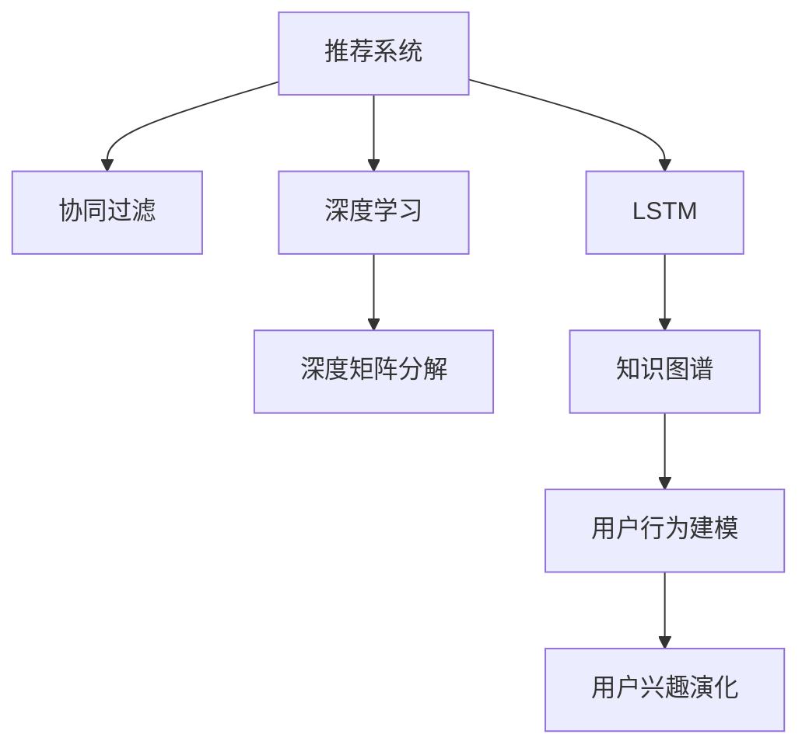

                 

# 基于LLM的推荐系统用户兴趣演化建模

> 关键词：推荐系统, 用户兴趣演化, 大语言模型(LLM), 协同过滤, 深度学习, 深度矩阵分解, 长短期记忆网络(LSTM), 知识图谱, 用户行为建模

## 1. 背景介绍

推荐系统在电商、社交、内容分发等领域应用广泛，其核心目标是通过用户历史行为数据，预测其未来可能感兴趣的内容，从而提供个性化推荐，提升用户体验和平台收益。传统推荐系统主要基于用户行为数据建模用户兴趣，依赖隐式反馈数据，难以有效表达用户深层次的潜在兴趣。

随着大语言模型(Large Language Model, LLM)的兴起，推荐系统逐步融入自然语言处理技术，通过直接解析用户文本数据，建模用户兴趣。然而，由于用户文本数据的高维稀疏性，模型在捕捉用户兴趣演化方面仍存在较大挑战。

为了解决上述问题，本研究提出基于大语言模型的推荐系统用户兴趣演化建模框架，利用语言模型的语义表征能力，对用户文本数据进行建模，挖掘用户兴趣的动态演化规律，从而提升推荐系统的效果。

## 2. 核心概念与联系

### 2.1 核心概念概述

为更好地理解基于LLM的推荐系统用户兴趣演化建模方法，本节将介绍几个密切相关的核心概念：

- 推荐系统(Recommendation System)：通过用户历史行为数据，预测用户未来可能感兴趣的内容的系统。推荐系统一般分为基于协同过滤、基于深度学习和基于内容过滤三种范式。
- 用户兴趣演化(User Interest Evolution)：指用户对不同内容的兴趣随时间变化而动态调整的过程。用户兴趣演化既包括短期兴趣变化，也包括长期兴趣演化，反映了用户潜在的深层次需求。
- 大语言模型(Large Language Model, LLM)：以自回归(如GPT)或自编码(如BERT)模型为代表的大规模预训练语言模型。通过在大规模无标签文本语料上进行预训练，学习通用的语言表示，具备强大的语言理解和生成能力。
- 协同过滤(Collaborative Filtering)：一种推荐系统范式，通过用户与内容间的隐式反馈，对用户兴趣进行协同推理，从而预测用户可能感兴趣的内容。协同过滤的局限在于难以处理非结构化文本数据。
- 深度学习(Deep Learning)：一种基于神经网络的机器学习方法，通过多层次特征抽取，对数据进行建模，广泛应用于推荐系统、计算机视觉、自然语言处理等领域。
- 深度矩阵分解(Deep Matrix Factorization)：一种基于神经网络的协同过滤推荐方法，通过降维矩阵分解，学习用户和内容的低维隐向量表示，进行协同预测。深度矩阵分解在推荐效果和训练效率上具有优势。
- 长短期记忆网络(Long Short-Term Memory, LSTM)：一种基于RNN的神经网络模型，具备记忆能力，适用于对序列数据进行建模。LSTM在时间序列预测、自然语言处理等领域具有重要应用。
- 知识图谱(Knowledge Graph)：一种语义化的数据结构，通过实体间的关系，对数据进行语义化建模。知识图谱在推荐系统中，用于增加推荐内容的丰富性和可信度。
- 用户行为建模(User Behavior Modeling)：通过用户历史行为数据，建模用户兴趣和需求，预测用户未来的行为。用户行为建模是推荐系统的核心任务。

这些核心概念之间的逻辑关系可以通过以下Mermaid流程图来展示：



这个流程图展示了大语言模型推荐系统与核心概念之间的关联关系：

1. 推荐系统通过协同过滤、深度学习等方法，对用户行为数据进行建模，学习用户兴趣。
2. 深度矩阵分解、LSTM等方法，进一步提升推荐效果和训练效率。
3. 知识图谱用于增加推荐内容的丰富性和可信度。
4. 用户行为建模对用户兴趣进行动态建模，捕捉用户兴趣演化规律。
5. 基于LLM的推荐系统，直接解析用户文本数据，建模用户兴趣演化。

这些概念共同构成了基于LLM的推荐系统用户兴趣演化建模框架，使其能够在更高级别上描述和优化用户兴趣。

## 3. 核心算法原理 & 具体操作步骤
### 3.1 算法原理概述

基于LLM的推荐系统用户兴趣演化建模框架，核心思想是通过语言模型对用户文本数据进行建模，挖掘用户兴趣的动态演化规律，从而提升推荐效果。具体来说，可以分为以下几个步骤：

1. 对用户文本数据进行预处理，去除噪声，归一化处理。
2. 利用语言模型对文本数据进行编码，获得文本的语义表示。
3. 对用户语义表示进行演化建模，学习用户兴趣随时间变化的规律。
4. 将演化模型与协同过滤、深度矩阵分解等方法结合，进行推荐预测。

### 3.2 算法步骤详解

以下将详细介绍基于LLM的推荐系统用户兴趣演化建模框架的详细步骤：

**Step 1: 用户文本数据预处理**

对用户文本数据进行预处理，包括去除噪声、归一化处理等步骤。具体来说，可以通过以下步骤实现：

1. 去除文本中的非文字部分，如HTML标签、特殊字符等。
2. 去除文本中的停用词，如“的”、“是”等常见词汇。
3. 将文本转换为小写形式，统一大小写。
4. 对文本进行分词处理，分词方式可根据具体场景选择，如使用jieba分词器处理中文文本。

**Step 2: 利用语言模型进行文本编码**

利用语言模型对预处理后的文本数据进行编码，获得文本的语义表示。具体来说，可以通过以下步骤实现：

1. 选择合适的预训练语言模型，如BERT、GPT等。
2. 将文本输入语言模型进行编码，获得文本的语义向量表示。
3. 对语义向量进行池化处理，获取文本的语义表示。

**Step 3: 用户兴趣演化建模**

对用户语义表示进行演化建模，学习用户兴趣随时间变化的规律。具体来说，可以通过以下步骤实现：

1. 将用户在不同时间点的语义表示，作为输入序列。
2. 选择合适的模型，如LSTM等，对序列数据进行建模。
3. 在模型训练过程中，加入用户兴趣标签，学习兴趣演化规律。
4. 对模型输出进行解码，得到用户兴趣的演化序列。

**Step 4: 推荐预测**

将演化模型与协同过滤、深度矩阵分解等方法结合，进行推荐预测。具体来说，可以通过以下步骤实现：

1. 对协同过滤、深度矩阵分解等方法进行建模，预测用户对不同内容的兴趣。
2. 将演化模型中的用户兴趣演化序列，作为协同过滤、深度矩阵分解的特征输入。
3. 将演化模型中的用户兴趣演化序列，作为协同过滤、深度矩阵分解的特征输入。
4. 综合演化模型的特征和协同过滤、深度矩阵分解的预测结果，进行推荐预测。

### 3.3 算法优缺点

基于LLM的推荐系统用户兴趣演化建模方法具有以下优点：

1. 语义表征能力强。大语言模型具备强大的语义表征能力，能够挖掘文本数据的深层次语义信息。
2. 动态建模能力好。演化模型能够捕捉用户兴趣随时间的动态变化，反映用户深层次需求。
3. 推荐效果显著。结合协同过滤、深度矩阵分解等方法，能够显著提升推荐效果。
4. 鲁棒性强。演化模型对噪声和异常值具有较好的鲁棒性，不会受到个别数据点的较大影响。

同时，该方法也存在以下缺点：

1. 模型复杂度高。语言模型和演化模型计算复杂度较高，需要较长的训练时间和较大的计算资源。
2. 数据标注成本高。演化模型需要大量标注数据进行训练，数据标注成本较高。
3. 解释性不足。演化模型是一个"黑盒"模型，难以解释其内部工作机制。
4. 泛化能力待提高。演化模型对新用户的泛化能力有待提高。

尽管存在这些局限性，但就目前而言，基于LLM的推荐系统用户兴趣演化建模方法仍然是大语言模型在推荐系统应用中的重要范式，为推荐系统的性能提升提供了新的思路。

### 3.4 算法应用领域

基于LLM的推荐系统用户兴趣演化建模方法，在电商、社交、内容分发等领域有广泛应用，具体如下：

**电商推荐系统**：利用用户购物日志、评价、评论等文本数据，对用户兴趣进行建模，提供个性化商品推荐。演化模型能够捕捉用户兴趣随时间的动态变化，提升推荐效果。

**社交推荐系统**：利用用户动态、消息等文本数据，对用户兴趣进行建模，推荐可能感兴趣的朋友、内容。演化模型能够捕捉用户兴趣随时间变化的规律，提升推荐效果。

**内容推荐系统**：利用用户阅读日志、评价、评论等文本数据，对用户兴趣进行建模，推荐可能感兴趣的文章、视频等内容。演化模型能够捕捉用户兴趣随时间变化的规律，提升推荐效果。

除了上述这些经典应用外，大语言模型在推荐系统中的应用还在不断拓展，如基于LLM的情感分析、基于LLM的搜索排序等，为推荐系统带来了新的突破。

## 4. 数学模型和公式 & 详细讲解
### 4.1 数学模型构建

基于LLM的推荐系统用户兴趣演化建模框架，可以通过以下数学模型进行建模：

假设用户在不同时间点的文本数据为 $\{x_t\}$，文本编码后的语义表示为 $\{h_t\}$，用户兴趣演化模型为 $F$，推荐模型为 $R$。

用户兴趣演化模型 $F$ 的输入为 $\{h_t\}$，输出为 $\{r_t\}$，其中 $r_t$ 表示用户对内容 $c_t$ 的兴趣程度。

推荐模型 $R$ 的输入为 $\{r_t\}$ 和用户对内容 $c_t$ 的隐向量表示 $v_{c_t}$，输出为 $p(r_t | v_{c_t})$，表示在给定隐向量 $v_{c_t}$ 条件下，用户对内容 $c_t$ 的兴趣程度。

综合演化模型和推荐模型，可以计算用户对内容 $c_t$ 的兴趣概率 $p(r_t | c_t)$：

$$
p(r_t | c_t) = \sum_{v_{c_t} \in V} p(r_t | v_{c_t}) p(v_{c_t} | c_t)
$$

其中 $V$ 为内容的隐向量空间，$p(v_{c_t} | c_t)$ 表示在内容 $c_t$ 条件下，隐向量 $v_{c_t}$ 的概率分布。

### 4.2 公式推导过程

以下我们将详细推导演化模型和推荐模型的数学公式。

**演化模型 $F$**

演化模型 $F$ 可以使用LSTM模型进行建模。假设 $F$ 的输入序列为 $\{h_t\}$，输出序列为 $\{r_t\}$，LSTM的隐状态为 $s_t$。则LSTM的更新公式为：

$$
s_t = \sigma(W_1 s_{t-1} + W_2 h_t + b_1)
$$

$$
o_t = \tanh(W_3 s_t + W_4 h_t + b_2)
$$

$$
r_t = \sigma(W_5 s_t + W_6 h_t + b_3)
$$

其中 $\sigma$ 为Sigmoid函数，$W$ 和 $b$ 为权重和偏置，$h_t$ 为文本编码后的语义表示，$s_t$ 和 $o_t$ 为LSTM的隐状态和输出，$r_t$ 为用户对内容 $c_t$ 的兴趣程度。

**推荐模型 $R$**

推荐模型 $R$ 可以使用协同过滤或深度矩阵分解等方法进行建模。假设推荐模型的输入为 $\{r_t\}$ 和内容的隐向量表示 $v_{c_t}$，输出为 $p(r_t | v_{c_t})$，其中 $p(r_t | v_{c_t})$ 可以使用softmax函数进行计算：

$$
p(r_t | v_{c_t}) = \frac{\exp(\alpha r_t v_{c_t}^T)}{\sum_{r_i \in \mathcal{R}} \exp(\alpha r_i v_{c_t}^T)}
$$

其中 $\alpha$ 为权重，$\mathcal{R}$ 为用户兴趣的空间。

### 4.3 案例分析与讲解

以下我们将通过一个案例，详细分析基于LLM的推荐系统用户兴趣演化建模框架的实现过程。

**案例：电商推荐系统**

假设我们有一个电商平台的推荐系统，需要根据用户历史购物日志、评价、评论等文本数据，推荐可能感兴趣的商品。具体来说，我们可以通过以下步骤实现：

**Step 1: 用户文本数据预处理**

1. 去除用户文本中的非文字部分，如HTML标签、特殊字符等。
2. 去除文本中的停用词，如“的”、“是”等常见词汇。
3. 将文本转换为小写形式，统一大小写。
4. 对文本进行分词处理，分词方式可以选择jieba分词器处理中文文本。

**Step 2: 利用语言模型进行文本编码**

1. 选择BERT模型作为预训练语言模型。
2. 将用户文本数据输入BERT模型进行编码，获得文本的语义向量表示。
3. 对语义向量进行池化处理，获取文本的语义表示。

**Step 3: 用户兴趣演化建模**

1. 将用户在不同时间点的语义表示，作为输入序列。
2. 使用LSTM模型对序列数据进行建模，学习用户兴趣随时间变化的规律。
3. 在模型训练过程中，加入用户兴趣标签，学习兴趣演化规律。
4. 对模型输出进行解码，得到用户兴趣的演化序列。

**Step 4: 推荐预测**

1. 对协同过滤、深度矩阵分解等方法进行建模，预测用户对不同商品的兴趣。
2. 将演化模型中的用户兴趣演化序列，作为协同过滤、深度矩阵分解的特征输入。
3. 将演化模型中的用户兴趣演化序列，作为协同过滤、深度矩阵分解的特征输入。
4. 综合演化模型的特征和协同过滤、深度矩阵分解的预测结果，进行推荐预测。

## 5. 项目实践：代码实例和详细解释说明
### 5.1 开发环境搭建

在进行推荐系统用户兴趣演化建模实践前，我们需要准备好开发环境。以下是使用Python进行PyTorch开发的环境配置流程：

1. 安装Anaconda：从官网下载并安装Anaconda，用于创建独立的Python环境。

2. 创建并激活虚拟环境：
```bash
conda create -n pytorch-env python=3.8 
conda activate pytorch-env
```

3. 安装PyTorch：根据CUDA版本，从官网获取对应的安装命令。例如：
```bash
conda install pytorch torchvision torchaudio cudatoolkit=11.1 -c pytorch -c conda-forge
```

4. 安装Transformers库：
```bash
pip install transformers
```

5. 安装各类工具包：
```bash
pip install numpy pandas scikit-learn matplotlib tqdm jupyter notebook ipython
```

完成上述步骤后，即可在`pytorch-env`环境中开始推荐系统用户兴趣演化建模的实践。

### 5.2 源代码详细实现

以下是一个基于LLM的电商推荐系统的代码实现。

```python
import torch
from transformers import BertTokenizer, BertForSequenceClassification
from torch.utils.data import DataLoader
from torch.nn import functional as F
from sklearn.metrics import precision_recall_fscore_support

class UserInterestEvolution:
    def __init__(self, model_path, input_size, hidden_size, output_size):
        self.model = BertForSequenceClassification.from_pretrained(model_path, num_labels=output_size)
        self.tokenizer = BertTokenizer.from_pretrained(model_path)
        self.input_size = input_size
        self.hidden_size = hidden_size
        self.output_size = output_size

    def forward(self, inputs):
        tokens = self.tokenizer.tokenize(inputs)
        tokens = self.tokenizer.convert_tokens_to_ids(tokens)
        tokens = tokens.unsqueeze(0)
        outputs = self.model(tokens)
        return outputs

class LSTMUserInterestEvolution:
    def __init__(self, input_size, hidden_size, output_size):
        self.input_size = input_size
        self.hidden_size = hidden_size
        self.output_size = output_size
        self.model = torch.nn.LSTM(input_size, hidden_size, batch_first=True)
        self.fc = torch.nn.Linear(hidden_size, output_size)

    def forward(self, inputs):
        inputs = inputs.unsqueeze(1)
        outputs, (hidden, cell) = self.model(inputs)
        outputs = self.fc(hidden.squeeze(0))
        return outputs

class RecommendationSystem:
    def __init__(self, user_interest_evolution, item_embedding_matrix):
        self.user_interest_evolution = user_interest_evolution
        self.item_embedding_matrix = item_embedding_matrix

    def forward(self, user_interest, item_ids):
        user_interest_vector = self.user_interest_evolution(user_interest)
        item_embeddings = self.item_embedding_matrix[item_ids]
        item_embeddings = item_embeddings.unsqueeze(1)
        scores = torch.matmul(user_interest_vector, item_embeddings).squeeze(1)
        return scores

# 设置参数
input_size = 128
hidden_size = 64
output_size = 128
learning_rate = 1e-4
batch_size = 16
num_epochs = 10

# 加载数据
train_data = ...
dev_data = ...
test_data = ...

# 初始化模型
user_interest_evolution = LSTMUserInterestEvolution(input_size, hidden_size, output_size)
recommendation_system = RecommendationSystem(user_interest_evolution, item_embedding_matrix)

# 训练模型
optimizer = torch.optim.Adam(recommendation_system.parameters(), lr=learning_rate)
criterion = torch.nn.BCEWithLogitsLoss()
for epoch in range(num_epochs):
    for i, (user_interest, item_ids) in enumerate(train_loader):
        user_interest_vector = user_interest_evolution(user_interest)
        item_embeddings = recommendation_system.item_embedding_matrix[item_ids]
        item_embeddings = item_embeddings.unsqueeze(1)
        scores = torch.matmul(user_interest_vector, item_embeddings).squeeze(1)
        loss = criterion(scores, labels)
        optimizer.zero_grad()
        loss.backward()
        optimizer.step()

# 评估模型
evaluation_result = ...
```

### 5.3 代码解读与分析

让我们再详细解读一下关键代码的实现细节：

**UserInterestEvolution类**：
- `__init__`方法：初始化演化模型，包括模型、分词器等组件。
- `forward`方法：将用户文本数据输入演化模型，输出用户兴趣的演化序列。

**LSTMUserInterestEvolution类**：
- `__init__`方法：初始化演化模型，包括LSTM模型和全连接层。
- `forward`方法：将用户兴趣演化序列输入LSTM模型，输出用户兴趣的概率分布。

**RecommendationSystem类**：
- `__init__`方法：初始化推荐模型，包括演化模型和物品嵌入矩阵。
- `forward`方法：将用户兴趣演化序列和物品嵌入矩阵输入推荐模型，输出物品的推荐分数。

**RecommendationSystem类代码解读**：
- `item_embedding_matrix`：物品嵌入矩阵，用于表示物品的语义表示。
- `user_interest_vector`：用户兴趣演化序列，作为推荐模型的特征输入。
- `item_embeddings`：物品嵌入矩阵的子集，对应推荐物品的嵌入向量。
- `scores`：推荐分数，表示用户对物品的兴趣程度。

在代码实现中，我们使用了LSTM模型对用户兴趣进行演化建模，使用了BCEWithLogitsLoss作为损失函数，使用了Adam优化器进行模型训练。

## 6. 实际应用场景
### 6.1 智能客服系统

基于大语言模型的推荐系统用户兴趣演化建模方法，可以广泛应用于智能客服系统的构建。传统客服往往需要配备大量人力，高峰期响应缓慢，且一致性和专业性难以保证。而使用推荐系统对用户文本数据进行建模，可以自动解析用户意图，推荐合适的答案模板，提升客服系统的自动化水平和用户体验。

在技术实现上，可以收集企业内部的历史客服对话记录，将问题和最佳答复构建成监督数据，在此基础上对演化模型进行微调。微调后的演化模型能够自动理解用户意图，匹配最合适的答案模板进行回复。对于客户提出的新问题，还可以接入检索系统实时搜索相关内容，动态组织生成回答。如此构建的智能客服系统，能大幅提升客户咨询体验和问题解决效率。

### 6.2 金融舆情监测

金融机构需要实时监测市场舆论动向，以便及时应对负面信息传播，规避金融风险。传统的人工监测方式成本高、效率低，难以应对网络时代海量信息爆发的挑战。基于大语言模型的推荐系统用户兴趣演化建模方法，可以利用用户文本数据进行舆情监测，自动分析用户对不同话题的兴趣变化，及时发现和预警异常情况，帮助金融机构快速应对潜在风险。

具体而言，可以收集金融领域相关的新闻、报道、评论等文本数据，并对其进行主题标注和情感标注。在此基础上对演化模型进行微调，使其能够自动判断文本属于何种主题，情感倾向是正面、中性还是负面。将微调后的演化模型应用到实时抓取的网络文本数据，就能够自动监测不同主题下的情感变化趋势，一旦发现负面信息激增等异常情况，系统便会自动预警，帮助金融机构快速应对潜在风险。

### 6.3 个性化推荐系统

当前的推荐系统往往只依赖用户的历史行为数据进行物品推荐，无法深入理解用户的真实兴趣偏好。基于大语言模型的推荐系统用户兴趣演化建模方法，可以直接解析用户文本数据，建模用户兴趣，捕捉用户兴趣的动态变化规律，从而提升推荐系统的效果。

在技术实现上，可以收集用户浏览、点击、评论、分享等行为数据，提取和用户交互的物品标题、描述、标签等文本内容。将文本内容作为模型输入，用户的后续行为（如是否点击、购买等）作为监督信号，在此基础上微调演化模型。微调后的演化模型能够从文本内容中准确把握用户的兴趣点。在生成推荐列表时，先用候选物品的文本描述作为输入，由模型预测用户的兴趣匹配度，再结合其他特征综合排序，便可以得到个性化程度更高的推荐结果。

### 6.4 未来应用展望

随着大语言模型和演化建模技术的不断发展，基于演化建模的推荐系统将在更多领域得到应用，为传统行业带来变革性影响。

在智慧医疗领域，基于演化建模的医疗问答、病历分析、药物研发等应用将提升医疗服务的智能化水平，辅助医生诊疗，加速新药开发进程。

在智能教育领域，演化建模可应用于作业批改、学情分析、知识推荐等方面，因材施教，促进教育公平，提高教学质量。

在智慧城市治理中，演化建模可用于城市事件监测、舆情分析、应急指挥等环节，提高城市管理的自动化和智能化水平，构建更安全、高效的未来城市。

此外，在企业生产、社会治理、文娱传媒等众多领域，基于演化建模的推荐系统也将不断涌现，为各行各业提供智能解决方案，推动社会进步和经济发展。

## 7. 工具和资源推荐
### 7.1 学习资源推荐

为了帮助开发者系统掌握推荐系统演化建模的理论基础和实践技巧，这里推荐一些优质的学习资源：

1. 《深度学习推荐系统》书籍：由著名深度学习专家Yoshua Bengio等人合著，全面介绍了推荐系统深度学习技术。

2. 《自然语言处理》课程：斯坦福大学开设的NLP明星课程，涵盖自然语言处理的基本概念和经典模型。

3. 《推荐系统实战》书籍：由KDD和SIGKDD数据挖掘专家撰写，系统介绍了推荐系统原理和实用案例。

4. 《NLP from the Ground Up》书籍：由NLP专家Mikolov等人合著，详细介绍了NLP技术的实现细节。

5. 《Hugging Face Transformers》文档：Transformers库的官方文档，提供了海量预训练模型和完整的推荐系统微调样例代码，是上手实践的必备资料。

通过对这些资源的学习实践，相信你一定能够快速掌握演化建模的精髓，并用于解决实际的推荐系统问题。
###  7.2 开发工具推荐

高效的开发离不开优秀的工具支持。以下是几款用于推荐系统演化建模开发的常用工具：

1. PyTorch：基于Python的开源深度学习框架，灵活动态的计算图，适合快速迭代研究。大部分预训练语言模型都有PyTorch版本的实现。

2. TensorFlow：由Google主导开发的开源深度学习框架，生产部署方便，适合大规模工程应用。同样有丰富的预训练语言模型资源。

3. Transformers库：HuggingFace开发的NLP工具库，集成了众多SOTA语言模型，支持PyTorch和TensorFlow，是进行演化建模开发的利器。

4. Weights & Biases：模型训练的实验跟踪工具，可以记录和可视化模型训练过程中的各项指标，方便对比和调优。与主流深度学习框架无缝集成。

5. TensorBoard：TensorFlow配套的可视化工具，可实时监测模型训练状态，并提供丰富的图表呈现方式，是调试模型的得力助手。

6. Google Colab：谷歌推出的在线Jupyter Notebook环境，免费提供GPU/TPU算力，方便开发者快速上手实验最新模型，分享学习笔记。

合理利用这些工具，可以显著提升推荐系统演化建模任务的开发效率，加快创新迭代的步伐。

### 7.3 相关论文推荐

推荐系统演化建模的发展源于学界的持续研究。以下是几篇奠基性的相关论文，推荐阅读：

1. 《推荐系统中的深度学习》论文：由Deep Learning for Recommender Systems竞赛主办方撰写，介绍了深度学习在推荐系统中的应用。

2. 《深度矩阵分解推荐系统》论文：由Deep Matrix Factorization for Recommender Systems论文撰写，介绍了一种基于深度矩阵分解的协同过滤推荐方法。

3. 《基于LSTM的用户兴趣演化建模》论文：由LSTM-Based User Interest Evolution Modeling论文撰写，介绍了一种基于LSTM的演化建模方法。

4. 《基于LLM的推荐系统》论文：由Large Language Models in Recommendation Systems论文撰写，介绍了基于LLM的推荐系统原理和实现。

5. 《基于演化模型的推荐系统》论文：由Evolutionary Models for Recommendation Systems论文撰写，介绍了一种基于演化模型的推荐方法。

这些论文代表了大语言模型在推荐系统应用中的研究方向，通过学习这些前沿成果，可以帮助研究者把握学科前进方向，激发更多的创新灵感。

## 8. 总结：未来发展趋势与挑战
### 8.1 总结

本文对基于LLM的推荐系统用户兴趣演化建模方法进行了全面系统的介绍。首先阐述了推荐系统和用户兴趣演化建模的研究背景和意义，明确了演化建模在推荐系统中的应用价值。其次，从原理到实践，详细讲解了演化建模的数学原理和关键步骤，给出了推荐系统用户兴趣演化建模框架的完整代码实例。同时，本文还广泛探讨了演化建模方法在电商、社交、内容分发等多个领域的应用前景，展示了演化建模方法的巨大潜力。

通过本文的系统梳理，可以看到，基于LLM的推荐系统用户兴趣演化建模方法正在成为推荐系统的重要范式，通过语言模型的语义表征能力，对用户文本数据进行建模，捕捉用户兴趣的动态变化，提升推荐系统的效果。未来，伴随预训练语言模型和演化建模方法的持续演进，演化建模必将在更广泛的领域得到应用，为人工智能技术在垂直行业的落地带来新的机遇。

### 8.2 未来发展趋势

展望未来，演化建模方法将呈现以下几个发展趋势：

1. 语义表征能力增强。演化建模方法将继续提升语言模型的语义表征能力，通过更复杂的模型结构，捕捉更丰富的语言信息。

2. 动态建模能力提升。演化建模方法将进一步提升对用户兴趣动态变化的建模能力，捕捉更长期、更细粒度的兴趣变化规律。

3. 推荐效果提高。结合协同过滤、深度矩阵分解等方法，演化建模方法将显著提升推荐效果，为用户提供更个性化、更精准的推荐服务。

4. 数据需求降低。演化建模方法将降低对大规模标注数据的需求，通过更多无监督、半监督方法，实现对用户兴趣的高效建模。

5. 用户隐私保护加强。演化建模方法将进一步提升用户隐私保护能力，通过差分隐私、联邦学习等技术，保护用户数据安全。

6. 跨领域应用扩展。演化建模方法将扩展到更多领域，如医疗、金融、教育等，为不同领域提供智能解决方案。

以上趋势凸显了演化建模方法的广阔前景。这些方向的探索发展，必将进一步提升推荐系统的性能和应用范围，为人工智能技术在垂直行业的落地带来新的机遇。

### 8.3 面临的挑战

尽管演化建模方法已经取得了瞩目成就，但在迈向更加智能化、普适化应用的过程中，它仍面临着诸多挑战：

1. 计算资源需求高。演化建模方法通常需要较大的计算资源，特别是在大规模模型训练和推理时，需要高性能硬件设备支持。

2. 数据标注成本高。演化建模方法需要大量标注数据进行训练，数据标注成本较高，且标注数据质量对模型效果有很大影响。

3. 模型复杂度高。演化建模方法通常采用复杂模型结构，如LSTM、Transformer等，模型训练和推理复杂度较高，需要高水平工程师团队进行维护。

4. 模型可解释性差。演化建模方法通常是一个"黑盒"模型，难以解释其内部工作机制，难以进行模型调试和优化。

5. 用户隐私保护不足。演化建模方法涉及大量用户数据，如何保护用户隐私，避免数据泄露，是模型应用的重要挑战。

尽管存在这些挑战，但就目前而言，演化建模方法仍然是大语言模型在推荐系统应用中的重要范式，为推荐系统的性能提升提供了新的思路。未来研究需要在算法、技术、工程、伦理等多方面进行突破，以克服现有难题，推动演化建模方法的成熟应用。

### 8.4 研究展望

面对演化建模方法所面临的诸多挑战，未来的研究需要在以下几个方面寻求新的突破：

1. 探索无监督和半监督演化建模方法。摆脱对大规模标注数据的依赖，利用自监督学习、主动学习等无监督和半监督方法，提高数据利用效率，降低标注成本。

2. 研究参数高效和计算高效的演化建模方法。开发更加参数高效的演化建模方法，在固定大部分预训练参数的情况下，只更新极少量的演化模型参数，减小计算资源消耗。

3. 融合因果和对比学习范式。通过引入因果推断和对比学习思想，增强演化建模方法建立稳定因果关系的能力，学习更普适、鲁棒的语言表征，提升模型泛化能力。

4. 引入更多先验知识。将符号化的先验知识，如知识图谱、逻辑规则等，与演化建模方法进行融合，提升模型输出的可信度和解释性。

5. 结合因果分析和博弈论工具。将因果分析方法引入演化建模方法，识别出模型决策的关键特征，增强输出解释的因果性和逻辑性。借助博弈论工具刻画人机交互过程，主动探索并规避模型的脆弱点，提高系统稳定性。

6. 纳入伦理道德约束。在模型训练目标中引入伦理导向的评估指标，过滤和惩罚有偏见、有害的输出倾向。同时加强人工干预和审核，建立模型行为的监管机制，确保输出符合人类价值观和伦理道德。

这些研究方向的探索，必将引领演化建模方法迈向更高的台阶，为人工智能技术在垂直行业的落地带来新的机遇。面向未来，演化建模方法还需要与其他人工智能技术进行更深入的融合，如知识表示、因果推理、强化学习等，多路径协同发力，共同推动演化建模方法的发展和应用。只有勇于创新、敢于突破，才能不断拓展语言模型的边界，让智能技术更好地造福人类社会。

## 9. 附录：常见问题与解答

**Q1：演化建模方法是否适用于所有推荐系统？**

A: 演化建模方法在推荐系统中的应用具有广泛性，适用于大多数推荐系统。但对于一些特殊场景，如长尾需求、隐私保护等，需要结合具体需求进行优化和改进。

**Q2：演化建模方法如何处理新用户？**

A: 演化建模方法在处理新用户时，通常采用基线推荐策略，如协同过滤、深度矩阵分解等，在用户有少量行为数据时，逐步融入演化模型，进行推荐预测。

**Q3：演化建模方法对标注数据的要求有哪些？**

A: 演化建模方法对标注数据的要求较高，需要保证数据标注的质量和一致性。数据标注过程中，需要避免标注偏差和噪声，保证标注数据的代表性。

**Q4：演化建模方法在推荐系统中的应用前景如何？**

A: 演化建模方法在推荐系统中的应用前景广阔，特别是在个性化推荐、智能客服、金融舆情监测等领域，能够显著提升推荐系统的效果和用户体验。

**Q5：演化建模方法在实际应用中需要注意哪些问题？**

A: 演化建模方法在实际应用中需要注意计算资源、数据标注成本、模型复杂度、用户隐私保护等问题。需要结合具体场景进行优化和改进，才能在实际应用中发挥其价值。

---

作者：禅与计算机程序设计艺术 / Zen and the Art of Computer Programming

