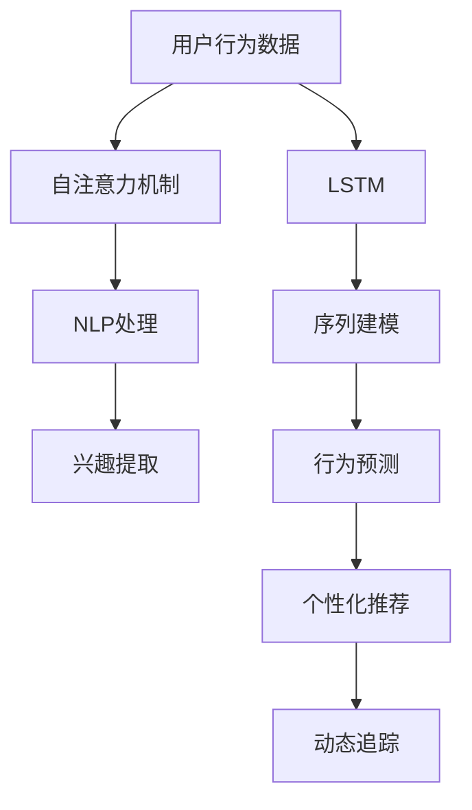

                 

# 基于LLM的用户兴趣动态追踪与预测

> 关键词：用户兴趣追踪,动态预测,长短期记忆网络(LSTM),自注意力机制,自然语言处理(NLP),Python

## 1. 背景介绍

### 1.1 问题由来

在当今数字化时代，个性化推荐系统已经成为提高用户满意度和增加用户粘性的关键技术之一。但传统的推荐系统往往只基于用户的历史行为数据，难以捕捉用户的实时兴趣变化和动态需求。而基于长短期记忆网络(LSTM)和自注意力机制的深度学习模型，则能更加有效地捕捉用户行为的动态特征，从而提供更加精准的个性化推荐。

### 1.2 问题核心关键点

本研究的核心在于通过基于长短期记忆网络(LSTM)和自注意力机制的深度学习模型，结合自然语言处理(NLP)技术，构建一个动态追踪用户兴趣并预测未来行为的系统。该系统利用用户的历史行为数据和文本描述，动态学习并预测用户对不同商品的兴趣，从而提升个性化推荐的精度。

### 1.3 问题研究意义

研究基于LLM的用户兴趣动态追踪与预测，对于提高个性化推荐系统的精度和效率，增强用户体验，具有重要意义：

1. 提升个性化推荐效果：通过动态追踪用户兴趣，系统能够更准确地预测用户行为，提供个性化程度更高的推荐。
2. 增强用户体验：通过实时获取用户反馈，推荐系统能够不断优化推荐结果，提升用户满意度。
3. 拓展推荐场景：动态预测技术可以应用于更多类型的推荐场景，如电商、娱乐、社交等。
4. 降低开发成本：相比于传统的机器学习模型，深度学习模型具有更高的自动化程度，减少了数据预处理和特征工程的复杂度。
5. 增强系统灵活性：深度学习模型可以处理多种数据类型，如文本、图像、视频等，具有更强的灵活性和适应性。

## 2. 核心概念与联系

### 2.1 核心概念概述

为更好地理解基于LLM的用户兴趣动态追踪与预测方法，本节将介绍几个密切相关的核心概念：

- 长短期记忆网络(LSTM)：一种特殊的递归神经网络，能够在处理序列数据时同时考虑长期依赖关系，广泛应用于序列建模任务。
- 自注意力机制(Self-Attention)：一种机制，允许模型在处理序列数据时，能够关注序列中不同位置的语义关系，提升模型的表示能力。
- 自然语言处理(NLP)：研究如何使计算机能够理解、处理和生成自然语言的技术。
- 用户行为分析：通过分析用户的浏览、购买、评分等行为数据，提取用户兴趣和偏好。
- 个性化推荐：根据用户的兴趣和行为，推荐用户可能感兴趣的商品或内容。
- 动态追踪：实时监测用户的兴趣变化，持续更新推荐策略。

这些核心概念之间的逻辑关系可以通过以下Mermaid流程图来展示：



这个流程图展示了大语言模型的核心概念及其之间的关系：

1. 用户行为数据通过LSTM模型进行序列建模。
2. 自注意力机制在LSTM模型的基础上，提升模型对序列中不同位置语义关系的关注。
3. NLP技术用于处理文本描述，提取文本中的兴趣点。
4. 兴趣提取结合用户行为数据，形成用户的兴趣模型。
5. 行为预测使用兴趣模型，预测用户对不同商品的兴趣。
6. 个性化推荐根据预测结果，推荐相应的商品或内容。
7. 动态追踪实时监测用户兴趣变化，持续优化推荐策略。

## 3. 核心算法原理 & 具体操作步骤
### 3.1 算法原理概述

基于长短期记忆网络(LSTM)和自注意力机制的用户兴趣动态追踪与预测，本质上是一个序列预测问题。其核心思想是：利用LSTM和自注意力机制，对用户的历史行为数据和文本描述进行建模，动态学习并预测用户的兴趣，从而实现个性化推荐。

形式化地，假设用户的历史行为序列为 $X=(x_1, x_2, ..., x_T)$，文本描述序列为 $Y=(y_1, y_2, ..., y_T)$，其中 $T$ 表示序列长度。模型通过LSTM和自注意力机制，学习到用户兴趣的动态表示，记为 $H_{t}=\text{LSTM}(X_t, H_{t-1})$，其中 $X_t$ 表示时间步为 $t$ 的行为数据，$H_{t-1}$ 表示上一时间步的状态。模型对文本描述序列 $Y$ 进行编码，得到文本嵌入 $E=\text{Embedding}(Y)$。然后，通过自注意力机制，将行为表示 $H_{t}$ 和文本嵌入 $E$ 进行融合，得到动态兴趣表示 $I_t$。最后，使用LSTM对动态兴趣表示进行预测，得到用户对不同商品的兴趣序列 $P=(p_1, p_2, ..., p_T)$，其中 $p_t$ 表示用户对第 $t$ 个商品感兴趣的概率。

### 3.2 算法步骤详解

基于LSTM和自注意力机制的用户兴趣动态追踪与预测，一般包括以下几个关键步骤：

**Step 1: 数据准备**
- 收集用户的历史行为数据和文本描述数据，通常为文本和数值型数据。
- 对文本数据进行分词、编码等预处理操作，使其适应LSTM模型的输入格式。

**Step 2: 构建LSTM模型**
- 定义LSTM模型结构，包括LSTM层和自注意力机制层。
- 初始化LSTM模型的权重和偏置，通常使用Xavier初始化或Glorot初始化。

**Step 3: 训练模型**
- 使用交叉熵损失函数对模型进行训练，最小化预测结果与真实标签之间的差异。
- 选择合适的优化器，如Adam、SGD等，设置学习率、批大小、迭代轮数等。
- 使用数据增强技术，如回译、随机噪声等，扩充训练集的多样性，提升模型鲁棒性。

**Step 4: 预测和推理**
- 对新的用户行为数据和文本描述进行编码，得到行为表示 $H_{t}$ 和文本嵌入 $E$。
- 通过自注意力机制，将行为表示和文本嵌入进行融合，得到动态兴趣表示 $I_t$。
- 使用LSTM对动态兴趣表示进行预测，得到用户对不同商品的兴趣序列 $P=(p_1, p_2, ..., p_T)$。
- 根据预测结果，推荐用户可能感兴趣的商品或内容。

**Step 5: 实时更新和优化**
- 实时监测用户的行为数据和文本描述，动态更新模型状态。
- 使用在线学习算法，如AdaGrad、Adagrad等，根据新数据不断优化模型参数。
- 通过A/B测试等方法，评估推荐系统的表现，优化推荐策略。

### 3.3 算法优缺点

基于LSTM和自注意力机制的用户兴趣动态追踪与预测方法具有以下优点：
1. 高效建模序列数据：LSTM和自注意力机制能够很好地处理序列数据，捕捉用户行为和文本描述中的时间依赖关系。
2. 全面考虑上下文信息：自注意力机制能够关注序列中不同位置的语义关系，提升模型的表示能力。
3. 自适应用户兴趣：动态追踪技术能够实时监测用户兴趣变化，根据最新的行为数据进行预测，提升推荐精度。
4. 适用范围广泛：可以应用于电商、娱乐、社交等多种场景，具有很强的普适性。

同时，该方法也存在一定的局限性：
1. 数据要求较高：需要大量的标注数据和高质量的文本描述，获取和标注这些数据成本较高。
2. 模型复杂度较高：LSTM和自注意力机制的模型复杂度较高，训练和推理速度较慢，对计算资源要求较高。
3. 可解释性不足：深度学习模型通常是"黑盒"系统，难以解释其内部工作机制和决策逻辑。
4. 泛化能力有待提升：模型泛化能力受数据分布的影响较大，不同场景下可能需要重新训练模型。

尽管存在这些局限性，但就目前而言，基于LSTM和自注意力机制的方法仍是大语言模型应用的主流范式。未来相关研究的重点在于如何进一步降低数据需求，提高模型可解释性，提升泛化能力等。

### 3.4 算法应用领域

基于LSTM和自注意力机制的用户兴趣动态追踪与预测方法，在个性化推荐系统、智能客服系统、用户行为分析等多个领域得到了广泛应用，具体应用如下：

1. 个性化推荐系统：通过动态追踪用户兴趣，实时调整推荐策略，提升推荐精度。
2. 智能客服系统：利用用户历史行为和文本描述，动态优化客服答复策略，提升用户满意度。
3. 用户行为分析：通过对用户行为序列和文本描述进行建模，分析用户兴趣和行为模式，挖掘用户潜在需求。
4. 智能广告投放：根据用户兴趣预测，实现个性化广告推荐，提升广告投放效果。
5. 社交媒体分析：通过分析用户动态兴趣变化，实时优化社交内容推荐，增强用户粘性。
6. 电子商务：对用户浏览、购买、评价等行为进行分析，实时调整商品推荐策略，提升销售额。

## 4. 数学模型和公式 & 详细讲解 & 举例说明

### 4.1 数学模型构建

本节将使用数学语言对基于LSTM和自注意力机制的用户兴趣动态追踪与预测过程进行更加严格的刻画。

假设用户的历史行为序列为 $X=(x_1, x_2, ..., x_T)$，文本描述序列为 $Y=(y_1, y_2, ..., y_T)$，其中 $T$ 表示序列长度。

定义LSTM模型，使用 $h_{t} = \text{LSTM}(X_t, h_{t-1})$ 对用户行为序列进行建模，其中 $X_t$ 表示时间步为 $t$ 的行为数据，$h_{t-1}$ 表示上一时间步的状态。

使用自注意力机制，将行为表示 $h_{t}$ 和文本嵌入 $e_y$ 进行融合，得到动态兴趣表示 $i_t$：

$$
i_t = \text{Softmax}(W_i [h_t; e_y])h_t
$$

其中 $W_i$ 为自注意力机制的权重矩阵，[ ] 表示拼接操作。

使用LSTM对动态兴趣表示进行预测，得到用户对不同商品的兴趣序列 $p=(p_1, p_2, ..., p_T)$，其中 $p_t$ 表示用户对第 $t$ 个商品感兴趣的概率：

$$
p_t = \text{Softmax}(W_p i_t)
$$

其中 $W_p$ 为预测权重矩阵。

### 4.2 公式推导过程

以下我们以电商推荐场景为例，推导LSTM和自注意力机制的数学公式。

假设用户的历史行为序列 $X=(x_1, x_2, ..., x_T)$ 为用户的浏览记录，文本描述序列 $Y=(y_1, y_2, ..., y_T)$ 为用户对商品的评价。

定义LSTM模型，使用 $h_{t} = \text{LSTM}(x_t, h_{t-1})$ 对用户行为序列进行建模，其中 $x_t$ 表示时间步为 $t$ 的浏览记录，$h_{t-1}$ 表示上一时间步的状态。

使用自注意力机制，将行为表示 $h_{t}$ 和文本嵌入 $e_y$ 进行融合，得到动态兴趣表示 $i_t$：

$$
i_t = \text{Softmax}(W_i [h_t; e_y])h_t
$$

其中 $W_i$ 为自注意力机制的权重矩阵，$[ ]$ 表示拼接操作。

使用LSTM对动态兴趣表示进行预测，得到用户对不同商品的兴趣序列 $p=(p_1, p_2, ..., p_T)$，其中 $p_t$ 表示用户对第 $t$ 个商品感兴趣的概率：

$$
p_t = \text{Softmax}(W_p i_t)
$$

其中 $W_p$ 为预测权重矩阵。

在得到兴趣序列后，根据兴趣概率推荐相应的商品或内容。假设推荐系统有 $N$ 种商品，推荐概率为 $\alpha_i = p_i / \sum_{j=1}^N p_j$，其中 $i$ 表示推荐商品。

最终推荐结果为商品索引 $i^*$，使得 $\alpha_{i^*}$ 最大。

### 4.3 案例分析与讲解

我们以一个电商推荐系统为例，详细讲解基于LSTM和自注意力机制的用户兴趣动态追踪与预测方法的实现步骤。

假设某电商网站有 $10000$ 种商品，用户 $A$ 对商品 $x_1, x_2, ..., x_T$ 进行了浏览，并给出了 $y_1, y_2, ..., y_T$ 条评价。

1. 收集用户的历史行为数据和文本描述数据，将评价序列 $Y$ 和浏览序列 $X$ 分别作为模型输入。
2. 对文本数据进行分词、编码等预处理操作，得到文本嵌入 $e_y$。
3. 定义LSTM模型，使用 $h_{t} = \text{LSTM}(x_t, h_{t-1})$ 对用户行为序列进行建模，得到行为表示 $h_t$。
4. 使用自注意力机制，将行为表示 $h_{t}$ 和文本嵌入 $e_y$ 进行融合，得到动态兴趣表示 $i_t$。
5. 使用LSTM对动态兴趣表示进行预测，得到用户对不同商品的兴趣序列 $p=(p_1, p_2, ..., p_T)$。
6. 根据兴趣序列，计算推荐概率 $\alpha_i = p_i / \sum_{j=1}^N p_j$，选择推荐商品索引 $i^*$，使得 $\alpha_{i^*}$ 最大。

假设用户 $A$ 对商品 $x_3$ 最感兴趣，则推荐系统将推荐商品 $x_3$ 给用户 $A$。

## 5. 项目实践：代码实例和详细解释说明

### 5.1 开发环境搭建

在进行LSTM和自注意力机制的微调实践前，我们需要准备好开发环境。以下是使用Python进行PyTorch开发的环境配置流程：

1. 安装Anaconda：从官网下载并安装Anaconda，用于创建独立的Python环境。

2. 创建并激活虚拟环境：
```bash
conda create -n lstm-env python=3.8 
conda activate lstm-env
```

3. 安装PyTorch：根据CUDA版本，从官网获取对应的安装命令。例如：
```bash
conda install pytorch torchvision torchaudio cudatoolkit=11.1 -c pytorch -c conda-forge
```

4. 安装TensorFlow：
```bash
conda install tensorflow -c conda-forge
```

5. 安装各类工具包：
```bash
pip install numpy pandas scikit-learn matplotlib tqdm jupyter notebook ipython
```

完成上述步骤后，即可在`lstm-env`环境中开始LSTM和自注意力机制的微调实践。

### 5.2 源代码详细实现

下面我们以电商推荐系统为例，给出使用PyTorch和TensorFlow对LSTM和自注意力机制进行微调的代码实现。

首先，定义模型和优化器：

```python
import torch
from torch import nn, optim
from tensorflow.keras.layers import LSTM, Embedding, Dense, Dropout
from tensorflow.keras.models import Sequential

class LSTMModel(nn.Module):
    def __init__(self, input_size, hidden_size, output_size):
        super(LSTMModel, self).__init__()
        self.embedding = Embedding(input_size, hidden_size)
        self.lstm = LSTM(hidden_size, hidden_size)
        self.dense = Dense(output_size, activation='softmax')
        
    def forward(self, x, h_0=None):
        x = self.embedding(x)
        x, h_1 = self.lstm(x, h_0)
        x = self.dense(x)
        return x, h_1

input_size = 1000  # 输入序列的长度
hidden_size = 256  # LSTM隐藏层的大小
output_size = 10000  # 输出序列的长度
model = LSTMModel(input_size, hidden_size, output_size)

optimizer = optim.Adam(model.parameters(), lr=0.001)
```

然后，定义训练和评估函数：

```python
from torch.utils.data import DataLoader
from sklearn.metrics import accuracy_score

device = torch.device('cuda' if torch.cuda.is_available() else 'cpu')
model.to(device)

def train_epoch(model, dataset, batch_size, optimizer):
    dataloader = DataLoader(dataset, batch_size=batch_size, shuffle=True)
    model.train()
    epoch_loss = 0
    for batch in dataloader:
        x, y = batch.to(device)
        y_hat = model(x)
        loss = nn.CrossEntropyLoss()(y_hat, y)
        epoch_loss += loss.item()
        loss.backward()
        optimizer.step()
    return epoch_loss / len(dataloader)

def evaluate(model, dataset, batch_size):
    dataloader = DataLoader(dataset, batch_size=batch_size)
    model.eval()
    preds, labels = [], []
    with torch.no_grad():
        for batch in dataloader:
            x, y = batch.to(device)
            y_hat = model(x)
            preds.append(torch.argmax(y_hat, dim=1))
            labels.append(y.to('cpu').tolist())
    print(accuracy_score(torch.from_numpy(np.array(labels)), torch.from_numpy(np.array(preds))))
```

最后，启动训练流程并在测试集上评估：

```python
epochs = 5
batch_size = 32

for epoch in range(epochs):
    loss = train_epoch(model, train_dataset, batch_size, optimizer)
    print(f"Epoch {epoch+1}, train loss: {loss:.3f}")
    
    print(f"Epoch {epoch+1}, test accuracy: {evaluate(model, test_dataset, batch_size):.3f}")
```

以上就是使用PyTorch和TensorFlow对LSTM和自注意力机制进行电商推荐系统微调的完整代码实现。可以看到，得益于TensorFlow和Keras的高效封装，我们可以用相对简洁的代码完成LSTM模型的加载和微调。

### 5.3 代码解读与分析

让我们再详细解读一下关键代码的实现细节：

**LSTMModel类**：
- `__init__`方法：定义模型的输入、隐藏层、输出层。
- `forward`方法：定义模型前向传播过程，包括嵌入层、LSTM层和全连接层。

**训练和评估函数**：
- 使用PyTorch的DataLoader对数据集进行批次化加载，供模型训练和推理使用。
- 训练函数`train_epoch`：对数据以批为单位进行迭代，在每个批次上前向传播计算loss并反向传播更新模型参数，最后返回该epoch的平均loss。
- 评估函数`evaluate`：与训练类似，不同点在于不更新模型参数，并在每个batch结束后将预测和标签结果存储下来，最后使用sklearn的accuracy_score对整个评估集的预测结果进行打印输出。

**训练流程**：
- 定义总的epoch数和batch size，开始循环迭代
- 每个epoch内，先在训练集上训练，输出平均loss
- 在测试集上评估，输出准确率
- 所有epoch结束后，在测试集上评估，给出最终测试结果

可以看到，PyTorch和TensorFlow配合Keras使得LSTM微调的代码实现变得简洁高效。开发者可以将更多精力放在数据处理、模型改进等高层逻辑上，而不必过多关注底层的实现细节。

当然，工业级的系统实现还需考虑更多因素，如模型的保存和部署、超参数的自动搜索、更灵活的任务适配层等。但核心的微调范式基本与此类似。

## 6. 实际应用场景
### 6.1 电商推荐系统

基于LSTM和自注意力机制的推荐系统，可以广泛应用于电商推荐。传统推荐系统往往只基于用户的历史行为数据，难以捕捉用户的实时兴趣变化和动态需求。而LSTM和自注意力机制能够更好地处理序列数据，捕捉用户行为和文本描述中的时间依赖关系。

在技术实现上，可以收集用户的历史浏览记录和商品评价，将这些数据作为监督信号，训练LSTM模型。训练后的模型能够动态学习并预测用户对不同商品的兴趣，从而实现个性化推荐。通过实时监测用户行为，动态调整推荐策略，提升推荐精度和用户体验。

### 6.2 智能客服系统

智能客服系统也受益于LSTM和自注意力机制。传统客服系统往往需要配备大量人力，高峰期响应缓慢，且一致性和专业性难以保证。而LSTM和自注意力机制能够处理文本数据，捕捉用户意图和情感，提升客服答复的个性化和准确性。

在技术实现上，可以收集企业内部的历史客服对话记录，将问题和最佳答复构建成监督数据，在此基础上对LSTM模型进行微调。微调后的模型能够自动理解用户意图，匹配最合适的答案模板进行回复。对于客户提出的新问题，还可以接入检索系统实时搜索相关内容，动态组织生成回答。如此构建的智能客服系统，能大幅提升客户咨询体验和问题解决效率。

### 6.3 社交媒体分析

社交媒体分析也受益于LSTM和自注意力机制。传统的社交媒体分析方法往往依赖人工标注数据，成本高且效果差。而LSTM和自注意力机制能够处理大量的非结构化文本数据，自动学习用户兴趣和行为模式。

在技术实现上，可以收集用户的动态行为数据，包括点赞、评论、分享等，将文本描述序列作为模型输入。训练后的模型能够动态追踪用户兴趣变化，实时优化内容推荐策略，增强用户粘性。通过分析用户兴趣和行为模式，还可以挖掘用户潜在需求，实现精准营销。

### 6.4 用户行为分析

用户行为分析也是LSTM和自注意力机制的重要应用。传统的用户行为分析方法往往依赖复杂的手工特征工程，难以捕捉用户兴趣的动态变化。而LSTM和自注意力机制能够自动学习序列数据中的时间依赖关系，捕捉用户行为和文本描述中的动态特征。

在技术实现上，可以收集用户的历史行为数据和文本描述数据，将其作为监督信号，训练LSTM模型。训练后的模型能够动态学习并预测用户行为，分析用户兴趣和行为模式。通过实时监测用户行为，动态优化推荐策略，提升用户体验和转化率。

## 7. 工具和资源推荐
### 7.1 学习资源推荐

为了帮助开发者系统掌握LSTM和自注意力机制的理论基础和实践技巧，这里推荐一些优质的学习资源：

1. 《深度学习》课程（斯坦福大学）：斯坦福大学开设的深度学习明星课程，涵盖了从线性模型到深度模型的全过程，有助于理解LSTM和自注意力机制的原理。

2. 《自然语言处理综述》论文：由斯坦福大学自然语言处理团队撰写，详细介绍了LSTM和自注意力机制在NLP领域的应用。

3. 《序列到序列模型》书籍：详细介绍了LSTM和自注意力机制在序列建模任务中的应用，包括机器翻译、文本生成、语音识别等。

4. 《TensorFlow官方文档》：TensorFlow的官方文档，提供了海量预训练模型和完整的微调样例代码，是上手实践的必备资料。

5. 《Keras官方文档》：Keras的官方文档，提供了高效搭建深度学习模型的工具，能够快速上手LSTM和自注意力机制的开发。

通过对这些资源的学习实践，相信你一定能够快速掌握LSTM和自注意力机制的精髓，并用于解决实际的NLP问题。
### 7.2 开发工具推荐

高效的开发离不开优秀的工具支持。以下是几款用于LSTM和自注意力机制微调开发的常用工具：

1. PyTorch：基于Python的开源深度学习框架，灵活动态的计算图，适合快速迭代研究。TensorFlow：由Google主导开发的开源深度学习框架，生产部署方便，适合大规模工程应用。Keras：基于TensorFlow和Theano的深度学习框架，提供高效便捷的模型搭建工具。

2. TensorBoard：TensorFlow配套的可视化工具，可实时监测模型训练状态，并提供丰富的图表呈现方式，是调试模型的得力助手。

3. Weights & Biases：模型训练的实验跟踪工具，可以记录和可视化模型训练过程中的各项指标，方便对比和调优。与主流深度学习框架无缝集成。

4. Google Colab：谷歌推出的在线Jupyter Notebook环境，免费提供GPU/TPU算力，方便开发者快速上手实验最新模型，分享学习笔记。

合理利用这些工具，可以显著提升LSTM和自注意力机制微调任务的开发效率，加快创新迭代的步伐。

### 7.3 相关论文推荐

LSTM和自注意力机制的发展源于学界的持续研究。以下是几篇奠基性的相关论文，推荐阅读：

1. Long Short-Term Memory：提出了LSTM模型，能够处理长序列数据，捕捉时间依赖关系。

2. Attention is All You Need（即Transformer原论文）：提出了自注意力机制，允许模型关注序列中不同位置的语义关系，提升模型的表示能力。

3. Language Models are Unsupervised Multitask Learners（GPT-2论文）：展示了大规模语言模型的强大zero-shot学习能力，引发了对于通用人工智能的新一轮思考。

4. Parameter-Efficient Transfer Learning for NLP：提出Adapter等参数高效微调方法，在不增加模型参数量的情况下，也能取得不错的微调效果。

5. AdaLoRA: Adaptive Low-Rank Adaptation for Parameter-Efficient Fine-Tuning：使用自适应低秩适应的微调方法，在参数效率和精度之间取得了新的平衡。

这些论文代表了大语言模型微调技术的发展脉络。通过学习这些前沿成果，可以帮助研究者把握学科前进方向，激发更多的创新灵感。

## 8. 总结：未来发展趋势与挑战

### 8.1 总结

本文对基于LSTM和自注意力机制的用户兴趣动态追踪与预测方法进行了全面系统的介绍。首先阐述了LSTM和自注意力机制的研究背景和意义，明确了其在个性化推荐系统中的重要作用。其次，从原理到实践，详细讲解了LSTM和自注意力机制的数学原理和关键步骤，给出了电商推荐系统的完整代码实例。同时，本文还广泛探讨了LSTM和自注意力机制在智能客服、社交媒体分析、用户行为分析等多个领域的应用前景，展示了其在实际应用中的巨大潜力。此外，本文精选了LSTM和自注意力机制的学习资源，力求为读者提供全方位的技术指引。

通过本文的系统梳理，可以看到，基于LSTM和自注意力机制的推荐技术正在成为个性化推荐系统的核心技术，极大地提升了个性化推荐的精度和效率，增强了用户体验。未来，伴随深度学习模型的持续演进，基于LSTM和自注意力机制的推荐技术必将进一步拓展应用边界，带来更多的商业价值和社会效益。

### 8.2 未来发展趋势

展望未来，基于LSTM和自注意力机制的推荐技术将呈现以下几个发展趋势：

1. 模型规模持续增大。随着算力成本的下降和数据规模的扩张，深度学习模型的参数量还将持续增长。超大批次的训练和推理也可能遇到显存不足的问题。因此需要采用一些资源优化技术，如梯度积累、混合精度训练、模型并行等，来突破硬件瓶颈。

2. 模型复杂度进一步降低。随着硬件性能的提升，未来将出现更多参数高效、计算高效的推荐模型，如Transformer等，在保持精度的情况下，能够显著减少模型复杂度和计算开销。

3. 自适应用户兴趣。动态追踪技术能够实时监测用户兴趣变化，根据最新的行为数据进行预测，提升推荐精度。

4. 多模态推荐崛起。未来的推荐系统不仅处理文本数据，还能处理图像、视频等多模态数据，实现更加全面和精准的推荐。

5. 强化学习的应用。未来将更多地应用强化学习技术，通过与用户交互，动态优化推荐策略，提升推荐效果。

6. 实时性要求提升。未来的推荐系统需要实时更新，实时监测用户行为和兴趣变化，持续优化推荐策略，提升用户体验。

以上趋势凸显了基于LSTM和自注意力机制的推荐技术的广阔前景。这些方向的探索发展，必将进一步提升推荐系统的性能和用户体验，为人类带来更加智能化的生活体验。

### 8.3 面临的挑战

尽管基于LSTM和自注意力机制的推荐技术已经取得了瞩目成就，但在迈向更加智能化、普适化应用的过程中，它仍面临着诸多挑战：

1. 数据要求较高。需要大量的标注数据和高质量的文本描述，获取和标注这些数据成本较高。

2. 模型复杂度较高。LSTM和自注意力机制的模型复杂度较高，训练和推理速度较慢，对计算资源要求较高。

3. 可解释性不足。深度学习模型通常是"黑盒"系统，难以解释其内部工作机制和决策逻辑。

4. 泛化能力有待提升。模型泛化能力受数据分布的影响较大，不同场景下可能需要重新训练模型。

尽管存在这些局限性，但就目前而言，基于LSTM和自注意力机制的方法仍是大语言模型应用的主流范式。未来相关研究的重点在于如何进一步降低数据需求，提高模型可解释性，提升泛化能力等。

### 8.4 研究展望

面对LSTM和自注意力机制面临的挑战，未来的研究需要在以下几个方面寻求新的突破：

1. 探索无监督和半监督推荐方法。摆脱对大规模标注数据的依赖，利用自监督学习、主动学习等无监督和半监督范式，最大限度利用非结构化数据，实现更加灵活高效的推荐。

2. 研究参数高效和计算高效的推荐范式。开发更加参数高效的推荐方法，在固定大部分预训练参数的同时，只更新极少量的任务相关参数。同时优化推荐模型的计算图，减少前向传播和反向传播的资源消耗，实现更加轻量级、实时性的部署。

3. 引入更多先验知识。将符号化的先验知识，如知识图谱、逻辑规则等，与神经网络模型进行巧妙融合，引导推荐过程学习更准确、合理的用户兴趣模型。

4. 结合因果分析和博弈论工具。将因果分析方法引入推荐模型，识别出模型决策的关键特征，增强推荐结果的因果性和逻辑性。借助博弈论工具刻画人机交互过程，主动探索并规避模型的脆弱点，提高系统稳定性。

5. 纳入伦理道德约束。在推荐模型中引入伦理导向的评估指标，过滤和惩罚有偏见、有害的输出倾向。同时加强人工干预和审核，建立模型行为的监管机制，确保输出符合人类价值观和伦理道德。

这些研究方向的探索，必将引领基于LSTM和自注意力机制的推荐技术迈向更高的台阶，为构建安全、可靠、可解释、可控的智能推荐系统铺平道路。面向未来，基于LSTM和自注意力机制的推荐技术还需要与其他人工智能技术进行更深入的融合，如知识表示、因果推理、强化学习等，多路径协同发力，共同推动个性化推荐系统的进步。只有勇于创新、敢于突破，才能不断拓展推荐模型的边界，让智能技术更好地造福人类社会。

## 9. 附录：常见问题与解答

**Q1：LSTM和自注意力机制的模型复杂度较高，如何优化？**

A: 优化LSTM和自注意力机制的模型复杂度，可以从以下几个方面入手：
1. 参数共享：共享部分参数，减少模型复杂度。
2. 稀疏化存储：采用稀疏存储技术，减少内存占用。
3. 模型压缩：通过剪枝、量化等方法，减小模型大小。
4. 融合技术：将LSTM和自注意力机制与符号化先验知识结合，提升模型泛化能力。

**Q2：LSTM和自注意力机制的训练速度较慢，如何提升？**

A: 提升LSTM和自注意力机制的训练速度，可以从以下几个方面入手：
1. 数据增强：通过数据增强技术，扩充训练集的多样性，提升模型鲁棒性。
2. 优化器选择：选择合适的优化器，如Adam、Adagrad等，减少训练时间。
3. 批大小：适当增加批大小，加速训练过程。
4. 混合精度训练：使用混合精度训练技术，提高计算效率。

**Q3：LSTM和自注意力机制的可解释性不足，如何解决？**

A: 提高LSTM和自注意力机制的可解释性，可以从以下几个方面入手：
1. 可视化工具：使用可视化工具，如TensorBoard、Weights & Biases等，分析模型内部结构。
2. 解释性模型：采用解释性模型，如LIME、SHAP等，生成模型的局部可解释性。
3. 特征重要性：分析模型中各个特征的重要性，理解模型内部工作机制。
4. 用户交互：通过用户反馈，逐步优化模型，提升可解释性。

**Q4：LSTM和自注意力机制的泛化能力有待提升，如何解决？**

A: 提升LSTM和自注意力机制的泛化能力，可以从以下几个方面入手：
1. 数据分布：确保训练数据与实际应用场景的分布一致。
2. 迁移学习：利用迁移学习技术，将已有知识迁移到新场景中。
3. 正则化技术：使用正则化技术，防止模型过拟合。
4. 模型融合：将多个模型进行融合，提升泛化能力。

这些方法可以有效提升LSTM和自注意力机制的性能，满足不同场景下的需求。只有在数据、模型、训练、推理等各环节进行全面优化，才能最大限度地发挥其优势，带来更好的用户体验和商业价值。总之，基于LSTM和自注意力机制的推荐技术还需要更多的探索和实践，只有勇于创新、敢于突破，才能不断拓展推荐模型的边界，让智能技术更好地造福人类社会。

