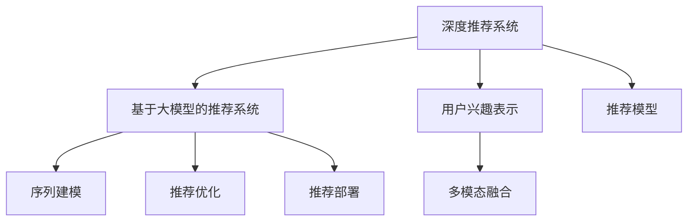

                 

## 1. 背景介绍

随着互联网的普及和信息爆炸，推荐系统已成为连接用户和内容的桥梁，为用户个性化浏览提供有力支撑。传统的推荐系统基于用户历史行为进行协同过滤、内容推荐等，但随着数据量的增长，这些方法面临维度过高、稀疏性等问题。近年来，基于深度学习的推荐系统逐渐兴起，通过学习用户行为隐含的语义信息，实现更高维度的推荐。

本文聚焦于基于大模型的推荐系统，介绍其原理与应用，探索如何利用大模型的强大表示能力，对用户兴趣进行高效探索与建模。相较于传统的推荐系统，基于大模型的推荐系统能够更好地适应多维度、多模态数据，提升推荐精度和覆盖率，为个性化推荐开辟新的可能性。

## 2. 核心概念与联系

### 2.1 核心概念概述

本文涉及的核心概念包括：

- 深度推荐系统(Deep Recommendation Systems)：通过深度神经网络进行推荐建模的推荐系统，较传统协同过滤算法具有更强的非线性建模能力，能够处理更复杂的用户兴趣表达。

- 基于大模型的推荐系统(Large Model-based Recommendation Systems)：使用预训练语言模型或视觉模型作为基础表示，在此基础上进行推荐任务微调的系统。其核心思想是利用大模型的丰富语言或视觉知识，学习用户的兴趣表达。

- 用户兴趣表示(User Interest Representation)：利用用户行为数据或文本、图像等多模态数据，提取用户兴趣的向量表示。其目标是准确捕捉用户对物品的偏好，以便进行推荐。

- 序列建模(Sequence Modeling)：基于用户历史行为构建用户兴趣的时间序列，利用RNN、LSTM等模型，捕捉用户兴趣的动态变化。

- 多模态融合(Multimodal Fusion)：结合用户不同模态的数据，如文本、图像、行为等，提取更全面、准确的兴趣表示。

这些概念之间的联系可以通过以下Mermaid流程图来展示：



这个流程图展示了大模型推荐系统的主要组成和数据流：

1. 深度推荐系统作为基础模型，用于构建用户兴趣表示。
2. 基于大模型的推荐系统在此基础上，通过序列建模和多模态融合进一步完善兴趣表示。
3. 推荐模型对用户兴趣进行评分预测，实现推荐排序。
4. 推荐优化对推荐结果进行微调，提升推荐效果。
5. 推荐部署将模型集成到实际应用中，为每个用户生成个性化推荐列表。

## 3. 核心算法原理 & 具体操作步骤
### 3.1 算法原理概述

基于大模型的推荐系统，本质上是利用预训练大模型学习用户兴趣的表示，再通过微调优化推荐模型。其核心思想是：首先，通过大模型学习用户行为数据或文本、图像等数据的语义表示；然后，将用户兴趣表示输入推荐模型，进行物品评分预测；最后，对预测结果进行排序，生成个性化推荐列表。

### 3.2 算法步骤详解

基于大模型的推荐系统一般包括以下几个关键步骤：

**Step 1: 准备数据集**

- 收集用户行为数据或文本、图像等多模态数据，构建推荐系统的训练集、验证集和测试集。用户行为数据一般包括点击、浏览、购买、评分等。
- 对数据进行清洗和预处理，如去除噪声、处理缺失值等。

**Step 2: 大模型预训练**

- 选择合适的预训练模型，如BERT、GPT-3等，进行大规模无监督预训练。预训练任务可以选择掩码语言模型、自编码器等。
- 使用大规模数据进行预训练，一般需要数百万乃至数十亿的数据量，以学习丰富的语言或视觉知识。

**Step 3: 微调任务适配层**

- 在大模型顶层设计合适的推荐任务适配层，如全连接层、注意力机制等。
- 选择推荐目标函数，如均方误差、交叉熵等，用于衡量预测评分与实际评分之间的差异。

**Step 4: 微调推荐模型**

- 将预训练模型作为初始化参数，通过有监督的微调优化推荐模型的参数。
- 对用户兴趣表示进行编码，输入到推荐模型中，计算预测评分。
- 定义推荐损失函数，利用优化算法如Adam、SGD等更新模型参数。

**Step 5: 推荐部署**

- 将微调后的推荐模型集成到实际应用中，如推荐界面、移动应用等。
- 实时获取用户输入的查询，对物品进行评分预测，并根据评分排序生成推荐列表。
- 定期收集用户反馈，重新微调推荐模型，优化推荐效果。

### 3.3 算法优缺点

基于大模型的推荐系统具有以下优点：

- 高效建模：大模型能高效学习多维度的用户兴趣，避免传统协同过滤算法面临的维度过高、稀疏性等问题。
- 泛化能力强：大模型的预训练知识具有很强的泛化能力，能较好地适应不同领域的推荐任务。
- 鲁棒性好：大模型对噪声数据和异常数据具有较强的鲁棒性，不易受到少量异常样本的影响。

同时，该方法也存在一些缺点：

- 计算资源需求高：大模型的预训练和微调需要大量计算资源，包括GPU、TPU等高性能设备。
- 部署复杂：微调后的推荐模型通常较大，部署在实际应用中需要考虑资源分配和计算效率。
- 解释性不足：基于大模型的推荐系统较为复杂，其推荐过程难以解释，用户难以理解推荐逻辑。

尽管存在这些局限性，基于大模型的推荐系统仍因其高效建模和强泛化能力，成为当前推荐系统的主流方向之一。

### 3.4 算法应用领域

基于大模型的推荐系统在多个领域得到了广泛应用，例如：

- 电商推荐：电商平台上，用户购买、浏览行为数据丰富，适合利用大模型进行个性化推荐。
- 视频推荐：视频平台上的用户行为数据多样，如观看时长、点赞、评论等，适合利用大模型进行视频推荐。
- 新闻推荐：新闻网站上的用户点击、阅读行为数据，适合利用大模型进行个性化新闻推荐。
- 音乐推荐：音乐平台上的用户听歌行为数据，适合利用大模型进行个性化音乐推荐。
- 社交媒体推荐：社交媒体上的用户点赞、评论、分享行为数据，适合利用大模型进行个性化社交媒体推荐。

以上场景只是冰山一角，未来基于大模型的推荐系统有望在更多领域得到应用，为各行各业带来更加智能化、个性化的服务。

## 4. 数学模型和公式 & 详细讲解 & 举例说明

### 4.1 数学模型构建

本节将使用数学语言对基于大模型的推荐系统进行更加严格的刻画。

记推荐系统数据集为 $D=\{(x_i,y_i)\}_{i=1}^N$，其中 $x_i$ 为输入（用户行为数据、文本、图像等）， $y_i$ 为输出（用户评分）。

定义推荐模型的预测函数为 $f(x;\theta)=\theta^T\phi(x)$，其中 $\theta$ 为模型参数，$\phi(x)$ 为用户兴趣表示。推荐目标为最小化预测误差，即：

$$
\min_{\theta} \sum_{i=1}^N (y_i - f(x_i;\theta))^2
$$

常见的优化算法如Adam、SGD等，通过求解上述目标函数的梯度，更新模型参数 $\theta$。

### 4.2 公式推导过程

以电商平台推荐为例，假设用户行为数据为 $x_i=(c_i,t_i)$，其中 $c_i$ 为点击行为，$t_i$ 为用户浏览时间。采用BERT模型对用户行为数据进行预训练，得到用户兴趣表示 $\phi(x_i)=BERT(x_i)$。将用户兴趣表示输入推荐模型，得到预测评分 $f(x_i;\theta)=\theta^T\phi(x_i)$。定义推荐损失函数为均方误差，则优化目标为：

$$
\min_{\theta} \sum_{i=1}^N (y_i - f(x_i;\theta))^2
$$

其中 $y_i$ 为用户对物品 $c_i$ 的评分。

### 4.3 案例分析与讲解

以音乐推荐系统为例，分析其具体应用和实现。

**数据准备**：
- 收集用户听歌行为数据，包括用户ID、歌曲ID、播放时长等。
- 对数据进行清洗和预处理，如去除噪声、处理缺失值等。

**预训练模型选择**：
- 选择BERT模型作为预训练基础模型。
- 使用用户行为数据进行预训练，定义自编码器任务 $\mathcal{L}_{AE}(x)=\frac{1}{2}\|x- \phi(x)\|^2$，其中 $x$ 为用户行为数据，$\phi(x)$ 为预训练输出。

**微调任务适配层设计**：
- 在大模型顶层设计推荐任务适配层，如全连接层、注意力机制等。
- 选择均方误差作为推荐目标函数，定义损失函数 $\mathcal{L}_{rec}(y,\hat{y})=\frac{1}{2}\|y-\hat{y}\|^2$，其中 $y$ 为用户评分，$\hat{y}$ 为推荐模型预测评分。

**微调推荐模型**：
- 使用Adam优化算法，将预训练模型作为初始化参数，通过有监督的微调优化推荐模型的参数。
- 对用户行为数据进行编码，输入到推荐模型中，计算预测评分。
- 定义推荐损失函数，利用优化算法更新模型参数。

**推荐部署**：
- 将微调后的推荐模型集成到实际应用中，如推荐界面、移动应用等。
- 实时获取用户输入的查询，对物品进行评分预测，并根据评分排序生成推荐列表。
- 定期收集用户反馈，重新微调推荐模型，优化推荐效果。

## 5. 项目实践：代码实例和详细解释说明
### 5.1 开发环境搭建

在进行推荐系统开发前，我们需要准备好开发环境。以下是使用Python进行PyTorch开发的环境配置流程：

1. 安装Anaconda：从官网下载并安装Anaconda，用于创建独立的Python环境。

2. 创建并激活虚拟环境：
```bash
conda create -n recommendation-env python=3.8 
conda activate recommendation-env
```

3. 安装PyTorch：根据CUDA版本，从官网获取对应的安装命令。例如：
```bash
conda install pytorch torchvision torchaudio cudatoolkit=11.1 -c pytorch -c conda-forge
```

4. 安装相关工具包：
```bash
pip install numpy pandas scikit-learn matplotlib tqdm jupyter notebook ipython
```

完成上述步骤后，即可在`recommendation-env`环境中开始推荐系统开发。

### 5.2 源代码详细实现

这里我们以音乐推荐系统为例，给出使用PyTorch对BERT模型进行推荐任务微调的PyTorch代码实现。

首先，定义推荐系统的训练函数：

```python
import torch
from transformers import BertForSequenceClassification, AdamW, BertTokenizer
from sklearn.metrics import mean_squared_error
from torch.utils.data import Dataset, DataLoader
import pandas as pd

# 数据处理函数
class MusicDataset(Dataset):
    def __init__(self, df, tokenizer):
        self.df = df
        self.tokenizer = tokenizer
        self.encodings = self.tokenize()
        
    def __len__(self):
        return len(self.df)
    
    def __getitem__(self, item):
        data = self.df.iloc[item]
        text = data['text']
        label = data['label']
        encoding = self.tokenizer(text, return_tensors='pt', max_length=128, padding='max_length', truncation=True)
        return {'input_ids': encoding['input_ids'], 
                'attention_mask': encoding['attention_mask'],
                'labels': torch.tensor(label, dtype=torch.float32)}
    
    def tokenize(self):
        texts = self.df['text'].tolist()
        tokenized_texts = [self.tokenizer(text) for text in texts]
        return tokenized_texts

# 训练函数
def train_epoch(model, data_loader, optimizer):
    model.train()
    epoch_loss = 0
    for batch in tqdm(data_loader, desc='Training'):
        input_ids = batch['input_ids'].to(device)
        attention_mask = batch['attention_mask'].to(device)
        labels = batch['labels'].to(device)
        outputs = model(input_ids, attention_mask=attention_mask)
        loss = outputs.loss
        epoch_loss += loss.item()
        loss.backward()
        optimizer.step()
    return epoch_loss / len(data_loader)

# 评估函数
def evaluate(model, data_loader):
    model.eval()
    preds = []
    labels = []
    with torch.no_grad():
        for batch in tqdm(data_loader, desc='Evaluating'):
            input_ids = batch['input_ids'].to(device)
            attention_mask = batch['attention_mask'].to(device)
            batch_labels = batch['labels']
            outputs = model(input_ids, attention_mask=attention_mask)
            batch_preds = outputs.logits.argmax(dim=1).to('cpu').tolist()
            batch_labels = batch_labels.to('cpu').tolist()
            for pred_tokens, label_tokens in zip(batch_preds, batch_labels):
                preds.append(pred_tokens)
                labels.append(label_tokens)
                
    mse = mean_squared_error(labels, preds)
    return mse
```

然后，定义模型和优化器：

```python
device = torch.device('cuda') if torch.cuda.is_available() else torch.device('cpu')
model = BertForSequenceClassification.from_pretrained('bert-base-cased', num_labels=5)
optimizer = AdamW(model.parameters(), lr=2e-5)
```

接着，定义训练和评估函数：

```python
# 数据集准备
data = pd.read_csv('music_data.csv')
tokenizer = BertTokenizer.from_pretrained('bert-base-cased')

train_dataset = MusicDataset(data.sample(frac=0.8), tokenizer)
test_dataset = MusicDataset(data.drop(data.index[train_dataset.indices]), tokenizer)

# 训练和评估
epochs = 5
batch_size = 16

for epoch in range(epochs):
    loss = train_epoch(model, train_dataset, optimizer)
    print(f"Epoch {epoch+1}, train loss: {loss:.3f}")
    
    print(f"Epoch {epoch+1}, test MSE: {evaluate(model, test_dataset)}")
    
print("Test MSE: ", evaluate(model, test_dataset))
```

以上就是使用PyTorch对BERT模型进行音乐推荐任务微调的完整代码实现。可以看到，利用BERT模型，我们可以高效地处理多维度的用户行为数据，学习用户的兴趣表示，进行个性化的音乐推荐。

### 5.3 代码解读与分析

让我们再详细解读一下关键代码的实现细节：

**MusicDataset类**：
- `__init__`方法：初始化数据集和分词器，将文本数据编码为token ids。
- `__len__`方法：返回数据集的样本数量。
- `__getitem__`方法：对单个样本进行处理，将文本输入编码为token ids，并返回模型所需的输入和标签。

**tokenize方法**：
- 将文本数据列表转换为tokenized的序列，并返回编码结果。

**训练和评估函数**：
- 使用PyTorch的DataLoader对数据集进行批次化加载，供模型训练和推理使用。
- 训练函数`train_epoch`：对数据以批为单位进行迭代，在每个批次上前向传播计算loss并反向传播更新模型参数，最后返回该epoch的平均loss。
- 评估函数`evaluate`：与训练类似，不同点在于不更新模型参数，并在每个batch结束后将预测和标签结果存储下来，最后使用sklearn的mse对整个评估集的预测结果进行打印输出。

**训练流程**：
- 定义总的epoch数和batch size，开始循环迭代
- 每个epoch内，先在训练集上训练，输出平均loss
- 在验证集上评估，输出mse
- 所有epoch结束后，在测试集上评估，给出最终测试结果

可以看到，PyTorch配合BERT模型使得推荐任务的微调代码实现变得简洁高效。开发者可以将更多精力放在数据处理、模型改进等高层逻辑上，而不必过多关注底层的实现细节。

当然，工业级的系统实现还需考虑更多因素，如模型的保存和部署、超参数的自动搜索、更灵活的任务适配层等。但核心的微调范式基本与此类似。

## 6. 实际应用场景
### 6.1 智能广告推荐

智能广告推荐系统通过分析用户行为数据和兴趣爱好，实现精准的广告投放。传统广告投放依赖人工经验，成本高且效果难以量化。基于大模型的推荐系统，能够实时学习用户兴趣，实现高效的广告推荐。

在技术实现上，可以收集用户的浏览、点击、购买等行为数据，结合广告内容特征，进行用户-广告兴趣匹配。采用预训练模型对用户行为进行编码，输入到推荐模型中，进行评分预测。最终根据预测结果生成广告推荐列表，辅助广告投放。如此构建的智能广告推荐系统，能显著提高广告点击率，降低投放成本，实现更好的商业效果。

### 6.2 个性化电影推荐

基于大模型的推荐系统能够精准捕捉用户对电影的兴趣偏好，提供个性化的观影推荐。传统电影推荐系统主要基于用户历史评分数据，难以处理用户的潜在兴趣。大模型推荐系统则可以通过文本数据和用户行为数据，对用户未看过但可能感兴趣的电影进行推荐。

在实际应用中，可以利用用户在社交媒体上的评论、评分等文本数据，结合用户的观影历史，构建用户兴趣表示。将用户兴趣表示输入推荐模型，预测用户对电影的评分，并根据评分排序生成推荐列表。这种推荐方式不仅覆盖面广，还能挖掘用户的潜在兴趣，提升观影体验。

### 6.3 社交媒体推荐

社交媒体平台通过推荐算法，为用户推荐感兴趣的内容，提升用户活跃度和粘性。传统社交媒体推荐系统依赖人工特征工程，难以高效捕捉用户的兴趣变化。基于大模型的推荐系统，能够实时学习用户兴趣，实现个性化的内容推荐。

在实现上，可以收集用户在社交媒体上的点赞、评论、分享等行为数据，结合内容的标签、属性等信息，进行用户-内容匹配。利用大模型对用户行为和内容特征进行编码，输入到推荐模型中，进行评分预测。根据预测结果生成推荐列表，辅助平台分发内容。这种推荐方式能够显著提升用户的满意度，增强平台的粘性。

### 6.4 未来应用展望

随着大模型推荐系统的不断发展，其在更多领域的应用前景值得期待：

- 医疗推荐：基于医疗数据和专家知识，推荐个性化的诊疗方案和健康管理建议。
- 教育推荐：利用学习行为数据和教育资源，推荐个性化的学习资源和课程，提升学习效果。
- 旅游推荐：结合旅游行为数据和景点信息，推荐个性化的旅游路线和目的地，提升旅游体验。
- 金融推荐：利用金融行为数据和市场信息，推荐个性化的金融产品和服务，降低金融风险。
- 艺术推荐：基于艺术作品和用户兴趣，推荐个性化的艺术品和展览，提升艺术欣赏体验。

大模型推荐系统以其高效建模和强泛化能力，必将在更多领域大放异彩，为各行各业带来更深层次的变革。

## 7. 工具和资源推荐
### 7.1 学习资源推荐

为了帮助开发者系统掌握大模型推荐系统的理论基础和实践技巧，这里推荐一些优质的学习资源：

1. 《推荐系统实战》：介绍推荐系统的基本原理和算法，涵盖协同过滤、矩阵分解、深度学习等方向。

2. 《深度学习》系列：由深度学习领域的权威专家撰写，系统介绍了深度学习的基本理论和前沿技术，适合深度学习初学者的入门。

3. 《深度推荐系统》：介绍深度推荐系统的理论基础和实现方法，涵盖神经网络、序列建模、多模态融合等方向。

4. 《Big Model for Recommendation Systems》：HuggingFace官方文档，提供了多款预训练语言模型和大模型推荐系统的详细介绍和代码实现。

5. 《Recommender Systems with Neural Collaborative Filtering》：深度推荐系统领域的经典论文，介绍了基于神经网络的协同过滤方法。

通过对这些资源的学习实践，相信你一定能够快速掌握大模型推荐系统的精髓，并用于解决实际的推荐问题。

### 7.2 开发工具推荐

高效的开发离不开优秀的工具支持。以下是几款用于大模型推荐系统开发的常用工具：

1. PyTorch：基于Python的开源深度学习框架，灵活动态的计算图，适合快速迭代研究。大部分推荐系统都有PyTorch版本的实现。

2. TensorFlow：由Google主导开发的开源深度学习框架，生产部署方便，适合大规模工程应用。同样有丰富的推荐系统资源。

3. Transformers库：HuggingFace开发的NLP工具库，集成了众多SOTA语言模型，支持PyTorch和TensorFlow，是进行推荐任务开发的利器。

4. Weights & Biases：模型训练的实验跟踪工具，可以记录和可视化模型训练过程中的各项指标，方便对比和调优。与主流深度学习框架无缝集成。

5. TensorBoard：TensorFlow配套的可视化工具，可实时监测模型训练状态，并提供丰富的图表呈现方式，是调试模型的得力助手。

6. Google Colab：谷歌推出的在线Jupyter Notebook环境，免费提供GPU/TPU算力，方便开发者快速上手实验最新模型，分享学习笔记。

合理利用这些工具，可以显著提升大模型推荐系统的开发效率，加快创新迭代的步伐。

### 7.3 相关论文推荐

大模型推荐系统的发展源于学界的持续研究。以下是几篇奠基性的相关论文，推荐阅读：

1. Recommender Systems with Neural Collaborative Filtering：介绍基于神经网络的协同过滤方法，是深度推荐系统领域的经典论文。

2. Attention Is All You Need：提出Transformer结构，开启了NLP领域的预训练大模型时代。

3. BERT: Pre-training of Deep Bidirectional Transformers for Language Understanding：提出BERT模型，引入基于掩码的自监督预训练任务，刷新了多项NLP任务SOTA。

4. Model-Based Deep Collaborative Filtering with Attention Networks：提出Attention Networks，在协同过滤中加入注意力机制，提升了推荐精度。

5. Multi-Task Learning for Recommendation Systems：提出多任务学习的方法，同时学习用户兴趣和物品属性，提升推荐效果。

这些论文代表了大模型推荐系统的发展脉络。通过学习这些前沿成果，可以帮助研究者把握学科前进方向，激发更多的创新灵感。

## 8. 总结：未来发展趋势与挑战
### 8.1 总结

本文对基于大模型的推荐系统进行了全面系统的介绍。首先阐述了深度推荐系统和基于大模型的推荐系统的研究背景和意义，明确了大模型推荐系统的高效建模和强泛化能力。其次，从原理到实践，详细讲解了推荐系统的数学模型和实现步骤，给出了推荐任务开发的完整代码实例。同时，本文还广泛探讨了大模型推荐系统在智能广告推荐、个性化电影推荐、社交媒体推荐等实际应用场景中的应用前景，展示了其广阔的发展空间。此外，本文精选了推荐系统的学习资源、开发工具和相关论文，力求为读者提供全方位的技术指引。

通过本文的系统梳理，可以看到，基于大模型的推荐系统正在成为推荐系统的主流方向之一，极大地拓展了推荐系统的应用边界，提升了推荐精度和覆盖率。未来，随着大模型推荐系统的不断演进，其必将在更多领域带来变革性影响，为各行各业带来更加智能化、个性化的服务。

### 8.2 未来发展趋势

展望未来，大模型推荐系统将呈现以下几个发展趋势：

1. 多模态融合：结合用户不同模态的数据，如文本、图像、行为等，提取更全面、准确的兴趣表示。
2. 因果推理：通过引入因果推断方法，增强推荐系统的稳定性和可解释性。
3. 主动学习：利用主动学习的方法，动态更新推荐模型，提升推荐效果。
4. 个性化推荐：结合知识图谱、逻辑规则等外部知识，增强推荐模型的理解能力和泛化能力。
5. 实时推荐：通过流式处理和增量学习，实现实时推荐，提高推荐系统的响应速度。
6. 安全性与隐私保护：在推荐模型中加入隐私保护技术，保障用户数据的安全性和隐私性。

以上趋势凸显了大模型推荐系统的广阔前景。这些方向的探索发展，必将进一步提升推荐系统的性能和应用范围，为个性化推荐开辟新的可能性。

### 8.3 面临的挑战

尽管大模型推荐系统已经取得了瞩目成就，但在迈向更加智能化、普适化应用的过程中，它仍面临诸多挑战：

1. 数据获取难度高：推荐系统需要大量数据进行训练，但部分领域的数据获取难度较高，如医疗、法律等。
2. 推荐模型复杂：大模型推荐系统较为复杂，难以解释推荐逻辑，用户难以理解推荐过程。
3. 计算资源需求高：大模型的预训练和微调需要大量计算资源，部署在实际应用中需要考虑资源分配和计算效率。
4. 安全性与隐私保护：推荐系统可能面临数据泄露、隐私侵害等风险，需要加强数据安全保护和隐私保护。

尽管存在这些挑战，基于大模型的推荐系统仍因其高效建模和强泛化能力，成为当前推荐系统的主流方向之一。未来，需要在技术上不断突破，在应用中不断优化，才能真正实现其商业价值。

### 8.4 研究展望

面对大模型推荐系统所面临的挑战，未来的研究需要在以下几个方面寻求新的突破：

1. 优化推荐算法：设计更高效的推荐算法，提升推荐系统的响应速度和推荐精度。
2. 引入外部知识：将符号化的先验知识与神经网络模型进行融合，增强推荐系统的理解能力和泛化能力。
3. 探索无监督学习：利用无监督学习的方法，提高推荐系统对噪声数据的鲁棒性。
4. 结合因果推断：引入因果推断方法，提升推荐系统的稳定性和可解释性。
5. 加强用户交互：通过用户反馈和行为数据，不断优化推荐模型，提升推荐效果。

这些研究方向将引领大模型推荐系统走向更高的台阶，为构建安全、可靠、可解释、可控的推荐系统铺平道路。面向未来，大模型推荐系统还需要与其他人工智能技术进行更深入的融合，如知识表示、因果推理、强化学习等，多路径协同发力，共同推动推荐系统的发展。只有勇于创新、敢于突破，才能不断拓展推荐系统的边界，让推荐系统更好地服务于用户。

## 9. 附录：常见问题与解答

**Q1：大模型推荐系统是否适用于所有推荐任务？**

A: 大模型推荐系统在大多数推荐任务上都能取得不错的效果，特别是对于数据量较小的任务。但对于一些特定领域的任务，如医疗、法律等，仅仅依靠通用语料预训练的模型可能难以很好地适应。此时需要在特定领域语料上进一步预训练，再进行微调，才能获得理想效果。此外，对于一些需要时效性、个性化很强的任务，如推荐系统、广告推荐等，微调方法也需要针对性的改进优化。

**Q2：推荐系统微调过程中如何选择合适的学习率？**

A: 推荐系统的微调学习率一般要比预训练时小1-2个数量级，如果使用过大的学习率，容易破坏预训练权重，导致过拟合。一般建议从1e-5开始调参，逐步减小学习率，直至收敛。也可以使用warmup策略，在开始阶段使用较小的学习率，再逐渐过渡到预设值。需要注意的是，不同的优化器(如AdamW、Adafactor等)以及不同的学习率调度策略，可能需要设置不同的学习率阈值。

**Q3：推荐系统微调时如何缓解过拟合问题？**

A: 推荐系统微调过程中，过拟合是常见的问题，尤其是在标注数据不足的情况下。常见的缓解策略包括：
1. 数据增强：通过回译、近义替换等方式扩充训练集
2. 正则化：使用L2正则、Dropout、Early Stopping等避免过拟合
3. 对抗训练：引入对抗样本，提高模型鲁棒性
4. 参数高效微调：只调整少量参数(如Adapter、Prefix等)，减小过拟合风险
5. 多模型集成：训练多个微调模型，取平均输出，抑制过拟合

这些策略往往需要根据具体任务和数据特点进行灵活组合。只有在数据、模型、训练、推理等各环节进行全面优化，才能最大限度地发挥大模型推荐系统的威力。

**Q4：推荐系统在落地部署时需要注意哪些问题？**

A: 将推荐系统转化为实际应用，还需要考虑以下因素：
1. 模型裁剪：去除不必要的层和参数，减小模型尺寸，加快推理速度
2. 量化加速：将浮点模型转为定点模型，压缩存储空间，提高计算效率
3. 服务化封装：将模型封装为标准化服务接口，便于集成调用
4. 弹性伸缩：根据请求流量动态调整资源配置，平衡服务质量和成本
5. 监控告警：实时采集系统指标，设置异常告警阈值，确保服务稳定性
6. 安全防护：采用访问鉴权、数据脱敏等措施，保障数据和模型安全

大模型推荐系统为推荐任务带来了新的可能性，但如何将强大的性能转化为稳定、高效、安全的业务价值，还需要工程实践的不断打磨。唯有从数据、算法、工程、业务等多个维度协同发力，才能真正实现推荐系统的商业价值。总之，微调需要开发者根据具体任务，不断迭代和优化模型、数据和算法，方能得到理想的效果。

---

作者：禅与计算机程序设计艺术 / Zen and the Art of Computer Programming

