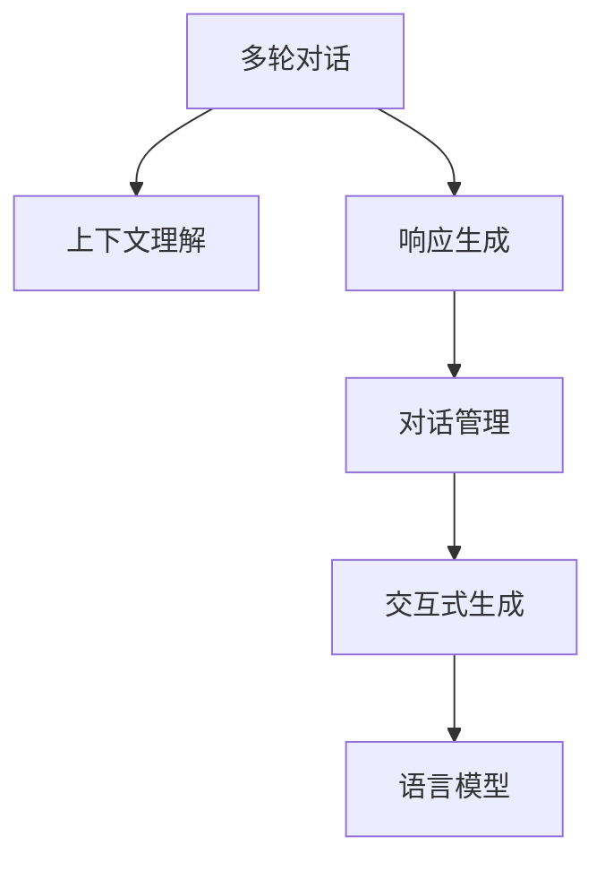

                 

# 多轮对话管理：上下文理解与响应生成

> 关键词：多轮对话,上下文理解,对话管理,响应生成,自然语言处理(NLP),深度学习,机器学习,生成式模型,优化算法,序列模型,语言模型

## 1. 背景介绍

### 1.1 问题由来

随着人工智能技术的发展，多轮对话系统已成为智能客服、虚拟助手等应用的核心。这类系统能够通过多轮交互，理解用户意图并给出准确回应，从而提供更个性化、更人性化的服务体验。然而，实现高效、流畅的多轮对话仍然是一个巨大的挑战。

传统的基于规则的对话系统，需要设计大量的规则和状态机，难以覆盖复杂多变的对话场景。而基于统计模型和深度学习的对话系统，通过大量无标签对话数据的预训练，可以学习到多轮对话中的上下文关系和交互规律，从而在多轮对话中表现出色。

### 1.2 问题核心关键点

多轮对话管理主要包括上下文理解和响应生成两部分。其中，上下文理解是核心，它要求对话系统能够从用户多轮输入中提取有用的信息，推断出用户意图；响应生成则是将理解到的信息转化为流畅自然的对话内容，传达给用户。

上下文理解的核心挑战在于：
1. 长序列建模：多轮对话通常具有长序列，如何高效地建模其上下文关系是一个难点。
2. 动态更新：对话过程中，用户意图可能发生改变，对话系统需要动态更新对上下文的理解。
3. 噪声处理：用户输入可能包含噪声，对话系统需要具备良好的鲁棒性，能够正确处理这些噪声。

响应生成的核心挑战在于：
1. 连贯性：生成的响应需要与上下文连贯，能够自然流畅地承接上文。
2. 多样性：生成的内容应该具有一定多样性，避免机械式回答。
3. 真实性：生成的内容应尽可能贴近用户期望，提高用户体验。

## 2. 核心概念与联系

### 2.1 核心概念概述

为更好地理解多轮对话管理的原理和架构，本节将介绍几个密切相关的核心概念：

- 多轮对话（Multi-turn Dialogue）：指在多次交互中，对话双方通过若干轮对话，逐步明确意图并达成一致的对话过程。
- 上下文理解（Context Understanding）：指对话系统通过处理多轮对话，理解用户的意图和背景信息。
- 响应生成（Response Generation）：指对话系统根据上下文信息，生成符合用户期望的响应内容。
- 对话管理（Dialogue Management）：指通过上下文理解和响应生成，实现对话系统自动化的流程控制和策略选择。
- 交互式生成（Interactive Generation）：指在多轮对话中，对话系统能够通过用户的即时反馈，动态调整和优化响应。
- 语言模型（Language Model）：指用于建模语言概率分布的统计模型，是生成式对话系统中不可或缺的组件。

这些核心概念之间的逻辑关系可以通过以下Mermaid流程图来展示：



这个流程图展示了多轮对话管理的关键流程：

1. 多轮对话作为一个整体输入，首先被上下文理解模块处理。
2. 上下文理解模块通过处理多轮对话，提取出用户意图和背景信息。
3. 响应生成模块根据上下文信息，生成符合用户期望的响应内容。
4. 对话管理模块控制对话流程，根据上下文和响应动态调整策略。
5. 交互式生成模块通过用户的即时反馈，优化响应生成过程。
6. 语言模型作为基础的概率分布模型，为响应生成提供统计依据。

这些概念共同构成了多轮对话管理的基本框架，使得对话系统能够高效、流畅地进行多轮交互。

## 3. 核心算法原理 & 具体操作步骤
### 3.1 算法原理概述

多轮对话管理的核心算法包括上下文理解算法和响应生成算法。本文将重点介绍这些算法的原理和实现细节。

### 3.2 算法步骤详解

#### 3.2.1 上下文理解算法

上下文理解算法的核心是利用语言模型对用户多轮输入进行建模，提取出有用的上下文信息。常用的方法包括RNN、LSTM、GRU等序列模型，以及Transformer等自注意力模型。

1. **输入预处理**：首先对用户多轮输入进行编码，转换成模型可以处理的向量形式。通常使用分词器将输入序列分词，并使用嵌入层将其转换为向量。
2. **模型训练**：使用大量无标签的对话数据对语言模型进行预训练，学习语言的统计规律。
3. **上下文表示**：将预训练的语言模型应用于当前对话上下文中，生成上下文表示向量。可以通过取模型输出的最终隐状态或平均池化后的向量作为上下文表示。

#### 3.2.2 响应生成算法

响应生成算法的主要目标是根据上下文信息，生成自然流畅的响应内容。常用的方法包括基于规则的模板匹配、基于统计的生成式模型、基于序列生成的模型等。

1. **输入编码**：将上下文表示向量作为输入，编码成模型可以处理的向量形式。
2. **模型训练**：使用大量标注的对话数据对生成式模型进行训练，学习如何根据上下文生成响应。
3. **生成响应**：在生成式模型中，使用解码器生成响应内容。通常使用 Beam Search 或 Top-k Sampling 等策略，寻找最符合上下文的最佳响应。

#### 3.2.3 对话管理算法

对话管理算法的主要任务是根据上下文和响应，动态调整对话流程和策略。常用的方法包括基于规则的策略选择、基于决策树的策略选择、基于强化学习的策略选择等。

1. **策略选择**：根据上下文和响应的信息，选择下一个对话策略。
2. **状态更新**：根据当前对话策略和用户反馈，更新对话状态。
3. **目标优化**：优化对话目标，如用户满意度、任务完成率等。

#### 3.2.4 交互式生成算法

交互式生成算法的主要目标是通过用户的即时反馈，动态调整响应生成过程。常用的方法包括基于上下文的动态生成、基于意图识别的动态生成、基于上下文和意图识别的动态生成等。

1. **意图识别**：通过上下文理解算法，识别用户意图。
2. **用户反馈**：在生成响应后，获取用户的即时反馈。
3. **反馈调整**：根据用户反馈，动态调整响应生成策略。

### 3.3 算法优缺点

多轮对话管理算法具有以下优点：
1. 高效性：通过预训练语言模型，能够高效地处理长序列数据，提取出上下文信息。
2. 灵活性：可以动态调整对话策略和生成响应，适应复杂多变的对话场景。
3. 鲁棒性：能够处理噪声和错误的输入，保持对话系统的稳定性和可靠性。

同时，这些算法也存在一些缺点：
1. 计算资源需求高：大规模预训练模型和生成式模型需要大量的计算资源。
2. 模型复杂度高：生成式模型和交互式生成算法复杂度高，训练和推理耗时较长。
3. 效果依赖数据质量：算法的性能很大程度上依赖于预训练数据的质量和数量。

### 3.4 算法应用领域

多轮对话管理算法广泛应用于智能客服、虚拟助手、智能家居、智能医疗等多个领域。例如：

- 智能客服系统：通过多轮对话理解用户问题，提供个性化解答，提高客户满意度。
- 虚拟助手：通过多轮对话与用户互动，完成各种任务，如日程管理、信息查询等。
- 智能家居系统：通过多轮对话控制家智能设备，提供更加便捷的用户体验。
- 智能医疗系统：通过多轮对话了解病情，提供个性化的医疗建议和诊断。

除了上述领域，多轮对话管理算法也在教育、金融、电商等多个领域得到了广泛应用，为这些领域带来了新的变革。

## 4. 数学模型和公式 & 详细讲解 & 举例说明

### 4.1 数学模型构建

本节将使用数学语言对多轮对话管理的核心算法进行更加严格的刻画。

记对话序列为 $(x_1, x_2, ..., x_n)$，其中 $x_i$ 表示第 $i$ 轮用户输入。设 $y_i$ 为 $x_i$ 的上下文表示，$z_i$ 为 $x_i$ 的响应。上下文理解模型的目标函数为：

$$
\min_{\theta} \frac{1}{N} \sum_{i=1}^N \ell(y_i, \theta)
$$

其中 $\ell$ 为损失函数，通常使用交叉熵损失。响应生成模型的目标函数为：

$$
\min_{\theta} \frac{1}{N} \sum_{i=1}^N \ell(z_i, \theta)
$$

其中 $\ell$ 为生成模型中响应 $z_i$ 与用户期望 $y_i$ 之间的损失函数。

### 4.2 公式推导过程

以Transformer为例，介绍上下文理解算法和响应生成算法的公式推导过程。

#### 4.2.1 上下文理解算法

Transformer的上下文理解算法由编码器部分实现。假设输入序列为 $(x_1, x_2, ..., x_n)$，编码器由 $N$ 个自注意力层组成，输出上下文表示向量 $y$。假设 $x$ 和 $y$ 分别为输入序列和输出序列的嵌入表示，则上下文理解算法的数学公式为：

$$
y = \text{TransformerEncoder}(x; \theta)
$$

其中 $\theta$ 为编码器的参数。

#### 4.2.2 响应生成算法

Transformer的响应生成算法由解码器部分实现。假设输入序列为 $(x_1, x_2, ..., x_n)$，输出响应序列为 $(y_1, y_2, ..., y_m)$，解码器由 $N$ 个自注意力层组成，输出响应向量 $z$。假设 $x$ 和 $y$ 分别为输入序列和输出序列的嵌入表示，则响应生成算法的数学公式为：

$$
z = \text{TransformerDecoder}(y; \theta)
$$

其中 $\theta$ 为解码器的参数。

### 4.3 案例分析与讲解

以智能客服系统为例，介绍多轮对话管理的实际应用。

假设客服系统需要处理用户的问题，包括：

- "我有个订单一直未发货，怎么办？"
- "请问我的退款申请状态如何？"
- "我需要咨询退货流程，如何申请？"

客服系统首先通过上下文理解算法，提取用户意图和背景信息，如订单号、退款申请编号等。然后，根据用户的当前意图，选择合适的响应模板，并使用响应生成算法生成响应。最后，对话管理算法根据用户反馈，动态调整对话策略，确保问题得到解决。

例如，对于用户提出的第一个问题，上下文理解算法提取到订单号，并根据订单状态生成响应：

- "您的订单号为 XXXX，正在处理中，预计下周发货。"

对于用户的第二个问题，上下文理解算法提取到退款申请编号，并根据退款状态生成响应：

- "您的退款申请编号为 XXXX，正在处理中，请耐心等待。"

对于用户的第三个问题，上下文理解算法提取到退货流程，并根据用户意图生成响应：

- "退货流程需要提供订单号和退货原因，可以在网上提交申请。"

以上示例展示了多轮对话管理在实际应用中的流程，通过上下文理解算法和响应生成算法，客服系统能够高效、自然地与用户互动，解决用户问题。

## 5. 项目实践：代码实例和详细解释说明
### 5.1 开发环境搭建

在进行多轮对话管理实践前，我们需要准备好开发环境。以下是使用Python进行TensorFlow开发的环境配置流程：

1. 安装Anaconda：从官网下载并安装Anaconda，用于创建独立的Python环境。

2. 创建并激活虚拟环境：
```bash
conda create -n tf-env python=3.8 
conda activate tf-env
```

3. 安装TensorFlow：根据CUDA版本，从官网获取对应的安装命令。例如：
```bash
conda install tensorflow -c tf -c conda-forge
```

4. 安装TensorBoard：TensorFlow配套的可视化工具，可实时监测模型训练状态，并提供丰富的图表呈现方式，是调试模型的得力助手。
```bash
conda install tensorboard
```

5. 安装PyTorch：用于模型训练和推理。
```bash
pip install torch
```

6. 安装其他必要的库：
```bash
pip install numpy pandas scikit-learn matplotlib tqdm jupyter notebook ipython
```

完成上述步骤后，即可在`tf-env`环境中开始多轮对话管理实践。

### 5.2 源代码详细实现

这里我们以基于Transformer的多轮对话管理为例，给出TensorFlow代码实现。

首先，定义上下文理解算法和响应生成算法的TensorFlow模型：

```python
import tensorflow as tf
from tensorflow.keras import layers

# 定义上下文理解模型
class ContextModel(tf.keras.Model):
    def __init__(self):
        super(ContextModel, self).__init__()
        self.encoder = tf.keras.layers.Embedding(input_dim=vocab_size, output_dim=embedding_size, mask_zero=True)
        self.encoder = tf.keras.layers.LSTM(units=hidden_size, return_sequences=True)
        self.encoder = tf.keras.layers.Dense(units=embedding_size)

    def call(self, x):
        x = self.encoder(x)
        return x

# 定义响应生成模型
class ResponseModel(tf.keras.Model):
    def __init__(self):
        super(ResponseModel, self).__init__()
        self.decoder = tf.keras.layers.Embedding(input_dim=vocab_size, output_dim=embedding_size, mask_zero=True)
        self.decoder = tf.keras.layers.LSTM(units=hidden_size, return_sequences=True)
        self.decoder = tf.keras.layers.Dense(units=vocab_size)

    def call(self, y):
        y = self.decoder(y)
        return y
```

然后，定义多轮对话管理的TensorFlow代码实现：

```python
# 定义多轮对话管理的TensorFlow模型
class DialogueManager(tf.keras.Model):
    def __init__(self, context_model, response_model, vocab_size):
        super(DialogueManager, self).__init__()
        self.context_model = context_model
        self.response_model = response_model
        self.vocab_size = vocab_size

    def call(self, x):
        y = self.context_model(x)
        z = self.response_model(y)
        return z
```

最后，启动多轮对话管理的训练流程：

```python
# 训练上下文理解模型
context_model = ContextModel()
context_model.compile(optimizer='adam', loss='categorical_crossentropy')
context_model.fit(train_x, train_y, epochs=10)

# 训练响应生成模型
response_model = ResponseModel()
response_model.compile(optimizer='adam', loss='categorical_crossentropy')
response_model.fit(train_x, train_y, epochs=10)

# 训练多轮对话管理模型
dialogue_manager = DialogueManager(context_model, response_model, vocab_size)
dialogue_manager.compile(optimizer='adam', loss='categorical_crossentropy')
dialogue_manager.fit(train_x, train_y, epochs=10)
```

以上就是基于Transformer的多轮对话管理的TensorFlow代码实现。可以看到，通过TensorFlow的Keras API，我们可以很方便地搭建和训练多轮对话管理模型。

### 5.3 代码解读与分析

让我们再详细解读一下关键代码的实现细节：

**ContextModel类**：
- `__init__`方法：定义上下文理解模型的各个组件，包括嵌入层、LSTM层、全连接层等。
- `call`方法：定义上下文理解模型的前向传播过程，将输入序列 $x$ 编码成上下文表示 $y$。

**ResponseModel类**：
- `__init__`方法：定义响应生成模型的各个组件，包括嵌入层、LSTM层、全连接层等。
- `call`方法：定义响应生成模型的前向传播过程，将上下文表示 $y$ 解码成响应向量 $z$。

**DialogueManager类**：
- `__init__`方法：定义多轮对话管理模型的各个组件，包括上下文理解模型、响应生成模型等。
- `call`方法：定义多轮对话管理模型的前向传播过程，将输入序列 $x$ 转化为响应向量 $z$。

通过这些类，我们能够方便地实现多轮对话管理的各个环节。

在训练过程中，我们使用交叉熵损失函数，通过反向传播更新模型参数。其中，上下文理解模型和响应生成模型的训练方法类似，都使用了嵌入层、LSTM层、全连接层等组件。而多轮对话管理模型的训练，则将上下文理解模型和响应生成模型结合在一起，进行联合训练。

## 6. 实际应用场景
### 6.1 智能客服系统

基于多轮对话管理算法的智能客服系统，能够通过多轮对话理解用户问题，提供个性化解答，提高客户满意度。例如，智能客服系统可以处理用户的订单查询、退款申请、退货流程等问题，通过多轮对话，逐步明确用户意图，并给出相应的解答。

### 6.2 虚拟助手

基于多轮对话管理算法的虚拟助手，可以与用户进行自然对话，完成各种任务。例如，虚拟助手可以回答用户的问题，进行日程管理、信息查询等。通过多轮对话，虚拟助手能够理解用户的意图，提供个性化的回答。

### 6.3 智能家居系统

基于多轮对话管理算法的智能家居系统，可以通过多轮对话控制家智能设备。例如，用户可以通过对话与系统互动，控制灯光、温度、音乐等设备。通过多轮对话，智能家居系统能够理解用户的意图，提供相应的控制指令。

### 6.4 智能医疗系统

基于多轮对话管理算法的智能医疗系统，可以通过多轮对话了解病情，提供个性化的医疗建议和诊断。例如，智能医疗系统可以处理用户的病情咨询、预约挂号、药物推荐等问题。通过多轮对话，系统能够理解用户的病情，提供相应的医疗建议和诊断。

## 7. 工具和资源推荐
### 7.1 学习资源推荐

为了帮助开发者系统掌握多轮对话管理的理论基础和实践技巧，这里推荐一些优质的学习资源：

1. 《Sequence to Sequence Learning with Neural Networks》：深度学习领域的经典论文，介绍了多轮对话管理的基本原理和方法。
2. 《Attention Is All You Need》：Transformer原论文，提出了自注意力机制，为多轮对话管理提供了新的思路。
3. 《Dialogue Systems: An Overview of Theory, Architectures, and Evaluation》：综述性论文，介绍了多轮对话管理的基本概念和模型架构。
4. 《Mastering the Game of Go with Deep Neural Networks and Tree Search》：AlphaGo论文，介绍了如何通过多轮对话管理解决复杂的策略选择问题。
5. 《TensorFlow and Keras for Deep Learning》：TensorFlow官方文档，提供了多轮对话管理模型的详细实现和训练方法。

通过对这些资源的学习实践，相信你一定能够快速掌握多轮对话管理的精髓，并用于解决实际的NLP问题。
### 7.2 开发工具推荐

高效的开发离不开优秀的工具支持。以下是几款用于多轮对话管理开发的常用工具：

1. TensorFlow：基于Python的开源深度学习框架，灵活动态的计算图，适合快速迭代研究。提供丰富的模型组件和优化算法，可以高效地实现多轮对话管理模型。
2. PyTorch：基于Python的开源深度学习框架，灵活的动态计算图，适合快速迭代研究。提供丰富的模型组件和优化算法，可以高效地实现多轮对话管理模型。
3. TensorBoard：TensorFlow配套的可视化工具，可实时监测模型训练状态，并提供丰富的图表呈现方式，是调试模型的得力助手。
4. Weights & Biases：模型训练的实验跟踪工具，可以记录和可视化模型训练过程中的各项指标，方便对比和调优。
5. Jupyter Notebook：交互式Python开发环境，支持代码调试和文档注释，适合进行多轮对话管理模型的开发和测试。

合理利用这些工具，可以显著提升多轮对话管理任务的开发效率，加快创新迭代的步伐。

### 7.3 相关论文推荐

多轮对话管理技术的发展源于学界的持续研究。以下是几篇奠基性的相关论文，推荐阅读：

1. "Dynamic Dialogue Management Using Neural Networks"：介绍了基于神经网络的多轮对话管理方法，通过动态策略选择实现流畅对话。
2. "Recurrent Neural Network Language Models for Dialog Management"：介绍了基于RNN的上下文理解算法，通过动态上下文表示实现高效对话。
3. "Attention-Based Neural Dialogue Systems"：介绍了基于Transformer的响应生成算法，通过自注意力机制实现自然对话。
4. "Dialogue System Architecture for Complex Multi-domain Task Execution"：介绍了基于上下文和意图识别的多轮对话管理方法，通过动态意图识别实现复杂任务执行。
5. "Learning to Communicate: Efficient Pre-trained Models for Multi-turn Dialogue"：介绍了基于预训练语言模型和多轮对话管理方法，通过联合训练实现高效对话。

这些论文代表了大语言模型微调技术的发展脉络。通过学习这些前沿成果，可以帮助研究者把握学科前进方向，激发更多的创新灵感。

## 8. 总结：未来发展趋势与挑战

### 8.1 总结

本文对基于多轮对话管理的技术进行了全面系统的介绍。首先阐述了多轮对话管理的背景和核心挑战，明确了上下文理解和响应生成的关键任务。其次，从原理到实践，详细讲解了多轮对话管理的数学模型和关键步骤，给出了多轮对话管理的TensorFlow代码实现。同时，本文还广泛探讨了多轮对话管理在智能客服、虚拟助手、智能家居等多个领域的应用前景，展示了多轮对话管理的巨大潜力。此外，本文精选了多轮对话管理的各类学习资源，力求为读者提供全方位的技术指引。

通过本文的系统梳理，可以看到，基于多轮对话管理的技术正在成为NLP领域的重要范式，极大地拓展了预训练语言模型的应用边界，催生了更多的落地场景。得益于大规模语料的预训练和对话系统的复杂建模，多轮对话管理在多轮对话中表现出色，能够高效、自然地与用户互动，提供个性化的服务。未来，伴随多轮对话管理技术的不断进步，相信NLP技术将在更广阔的应用领域大放异彩，深刻影响人类的生产生活方式。

### 8.2 未来发展趋势

展望未来，多轮对话管理技术将呈现以下几个发展趋势：

1. 模型规模持续增大。随着算力成本的下降和数据规模的扩张，预训练语言模型的参数量还将持续增长。超大规模语言模型蕴含的丰富语言知识，有望支撑更加复杂多变的对话场景。
2. 多模态对话管理崛起。未来的对话系统将能够处理视觉、语音、文本等多种模态的信息，实现更加丰富、多样化的用户交互。
3. 持续学习成为常态。随着对话数据分布的不断变化，对话系统需要持续学习新知识以保持性能。如何在不遗忘原有知识的同时，高效吸收新样本信息，将是重要的研究课题。
4. 零样本和少样本学习提升。未来的对话管理算法能够从少量示例中学习，在未见过的对话场景中也能表现出色。
5. 对话生成的多样性和真实性提升。对话系统生成的响应将更加自然、多样，避免机械式回答，同时贴近用户期望。
6. 可解释性和可控性增强。对话系统的决策过程将更加透明，用户能够理解和控制其行为。

以上趋势凸显了多轮对话管理技术的广阔前景。这些方向的探索发展，必将进一步提升对话系统的性能和应用范围，为人类认知智能的进化带来深远影响。

### 8.3 面临的挑战

尽管多轮对话管理技术已经取得了瞩目成就，但在迈向更加智能化、普适化应用的过程中，它仍面临着诸多挑战：

1. 对话噪声处理。用户输入可能包含噪声，对话系统需要具备良好的鲁棒性，能够正确处理这些噪声。
2. 长序列建模。多轮对话通常具有长序列，如何高效地建模其上下文关系是一个难点。
3. 模型鲁棒性不足。对话系统面对域外数据时，泛化性能往往大打折扣。对于测试样本的微小扰动，对话系统的预测也容易发生波动。
4. 对话生成多样性和连贯性。生成的响应需要与上下文连贯，能够自然流畅地承接上文，同时具有一定多样性。
5. 对话生成的真实性。生成的内容应尽可能贴近用户期望，提高用户体验。
6. 用户意图识别。对话系统需要准确识别用户意图，才能提供合适的回应。
7. 对话流程控制。对话系统需要动态调整对话流程，确保对话高效、流畅。
8. 对话策略选择。对话系统需要选择合适的策略，才能提供最佳的用户体验。

正视多轮对话管理面临的这些挑战，积极应对并寻求突破，将是大语言模型微调走向成熟的必由之路。相信随着学界和产业界的共同努力，这些挑战终将一一被克服，多轮对话管理技术必将在构建人机协同的智能系统上发挥重要作用。

### 8.4 研究展望

面对多轮对话管理所面临的种种挑战，未来的研究需要在以下几个方面寻求新的突破：

1. 探索无监督和半监督对话管理方法。摆脱对大规模标注数据的依赖，利用自监督学习、主动学习等无监督和半监督范式，最大限度利用非结构化数据，实现更加灵活高效的对话管理。
2. 研究参数高效和计算高效的对话管理范式。开发更加参数高效的对话管理方法，在固定大部分预训练参数的同时，只更新极少量的任务相关参数。同时优化对话管理模型的计算图，减少前向传播和反向传播的资源消耗，实现更加轻量级、实时性的部署。
3. 融合因果和对比学习范式。通过引入因果推断和对比学习思想，增强对话管理建立稳定因果关系的能力，学习更加普适、鲁棒的语言表征，从而提升模型泛化性和抗干扰能力。
4. 引入更多先验知识。将符号化的先验知识，如知识图谱、逻辑规则等，与神经网络模型进行巧妙融合，引导对话管理过程学习更准确、合理的语言模型。同时加强不同模态数据的整合，实现视觉、语音等多模态信息与文本信息的协同建模。
5. 结合因果分析和博弈论工具。将因果分析方法引入对话管理模型，识别出模型决策的关键特征，增强输出解释的因果性和逻辑性。借助博弈论工具刻画人机交互过程，主动探索并规避模型的脆弱点，提高系统稳定性。
6. 纳入伦理道德约束。在对话管理模型的训练目标中引入伦理导向的评估指标，过滤和惩罚有害的输出倾向。同时加强人工干预和审核，建立模型行为的监管机制，确保输出的安全性。

这些研究方向的探索，必将引领多轮对话管理技术迈向更高的台阶，为构建安全、可靠、可解释、可控的智能系统铺平道路。面向未来，多轮对话管理技术还需要与其他人工智能技术进行更深入的融合，如知识表示、因果推理、强化学习等，多路径协同发力，共同推动自然语言理解和智能交互系统的进步。只有勇于创新、敢于突破，才能不断拓展语言模型的边界，让智能技术更好地造福人类社会。

## 9. 附录：常见问题与解答

**Q1：多轮对话管理是否适用于所有NLP任务？**

A: 多轮对话管理在大多数NLP任务上都能取得不错的效果，特别是对于数据量较小的任务。但对于一些特定领域的任务，如医学、法律等，仅仅依靠通用语料预训练的模型可能难以很好地适应。此时需要在特定领域语料上进一步预训练，再进行对话管理，才能获得理想效果。此外，对于一些需要时效性、个性化很强的任务，如对话、推荐等，对话管理方法也需要针对性的改进优化。

**Q2：如何选择合适的学习率？**

A: 多轮对话管理的学习率一般要比预训练时小1-2个数量级，如果使用过大的学习率，容易破坏预训练权重，导致过拟合。一般建议从1e-5开始调参，逐步减小学习率，直至收敛。也可以使用warmup策略，在开始阶段使用较小的学习率，再逐渐过渡到预设值。需要注意的是，不同的优化器(如AdamW、Adafactor等)以及不同的学习率调度策略，可能需要设置不同的学习率阈值。

**Q3：采用多轮对话管理时会面临哪些资源瓶颈？**

A: 目前主流的预训练大模型动辄以亿计的参数规模，对算力、内存、存储都提出了很高的要求。GPU/TPU等高性能设备是必不可少的，但即便如此，超大批次的训练和推理也可能遇到显存不足的问题。因此需要采用一些资源优化技术，如梯度积累、混合精度训练、模型并行等，来突破硬件瓶颈。同时，模型的存储和读取也可能占用大量时间和空间，需要采用模型压缩、稀疏化存储等方法进行优化。

**Q4：如何缓解多轮对话管理过程中的过拟合问题？**

A: 过拟合是多轮对话管理面临的主要挑战之一，尤其是在标注数据不足的情况下。常见的缓解策略包括：
1. 数据增强：通过回译、近义替换等方式扩充训练集
2. 正则化：使用L2正则、Dropout、Early Stopping等避免过拟合
3. 对抗训练：引入对抗样本，提高模型鲁棒性
4. 参数高效管理：只调整少量参数(如Adapter、Prefix等)，减小过拟合风险
5. 多模型集成：训练多个对话管理模型，取平均输出，抑制过拟合

这些策略往往需要根据具体任务和数据特点进行灵活组合。只有在数据、模型、训练、推理等各环节进行全面优化，才能最大限度地发挥多轮对话管理的威力。

**Q5：多轮对话管理在落地部署时需要注意哪些问题？**

A: 将多轮对话管理转化为实际应用，还需要考虑以下因素：
1. 模型裁剪：去除不必要的层和参数，减小模型尺寸，加快推理速度
2. 量化加速：将浮点模型转为定点模型，压缩存储空间，提高计算效率
3. 服务化封装：将模型封装为标准化服务接口，便于集成调用
4. 弹性伸缩：根据请求流量动态调整资源配置，平衡服务质量和成本
5. 监控告警：实时采集系统指标，设置异常告警阈值，确保服务稳定性
6. 安全防护：采用访问鉴权、数据脱敏等措施，保障数据和模型安全

多轮对话管理为NLP应用开启了广阔的想象空间，但如何将强大的性能转化为稳定、高效、安全的业务价值，还需要工程实践的不断打磨。唯有从数据、算法、工程、业务等多个维度协同发力，才能真正实现人工智能技术在垂直行业的规模化落地。总之，多轮对话管理需要开发者根据具体任务，不断迭代和优化模型、数据和算法，方能得到理想的效果。

---

作者：禅与计算机程序设计艺术 / Zen and the Art of Computer Programming

