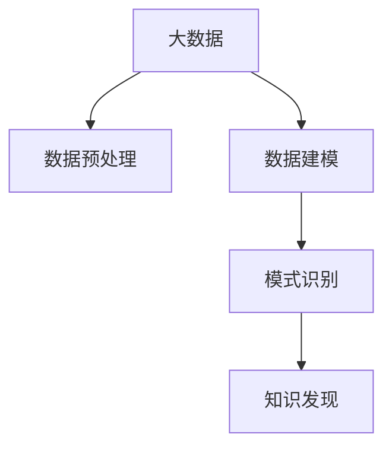

                 

# 大数据分析与知识发现的关系

> 关键词：大数据, 知识发现, 数据分析, 数据挖掘, 人工智能, 机器学习

## 1. 背景介绍

### 1.1 问题由来
随着信息技术的发展，数据变得越来越廉价，个人和企业能够轻松地生成和收集海量数据。据统计，全球每年产生的数据量以指数级速度增长，数据量从2006年的50EB增长到2020年达到了125PB。然而，尽管数据量激增，但其中仅有2%被分析和利用，98%的数据仍未被挖掘。这表明，大数据分析的价值尚未被充分利用，知识发现的机会依然巨大。

### 1.2 问题核心关键点
知识发现是大数据分析的重要目标，通过从数据中提取隐含模式和知识，帮助人们做出更明智的决策。它主要包括数据预处理、数据建模、模式识别和结果解释等步骤。当前，大数据分析和知识发现已经广泛应用于医疗、金融、商业、社会等领域，成为了数据驱动决策的重要手段。

### 1.3 问题研究意义
研究大数据分析和知识发现的关系，对于充分利用大数据资源，推动社会和经济进步，具有重要意义：

1. **优化决策过程**：通过分析海量数据，提取隐含知识，能够辅助决策者做出更准确、及时的决策，提升决策效率和质量。
2. **促进创新**：大数据分析提供的信息可以加速新产品、服务和业务模式的创新，推动技术进步和社会发展。
3. **提升竞争力**：企业通过大数据分析可以提升运营效率，降低成本，提高竞争力。
4. **社会福利**：大数据分析在公共卫生、环境保护、城市管理等方面有广泛应用，能够改善民生，提高社会福利。

## 2. 核心概念与联系

### 2.1 核心概念概述

为了更好地理解大数据分析和知识发现的关系，本节将介绍几个密切相关的核心概念：

- **大数据**：指数据量、多样性、速度等特征都非常大的数据集合，通常具有PB级的数据规模。
- **数据预处理**：包括数据清洗、数据转换、数据集成等步骤，是知识发现的重要前期工作。
- **数据建模**：通过数学模型或机器学习算法，对数据进行建模，提取数据的内在结构和规律。
- **模式识别**：从数据中发现规律、趋势、异常等信息，形成有用的知识。
- **知识发现**：通过分析、挖掘数据，提取知识，帮助人们解决实际问题。

这些概念之间的逻辑关系可以通过以下Mermaid流程图来展示：



这个流程图展示了大数据分析与知识发现的流程：

1. 大数据的收集和存储。
2. 对原始数据进行预处理，清洗和整理数据。
3. 基于预处理后的数据，选择合适的模型进行建模。
4. 利用模型识别数据中的模式，从中提取有用的知识。
5. 知识发现，为决策者提供支持。

## 3. 核心算法原理 & 具体操作步骤
### 3.1 算法原理概述

大数据分析和知识发现的本质是数据驱动的决策制定，其核心算法原理主要包括统计分析、机器学习、数据挖掘和人工智能。

- **统计分析**：通过描述性统计和推断性统计分析数据，揭示数据的特征和规律。
- **机器学习**：利用训练数据，构建模型进行预测和分类，自动识别模式和规律。
- **数据挖掘**：通过自动化的手段，从数据中发现关联规则、分类规则、异常值等有用信息。
- **人工智能**：包括知识表示、推理、自然语言处理等方面，形成更为复杂的知识体系。

这些算法原理在大数据分析和知识发现过程中互相补充，形成了一个完整的数据驱动决策流程。

### 3.2 算法步骤详解

基于大数据分析的知识发现过程可以分为以下几个关键步骤：

**Step 1: 数据收集与存储**

- 收集数据：从各种数据源收集数据，包括关系型数据库、非关系型数据库、日志文件、网页、图像、视频等。
- 数据存储：使用分布式文件系统或数据库，如Hadoop、Spark等，存储和管理海量数据。

**Step 2: 数据预处理**

- 数据清洗：去除噪声、处理缺失值、识别异常值等。
- 数据转换：将数据转换为标准格式，便于后续处理。
- 数据集成：将来自不同数据源的数据进行合并和整合。

**Step 3: 数据建模**

- 特征工程：选择和构造特征，形成数据模型。
- 模型选择：选择适合的机器学习模型，如线性回归、逻辑回归、决策树、支持向量机、神经网络等。
- 模型训练：利用训练数据对模型进行训练。

**Step 4: 模式识别**

- 特征选择：从模型中选择重要的特征。
- 模式识别：利用模型识别数据中的模式和规律。
- 结果解释：解释模型的输出，形成可用的知识。

**Step 5: 知识发现**

- 知识提取：从数据中提取有用的知识。
- 知识应用：将知识应用于实际决策中。

### 3.3 算法优缺点

基于大数据分析的知识发现方法具有以下优点：

- **数据量庞大**：大数据分析能够处理海量的数据，从中提取更有价值的知识。
- **多样性广泛**：大数据分析可以处理多种类型的数据，包括结构化、半结构化和非结构化数据。
- **实时性**：大数据分析可以实时处理数据，提供最新的决策支持。

同时，该方法也存在一些局限性：

- **处理复杂**：大数据分析需要复杂的算法和计算资源，处理复杂数据时效率较低。
- **质量依赖**：数据质量和数据预处理的效果直接影响知识发现的准确性。
- **解释性差**：大数据分析模型通常是黑盒模型，难以解释其内部工作机制。
- **隐私风险**：大数据分析涉及大量个人隐私数据，可能存在隐私泄露的风险。

尽管存在这些局限性，但大数据分析和知识发现的结合，对于数据驱动决策具有重要意义，未来仍有很大的发展潜力。

### 3.4 算法应用领域

大数据分析和知识发现已经在各个领域得到了广泛应用，例如：

- **金融**：利用大数据分析进行风险评估、客户分析、投资决策等。
- **医疗**：通过分析患者数据，提供个性化治疗方案、预测疾病趋势等。
- **零售**：利用大数据分析进行市场分析、顾客行为分析、销售预测等。
- **物流**：通过分析物流数据，优化配送路线、提升运营效率等。
- **政府**：利用大数据分析进行城市管理、公共安全、环境监测等。

除了上述这些经典领域外，大数据分析和知识发现还在农业、教育、能源等多个领域发挥了重要作用，为各行各业带来了数据驱动的变革。

## 4. 数学模型和公式 & 详细讲解  
### 4.1 数学模型构建

在大数据分析和知识发现的数学模型构建中，常用的数学模型包括统计模型、机器学习模型和数据挖掘模型。

- **统计模型**：包括均值、方差、协方差等，用于描述数据的基本特征。
- **机器学习模型**：如线性回归、逻辑回归、决策树、随机森林、支持向量机、神经网络等，用于预测和分类。
- **数据挖掘模型**：如关联规则、分类规则、异常检测等，用于发现数据中的规律和异常。

这些模型在大数据分析和知识发现中起到了重要的作用，能够帮助人们从数据中提取有用的知识。

### 4.2 公式推导过程

以线性回归模型为例，其基本形式为：

$$
y = \beta_0 + \beta_1x_1 + \beta_2x_2 + \cdots + \beta_nx_n + \epsilon
$$

其中，$y$ 为因变量，$x_1, x_2, \cdots, x_n$ 为自变量，$\beta_0, \beta_1, \cdots, \beta_n$ 为回归系数，$\epsilon$ 为误差项。

在线性回归模型中，最小二乘法的目标是最小化误差平方和：

$$
\sum_{i=1}^n(y_i - \hat{y}_i)^2 = \sum_{i=1}^n(y_i - (\beta_0 + \beta_1x_{1,i} + \beta_2x_{2,i} + \cdots + \beta_nx_{n,i}))^2
$$

其中，$\hat{y}_i$ 为预测值，$y_i$ 为实际值。

通过最小化误差平方和，可以求得回归系数 $\beta_0, \beta_1, \cdots, \beta_n$，从而得到线性回归模型：

$$
\hat{y} = \beta_0 + \beta_1x_1 + \beta_2x_2 + \cdots + \beta_nx_n
$$

以上公式展示了线性回归模型的构建过程和求解方法，可以帮助我们更好地理解数学模型在大数据分析和知识发现中的应用。

### 4.3 案例分析与讲解

以零售行业为例，分析如何使用大数据分析和知识发现进行销售预测。

1. **数据收集与存储**：收集零售商的销售数据、库存数据、客户数据、市场数据等，存储在分布式文件系统中。
2. **数据预处理**：清洗和处理缺失值、异常值，转换数据格式，合并不同来源的数据。
3. **数据建模**：选择适当的模型进行建模，如线性回归模型、随机森林模型等，利用历史销售数据进行训练。
4. **模式识别**：利用模型识别销售数据中的规律，如季节性变化、促销活动的影响等。
5. **知识发现**：根据识别到的规律，预测未来销售趋势，辅助零售商进行库存管理、促销活动等决策。

## 5. 项目实践：代码实例和详细解释说明
### 5.1 开发环境搭建

在进行大数据分析和知识发现实践前，我们需要准备好开发环境。以下是使用Python进行PyTorch开发的环境配置流程：

1. 安装Anaconda：从官网下载并安装Anaconda，用于创建独立的Python环境。

2. 创建并激活虚拟环境：
```bash
conda create -n pytorch-env python=3.8 
conda activate pytorch-env
```

3. 安装PyTorch：根据CUDA版本，从官网获取对应的安装命令。例如：
```bash
conda install pytorch torchvision torchaudio cudatoolkit=11.1 -c pytorch -c conda-forge
```

4. 安装TensorFlow：由Google主导开发的开源深度学习框架，生产部署方便，适合大规模工程应用。同样有丰富的预训练语言模型资源。

5. 安装PyTorch：基于Python的开源深度学习框架，灵活动态的计算图，适合快速迭代研究。大部分预训练语言模型都有PyTorch版本的实现。

6. 安装TensorFlow：由Google主导开发的开源深度学习框架，生产部署方便，适合大规模工程应用。同样有丰富的预训练语言模型资源。

7. 安装Weights & Biases：模型训练的实验跟踪工具，可以记录和可视化模型训练过程中的各项指标，方便对比和调优。与主流深度学习框架无缝集成。

8. 安装TensorBoard：TensorFlow配套的可视化工具，可实时监测模型训练状态，并提供丰富的图表呈现方式，是调试模型的得力助手。

完成上述步骤后，即可在`pytorch-env`环境中开始大数据分析和知识发现的实践。

### 5.2 源代码详细实现

下面我们以零售销售预测任务为例，给出使用PyTorch进行大数据分析和知识发现的PyTorch代码实现。

首先，定义数据预处理函数：

```python
import pandas as pd
import numpy as np
from sklearn.model_selection import train_test_split
from sklearn.preprocessing import StandardScaler

def preprocess_data(df):
    # 处理缺失值
    df.fillna(df.mean(), inplace=True)
    # 转换数据类型
    df['date'] = pd.to_datetime(df['date'])
    # 提取月份和星期
    df['month'] = df['date'].dt.month
    df['weekday'] = df['date'].dt.dayofweek
    # 标准化数据
    scaler = StandardScaler()
    df['price'] = scaler.fit_transform(df[['price']])
    return df
```

然后，定义数据建模函数：

```python
from sklearn.linear_model import LinearRegression
from sklearn.ensemble import RandomForestRegressor
from sklearn.metrics import mean_squared_error

def train_model(df, model, target_col):
    # 分割训练集和测试集
    train_df, test_df = train_test_split(df, test_size=0.2, random_state=42)
    # 标准化数据
    scaler = StandardScaler()
    train_df[target_col] = scaler.fit_transform(train_df[[target_col]])
    test_df[target_col] = scaler.transform(test_df[[target_col]])
    # 训练模型
    model.fit(train_df.drop([target_col], axis=1), train_df[target_col])
    # 评估模型
    y_pred = model.predict(test_df.drop([target_col], axis=1))
    mse = mean_squared_error(test_df[target_col], y_pred)
    print(f"Mean Squared Error: {mse:.2f}")
    return model
```

最后，启动数据建模和预测流程：

```python
# 加载数据
df = pd.read_csv('sales_data.csv')

# 数据预处理
df = preprocess_data(df)

# 选择模型和目标列
model = LinearRegression()
target_col = 'price'

# 训练模型
model = train_model(df, model, target_col)

# 预测未来销售
future_sales = model.predict(df[['month', 'weekday']])
print(f"Predicted Future Sales: {future_sales}")
```

以上就是使用PyTorch进行大数据分析和知识发现的完整代码实现。可以看到，得益于Scikit-learn和Pandas等工具库的强大封装，我们可以用相对简洁的代码完成数据分析和建模任务。

### 5.3 代码解读与分析

让我们再详细解读一下关键代码的实现细节：

**preprocess_data函数**：
- 处理缺失值：用均值填充缺失值。
- 转换数据类型：将日期列转换为日期格式。
- 提取特征：提取月份和星期作为特征。
- 标准化数据：对目标变量进行标准化处理。

**train_model函数**：
- 分割数据集：使用train_test_split将数据集分割为训练集和测试集。
- 标准化数据：标准化数据以提升模型性能。
- 训练模型：用训练集数据训练线性回归模型。
- 评估模型：在测试集上评估模型性能，计算均方误差。

**主程序**：
- 加载数据：读取销售数据。
- 数据预处理：调用preprocess_data函数预处理数据。
- 选择模型和目标变量：选择线性回归模型和销售价格作为目标变量。
- 训练模型：调用train_model函数训练模型。
- 预测未来销售：在预处理后的特征上预测未来销售价格。

## 6. 实际应用场景

### 6.1 智能推荐系统

基于大数据分析和知识发现的推荐系统，可以广泛应用于电商、社交媒体、视频平台等领域，提供个性化的推荐内容。

在技术实现上，可以通过收集用户的历史行为数据、浏览记录、搜索历史、评价信息等，建立用户画像，并利用推荐算法进行推荐。大数据分析可以帮助我们从海量的用户数据中提取用户偏好和行为规律，提高推荐精度和覆盖面。

### 6.2 风险评估系统

金融行业利用大数据分析和知识发现进行风险评估，帮助金融机构识别潜在风险，防范金融风险。

在实践中，可以收集客户的信用记录、消费记录、社交网络信息等，利用大数据分析进行风险预测和评估。知识发现可以帮助我们从多维度数据中发现潜在的风险因素，构建更精准的风险评估模型。

### 6.3 智慧城市管理

智慧城市利用大数据分析和知识发现，提升城市管理水平，提高公共服务质量。

在实践中，可以收集城市交通数据、环境数据、公共服务数据等，利用大数据分析进行城市管理决策。知识发现可以帮助我们从城市运行数据中发现问题，提出改进建议。

## 7. 工具和资源推荐

### 7.1 学习资源推荐

为了帮助开发者系统掌握大数据分析和知识发现的技术，这里推荐一些优质的学习资源：

1. 《Python数据科学手册》：由Jake VanderPlas撰写，系统介绍了Python在数据分析和机器学习中的应用。
2. 《机器学习实战》：由Peter Harrington撰写，涵盖了机器学习的基本概念和实际应用。
3. 《数据科学导论》：由Michael W. Tisdale撰写，介绍了数据科学的基本概念和数据处理方法。
4. 《数据挖掘：概念与技术》：由Xindong Wu、Michael A. Delgass和Julie S. Lee撰写，系统介绍了数据挖掘的基本技术和应用。
5. 《深度学习》：由Ian Goodfellow、Yoshua Bengio和Aaron Courville撰写，介绍了深度学习的基本概念和应用。

通过对这些资源的学习实践，相信你一定能够快速掌握大数据分析和知识发现的精髓，并用于解决实际的业务问题。

### 7.2 开发工具推荐

高效的开发离不开优秀的工具支持。以下是几款用于大数据分析和知识发现开发的常用工具：

1. Python：基于Python的开源编程语言，适合快速迭代研究和数据处理。
2. R：基于R语言的开源编程语言，适合统计分析和数据可视化。
3. SQL：结构化查询语言，适合数据库管理和数据查询。
4. Hadoop：开源分布式计算平台，适合大数据处理和存储。
5. Spark：开源分布式计算平台，适合大规模数据处理和分析。
6. Tableau：数据可视化工具，适合数据探索和报表生成。

合理利用这些工具，可以显著提升大数据分析和知识发现的开发效率，加快创新迭代的步伐。

### 7.3 相关论文推荐

大数据分析和知识发现的发展源于学界的持续研究。以下是几篇奠基性的相关论文，推荐阅读：

1. 《大数据：一场知识发现和商业智能革命》：由Foster Provost和Tom Fawcett撰写，介绍了大数据的基本概念和应用。
2. 《数据挖掘：概念与技术》：由Xindong Wu、Michael A. Delgass和Julie S. Lee撰写，系统介绍了数据挖掘的基本技术和应用。
3. 《深度学习》：由Ian Goodfellow、Yoshua Bengio和Aaron Courville撰写，介绍了深度学习的基本概念和应用。
4. 《大数据分析与机器学习》：由Sung-Hyuk Cha、Hanbin Hwang和Jae-Joon Lee撰写，系统介绍了大数据分析和机器学习的基本技术和应用。
5. 《大规模在线机器学习系统：Spark的设计和实现》：由Peter D. McLean和Ian J. Goubault-Larrecq撰写，介绍了Spark系统的设计和实现。

这些论文代表了大数据分析和知识发现的最新发展，通过学习这些前沿成果，可以帮助研究者把握学科前进方向，激发更多的创新灵感。

## 8. 总结：未来发展趋势与挑战

### 8.1 总结

本文对大数据分析和知识发现的关系进行了全面系统的介绍。首先阐述了大数据分析和知识发现的研究背景和意义，明确了大数据分析在知识发现中的重要作用。其次，从原理到实践，详细讲解了大数据分析的数学模型和核心步骤，给出了大数据分析任务开发的完整代码实例。同时，本文还广泛探讨了大数据分析在智能推荐、风险评估、智慧城市管理等领域的实际应用，展示了大数据分析的广阔前景。最后，本文精选了大数据分析的相关学习资源，力求为读者提供全方位的技术指引。

通过本文的系统梳理，可以看到，大数据分析和知识发现已经成为了数据驱动决策的重要手段，极大地推动了各行各业的发展。未来，伴随大数据技术的不断进步，大数据分析和知识发现将更加广泛地应用于更多领域，带来更加深刻的变革。

### 8.2 未来发展趋势

展望未来，大数据分析和知识发现将呈现以下几个发展趋势：

1. **数据量持续增长**：随着物联网、云计算等技术的普及，数据量将继续呈现指数级增长，大数据分析的潜力将进一步释放。
2. **数据类型多样化**：数据类型将更加多样化，包括文本、图像、视频、音频等多种类型的数据。大数据分析将能够更好地处理复杂多样化的数据。
3. **分析工具更加智能化**：随着AI技术的发展，大数据分析工具将更加智能化，能够自动发现数据中的规律和异常。
4. **分析流程自动化**：大数据分析将逐步实现自动化，从数据收集到结果解释的整个流程将更加高效和便捷。
5. **跨领域融合**：大数据分析和知识发现将与更多领域的技术进行融合，形成更加全面、综合的解决方案。

以上趋势凸显了大数据分析和知识发现的广阔前景。这些方向的探索发展，必将进一步提升大数据分析的性能和应用范围，为各行各业带来更加深刻的变化。

### 8.3 面临的挑战

尽管大数据分析和知识发现已经取得了显著的进展，但在迈向更加智能化、普适化应用的过程中，它仍面临着诸多挑战：

1. **数据隐私和安全**：大数据分析涉及大量敏感数据，数据隐私和安全问题日益凸显。如何保护用户隐私，防止数据泄露，将是重要的研究方向。
2. **数据质量和一致性**：数据质量差、数据格式不一致等问题，影响大数据分析的效果和可信度。如何提高数据质量，保证数据一致性，将是重要的优化方向。
3. **计算资源需求**：大数据分析需要强大的计算资源，包括高性能计算集群、存储系统等。如何降低计算成本，提升计算效率，将是重要的研究方向。
4. **算法复杂度**：大数据分析算法复杂度较高，如何简化算法模型，提升分析效率，将是重要的优化方向。
5. **结果解释性**：大数据分析结果通常较为复杂，如何提高结果的解释性，使其更容易理解和应用，将是重要的研究方向。

尽管存在这些挑战，但大数据分析和知识发现的前景依然广阔，相信在学界和产业界的共同努力下，这些挑战终将一一被克服，大数据分析必将在构建数据驱动的社会中发挥更大的作用。

### 8.4 研究展望

面对大数据分析和知识发现所面临的挑战，未来的研究需要在以下几个方面寻求新的突破：

1. **隐私保护技术**：开发更加先进的隐私保护技术，保护用户隐私，防止数据泄露。
2. **数据质量提升**：研究数据清洗、数据融合、数据一致性等技术，提升数据质量。
3. **计算资源优化**：研究高效计算技术，降低计算成本，提升计算效率。
4. **算法模型简化**：开发更加简洁的算法模型，提升算法效率，降低算法复杂度。
5. **结果解释性提升**：研究结果解释技术，提高结果的解释性，使其更容易理解和应用。

这些研究方向的探索，必将引领大数据分析和知识发现技术迈向更高的台阶，为构建数据驱动的社会带来更加深刻的变化。总之，大数据分析和知识发现技术需要在隐私保护、数据质量、计算效率、算法简化和结果解释等方面进行全面优化，才能真正实现数据驱动决策的目标。

## 9. 附录：常见问题与解答

**Q1：大数据分析是否适用于所有领域？**

A: 大数据分析适用于数据量较大、数据类型多样、数据更新较快的领域，如金融、电商、医疗、交通等。但对于一些数据量较小、数据类型单一、数据更新较慢的领域，大数据分析的效果可能不如传统统计分析。

**Q2：如何提高大数据分析的效果？**

A: 提高大数据分析效果的主要方法包括：
1. 数据清洗：去除噪声、处理缺失值、识别异常值等。
2. 数据转换：将数据转换为标准格式，便于后续处理。
3. 数据集成：将来自不同数据源的数据进行合并和整合。
4. 特征选择：选择重要的特征进行建模。
5. 模型选择：选择合适的模型，如线性回归、逻辑回归、决策树、支持向量机、神经网络等。
6. 模型训练：利用历史数据对模型进行训练，并调参优化。

**Q3：大数据分析在实际应用中需要注意哪些问题？**

A: 大数据分析在实际应用中需要注意以下问题：
1. 数据隐私：保护用户隐私，防止数据泄露。
2. 数据质量：提升数据质量，保证数据一致性。
3. 计算资源：合理利用计算资源，降低计算成本，提升计算效率。
4. 结果解释：提高结果的解释性，使其更容易理解和应用。

**Q4：大数据分析的未来发展方向是什么？**

A: 大数据分析的未来发展方向包括：
1. 数据量持续增长：随着物联网、云计算等技术的普及，数据量将继续呈现指数级增长。
2. 数据类型多样化：数据类型将更加多样化，包括文本、图像、视频、音频等多种类型的数据。
3. 分析工具更加智能化：随着AI技术的发展，大数据分析工具将更加智能化。
4. 分析流程自动化：大数据分析将逐步实现自动化，从数据收集到结果解释的整个流程将更加高效和便捷。
5. 跨领域融合：大数据分析和知识发现将与更多领域的技术进行融合，形成更加全面、综合的解决方案。

**Q5：如何评估大数据分析的效果？**

A: 评估大数据分析的效果主要通过以下几个指标：
1. 准确率：模型预测结果与实际结果的匹配度。
2. 召回率：实际结果中被模型正确预测的比例。
3. F1分数：准确率和召回率的综合评估指标。
4. ROC曲线：用于评估模型的分类能力。
5. 均方误差：用于评估回归模型的预测精度。

通过这些指标，可以评估大数据分析的效果，并进行优化调整。

---

作者：禅与计算机程序设计艺术 / Zen and the Art of Computer Programming

