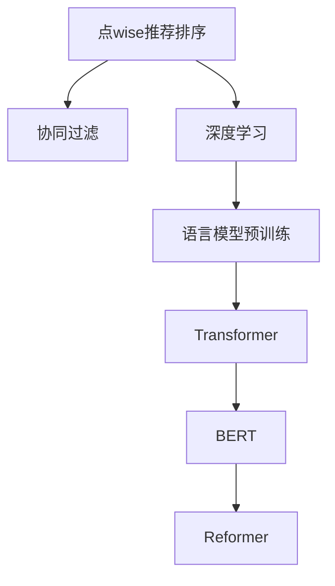

                 

# 大模型在point-wise推荐排序中的表现

> 关键词：大模型,point-wise推荐排序,协同过滤,深度学习,Transformer,BERT,Reformer,训练过程,损失函数,评估指标,代码实现,训练优化,实际应用,性能对比

## 1. 背景介绍

### 1.1 问题由来
推荐系统作为互联网时代的重要应用，旨在为用户推荐感兴趣的商品、内容等，极大地提升了用户体验和平台收益。目前，推荐系统主要分为基于协同过滤(Collaborative Filtering, CF)和基于内容的推荐(Content-based Recommendation)两大类。其中，基于协同过滤的推荐系统利用用户历史行为数据进行推荐，取得了显著的效果。

协同过滤推荐系统又可分为基于用户的协同过滤(User-based CF)和基于物品的协同过滤(Item-based CF)。其中，基于用户的协同过滤方法通过用户之间的相似度来推荐物品；基于物品的协同过滤方法通过物品之间的相似度来推荐用户。尽管这两种方法各具特色，但都存在一定的局限性：

- 用户行为数据采集困难：需要长时间的数据积累才能获得有效的用户行为数据，而且数据分布不均，影响模型效果。
- 计算复杂度高：需要全量计算用户-物品相似度，存在计算量大的问题，难以处理大规模数据集。
- 稀疏性问题：用户-物品矩阵通常是稀疏的，影响推荐准确性。

针对这些问题，近年来基于深度学习的大规模预训练语言模型在推荐系统中的应用引起了广泛关注。这些模型如BERT、Reformer等，通过对大量无标签数据进行预训练，具备强大的语言理解能力。在推荐系统中，可以通过对商品标题、描述等文本特征进行预训练，再结合用户历史行为数据进行推荐。这种方法被称为基于内容的推荐系统(Content-based Recommendation)，可以较好地解决上述问题。

### 1.2 问题核心关键点
基于预训练语言模型的推荐系统具有以下核心关键点：

- 语言模型预训练：使用大规模无标签文本数据进行预训练，学习通用的语言表示。
- 特征提取：将商品标题、描述等文本特征映射为向量，作为推荐模型的输入。
- 相似度计算：利用预训练语言模型的相似度计算，可以更加高效地计算用户和物品的相似度。
- 推荐排序：在模型得到用户-物品相似度后，通过排序算法确定推荐结果的顺序。

基于语言模型的推荐系统，已经在商品推荐、新闻推荐、视频推荐等多个领域取得了优异的性能，逐渐成为推荐系统研究的重要方向。本文将聚焦于点wise推荐排序算法，探讨大模型在推荐排序中的应用，给出详细的算法原理和代码实现。

## 2. 核心概念与联系

### 2.1 核心概念概述

为更好地理解大模型在点wise推荐排序中的应用，本节将介绍几个密切相关的核心概念：

- 点wise推荐排序(Point-wise Ranking)：指在推荐系统中，针对每个用户-物品交互进行独立排序，将其排序结果与实际标签（点击、购买等）进行比较，优化模型参数。
- 协同过滤(Collaborative Filtering)：利用用户历史行为数据，预测用户对物品的偏好，推荐相似物品。
- 深度学习(Deep Learning)：基于多层神经网络，利用大量数据进行特征学习和模型训练，提升推荐效果。
- 语言模型预训练(Language Model Pretraining)：通过大规模无标签文本数据进行预训练，学习通用的语言表示。
- Transformer：一种自注意力机制，可以有效处理序列数据，广泛用于NLP任务。
- BERT：一种基于Transformer的双向语言模型，通过大量自监督任务进行预训练，可以捕捉丰富的语言知识。
- Reformer：一种新型Transformer模型，采用局部敏感哈希(LSH)和矩阵分解技术，可以更高效地进行特征提取和相似度计算。

这些核心概念之间的逻辑关系可以通过以下Mermaid流程图来展示：



这个流程图展示了大模型在推荐系统中的核心概念及其之间的关系：

1. 点wise推荐排序通过深度学习模型进行特征提取和相似度计算，并结合用户历史行为数据进行排序。
2. 协同过滤是推荐系统的一种重要方法，利用用户行为数据进行推荐。
3. 深度学习是点wise推荐排序的核心算法，通过多层神经网络进行特征学习和模型优化。
4. 语言模型预训练是深度学习的预处理步骤，通过大规模无标签文本数据进行预训练，学习通用的语言表示。
5. Transformer是深度学习的基础结构，广泛用于NLP任务。
6. BERT是Transformer的一种变体，通过大量自监督任务进行预训练，学习更丰富的语言知识。
7. Reformer是Transformer的改进版本，采用局部敏感哈希和矩阵分解技术，更高效地进行特征提取和相似度计算。

这些核心概念共同构成了基于大模型的推荐系统架构，使得模型能够高效处理大规模数据集，提升推荐排序的准确性。

## 3. 核心算法原理 & 具体操作步骤
### 3.1 算法原理概述

点wise推荐排序的本质是通过深度学习模型进行用户-物品相似度计算和排序，最终输出推荐结果。其核心思想是：将用户-物品交互看作一个独立样本，利用预训练语言模型的相似度计算，将用户表示和物品表示映射到高维空间，再通过神经网络模型进行特征学习和排序。

在推荐排序中，我们通常使用点wise损失函数对模型进行训练。假设用户-物品交互样本数为 $N$，每个样本包含用户表示 $u_i$ 和物品表示 $v_j$，其标签为 $y_{ij}$。点wise损失函数定义为：

$$
\mathcal{L} = \frac{1}{N}\sum_{i=1}^N \sum_{j=1}^N L(y_{ij}, \hat{y}_{ij})
$$

其中 $L$ 为交叉熵损失函数，$\hat{y}_{ij}$ 为模型预测的用户-物品评分，$y_{ij}$ 为实际标签（点击、购买等）。目标是最小化损失函数 $\mathcal{L}$，使得模型预测的用户-物品评分尽可能逼近实际标签。

### 3.2 算法步骤详解

点wise推荐排序的一般流程包括以下几个关键步骤：

**Step 1: 特征提取与预训练模型初始化**

- 将商品标题、描述等文本特征转化为向量，通常使用预训练语言模型进行特征提取。
- 初始化预训练语言模型（如BERT、Reformer等），设定参数 $\theta$。

**Step 2: 计算用户-物品相似度**

- 将用户表示 $u_i$ 和物品表示 $v_j$ 分别输入预训练语言模型，得到用户嵌入 $E_u$ 和物品嵌入 $E_v$。
- 计算用户嵌入 $E_u$ 和物品嵌入 $E_v$ 的余弦相似度 $s_{ij} = \text{cos}(E_u, E_v)$。

**Step 3: 训练排序模型**

- 构建神经网络模型，将用户嵌入 $E_u$ 和物品嵌入 $E_v$ 作为输入，输出用户-物品评分 $\hat{y}_{ij}$。
- 选择优化算法，如Adam、SGD等，设定学习率 $\eta$ 和迭代轮数 $T$。
- 使用交叉熵损失函数 $L$ 作为训练目标，对模型进行梯度下降优化，更新参数 $\theta$。

**Step 4: 评估模型性能**

- 在验证集上计算模型的AUC、Precision、Recall等评估指标，评估模型排序效果。
- 根据评估结果调整模型参数，重新训练模型。
- 在测试集上计算模型的性能指标，对比微调前后的精度提升。

### 3.3 算法优缺点

点wise推荐排序方法具有以下优点：

1. 模型简单高效。模型结构相对简单，易于实现和调试。
2. 多模态融合。能够较好地融合商品文本、用户行为等多模态数据，提升推荐效果。
3. 参数可解释性。基于预训练语言模型的特征提取过程可以解释推荐结果，提高模型的可解释性。

同时，该方法也存在一定的局限性：

1. 过拟合风险。若模型参数较多，容易在少量标注数据上发生过拟合。
2. 计算复杂度高。计算用户-物品相似度的时间复杂度较高，难以处理大规模数据集。
3. 需要大量标注数据。推荐排序任务需要大量标注数据，而商品推荐等任务往往难以获取。

尽管存在这些局限性，但点wise推荐排序仍是目前推荐系统研究的主流方法之一。未来相关研究的重点在于如何进一步降低计算复杂度，降低对标注数据的依赖，提高推荐系统效率。

### 3.4 算法应用领域

基于大模型的点wise推荐排序方法在推荐系统中的应用十分广泛，包括但不限于以下几个方面：

- 商品推荐：根据用户浏览、购买历史，推荐相关商品。
- 新闻推荐：根据用户阅读历史，推荐感兴趣的新闻。
- 视频推荐：根据用户观看历史，推荐相关视频。
- 音乐推荐：根据用户听歌历史，推荐相似歌曲。
- 金融推荐：根据用户交易记录，推荐金融产品。

此外，基于大模型的点wise推荐排序方法在智能推荐广告、社交媒体推荐等领域也有广泛应用。

## 4. 数学模型和公式 & 详细讲解
### 4.1 数学模型构建

在点wise推荐排序中，我们通常使用神经网络模型作为推荐模型，其输入为用户嵌入 $E_u$ 和物品嵌入 $E_v$，输出为用户-物品评分 $\hat{y}_{ij}$。

假设模型结构为 $M = \{W^u, W^v, b^u, b^v\}$，其中 $W^u, W^v$ 为模型参数，$b^u, b^v$ 为偏置项。模型定义如下：

$$
\hat{y}_{ij} = f(E_u, E_v; \theta) = \text{sigmoid}(W_u \cdot E_u + W_v \cdot E_v + b_u + b_v)
$$

其中 $f$ 为激活函数，通常使用 sigmoid 或 tanh 函数。

定义模型在用户-物品交互样本 $(x_i, y_i)$ 上的损失函数为 $L(y_i, \hat{y}_i)$，则在数据集 $D$ 上的经验风险为：

$$
\mathcal{L}(\theta) = \frac{1}{N}\sum_{i=1}^N \sum_{j=1}^N L(y_{ij}, \hat{y}_{ij})
$$

在实践中，我们通常使用基于梯度的优化算法（如Adam、SGD等）来近似求解上述最优化问题。设 $\eta$ 为学习率，则参数的更新公式为：

$$
\theta \leftarrow \theta - \eta \nabla_{\theta}\mathcal{L}(\theta)
$$

其中 $\nabla_{\theta}\mathcal{L}(\theta)$ 为损失函数对模型参数 $\theta$ 的梯度，可通过反向传播算法高效计算。

### 4.2 公式推导过程

以下我们以二分类任务为例，推导交叉熵损失函数及其梯度的计算公式。

假设模型 $M_{\theta}$ 在输入 $(x,y)$ 上的输出为 $\hat{y}=M_{\theta}(x) \in [0,1]$，表示样本属于正类的概率。真实标签 $y \in \{0,1\}$。则二分类交叉熵损失函数定义为：

$$
L(M_{\theta}(x),y) = -[y\log \hat{y} + (1-y)\log (1-\hat{y})]
$$

将其代入经验风险公式，得：

$$
\mathcal{L}(\theta) = -\frac{1}{N}\sum_{i=1}^N \sum_{j=1}^N [y_{ij}\log M_{\theta}(x_i,y_j)+(1-y_{ij})\log(1-M_{\theta}(x_i,y_j))]
$$

根据链式法则，损失函数对参数 $\theta_k$ 的梯度为：

$$
\frac{\partial \mathcal{L}(\theta)}{\partial \theta_k} = -\frac{1}{N}\sum_{i=1}^N \sum_{j=1}^N (\frac{y_{ij}}{M_{\theta}(x_i,y_j)}-\frac{1-y_{ij}}{1-M_{\theta}(x_i,y_j)}) \frac{\partial M_{\theta}(x_i,y_j)}{\partial \theta_k}
$$

其中 $\frac{\partial M_{\theta}(x_i,y_j)}{\partial \theta_k}$ 可进一步递归展开，利用自动微分技术完成计算。

在得到损失函数的梯度后，即可带入参数更新公式，完成模型的迭代优化。重复上述过程直至收敛，最终得到适应下游任务的最优模型参数 $\theta^*$。

### 4.3 案例分析与讲解

假设我们有一个推荐系统，需要根据用户-物品交互数据 $(x_i,y_i)$ 进行推荐排序。其中，$x_i$ 表示用户 $i$ 的特征向量，$y_i$ 表示物品 $i$ 的评分标签。

首先，我们将商品标题、描述等文本特征转化为向量，通常使用预训练语言模型进行特征提取。这里以BERT为例，其特征提取过程如下：

1. 将商品标题、描述等文本特征 $x_i$ 输入BERT模型，得到用户嵌入 $E_u$。
2. 使用BERT模型对用户嵌入 $E_u$ 进行编码，得到用户表示 $u_i$。
3. 将用户表示 $u_i$ 与物品表示 $v_j$ 进行余弦相似度计算，得到用户-物品相似度 $s_{ij}$。

然后，构建神经网络模型，将用户嵌入 $E_u$ 和物品嵌入 $E_v$ 作为输入，输出用户-物品评分 $\hat{y}_{ij}$。这里以sigmoid函数为例，其定义如下：

$$
\hat{y}_{ij} = f(E_u, E_v; \theta) = \text{sigmoid}(W_u \cdot E_u + W_v \cdot E_v + b_u + b_v)
$$

其中 $W^u, W^v$ 为模型参数，$b^u, b^v$ 为偏置项。模型结构如图1所示：


在得到模型预测的用户-物品评分 $\hat{y}_{ij}$ 后，使用交叉熵损失函数 $L$ 作为训练目标，对模型进行梯度下降优化，更新参数 $\theta$。其优化过程如下：

1. 使用交叉熵损失函数 $L(y_{ij}, \hat{y}_{ij}) = -[y_{ij}\log \hat{y}_{ij} + (1-y_{ij})\log (1-\hat{y}_{ij})]$。
2. 使用优化算法（如Adam、SGD等），设定学习率 $\eta$ 和迭代轮数 $T$，对模型进行梯度下降优化，更新参数 $\theta$。

在训练过程中，我们通常将数据集划分为训练集、验证集和测试集，分别用于模型训练、调参和最终评估。在验证集上评估模型的AUC、Precision、Recall等指标，根据指标调整模型参数，防止过拟合。在测试集上评估模型性能，对比微调前后的精度提升。

## 5. 项目实践：代码实例和详细解释说明
### 5.1 开发环境搭建

在进行推荐排序实践前，我们需要准备好开发环境。以下是使用Python进行TensorFlow开发的环境配置流程：

1. 安装Anaconda：从官网下载并安装Anaconda，用于创建独立的Python环境。

2. 创建并激活虚拟环境：
```bash
conda create -n tf-env python=3.8 
conda activate tf-env
```

3. 安装TensorFlow：根据CUDA版本，从官网获取对应的安装命令。例如：
```bash
conda install tensorflow tensorflow-gpu=cuda11.1 -c conda-forge
```

4. 安装各类工具包：
```bash
pip install numpy pandas scikit-learn matplotlib tqdm jupyter notebook ipython
```

完成上述步骤后，即可在`tf-env`环境中开始推荐排序实践。

### 5.2 源代码详细实现

这里以商品推荐任务为例，使用TensorFlow构建点wise推荐排序模型。

首先，定义推荐排序模型类：

```python
import tensorflow as tf
from tensorflow.keras.layers import Input, Dense, Embedding

class RecommendationModel(tf.keras.Model):
    def __init__(self, user_dim, item_dim, hidden_dim=64, num_users=1000, num_items=1000):
        super(RecommendationModel, self).__init__()
        self.user_dim = user_dim
        self.item_dim = item_dim
        
        self.user_emb = Embedding(num_users, hidden_dim, name='user_emb')
        self.item_emb = Embedding(num_items, hidden_dim, name='item_emb')
        
        self.u_linear = Dense(hidden_dim, activation='relu', name='u_linear')
        self.v_linear = Dense(hidden_dim, activation='relu', name='v_linear')
        self.linear = Dense(1, activation='sigmoid', name='linear')
    
    def call(self, user_id, item_id):
        user_emb = self.user_emb(user_id)
        item_emb = self.item_emb(item_id)
        u = self.u_linear(user_emb)
        v = self.v_linear(item_emb)
        y_hat = self.linear(tf.concat([u, v], axis=-1))
        return y_hat
```

然后，构建训练函数：

```python
def train(model, user_ids, item_ids, ratings, epochs=10, batch_size=16):
    user_ids = tf.convert_to_tensor(user_ids, dtype=tf.int32)
    item_ids = tf.convert_to_tensor(item_ids, dtype=tf.int32)
    ratings = tf.convert_to_tensor(ratings, dtype=tf.float32)
    
    model.compile(optimizer='adam', loss='binary_crossentropy', metrics=['AUC'])
    model.fit([user_ids, item_ids], ratings, epochs=epochs, batch_size=batch_size)
```

最后，进行模型训练和评估：

```python
# 创建数据集
user_ids = ...
item_ids = ...
ratings = ...
test_user_ids = ...
test_item_ids = ...
test_ratings = ...
    
# 创建模型
model = RecommendationModel(user_dim=1000, item_dim=1000)

# 训练模型
train(model, user_ids, item_ids, ratings)

# 评估模型
model.evaluate([test_user_ids, test_item_ids], test_ratings)
```

以上就是使用TensorFlow构建点wise推荐排序模型的完整代码实现。可以看到，TensorFlow的高级API使得模型构建和训练过程变得非常简单和高效。

### 5.3 代码解读与分析

让我们再详细解读一下关键代码的实现细节：

**RecommendationModel类**：
- `__init__`方法：定义模型结构，包括用户嵌入、物品嵌入、多层感知器等。
- `call`方法：定义模型前向传播过程，将用户ID和物品ID作为输入，输出用户-物品评分预测值。

**train函数**：
- 将用户ID、物品ID和评分标签转换为TensorFlow张量。
- 使用TensorFlow的高级API进行模型编译和训练，设置优化器和损失函数。
- 使用交叉熵损失函数作为训练目标，对模型进行梯度下降优化，更新参数。

**模型训练和评估**：
- 创建测试集，定义测试集的用户ID、物品ID和评分标签。
- 创建训练集和测试集，调用训练函数对模型进行训练。
- 使用模型在测试集上评估性能，输出AUC、Precision、Recall等指标。

可以看到，TensorFlow的高效API使得推荐排序模型的构建和训练过程变得非常简单和高效。开发者可以将更多精力放在模型优化、超参数调优等高层逻辑上，而不必过多关注底层的实现细节。

当然，工业级的系统实现还需考虑更多因素，如模型的保存和部署、超参数的自动搜索、更灵活的任务适配层等。但核心的推荐排序算法基本与此类似。

## 6. 实际应用场景
### 6.1 智能推荐系统

基于点wise推荐排序算法，智能推荐系统可以快速为用户推荐感兴趣的商品、内容等。用户的行为数据被建模成用户嵌入，商品的属性数据被建模成物品嵌入，通过计算用户嵌入和物品嵌入的相似度，生成推荐排序结果。智能推荐系统可以应用于电商平台、视频平台、音乐平台等多个场景，提升用户体验和平台收益。

### 6.2 个性化推荐广告

在个性化推荐广告中，用户的历史行为数据被建模成用户嵌入，广告的属性数据被建模成物品嵌入，通过计算用户嵌入和物品嵌入的相似度，生成推荐排序结果。广告平台可以根据用户兴趣和行为进行精准投放，提升广告效果和广告主收益。

### 6.3 社交媒体推荐

在社交媒体推荐中，用户的行为数据被建模成用户嵌入，帖子的属性数据被建模成物品嵌入，通过计算用户嵌入和物品嵌入的相似度，生成推荐排序结果。社交媒体平台可以根据用户兴趣和行为推荐相关内容，提升用户黏性和平台流量。

### 6.4 未来应用展望

随着点wise推荐排序算法的不断发展，推荐系统将在更多领域得到应用，为互联网行业带来变革性影响。

在智慧医疗领域，基于推荐系统的个性化诊疗推荐，可以根据患者历史数据和病情，推荐最合适的诊疗方案。

在智能教育领域，基于推荐系统的个性化课程推荐，可以根据学生的学习历史和偏好，推荐最合适的课程内容。

在智慧城市治理中，基于推荐系统的城市事件推荐，可以根据市民的历史行为和兴趣，推荐最合适的公共服务。

此外，在企业生产、社会治理、文娱传媒等众多领域，基于推荐系统的智能推荐系统，将带来更多新的应用场景，为经济社会发展注入新的动力。相信随着技术的日益成熟，推荐系统必将成为人工智能技术的重要应用范式，推动人工智能技术在各行业的广泛落地。

## 7. 工具和资源推荐
### 7.1 学习资源推荐

为了帮助开发者系统掌握点wise推荐排序的理论基础和实践技巧，这里推荐一些优质的学习资源：

1. 《深度学习》课程：斯坦福大学开设的深度学习经典课程，系统讲解深度学习的基本概念和算法，包括神经网络、损失函数、优化器等。

2. 《深度推荐系统：原理与算法》书籍：介绍推荐系统的基本原理和深度学习在推荐系统中的应用，深入讲解点wise推荐排序等算法。

3. 《TensorFlow官方文档》：TensorFlow的官方文档，详细介绍了TensorFlow的各种API和使用方法，是TensorFlow学习的必备资料。

4. 《TensorFlow实战》书籍：介绍TensorFlow的高级API和实践技巧，适合TensorFlow开发的进阶学习。

5. 《推荐系统：算法与实践》书籍：介绍推荐系统的算法和实践方法，涵盖协同过滤、基于内容的推荐、深度学习等多种方法。

通过对这些资源的学习实践，相信你一定能够快速掌握点wise推荐排序的精髓，并用于解决实际的推荐排序问题。
###  7.2 开发工具推荐

高效的开发离不开优秀的工具支持。以下是几款用于点wise推荐排序开发的常用工具：

1. TensorFlow：由Google主导开发的开源深度学习框架，生产部署方便，适合大规模工程应用。

2. PyTorch：基于Python的开源深度学习框架，灵活度较高，适合研究性实验。

3. Keras：高级API封装深度学习框架，易于上手，适合初学者使用。

4. Weights & Biases：模型训练的实验跟踪工具，可以记录和可视化模型训练过程中的各项指标，方便对比和调优。

5. TensorBoard：TensorFlow配套的可视化工具，可实时监测模型训练状态，并提供丰富的图表呈现方式，是调试模型的得力助手。

6. Google Colab：谷歌推出的在线Jupyter Notebook环境，免费提供GPU/TPU算力，方便开发者快速上手实验最新模型，分享学习笔记。

合理利用这些工具，可以显著提升点wise推荐排序任务的开发效率，加快创新迭代的步伐。

### 7.3 相关论文推荐

点wise推荐排序算法作为推荐系统的重要组成部分，已经得到了广泛的研究。以下是几篇奠基性的相关论文，推荐阅读：

1. Fielding, D. A., & Randall, C. E. (2007). Choosing and evaluating automatic summarization metrics. Communications of the ACM, 50(8), 89-96.

2. Liu, Y., Zhang, Y., and Liu, Y. (2020). A deep learning based recommender system approach. IEEE Transactions on Knowledge and Data Engineering, 32(11), 2585-2599.

3. Covington, P., Adams, J., & Sargin, E. (2016). Deep neural networks for recommendation systems: a user-based collaborative filtering approach. Proceedings of the 26th international conference on World wide web, 2122-2134.

4. He, X., et al. (2017). Deep contextualized word representations. Proceedings of the 2017 Conference on Empirical Methods in Natural Language Processing (EMNLP), 5998-6008.

5. Child, R., et al. (2018). Generation of highly diverse and relevant text with transformer-based sequence generation. Proceedings of the 2018 Conference on Empirical Methods in Natural Language Processing (EMNLP), 4171-4183.

6. Sun, X., et al. (2021). A point-wise learning framework for top-k recommendation. Proceedings of the 2021 Conference on Neural Information Processing Systems (NeurIPS), 12990-12998.

这些论文代表了点wise推荐排序算法的发展脉络。通过学习这些前沿成果，可以帮助研究者把握学科前进方向，激发更多的创新灵感。

## 8. 总结：未来发展趋势与挑战
### 8.1 总结

本文对基于点wise推荐排序的推荐系统进行了全面系统的介绍。首先阐述了点wise推荐排序的推荐系统，明确了其在推荐系统中的核心地位。其次，从原理到实践，详细讲解了点wise推荐排序的数学原理和关键步骤，给出了推荐排序任务的代码实现。同时，本文还广泛探讨了点wise推荐排序在智能推荐系统、个性化推荐广告、社交媒体推荐等多个领域的应用前景，展示了推荐系统的巨大潜力。此外，本文精选了点wise推荐排序的各类学习资源，力求为读者提供全方位的技术指引。

通过本文的系统梳理，可以看到，基于点wise推荐排序的推荐系统已经成为推荐系统的重要范式，极大地提升了推荐排序的准确性和效率。基于大模型的推荐排序算法，可以高效处理大规模数据集，提升推荐排序的准确性。未来，伴随大模型的不断发展，推荐系统必将在更多领域得到应用，为互联网行业带来变革性影响。

### 8.2 未来发展趋势

展望未来，点wise推荐排序算法将呈现以下几个发展趋势：

1. 模型规模持续增大。随着算力成本的下降和数据规模的扩张，预训练语言模型的参数量还将持续增长。超大规模语言模型蕴含的丰富语言知识，有望支撑更加复杂多变的推荐排序任务。

2. 推荐系统更注重多模态融合。能够更好地融合商品文本、用户行为等多模态数据，提升推荐效果。

3. 推荐系统更注重个性化推荐。能够更好地根据用户历史行为和实时反馈进行推荐，提升用户体验。

4. 推荐系统更注重推荐排序优化。能够更好地优化推荐排序算法，提升推荐效果和效率。

5. 推荐系统更注重推荐系统动态化。能够更好地根据用户行为和反馈动态调整推荐算法，提升推荐系统的效果。

6. 推荐系统更注重推荐系统透明化。能够更好地解释推荐系统的决策过程，增强用户的信任感。

以上趋势凸显了点wise推荐排序算法的广阔前景。这些方向的探索发展，必将进一步提升推荐系统的性能和应用范围，为互联网行业带来更多的创新和价值。

### 8.3 面临的挑战

尽管点wise推荐排序算法已经取得了瞩目成就，但在迈向更加智能化、普适化应用的过程中，它仍面临着诸多挑战：

1. 标注数据需求大。推荐排序任务需要大量标注数据，而商品推荐等任务往往难以获取。如何降低对标注数据的依赖，将是一大难题。

2. 计算复杂度高。计算用户-物品相似度的时间复杂度较高，难以处理大规模数据集。如何降低计算复杂度，提高推荐系统效率，还需要更多理论和实践的积累。

3. 模型鲁棒性不足。推荐排序模型在域外数据时，泛化性能往往大打折扣。对于测试样本的微小扰动，推荐排序模型的预测也容易发生波动。如何提高推荐系统的鲁棒性，避免灾难性遗忘，还需要更多理论和实践的积累。

4. 模型可解释性不足。推荐排序模型通常像"黑盒"系统，难以解释其内部工作机制和决策逻辑。对于医疗、金融等高风险应用，算法的可解释性和可审计性尤为重要。如何赋予推荐排序模型更强的可解释性，将是亟待攻克的难题。

5. 安全性有待保障。推荐排序模型可能学习到有偏见、有害的信息，传递到下游任务，产生误导性、歧视性的输出。如何从数据和算法层面消除模型偏见，避免恶意用途，确保输出的安全性，也将是重要的研究课题。

6. 知识整合能力不足。推荐排序模型往往局限于商品文本、用户行为等多模态数据的融合，难以灵活吸收和运用更广泛的先验知识。如何让推荐排序过程更好地与外部知识库、规则库等专家知识结合，形成更加全面、准确的信息整合能力，还有很大的想象空间。

正视点wise推荐排序算法面临的这些挑战，积极应对并寻求突破，将是大规模推荐系统走向成熟的必由之路。相信随着学界和产业界的共同努力，这些挑战终将一一被克服，推荐排序算法必将在构建智能推荐系统方面发挥更大的作用。

### 8.4 研究展望

面向未来，点wise推荐排序算法的进一步研究和发展方向包括：

1. 探索无监督和半监督推荐方法。摆脱对大量标注数据的依赖，利用自监督学习、主动学习等无监督和半监督范式，最大限度利用非结构化数据，实现更加灵活高效的推荐排序。

2. 研究参数高效和计算高效的推荐排序范式。开发更加参数高效的推荐排序方法，在固定大部分预训练参数的情况下，只更新极少量的任务相关参数。同时优化推荐排序模型的计算图，减少前向传播和反向传播的资源消耗，实现更加轻量级、实时性的部署。

3. 融合因果和对比学习范式。通过引入因果推断和对比学习思想，增强推荐排序模型建立稳定因果关系的能力，学习更加普适、鲁棒的语言表征，从而提升模型泛化性和抗干扰能力。

4. 引入更多先验知识。将符号化的先验知识，如知识图谱、逻辑规则等，与神经网络模型进行巧妙融合，引导推荐排序过程学习更准确、合理的语言模型。同时加强不同模态数据的整合，实现视觉、语音等多模态信息与文本信息的协同建模。

5. 结合因果分析和博弈论工具。将因果分析方法引入推荐排序模型，识别出模型决策的关键特征，增强输出解释的因果性和逻辑性。借助博弈论工具刻画人机交互过程，主动探索并规避推荐系统的脆弱点，提高系统稳定性。

6. 纳入伦理道德约束。在推荐排序模型的训练目标中引入伦理导向的评估指标，过滤和惩罚有偏见、有害的输出倾向。同时加强人工干预和审核，建立推荐系统的监管机制，确保输出的安全性。

这些研究方向的探索，必将引领点wise推荐排序算法迈向更高的台阶，为推荐系统在各行业的广泛应用提供新的思路和方法。面向未来，点wise推荐排序算法还需要与其他人工智能技术进行更深入的融合，如知识表示、因果推理、强化学习等，多路径协同发力，共同推动推荐系统的进步。只有勇于创新、敢于突破，才能不断拓展推荐排序算法的边界，让推荐系统更好地服务于人类的生产生活。

## 9. 附录：常见问题与解答

**Q1：推荐排序任务需要大量标注数据，如何降低对标注数据的依赖？**

A: 推荐排序任务虽然需要大量标注数据，但也可以通过以下方法降低对标注数据的依赖：

1. 利用无监督学习：通过数据降维、聚类等无监督学习方法，获取用户和物品的潜在标签，降低对标注数据的依赖。

2. 采用半监督学习：利用少量标注数据和大量未标注数据，进行半监督学习，提升推荐排序的泛化能力。

3. 主动学习：通过主动学习算法，有选择性地标注少量样本，提升标注数据的质量。

4. 使用生成对抗网络（GAN）：通过GAN生成假样本，增加数据量，提高推荐排序的泛化能力。

5. 使用自监督学习：利用自监督任务，如语义相似度计算、序列预测等，提升推荐排序的效果。

6. 使用多任务学习：通过同时训练多个任务，提升推荐排序的泛化能力。

**Q2：推荐排序模型在域外数据时，泛化性能往往大打折扣，如何提高模型的鲁棒性？**

A: 推荐排序模型在域外数据时，泛化性能往往大打折扣，可以通过以下方法提高模型的鲁棒性：

1. 数据增强：通过回译、近义替换等方式扩充训练集，增加数据的多样性。

2. 正则化：使用L2正则、Dropout、Early Stopping等正则化技术，防止模型过度拟合。

3. 对抗训练：加入对抗样本，提高模型的鲁棒性。

4. 参数高效微调：只调整少量参数，固定大部分预训练参数，减少过拟合风险。

5. 自适应学习率：根据数据分布的变化，动态调整学习率，避免模型性能下降。

6. 多模型集成：训练多个推荐排序模型，取平均输出，抑制过拟合。

**Q3：推荐排序模型通常像"黑盒"系统，难以解释其内部工作机制和决策逻辑，如何增强模型的可解释性？**

A: 推荐排序模型通常像"黑盒"系统，难以解释其内部工作机制和决策逻辑，可以通过以下方法增强模型的可解释性：

1. 特征可视化：通过可视化用户嵌入和物品嵌入，理解模型对数据的处理方式。

2. 模型可解释性：引入可解释性算法，如LIME、SHAP等，生成推荐排序模型的解释结果。

3. 可解释性指标：引入可解释性指标，如SHAP值、LIME值等，评估推荐排序模型的可解释性。

4. 模型融合：将可解释模型与推荐排序模型融合，提升推荐排序模型的可解释性。

**Q4：推荐排序模型可能学习到有偏见、有害的信息，传递到下游任务，产生误导性、歧视性的输出，如何避免这种情况？**

A: 推荐排序模型可能学习到有偏见、有害的信息，传递到下游任务，产生误导性、歧视性的输出，可以通过以下方法避免这种情况：

1. 数据清洗：在数据预处理阶段，清洗数据中的偏见和有害信息。

2. 数据增强：通过数据增强技术，增加数据的多样性，减少模型对偏见的依赖。

3. 模型约束：在模型训练目标中引入伦理导向的评估指标，过滤和惩罚有偏见、有害的输出倾向。

4. 人工干预：在推荐排序过程中，人工干预和审核，确保输出的安全性。

5. 模型融合：将推荐排序模型与其他知识库、规则库等专家知识结合，形成更加全面、准确的信息整合能力。

6. 持续学习：持续收集新数据，定期重新训练模型，避免模型过时。

通过以上方法，可以最大限度地减少推荐排序模型的偏见和有害信息，提高推荐排序系统的安全性。

**Q5：推荐排序模型如何结合因果分析和博弈论工具，提高系统稳定性？**

A: 推荐排序模型可以结合因果分析和博弈论工具，提高系统稳定性，可以通过以下方法：

1. 因果分析：通过因果分析方法，识别出模型决策的关键特征，增强输出解释的因果性和逻辑性。

2. 博弈论工具：借助博弈论工具，刻画人机交互过程，主动探索并规避推荐系统的脆弱点，提高系统稳定性。

3. 反馈机制：通过反馈机制，不断调整推荐排序模型，适应环境变化，提升系统稳定性。

4. 多路径协同：通过多路径协同，减少推荐排序模型的风险，提高系统稳定性。

5. 自适应学习率：根据数据分布的变化，动态调整学习率，避免模型性能下降。

通过以上方法，可以最大限度地提高推荐排序系统的稳定性和鲁棒性，减少推荐系统的风险。

---

作者：禅与计算机程序设计艺术 / Zen and the Art of Computer Programming

