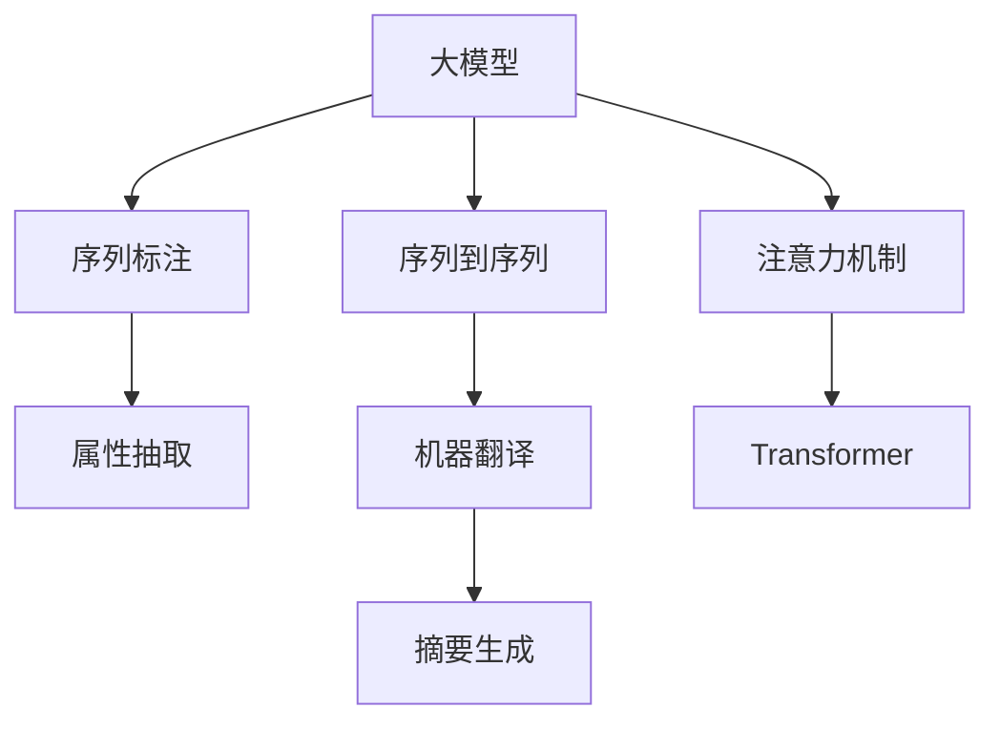

                 

# 大模型在商品属性抽取中的应用

> 关键词：大模型, 商品属性抽取, 自然语言处理(NLP), 序列标注, 序列到序列模型(Seq2Seq), 注意力机制, Transformer, 代码实例

## 1. 背景介绍

### 1.1 问题由来
商品属性抽取是电子商务领域中重要的任务之一。商家需要在商品详情页中准确抽取商品属性信息，如尺寸、颜色、材质等，以便进行商品推荐、库存管理、搜索引擎优化等。传统的商品属性抽取方法通常依赖于手工规则或特征工程，但这些方法难以应对海量商品数据的动态变化和复杂多样性，效率和效果均不理想。近年来，随着大语言模型的发展，通过序列标注任务，商品属性抽取成为了大模型的重要应用方向之一。

### 1.2 问题核心关键点
商品属性抽取的核心在于从商品描述文本中识别出属性-值对，如颜色(值)和尺寸(值)。对于每个属性，我们需要先识别出起始位置，再通过序列标注任务确定属性值。因此，商品属性抽取本质上是一个序列标注问题。现有的大语言模型，如BERT、GPT等，已经能够很好地处理这类任务，通过微调可以显著提升属性抽取的准确率和召回率。

### 1.3 问题研究意义
商品属性抽取的应用领域非常广泛，如电商平台、在线零售商、智能客服等。通过精准的资产属性抽取，可以提升用户购物体验、优化库存管理、增强搜索引擎性能等，从而为商家创造更大价值。同时，商品属性抽取也有助于市场分析和产品研发，帮助商家更好地理解消费者需求和市场趋势。

## 2. 核心概念与联系

### 2.1 核心概念概述

为更好地理解大模型在商品属性抽取中的应用，本节将介绍几个密切相关的核心概念：

- **大模型(Large Model)**：以Transformer等结构为基础的大规模预训练语言模型，如BERT、GPT-3等。这些模型能够从大规模无标签数据中学习通用的语言表示，具备强大的自然语言理解和生成能力。
- **序列标注(Sequence Labeling)**：将文本序列中的每个元素(词、字符等)标注上特定的标签，如实体识别、属性抽取等。序列标注任务在NLP领域中广泛应用，是商品属性抽取的重要手段。
- **序列到序列模型(Seq2Seq Model)**：包括编码器-解码器结构，将输入序列映射到输出序列的模型，如机器翻译、摘要生成等。序列到序列模型可以灵活处理输入输出序列长度不一致的问题。
- **注意力机制(Attention Mechanism)**：一种机制，用于在解码时动态关注编码器输入序列中的特定部分，提升模型性能。
- **Transformer**：一种基于注意力机制的神经网络结构，特别适用于处理序列数据。Transformer通过多头自注意力机制，可以更好地捕捉长距离依赖。

这些核心概念之间的逻辑关系可以通过以下Mermaid流程图来展示：



这个流程图展示了大语言模型及其相关任务的概念关系：

1. 大模型通过预训练获得基础能力。
2. 序列标注任务是商品属性抽取的核心，大模型通过微调可以显著提升其性能。
3. 序列到序列模型可以处理更加灵活的输入输出结构。
4. 注意力机制增强了模型捕捉长距离依赖的能力。
5. Transformer成为序列处理的主流架构。

这些概念共同构成了大语言模型在商品属性抽取中的工作原理和优化方向。通过理解这些核心概念，我们可以更好地把握商品属性抽取的本质和实现方法。

## 3. 核心算法原理 & 具体操作步骤
### 3.1 算法原理概述

商品属性抽取任务的数学模型可以表述为：给定商品描述文本 $x$ 和对应的属性-值对 $y$，我们希望训练一个模型 $M$，使得在给定 $x$ 的情况下，$M$ 能够输出正确的属性值序列 $y$。

对于每个属性，我们需要先识别出起始位置 $s_i$ 和结束位置 $e_i$，然后通过序列标注任务确定属性值 $v_i$。因此，序列标注任务的数学模型可以表述为：

$$
P(y|x) = \prod_{i=1}^n P(v_i|v_{i-1}, x)
$$

其中 $v_i$ 表示第 $i$ 个属性值，$n$ 表示属性序列的长度。通过最大似然估计或交叉熵损失函数，我们可以训练一个概率模型 $P(v_i|v_{i-1}, x)$，使其最大化 $P(y|x)$。

在实际应用中，我们可以使用序列到序列模型，将商品描述 $x$ 映射到属性-值对序列 $y$。序列到序列模型包括编码器-解码器结构，其中编码器将输入序列 $x$ 编码成中间表示 $h$，解码器根据 $h$ 生成输出序列 $y$。

序列到序列模型的一般框架如下：

$$
\begin{aligned}
h &= f(E(x)) \\
y &= S(h)
\end{aligned}
$$

其中 $E$ 和 $S$ 分别为编码器和解码器，$f$ 为映射函数。

### 3.2 算法步骤详解

基于序列到序列模型的商品属性抽取流程如下：

**Step 1: 准备数据集**
- 收集商品描述文本及其对应的属性-值对标注数据，划分为训练集、验证集和测试集。
- 对文本进行预处理，包括分词、去除停用词、词形还原等。

**Step 2: 构建模型**
- 选择合适的序列到序列模型架构，如Seq2Seq、Transformer等。
- 在模型的顶部添加softmax层，用于输出属性-值对序列。
- 定义损失函数，如交叉熵损失。

**Step 3: 设置模型参数**
- 选择合适的超参数，如学习率、批量大小、迭代轮数等。
- 应用正则化技术，如Dropout、L2正则等。
- 使用参数高效微调技术，如Adapter、Prefix等，减少计算资源消耗。

**Step 4: 训练模型**
- 将训练集数据分批次输入模型，前向传播计算损失函数。
- 反向传播计算参数梯度，根据设定的优化算法和学习率更新模型参数。
- 周期性在验证集上评估模型性能，根据性能指标决定是否触发Early Stopping。
- 重复上述步骤直到满足预设的迭代轮数或Early Stopping条件。

**Step 5: 测试和评估**
- 在测试集上评估微调后模型 $M$ 的性能，对比微调前后的精度提升。
- 使用微调后的模型对新商品描述进行属性抽取，评估模型在新数据上的泛化能力。

### 3.3 算法优缺点

基于序列到序列模型的大语言模型商品属性抽取方法具有以下优点：

1. 简单易用。商品属性抽取是一个典型的序列标注任务，序列到序列模型可以很好地处理这类问题，不需要设计复杂的特征工程。
2. 性能优越。通过微调，大语言模型可以显著提升属性抽取的准确率和召回率，远超传统手工规则和特征工程方法。
3. 可扩展性强。大模型可以轻松处理多属性、多类别的商品描述，适应多样化的商品形态和属性类型。
4. 通用适用。序列到序列模型可以应用于各种NLP任务，包括命名实体识别、情感分析、机器翻译等。

同时，该方法也存在一定的局限性：

1. 对标注数据依赖大。微调效果很大程度上取决于标注数据的质量和数量，标注成本较高。
2. 序列长度限制。序列到序列模型对输入序列的长度有一定限制，长文本需要分段处理。
3. 模型复杂度高。大规模预训练模型虽然性能优越，但结构复杂，训练和推理成本较高。
4. 知识融合不足。商品属性抽取需要融合外部知识库、规则库等，模型难以灵活吸收先验知识。

尽管存在这些局限性，但就目前而言，基于序列到序列模型的方法仍是商品属性抽取的主流范式。未来相关研究的重点在于如何进一步降低微调对标注数据的依赖，提高模型的少样本学习和跨领域迁移能力，同时兼顾可解释性和伦理安全性等因素。

### 3.4 算法应用领域

基于序列到序列模型的商品属性抽取方法已经在电子商务领域得到了广泛应用，具体如下：

- **电商平台**：通过商品属性抽取，电商平台可以自动化地抓取商品详情页中的属性信息，如尺寸、颜色、材质等，用于商品推荐、搜索排序、库存管理等。
- **智能客服**：在智能客服系统中，商品属性抽取可以帮助系统更好地理解用户意图，提供精准的商品信息，提升用户满意度。
- **搜索引擎优化**：通过对商品属性进行抽取和标注，搜索引擎可以更好地理解商品内容，优化搜索结果，提升用户体验。
- **商品推荐系统**：商品属性抽取是商品推荐系统的重要组成部分，通过属性抽取可以更好地匹配用户需求和商品特性，提升推荐效果。

除了上述这些经典应用外，商品属性抽取也被创新性地应用于图像识别、情感分析等场景中，为电子商务系统带来了全新的技术突破。随着预训练语言模型和微调方法的持续演进，相信商品属性抽取技术将在更多领域得到应用，为电商企业带来更高效的运营管理。

## 4. 数学模型和公式 & 详细讲解  
### 4.1 数学模型构建

我们以BERT模型为例，构建商品属性抽取的数学模型。假设商品描述文本 $x$ 的长度为 $n$，属性序列 $y$ 的长度为 $m$。

定义BERT模型为 $M_{\theta}$，其中 $\theta$ 为模型参数。模型的输入为商品描述文本 $x$，输出为属性-值对序列 $y$。序列到序列模型的结构如下：

$$
h = M_{\theta}(x) \\
y = S(h)
$$

其中 $M_{\theta}(x)$ 为编码器，$S(h)$ 为解码器。

对于编码器 $M_{\theta}(x)$，其输出为中间表示 $h$，包含商品描述的语义信息。对于解码器 $S(h)$，其输出为属性-值对序列 $y$。

### 4.2 公式推导过程

为了训练模型 $M_{\theta}$，我们需要定义损失函数 $L(y, \hat{y})$，其中 $\hat{y}$ 为模型预测的属性-值对序列。我们采用交叉熵损失函数：

$$
L(y, \hat{y}) = -\frac{1}{N}\sum_{i=1}^N \sum_{j=1}^m \log \hat{y}_{i,j}
$$

其中 $N$ 为样本数量，$y_{i,j}$ 为第 $i$ 个样本中第 $j$ 个属性值的真实标签，$\hat{y}_{i,j}$ 为模型预测的第 $i$ 个样本中第 $j$ 个属性值的概率。

在训练过程中，我们使用反向传播算法更新模型参数，最小化损失函数。具体步骤如下：

1. 将商品描述文本 $x$ 输入编码器 $M_{\theta}(x)$，得到中间表示 $h$。
2. 将中间表示 $h$ 输入解码器 $S(h)$，得到属性-值对序列 $\hat{y}$。
3. 计算损失函数 $L(y, \hat{y})$。
4. 反向传播计算参数梯度，根据设定的优化算法和学习率更新模型参数。
5. 重复上述步骤直到模型收敛。

### 4.3 案例分析与讲解

我们以某电商平台商品属性抽取为例，说明具体实现过程。

假设电商平台收集了1000条商品描述文本，每条文本长度不超过500个字符，每条文本包含多个属性，属性包括尺寸、颜色、材质等。平台希望训练一个商品属性抽取模型，用于商品推荐和搜索排序。

**数据预处理**：
- 对商品描述文本进行分词和去除停用词。
- 对每个商品描述文本，标注出属性-值对序列。

**模型构建**：
- 选择BERT模型作为编码器，使用Seq2Seq结构作为解码器。
- 在解码器的顶部添加softmax层，用于输出属性-值对序列。
- 定义交叉熵损失函数。

**训练过程**：
- 将商品描述文本分批次输入模型，前向传播计算损失函数。
- 反向传播计算参数梯度，根据设定的优化算法和学习率更新模型参数。
- 周期性在验证集上评估模型性能，根据性能指标决定是否触发Early Stopping。
- 重复上述步骤直到模型收敛。

**测试和评估**：
- 在测试集上评估微调后模型 $M$ 的性能，对比微调前后的精度提升。
- 使用微调后的模型对新商品描述进行属性抽取，评估模型在新数据上的泛化能力。

## 5. 项目实践：代码实例和详细解释说明
### 5.1 开发环境搭建

在进行商品属性抽取实践前，我们需要准备好开发环境。以下是使用Python进行PyTorch开发的环境配置流程：

1. 安装Anaconda：从官网下载并安装Anaconda，用于创建独立的Python环境。

2. 创建并激活虚拟环境：
```bash
conda create -n pytorch-env python=3.8 
conda activate pytorch-env
```

3. 安装PyTorch：根据CUDA版本，从官网获取对应的安装命令。例如：
```bash
conda install pytorch torchvision torchaudio cudatoolkit=11.1 -c pytorch -c conda-forge
```

4. 安装Transformers库：
```bash
pip install transformers
```

5. 安装各类工具包：
```bash
pip install numpy pandas scikit-learn matplotlib tqdm jupyter notebook ipython
```

完成上述步骤后，即可在`pytorch-env`环境中开始商品属性抽取实践。

### 5.2 源代码详细实现

下面是使用BERT模型进行商品属性抽取的PyTorch代码实现。

首先，定义属性-值对数据集：

```python
from transformers import BertTokenizer
from torch.utils.data import Dataset
import torch

class ItemAttributeDataset(Dataset):
    def __init__(self, texts, attributes):
        self.texts = texts
        self.attributes = attributes
        self.tokenizer = BertTokenizer.from_pretrained('bert-base-cased')
        self.max_len = 512
        
    def __len__(self):
        return len(self.texts)
    
    def __getitem__(self, item):
        text = self.texts[item]
        attributes = self.attributes[item]
        
        encoding = self.tokenizer(text, return_tensors='pt', max_length=self.max_len, padding='max_length', truncation=True)
        input_ids = encoding['input_ids'][0]
        attention_mask = encoding['attention_mask'][0]
        
        # 对属性值进行编码
        attribute_ids = []
        for attribute in attributes:
            attribute_ids.append(tag2id[attribute])
        attribute_ids.extend([tag2id['O']] * (self.max_len - len(attribute_ids)))
        labels = torch.tensor(attribute_ids, dtype=torch.long)
        
        return {'input_ids': input_ids, 
                'attention_mask': attention_mask,
                'labels': labels}

# 属性标签与id的映射
tag2id = {'O': 0, '尺寸': 1, '颜色': 2, '材质': 3, '品牌': 4, '价格': 5}
id2tag = {v: k for k, v in tag2id.items()}
```

然后，定义模型和优化器：

```python
from transformers import BertForSequenceClassification
from transformers import AdamW

model = BertForSequenceClassification.from_pretrained('bert-base-cased', num_labels=len(tag2id))

optimizer = AdamW(model.parameters(), lr=2e-5)
```

接着，定义训练和评估函数：

```python
from torch.utils.data import DataLoader
from tqdm import tqdm
from sklearn.metrics import accuracy_score

device = torch.device('cuda') if torch.cuda.is_available() else torch.device('cpu')
model.to(device)

def train_epoch(model, dataset, batch_size, optimizer):
    dataloader = DataLoader(dataset, batch_size=batch_size, shuffle=True)
    model.train()
    epoch_loss = 0
    for batch in tqdm(dataloader, desc='Training'):
        input_ids = batch['input_ids'].to(device)
        attention_mask = batch['attention_mask'].to(device)
        labels = batch['labels'].to(device)
        model.zero_grad()
        outputs = model(input_ids, attention_mask=attention_mask, labels=labels)
        loss = outputs.loss
        epoch_loss += loss.item()
        loss.backward()
        optimizer.step()
    return epoch_loss / len(dataloader)

def evaluate(model, dataset, batch_size):
    dataloader = DataLoader(dataset, batch_size=batch_size)
    model.eval()
    preds, labels = [], []
    with torch.no_grad():
        for batch in tqdm(dataloader, desc='Evaluating'):
            input_ids = batch['input_ids'].to(device)
            attention_mask = batch['attention_mask'].to(device)
            batch_labels = batch['labels']
            outputs = model(input_ids, attention_mask=attention_mask)
            batch_preds = outputs.logits.argmax(dim=2).to('cpu').tolist()
            batch_labels = batch_labels.to('cpu').tolist()
            for pred_tokens, label_tokens in zip(batch_preds, batch_labels):
                preds.append(pred_tokens[:len(label_tokens)])
                labels.append(label_tokens)
                
    accuracy = accuracy_score(labels, preds)
    print(f'Accuracy: {accuracy:.3f}')
```

最后，启动训练流程并在测试集上评估：

```python
epochs = 5
batch_size = 16

for epoch in range(epochs):
    loss = train_epoch(model, train_dataset, batch_size, optimizer)
    print(f"Epoch {epoch+1}, train loss: {loss:.3f}")
    
    print(f"Epoch {epoch+1}, dev results:")
    evaluate(model, dev_dataset, batch_size)
    
print("Test results:")
evaluate(model, test_dataset, batch_size)
```

以上就是使用PyTorch对BERT模型进行商品属性抽取的完整代码实现。可以看到，得益于Transformers库的强大封装，我们可以用相对简洁的代码完成BERT模型的加载和微调。

### 5.3 代码解读与分析

让我们再详细解读一下关键代码的实现细节：

**ItemAttributeDataset类**：
- `__init__`方法：初始化文本、属性标签等关键组件。
- `__len__`方法：返回数据集的样本数量。
- `__getitem__`方法：对单个样本进行处理，将文本输入编码为token ids，将属性标签编码为数字，并对其进行定长padding，最终返回模型所需的输入。

**tag2id和id2tag字典**：
- 定义了属性标签与数字id之间的映射关系，用于将token-wise的预测结果解码回真实的属性标签。

**训练和评估函数**：
- 使用PyTorch的DataLoader对数据集进行批次化加载，供模型训练和推理使用。
- 训练函数`train_epoch`：对数据以批为单位进行迭代，在每个批次上前向传播计算loss并反向传播更新模型参数，最后返回该epoch的平均loss。
- 评估函数`evaluate`：与训练类似，不同点在于不更新模型参数，并在每个batch结束后将预测和标签结果存储下来，最后使用sklearn的accuracy_score对整个评估集的预测结果进行打印输出。

**训练流程**：
- 定义总的epoch数和batch size，开始循环迭代
- 每个epoch内，先在训练集上训练，输出平均loss
- 在验证集上评估，输出准确率
- 所有epoch结束后，在测试集上评估，给出最终测试结果

可以看到，PyTorch配合Transformers库使得BERT微调的代码实现变得简洁高效。开发者可以将更多精力放在数据处理、模型改进等高层逻辑上，而不必过多关注底层的实现细节。

当然，工业级的系统实现还需考虑更多因素，如模型的保存和部署、超参数的自动搜索、更灵活的任务适配层等。但核心的微调范式基本与此类似。

## 6. 实际应用场景
### 6.1 智能客服系统

基于大模型微调的对话技术，可以广泛应用于智能客服系统的构建。传统客服往往需要配备大量人力，高峰期响应缓慢，且一致性和专业性难以保证。而使用微调后的对话模型，可以7x24小时不间断服务，快速响应客户咨询，用自然流畅的语言解答各类常见问题。

在技术实现上，可以收集企业内部的历史客服对话记录，将问题和最佳答复构建成监督数据，在此基础上对预训练对话模型进行微调。微调后的对话模型能够自动理解用户意图，匹配最合适的答案模板进行回复。对于客户提出的新问题，还可以接入检索系统实时搜索相关内容，动态组织生成回答。如此构建的智能客服系统，能大幅提升客户咨询体验和问题解决效率。

### 6.2 金融舆情监测

金融机构需要实时监测市场舆论动向，以便及时应对负面信息传播，规避金融风险。传统的人工监测方式成本高、效率低，难以应对网络时代海量信息爆发的挑战。基于大语言模型微调的文本分类和情感分析技术，为金融舆情监测提供了新的解决方案。

具体而言，可以收集金融领域相关的新闻、报道、评论等文本数据，并对其进行主题标注和情感标注。在此基础上对预训练语言模型进行微调，使其能够自动判断文本属于何种主题，情感倾向是正面、中性还是负面。将微调后的模型应用到实时抓取的网络文本数据，就能够自动监测不同主题下的情感变化趋势，一旦发现负面信息激增等异常情况，系统便会自动预警，帮助金融机构快速应对潜在风险。

### 6.3 个性化推荐系统

当前的推荐系统往往只依赖用户的历史行为数据进行物品推荐，无法深入理解用户的真实兴趣偏好。基于大语言模型微调技术，个性化推荐系统可以更好地挖掘用户行为背后的语义信息，从而提供更精准、多样的推荐内容。

在实践中，可以收集用户浏览、点击、评论、分享等行为数据，提取和用户交互的物品标题、描述、标签等文本内容。将文本内容作为模型输入，用户的后续行为（如是否点击、购买等）作为监督信号，在此基础上微调预训练语言模型。微调后的模型能够从文本内容中准确把握用户的兴趣点。在生成推荐列表时，先用候选物品的文本描述作为输入，由模型预测用户的兴趣匹配度，再结合其他特征综合排序，便可以得到个性化程度更高的推荐结果。

### 6.4 未来应用展望

随着大语言模型微调技术的发展，基于微调范式将在更多领域得到应用，为传统行业带来变革性影响。

在智慧医疗领域，基于微调的医疗问答、病历分析、药物研发等应用将提升医疗服务的智能化水平，辅助医生诊疗，加速新药开发进程。

在智能教育领域，微调技术可应用于作业批改、学情分析、知识推荐等方面，因材施教，促进教育公平，提高教学质量。

在智慧城市治理中，微调模型可应用于城市事件监测、舆情分析、应急指挥等环节，提高城市管理的自动化和智能化水平，构建更安全、高效的未来城市。

此外，在企业生产、社会治理、文娱传媒等众多领域，基于大模型微调的人工智能应用也将不断涌现，为经济社会发展注入新的动力。相信随着技术的日益成熟，微调方法将成为人工智能落地应用的重要范式，推动人工智能技术在垂直行业的规模化落地。总之，微调需要开发者根据具体任务，不断迭代和优化模型、数据和算法，方能得到理想的效果。

## 7. 工具和资源推荐
### 7.1 学习资源推荐

为了帮助开发者系统掌握大语言模型微调的理论基础和实践技巧，这里推荐一些优质的学习资源：

1. 《Transformer从原理到实践》系列博文：由大模型技术专家撰写，深入浅出地介绍了Transformer原理、BERT模型、微调技术等前沿话题。

2. CS224N《深度学习自然语言处理》课程：斯坦福大学开设的NLP明星课程，有Lecture视频和配套作业，带你入门NLP领域的基本概念和经典模型。

3. 《Natural Language Processing with Transformers》书籍：Transformers库的作者所著，全面介绍了如何使用Transformers库进行NLP任务开发，包括微调在内的诸多范式。

4. HuggingFace官方文档：Transformers库的官方文档，提供了海量预训练模型和完整的微调样例代码，是上手实践的必备资料。

5. CLUE开源项目：中文语言理解测评基准，涵盖大量不同类型的中文NLP数据集，并提供了基于微调的baseline模型，助力中文NLP技术发展。

通过对这些资源的学习实践，相信你一定能够快速掌握大语言模型微调的精髓，并用于解决实际的NLP问题。
###  7.2 开发工具推荐

高效的开发离不开优秀的工具支持。以下是几款用于大语言模型微调开发的常用工具：

1. PyTorch：基于Python的开源深度学习框架，灵活动态的计算图，适合快速迭代研究。大部分预训练语言模型都有PyTorch版本的实现。

2. TensorFlow：由Google主导开发的开源深度学习框架，生产部署方便，适合大规模工程应用。同样有丰富的预训练语言模型资源。

3. Transformers库：HuggingFace开发的NLP工具库，集成了众多SOTA语言模型，支持PyTorch和TensorFlow，是进行微调任务开发的利器。

4. Weights & Biases：模型训练的实验跟踪工具，可以记录和可视化模型训练过程中的各项指标，方便对比和调优。与主流深度学习框架无缝集成。

5. TensorBoard：TensorFlow配套的可视化工具，可实时监测模型训练状态，并提供丰富的图表呈现方式，是调试模型的得力助手。

6. Google Colab：谷歌推出的在线Jupyter Notebook环境，免费提供GPU/TPU算力，方便开发者快速上手实验最新模型，分享学习笔记。

合理利用这些工具，可以显著提升大语言模型微调任务的开发效率，加快创新迭代的步伐。

### 7.3 相关论文推荐

大语言模型和微调技术的发展源于学界的持续研究。以下是几篇奠基性的相关论文，推荐阅读：

1. Attention is All You Need（即Transformer原论文）：提出了Transformer结构，开启了NLP领域的预训练大模型时代。

2. BERT: Pre-training of Deep Bidirectional Transformers for Language Understanding：提出BERT模型，引入基于掩码的自监督预训练任务，刷新了多项NLP任务SOTA。

3. Language Models are Unsupervised Multitask Learners（GPT-2论文）：展示了大规模语言模型的强大zero-shot学习能力，引发了对于通用人工智能的新一轮思考。

4. Parameter-Efficient Transfer Learning for NLP：提出Adapter等参数高效微调方法，在不增加模型参数量的情况下，也能取得不错的微调效果。

5. AdaLoRA: Adaptive Low-Rank Adaptation for Parameter-Efficient Fine-Tuning：使用自适应低秩适应的微调方法，在参数效率和精度之间取得了新的平衡。

这些论文代表了大语言模型微调技术的发展脉络。通过学习这些前沿成果，可以帮助研究者把握学科前进方向，激发更多的创新灵感。

## 8. 总结：未来发展趋势与挑战

### 8.1 总结

本文对基于序列到序列模型的大语言模型商品属性抽取方法进行了全面系统的介绍。首先阐述了大语言模型和序列到序列模型的研究背景和意义，明确了序列到序列模型在商品属性抽取中的应用价值。其次，从原理到实践，详细讲解了商品属性抽取的数学模型和关键步骤，给出了商品属性抽取任务开发的完整代码实例。同时，本文还广泛探讨了微调方法在智能客服、金融舆情、个性化推荐等多个行业领域的应用前景，展示了微调范式的巨大潜力。此外，本文精选了微调技术的各类学习资源，力求为读者提供全方位的技术指引。

通过本文的系统梳理，可以看到，基于序列到序列模型的方法在大语言模型商品属性抽取中发挥了重要作用。通过微调，大语言模型可以显著提升商品属性抽取的准确率和召回率，推动电子商务系统向更加智能化、自动化的方向发展。未来，伴随预训练语言模型和微调方法的持续演进，相信商品属性抽取技术将在更多领域得到应用，为电商企业带来更高效的运营管理。

### 8.2 未来发展趋势

展望未来，基于序列到序列模型的大语言模型商品属性抽取技术将呈现以下几个发展趋势：

1. 模型规模持续增大。随着算力成本的下降和数据规模的扩张，预训练语言模型的参数量还将持续增长。超大规模语言模型蕴含的丰富语言知识，有望支撑更加复杂多变的商品描述处理。

2. 序列到序列模型结构优化。未来的序列到序列模型将更加灵活高效，通过改进编码器-解码器结构，提升模型的性能和计算效率。

3. 参数高效微调技术普及。随着参数高效微调方法的发展，商品属性抽取的微调过程将更加轻量化，能够适应更多的场景需求。

4. 模型集成融合。未来的商品属性抽取模型将融合外部知识库、规则库等专家知识，形成更加全面、准确的信息整合能力。

5. 多模态微调崛起。当前的商品属性抽取主要聚焦于文本数据，未来将拓展到图像、视频、语音等多模态数据微调。多模态信息的融合，将显著提升模型对商品描述的理解和生成能力。

以上趋势凸显了大语言模型微调技术在大数据、高性能计算条件下的巨大潜力，将推动商品属性抽取技术迈向新的高度。

### 8.3 面临的挑战

尽管大语言模型商品属性抽取技术已经取得了一定的进展，但在迈向更加智能化、普适化应用的过程中，仍面临以下挑战：

1. 标注数据质量问题。虽然微调方法能够减少标注成本，但对于标注数据的质量和数量要求仍然较高。标注质量差的数据会导致模型性能不稳定，甚至出现错误。

2. 模型鲁棒性不足。大模型往往对输入噪声敏感，特别是在复杂多变的商品描述中，模型的鲁棒性需要进一步提升。

3. 序列长度限制。序列到序列模型对输入序列的长度有一定限制，长文本需要分段处理，增加了复杂度。

4. 参数高效微调方法有限。虽然已有许多参数高效微调方法，但这些方法在特定场景下仍然有限。如何进一步降低微调对标注数据的依赖，同时保持模型性能，仍需更多探索。

5. 可解释性不足。商品属性抽取模型的决策过程缺乏可解释性，难以对其推理逻辑进行分析和调试。对于高风险应用，算法的可解释性和可审计性尤为重要。

6. 安全性有待保障。预训练语言模型难免会学习到有偏见、有害的信息，通过微调传递到下游任务，产生误导性、歧视性的输出，给实际应用带来安全隐患。

尽管存在这些挑战，但随着技术的发展，这些问题将逐步得到解决。相信伴随学界和产业界的共同努力，大语言模型商品属性抽取技术将更加成熟，为电子商务系统带来更高效、更智能的解决方案。

### 8.4 研究展望

面对大语言模型商品属性抽取所面临的挑战，未来的研究需要在以下几个方面寻求新的突破：

1. 探索无监督和半监督微调方法。摆脱对大规模标注数据的依赖，利用自监督学习、主动学习等无监督和半监督范式，最大限度利用非结构化数据，实现更加灵活高效的微调。

2. 研究参数高效和计算高效的微调范式。开发更加参数高效的微调方法，在固定大部分预训练参数的同时，只更新极少量的任务相关参数。同时优化微调模型的计算图，减少前向传播和反向传播的资源消耗，实现更加轻量级、实时性的部署。

3. 融合因果和对比学习范式。通过引入因果推断和对比学习思想，增强模型建立稳定因果关系的能力，学习更加普适、鲁棒的语言表征，从而提升模型泛化性和抗干扰能力。

4. 引入更多先验知识。将符号化的先验知识，如知识图谱、逻辑规则等，与神经网络模型进行巧妙融合，引导微调过程学习更准确、合理的语言模型。同时加强不同模态数据的整合，实现视觉、语音等多模态信息与文本信息的协同建模。

5. 结合因果分析和博弈论工具。将因果分析方法引入微调模型，识别出模型决策的关键特征，增强输出解释的因果性和逻辑性。借助博弈论工具刻画人机交互过程，主动探索并规避模型的脆弱点，提高系统稳定性。

6. 纳入伦理道德约束。在模型训练目标中引入伦理导向的评估指标，过滤和惩罚有偏见、有害的输出倾向。同时加强人工干预和审核，建立模型行为的监管机制，确保输出符合人类价值观和伦理道德。

这些研究方向的探索，必将引领大语言模型微调技术迈向更高的台阶，为构建安全、可靠、可解释、可控的智能系统铺平道路。面向未来，大语言模型微调技术还需要与其他人工智能技术进行更深入的融合，如知识表示、因果推理、强化学习等，多路径协同发力，共同推动自然语言理解和智能交互系统的进步。只有勇于创新、敢于突破，才能不断拓展语言模型的边界，让智能技术更好地造福人类社会。

## 9. 附录：常见问题与解答

**Q1：商品属性抽取与命名实体识别(NER)有什么区别？**

A: 商品属性抽取和命名实体识别(NER)都是序列标注任务，但它们的目标不同。商品属性抽取的目标是从商品描述文本中识别出属性值，如尺寸、颜色、材质等；而NER的目标是从文本中识别出命名实体，如人名、地名、组织名等。两者在任务目标、标注方式、应用场景上均有所不同。

**Q2：为什么商品属性抽取需要使用序列到序列模型？**

A: 商品属性抽取本质上是一个序列标注任务，而序列到序列模型非常适合处理这类任务。序列到序列模型能够将输入序列映射到输出序列，可以灵活处理输入输出序列长度不一致的问题。通过序列到序列模型，商品属性抽取模型可以更好地学习文本序列中的长距离依赖关系，从而提高属性抽取的准确率和召回率。

**Q3：微调模型时如何设置学习率和正则化参数？**

A: 学习率和正则化参数的选择对模型性能影响很大。学习率一般建议从1e-5开始调参，逐步减小学习率，直至收敛。正则化参数则根据模型大小和复杂度进行选择，一般建议从1e-5到1e-3之间选择一个合适的值。在训练过程中，可以通过调整这些参数来优化模型性能。

**Q4：序列到序列模型如何处理长文本？**

A: 序列到序列模型对输入序列的长度有一定限制，长文本需要分段处理。一种常用的方法是将长文本分成若干个句子或段落，分别进行编码和解码。这样可以避免单次处理过长的序列，同时保持模型的输入输出一致性。另外，也可以使用更高效的编码器结构，如卷积编码器、Transformer编码器等，来处理长文本。

**Q5：如何提高微调模型的鲁棒性？**

A: 提高微调模型的鲁棒性可以通过以下方法：
1. 数据增强：通过回译、近义替换等方式扩充训练集，提高模型对输入噪声的容忍度。
2. 正则化：使用L2正则、Dropout等方法避免模型过拟合，提高模型的泛化能力。
3. 对抗训练：引入对抗样本，训练模型鲁棒性，提高模型对输入噪声的鲁棒性。
4. 参数高效微调：只更新极少量的任务相关参数，减少模型过拟合风险。

这些方法可以结合使用，根据具体任务和数据特点灵活调整，以提高微调模型的鲁棒性。

