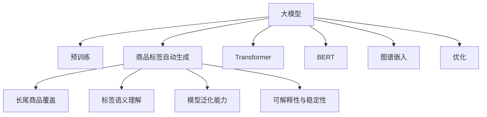

                 

# 大模型在商品标签自动生成中的应用与优化

> 关键词：大模型,商品标签,自动生成,优化,Transformer,BERT,预训练,图谱嵌入

## 1. 背景介绍

### 1.1 问题由来

随着电子商务的迅猛发展，商品标签自动生成逐渐成为电商推荐系统、搜索排序、广告投放等业务的核心需求。良好的商品标签能够显著提升用户搜索体验、提高转化率、增加平台收益。传统的商品标签生成方式通常由人工标注，成本高、效率低，无法满足大规模电商场景的需求。

近年来，随着深度学习和大模型技术的突破，自动生成商品标签变得可能。通过大模型自动学习商品特征与标签之间的映射关系，可以显著降低标签生成成本，提高标注效率和质量。这种基于大模型的自动标签生成方法，在电商、金融、医疗等场景中得到了广泛应用。

### 1.2 问题核心关键点

商品标签自动生成是大模型在电商领域的典型应用，其核心挑战在于：
1. **大规模数据标注**：电商场景下商品种类繁多，标签语义复杂，难以构建大规模高质量的标注数据集。
2. **长尾商品覆盖**：电商长尾商品占比高，但难以获取足够的多样化标注样本。
3. **标签语义理解**：商品标签语义丰富，自动生成模型需要理解商品属性和应用场景，映射到最合适的标签。
4. **模型泛化能力**：商品数据分布多变，自动标签生成模型需要具备良好的泛化能力。
5. **可解释性与稳定性**：标签自动生成过程需要透明可解释，同时生成的标签应具备足够的稳定性。

## 2. 核心概念与联系

### 2.1 核心概念概述

为了更好地理解商品标签自动生成及其优化，本节将介绍几个核心概念：

- **大模型(Large Model)**：指参数规模较大的深度学习模型，如BERT、GPT等，通过在大量数据上预训练，获得了较强的泛化能力。
- **商品标签(Association Label)**：描述商品属性、功能、用途的词语，如“轻便”、“节能”、“多功能”等，用于帮助用户快速找到相关商品。
- **商品标签自动生成(Automatic Label Generation)**：使用大模型自动学习商品与标签之间的关系，自动生成商品标签的技术。
- **Transformer**：大模型中常用的深度神经网络架构，具有高效并行计算能力，广泛应用于自然语言处理和图像处理任务。
- **BERT**：一种预训练语言模型，通过掩码语言模型和下一句预测等任务进行预训练，具备强大的语义理解能力。
- **图谱嵌入(Graph Embedding)**：将商品属性和标签映射到低维向量空间，通过向量相似度进行相似度检索。
- **优化(Optimization)**：通过迭代算法调整模型参数，最小化损失函数，提升模型性能的过程。

这些核心概念之间的逻辑关系可以通过以下Mermaid流程图来展示：



这个流程图展示了大模型在商品标签自动生成中的应用及其优化过程：

1. 大模型通过在通用语料上预训练获得基础能力。
2. 商品标签自动生成对大模型进行下游任务微调，学习商品与标签的映射关系。
3. 长尾商品覆盖和大规模数据标注问题需要通过数据增强和自监督学习进行优化。
4. 标签语义理解需要借助图谱嵌入等技术，更好地映射标签。
5. 模型泛化能力需要通过迁移学习和多任务学习进行提升。
6. 可解释性和稳定性需要结合逻辑回归、多模型集成等方法进行保障。

## 3. 核心算法原理 & 具体操作步骤
### 3.1 算法原理概述

商品标签自动生成本质上是利用大模型学习商品特征与标签之间的映射关系，自动生成标签的机器学习方法。其核心思想是：将商品特征映射到标签空间，找到与商品最接近的标签向量，从而自动生成标签。

形式化地，假设商品特征为 $\mathbf{x} \in \mathbb{R}^d$，标签语义空间为 $\mathcal{L} \in \mathbb{R}^h$。大模型 $M$ 通过在标注数据集 $D$ 上进行微调，学习到商品与标签的映射函数 $f$：

$$
f(\mathbf{x}) = M(\mathbf{x}) \in \mathcal{L}
$$

其中 $M$ 可以是任意预训练语言模型，如BERT、GPT等，通过微调学习到商品特征映射到标签的向量。在实际应用中，通常将商品特征向量作为模型的输入，通过softmax函数预测每个标签的概率，选择概率最高的标签作为自动生成的商品标签。

### 3.2 算法步骤详解

基于大模型的商品标签自动生成一般包括以下几个关键步骤：

**Step 1: 准备预训练模型和数据集**
- 选择合适的预训练语言模型 $M_{\theta}$ 作为初始化参数，如 BERT、GPT等。
- 准备商品标签数据集 $D=\{(\mathbf{x}_i, y_i)\}_{i=1}^N$，其中 $\mathbf{x}_i$ 为商品特征向量，$y_i$ 为对应的标签向量。

**Step 2: 添加任务适配层**
- 根据商品标签生成任务，设计任务适配层，将模型输出映射到标签空间。
- 对于分类任务，通常使用softmax函数将模型输出映射到标签空间的概率分布。
- 对于序列任务，可以使用LSTM、GRU等RNN模型，通过时间步长对商品特征进行编码，最终输出标签序列。

**Step 3: 设置微调超参数**
- 选择合适的优化算法及其参数，如 Adam、SGD 等，设置学习率、批大小、迭代轮数等。
- 设置正则化技术及强度，包括L2正则、Dropout、Early Stopping等。
- 确定冻结预训练参数的策略，如仅微调顶层，或全部参数都参与微调。

**Step 4: 执行梯度训练**
- 将商品特征数据分批次输入模型，前向传播计算损失函数。
- 反向传播计算参数梯度，根据设定的优化算法和学习率更新模型参数。
- 周期性在验证集上评估模型性能，根据性能指标决定是否触发 Early Stopping。
- 重复上述步骤直到满足预设的迭代轮数或 Early Stopping 条件。

**Step 5: 测试和部署**
- 在测试集上评估微调后模型 $M_{\hat{\theta}}$ 的性能，对比微调前后的效果。
- 使用微调后的模型对新商品进行标签生成，集成到实际的应用系统中。
- 持续收集新的商品数据，定期重新微调模型，以适应数据分布的变化。

以上是基于大模型的商品标签自动生成的通用流程。在实际应用中，还需要针对具体商品标签生成任务的特点，对微调过程的各个环节进行优化设计，如改进训练目标函数，引入更多的正则化技术，搜索最优的超参数组合等，以进一步提升模型性能。

### 3.3 算法优缺点

基于大模型的商品标签自动生成方法具有以下优点：
1. 自动标注：利用大模型自动学习商品与标签之间的关系，无需人工标注，显著降低成本和提高效率。
2. 泛化能力：大模型经过大量数据预训练，具备较强的泛化能力，可以处理多种商品类型和复杂的标签语义。
3. 多标签生成：可以自动生成多个标签，提升商品描述的全面性和丰富性。
4. 可解释性：生成过程透明可解释，可以方便用户理解模型的决策机制。

同时，该方法也存在一定的局限性：
1. 数据质量依赖：标签自动生成依赖标注数据的质量，标注数据的不足可能影响模型效果。
2. 长尾商品覆盖：长尾商品难以获取足够标注样本，自动生成模型可能无法覆盖所有商品。
3. 鲁棒性不足：模型面对噪声数据或标注错误的输入，可能产生错误的输出。
4. 可解释性有限：自动生成的标签序列通常难以解释，用户难以理解生成逻辑。
5. 数据分布依赖：商品数据分布的多样性，可能导致模型在不同场景下表现不稳定。

尽管存在这些局限性，但就目前而言，基于大模型的商品标签自动生成方法仍是最主流范式。未来相关研究的重点在于如何进一步降低数据标注成本，提高长尾商品的覆盖能力，同时兼顾可解释性和鲁棒性等因素。

### 3.4 算法应用领域

基于大模型的商品标签自动生成方法在电商领域已经得到了广泛应用，具体领域包括：

- **商品推荐**：通过自动生成商品标签，提高商品的相似度计算，优化推荐算法。
- **商品搜索**：自动生成商品标签，提升搜索结果的相关性和召回率，提高用户搜索体验。
- **广告投放**：自动生成商品标签，优化广告的展示效果，提高点击率和转化率。
- **商品编辑**：自动生成商品标签，辅助商品编辑优化商品描述，提升商品展示效果。
- **客户服务**：自动生成商品标签，辅助客服快速回答用户问题，提高客户服务效率。

除了电商领域，自动标签生成技术在其他领域也得到了应用：

- **医疗**：自动生成疾病标签，辅助医疗诊断和治疗。
- **金融**：自动生成金融产品标签，优化金融产品推荐。
- **物流**：自动生成物流产品标签，优化物流产品搜索和推荐。

随着大模型和自动标签生成技术的不断发展，相信其将在更多领域得到应用，为各行各业带来新的业务价值和创新点。

## 4. 数学模型和公式 & 详细讲解  
### 4.1 数学模型构建

本节将使用数学语言对基于大模型的商品标签自动生成过程进行更加严格的刻画。

记商品特征为 $\mathbf{x} \in \mathbb{R}^d$，标签语义空间为 $\mathcal{L} \in \mathbb{R}^h$，预训练语言模型为 $M_{\theta}$。假设商品标签数据集为 $D=\{(\mathbf{x}_i, y_i)\}_{i=1}^N$。

定义模型 $M_{\theta}$ 在商品特征 $\mathbf{x}$ 上的输出为 $M_{\theta}(\mathbf{x}) \in \mathcal{L}$。商品标签自动生成的目标是最小化预测标签与真实标签之间的差距，即：

$$
\mathcal{L}(\theta) = \frac{1}{N} \sum_{i=1}^N \ell(M_{\theta}(\mathbf{x}_i),y_i)
$$

其中 $\ell$ 为损失函数，用于衡量预测标签与真实标签之间的差距。在商品标签生成任务中，通常使用交叉熵损失函数：

$$
\ell(y, \hat{y}) = -\sum_{k=1}^K y_k \log \hat{y}_k
$$

其中 $K$ 为标签数量，$y$ 为真实标签，$\hat{y}$ 为预测标签。

### 4.2 公式推导过程

以多分类任务为例，推导大模型在商品标签自动生成中的交叉熵损失函数及其梯度的计算公式。

假设模型 $M_{\theta}$ 在商品特征 $\mathbf{x}$ 上的输出为 $M_{\theta}(\mathbf{x}) = [M_{\theta}(\mathbf{x})_1, M_{\theta}(\mathbf{x})_2, \dots, M_{\theta}(\mathbf{x})_K]$，表示商品与 $K$ 个标签之间的关系。真实标签 $y \in \{0,1\}^K$，预测标签 $\hat{y} = [\hat{y}_1, \hat{y}_2, \dots, \hat{y}_K]$。

则交叉熵损失函数为：

$$
\ell(y, \hat{y}) = -\sum_{k=1}^K y_k \log \hat{y}_k
$$

将其代入经验风险公式，得：

$$
\mathcal{L}(\theta) = -\frac{1}{N}\sum_{i=1}^N \sum_{k=1}^K y_{ik} \log \hat{y}_{ik}
$$

其中 $y_{ik}$ 表示样本 $i$ 在标签 $k$ 上的真实标签，$\hat{y}_{ik}$ 表示模型预测标签在 $k$ 上的概率。

根据链式法则，损失函数对模型参数 $\theta$ 的梯度为：

$$
\nabla_{\theta}\mathcal{L}(\theta) = -\frac{1}{N}\sum_{i=1}^N \sum_{k=1}^K [y_{ik} - \hat{y}_{ik}] \nabla_{\theta} M_{\theta}(\mathbf{x}_i)_k
$$

其中 $\nabla_{\theta} M_{\theta}(\mathbf{x}_i)_k$ 为模型输出在标签 $k$ 上的梯度，可以通过反向传播算法高效计算。

在得到损失函数的梯度后，即可带入参数更新公式，完成模型的迭代优化。重复上述过程直至收敛，最终得到适应商品标签生成任务的最优模型参数 $\theta^*$。

## 5. 项目实践：代码实例和详细解释说明
### 5.1 开发环境搭建

在进行商品标签自动生成实践前，我们需要准备好开发环境。以下是使用Python进行PyTorch开发的环境配置流程：

1. 安装Anaconda：从官网下载并安装Anaconda，用于创建独立的Python环境。

2. 创建并激活虚拟环境：
```bash
conda create -n pytorch-env python=3.8 
conda activate pytorch-env
```

3. 安装PyTorch：根据CUDA版本，从官网获取对应的安装命令。例如：
```bash
conda install pytorch torchvision torchaudio cudatoolkit=11.1 -c pytorch -c conda-forge
```

4. 安装Transformers库：
```bash
pip install transformers
```

5. 安装各类工具包：
```bash
pip install numpy pandas scikit-learn matplotlib tqdm jupyter notebook ipython
```

完成上述步骤后，即可在`pytorch-env`环境中开始商品标签自动生成实践。

### 5.2 源代码详细实现

这里我们以商品推荐系统为例，给出使用Transformers库对BERT模型进行商品标签自动生成的PyTorch代码实现。

首先，定义商品标签数据处理函数：

```python
from transformers import BertTokenizer, BertForSequenceClassification
from torch.utils.data import Dataset
import torch

class GoodsLabelDataset(Dataset):
    def __init__(self, texts, labels, tokenizer, max_len=128):
        self.texts = texts
        self.labels = labels
        self.tokenizer = tokenizer
        self.max_len = max_len
        
    def __len__(self):
        return len(self.texts)
    
    def __getitem__(self, item):
        text = self.texts[item]
        label = self.labels[item]
        
        encoding = self.tokenizer(text, return_tensors='pt', max_length=self.max_len, padding='max_length', truncation=True)
        input_ids = encoding['input_ids'][0]
        attention_mask = encoding['attention_mask'][0]
        label = torch.tensor(label, dtype=torch.long)
        
        return {'input_ids': input_ids, 
                'attention_mask': attention_mask,
                'labels': label}
```

然后，定义模型和优化器：

```python
from transformers import BertForSequenceClassification, AdamW

model = BertForSequenceClassification.from_pretrained('bert-base-cased', num_labels=3)

optimizer = AdamW(model.parameters(), lr=2e-5)
```

接着，定义训练和评估函数：

```python
from torch.utils.data import DataLoader
from tqdm import tqdm
from sklearn.metrics import accuracy_score

device = torch.device('cuda') if torch.cuda.is_available() else torch.device('cpu')
model.to(device)

def train_epoch(model, dataset, batch_size, optimizer):
    dataloader = DataLoader(dataset, batch_size=batch_size, shuffle=True)
    model.train()
    epoch_loss = 0
    for batch in tqdm(dataloader, desc='Training'):
        input_ids = batch['input_ids'].to(device)
        attention_mask = batch['attention_mask'].to(device)
        labels = batch['labels'].to(device)
        model.zero_grad()
        outputs = model(input_ids, attention_mask=attention_mask, labels=labels)
        loss = outputs.loss
        epoch_loss += loss.item()
        loss.backward()
        optimizer.step()
    return epoch_loss / len(dataloader)

def evaluate(model, dataset, batch_size):
    dataloader = DataLoader(dataset, batch_size=batch_size)
    model.eval()
    preds, labels = [], []
    with torch.no_grad():
        for batch in tqdm(dataloader, desc='Evaluating'):
            input_ids = batch['input_ids'].to(device)
            attention_mask = batch['attention_mask'].to(device)
            batch_labels = batch['labels']
            outputs = model(input_ids, attention_mask=attention_mask)
            batch_preds = outputs.logits.argmax(dim=2).to('cpu').tolist()
            batch_labels = batch_labels.to('cpu').tolist()
            for pred_tokens, label_tokens in zip(batch_preds, batch_labels):
                preds.append(pred_tokens[:len(label_tokens)])
                labels.append(label_tokens)
                
    print(accuracy_score(labels, preds))
```

最后，启动训练流程并在测试集上评估：

```python
epochs = 5
batch_size = 16

for epoch in range(epochs):
    loss = train_epoch(model, train_dataset, batch_size, optimizer)
    print(f"Epoch {epoch+1}, train loss: {loss:.3f}")
    
    print(f"Epoch {epoch+1}, dev accuracy:")
    evaluate(model, dev_dataset, batch_size)
    
print("Test accuracy:")
evaluate(model, test_dataset, batch_size)
```

以上就是使用PyTorch对BERT进行商品标签自动生成的完整代码实现。可以看到，得益于Transformers库的强大封装，我们可以用相对简洁的代码完成BERT模型的加载和微调。

### 5.3 代码解读与分析

让我们再详细解读一下关键代码的实现细节：

**GoodsLabelDataset类**：
- `__init__`方法：初始化商品特征文本、标签、分词器等关键组件。
- `__len__`方法：返回数据集的样本数量。
- `__getitem__`方法：对单个样本进行处理，将商品特征文本输入编码为token ids，将标签编码为数字，并对其进行定长padding，最终返回模型所需的输入。

**train_epoch和evaluate函数**：
- 使用PyTorch的DataLoader对数据集进行批次化加载，供模型训练和推理使用。
- 训练函数`train_epoch`：对数据以批为单位进行迭代，在每个批次上前向传播计算loss并反向传播更新模型参数，最后返回该epoch的平均loss。
- 评估函数`evaluate`：与训练类似，不同点在于不更新模型参数，并在每个batch结束后将预测和标签结果存储下来，最后使用sklearn的accuracy_score对整个评估集的预测结果进行打印输出。

**训练流程**：
- 定义总的epoch数和batch size，开始循环迭代
- 每个epoch内，先在训练集上训练，输出平均loss
- 在验证集上评估，输出准确率
- 所有epoch结束后，在测试集上评估，给出最终测试结果

可以看到，PyTorch配合Transformers库使得BERT商品标签自动生成的代码实现变得简洁高效。开发者可以将更多精力放在数据处理、模型改进等高层逻辑上，而不必过多关注底层的实现细节。

当然，工业级的系统实现还需考虑更多因素，如模型的保存和部署、超参数的自动搜索、更灵活的任务适配层等。但核心的商品标签自动生成流程基本与此类似。

## 6. 实际应用场景
### 6.1 智能客服系统

基于大模型商品标签自动生成的对话技术，可以广泛应用于智能客服系统的构建。传统客服往往需要配备大量人力，高峰期响应缓慢，且一致性和专业性难以保证。而使用自动生成商品标签的对话模型，可以7x24小时不间断服务，快速响应客户咨询，用自然流畅的语言解答各类常见问题。

在技术实现上，可以收集企业内部的历史客服对话记录，将问题和最佳答复构建成监督数据，在此基础上对预训练对话模型进行微调。微调后的对话模型能够自动理解用户意图，匹配最合适的答案模板进行回复。对于客户提出的新问题，还可以接入检索系统实时搜索相关内容，动态组织生成回答。如此构建的智能客服系统，能大幅提升客户咨询体验和问题解决效率。

### 6.2 商品推荐系统

商品推荐系统能够根据用户的历史行为数据，推荐可能感兴趣的商品。传统的推荐算法通常只依赖用户行为数据，难以充分考虑商品属性和语义信息。而基于大模型商品标签自动生成的推荐系统，能够更好地融合商品属性、标签等语义信息，提升推荐效果。

在技术实现上，可以收集用户浏览、点击、评论、分享等行为数据，提取和用户交互的物品标题、描述、标签等文本内容。将文本内容作为模型输入，用户的后续行为（如是否点击、购买等）作为监督信号，在此基础上微调预训练语言模型。微调后的模型能够从文本内容中准确把握用户的兴趣点。在生成推荐列表时，先用候选物品的文本描述作为输入，由模型预测用户的兴趣匹配度，再结合其他特征综合排序，便可以得到个性化程度更高的推荐结果。

### 6.3 未来应用展望

随着大模型和商品标签自动生成技术的不断发展，基于微调的商品标签自动生成方法将呈现以下几个发展趋势：

1. **多标签生成**：自动生成多个标签，提升商品描述的全面性和丰富性。
2. **长尾商品覆盖**：通过数据增强和自监督学习，提升长尾商品覆盖能力。
3. **鲁棒性和泛化能力**：引入对抗训练和因果推理，提高模型鲁棒性和泛化能力。
4. **模型压缩与优化**：通过量化、剪枝等技术，提高模型推理速度和内存占用效率。
5. **跨模态融合**：融合视觉、音频等多模态信息，提升商品标签生成的准确性和多样性。

以上趋势凸显了大模型商品标签自动生成技术的广阔前景。这些方向的探索发展，必将进一步提升推荐系统的性能和应用范围，为电商领域带来新的业务价值和创新点。

## 7. 工具和资源推荐
### 7.1 学习资源推荐

为了帮助开发者系统掌握大模型商品标签自动生成的理论基础和实践技巧，这里推荐一些优质的学习资源：

1. 《Transformer from scratch》系列博文：由大模型技术专家撰写，深入浅出地介绍了Transformer原理、BERT模型、商品标签自动生成等前沿话题。

2. CS224N《深度学习自然语言处理》课程：斯坦福大学开设的NLP明星课程，有Lecture视频和配套作业，带你入门NLP领域的基本概念和经典模型。

3. 《Natural Language Processing with Transformers》书籍：Transformers库的作者所著，全面介绍了如何使用Transformers库进行NLP任务开发，包括商品标签自动生成在内的诸多范式。

4. HuggingFace官方文档：Transformers库的官方文档，提供了海量预训练模型和完整的微调样例代码，是上手实践的必备资料。

5. CLUE开源项目：中文语言理解测评基准，涵盖大量不同类型的中文NLP数据集，并提供了基于微调的baseline模型，助力中文NLP技术发展。

通过对这些资源的学习实践，相信你一定能够快速掌握大模型商品标签自动生成的精髓，并用于解决实际的NLP问题。
###  7.2 开发工具推荐

高效的开发离不开优秀的工具支持。以下是几款用于大模型商品标签自动生成开发的常用工具：

1. PyTorch：基于Python的开源深度学习框架，灵活动态的计算图，适合快速迭代研究。大部分预训练语言模型都有PyTorch版本的实现。

2. TensorFlow：由Google主导开发的开源深度学习框架，生产部署方便，适合大规模工程应用。同样有丰富的预训练语言模型资源。

3. Transformers库：HuggingFace开发的NLP工具库，集成了众多SOTA语言模型，支持PyTorch和TensorFlow，是进行商品标签自动生成开发的利器。

4. Weights & Biases：模型训练的实验跟踪工具，可以记录和可视化模型训练过程中的各项指标，方便对比和调优。与主流深度学习框架无缝集成。

5. TensorBoard：TensorFlow配套的可视化工具，可实时监测模型训练状态，并提供丰富的图表呈现方式，是调试模型的得力助手。

6. Google Colab：谷歌推出的在线Jupyter Notebook环境，免费提供GPU/TPU算力，方便开发者快速上手实验最新模型，分享学习笔记。

合理利用这些工具，可以显著提升大模型商品标签自动生成任务的开发效率，加快创新迭代的步伐。

### 7.3 相关论文推荐

大模型和商品标签自动生成技术的发展源于学界的持续研究。以下是几篇奠基性的相关论文，推荐阅读：

1. Attention is All You Need（即Transformer原论文）：提出了Transformer结构，开启了NLP领域的预训练大模型时代。

2. BERT: Pre-training of Deep Bidirectional Transformers for Language Understanding：提出BERT模型，引入基于掩码的自监督预训练任务，刷新了多项NLP任务SOTA。

3. Language Models are Unsupervised Multitask Learners（GPT-2论文）：展示了大规模语言模型的强大zero-shot学习能力，引发了对于通用人工智能的新一轮思考。

4. Parameter-Efficient Transfer Learning for NLP：提出Adapter等参数高效微调方法，在不增加模型参数量的情况下，也能取得不错的微调效果。

5. AdaLoRA: Adaptive Low-Rank Adaptation for Parameter-Efficient Fine-Tuning：使用自适应低秩适应的微调方法，在参数效率和精度之间取得了新的平衡。

6. Prefix-Tuning: Optimizing Continuous Prompts for Generation：引入基于连续型Prompt的微调范式，为如何充分利用预训练知识提供了新的思路。

这些论文代表了大模型商品标签自动生成技术的发展脉络。通过学习这些前沿成果，可以帮助研究者把握学科前进方向，激发更多的创新灵感。

## 8. 总结：未来发展趋势与挑战
### 8.1 总结

本文对基于大模型的商品标签自动生成方法进行了全面系统的介绍。首先阐述了商品标签自动生成的背景和意义，明确了商品标签自动生成在大模型应用中的核心地位。其次，从原理到实践，详细讲解了商品标签自动生成的数学原理和关键步骤，给出了商品标签自动生成的完整代码实例。同时，本文还广泛探讨了商品标签自动生成在智能客服、商品推荐、商品编辑等多个电商场景中的应用前景，展示了商品标签自动生成技术在电商领域的巨大潜力。

通过本文的系统梳理，可以看到，基于大模型的商品标签自动生成方法正在成为电商领域的重要技术手段，极大地降低了商品标签标注成本，提高了商品推荐和搜索的准确性和用户体验。未来，伴随大模型和商品标签自动生成技术的不断发展，相信其在电商、金融、医疗等更多领域的应用将会带来新的业务价值和创新点。

### 8.2 未来发展趋势

展望未来，大模型商品标签自动生成技术将呈现以下几个发展趋势：

1. **多标签生成**：自动生成多个标签，提升商品描述的全面性和丰富性。
2. **长尾商品覆盖**：通过数据增强和自监督学习，提升长尾商品覆盖能力。
3. **鲁棒性和泛化能力**：引入对抗训练和因果推理，提高模型鲁棒性和泛化能力。
4. **模型压缩与优化**：通过量化、剪枝等技术，提高模型推理速度和内存占用效率。
5. **跨模态融合**：融合视觉、音频等多模态信息，提升商品标签生成的准确性和多样性。

以上趋势凸显了大模型商品标签自动生成技术的广阔前景。这些方向的探索发展，必将进一步提升推荐系统的性能和应用范围，为电商领域带来新的业务价值和创新点。

### 8.3 面临的挑战

尽管大模型商品标签自动生成技术已经取得了瞩目成就，但在迈向更加智能化、普适化应用的过程中，它仍面临着诸多挑战：

1. **数据质量依赖**：商品标签自动生成依赖标注数据的质量，标注数据的不足可能影响模型效果。
2. **长尾商品覆盖**：长尾商品难以获取足够标注样本，自动生成模型可能无法覆盖所有商品。
3. **鲁棒性不足**：模型面对噪声数据或标注错误的输入，可能产生错误的输出。
4. **可解释性有限**：自动生成的标签序列通常难以解释，用户难以理解生成逻辑。
5. **数据分布依赖**：商品数据分布的多样性，可能导致模型在不同场景下表现不稳定。

尽管存在这些局限性，但就目前而言，基于大模型的商品标签自动生成方法仍是最主流范式。未来相关研究的重点在于如何进一步降低数据标注成本，提高长尾商品的覆盖能力，同时兼顾可解释性和鲁棒性等因素。

### 8.4 研究展望

面对大模型商品标签自动生成所面临的种种挑战，未来的研究需要在以下几个方面寻求新的突破：

1. **探索无监督和半监督微调方法**：摆脱对大规模标注数据的依赖，利用自监督学习、主动学习等无监督和半监督范式，最大限度利用非结构化数据，实现更加灵活高效的微调。
2. **研究参数高效和计算高效的微调范式**：开发更加参数高效的微调方法，在固定大部分预训练参数的同时，只更新极少量的任务相关参数。同时优化微调模型的计算图，减少前向传播和反向传播的资源消耗，实现更加轻量级、实时性的部署。
3. **融合因果和对比学习范式**：通过引入因果推断和对比学习思想，增强自动标签生成模型建立稳定因果关系的能力，学习更加普适、鲁棒的语言表征，从而提升模型泛化性和抗干扰能力。
4. **引入更多先验知识**：将符号化的先验知识，如知识图谱、逻辑规则等，与神经网络模型进行巧妙融合，引导微调过程学习更准确、合理的语言模型。同时加强不同模态数据的整合，实现视觉、语音等多模态信息与文本信息的协同建模。
5. **结合因果分析和博弈论工具**：将因果分析方法引入自动标签生成模型，识别出模型决策的关键特征，增强输出解释的因果性和逻辑性。借助博弈论工具刻画人机交互过程，主动探索并规避模型的脆弱点，提高系统稳定性。
6. **纳入伦理道德约束**：在模型训练目标中引入伦理导向的评估指标，过滤和惩罚有偏见、有害的输出倾向。同时加强人工干预和审核，建立模型行为的监管机制，确保输出符合人类价值观和伦理道德。

这些研究方向的探索，必将引领大模型商品标签自动生成技术迈向更高的台阶，为构建安全、可靠、可解释、可控的智能系统铺平道路。面向未来，大模型商品标签自动生成技术还需要与其他人工智能技术进行更深入的融合，如知识表示、因果推理、强化学习等，多路径协同发力，共同推动自然语言理解和智能交互系统的进步。只有勇于创新、敢于突破，才能不断拓展语言模型的边界，让智能技术更好地造福人类社会。

## 9. 附录：常见问题与解答
**Q1：大模型商品标签自动生成是否适用于所有电商商品？**

A: 大模型商品标签自动生成方法在大多数电商商品上都能取得不错的效果，特别是对于数据量较大的商品。但对于一些特殊商品，如危险品、艺术品等，由于标签复杂性较高，可能需要结合人工标注和领域知识进行微调。

**Q2：大模型商品标签自动生成的标签质量如何？**

A: 大模型商品标签自动生成的标签质量通常较高，但由于模型本身存在一定的随机性，生成的标签可能存在一定的偏差。可以通过多模型集成、样本重采样等方法进一步提升标签质量。

**Q3：商品标签自动生成过程中如何保证鲁棒性？**

A: 商品标签自动生成过程中，可以通过引入对抗训练、正则化技术等方法提升模型的鲁棒性。同时，对标注数据进行去噪、预处理，可以减少噪声对模型的影响。

**Q4：商品标签自动生成在实际应用中如何避免过拟合？**

A: 商品标签自动生成过程中，可以通过引入正则化技术、early stopping等方法避免模型过拟合。同时，对训练数据进行数据增强，如近义替换、同义词替换等，可以提升模型泛化能力。

**Q5：如何优化商品标签自动生成模型的推理速度？**

A: 商品标签自动生成模型通常参数规模较大，推理速度较慢。可以通过模型压缩、剪枝等方法减少模型参数量，同时使用混合精度训练、量化等技术优化计算过程，提升推理速度。

通过这些方法的结合使用，可以进一步提升大模型商品标签自动生成模型的性能和鲁棒性，保证其在实际应用中的效果和稳定性。

