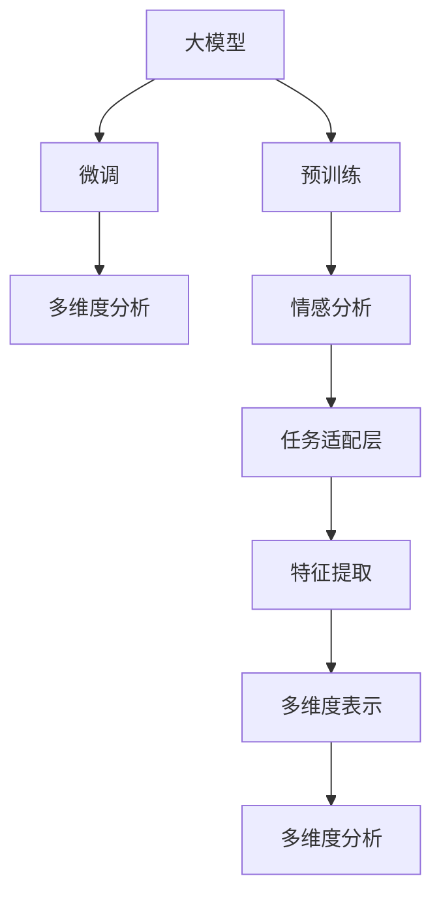

                 

# 大模型在商品评价情感多维度分析中的应用

## 1. 背景介绍

### 1.1 问题由来
在电商领域，商品评价是反映用户满意度和市场需求的重要数据来源。通过对大量用户评价进行情感分析，商家可以及时了解消费者对产品的反馈，优化产品质量和市场策略。然而，传统情感分析方法往往只能简单地判断文本的正面或负面情感，无法捕捉用户情感的多维度和多层次关系。随着大模型的快速发展，利用预训练语言模型对商品评价进行深度分析，挖掘其中的丰富语义信息，成为新的研究方向。

### 1.2 问题核心关键点
本研究聚焦于如何将大模型应用于商品评价的情感多维度分析。主要包括以下核心问题：

1. 如何构建高质量的商品评价数据集，以供模型训练和验证？
2. 如何设计合适的任务适配层，将大模型转化为商品评价情感分析模型？
3. 如何利用大模型的多层次语言表示能力，挖掘商品评价的情感维度？
4. 如何评估和优化模型，保证情感分析的准确性和泛化能力？
5. 如何将情感分析结果应用于产品优化、市场策略制定等实际业务场景？

这些问题的解决将显著提升商家对用户反馈的理解和响应能力，推动电商行业向更高质量、更高效的方向发展。

## 2. 核心概念与联系

### 2.1 核心概念概述

为更好地理解大模型在商品评价情感多维度分析中的应用，本节将介绍几个密切相关的核心概念：

- 大模型(Large Model)：指预训练的语言模型，如BERT、GPT等，具有强大的语言理解和生成能力。
- 情感分析(Sentiment Analysis)：对文本中的情感进行识别和分类，通常分为正面、负面和中性。
- 多维度分析(Multidimensional Analysis)：将情感分析结果在多个维度上进行深入挖掘，如情感强度、情感类型、情感变化趋势等。
- 预训练(Pre-training)：指在大规模无标签文本数据上进行自监督学习，获得通用的语言表示。
- 微调(Fine-tuning)：指在预训练模型的基础上，使用任务特定的数据集进行有监督学习，优化模型在该任务上的性能。
- 迁移学习(Transfer Learning)：指利用预训练模型的知识，在相关任务上进行微调，以减少训练时间和数据需求。
- 对抗训练(Adversarial Training)：指通过加入对抗样本，提高模型对抗噪音和攻击的能力。
- 文本表示(Text Representation)：指将文本转换为模型可以处理的数值向量，通常采用Word Embedding、BERT等方法。
- 语义信息(Semantic Information)：指文本中蕴含的语义关系、语义角色等深层次信息。

这些概念之间的逻辑关系可以通过以下Mermaid流程图来展示：



这个流程图展示了大模型在商品评价情感多维度分析中的应用流程：

1. 大模型通过预训练获得语言表示能力。
2. 通过微调将大模型转化为情感分析模型。
3. 在情感分析模型的基础上，进行多维度分析。

这些核心概念共同构成了大模型在商品评价情感多维度分析中的应用框架，使得模型能够更好地理解和处理复杂的用户反馈。

## 3. 核心算法原理 & 具体操作步骤
### 3.1 算法原理概述

利用大模型进行商品评价情感多维度分析，本质上是将预训练语言模型进行任务适配，通过有监督学习优化模型在特定任务上的性能。具体来说，步骤如下：

1. 收集商品评价数据，构建标注数据集。
2. 在大模型上进行预训练，获得通用的语言表示。
3. 在标注数据集上微调大模型，优化情感分析能力。
4. 使用微调后的模型进行情感多维度分析，提取语义信息。

### 3.2 算法步骤详解

以下详细介绍利用大模型进行商品评价情感多维度分析的具体步骤：

**Step 1: 数据预处理**
- 收集电商平台的商品评价数据，去重、清洗，确保数据质量。
- 对评价文本进行分词、去除停用词、词干化等预处理步骤，提高后续模型训练的效率和效果。

**Step 2: 数据标注**
- 对商品评价进行情感标注，构建情感分类数据集。
- 对于多维度分析任务，需要对评价文本进行情感强度、情感类型等多维度的标注。

**Step 3: 预训练大模型**
- 选择合适的预训练语言模型，如BERT、GPT等，进行预训练。
- 使用预训练语言模型在文本分类、掩码语言模型等自监督任务上学习语言表示。

**Step 4: 任务适配层设计**
- 在大模型的顶部添加一个任务适配层，用于将大模型转化为情感分析模型。
- 对于情感分类任务，任务适配层通常包含线性分类器、Softmax等组件。
- 对于情感多维度分析任务，适配层可能需要更多维度上的表示。

**Step 5: 微调大模型**
- 将标注数据集划分为训练集、验证集和测试集。
- 在大模型的基础上进行微调，最小化损失函数。
- 使用AdamW、SGD等优化算法，设置合适的学习率、批大小、迭代轮数等参数。
- 在训练过程中，使用L2正则、Dropout、Early Stopping等正则化技术，避免过拟合。
- 在微调结束后，对模型进行评估，确保其在不同维度的情感分析上表现良好。

**Step 6: 情感多维度分析**
- 对微调后的模型进行情感多维度分析，提取情感强度、情感类型等维度的信息。
- 可以使用聚类、降维等方法，对情感表示进行多维度可视化，帮助理解用户反馈。

### 3.3 算法优缺点

利用大模型进行商品评价情感多维度分析，具有以下优点：

1. 高效性：大模型具有强大的表示能力，能够从大量的评价文本中提取出深层次的语义信息，适用于大规模数据集。
2. 准确性：大模型的多层次语言表示能力，使其在情感分析上具有较高的准确性和泛化能力。
3. 可解释性：大模型生成的多维度情感表示，能够提供更加详细的情感信息，有助于理解用户需求。
4. 可扩展性：大模型的多维度分析能力，可以轻松应对不同类型的情感维度，灵活应用。

同时，也存在以下局限性：

1. 数据依赖性强：大模型的效果很大程度上取决于标注数据的质量和数量，获取高质量标注数据的成本较高。
2. 训练资源需求高：大模型的训练和微调需要大量的计算资源，对硬件配置有较高要求。
3. 泛化能力有限：当目标任务与预训练数据分布差异较大时，微调的性能提升有限。
4. 数据隐私问题：用户评论数据往往涉及隐私信息，如何在保证数据隐私的前提下进行情感分析，需要考虑数据保护措施。

尽管存在这些局限性，但就目前而言，大模型在商品评价情感多维度分析中的应用具有显著的优势，能够帮助商家更好地理解用户反馈，优化产品和服务。

### 3.4 算法应用领域

大模型在商品评价情感多维度分析中的应用，广泛涵盖了电商、零售、金融等多个行业领域，具体包括：

1. 电商领域：通过对用户评论进行情感分析，商家可以及时调整产品策略，提升用户满意度。
2. 零售领域：利用情感分析结果，进行库存管理、促销活动优化等，提升销售额。
3. 金融领域：对用户评价进行情感分析，评估产品市场接受度，优化金融产品设计。
4. 医疗领域：对医疗评论进行情感分析，评估患者满意度，提升医疗服务质量。
5. 旅游领域：对用户评论进行情感分析，优化旅游产品设计，提升用户体验。

除了这些传统领域，大模型在商品评价情感多维度分析中的应用还在不断拓展，如智慧城市、智能交通、教育培训等新兴行业，为这些领域的创新应用提供了新的思路和工具。

## 4. 数学模型和公式 & 详细讲解 & 举例说明

### 4.1 数学模型构建

为了构建基于大模型的商品评价情感多维度分析模型，我们需要以下数学模型：

- 情感分类任务：
$$
\ell(\theta) = -\frac{1}{N}\sum_{i=1}^N [y_i\log \sigma(\mathbf{W}^TX_i+b) + (1-y_i)\log(1-\sigma(\mathbf{W}^TX_i+b))]
$$
其中 $y_i \in \{0, 1\}$ 表示情感标签，$\sigma$ 为sigmoid函数，$\mathbf{W}$ 和 $b$ 为分类器的权重和偏置。

- 情感强度分析任务：
$$
\ell(\theta) = -\frac{1}{N}\sum_{i=1}^N [\log(p_i) + (1-p_i)\log(1-p_i)]
$$
其中 $p_i = \sigma(\mathbf{W}^TX_i+b)$ 表示情感强度预测的概率。

### 4.2 公式推导过程

对于情感分类任务，我们使用分类器的输出作为模型的最终预测，通过交叉熵损失函数进行优化：

$$
\ell(\theta) = -\frac{1}{N}\sum_{i=1}^N [y_i\log \sigma(\mathbf{W}^TX_i+b) + (1-y_i)\log(1-\sigma(\mathbf{W}^TX_i+b))]
$$

其中，$\sigma$ 为sigmoid函数，$\mathbf{W}$ 和 $b$ 为分类器的权重和偏置。在训练过程中，通过反向传播计算梯度，使用优化算法如AdamW、SGD等更新模型参数。

对于情感强度分析任务，我们同样使用交叉熵损失函数，将情感强度预测的概率 $p_i$ 作为模型的输出：

$$
\ell(\theta) = -\frac{1}{N}\sum_{i=1}^N [\log(p_i) + (1-p_i)\log(1-p_i)]
$$

在训练过程中，我们同样通过反向传播计算梯度，使用优化算法更新模型参数。

### 4.3 案例分析与讲解

以下以一个具体的案例，展示如何利用大模型进行商品评价情感多维度分析：

假设我们已经收集到了大量电商平台的商品评价数据，并对这些数据进行了情感标注和强度标注。我们选择BERT作为预训练语言模型，在大模型上进行预训练，然后添加任务适配层，进行微调。

**Step 1: 数据预处理**
- 对原始文本进行分词、去停用词、词干化等预处理步骤。
- 将文本转换为BERT模型可以处理的数值向量，使用BERT的Tokenizer进行处理。

**Step 2: 数据标注**
- 对商品评价进行情感标注，构建情感分类数据集。
- 对评价文本进行情感强度标注，构建情感强度数据集。

**Step 3: 预训练大模型**
- 使用预训练语言模型BERT进行预训练，使用掩码语言模型任务进行学习。
- 将预训练模型作为初始化参数，进行情感分类和强度分析的微调。

**Step 4: 任务适配层设计**
- 在大模型的顶部添加一个线性分类器，用于情感分类任务。
- 添加一个回归器，用于情感强度分析任务。

**Step 5: 微调大模型**
- 使用AdamW优化算法，设置学习率、批大小等参数。
- 在训练过程中，使用L2正则、Dropout等正则化技术。
- 在微调结束后，使用验证集评估模型性能。

**Step 6: 情感多维度分析**
- 使用微调后的模型进行情感分类和强度分析，提取情感维度信息。
- 利用聚类、降维等方法，对情感表示进行多维度可视化。

以上步骤展示了利用大模型进行商品评价情感多维度分析的完整流程。通过详细分析，我们可以更好地理解大模型在实际应用中的具体操作和效果。

## 5. 项目实践：代码实例和详细解释说明
### 5.1 开发环境搭建

在进行商品评价情感多维度分析的实践前，我们需要准备好开发环境。以下是使用Python进行PyTorch开发的环境配置流程：

1. 安装Anaconda：从官网下载并安装Anaconda，用于创建独立的Python环境。

2. 创建并激活虚拟环境：
```bash
conda create -n pytorch-env python=3.8 
conda activate pytorch-env
```

3. 安装PyTorch：根据CUDA版本，从官网获取对应的安装命令。例如：
```bash
conda install pytorch torchvision torchaudio cudatoolkit=11.1 -c pytorch -c conda-forge
```

4. 安装Transformers库：
```bash
pip install transformers
```

5. 安装各类工具包：
```bash
pip install numpy pandas scikit-learn matplotlib tqdm jupyter notebook ipython
```

完成上述步骤后，即可在`pytorch-env`环境中开始实践。

### 5.2 源代码详细实现

下面我们以情感分类和强度分析为例，给出使用Transformers库对BERT模型进行微调的PyTorch代码实现。

首先，定义情感分类和强度分析的数据处理函数：

```python
from transformers import BertTokenizer, BertForSequenceClassification, BertForRegression
from torch.utils.data import Dataset
import torch

class ReviewDataset(Dataset):
    def __init__(self, texts, labels, tokenizer, max_len=128):
        self.texts = texts
        self.labels = labels
        self.tokenizer = tokenizer
        self.max_len = max_len
        
    def __len__(self):
        return len(self.texts)
    
    def __getitem__(self, item):
        text = self.texts[item]
        label = self.labels[item]
        
        encoding = self.tokenizer(text, return_tensors='pt', max_length=self.max_len, padding='max_length', truncation=True)
        input_ids = encoding['input_ids'][0]
        attention_mask = encoding['attention_mask'][0]
        
        # 对标签进行处理，情感分类为0或1，情感强度在[0, 1]之间
        encoded_labels = [label] * self.max_len
        labels = torch.tensor(encoded_labels, dtype=torch.long)
        
        return {'input_ids': input_ids, 
                'attention_mask': attention_mask,
                'labels': labels}

# 定义标签和id的映射
class2id = {'POSITIVE': 1, 'NEGATIVE': 0, 'STRENGTH': 0, 'WEAKNESS': 0}

# 创建dataset
tokenizer = BertTokenizer.from_pretrained('bert-base-uncased')

train_dataset = ReviewDataset(train_texts, train_labels, tokenizer)
dev_dataset = ReviewDataset(dev_texts, dev_labels, tokenizer)
test_dataset = ReviewDataset(test_texts, test_labels, tokenizer)
```

然后，定义模型和优化器：

```python
from transformers import BertForSequenceClassification, BertForRegression, AdamW

model = BertForSequenceClassification.from_pretrained('bert-base-uncased', num_labels=len(class2id))

optimizer = AdamW(model.parameters(), lr=2e-5)
```

接着，定义训练和评估函数：

```python
from torch.utils.data import DataLoader
from tqdm import tqdm
from sklearn.metrics import classification_report, mean_squared_error

device = torch.device('cuda') if torch.cuda.is_available() else torch.device('cpu')
model.to(device)

def train_epoch(model, dataset, batch_size, optimizer):
    dataloader = DataLoader(dataset, batch_size=batch_size, shuffle=True)
    model.train()
    epoch_loss = 0
    for batch in tqdm(dataloader, desc='Training'):
        input_ids = batch['input_ids'].to(device)
        attention_mask = batch['attention_mask'].to(device)
        labels = batch['labels'].to(device)
        model.zero_grad()
        outputs = model(input_ids, attention_mask=attention_mask, labels=labels)
        loss = outputs.loss
        epoch_loss += loss.item()
        loss.backward()
        optimizer.step()
    return epoch_loss / len(dataloader)

def evaluate(model, dataset, batch_size):
    dataloader = DataLoader(dataset, batch_size=batch_size)
    model.eval()
    preds, labels = [], []
    with torch.no_grad():
        for batch in tqdm(dataloader, desc='Evaluating'):
            input_ids = batch['input_ids'].to(device)
            attention_mask = batch['attention_mask'].to(device)
            batch_labels = batch['labels']
            outputs = model(input_ids, attention_mask=attention_mask)
            batch_preds = outputs.logits.argmax(dim=2).to('cpu').tolist()
            batch_labels = batch_labels.to('cpu').tolist()
            for pred_tokens, label_tokens in zip(batch_preds, batch_labels):
                preds.append(pred_tokens[:len(label_tokens)])
                labels.append(label_tokens)
                
    print(classification_report(labels, preds))
    
    # 进行情感强度分析
    preds, labels = [], []
    with torch.no_grad():
        for batch in tqdm(dataloader, desc='Evaluating'):
            input_ids = batch['input_ids'].to(device)
            attention_mask = batch['attention_mask'].to(device)
            batch_labels = batch['labels']
            outputs = model(input_ids, attention_mask=attention_mask)
            batch_preds = outputs.logits.argmax(dim=2).to('cpu').tolist()
            batch_labels = batch_labels.to('cpu').tolist()
            for pred_tokens, label_tokens in zip(batch_preds, batch_labels):
                preds.append(pred_tokens[:len(label_tokens)])
                labels.append(label_tokens)
                
    print(mean_squared_error(labels, preds))
```

最后，启动训练流程并在测试集上评估：

```python
epochs = 5
batch_size = 16

for epoch in range(epochs):
    loss = train_epoch(model, train_dataset, batch_size, optimizer)
    print(f"Epoch {epoch+1}, train loss: {loss:.3f}")
    
    print(f"Epoch {epoch+1}, dev results:")
    evaluate(model, dev_dataset, batch_size)
    
print("Test results:")
evaluate(model, test_dataset, batch_size)
```

以上就是使用PyTorch对BERT进行商品评价情感多维度分析的完整代码实现。可以看到，得益于Transformers库的强大封装，我们可以用相对简洁的代码完成BERT模型的加载和微调。

### 5.3 代码解读与分析

让我们再详细解读一下关键代码的实现细节：

**ReviewDataset类**：
- `__init__`方法：初始化文本、标签、分词器等关键组件。
- `__len__`方法：返回数据集的样本数量。
- `__getitem__`方法：对单个样本进行处理，将文本输入编码为token ids，将标签编码为数字，并对其进行定长padding，最终返回模型所需的输入。

**class2id字典**：
- 定义了情感分类和强度分析的标签与数字id之间的映射关系，用于将标签转换为模型可以处理的数值。

**训练和评估函数**：
- 使用PyTorch的DataLoader对数据集进行批次化加载，供模型训练和推理使用。
- 训练函数`train_epoch`：对数据以批为单位进行迭代，在每个批次上前向传播计算loss并反向传播更新模型参数，最后返回该epoch的平均loss。
- 评估函数`evaluate`：与训练类似，不同点在于不更新模型参数，并在每个batch结束后将预测和标签结果存储下来，最后使用sklearn的classification_report或mean_squared_error对整个评估集的预测结果进行打印输出。

**训练流程**：
- 定义总的epoch数和batch size，开始循环迭代
- 每个epoch内，先在训练集上训练，输出平均loss
- 在验证集上评估，输出情感分类和强度分析的准确性
- 所有epoch结束后，在测试集上评估，给出最终测试结果

可以看到，PyTorch配合Transformers库使得BERT微调的代码实现变得简洁高效。开发者可以将更多精力放在数据处理、模型改进等高层逻辑上，而不必过多关注底层的实现细节。

当然，工业级的系统实现还需考虑更多因素，如模型的保存和部署、超参数的自动搜索、更灵活的任务适配层等。但核心的微调范式基本与此类似。

## 6. 实际应用场景
### 6.1 电商评价情感分析

利用大模型进行商品评价情感多维度分析，在电商领域有着广泛的应用。商家可以通过对用户评论进行情感分析，了解用户的满意度和不满意度，优化产品质量和服务。具体应用场景包括：

1. 用户满意度分析：通过情感分类和强度分析，商家可以识别出哪些商品受到用户的高度好评，哪些商品需要改进。
2. 产品改进建议：对于用户不满意的商品，商家可以提取具体的负面情感点和改进建议，提升产品质量。
3. 市场趋势分析：通过情感分析结果，商家可以了解市场需求的变化，及时调整商品策略。

### 6.2 金融市场分析

在金融领域，利用大模型进行商品评价情感多维度分析，可以帮助金融机构评估市场情绪和投资者信心。具体应用场景包括：

1. 舆情监测：对新闻、评论等文本数据进行情感分析，及时发现市场情绪的波动。
2. 投资策略优化：通过情感分析结果，识别出市场热点和投资机会，优化投资组合。
3. 风险评估：对市场评论和新闻进行情感分析，评估市场风险和潜在危机。

### 6.3 教育培训

在教育培训领域，利用大模型进行商品评价情感多维度分析，可以帮助教育机构了解学生的学习反馈和满意度。具体应用场景包括：

1. 课程评估：通过学生对课程的评价进行情感分析，评估课程质量和效果。
2. 学生反馈分析：对学生的学习体验和满意度进行情感分析，优化教学方法和教材。
3. 课程改进建议：根据学生反馈的情感强度和类型，提出具体的课程改进建议。

### 6.4 未来应用展望

随着大模型和微调技术的不断发展，商品评价情感多维度分析在更多领域的应用前景广阔。

在智慧医疗领域，利用情感分析结果，评估患者对医疗服务的满意度，提升医疗服务质量。
在智慧城市治理中，对用户评论进行情感分析，了解城市管理的用户反馈，优化城市服务。
在企业生产中，利用情感分析结果，优化产品质量和生产流程，提高生产效率。
在文化娱乐领域，对用户评价进行情感分析，了解观众的观影体验，优化影视作品。

此外，在智能家居、智能交通、智能制造等多个新兴行业，商品评价情感多维度分析也有广泛的应用潜力，为这些领域的创新应用提供了新的思路和工具。相信随着技术的不断进步，大模型在商品评价情感多维度分析中的应用将更加广泛和深入。

## 7. 工具和资源推荐
### 7.1 学习资源推荐

为了帮助开发者系统掌握大模型在商品评价情感多维度分析中的应用，这里推荐一些优质的学习资源：

1. 《Transformers: A Survey》系列博文：由大模型技术专家撰写，深入浅出地介绍了Transformers的原理、应用和最新进展。

2. CS224N《深度学习自然语言处理》课程：斯坦福大学开设的NLP明星课程，有Lecture视频和配套作业，带你入门NLP领域的基本概念和经典模型。

3. 《Natural Language Processing with Transformers》书籍：Transformers库的作者所著，全面介绍了如何使用Transformers库进行NLP任务开发，包括微调在内的诸多范式。

4. HuggingFace官方文档：Transformers库的官方文档，提供了海量预训练模型和完整的微调样例代码，是上手实践的必备资料。

5. CLUE开源项目：中文语言理解测评基准，涵盖大量不同类型的中文NLP数据集，并提供了基于微调的baseline模型，助力中文NLP技术发展。

通过对这些资源的学习实践，相信你一定能够快速掌握大模型在商品评价情感多维度分析中的精髓，并用于解决实际的NLP问题。

### 7.2 开发工具推荐

高效的开发离不开优秀的工具支持。以下是几款用于大模型在商品评价情感多维度分析开发的常用工具：

1. PyTorch：基于Python的开源深度学习框架，灵活动态的计算图，适合快速迭代研究。大部分预训练语言模型都有PyTorch版本的实现。

2. TensorFlow：由Google主导开发的开源深度学习框架，生产部署方便，适合大规模工程应用。同样有丰富的预训练语言模型资源。

3. Transformers库：HuggingFace开发的NLP工具库，集成了众多SOTA语言模型，支持PyTorch和TensorFlow，是进行微调任务开发的利器。

4. Weights & Biases：模型训练的实验跟踪工具，可以记录和可视化模型训练过程中的各项指标，方便对比和调优。与主流深度学习框架无缝集成。

5. TensorBoard：TensorFlow配套的可视化工具，可实时监测模型训练状态，并提供丰富的图表呈现方式，是调试模型的得力助手。

6. Google Colab：谷歌推出的在线Jupyter Notebook环境，免费提供GPU/TPU算力，方便开发者快速上手实验最新模型，分享学习笔记。

合理利用这些工具，可以显著提升大模型在商品评价情感多维度分析的开发效率，加快创新迭代的步伐。

### 7.3 相关论文推荐

大模型在商品评价情感多维度分析的研究源于学界的持续研究。以下是几篇奠基性的相关论文，推荐阅读：

1. Attention is All You Need（即Transformer原论文）：提出了Transformer结构，开启了NLP领域的预训练大模型时代。

2. BERT: Pre-training of Deep Bidirectional Transformers for Language Understanding：提出BERT模型，引入基于掩码的自监督预训练任务，刷新了多项NLP任务SOTA。

3. Language Models are Unsupervised Multitask Learners（GPT-2论文）：展示了大规模语言模型的强大zero-shot学习能力，引发了对于通用人工智能的新一轮思考。

4. Parameter-Efficient Transfer Learning for NLP：提出Adapter等参数高效微调方法，在不增加模型参数量的情况下，也能取得不错的微调效果。

5. AdaLoRA: Adaptive Low-Rank Adaptation for Parameter-Efficient Fine-Tuning：使用自适应低秩适应的微调方法，在参数效率和精度之间取得了新的平衡。

这些论文代表了大模型在商品评价情感多维度分析的应用研究的发展脉络。通过学习这些前沿成果，可以帮助研究者把握学科前进方向，激发更多的创新灵感。

## 8. 总结：未来发展趋势与挑战
### 8.1 总结

本文对大模型在商品评价情感多维度分析中的应用进行了全面系统的介绍。首先阐述了大模型在情感分析中的应用背景和意义，明确了微调在拓展预训练模型应用、提升情感分析能力方面的独特价值。其次，从原理到实践，详细讲解了情感多维度分析的数学模型和关键步骤，给出了微调任务开发的完整代码实例。同时，本文还广泛探讨了大模型在电商、金融、教育等多个行业领域的应用前景，展示了其在实际业务场景中的潜力。

通过本文的系统梳理，可以看到，大模型在商品评价情感多维度分析中的应用前景广阔，能够帮助商家更好地理解用户反馈，优化产品和服务。未来，伴随大模型和微调方法的不断进步，相信NLP技术将在更多领域得到应用，为行业带来新的变革。

### 8.2 未来发展趋势

展望未来，大模型在商品评价情感多维度分析的应用将呈现以下几个发展趋势：

1. 模型规模持续增大。随着算力成本的下降和数据规模的扩张，预训练语言模型的参数量还将持续增长。超大模型的语言表示能力，将支持更加复杂多变的情感维度分析。

2. 微调方法日趋多样。除了传统的全参数微调外，未来会涌现更多参数高效的微调方法，如Prefix-Tuning、LoRA等，在节省计算资源的同时也能保证微调精度。

3. 数据增强和对抗训练：在微调过程中，通过数据增强和对抗训练，进一步提升模型的泛化能力和鲁棒性。

4. 多维度情感分析：未来的大模型将不仅进行情感分类，还将在情感强度、情感类型、情感变化趋势等多个维度上进行深入挖掘。

5. 集成多种语言模型：利用多模型的优势，提升情感分析的鲁棒性和准确性。

6. 实时化和边缘化部署：大模型在商品评价情感多维度分析中的应用，将从中心化计算逐步向实时化、边缘化部署方向发展，提升用户体验和系统响应速度。

以上趋势凸显了大模型在商品评价情感多维度分析中的广阔前景。这些方向的探索发展，必将进一步提升模型性能和应用范围，推动NLP技术向更高质量、更高效的方向发展。

### 8.3 面临的挑战

尽管大模型在商品评价情感多维度分析中的应用取得了显著成效，但在迈向更加智能化、普适化应用的过程中，它仍面临诸多挑战：

1. 数据依赖性强：大模型的效果很大程度上取决于标注数据的质量和数量，获取高质量标注数据的成本较高。如何进一步降低微调对标注样本的依赖，将是一大难题。

2. 模型鲁棒性不足：当目标任务与预训练数据分布差异较大时，微调的性能提升有限。对于测试样本的微小扰动，微调模型的预测也容易发生波动。如何提高微调模型的鲁棒性，避免灾难性遗忘，还需要更多理论和实践的积累。

3. 推理效率有待提高：大规模语言模型虽然精度高，但在实际部署时往往面临推理速度慢、内存占用大等效率问题。如何在保证性能的同时，简化模型结构，提升推理速度，优化资源占用，将是重要的优化方向。

4. 可解释性亟需加强。当前微调模型更像是"黑盒"系统，难以解释其内部工作机制和决策逻辑。对于医疗、金融等高风险应用，算法的可解释性和可审计性尤为重要。如何赋予微调模型更强的可解释性，将是亟待攻克的难题。

5. 安全性有待保障。预训练语言模型难免会学习到有偏见、有害的信息，通过微调传递到下游任务，产生误导性、歧视性的输出，给实际应用带来安全隐患。如何从数据和算法层面消除模型偏见，避免恶意用途，确保输出的安全性，也将是重要的研究课题。

6. 知识整合能力不足。现有的微调模型往往局限于任务内数据，难以灵活吸收和运用更广泛的先验知识。如何让微调过程更好地与外部知识库、规则库等专家知识结合，形成更加全面、准确的信息整合能力，还有很大的想象空间。

正视微调面临的这些挑战，积极应对并寻求突破，将是大模型在商品评价情感多维度分析中走向成熟的必由之路。相信随着学界和产业界的共同努力，这些挑战终将一一被克服，大模型在商品评价情感多维度分析中的应用必将更加广泛和深入。

### 8.4 研究展望

面对大模型在商品评价情感多维度分析中面临的挑战，未来的研究需要在以下几个方面寻求新的突破：

1. 探索无监督和半监督微调方法。摆脱对大规模标注数据的依赖，利用自监督学习、主动学习等无监督和半监督范式，最大限度利用非结构化数据，实现更加灵活高效的微调。

2. 研究参数高效和计算高效的微调范式。开发更加参数高效的微调方法，在固定大部分预训练参数的同时，只更新极少量的任务相关参数。同时优化微调模型的计算图，减少前向传播和反向传播的资源消耗，实现更加轻量级、实时性的部署。

3. 引入因果和对比学习范式。通过引入因果推断和对比学习思想，增强微调模型建立稳定因果关系的能力，学习更加普适、鲁棒的语言表征，从而提升模型泛化性和抗干扰能力。

4. 纳入伦理道德约束。在模型训练目标中引入伦理导向的评估指标，过滤和惩罚有偏见、有害的输出倾向。同时加强人工干预和审核，建立模型行为的监管机制，确保输出符合人类价值观和伦理道德。

这些研究方向的探索，必将引领大模型在商品评价情感多维度分析技术迈向更高的台阶，为构建安全、可靠、可解释、可控的智能系统铺平道路。面向未来，大模型在商品评价情感多维度分析中的应用还需要与其他人工智能技术进行更深入的融合，如知识表示、因果推理、强化学习等，多路径协同发力，共同推动自然语言理解和智能交互系统的进步。只有勇于创新、敢于突破，才能不断拓展语言模型的边界，让智能技术更好地造福人类社会。

## 9. 附录：常见问题与解答
**Q1：大模型在商品评价情感多维度分析中是否需要大量的标注数据？**

A: 大模型在商品评价情感多维度分析中的应用，对标注数据的需求量较大。一般建议标注数据集应占总样本量的30%-50%，确保模型有足够的数据进行微调。但通过数据增强、对抗训练等技术，可以在一定程度上缓解标注数据的需求压力。

**Q2：如何选择合适的预训练语言模型？**

A: 选择合适的预训练语言模型应考虑以下几个方面：
1. 数据类型：不同类型的情感分析任务应选择对应的预训练语言模型，如BERT适用于文本分类，GPT适用于生成任务。
2. 模型规模：大模型的表示能力更强，适用于复杂情感分析任务，但计算资源需求也更高。
3. 任务适配层设计：根据具体任务需求，选择合适的大小和类型，如线性分类器、回归器等。

**Q3：如何评估和优化情感多维度分析模型？**

A: 情感多维度分析模型的评估和优化，可以参考以下几个指标：
1. 情感分类准确率：使用分类报告或混淆矩阵，评估模型在不同情感分类上的表现。
2. 情感强度MSE：使用均方误差，评估模型对情感强度的预测精度。
3. 多维度相关性：利用聚类或降维等方法，对情感表示进行多维度可视化，评估不同维度之间的相关性。
4. 对比实验：选择不同的微调策略和模型参数，进行对比实验，找到最优方案。

**Q4：大模型在商品评价情感多维度分析中需要注意哪些问题？**

A: 大模型在商品评价情感多维度分析中，需要注意以下几个问题：
1. 数据预处理：对评价文本进行分词、去除停用词、词干化等预处理步骤，提高后续模型训练的效率和效果。
2. 任务适配层设计：根据具体任务需求，选择合适的大小和类型，如线性分类器、回归器等。
3. 微调过程：设置合适的学习率、批大小、迭代轮数等参数，使用L2正则、Dropout等正则化技术，避免过拟合。
4. 多维度分析：使用聚类、降维等方法，对情感表示进行多维度可视化，帮助理解用户反馈。

**Q5：大模型在商品评价情感多维度分析中如何提高推理效率？**

A: 提高推理效率可以采取以下措施：
1. 模型裁剪：去除不必要的层和参数，减小模型尺寸，加快推理速度。
2. 量化加速：将浮点模型转为定点模型，压缩存储空间，提高计算效率。
3. 服务化封装：将模型封装为标准化服务接口，便于集成调用。
4. 模型并行：利用分布式计算，提升推理速度。

这些技术手段的综合应用，可以显著提高大模型在商品评价情感多维度分析中的推理效率，满足实际应用需求。

---

作者：禅与计算机程序设计艺术 / Zen and the Art of Computer Programming

