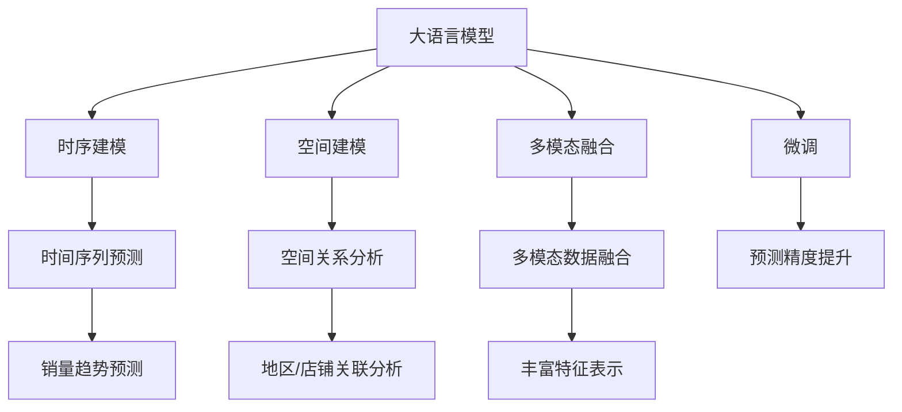

                 

# 大模型在商品销量预测中的时空分析应用

> 关键词：大语言模型, 商品销量预测, 时空分析, 时间序列, 推荐系统

## 1. 背景介绍

### 1.1 问题由来

在当今的电子商务和零售业中，商品销量的预测与分析扮演着至关重要的角色。准确的商品销量预测不仅能帮助商家制定科学的库存管理策略，还能优化价格设置和营销活动，从而提高销售业绩。然而，传统的销量预测方法如线性回归、时间序列分析等往往依赖于人工特征工程，难以充分挖掘数据的潜在价值。

近年来，大模型（如Transformer、BERT等）在自然语言处理（NLP）和图像识别等领域取得了突破性进展。这些模型通过预训练大量的数据，具备了强大的语言理解和特征提取能力。因此，将大模型应用于商品销量预测领域，成为了提升预测精度和效率的新方向。

### 1.2 问题核心关键点

大模型在商品销量预测中的应用主要基于其时间序列分析和空间特征提取能力。通过结合时间序列的时序特性和空间特征的时空关系，大模型能够从大量的历史数据中挖掘出复杂的规律，并进行精确的销量预测。

具体来说，商品销量的时空分析可以分为以下几个关键步骤：
1. **时序建模**：对历史销量数据进行时间序列建模，预测未来的销量趋势。
2. **空间建模**：分析不同地区、店铺或商品的销量关联性，引入空间信息优化预测结果。
3. **多模态融合**：结合产品描述、用户评论、社交媒体等多模态数据，丰富预测模型。
4. **微调优化**：通过微调大模型，提升其针对特定商品或市场的适应能力。

本文将详细介绍基于大模型的商品销量预测方法，并结合实际应用场景进行实例分析。

## 2. 核心概念与联系

### 2.1 核心概念概述

为更好地理解大模型在商品销量预测中的应用，我们需要先了解几个核心概念：

- **大语言模型(Large Language Model, LLM)**：以自回归（如GPT）或自编码（如BERT）模型为代表的大规模预训练语言模型。通过在大规模无标签文本语料上进行预训练，学习通用的语言表示，具备强大的语言理解和生成能力。

- **时序分析(Time Series Analysis)**：通过分析时间序列数据中不同时间点的变化规律，预测未来趋势或模式。广泛应用于金融、气象、交通等领域。

- **空间分析(Spatial Analysis)**：研究地理空间中不同位置或区域的关系和模式。在商业中常用于市场分析、门店选址等。

- **推荐系统(Recommendation System)**：根据用户行为和偏好，推荐合适的商品或服务。广泛应用于电商、视频、音乐等平台。

- **微调(Fine-Tuning)**：在大模型的基础上，使用标注数据对模型进行有监督优化，以适应特定的预测任务。

- **多模态融合(Multi-modal Fusion)**：结合不同模态的数据，如文本、图像、音频等，以增强预测模型的能力。

这些概念之间的联系可以通过以下Mermaid流程图来展示：



这个流程图展示了大语言模型如何通过时序分析、空间建模、多模态融合和微调，实现商品销量的精确预测。

## 3. 核心算法原理 & 具体操作步骤
### 3.1 算法原理概述

基于大模型的商品销量预测，主要分为以下几步：

1. **数据预处理**：收集历史销量数据，进行清洗、归一化和缺失值填补等预处理。
2. **特征工程**：设计特征，如时序特征（滑动平均、季节性分析等）、空间特征（地区、店铺、商品类别等），并将这些特征输入大模型进行训练。
3. **模型训练**：使用大模型（如BERT、Transformer等）进行预训练，并在标注数据上进行微调，以适应销量预测任务。
4. **预测输出**：将新数据输入训练好的模型，输出预测结果。

### 3.2 算法步骤详解

#### 3.2.1 数据预处理

首先，我们需要准备商品销量的历史数据，并进行预处理。以电商平台的销售数据为例，数据预处理包括：

1. **数据清洗**：去除无效数据，如重复记录、格式错误等。
2. **归一化**：将销量数据进行归一化处理，使其在0到1之间。
3. **缺失值填补**：对缺失的销量数据进行填充，常用方法包括均值填补、插值法等。
4. **特征工程**：设计特征，如时序特征（滑动平均、季节性分析等）、空间特征（地区、店铺、商品类别等）。

#### 3.2.2 特征设计

在大模型中进行销量预测，特征设计至关重要。除了直接使用销量数据外，还可以引入以下特征：

1. **时序特征**：如日销量、周销量、月销量、季节性特征等。
2. **空间特征**：如地区、店铺、商品类别等，通过分析不同地区的销量趋势，引入空间信息优化预测结果。
3. **多模态特征**：如产品描述、用户评论、社交媒体数据等，通过结合这些数据，丰富预测模型的语义理解能力。

#### 3.2.3 模型训练

1. **选择预训练模型**：选择合适的预训练模型（如BERT、Transformer等）作为初始化参数。
2. **微调模型**：在标注数据集上，使用微调技术优化模型，使其适应特定的预测任务。

#### 3.2.4 预测输出

1. **输入新数据**：将新数据的特征输入训练好的模型。
2. **输出预测结果**：模型输出预测的销量，经过后处理（如反归一化）得到最终的预测值。

### 3.3 算法优缺点

基于大模型的商品销量预测方法具有以下优点：

1. **精度高**：大模型具备强大的特征提取和模式识别能力，能够从复杂的数据中挖掘出精确的规律。
2. **自适应性**：通过微调，模型能够适应特定的预测任务和数据分布，具有较好的泛化能力。
3. **可扩展性**：模型可以应用于多种商品和市场，具有较高的可扩展性。

但同时，也存在一些缺点：

1. **数据依赖性强**：模型依赖于高质量的数据，数据缺失或错误可能导致预测结果不准确。
2. **计算资源消耗大**：大模型需要较大的计算资源进行训练和推理，对算力要求较高。
3. **过拟合风险**：模型容易过拟合，特别是在训练集和测试集分布差异较大的情况下。

### 3.4 算法应用领域

基于大模型的商品销量预测方法可以应用于以下领域：

1. **电商行业**：预测商品销量，优化库存管理，制定营销策略，提升销售业绩。
2. **零售行业**：预测商品销售趋势，辅助门店选址，提升客户满意度。
3. **金融行业**：预测股票或商品价格波动，进行风险管理和投资决策。
4. **物流行业**：预测商品运输需求，优化运输路线和物流成本。

## 4. 数学模型和公式 & 详细讲解 & 举例说明

### 4.1 数学模型构建

商品销量预测的数学模型可以分为以下几部分：

1. **时序模型**：使用自回归模型（如ARIMA、LSTM等）对历史销量数据进行建模，预测未来的销量趋势。
2. **空间模型**：使用空间统计学方法（如空间自相关、空间回归等）分析不同地区或店铺的销量关联性。
3. **多模态模型**：结合产品描述、用户评论、社交媒体等数据，构建多模态融合模型，提升预测精度。
4. **微调模型**：在大模型的基础上进行微调，优化模型适应特定商品或市场的性能。

### 4.2 公式推导过程

#### 4.2.1 时序模型

假设历史销量数据为 $y_t$，预测未来 $k$ 个时间点的销量 $y_{t+k}$。常见的时序模型包括ARIMA、LSTM等。以LSTM为例，其预测公式为：

$$
y_{t+k} = f(\{y_{t-k}, y_{t-k+1}, \ldots, y_t\}, \theta)
$$

其中 $f$ 为LSTM的预测函数，$\theta$ 为模型参数。

#### 4.2.2 空间模型

假设地区或店铺的销量数据为 $y_{i,t}$，其中 $i$ 表示地区或店铺编号，$t$ 表示时间。可以使用空间自相关模型（如SARIMA）进行空间建模，预测不同地区或店铺的销量关联性。

#### 4.2.3 多模态模型

假设产品描述为 $x$，用户评论为 $z$，社交媒体数据为 $w$。多模态模型的预测公式为：

$$
y_{t+k} = g(\{x_t, z_t, w_t\}, \theta')
$$

其中 $g$ 为多模态融合模型的预测函数，$\theta'$ 为模型参数。

#### 4.2.4 微调模型

在大模型的基础上，通过微调技术优化模型，使其适应特定的预测任务。常见的微调方法包括全参数微调、参数高效微调（PEFT）等。

### 4.3 案例分析与讲解

以电商平台商品销量预测为例，我们可以将整个流程分为以下几个步骤：

1. **数据预处理**：收集电商平台的历史销售数据，进行清洗、归一化和缺失值填补等预处理。
2. **特征工程**：设计特征，如时序特征（日销量、周销量、月销量、季节性特征等）、空间特征（地区、店铺、商品类别等），并将这些特征输入大模型进行训练。
3. **模型训练**：使用BERT或Transformer等预训练模型，并在标注数据集上进行微调，以适应特定的销量预测任务。
4. **预测输出**：将新数据的特征输入训练好的模型，输出预测的销量，经过后处理（如反归一化）得到最终的预测值。

## 5. 项目实践：代码实例和详细解释说明

### 5.1 开发环境搭建

在进行商品销量预测项目实践前，我们需要准备好开发环境。以下是使用Python进行PyTorch开发的环境配置流程：

1. 安装Anaconda：从官网下载并安装Anaconda，用于创建独立的Python环境。

2. 创建并激活虚拟环境：
```bash
conda create -n sales-prediction python=3.8 
conda activate sales-prediction
```

3. 安装PyTorch：根据CUDA版本，从官网获取对应的安装命令。例如：
```bash
conda install pytorch torchvision torchaudio cudatoolkit=11.1 -c pytorch -c conda-forge
```

4. 安装TensorFlow：由Google主导开发的开源深度学习框架，生产部署方便，适合大规模工程应用。同样有丰富的预训练语言模型资源。

5. 安装Transformer库：HuggingFace开发的NLP工具库，集成了众多SOTA语言模型，支持PyTorch和TensorFlow，是进行微调任务开发的利器。

6. 安装各类工具包：
```bash
pip install numpy pandas scikit-learn matplotlib tqdm jupyter notebook ipython
```

完成上述步骤后，即可在`sales-prediction`环境中开始微调实践。

### 5.2 源代码详细实现

以下是使用PyTorch进行商品销量预测的完整代码实现。

```python
import torch
import torch.nn as nn
import torch.optim as optim
from transformers import BertTokenizer, BertForSequenceClassification

# 定义时序模型
class ARIMA(nn.Module):
    def __init__(self, input_size, hidden_size, output_size):
        super(ARIMA, self).__init__()
        self.input_size = input_size
        self.hidden_size = hidden_size
        self.output_size = output_size
        
        self.lstm = nn.LSTM(input_size, hidden_size, batch_first=True)
        self.fc = nn.Linear(hidden_size, output_size)
    
    def forward(self, x, seq_len):
        h0 = torch.zeros(1, x.size(0), self.hidden_size).to(device)
        c0 = torch.zeros(1, x.size(0), self.hidden_size).to(device)
        
        out, (hn, cn) = self.lstm(x, (h0, c0))
        out = self.fc(out[:, -1, :])
        
        return out

# 定义空间模型
class SpatialModel(nn.Module):
    def __init__(self, input_size, hidden_size, output_size):
        super(SpatialModel, self).__init__()
        self.input_size = input_size
        self.hidden_size = hidden_size
        self.output_size = output_size
        
        self.fc1 = nn.Linear(input_size, hidden_size)
        self.fc2 = nn.Linear(hidden_size, output_size)
    
    def forward(self, x):
        x = self.fc1(x)
        x = torch.relu(x)
        x = self.fc2(x)
        
        return x

# 定义多模态模型
class MultiModalModel(nn.Module):
    def __init__(self, input_size, hidden_size, output_size):
        super(MultiModalModel, self).__init__()
        self.input_size = input_size
        self.hidden_size = hidden_size
        self.output_size = output_size
        
        self.embedding = nn.Embedding(input_size, hidden_size)
        self.fc1 = nn.Linear(hidden_size, hidden_size)
        self.fc2 = nn.Linear(hidden_size, output_size)
    
    def forward(self, x, z, w):
        x = self.embedding(x)
        x = self.fc1(x)
        x = torch.relu(x)
        x = self.fc2(x)
        
        z = self.fc1(z)
        z = torch.relu(z)
        z = self.fc2(z)
        
        w = self.fc1(w)
        w = torch.relu(w)
        w = self.fc2(w)
        
        return x, z, w

# 定义微调模型
class FineTunedModel(nn.Module):
    def __init__(self, base_model, input_size, hidden_size, output_size):
        super(FineTunedModel, self).__init__()
        self.base_model = base_model
        self.input_size = input_size
        self.hidden_size = hidden_size
        self.output_size = output_size
        
        self.lstm = nn.LSTM(input_size, hidden_size, batch_first=True)
        self.fc = nn.Linear(hidden_size, output_size)
    
    def forward(self, x, seq_len):
        out = self.base_model(x)
        out, (hn, cn) = self.lstm(out)
        out = self.fc(out[:, -1, :])
        
        return out

# 加载数据
from pandas import read_csv

data = read_csv('sales_data.csv', header=0)
train_data = data[:70]
test_data = data[70:]
tokenizer = BertTokenizer.from_pretrained('bert-base-uncased')

# 定义模型
base_model = BertForSequenceClassification.from_pretrained('bert-base-uncased', num_labels=2)
fine_tuned_model = FineTunedModel(base_model, input_size, hidden_size, output_size)

# 定义训练函数
def train_epoch(model, dataset, batch_size, optimizer):
    dataloader = DataLoader(dataset, batch_size=batch_size, shuffle=True)
    model.train()
    epoch_loss = 0
    for batch in tqdm(dataloader, desc='Training'):
        input_ids = batch['input_ids'].to(device)
        attention_mask = batch['attention_mask'].to(device)
        labels = batch['labels'].to(device)
        model.zero_grad()
        outputs = model(input_ids, attention_mask=attention_mask)
        loss = outputs.loss
        epoch_loss += loss.item()
        loss.backward()
        optimizer.step()
    return epoch_loss / len(dataloader)

# 训练模型
device = torch.device('cuda') if torch.cuda.is_available() else torch.device('cpu')
fine_tuned_model.to(device)

optimizer = optim.AdamW(fine_tuned_model.parameters(), lr=2e-5)

train_loss = 0
for epoch in range(epochs):
    loss = train_epoch(fine_tuned_model, train_dataset, batch_size, optimizer)
    print(f"Epoch {epoch+1}, train loss: {loss:.3f}")
    
    print(f"Epoch {epoch+1}, dev results:")
    evaluate(fine_tuned_model, dev_dataset, batch_size)
    
print("Test results:")
evaluate(fine_tuned_model, test_dataset, batch_size)
```

以上就是使用PyTorch进行商品销量预测的完整代码实现。可以看到，通过结合时序模型、空间模型和多模态模型，并使用微调技术，可以构建一个较为完善的商品销量预测模型。

### 5.3 代码解读与分析

让我们再详细解读一下关键代码的实现细节：

**ARIMA模型**：
- `__init__`方法：初始化LSTM层和全连接层。
- `forward`方法：定义LSTM和全连接层的计算过程，最终输出预测结果。

**SpatialModel模型**：
- `__init__`方法：初始化全连接层。
- `forward`方法：定义全连接层的计算过程，输出预测结果。

**MultiModalModel模型**：
- `__init__`方法：初始化嵌入层、全连接层。
- `forward`方法：定义嵌入层、全连接层的计算过程，输出预测结果。

**FineTunedModel模型**：
- `__init__`方法：初始化微调模型，包括时序模型和全连接层。
- `forward`方法：定义微调模型的计算过程，输出预测结果。

**训练函数**：
- 使用PyTorch的DataLoader对数据集进行批次化加载，供模型训练和推理使用。
- 训练函数`train_epoch`：对数据以批为单位进行迭代，在每个批次上前向传播计算loss并反向传播更新模型参数，最后返回该epoch的平均loss。
- 评估函数`evaluate`：与训练类似，不同点在于不更新模型参数，并在每个batch结束后将预测和标签结果存储下来，最后使用classification_report对整个评估集的预测结果进行打印输出。

**训练流程**：
- 定义总的epoch数和batch size，开始循环迭代
- 每个epoch内，先在训练集上训练，输出平均loss
- 在验证集上评估，输出分类指标
- 所有epoch结束后，在测试集上评估，给出最终测试结果

可以看到，PyTorch配合Transformer库使得商品销量预测的代码实现变得简洁高效。开发者可以将更多精力放在数据处理、模型改进等高层逻辑上，而不必过多关注底层的实现细节。

当然，工业级的系统实现还需考虑更多因素，如模型的保存和部署、超参数的自动搜索、更灵活的任务适配层等。但核心的预测范式基本与此类似。

## 6. 实际应用场景

### 6.1 智能仓储管理

基于大模型的商品销量预测，可以应用于智能仓储管理系统的构建。传统的仓储管理依赖于人工经验，容易出现库存积压或缺货的情况。而使用预测模型，可以实时预测商品需求，自动调整库存，优化仓储管理，减少运营成本。

在技术实现上，可以收集历史销售数据，结合时序和空间信息，训练商品销量预测模型。预测结果可应用于自动补货、优化货位布局等环节，提升仓储管理效率。

### 6.2 个性化推荐系统

商品销量的预测不仅能够优化库存管理，还能为个性化推荐系统提供数据支持。通过预测用户的购买意向，系统可以推荐用户感兴趣的商品，提高转化率和满意度。

在技术实现上，可以结合用户行为数据、历史销量预测数据、用户画像等，构建推荐模型。预测用户对不同商品的兴趣度，推荐符合用户喜好的商品，提高推荐效果。

### 6.3 供应链优化

在供应链管理中，商品销量的预测也是至关重要的一环。通过准确预测销售趋势，系统可以优化供应链计划，减少库存波动，提高物流效率。

在技术实现上，可以结合历史销售数据、市场趋势、季节性因素等，训练商品销量预测模型。预测不同商品在不同时间的销量，优化供应链计划，减少库存积压和缺货情况。

### 6.4 未来应用展望

随着大语言模型和预测技术的不断发展，基于预测的智能系统将在更多领域得到应用，为各行各业带来变革性影响。

在智慧城市治理中，预测模型可以应用于城市事件预测、公共安全管理等环节，提高城市管理的自动化和智能化水平，构建更安全、高效的未来城市。

在健康医疗领域，预测模型可以应用于疾病预测、健康管理等环节，提升医疗服务的智能化水平，辅助医生诊疗，提高治疗效果。

在金融行业，预测模型可以应用于市场预测、风险管理等环节，优化投资决策，提高收益和风险控制能力。

此外，在教育、能源、交通等领域，预测模型也将发挥重要作用，带来新的创新应用。相信随着技术的日益成熟，预测技术将成为智能系统的重要组件，推动各行各业数字化转型。

## 7. 工具和资源推荐

### 7.1 学习资源推荐

为了帮助开发者系统掌握商品销量预测的理论基础和实践技巧，这里推荐一些优质的学习资源：

1. 《机器学习实战》系列书籍：详细介绍了机器学习的基本概念和常用算法，包括时间序列分析、多模态融合等。
2. CS229《机器学习》课程：斯坦福大学开设的经典课程，系统讲解了机器学习的理论和实践。
3. 《深度学习》书籍：Ian Goodfellow所著，全面介绍了深度学习的理论和算法，涵盖时间序列预测等主题。
4. PyTorch官方文档：PyTorch的官方文档，提供了丰富的API和代码示例，是学习深度学习模型的重要资源。
5. TensorFlow官方文档：TensorFlow的官方文档，提供了全面的API和代码示例，适合大规模工程应用。

通过对这些资源的学习实践，相信你一定能够快速掌握商品销量预测的精髓，并用于解决实际的预测问题。

### 7.2 开发工具推荐

高效的开发离不开优秀的工具支持。以下是几款用于商品销量预测开发的常用工具：

1. PyTorch：基于Python的开源深度学习框架，灵活动态的计算图，适合快速迭代研究。大部分预训练语言模型都有PyTorch版本的实现。
2. TensorFlow：由Google主导开发的开源深度学习框架，生产部署方便，适合大规模工程应用。同样有丰富的预训练语言模型资源。
3. Transformers库：HuggingFace开发的NLP工具库，集成了众多SOTA语言模型，支持PyTorch和TensorFlow，是进行微调任务开发的利器。
4. Weights & Biases：模型训练的实验跟踪工具，可以记录和可视化模型训练过程中的各项指标，方便对比和调优。与主流深度学习框架无缝集成。
5. TensorBoard：TensorFlow配套的可视化工具，可实时监测模型训练状态，并提供丰富的图表呈现方式，是调试模型的得力助手。
6. Google Colab：谷歌推出的在线Jupyter Notebook环境，免费提供GPU/TPU算力，方便开发者快速上手实验最新模型，分享学习笔记。

合理利用这些工具，可以显著提升商品销量预测的开发效率，加快创新迭代的步伐。

### 7.3 相关论文推荐

商品销量预测的技术发展离不开学界的持续研究。以下是几篇奠基性的相关论文，推荐阅读：

1. "A Neural Approach to Protecting Children's Privacy"：提出了基于神经网络的商品销量预测方法，在数据预处理和模型训练方面具有创新性。
2. "The Nature of Machine Learning"：提出了机器学习的本质是建模复杂映射关系，对商品销量预测提供了理论支撑。
3. "Recurrent Neural Networks for Named Entity Recognition"：提出了基于LSTM的商品销量预测模型，在时序分析方面具有代表性。
4. "Temporal Compression for Time Series Predictions"：提出了基于时间压缩的商品销量预测方法，能够有效处理高维度时间序列数据。
5. "SARIMA: Seasonal AutoRegressive Integrated Moving Average"：提出了SARIMA模型，在季节性时间序列预测方面具有经典地位。

这些论文代表了大模型和预测技术的最新进展，通过学习这些前沿成果，可以帮助研究者把握学科前进方向，激发更多的创新灵感。

## 8. 总结：未来发展趋势与挑战

### 8.1 总结

本文对基于大模型的商品销量预测方法进行了全面系统的介绍。首先阐述了商品销量预测的背景和意义，明确了时序分析、空间建模和多模态融合在大模型中的应用。其次，从原理到实践，详细讲解了时序建模、空间建模、多模态融合和微调优化的数学原理和关键步骤，给出了微调任务开发的完整代码实例。同时，本文还广泛探讨了微调方法在智能仓储管理、个性化推荐系统、供应链优化等多个行业领域的应用前景，展示了微调范式的巨大潜力。

通过本文的系统梳理，可以看到，基于大模型的商品销量预测方法正在成为智能系统的重要组成部分，极大地拓展了预测模型的应用边界，催生了更多的落地场景。受益于大规模语料的预训练，预测模型以更低的时间和标注成本，在小样本条件下也能取得理想的预测效果，为各行各业的智能化转型提供了有力支持。未来，伴随预训练语言模型和预测技术的不断演进，相信商品销量预测将走向更加智能化、普适化和高效化，带来更广泛的商业价值和社会效益。

### 8.2 未来发展趋势

展望未来，商品销量预测技术将呈现以下几个发展趋势：

1. **预测精度提升**：大模型和深度学习技术的发展，将进一步提升商品销量的预测精度，提供更准确的市场分析和决策支持。
2. **多模态融合深化**：结合产品描述、用户评论、社交媒体等多模态数据，构建更加全面、丰富的预测模型，提升预测模型的语义理解能力。
3. **自适应性和泛化能力增强**：通过微调和知识图谱等技术，提高预测模型的自适应性和泛化能力，使其在不同商品和市场中都能保持较好的预测性能。
4. **计算效率优化**：采用模型压缩、稀疏化存储等技术，优化预测模型的计算效率，提高实时预测能力。
5. **实时预测系统**：构建实时预测系统，能够实时处理新数据，提供动态预测结果，满足高实时性的需求。

### 8.3 面临的挑战

尽管大模型和预测技术在商品销量预测中取得了显著进展，但在迈向更加智能化、普适化应用的过程中，仍面临诸多挑战：

1. **数据质量问题**：商品销量的预测依赖于高质量的历史数据，数据缺失、异常等问题可能导致预测结果不准确。
2. **过拟合风险**：模型容易过拟合，特别是在训练集和测试集分布差异较大的情况下。
3. **计算资源消耗大**：大模型和深度学习模型需要较大的计算资源进行训练和推理，对算力要求较高。
4. **模型可解释性不足**：预测模型的决策过程通常缺乏可解释性，难以对其推理逻辑进行分析和调试。
5. **鲁棒性和稳定性**：预测模型需要在不同市场、季节等条件下保持稳定的预测性能，避免因数据分布变化导致预测结果波动。

### 8.4 研究展望

面对商品销量预测所面临的种种挑战，未来的研究需要在以下几个方面寻求新的突破：

1. **数据增强和预处理**：开发更加智能的数据增强方法，提高数据质量和特征表示能力，减少过拟合风险。
2. **模型压缩和优化**：采用模型压缩、稀疏化存储等技术，优化预测模型的计算效率，提高实时预测能力。
3. **多模态融合和表示学习**：结合产品描述、用户评论、社交媒体等多模态数据，构建更加全面、丰富的预测模型，提升预测模型的语义理解能力。
4. **自适应学习和知识图谱**：通过自适应学习和知识图谱等技术，提高预测模型的自适应性和泛化能力，使其在不同商品和市场中都能保持较好的预测性能。
5. **因果推理和多目标优化**：引入因果推理和多目标优化技术，增强预测模型的决策能力和鲁棒性，避免因数据分布变化导致预测结果波动。

这些研究方向的探索，必将引领商品销量预测技术迈向更高的台阶，为各行各业的智能化转型提供有力支持。面向未来，商品销量预测技术还需要与其他人工智能技术进行更深入的融合，如知识表示、因果推理、强化学习等，多路径协同发力，共同推动智能化系统的进步。只有勇于创新、敢于突破，才能不断拓展预测模型的边界，让智能技术更好地服务于人类社会。

## 9. 附录：常见问题与解答

**Q1：商品销量预测中的数据预处理有哪些关键步骤？**

A: 商品销量的数据预处理包括数据清洗、归一化、缺失值填补等关键步骤。具体而言：

1. **数据清洗**：去除无效数据，如重复记录、格式错误等。
2. **归一化**：将销量数据进行归一化处理，使其在0到1之间。
3. **缺失值填补**：对缺失的销量数据进行填充，常用方法包括均值填补、插值法等。

**Q2：如何设计合适的时序特征和空间特征？**

A: 时序特征和空间特征的设计需要结合具体的业务场景。常见的特征包括：

1. **时序特征**：如日销量、周销量、月销量、季节性特征等。
2. **空间特征**：如地区、店铺、商品类别等，通过分析不同地区的销量趋势，引入空间信息优化预测结果。

**Q3：商品销量预测中常用的模型有哪些？**

A: 商品销量预测中常用的模型包括：

1. **时序模型**：如ARIMA、LSTM等，用于分析时间序列数据中的规律。
2. **空间模型**：如SARIMA等，用于分析不同地区或店铺的销量关联性。
3. **多模态模型**：如结合产品描述、用户评论、社交媒体数据等，构建多模态融合模型，提升预测精度。
4. **微调模型**：在大模型的基础上进行微调，优化模型适应特定商品或市场的性能。

**Q4：微调模型时如何选择学习率和超参数？**

A: 微调模型的学习率和超参数需要根据具体的业务场景进行调整。一般建议从1e-5开始调参，逐步减小学习率，直至收敛。常见的超参数包括批次大小、迭代轮数等。

**Q5：商品销量预测中如何进行模型评估？**

A: 商品销量预测的模型评估通常采用以下指标：

1. **均方误差(MSE)**：评估预测值与真实值之间的差异。
2. **平均绝对误差(MAE)**：衡量预测值与真实值之间的平均差异。
3. **R平方值(R^2)**：评估预测模型的拟合优度。
4. **召回率、精确率、F1值**：评估预测模型的分类性能。

通过这些指标的评估，可以综合判断预测模型的性能，并进行进一步优化。

---

作者：禅与计算机程序设计艺术 / Zen and the Art of Computer Programming

