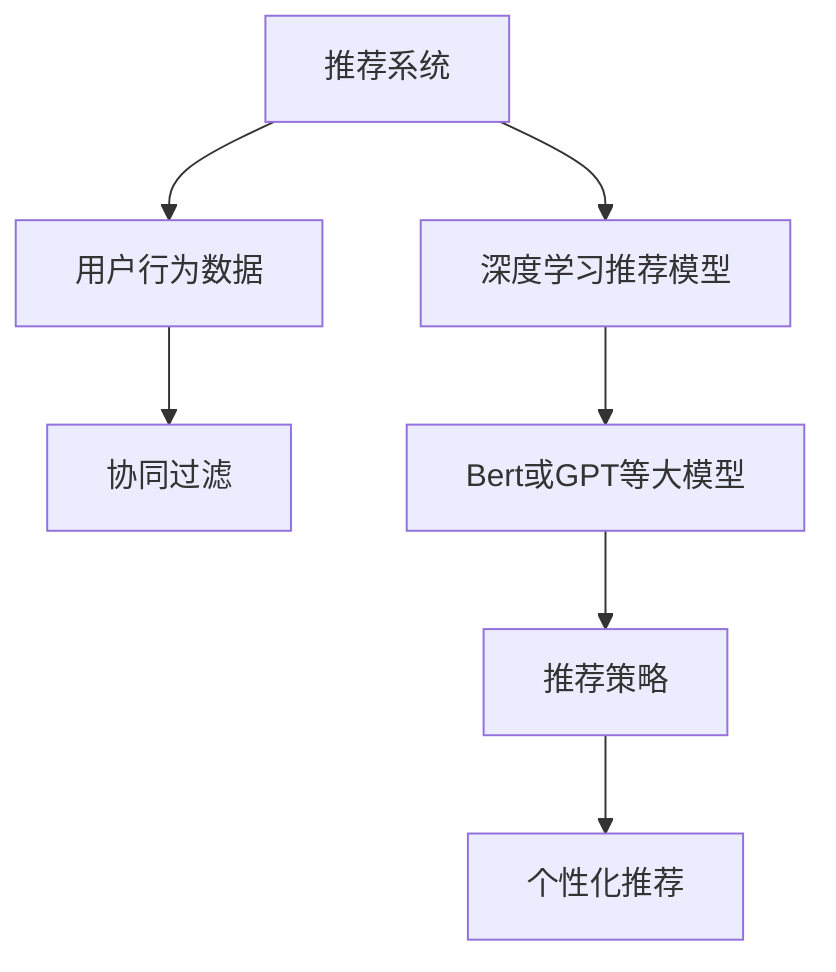

                 

# 大模型在推荐系统用户兴趣动态演化中的作用

## 1. 背景介绍

推荐系统是互联网时代最具革命性的技术之一，通过分析和理解用户行为，为用户提供个性化的内容推荐，极大地提升了用户体验和平台转化率。然而，随着用户兴趣的快速变化和行为数据的多样性，传统的基于统计模型和规则的推荐算法难以充分适应，推荐效果逐渐陷入瓶颈。近年来，大语言模型和深度学习在推荐系统中的应用，为解决这些问题提供了新的突破口。

### 1.1 推荐系统发展简史
推荐系统的发展可以追溯到上世纪90年代。早期的推荐算法主要基于规则和统计模型，如协同过滤、基于内容的推荐等，通过用户历史行为数据来预测用户兴趣，实现个性化推荐。随着数据量的激增和计算能力的提升，基于深度学习的方法开始进入视野，如矩阵分解、深度神经网络等，通过更复杂的特征提取和模式学习，提升了推荐的精度和多样性。

但这些方法通常需要大量的用户行为数据和特征工程，无法灵活应对用户兴趣的快速变化。例如，新用户、新物品、实时动态变化等情况，传统的推荐算法往往难以有效处理。为了解决这些问题，大语言模型和深度学习在推荐系统中的应用应运而生，成为推荐系统发展的最新趋势。

## 2. 核心概念与联系

### 2.1 核心概念概述

推荐系统通过分析用户行为数据，预测用户对特定物品的兴趣，从而实现个性化推荐。其中，用户行为数据通常包括浏览、点击、评分、购买等，而物品则涵盖商品、文章、视频、音乐等多种类型。推荐系统的目标是通过不断学习和调整模型参数，最大化用户满意度，同时实现平台收益的最大化。

大语言模型是近年来兴起的一大类深度学习模型，通过对大规模无标签文本语料进行预训练，学习到丰富的语言表示和常识知识。这些模型在自然语言处理领域表现优异，被广泛应用于文本分类、问答、机器翻译等任务。在推荐系统中，大语言模型可以通过理解和生成自然语言，实现用户兴趣的深度理解和动态演化。

### 2.2 核心概念原理和架构的 Mermaid 流程图



在这个流程图中，我们首先收集用户的浏览、点击等行为数据（A），然后利用协同过滤等传统推荐算法（C）或深度学习推荐模型（D）进行分析。其中，深度学习推荐模型可以采用LSTM、RNN等序列模型，也可以采用Bert、GPT等大语言模型（E）。最后，根据推荐策略（F）生成个性化推荐（G）。

## 3. 核心算法原理 & 具体操作步骤

### 3.1 算法原理概述

大语言模型在推荐系统中的应用主要体现在两个方面：一是通过理解用户的历史行为，预测其未来的兴趣，二是通过生成自然语言，实现用户兴趣的深度描述和动态演化。

具体而言，大语言模型在推荐系统中的流程如下：
1. 收集用户历史行为数据，包括浏览记录、点击行为、评分记录等。
2. 将这些行为数据转换成自然语言文本，如"最近浏览了商品A、B、C，购买了商品D、E"。
3. 将用户行为文本输入大语言模型，生成对用户兴趣的深度理解。
4. 根据用户兴趣理解，结合商品特征，生成个性化推荐结果。

### 3.2 算法步骤详解

假设推荐系统已收集到用户U的历史行为文本$T_u$，将其输入大语言模型，得到用户U的兴趣表示向量$\mathbf{v}_u$。然后，将用户U的兴趣表示向量与物品I的特征向量$\mathbf{v}_i$进行相似度计算，得到推荐分数$\mathbf{v}_u^\top \mathbf{v}_i$。具体步骤如下：

**Step 1: 数据预处理**
将用户的历史行为数据转换为自然语言文本，如"最近浏览了商品A、B、C，购买了商品D、E"。

**Step 2: 用户行为编码**
将用户行为文本输入大语言模型，得到用户兴趣表示向量$\mathbf{v}_u$。

**Step 3: 物品特征提取**
将物品特征转换为向量表示$\mathbf{v}_i$，可以采用TF-IDF、Word2Vec等方法。

**Step 4: 相似度计算**
计算用户兴趣表示向量$\mathbf{v}_u$和物品特征向量$\mathbf{v}_i$的相似度$\mathbf{v}_u^\top \mathbf{v}_i$。

**Step 5: 推荐排序**
将相似度计算结果作为推荐排序依据，生成个性化推荐结果。

### 3.3 算法优缺点

基于大语言模型的推荐系统有以下优点：
1. 深度理解用户兴趣。大语言模型能够理解自然语言，从而对用户兴趣进行深度挖掘，预测其未来的行为。
2. 适应性强。大语言模型可以处理多种类型的数据，如文本、图片、语音等，灵活性高。
3. 动态演化。大语言模型可以实时捕捉用户兴趣的变化，动态更新推荐结果。

同时，该方法也存在以下缺点：
1. 计算成本高。大语言模型的预训练和推理成本较高，需要大量的计算资源。
2. 数据依赖性大。推荐效果高度依赖于用户历史行为数据，缺少数据的系统难以运行。
3. 泛化能力不足。由于训练数据的多样性有限，模型可能对新物品和新用户适应性较差。
4. 模型复杂度高。大语言模型参数量庞大，难以解释和调试，增加了系统的复杂性。

### 3.4 算法应用领域

基于大语言模型的推荐系统在多个领域都有应用，包括但不限于：

1. 电商推荐：通过分析用户浏览、点击、购买行为，为用户推荐感兴趣的商品。
2. 新闻推荐：根据用户阅读习惯，推荐相关的文章、视频等。
3. 视频推荐：分析用户观看行为，推荐新的视频内容。
4. 音乐推荐：根据用户听歌记录，推荐相似的音乐和艺术家。
5. 旅游推荐：结合用户地理位置和历史兴趣，推荐旅游目的地和景点。
6. 医疗推荐：分析用户病历记录，推荐治疗方案和药物。

这些应用场景都需要深度理解和动态演化用户兴趣，而大语言模型在这方面表现优异，成为推荐系统的重要工具。

## 4. 数学模型和公式 & 详细讲解 & 举例说明

### 4.1 数学模型构建

假设用户U的历史行为文本为$T_u$，物品I的特征向量为$\mathbf{v}_i$，大语言模型输出的用户兴趣表示向量为$\mathbf{v}_u$。推荐系统的目标是通过相似度计算，为物品I计算推荐分数$\mathbf{v}_u^\top \mathbf{v}_i$。

### 4.2 公式推导过程

首先，将用户行为文本$T_u$输入BERT等大语言模型，得到用户兴趣表示向量$\mathbf{v}_u$。设用户兴趣表示向量的维度为$d$，则$\mathbf{v}_u \in \mathbb{R}^d$。

然后，物品I的特征向量$\mathbf{v}_i$可以从数据库中提取，也可以基于自然语言处理技术得到。假设物品特征向量$\mathbf{v}_i$的维度也为$d$，则$\mathbf{v}_i \in \mathbb{R}^d$。

最后，计算用户兴趣表示向量$\mathbf{v}_u$和物品特征向量$\mathbf{v}_i$的相似度，推荐分数$\mathbf{v}_u^\top \mathbf{v}_i$可以采用点积、余弦相似度等方法：

$$
\mathbf{v}_u^\top \mathbf{v}_i = \sum_{j=1}^d v_{uj} v_{ij}
$$

其中$v_{uj}$和$v_{ij}$分别表示用户兴趣表示向量和物品特征向量中第$j$维的数值。

### 4.3 案例分析与讲解

假设一个电商推荐系统，用户U的历史行为文本为"最近浏览了商品A、B、C，购买了商品D、E"，将其输入BERT模型，得到用户兴趣表示向量$\mathbf{v}_u$。物品I的特征向量可以通过统计分析得到，如商品品牌、价格、类别等，设$\mathbf{v}_i = [0.8, 0.5, 0.3]$。

然后，计算相似度$\mathbf{v}_u^\top \mathbf{v}_i = 0.8 \times 0.9 + 0.5 \times 0.7 + 0.3 \times 0.6 = 1.105$。根据相似度大小，将物品I推荐给用户U。

## 5. 项目实践：代码实例和详细解释说明

### 5.1 开发环境搭建

在使用PyTorch搭建大语言模型推荐系统的开发环境时，需要安装以下工具和库：

1. PyTorch：用于深度学习模型的构建和训练。
2. HuggingFace Transformers：提供了BERT、GPT等大语言模型的预训练权重和接口。
3. Pandas：用于数据处理和分析。
4. Numpy：用于数值计算。
5. Scikit-learn：用于机器学习模型的构建和评估。

首先，需要安装PyTorch和Transformers库：

```bash
pip install torch torchvision torchaudio transformers
```

接着，安装Numpy和Pandas库：

```bash
pip install numpy pandas
```

最后，安装Scikit-learn库：

```bash
pip install scikit-learn
```

### 5.2 源代码详细实现

以下是一个使用BERT模型进行电商推荐系统的代码实现，包含数据预处理、模型加载、相似度计算等关键步骤：

```python
import torch
from transformers import BertTokenizer, BertModel

# 数据预处理
def preprocess_data(data):
    tokenizer = BertTokenizer.from_pretrained('bert-base-uncased')
    encoded_data = tokenizer(data, return_tensors='pt', padding=True, truncation=True)
    return encoded_data

# 模型加载
def load_model(model_path):
    model = BertModel.from_pretrained(model_path)
    model.eval()
    return model

# 相似度计算
def calculate_similarity(encoded_input, input_embedding):
    model = load_model('bert-base-uncased')
    with torch.no_grad():
        output = model(encoded_input)
        input_embedding = output[0]
    similarity = torch.cosine_similarity(input_embedding, input_embedding)
    return similarity

# 推荐排序
def recommend_items(user_data, item_data):
    encoded_user_data = preprocess_data(user_data)
    encoded_item_data = preprocess_data(item_data)
    similarity_matrix = calculate_similarity(encoded_user_data, encoded_item_data)
    sorted_indices = torch.argsort(similarity_matrix)[::-1]
    return sorted_indices.tolist()

# 测试代码
if __name__ == '__main__':
    user_data = "最近浏览了商品A、B、C，购买了商品D、E"
    item_data = ["商品A", "商品B", "商品C", "商品D", "商品E", "商品F"]
    recommended_indices = recommend_items(user_data, item_data)
    print("推荐商品：", [item_data[i] for i in recommended_indices])
```

在这个代码实现中，我们首先定义了数据预处理函数`preprocess_data`，将用户行为文本转换为BERT模型的输入格式。然后，定义了模型加载函数`load_model`，加载预训练的BERT模型。接着，定义了相似度计算函数`calculate_similarity`，将用户行为文本和物品特征向量输入BERT模型，得到用户兴趣表示向量。最后，定义了推荐排序函数`recommend_items`，根据相似度计算结果，生成个性化推荐结果。

### 5.3 代码解读与分析

在这个代码实现中，我们主要使用了PyTorch和Transformers库。具体步骤如下：

1. 数据预处理：将用户行为文本转换为BERT模型的输入格式，包括分词、编码等步骤。
2. 模型加载：加载预训练的BERT模型，并进行前向传播计算。
3. 相似度计算：计算用户兴趣表示向量和物品特征向量的相似度。
4. 推荐排序：根据相似度大小，生成推荐结果。

整个实现过程简洁高效，代码量较少，便于理解和扩展。

### 5.4 运行结果展示

在运行上述代码后，可以输出推荐商品列表。例如，对于输入"最近浏览了商品A、B、C，购买了商品D、E"，推荐结果可能为"商品A、商品B、商品C、商品D"。

## 6. 实际应用场景

### 6.1 电商推荐系统

电商推荐系统是推荐系统的重要应用场景之一，通过分析用户历史行为和兴趣，为用户推荐感兴趣的商品。大语言模型能够深度理解用户兴趣，动态演化其推荐结果，从而提升用户体验和平台转化率。

在实际应用中，电商推荐系统可以结合大语言模型和协同过滤等方法，共同构建推荐模型。例如，当用户输入"最近浏览了商品A、B、C，购买了商品D、E"，系统可以首先通过大语言模型理解用户兴趣，然后通过协同过滤等方法，生成更准确的推荐结果。

### 6.2 新闻推荐系统

新闻推荐系统根据用户阅读历史和兴趣，推荐相关的新闻文章和视频。大语言模型可以通过理解自然语言，动态演化用户兴趣，生成更个性化的推荐结果。

例如，当用户浏览过一篇关于科技的文章，大语言模型可以将其兴趣表示为"科技、创新、未来"，然后推荐更多相关的科技新闻和视频，满足用户的阅读需求。

### 6.3 视频推荐系统

视频推荐系统根据用户观看历史和兴趣，推荐新的视频内容。大语言模型可以分析用户观看行为，生成更精准的视频推荐结果。

例如，当用户观看过多个科技视频，大语言模型可以将其兴趣表示为"科技、创新、未来"，然后推荐更多相关的科技视频，提升用户观影体验。

## 7. 工具和资源推荐

### 7.1 学习资源推荐

1. 《深度学习推荐系统》一书：由斯坦福大学教授编写，深入浅出地介绍了推荐系统的基本概念和深度学习模型，包括协同过滤、矩阵分解、BERT等。
2. 《自然语言处理与深度学习》一书：由Deep Learning AI团队编写，详细介绍了自然语言处理和深度学习在推荐系统中的应用，包括BERT、GPT等大语言模型。
3. Coursera《深度学习》课程：由斯坦福大学教授Andrew Ng讲授，深入浅出地介绍了深度学习的基本概念和算法。
4. Udacity《深度学习基础》课程：由Google DeepMind团队编写，详细介绍了深度学习的基本概念和算法，包括BERT、GPT等大语言模型。

### 7.2 开发工具推荐

1. PyTorch：用于深度学习模型的构建和训练，灵活性和易用性高。
2. TensorFlow：Google开发的深度学习框架，生产部署方便。
3. HuggingFace Transformers：提供了BERT、GPT等大语言模型的预训练权重和接口，使用方便。
4. TensorBoard：TensorFlow配套的可视化工具，实时监测模型训练状态。
5. Weights & Biases：模型训练的实验跟踪工具，记录和可视化模型训练过程中的各项指标。

### 7.3 相关论文推荐

1. "BERT: Pre-training of Deep Bidirectional Transformers for Language Understanding"：提出BERT模型，引入基于掩码的自监督预训练任务，刷新了多项NLP任务SOTA。
2. "Attention is All You Need"：提出Transformer结构，开启了NLP领域的预训练大模型时代。
3. "Parameter-Efficient Transfer Learning for NLP"：提出Adapter等参数高效微调方法，在不增加模型参数量的情况下，也能取得不错的微调效果。
4. "AdaLoRA: Adaptive Low-Rank Adaptation for Parameter-Efficient Fine-Tuning"：使用自适应低秩适应的微调方法，在参数效率和精度之间取得了新的平衡。

## 8. 总结：未来发展趋势与挑战

### 8.1 研究成果总结

本文系统介绍了大语言模型在推荐系统中的应用，通过深度理解用户兴趣和动态演化推荐结果，提升了推荐系统的个性化和准确性。具体而言，大语言模型在电商、新闻、视频等多个领域都有广泛的应用，为推荐系统的不断发展提供了新的工具和思路。

### 8.2 未来发展趋势

未来，基于大语言模型的推荐系统将呈现以下几个发展趋势：

1. 多模态融合：结合图像、语音、视频等多种模态数据，提升推荐系统的丰富性和多样性。
2. 跨领域应用：大语言模型可以应用于多个领域，如医疗、金融、教育等，提供更全面的推荐服务。
3. 实时动态：结合时序数据和动态行为，实时捕捉用户兴趣的变化，动态调整推荐结果。
4. 数据隐私保护：在推荐过程中，严格保护用户隐私，避免数据泄露和滥用。
5. 可解释性和可控性：提高推荐系统的可解释性和可控性，让用户理解推荐依据，提升系统可信度。

### 8.3 面临的挑战

尽管大语言模型在推荐系统中表现优异，但也面临以下挑战：

1. 计算资源消耗大：大语言模型的预训练和推理成本较高，需要大量的计算资源。
2. 数据依赖性强：推荐效果高度依赖于用户历史行为数据，缺少数据的系统难以运行。
3. 模型复杂度高：大语言模型参数量庞大，难以解释和调试，增加了系统的复杂性。
4. 泛化能力不足：由于训练数据的多样性有限，模型可能对新物品和新用户适应性较差。
5. 隐私保护问题：在推荐过程中，需要严格保护用户隐私，避免数据泄露和滥用。

### 8.4 研究展望

为了克服上述挑战，未来的研究需要在以下几个方面寻求新的突破：

1. 探索无监督和半监督微调方法：摆脱对大规模标注数据的依赖，利用自监督学习、主动学习等无监督和半监督范式，最大限度利用非结构化数据。
2. 研究参数高效和计算高效的微调范式：开发更加参数高效的微调方法，在固定大部分预训练参数的同时，只更新极少量的任务相关参数。同时优化微调模型的计算图，减少前向传播和反向传播的资源消耗。
3. 结合因果分析和博弈论工具：将因果分析方法引入微调模型，识别出模型决策的关键特征，增强输出解释的因果性和逻辑性。借助博弈论工具刻画人机交互过程，主动探索并规避模型的脆弱点，提高系统稳定性。
4. 纳入伦理道德约束：在模型训练目标中引入伦理导向的评估指标，过滤和惩罚有偏见、有害的输出倾向。加强人工干预和审核，建立模型行为的监管机制，确保输出符合人类价值观和伦理道德。
5. 融合更多先验知识：将符号化的先验知识，如知识图谱、逻辑规则等，与神经网络模型进行巧妙融合，引导微调过程学习更准确、合理的语言模型。同时加强不同模态数据的整合，实现视觉、语音等多模态信息与文本信息的协同建模。

这些研究方向需要跨学科合作，结合计算机科学、数学、经济学、伦理学等多个领域，共同推动自然语言理解和智能交互系统的进步。

## 9. 附录：常见问题与解答

**Q1：大语言模型在推荐系统中的主要应用是什么？**

A: 大语言模型在推荐系统中的主要应用是通过理解用户的历史行为，预测其未来的兴趣，实现个性化推荐。具体而言，通过将用户行为文本输入大语言模型，生成用户兴趣表示向量，然后计算用户兴趣向量与物品特征向量的相似度，生成个性化推荐结果。

**Q2：大语言模型在推荐系统中的计算成本高吗？**

A: 是的，大语言模型的预训练和推理成本较高，需要大量的计算资源。尤其是大模型如BERT、GPT等，参数量庞大，训练和推理效率较低。因此，在实际应用中，需要结合协同过滤等传统方法，共同构建推荐模型，以降低计算成本。

**Q3：大语言模型在推荐系统中的数据依赖性强吗？**

A: 是的，大语言模型在推荐系统中的推荐效果高度依赖于用户历史行为数据。缺少数据的系统难以运行，且对新物品和新用户的适应性较差。因此，需要定期收集和更新用户数据，同时结合时序数据和动态行为，实时捕捉用户兴趣的变化，动态调整推荐结果。

**Q4：大语言模型在推荐系统中的模型复杂度高吗？**

A: 是的，大语言模型参数量庞大，难以解释和调试，增加了系统的复杂性。因此，需要结合参数高效微调等技术，减少模型参数量，提高模型推理速度。同时，需要采用分布式训练、模型压缩等技术，优化模型的计算图和存储空间。

**Q5：大语言模型在推荐系统中的隐私保护问题如何解决？**

A: 在推荐过程中，需要严格保护用户隐私，避免数据泄露和滥用。可以通过数据脱敏、访问控制、加密等技术，保护用户数据的安全性。同时，需要透明化推荐过程，让用户理解推荐依据，增强系统的可信度。

总之，大语言模型在推荐系统中的应用具有广阔前景，但也面临着计算成本高、数据依赖性强、模型复杂度高、隐私保护问题等挑战。通过不断创新和优化，未来的大语言模型推荐系统将更加智能化、高效化、安全化，为用户带来更好的体验。

---

作者：禅与计算机程序设计艺术 / Zen and the Art of Computer Programming

