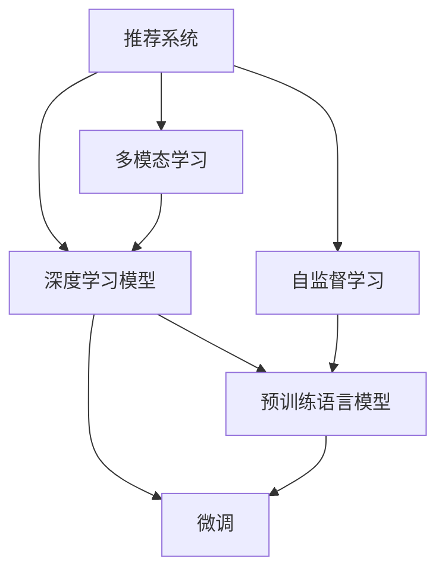

                 

# 大模型在推荐系统用户兴趣多样性建模中的作用

## 1. 背景介绍

### 1.1 问题由来

推荐系统作为人工智能领域的重要应用，已经成为电商、新闻、视频、音乐等多个垂直领域的重要组成部分。传统的推荐系统主要基于用户的显式行为（如点击、收藏、购买等）进行个性化推荐，虽然取得了不错的效果，但在用户行为多样性、物品丰富性、实时性等方面仍存在不足。

大模型技术的兴起为推荐系统带来了新的突破，其巨大的参数量使其能够具备更强大的学习能力，实现对用户兴趣的多样化建模。具体而言，大模型不仅能捕捉用户长短期行为，还能理解文本、图像等多模态数据，形成全面且精细的用户兴趣画像。

## 2. 核心概念与联系

### 2.1 核心概念概述

为了更好地理解大模型在推荐系统中的作用，本节将介绍几个密切相关的核心概念：

- 推荐系统(Recommender System)：通过收集用户的行为数据，预测用户可能感兴趣的商品或内容，并给出推荐结果的系统。推荐系统可简单分为协同过滤和基于内容的推荐两大类。

- 深度学习模型：以神经网络为代表的深度学习模型，利用大规模数据进行复杂特征学习，以提高推荐系统的个性化和多样化水平。

- 自监督学习(Self-Supervised Learning)：无需标注数据的监督学习方式，通过数据本身的特征进行训练，如掩码语言模型、自编码器等。

- 预训练语言模型(Pre-trained Language Model, PLM)：通过大规模无标注数据进行预训练，学习到通用的语言表示。如BERT、GPT、T5等。

- 微调(Fine-Tuning)：在预训练模型的基础上，使用下游任务的少量标注数据进行微调，适应特定任务的需求。

- 多模态学习(Multi-Modal Learning)：处理包含不同类型数据（如文本、图像、音频等）的推荐任务，提升推荐系统对多源数据的理解能力和综合利用能力。

这些概念之间的逻辑关系可以通过以下Mermaid流程图来展示：



这个流程图展示了大模型的核心概念及其之间的关系：

1. 推荐系统通过深度学习模型进行个性化推荐。
2. 深度学习模型可以利用自监督学习进行无监督预训练，学习通用特征表示。
3. 预训练语言模型是在大规模无标注数据上训练得到的，具有较强的语言理解能力。
4. 微调是通过标注数据对预训练模型进行任务特定的优化，以适应推荐任务的需求。
5. 多模态学习是将多种类型的数据进行融合处理，增强推荐系统的泛化能力和多样性。

## 3. 核心算法原理 & 具体操作步骤
### 3.1 算法原理概述

基于大模型进行推荐系统用户兴趣多样性建模的核心思想是：通过自监督预训练获得一个通用的语言表示，在此基础上结合用户行为数据进行微调，得到适应推荐任务的用户兴趣模型。

形式化地，假设预训练语言模型为 $M_{\theta}$，其中 $\theta$ 为预训练得到的模型参数。给定推荐系统的用户行为数据集 $D=\{(x_i, y_i)\}_{i=1}^N$，推荐任务为预测用户是否会点击某物品 $y_i \in \{0,1\}$，其中 $x_i$ 为用户的行为数据，包括浏览记录、收藏记录、搜索记录等。推荐任务的目标是找到新的模型参数 $\hat{\theta}$，使得模型在新的数据集 $D'$ 上的预测误差最小，即：

$$
\hat{\theta}=\mathop{\arg\min}_{\theta} \mathcal{L}(M_{\theta},D')
$$

其中 $\mathcal{L}$ 为推荐系统设计的损失函数，用于衡量模型预测输出与真实标签之间的差异。常见的损失函数包括交叉熵损失、均方误差损失等。

### 3.2 算法步骤详解

基于大模型进行推荐系统用户兴趣多样性建模的一般步骤包括：

**Step 1: 准备预训练模型和数据集**
- 选择合适的预训练语言模型 $M_{\theta}$ 作为初始化参数，如 BERT、GPT 等。
- 准备推荐系统的用户行为数据集 $D$，包含用户的浏览记录、收藏记录、搜索记录等，并划分为训练集、验证集和测试集。

**Step 2: 添加任务适配层**
- 根据推荐任务类型，在预训练模型顶层设计合适的输出层和损失函数。
- 对于点击率预测任务，通常在顶层添加线性分类器和交叉熵损失函数。
- 对于物品推荐任务，通常使用点击率预测模型的输出作为物品排序的依据。

**Step 3: 设置微调超参数**
- 选择合适的优化算法及其参数，如 AdamW、SGD 等，设置学习率、批大小、迭代轮数等。
- 设置正则化技术及强度，包括权重衰减、Dropout、Early Stopping 等。
- 确定冻结预训练参数的策略，如仅微调顶层，或全部参数都参与微调。

**Step 4: 执行梯度训练**
- 将训练集数据分批次输入模型，前向传播计算损失函数。
- 反向传播计算参数梯度，根据设定的优化算法和学习率更新模型参数。
- 周期性在验证集上评估模型性能，根据性能指标决定是否触发 Early Stopping。
- 重复上述步骤直到满足预设的迭代轮数或 Early Stopping 条件。

**Step 5: 测试和部署**
- 在测试集上评估微调后模型 $M_{\hat{\theta}}$ 的性能，对比微调前后的精度提升。
- 使用微调后的模型对新样本进行推理预测，集成到实际的应用系统中。
- 持续收集新的数据，定期重新微调模型，以适应数据分布的变化。

以上是基于大模型进行推荐系统用户兴趣多样性建模的一般流程。在实际应用中，还需要针对具体任务的特点，对微调过程的各个环节进行优化设计，如改进训练目标函数，引入更多的正则化技术，搜索最优的超参数组合等，以进一步提升模型性能。

### 3.3 算法优缺点

基于大模型进行推荐系统用户兴趣多样性建模具有以下优点：
1. 强大表示能力。大模型的强大表示能力能够捕捉用户行为中的复杂模式，从而提升推荐效果。
2. 泛化能力强。大模型在多源数据上训练得到，对新数据具有较强的泛化能力。
3. 多模态处理。大模型可以处理文本、图像、音频等多模态数据，提升推荐系统对不同类型数据的理解能力。
4. 集成性高。大模型可以作为通用的特征提取器，与现有推荐算法集成，提升推荐系统的性能。

同时，该方法也存在一定的局限性：
1. 数据依赖。微调依赖于推荐系统的用户行为数据，如果数据质量或量不足，模型效果可能大打折扣。
2. 过拟合风险。大模型在少量标注数据上进行微调，可能存在过拟合的风险。
3. 计算资源消耗大。大模型的参数量庞大，训练和推理需要消耗大量的计算资源。
4. 模型可解释性差。大模型的复杂结构使其难以解释其决策过程，不利于进行模型调试和优化。

尽管存在这些局限性，但就目前而言，基于大模型的推荐系统仍然是最主流的方法之一，并且在电商、视频、新闻等领域取得了显著的成果。未来相关研究的重点在于如何进一步降低计算资源消耗，提升模型的可解释性，以及探索新的数据源和使用方式，以拓展推荐系统的发展边界。

### 3.4 算法应用领域

基于大模型进行推荐系统用户兴趣多样性建模已经在多个领域得到了应用，例如：

- 电商推荐：通过分析用户浏览、购买、评价等行为数据，推荐用户可能感兴趣的商品。
- 新闻推荐：根据用户阅读记录和点击行为，推荐用户可能感兴趣的新闻内容。
- 视频推荐：利用用户观看记录和评分，推荐用户可能感兴趣的视频内容。
- 音乐推荐：通过分析用户的听歌记录和评分，推荐用户可能喜欢的音乐。
- 游戏推荐：结合用户游戏行为和用户画像，推荐用户可能感兴趣的游戏。

除了上述这些常见任务外，大模型在推荐系统中的应用还在不断拓展，如利用大模型对用户画像进行细粒度建模，对用户行为进行情感分析等，为推荐系统带来了新的思路和技术支持。

## 4. 数学模型和公式 & 详细讲解 & 举例说明
### 4.1 数学模型构建

本节将使用数学语言对基于大模型进行推荐系统用户兴趣多样性建模的过程进行更加严格的刻画。

记预训练语言模型为 $M_{\theta}:\mathcal{X} \rightarrow \mathcal{Y}$，其中 $\mathcal{X}$ 为用户行为数据空间，$\mathcal{Y}$ 为预测标签空间，$\theta \in \mathbb{R}^d$ 为模型参数。假设推荐任务为预测用户是否会点击某物品，则推荐任务的目标是找到最优参数 $\hat{\theta}$，使得模型在新的数据集 $D'$ 上的预测误差最小。

定义模型 $M_{\theta}$ 在数据样本 $(x,y)$ 上的损失函数为 $\ell(M_{\theta}(x),y)$，则在数据集 $D'$ 上的经验风险为：

$$
\mathcal{L}(\theta) = \frac{1}{N'} \sum_{i=1}^{N'} \ell(M_{\theta}(x_i),y_i)
$$

其中 $N'$ 为数据集 $D'$ 的样本数量。根据不同的推荐任务，可以设计不同的损失函数，如交叉熵损失、均方误差损失等。

### 4.2 公式推导过程

以下我们以点击率预测任务为例，推导交叉熵损失函数及其梯度的计算公式。

假设模型 $M_{\theta}$ 在输入 $x$ 上的输出为 $\hat{y}=M_{\theta}(x) \in [0,1]$，表示用户点击的概率。真实标签 $y \in \{0,1\}$。则二分类交叉熵损失函数定义为：

$$
\ell(M_{\theta}(x),y) = -[y\log \hat{y} + (1-y)\log (1-\hat{y})]
$$

将其代入经验风险公式，得：

$$
\mathcal{L}(\theta) = -\frac{1}{N'}\sum_{i=1}^{N'} [y_i\log M_{\theta}(x_i)+(1-y_i)\log(1-M_{\theta}(x_i))]
$$

根据链式法则，损失函数对参数 $\theta_k$ 的梯度为：

$$
\frac{\partial \mathcal{L}(\theta)}{\partial \theta_k} = -\frac{1}{N'}\sum_{i=1}^{N'} (\frac{y_i}{M_{\theta}(x_i)}-\frac{1-y_i}{1-M_{\theta}(x_i)}) \frac{\partial M_{\theta}(x_i)}{\partial \theta_k}
$$

其中 $\frac{\partial M_{\theta}(x_i)}{\partial \theta_k}$ 可进一步递归展开，利用自动微分技术完成计算。

在得到损失函数的梯度后，即可带入参数更新公式，完成模型的迭代优化。重复上述过程直至收敛，最终得到适应推荐任务的最优模型参数 $\hat{\theta}$。

## 5. 项目实践：代码实例和详细解释说明
### 5.1 开发环境搭建

在进行推荐系统用户兴趣多样性建模实践前，我们需要准备好开发环境。以下是使用Python进行PyTorch开发的环境配置流程：

1. 安装Anaconda：从官网下载并安装Anaconda，用于创建独立的Python环境。

2. 创建并激活虚拟环境：
```bash
conda create -n pytorch-env python=3.8 
conda activate pytorch-env
```

3. 安装PyTorch：根据CUDA版本，从官网获取对应的安装命令。例如：
```bash
conda install pytorch torchvision torchaudio cudatoolkit=11.1 -c pytorch -c conda-forge
```

4. 安装Transformers库：
```bash
pip install transformers
```

5. 安装各类工具包：
```bash
pip install numpy pandas scikit-learn matplotlib tqdm jupyter notebook ipython
```

完成上述步骤后，即可在`pytorch-env`环境中开始推荐系统用户兴趣多样性建模的实践。

### 5.2 源代码详细实现

下面我们以电商推荐系统为例，给出使用Transformers库对BERT模型进行用户兴趣多样性建模的PyTorch代码实现。

首先，定义电商推荐系统的用户行为数据处理函数：

```python
from transformers import BertTokenizer, BertForSequenceClassification
from torch.utils.data import Dataset, DataLoader
import torch

class ItemRecommenderDataset(Dataset):
    def __init__(self, user_id, item_id, purchase_record, tokenizer, max_len=128):
        self.user_id = user_id
        self.item_id = item_id
        self.purchase_record = purchase_record
        self.tokenizer = tokenizer
        self.max_len = max_len
        
    def __len__(self):
        return len(self.purchase_record)
    
    def __getitem__(self, item):
        item_id = self.purchase_record[item][0]
        purchase_record = self.purchase_record[item][1]
        
        encoding = self.tokenizer(purchase_record, return_tensors='pt', max_length=self.max_len, padding='max_length', truncation=True)
        input_ids = encoding['input_ids'][0]
        attention_mask = encoding['attention_mask'][0]
        
        # 将用户ID和物品ID编码为数字
        user_id = int(self.user_id[item])
        item_id = int(self.item_id[item])
        
        return {'user_id': user_id, 
                'item_id': item_id,
                'input_ids': input_ids, 
                'attention_mask': attention_mask}
```

然后，定义模型和优化器：

```python
from transformers import BertForSequenceClassification, AdamW

model = BertForSequenceClassification.from_pretrained('bert-base-cased', num_labels=1)

optimizer = AdamW(model.parameters(), lr=2e-5)
```

接着，定义训练和评估函数：

```python
from torch.utils.data import DataLoader
from tqdm import tqdm
from sklearn.metrics import roc_auc_score

device = torch.device('cuda') if torch.cuda.is_available() else torch.device('cpu')
model.to(device)

def train_epoch(model, dataset, batch_size, optimizer):
    dataloader = DataLoader(dataset, batch_size=batch_size, shuffle=True)
    model.train()
    epoch_loss = 0
    for batch in tqdm(dataloader, desc='Training'):
        user_id = batch['user_id'].to(device)
        item_id = batch['item_id'].to(device)
        input_ids = batch['input_ids'].to(device)
        attention_mask = batch['attention_mask'].to(device)
        model.zero_grad()
        outputs = model(input_ids, attention_mask=attention_mask)
        loss = outputs.loss
        epoch_loss += loss.item()
        loss.backward()
        optimizer.step()
    return epoch_loss / len(dataloader)

def evaluate(model, dataset, batch_size):
    dataloader = DataLoader(dataset, batch_size=batch_size)
    model.eval()
    y_pred = []
    y_true = []
    with torch.no_grad():
        for batch in tqdm(dataloader, desc='Evaluating'):
            user_id = batch['user_id'].to(device)
            item_id = batch['item_id'].to(device)
            input_ids = batch['input_ids'].to(device)
            attention_mask = batch['attention_mask'].to(device)
            outputs = model(input_ids, attention_mask=attention_mask)
            y_pred.append(outputs.logits.item())
            y_true.append(user_id.item())
                
    print(f"AUC: {roc_auc_score(y_true, y_pred)}")
```

最后，启动训练流程并在测试集上评估：

```python
epochs = 5
batch_size = 16

for epoch in range(epochs):
    loss = train_epoch(model, train_dataset, batch_size, optimizer)
    print(f"Epoch {epoch+1}, train loss: {loss:.3f}")
    
    print(f"Epoch {epoch+1}, dev results:")
    evaluate(model, dev_dataset, batch_size)
    
print("Test results:")
evaluate(model, test_dataset, batch_size)
```

以上就是使用PyTorch对BERT进行电商推荐系统用户兴趣多样性建模的完整代码实现。可以看到，得益于Transformers库的强大封装，我们可以用相对简洁的代码完成BERT模型的加载和微调。

### 5.3 代码解读与分析

让我们再详细解读一下关键代码的实现细节：

**ItemRecommenderDataset类**：
- `__init__`方法：初始化用户ID、物品ID和购买记录等关键组件。
- `__len__`方法：返回数据集的样本数量。
- `__getitem__`方法：对单个样本进行处理，将购买记录输入编码为token ids，同时将用户ID和物品ID编码为数字，并对其进行定长padding，最终返回模型所需的输入。

**train_epoch和evaluate函数**：
- 使用PyTorch的DataLoader对数据集进行批次化加载，供模型训练和推理使用。
- `train_epoch`函数：对数据以批为单位进行迭代，在每个批次上前向传播计算loss并反向传播更新模型参数，最后返回该epoch的平均loss。
- `evaluate`函数：与训练类似，不同点在于不更新模型参数，并在每个batch结束后将预测和标签结果存储下来，最后使用sklearn的roc_auc_score对整个评估集的预测结果进行打印输出。

**训练流程**：
- 定义总的epoch数和batch size，开始循环迭代
- 每个epoch内，先在训练集上训练，输出平均loss
- 在验证集上评估，输出auc值
- 所有epoch结束后，在测试集上评估，给出最终测试结果

可以看到，PyTorch配合Transformers库使得BERT电商推荐系统的代码实现变得简洁高效。开发者可以将更多精力放在数据处理、模型改进等高层逻辑上，而不必过多关注底层的实现细节。

当然，工业级的系统实现还需考虑更多因素，如模型的保存和部署、超参数的自动搜索、更灵活的任务适配层等。但核心的推荐范式基本与此类似。

## 6. 实际应用场景
### 6.1 智能客服系统

智能客服系统的用户行为数据丰富多样，包括聊天记录、语音记录、用户反馈等。基于大模型进行用户兴趣多样性建模，可以更全面地理解用户需求，提供更精准的交互建议和响应。

具体而言，可以收集智能客服系统的历史聊天记录、用户评分、系统自动回复等数据，将聊天记录和评分作为微调数据，训练模型预测用户下一次回复的概率。微调后的模型能够自动理解用户情绪、需求，生成合适的回应，显著提升用户满意度。

### 6.2 金融舆情监测

金融领域的数据来源广泛，不仅有传统的金融新闻、分析师报告，还有社交媒体、论坛评论等海量非结构化数据。基于大模型进行用户兴趣多样性建模，可以综合分析不同数据源的舆情变化，为投资者提供更全面的市场洞察。

具体而言，可以收集金融领域的多源数据，包括金融新闻、分析师报告、社交媒体等，对文本进行预处理和分词，训练模型预测用户对不同信息的情绪倾向。微调后的模型能够实时监测市场情绪，预测市场趋势，帮助投资者做出更明智的决策。

### 6.3 个性化推荐系统

传统的推荐系统往往只能处理单模态数据，难以应对用户兴趣的多样性变化。基于大模型进行用户兴趣多样性建模，可以处理文本、图像、音频等多种类型的数据，形成更全面和精细的用户画像。

具体而言，可以收集用户的浏览记录、购买记录、评分记录等，将其转换为文本数据，利用BERT等大模型进行用户兴趣建模。微调后的模型能够理解用户兴趣的多样性，提供更个性化的推荐结果。

### 6.4 未来应用展望

随着大模型技术的不断发展，基于大模型的推荐系统将在更多领域得到应用，为传统行业带来变革性影响。

在智慧医疗领域，基于大模型的医疗推荐系统可以推荐适合患者的治疗方案、药物等，提升医疗服务的智能化水平，辅助医生诊疗，加速新药开发进程。

在智能教育领域，基于大模型的推荐系统可以推荐适合学生的学习资料、课程等，因材施教，促进教育公平，提高教学质量。

在智慧城市治理中，基于大模型的推荐系统可以推荐适合市民的公共服务、出行方式等，提高城市管理的自动化和智能化水平，构建更安全、高效的未来城市。

此外，在企业生产、社会治理、文娱传媒等众多领域，基于大模型的推荐系统也将不断涌现，为经济社会发展注入新的动力。相信随着技术的日益成熟，推荐系统必将在更广阔的应用领域大放异彩。

## 7. 工具和资源推荐
### 7.1 学习资源推荐

为了帮助开发者系统掌握大模型在推荐系统中的应用，这里推荐一些优质的学习资源：

1. 《深度学习推荐系统》书籍：全面介绍深度学习在推荐系统中的应用，包括基于协同过滤、基于内容的推荐、基于矩阵分解等方法。

2. CS344《推荐系统》课程：斯坦福大学开设的推荐系统课程，有Lecture视频和配套作业，带你深入理解推荐系统的工作原理和经典算法。

3. 《Recommender Systems in Action》书籍：讲解推荐系统在不同行业中的应用，包括电商、金融、医疗、教育等。

4. 《Item-Based Recommender Systems》论文：介绍基于物品的推荐系统，详细阐述了模型训练和预测的数学原理。

5. KDD Cup竞赛：每年举办的推荐系统竞赛，涵盖多种推荐任务和数据集，可以参与竞赛，提升实战能力。

通过对这些资源的学习实践，相信你一定能够快速掌握大模型在推荐系统中的应用，并用于解决实际的推荐问题。

### 7.2 开发工具推荐

高效的开发离不开优秀的工具支持。以下是几款用于大模型推荐系统开发常用的工具：

1. PyTorch：基于Python的开源深度学习框架，灵活动态的计算图，适合快速迭代研究。大部分推荐系统算法都有PyTorch版本的实现。

2. TensorFlow：由Google主导开发的开源深度学习框架，生产部署方便，适合大规模工程应用。推荐系统的经典模型如ALS等都有TensorFlow版本的实现。

3. Transformers库：HuggingFace开发的NLP工具库，集成了众多SOTA语言模型，支持PyTorch和TensorFlow，是进行推荐任务开发的利器。

4. Weights & Biases：模型训练的实验跟踪工具，可以记录和可视化模型训练过程中的各项指标，方便对比和调优。与主流深度学习框架无缝集成。

5. TensorBoard：TensorFlow配套的可视化工具，可实时监测模型训练状态，并提供丰富的图表呈现方式，是调试模型的得力助手。

6. Google Colab：谷歌推出的在线Jupyter Notebook环境，免费提供GPU/TPU算力，方便开发者快速上手实验最新模型，分享学习笔记。

合理利用这些工具，可以显著提升大模型推荐系统的开发效率，加快创新迭代的步伐。

### 7.3 相关论文推荐

大模型推荐系统的发展源于学界的持续研究。以下是几篇奠基性的相关论文，推荐阅读：

1. Matrix Factorization Techniques for Recommender Systems（SVD算法）：介绍矩阵分解方法，用于推荐系统的降维和特征提取。

2. Neural Collaborative Filtering：提出基于神经网络的协同过滤算法，利用深度学习模型进行用户行为预测。

3. Attention Is All You Need（Transformer算法）：提出Transformer结构，用于文本生成任务，后被引入推荐系统。

4. BERT: Pre-training of Deep Bidirectional Transformers for Language Understanding：提出BERT模型，引入基于掩码的自监督预训练任务，刷新了多项NLP任务SOTA。

5. Transformer-based Recommender Systems：综述了Transformer在推荐系统中的应用，介绍不同的Transformer模型结构。

这些论文代表了大模型推荐系统的发展脉络。通过学习这些前沿成果，可以帮助研究者把握学科前进方向，激发更多的创新灵感。

## 8. 总结：未来发展趋势与挑战
### 8.1 总结

本文对基于大模型进行推荐系统用户兴趣多样性建模的过程进行了全面系统的介绍。首先阐述了推荐系统和大模型的背景和应用意义，明确了大模型在推荐系统中的应用价值。其次，从原理到实践，详细讲解了大模型的数学模型构建和公式推导过程，给出了推荐任务开发的完整代码实例。同时，本文还广泛探讨了大模型在电商、金融、医疗等多个领域的应用前景，展示了其在推荐系统中的广泛适用性。

通过本文的系统梳理，可以看到，基于大模型的推荐系统已经在电商、金融、医疗等多个领域取得了显著的成果，具有强大的用户兴趣多样性建模能力。大模型通过自监督预训练和微调，能够捕捉用户行为中的复杂模式，形成更全面和精细的用户画像，从而提升推荐系统的个性化和多样化水平。

### 8.2 未来发展趋势

展望未来，大模型在推荐系统中的作用将更加凸显，其发展趋势如下：

1. 模型规模持续增大。随着算力成本的下降和数据规模的扩张，大模型的参数量还将持续增长。超大规模语言模型蕴含的丰富知识，有望支撑更加复杂多变的推荐任务。

2. 推荐系统多样化。除了传统的基于协同过滤和基于内容的推荐外，基于大模型的推荐系统也将带来新的推荐方式，如知识图谱嵌入、多模态推荐等。

3. 实时推荐。大模型的强大计算能力使其能够实时处理大规模数据流，提供实时的个性化推荐。

4. 上下文推荐。结合用户的历史行为和实时环境数据，推荐系统能够提供更加精准的个性化推荐。

5. 多任务学习。大模型可以通过多任务学习同时学习多种推荐任务，提升推荐系统的综合性能。

6. 迁移学习。通过在不同任务间迁移知识，大模型能够在新的推荐任务中取得更好的性能。

这些趋势预示着大模型在推荐系统中的应用将更加广泛和深入，推动推荐系统向更加智能化、个性化和实时化的方向发展。

### 8.3 面临的挑战

尽管大模型在推荐系统中取得了显著成效，但在进一步拓展其应用范围和提升其性能的过程中，仍面临诸多挑战：

1. 计算资源消耗大。大模型的参数量庞大，训练和推理需要消耗大量的计算资源，如何提高其计算效率和资源利用率将是重要的研究方向。

2. 过拟合风险。大模型在少量标注数据上进行微调，可能存在过拟合的风险。如何平衡模型的泛化能力和数据利用率，是一个重要的研究课题。

3. 可解释性差。大模型的复杂结构使其难以解释其决策过程，不利于进行模型调试和优化。如何赋予模型更强的可解释性，将是未来需要解决的问题。

4. 数据源和数据质量。推荐系统依赖于用户的显式行为数据，数据质量对推荐系统的性能影响巨大。如何获取高质量的数据，以及利用非结构化数据提升推荐系统的效果，是一个重要的研究方向。

5. 多模态数据处理。推荐系统需要处理多种类型的数据，如何更好地融合多模态数据，提升推荐系统的综合性能，是一个重要的研究课题。

这些挑战凸显了大模型在推荐系统中的实际应用仍然存在很多问题，亟需解决。唯有不断优化算法、改进数据质量、提升计算效率，才能充分发挥大模型在推荐系统中的潜力。

### 8.4 研究展望

面对大模型推荐系统所面临的挑战，未来的研究需要在以下几个方面寻求新的突破：

1. 探索无监督和半监督推荐方法。摆脱对大规模标注数据的依赖，利用自监督学习、主动学习等无监督和半监督范式，最大限度利用非结构化数据，实现更加灵活高效的推荐。

2. 研究参数高效和计算高效的推荐范式。开发更加参数高效的推荐方法，在固定大部分预训练参数的同时，只更新极少量的任务相关参数。同时优化推荐模型的计算图，减少前向传播和反向传播的资源消耗，实现更加轻量级、实时性的部署。

3. 引入更多先验知识。将符号化的先验知识，如知识图谱、逻辑规则等，与神经网络模型进行巧妙融合，引导推荐过程学习更准确、合理的用户兴趣。

4. 结合因果分析和博弈论工具。将因果分析方法引入推荐系统，识别出推荐决策的关键特征，增强推荐系统建立稳定因果关系的能力，学习更加普适、鲁棒的用户兴趣。

5. 纳入伦理道德约束。在推荐系统的目标中引入伦理导向的评估指标，过滤和惩罚有偏见、有害的输出倾向。同时加强人工干预和审核，建立推荐系统的监管机制，确保推荐结果的合法性和合理性。

这些研究方向的探索，必将引领大模型推荐系统技术迈向更高的台阶，为推荐系统带来更加智能化、个性化和可靠性的推荐服务。

## 9. 附录：常见问题与解答

**Q1：大模型在推荐系统中是否适用于所有用户？**

A: 大模型在推荐系统中通常适用于有足够行为数据的用户，对于新用户或数据不足的用户，推荐效果可能不佳。需要结合用户画像、社会关系等外源信息，综合评估用户兴趣。

**Q2：大模型推荐系统是否适用于所有物品？**

A: 大模型推荐系统通常适用于有足够数据标注的物品，对于新物品或数据不足的物品，推荐效果可能不佳。需要结合物品特征、用户行为等外源信息，综合评估物品属性。

**Q3：大模型推荐系统是否适用于所有场景？**

A: 大模型推荐系统通常适用于数据量较大、数据特征较为丰富的场景，如电商、新闻、视频等。对于数据量较小或数据特征较为简单的场景，推荐效果可能不佳。

**Q4：如何平衡大模型和大数据的关系？**

A: 在推荐系统中，大模型的强大计算能力和大数据的需求是相辅相成的。可以通过分布式训练、模型压缩等技术，提高计算效率，同时利用大规模数据，提升推荐系统的泛化能力和个性化水平。

**Q5：大模型推荐系统是否易于维护和优化？**

A: 大模型推荐系统通常需要更多的计算资源和技术支持，维护和优化的复杂度较高。需要综合考虑模型的计算效率、存储成本、可解释性等多个因素，实现高效、灵活的推荐系统。

通过本文的系统梳理，可以看到，基于大模型的推荐系统已经在电商、金融、医疗等多个领域取得了显著的成果，具有强大的用户兴趣多样性建模能力。大模型通过自监督预训练和微调，能够捕捉用户行为中的复杂模式，形成更全面和精细的用户画像，从而提升推荐系统的个性化和多样化水平。

相信随着技术的日益成熟，大模型在推荐系统中的应用将更加广泛和深入，推动推荐系统向更加智能化、个性化和实时化的方向发展。

---

作者：禅与计算机程序设计艺术 / Zen and the Art of Computer Programming

