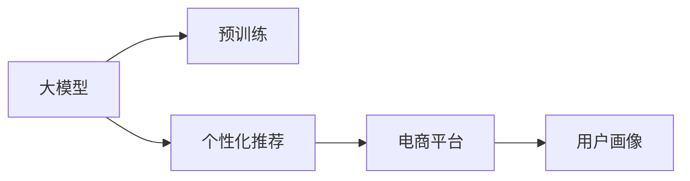

                 

# 大模型在电商平台个性化营销中的应用

## 1. 背景介绍

### 1.1 电商行业发展概况

在数字化浪潮的推动下，电商平台已经成为驱动消费的重要力量。随着网络购物习惯的普及和智能设备的普及，电商平台已经从单纯的交易平台演变为集信息传播、社交互动、个性化推荐等功能于一体的综合性平台。

近年来，电商平台在个性化推荐、内容营销、客户画像构建等方面进行了大量探索，逐渐形成了以用户行为和消费习惯为导向的营销模式。这种模式以用户的个性化需求为核心，通过精准的商品推荐、有吸引力的内容展示等方式提升用户体验，从而实现更高的转化率和客户满意度。

### 1.2 个性化推荐技术的引入

个性化推荐技术利用用户的历史行为数据和模型算法，为用户提供符合其兴趣和需求的个性化商品推荐。这种推荐方式通过挖掘用户兴趣模型，将用户与商品进行更精准的匹配，提升用户的购物体验，同时增加商家的销售额。

当前电商平台的个性化推荐系统主要基于协同过滤、基于内容的推荐、混合推荐等算法。尽管这些算法在数据量较少的情况下也能取得较好的效果，但随着用户和商品种类的不断增加，推荐系统面临越来越大的数据处理压力和计算复杂度。

### 1.3 大模型的引入

大模型技术，如Transformer、BERT、GPT等，已经在NLP、图像处理、语音识别等多个领域取得了突破性的进展。这些大模型通过预训练的方式，在大量的无标签数据上学习到复杂的语言和视觉特征表示，能够在多种任务上实现超越人类的性能。

在电商平台个性化推荐中，大模型也能够通过预训练的方式，学习到用户的购买习惯、偏好和行为模式。这些预训练得到的特征表示可以用于构建更加精细化的用户画像，从而实现更精准的个性化推荐。

## 2. 核心概念与联系

### 2.1 核心概念概述

为了更好地理解大模型在电商个性化营销中的应用，本节将介绍几个关键概念：

- **大模型(-large model)**：以Transformer、BERT、GPT等结构为代表的大规模预训练模型。通过在大规模无标签数据上进行预训练，学习到复杂的语言或视觉特征表示，具备强大的数据建模能力。
- **预训练(pre-training)**：指在大规模无标签数据上，通过自监督学习任务训练通用模型的方法。常见的预训练任务包括语言建模、视觉特征提取等。
- **个性化推荐(personalized recommendation)**：根据用户的历史行为和偏好，为用户提供符合其需求的商品推荐。通过精细化的用户画像和深度学习模型实现。
- **电商平台(e-commerce platform)**：提供在线商品展示、交易、客户服务等功能的一站式购物平台。通过个性化推荐等技术提升用户体验和转化率。
- **用户画像(user profile)**：通过分析用户的历史行为和偏好，构建用户兴趣模型，为用户提供个性化推荐和内容展示。

这些概念通过以下Mermaid流程图进行联系展示：



大模型通过预训练学习到复杂的特征表示，应用于电商平台时，通过精细化的用户画像构建和个性化推荐模型，实现用户需求的精准匹配。

## 3. 核心算法原理 & 具体操作步骤

### 3.1 算法原理概述

大模型在电商平台个性化营销中的应用，主要涉及以下三个步骤：

1. **大模型预训练**：利用大规模无标签数据对大模型进行预训练，学习到通用的语言或视觉特征表示。
2. **用户画像构建**：根据用户的历史行为和偏好，使用大模型进行特征提取，构建精细化的用户画像。
3. **个性化推荐**：结合用户画像和商品特征，使用大模型进行推荐预测，生成符合用户需求的个性化商品推荐。

### 3.2 算法步骤详解

#### 3.2.1 大模型预训练

- **数据准备**：收集电商平台上的大量商品描述、用户评论、行为数据等，作为无标签数据进行预训练。
- **模型选择**：选择适合的预训练模型，如BERT、GPT等，利用其自监督学习任务进行预训练。
- **训练流程**：在预训练阶段，模型学习到语言或视觉特征的通用表示，可用于多种任务。

#### 3.2.2 用户画像构建

- **数据收集**：收集用户的历史浏览记录、购买记录、评分反馈等数据，作为用户画像的输入。
- **特征提取**：使用大模型对用户画像数据进行特征提取，生成高维度的用户兴趣表示。
- **画像更新**：根据用户实时行为数据，动态更新用户画像，确保模型输出的及时性和准确性。

#### 3.2.3 个性化推荐

- **商品特征提取**：对商品进行特征提取，生成高维度的商品表示。
- **推荐模型构建**：构建基于大模型的推荐模型，如基于注意力机制的推荐系统，利用用户画像和商品特征进行推荐预测。
- **推荐生成**：根据用户画像和商品特征，生成个性化商品推荐，推送给用户。

### 3.3 算法优缺点

#### 3.3.1 优点

- **高准确性**：大模型通过大量数据进行预训练，具备强大的特征提取能力，能够准确捕捉用户和商品的特征。
- **高效性**：利用大模型的预训练特征，可以大幅减少推荐系统的计算量和存储需求。
- **灵活性**：大模型可以应用于多种任务，如情感分析、意图识别等，拓展了个性化推荐的应用场景。

#### 3.3.2 缺点

- **高资源需求**：大模型需要大量计算资源进行预训练，且模型参数量较大，难以在小型电商平台上部署。
- **数据隐私问题**：用户行为数据的收集和处理涉及隐私问题，需要遵守数据保护法律法规。
- **模型解释性不足**：大模型作为“黑盒”模型，难以解释其内部决策逻辑，可能影响用户信任。

### 3.4 算法应用领域

#### 3.4.1 推荐系统

大模型在推荐系统中的应用最为广泛，通过预训练得到的特征表示，可以用于构建更加精细化的用户画像和推荐模型，实现更精准的个性化推荐。

#### 3.4.2 内容生成

电商平台利用大模型生成有吸引力的内容，如商品描述、广告语等，提升用户点击率和购买转化率。

#### 3.4.3 客户服务

大模型可以应用于客服聊天机器人，根据用户的问题进行自动回答，提升客户服务效率和满意度。

#### 3.4.4 风险控制

大模型可以帮助电商平台进行欺诈检测、信用评分等风险控制，保护用户和商家利益。

## 4. 数学模型和公式 & 详细讲解 & 举例说明

### 4.1 数学模型构建

本节将以BERT模型为例，介绍大模型在电商平台个性化营销中的应用。

#### 4.1.1 预训练模型

BERT模型的预训练过程包括以下两个阶段：

1. **Masked Language Model(MLM)**：将输入文本中的某些词进行掩码处理，让模型预测被掩码的词，学习到词与词之间的关系。
2. **Next Sentence Prediction(NSP)**：将两个句子作为输入，让模型判断这两个句子是否连续，学习到句与句之间的关系。

#### 4.1.2 推荐模型

推荐模型可以使用基于大模型的回归模型或分类模型，其中比较常用的是Transformer模型。推荐模型的输入包括用户画像和商品特征，输出为推荐结果的概率分布。

### 4.2 公式推导过程

#### 4.2.1 BERT预训练公式

BERT模型的预训练公式为：

$$
\text{MLM}_{loss} = -\frac{1}{N}\sum_{i=1}^N \log p(x_i|x_{<i}, x_{>i})
$$

其中，$x_{<i}$ 表示掩码词之前的文本，$x_{>i}$ 表示掩码词之后的文本，$p$ 为概率分布函数。

#### 4.2.2 推荐模型公式

假设推荐模型使用基于Transformer的回归模型，输入为 $x_{user}$ 和 $x_{item}$，输出为推荐概率 $p_{item|user}$。推荐模型的公式为：

$$
p_{item|user} = \frac{e^{\text{dot}(W_u \cdot x_{user}, W_v \cdot x_{item})}{\sum_{j=1}^M e^{\text{dot}(W_j \cdot x_{item})}}
$$

其中，$W_u$ 和 $W_v$ 为用户的特征向量和商品的特征向量，$\text{dot}$ 为点乘运算。

### 4.3 案例分析与讲解

#### 4.3.1 BERT预训练案例

假设我们有一个电商平台，收集了大量的商品描述和用户评论数据，用于训练BERT模型。我们可以将每条评论的前半部分进行掩码处理，让模型预测被掩码的词，学习到商品描述中的关键词。同时，将用户评论中的句子进行NSP训练，学习到评论的语义关系。

#### 4.3.2 推荐模型案例

基于预训练得到的用户画像和商品特征，我们可以构建推荐模型。假设我们有一个用户画像，表示用户的兴趣偏好为“运动鞋”、“篮球”、“户外”等。我们收集了市场上所有商品的特征向量，包括价格、品牌、评价等。将这些特征向量输入推荐模型，生成推荐概率，找到最符合用户需求的商品推荐结果。

## 5. 项目实践：代码实例和详细解释说明

### 5.1 开发环境搭建

在进行大模型在电商平台个性化营销的应用实践前，我们需要准备好开发环境。以下是使用Python进行TensorFlow开发的环境配置流程：

1. 安装Anaconda：从官网下载并安装Anaconda，用于创建独立的Python环境。

2. 创建并激活虚拟环境：
```bash
conda create -n tf-env python=3.8 
conda activate tf-env
```

3. 安装TensorFlow：根据CUDA版本，从官网获取对应的安装命令。例如：
```bash
conda install tensorflow tensorflow-gpu=2.5 -c pytorch -c conda-forge
```

4. 安装Keras：
```bash
pip install keras
```

5. 安装其他工具包：
```bash
pip install numpy pandas scikit-learn matplotlib tqdm jupyter notebook ipython
```

完成上述步骤后，即可在`tf-env`环境中开始项目实践。

### 5.2 源代码详细实现

下面以使用BERT模型在电商平台上构建推荐系统为例，给出详细的代码实现。

#### 5.2.1 BERT模型预训练

```python
import tensorflow as tf
from transformers import BertTokenizer, TFBertForMaskedLM, BertTokenizerFast

# 加载预训练模型
tokenizer = BertTokenizerFast.from_pretrained('bert-base-uncased')
model = TFBertForMaskedLM.from_pretrained('bert-base-uncased')

# 准备数据
input_ids = tokenizer.encode("This is a BERT pre-training example.", return_tensors="tf")
masked_token_index = [tokenizer.convert_tokens_to_ids(word) for word in ["BERT", "pre-training"]]
labels = tf.fill([1, 2], tokenizer.convert_tokens_to_ids("BERT"))
masked_token_index = tf.convert_to_tensor(masked_token_index, dtype=tf.int32)

# 执行预训练
with tf.GradientTape() as tape:
    outputs = model(input_ids)
    loss = outputs.loss
    grads = tape.gradient(loss, model.trainable_variables)
    optimizer.apply_gradients(zip(grads, model.trainable_variables))
```

#### 5.2.2 推荐模型构建

```python
from transformers import TFBertModel, BertTokenizerFast

# 加载预训练模型
tokenizer = BertTokenizerFast.from_pretrained('bert-base-uncased')
model = TFBertModel.from_pretrained('bert-base-uncased')

# 准备数据
user_profile = tokenizer.encode("I love sports shoes and outdoor activities.")
item_features = tokenizer.encode("Nike Air Max 2021")
user_profile = tf.convert_to_tensor(user_profile, dtype=tf.int32)
item_features = tf.convert_to_tensor(item_features, dtype=tf.int32)

# 执行推荐
output = model(user_profile)
similarity = tf.math.reduce_sum(tf.multiply(output, item_features))
probability = tf.nn.softmax(similarity)

# 打印推荐结果
print("推荐商品的概率：", probability)
```

### 5.3 代码解读与分析

让我们再详细解读一下关键代码的实现细节：

#### 5.3.1 BERT预训练代码

```python
# 加载预训练模型
tokenizer = BertTokenizerFast.from_pretrained('bert-base-uncased')
model = TFBertForMaskedLM.from_pretrained('bert-base-uncased')
```

这里我们使用预训练的BERT模型进行加载。加载模型时，指定模型架构和预训练权重路径。

```python
# 准备数据
input_ids = tokenizer.encode("This is a BERT pre-training example.", return_tensors="tf")
masked_token_index = [tokenizer.convert_tokens_to_ids(word) for word in ["BERT", "pre-training"]]
labels = tf.fill([1, 2], tokenizer.convert_tokens_to_ids("BERT"))
masked_token_index = tf.convert_to_tensor(masked_token_index, dtype=tf.int32)
```

这里我们使用tokenizer将输入文本转换为模型所需的token ids，并设置了掩码位置和标签。

```python
# 执行预训练
with tf.GradientTape() as tape:
    outputs = model(input_ids)
    loss = outputs.loss
    grads = tape.gradient(loss, model.trainable_variables)
    optimizer.apply_gradients(zip(grads, model.trainable_variables))
```

这里我们使用GradientTape记录梯度，使用optimizer更新模型参数。

#### 5.3.2 推荐模型代码

```python
# 加载预训练模型
tokenizer = BertTokenizerFast.from_pretrained('bert-base-uncased')
model = TFBertModel.from_pretrained('bert-base-uncased')
```

这里同样使用预训练的BERT模型进行加载。

```python
# 准备数据
user_profile = tokenizer.encode("I love sports shoes and outdoor activities.")
item_features = tokenizer.encode("Nike Air Max 2021")
user_profile = tf.convert_to_tensor(user_profile, dtype=tf.int32)
item_features = tf.convert_to_tensor(item_features, dtype=tf.int32)
```

这里我们使用tokenizer将用户画像和商品特征转换为token ids。

```python
# 执行推荐
output = model(user_profile)
similarity = tf.math.reduce_sum(tf.multiply(output, item_features))
probability = tf.nn.softmax(similarity)

# 打印推荐结果
print("推荐商品的概率：", probability)
```

这里我们使用BERT模型对用户画像和商品特征进行相似度计算，并生成推荐概率。

### 5.4 运行结果展示

通过上述代码，我们可以得到推荐商品的概率。这些概率代表了用户对不同商品的兴趣程度，电商平台可以根据这些概率进行个性化推荐。

## 6. 实际应用场景

### 6.1 用户画像构建

电商平台可以通过用户画像构建，了解用户的兴趣和行为模式，从而实现更精准的个性化推荐。例如，用户A购买了多个户外装备，浏览了多个户外品牌商品，用户画像可能被表示为：

- 兴趣：户外装备、徒步鞋、露营装备
- 行为：购买、浏览、评分
- 历史记录：N次购买，多次浏览

### 6.2 商品推荐

基于用户画像和商品特征，电商平台可以生成推荐商品列表。例如，对于用户A，其推荐商品可能包括：

- 商品1：户外徒步鞋
- 商品2：户外露营帐篷
- 商品3：徒步背包

这些推荐商品是根据用户A的兴趣和行为模式生成的，可以大幅提升用户的购买转化率。

### 6.3 实时推荐

电商平台可以通过实时数据更新用户画像，生成实时推荐结果。例如，用户A购买了商品1，并浏览了相关商品，电商平台可以实时更新用户画像，生成新的推荐商品列表。

## 7. 工具和资源推荐

### 7.1 学习资源推荐

为了帮助开发者系统掌握大模型在电商平台个性化营销中的应用，这里推荐一些优质的学习资源：

1. 《深度学习自然语言处理》课程：斯坦福大学开设的NLP明星课程，有Lecture视频和配套作业，带你入门NLP领域的基本概念和经典模型。

2. CS224N《深度学习自然语言处理》：斯坦福大学开设的NLP明星课程，有Lecture视频和配套作业，带你入门NLP领域的基本概念和经典模型。

3. 《Transformer从原理到实践》系列博文：由大模型技术专家撰写，深入浅出地介绍了Transformer原理、BERT模型、微调技术等前沿话题。

4. 《Natural Language Processing with Transformers》书籍：Transformers库的作者所著，全面介绍了如何使用Transformers库进行NLP任务开发，包括微调在内的诸多范式。

5. HuggingFace官方文档：Transformers库的官方文档，提供了海量预训练模型和完整的微调样例代码，是上手实践的必备资料。

通过对这些资源的学习实践，相信你一定能够快速掌握大模型在电商平台个性化营销中的应用精髓，并用于解决实际的NLP问题。

### 7.2 开发工具推荐

高效的开发离不开优秀的工具支持。以下是几款用于大模型在电商平台个性化营销开发常用的工具：

1. TensorFlow：基于Python的开源深度学习框架，生产部署方便，适合大规模工程应用。

2. PyTorch：基于Python的开源深度学习框架，灵活动态的计算图，适合快速迭代研究。

3. Keras：高层API，易于上手，适合快速构建推荐模型。

4. Weights & Biases：模型训练的实验跟踪工具，可以记录和可视化模型训练过程中的各项指标，方便对比和调优。

5. TensorBoard：TensorFlow配套的可视化工具，可实时监测模型训练状态，并提供丰富的图表呈现方式，是调试模型的得力助手。

6. Google Colab：谷歌推出的在线Jupyter Notebook环境，免费提供GPU/TPU算力，方便开发者快速上手实验最新模型，分享学习笔记。

合理利用这些工具，可以显著提升大模型在电商平台个性化营销应用的开发效率，加快创新迭代的步伐。

### 7.3 相关论文推荐

大模型和个性化推荐技术的发展源于学界的持续研究。以下是几篇奠基性的相关论文，推荐阅读：

1. Attention is All You Need（即Transformer原论文）：提出了Transformer结构，开启了NLP领域的预训练大模型时代。

2. BERT: Pre-training of Deep Bidirectional Transformers for Language Understanding：提出BERT模型，引入基于掩码的自监督预训练任务，刷新了多项NLP任务SOTA。

3. Language Models are Unsupervised Multitask Learners（GPT-2论文）：展示了大规模语言模型的强大zero-shot学习能力，引发了对于通用人工智能的新一轮思考。

4. Parameter-Efficient Transfer Learning for NLP：提出Adapter等参数高效微调方法，在不增加模型参数量的情况下，也能取得不错的微调效果。

5. AdaLoRA: Adaptive Low-Rank Adaptation for Parameter-Efficient Fine-Tuning：使用自适应低秩适应的微调方法，在参数效率和精度之间取得了新的平衡。

这些论文代表了大模型和推荐技术的进展，通过学习这些前沿成果，可以帮助研究者把握学科前进方向，激发更多的创新灵感。

## 8. 总结：未来发展趋势与挑战

### 8.1 总结

本文对大模型在电商平台个性化营销中的应用进行了全面系统的介绍。首先阐述了电商行业的发展概况和个性化推荐技术的引入，明确了大模型在电商推荐系统中的应用价值。其次，从原理到实践，详细讲解了大模型预训练、用户画像构建和个性化推荐模型的构建过程，给出了推荐系统的代码实现。最后，本文还探讨了个性化推荐在大模型应用中的未来趋势和面临的挑战。

通过本文的系统梳理，可以看到，大模型在电商平台个性化营销中的应用，通过预训练学习和精细化的用户画像构建，能够实现更精准的个性化推荐。这种推荐方式可以提升用户购物体验，增加商家销售额，具有广阔的应用前景。未来，随着大模型和推荐技术的不断进步，电商推荐系统必将在个性化推荐方面取得更大的突破。

### 8.2 未来发展趋势

展望未来，大模型在电商平台个性化营销中的应用将呈现以下几个发展趋势：

1. **多模态融合**：未来的推荐系统将不仅仅局限于文本数据，而是融合视觉、语音等多模态数据，提升推荐的准确性和多样性。

2. **模型压缩与优化**：随着大规模电商平台的推广，对推荐模型的计算和存储资源的需求将不断增加。如何通过模型压缩、稀疏化等技术，优化模型结构和推理速度，是一个重要的研究方向。

3. **模型解释性增强**：大模型作为“黑盒”模型，难以解释其内部决策逻辑。增强模型的解释性，提升用户信任和满意度，是未来重要的研究方向。

4. **隐私保护与安全**：随着用户数据的收集和处理，数据隐私和安全性问题愈发重要。如何在保障用户隐私的前提下，提升推荐系统的效果，是一个亟待解决的挑战。

5. **实时推荐与动态调整**：实时推荐可以提升用户体验，但实时数据的处理和分析也是一个重要的研究方向。如何通过高效的算法和硬件设备，实现实时推荐和动态调整，是一个重要的方向。

6. **跨平台应用**：未来大模型将在更多平台上得到应用，如社交媒体、智能家居等，提升跨平台的推荐效果和用户体验。

以上趋势凸显了大模型在电商平台个性化营销应用的广阔前景。这些方向的探索发展，必将进一步提升电商推荐系统的性能和应用范围，为电商平台的运营带来新的突破。

### 8.3 面临的挑战

尽管大模型在电商平台个性化营销中的应用已经取得了一定进展，但在迈向更加智能化、普适化应用的过程中，仍然面临诸多挑战：

1. **数据质量和多样性**：电商推荐系统需要大量的用户行为数据，但数据质量和多样性往往不足，导致模型效果不稳定。如何提升数据质量，增加数据多样性，是一个重要的挑战。

2. **模型复杂度**：大规模模型的训练和推理复杂度高，对计算资源和存储空间的需求大。如何在资源受限的情况下，实现高效推荐，是一个重要的研究方向。

3. **用户隐私保护**：电商推荐系统涉及大量的用户隐私数据，如何保护用户隐私，同时提升推荐效果，是一个重要的研究方向。

4. **模型解释性不足**：大模型作为“黑盒”模型，难以解释其内部决策逻辑。增强模型的解释性，提升用户信任和满意度，是未来重要的研究方向。

5. **模型鲁棒性**：电商推荐系统面临复杂多变的用户行为，如何提高模型的鲁棒性，避免模型对异常数据的过度拟合，是一个重要的研究方向。

6. **实时性要求**：实时推荐可以提升用户体验，但实时数据的处理和分析也是一个重要的研究方向。如何通过高效的算法和硬件设备，实现实时推荐和动态调整，是一个重要的方向。

7. **跨平台应用**：未来大模型将在更多平台上得到应用，如社交媒体、智能家居等，提升跨平台的推荐效果和用户体验。

这些挑战需要我们从数据、模型、算法等多个维度进行协同攻关，才能实现大模型在电商平台个性化营销中的理想应用。

### 8.4 研究展望

面对大模型在电商平台个性化营销中所面临的挑战，未来的研究需要在以下几个方面寻求新的突破：

1. **数据增强与数据融合**：通过数据增强和融合技术，提升数据质量和多样性，增强推荐系统的鲁棒性和泛化能力。

2. **模型压缩与优化**：开发更加高效的模型压缩和优化方法，实现模型结构的简化和推理速度的提升。

3. **模型解释性与可解释性**：通过引入可解释性增强技术，提升模型的解释性和可解释性，增强用户信任和满意度。

4. **隐私保护与安全**：研究隐私保护和安全技术，保障用户隐私和数据安全，同时提升推荐效果。

5. **实时推荐与动态调整**：研究高效的数据处理和实时推荐算法，提升推荐系统的实时性和动态性，提升用户体验。

6. **跨平台应用**：研究跨平台推荐系统，实现多平台数据的统一和协调，提升跨平台的推荐效果和用户体验。

这些研究方向将推动大模型在电商平台个性化营销中实现更高的性能和更好的用户体验，为电商平台的运营带来新的突破。相信随着学界和产业界的共同努力，大模型在电商平台个性化营销中的应用必将在未来取得更大的进展。

## 9. 附录：常见问题与解答

**Q1：电商推荐系统是如何实现个性化推荐的？**

A: 电商推荐系统通过用户画像和商品特征，使用大模型进行推荐预测。具体步骤如下：

1. **数据收集**：收集用户的历史浏览记录、购买记录、评分反馈等数据，构建用户画像。
2. **特征提取**：使用大模型对用户画像和商品特征进行特征提取，生成高维度的用户兴趣表示。
3. **推荐模型构建**：构建基于大模型的推荐模型，如基于注意力机制的推荐系统。
4. **推荐生成**：根据用户画像和商品特征，生成推荐结果的概率分布，生成个性化商品推荐。

**Q2：大模型在电商推荐系统中的训练过程是怎样的？**

A: 大模型在电商推荐系统中的训练过程包括以下几个步骤：

1. **数据准备**：收集电商平台上的商品描述、用户评论、行为数据等，作为无标签数据进行预训练。
2. **模型选择**：选择适合的预训练模型，如BERT、GPT等，利用其自监督学习任务进行预训练。
3. **训练流程**：在预训练阶段，模型学习到语言或视觉特征的通用表示，可用于多种任务。

**Q3：如何提高电商推荐系统的实时性？**

A: 电商推荐系统的实时性可以通过以下方式提升：

1. **实时数据采集**：利用流式数据采集技术，实时获取用户行为数据，更新用户画像。
2. **模型压缩与优化**：通过模型压缩、稀疏化等技术，优化模型结构和推理速度，实现实时推荐。
3. **分布式计算**：采用分布式计算架构，提升计算资源利用率，实现高效推荐。

**Q4：如何保护用户隐私？**

A: 电商推荐系统在保护用户隐私方面可以采取以下措施：

1. **匿名化处理**：在数据收集和处理过程中，对用户数据进行匿名化处理，保障用户隐私。
2. **数据加密**：对用户数据进行加密处理，防止数据泄露。
3. **合规性审查**：在数据处理过程中，遵守数据保护法律法规，保护用户隐私。

**Q5：大模型在电商推荐系统中如何实现跨平台应用？**

A: 大模型在电商推荐系统中实现跨平台应用可以通过以下方式：

1. **模型迁移**：将电商推荐系统中的大模型迁移到其他平台，如社交媒体、智能家居等，提升跨平台的推荐效果。
2. **数据共享**：通过数据共享机制，实现不同平台之间的数据协调和统一，提升跨平台的推荐效果。
3. **接口标准化**：制定统一的API接口标准，实现不同平台之间的数据交互和推荐结果共享。

通过这些措施，可以实现大模型在电商推荐系统中的跨平台应用，提升推荐系统的跨平台效果和用户体验。

---

作者：禅与计算机程序设计艺术 / Zen and the Art of Computer Programming

