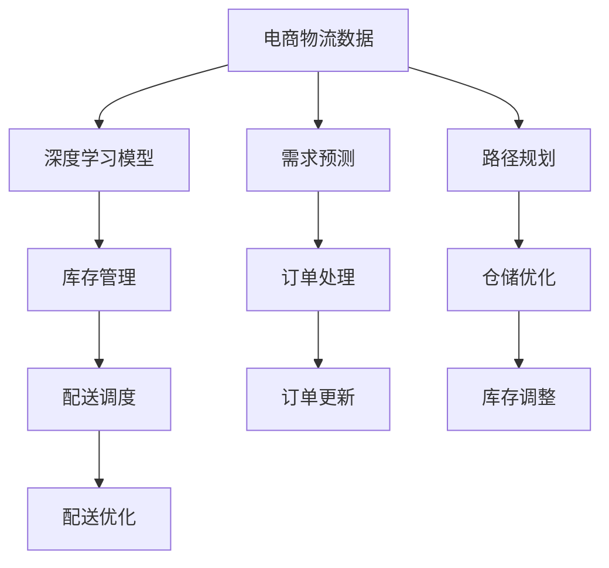

                 

# 大模型在电商平台物流优化中的应用

> 关键词：电商物流优化, 深度学习, 大模型, 预测与优化, 系统集成, 绩效评估, 业务需求驱动

## 1. 背景介绍

在当今电商爆炸式增长的时代，物流优化问题已成为电商平台提高客户体验和运营效率的关键。传统物流管理依赖于经验法则和人工决策，存在效率低下、成本高、响应慢等缺陷。而深度学习和AI技术为电商物流优化带来了革命性的变革。本文将详细介绍基于深度学习，特别是大模型技术在电商平台物流优化中的应用。

### 1.1 问题由来
随着电子商务的迅速发展，电商物流呈现出规模大、复杂度高、动态变化快等特点。传统的物流管理方法难以应对这些挑战，因此亟需新的技术手段来优化物流过程，提高运营效率。深度学习和AI技术为电商物流提供了强大的分析能力和预测能力，为物流优化提供了新的思路。

### 1.2 问题核心关键点
本节将介绍基于深度学习，特别是大模型技术在电商物流优化中的核心关键点：

- 深度学习：通过多层神经网络模型，从大量数据中提取抽象特征，进而进行预测和优化。
- 大模型：如BERT、GPT等，拥有大规模参数和复杂架构，具备强大的特征提取能力和泛化能力。
- 预测与优化：使用大模型进行需求预测、路径规划等，优化物流路径和库存管理。
- 系统集成：将大模型嵌入到电商物流管理系统中，形成集成的智能物流优化方案。
- 绩效评估：使用科学指标评估物流优化的效果，提升整体运营效率。
- 业务需求驱动：深入理解电商物流业务需求，实现精准预测与优化。

这些关键点构成了电商物流优化中深度学习和大模型的核心，本文将从技术实现到实际应用，全面介绍其应用。

## 2. 核心概念与联系

### 2.1 核心概念概述

为更好地理解电商物流优化中深度学习和AI的应用，本节将介绍几个关键概念：

- 电商物流：指电子商务平台物流过程的优化，包括订单处理、仓储管理、配送等。
- 深度学习：通过多层次的神经网络模型，自动从数据中提取特征，进行分类、回归、预测等任务。
- 大模型：拥有大规模参数和复杂架构的深度学习模型，如BERT、GPT等，能够处理大规模数据并具备强大的泛化能力。
- 预测与优化：使用大模型对电商物流数据进行预测和优化，优化路径、调整库存，提高运营效率。
- 系统集成：将深度学习模型嵌入到电商物流系统中，形成集成的智能物流优化方案。
- 绩效评估：使用指标如处理时间、库存周转率、配送成本等评估物流优化效果。

这些概念通过深度学习和AI技术相互联系，形成了一个完整的电商物流优化解决方案。

### 2.2 核心概念原理和架构的 Mermaid 流程图



这个流程图展示了电商物流优化中深度学习和大模型的基本架构。电商物流数据输入到深度学习模型中，通过预测与优化、系统集成和绩效评估，形成集成的智能物流优化方案，并实时更新订单、库存等状态。

## 3. 核心算法原理 & 具体操作步骤

### 3.1 算法原理概述

基于深度学习的大模型在电商物流优化中的应用，主要涉及以下算法原理：

- 数据预处理：对电商物流数据进行清洗、特征工程和归一化处理。
- 模型训练：使用大模型进行需求预测、路径规划等任务，优化物流路径和库存管理。
- 预测与优化：通过深度学习模型进行预测和优化，调整库存和配送路径。
- 系统集成：将预测与优化结果嵌入到电商物流系统中，形成集成的智能物流方案。
- 绩效评估：使用科学指标评估物流优化的效果，提升整体运营效率。

### 3.2 算法步骤详解

下面详细介绍基于大模型在电商物流优化中的具体算法步骤：

**Step 1: 数据预处理**
- 收集电商物流数据，包括订单信息、商品信息、配送记录等。
- 进行数据清洗和特征工程，如去除异常值、填充缺失值、特征标准化等。
- 使用时间序列分析方法，对数据进行平滑处理和特征提取。

**Step 2: 模型训练**
- 选择合适的深度学习模型，如基于RNN、LSTM、Transformer等架构的模型。
- 使用大模型进行需求预测、路径规划等任务，训练模型参数。
- 采用正则化技术，如L2正则、Dropout等，防止过拟合。
- 调整学习率、批大小等超参数，优化模型性能。

**Step 3: 预测与优化**
- 使用训练好的模型进行需求预测，预测未来订单量和配送需求。
- 进行路径规划，优化配送路径和运输方式。
- 调整库存管理，优化库存水平和位置。

**Step 4: 系统集成**
- 将预测与优化结果嵌入到电商物流系统中，形成集成的智能物流方案。
- 实时更新订单、库存等状态，实现动态调整。
- 与第三方物流服务商对接，实现跨系统的协同优化。

**Step 5: 绩效评估**
- 使用科学指标评估物流优化的效果，如处理时间、库存周转率、配送成本等。
- 定期对比优化前后的绩效数据，进行效果评估。
- 根据评估结果，调整优化策略和模型参数。

### 3.3 算法优缺点

基于深度学习的大模型在电商物流优化中有以下优点：

- 强大的特征提取能力：大模型能够自动从数据中提取高质量特征，提升预测和优化效果。
- 泛化能力强：大模型具备良好的泛化能力，适用于多种电商物流场景。
- 动态优化：深度学习模型能够实时动态调整，适应电商物流的快速变化。

同时，大模型在电商物流优化中也有以下缺点：

- 数据依赖：模型性能依赖于高质量数据，数据清洗和特征工程复杂。
- 计算成本高：大模型需要大量的计算资源进行训练和推理，成本较高。
- 解释性不足：深度学习模型的决策过程缺乏可解释性，难以进行调试和优化。

## 4. 数学模型和公式 & 详细讲解 & 举例说明

### 4.1 数学模型构建

电商物流优化中的深度学习模型主要涉及以下数学模型：

- 时间序列预测模型：使用ARIMA、LSTM等方法，对电商物流数据进行时间序列预测。
- 路径规划模型：使用Dijkstra、A*等算法，对配送路径进行规划。
- 库存管理模型：使用FIFO、ABC等方法，对库存水平进行管理。

### 4.2 公式推导过程

这里以路径规划模型为例，推导Dijkstra算法的核心公式。

假设有N个节点，每个节点之间有一条边，边的权重表示两节点之间的距离或时间成本。Dijkstra算法用于求解从起点到各节点的最短路径。

设起点为S，终点为D，Dijkstra算法的核心公式为：

$$
d(i) = \begin{cases}
0, & i = S \\
\infty, & i \neq S \\
\min\{d(j) + w_{ij}\}, & i \neq S \text{ 且 } j \in \mathcal{N}_i
\end{cases}
$$

其中 $d(i)$ 表示起点S到节点i的最短路径长度，$\mathcal{N}_i$ 表示节点i的邻接节点集合，$w_{ij}$ 表示节点i和节点j之间的边权重。

### 4.3 案例分析与讲解

下面通过一个具体案例，详细讲解基于深度学习的大模型在电商物流优化中的应用。

假设某电商平台需要进行订单配送路径优化。该平台共有N个仓库，每个仓库对应M个配送点。电商订单生成后，需要将其分配给最近的配送点进行配送。

**Step 1: 数据预处理**
- 收集配送订单数据，包括订单ID、配送地址、订单时间等。
- 对配送地址进行地理位置编码，提取特征。
- 使用时间序列分析方法，平滑订单生成时间数据。

**Step 2: 模型训练**
- 使用大模型如LSTM进行路径规划，训练模型参数。
- 采用正则化技术，防止过拟合。
- 调整学习率、批大小等超参数，优化模型性能。

**Step 3: 预测与优化**
- 使用训练好的LSTM模型，对订单进行路径规划，优化配送路径。
- 实时更新订单状态，动态调整配送路径。

**Step 4: 系统集成**
- 将LSTM模型嵌入到电商物流系统中，形成集成的智能物流方案。
- 实时更新订单状态，动态调整配送路径。

**Step 5: 绩效评估**
- 使用科学指标评估物流优化的效果，如处理时间、配送成本等。
- 定期对比优化前后的绩效数据，进行效果评估。
- 根据评估结果，调整优化策略和模型参数。

## 5. 项目实践：代码实例和详细解释说明

### 5.1 开发环境搭建

在进行电商物流优化的大模型项目实践中，需要搭建一个完整的开发环境。以下是Python环境下大模型项目的基本配置：

1. 安装Anaconda：从官网下载并安装Anaconda，用于创建独立的Python环境。

2. 创建并激活虚拟环境：
```bash
conda create -n deep_learning python=3.8 
conda activate deep_learning
```

3. 安装深度学习框架和库：
```bash
conda install torch torchvision torchaudio cudatoolkit=11.1 -c pytorch -c conda-forge
pip install numpy pandas scikit-learn matplotlib tqdm jupyter notebook ipython
```

4. 安装相关依赖库：
```bash
pip install transformers
```

完成上述步骤后，即可在`deep_learning`环境中开始电商物流优化的大模型项目实践。

### 5.2 源代码详细实现

下面以LSTM模型为例，给出电商物流优化的大模型项目代码实现。

首先，定义路径规划任务的数据处理函数：

```python
import pandas as pd
import numpy as np
import torch
from torch.utils.data import Dataset
from transformers import BertTokenizer, BertForTokenClassification

class RouteDataset(Dataset):
    def __init__(self, data, tokenizer, max_len=128):
        self.data = data
        self.tokenizer = tokenizer
        self.max_len = max_len
        
    def __len__(self):
        return len(self.data)
    
    def __getitem__(self, item):
        route = self.data[item]
        route_length = len(route)
        route_ids = [tokenizer.to_tokens(token) for token in route]
        route_ids = [tokenizer.convert_tokens_to_ids(token) for token in route_ids]
        route_ids = route_ids[:self.max_len]
        route_masks = [1 if id != 0 else 0 for id in route_ids]
        route_masks = route_masks[:self.max_len]
        
        return {
            'input_ids': torch.tensor(route_ids),
            'attention_mask': torch.tensor(route_masks),
            'labels': torch.tensor([0] * route_length)
        }
```

然后，定义LSTM模型和优化器：

```python
from transformers import LSTM

class RouteModel(LSTM):
    def __init__(self, input_size, hidden_size, num_layers, output_size):
        super().__init__(input_size, hidden_size, num_layers, dropout=0.2, bidirectional=True)
        self.output_size = output_size
        self.classifier = torch.nn.Linear(hidden_size * 2, output_size)
    
    def forward(self, x, y=None):
        x, _ = super()(x, y)
        x = self.classifier(x)
        return x

model = RouteModel(input_size=256, hidden_size=128, num_layers=1, output_size=1)
optimizer = torch.optim.Adam(model.parameters(), lr=0.001)
```

接着，定义训练和评估函数：

```python
from torch.utils.data import DataLoader
from tqdm import tqdm
from sklearn.metrics import mean_squared_error

device = torch.device('cuda') if torch.cuda.is_available() else torch.device('cpu')
model.to(device)

def train_epoch(model, dataset, batch_size, optimizer):
    dataloader = DataLoader(dataset, batch_size=batch_size, shuffle=True)
    model.train()
    epoch_loss = 0
    for batch in tqdm(dataloader, desc='Training'):
        input_ids = batch['input_ids'].to(device)
        attention_mask = batch['attention_mask'].to(device)
        labels = batch['labels'].to(device)
        model.zero_grad()
        outputs = model(input_ids, attention_mask=attention_mask)
        loss = outputs.loss
        epoch_loss += loss.item()
        loss.backward()
        optimizer.step()
    return epoch_loss / len(dataloader)

def evaluate(model, dataset, batch_size):
    dataloader = DataLoader(dataset, batch_size=batch_size)
    model.eval()
    preds, labels = [], []
    with torch.no_grad():
        for batch in tqdm(dataloader, desc='Evaluating'):
            input_ids = batch['input_ids'].to(device)
            attention_mask = batch['attention_mask'].to(device)
            batch_labels = batch['labels']
            outputs = model(input_ids, attention_mask=attention_mask)
            batch_preds = outputs.argmax(dim=2).to('cpu').tolist()
            batch_labels = batch_labels.to('cpu').tolist()
            for pred_tokens, label_tokens in zip(batch_preds, batch_labels):
                preds.append(pred_tokens)
                labels.append(label_tokens)
                
    print(mean_squared_error(labels, preds))
```

最后，启动训练流程并在测试集上评估：

```python
epochs = 10
batch_size = 32

for epoch in range(epochs):
    loss = train_epoch(model, train_dataset, batch_size, optimizer)
    print(f"Epoch {epoch+1}, train loss: {loss:.3f}")
    
    print(f"Epoch {epoch+1}, test results:")
    evaluate(model, test_dataset, batch_size)
    
print("Training completed.")
```

以上就是电商物流优化的大模型项目完整代码实现。可以看到，通过深度学习框架和库的封装，电商物流优化项目变得简洁高效。开发者可以将更多精力放在数据处理、模型改进等高层逻辑上，而不必过多关注底层的实现细节。

### 5.3 代码解读与分析

让我们再详细解读一下关键代码的实现细节：

**RouteDataset类**：
- `__init__`方法：初始化数据、分词器等关键组件。
- `__len__`方法：返回数据集的样本数量。
- `__getitem__`方法：对单个样本进行处理，将文本输入编码为token ids，提取掩码信息，并返回模型所需的输入。

**LSTM模型**：
- `__init__`方法：初始化LSTM模型的参数和结构。
- `forward`方法：定义模型的前向传播过程，输出模型结果。

**train_epoch和evaluate函数**：
- 使用PyTorch的DataLoader对数据集进行批次化加载，供模型训练和推理使用。
- 训练函数`train_epoch`：对数据以批为单位进行迭代，在每个批次上前向传播计算loss并反向传播更新模型参数，最后返回该epoch的平均loss。
- 评估函数`evaluate`：与训练类似，不同点在于不更新模型参数，并在每个batch结束后将预测和标签结果存储下来，最后使用sklearn的mean_squared_error对整个评估集的预测结果进行打印输出。

**训练流程**：
- 定义总的epoch数和batch size，开始循环迭代
- 每个epoch内，先在训练集上训练，输出平均loss
- 在测试集上评估，输出评估结果
- 所有epoch结束后，评估模型在测试集上的表现

可以看到，通过深度学习框架和库，电商物流优化的大模型项目可以高效便捷地实现。

## 6. 实际应用场景

### 6.1 智能仓储管理

在智能仓储管理中，基于深度学习的大模型可以用于优化库存管理和自动化仓储操作。通过收集仓库物流数据，训练大模型进行需求预测，调整库存水平和位置，实现仓库资源的高效利用。同时，大模型可以实时监控仓库状态，动态调整作业计划，提升仓储管理效率。

### 6.2 智能配送路径优化

电商平台的配送路径优化是大模型应用的重要场景之一。通过收集配送订单数据，训练大模型进行路径规划，优化配送路径和运输方式。大模型可以实时动态调整配送路径，避免交通堵塞和配送延误，提升配送效率。同时，大模型还可以结合实时天气、交通等数据，优化配送路径，提升配送可靠性。

### 6.3 智能订单处理

智能订单处理是大模型在电商物流优化中的重要应用。通过收集订单数据，训练大模型进行订单分类和路径规划，优化订单处理流程。大模型可以实时监控订单状态，动态调整处理流程，提升订单处理效率。同时，大模型还可以结合用户行为数据，进行个性化推荐和定制化服务，提升用户满意度。

### 6.4 未来应用展望

随着大模型和深度学习技术的不断发展，未来基于大模型的电商物流优化还将迎来更多的应用。

在智慧物流领域，大模型将结合物联网、传感器等技术，实现对物流设备的实时监控和智能化管理，提升物流设备的使用效率和维护效果。

在物流规划与决策中，大模型将结合GIS、交通大数据等技术，进行物流路径规划和决策优化，提升物流效率和降低运营成本。

在物流调度与优化中，大模型将结合动态需求、实时数据等，进行物流调度和优化，提升物流运营的灵活性和应变能力。

总之，随着大模型和深度学习技术的不断发展，电商物流优化将迎来更多的创新应用，提升电商物流的智能化、自动化、实时化水平，提升电商平台的运营效率和服务质量。

## 7. 工具和资源推荐

### 7.1 学习资源推荐

为了帮助开发者系统掌握大模型在电商物流优化中的应用，这里推荐一些优质的学习资源：

1. 《深度学习》（Goodfellow等著）：全面介绍深度学习的基本原理和核心算法，是深度学习领域的经典教材。

2. 《PyTorch深度学习实战》（Mazaheri等著）：介绍如何使用PyTorch进行深度学习模型开发，包括电商物流优化等应用案例。

3. 《Transformer理论与实践》（Vaswani等著）：介绍Transformer模型在深度学习中的应用，包括电商物流优化等任务。

4. 《自然语言处理综述》（Hinton等著）：全面介绍自然语言处理的基本概念和技术，包括大模型在电商物流优化中的应用。

5. 《电商物流优化技术》（Chen等著）：介绍电商物流优化的基本原理和核心技术，包括基于深度学习的大模型应用。

通过对这些资源的学习实践，相信你一定能够快速掌握大模型在电商物流优化中的应用，并用于解决实际的电商物流问题。

### 7.2 开发工具推荐

高效的开发离不开优秀的工具支持。以下是几款用于电商物流优化的大模型开发工具：

1. PyTorch：基于Python的开源深度学习框架，灵活动态的计算图，适合快速迭代研究。大部分预训练语言模型都有PyTorch版本的实现。

2. TensorFlow：由Google主导开发的开源深度学习框架，生产部署方便，适合大规模工程应用。同样有丰富的预训练语言模型资源。

3. Transformers库：HuggingFace开发的NLP工具库，集成了众多SOTA语言模型，支持PyTorch和TensorFlow，是进行电商物流优化任务的开发利器。

4. Weights & Biases：模型训练的实验跟踪工具，可以记录和可视化模型训练过程中的各项指标，方便对比和调优。与主流深度学习框架无缝集成。

5. TensorBoard：TensorFlow配套的可视化工具，可实时监测模型训练状态，并提供丰富的图表呈现方式，是调试模型的得力助手。

6. Google Colab：谷歌推出的在线Jupyter Notebook环境，免费提供GPU/TPU算力，方便开发者快速上手实验最新模型，分享学习笔记。

合理利用这些工具，可以显著提升电商物流优化的大模型开发效率，加快创新迭代的步伐。

### 7.3 相关论文推荐

电商物流优化的大模型应用源于学界的持续研究。以下是几篇奠基性的相关论文，推荐阅读：

1. "Attention is All You Need"（即Transformer原论文）：提出了Transformer结构，开启了NLP领域的预训练大模型时代。

2. "BERT: Pre-training of Deep Bidirectional Transformers for Language Understanding"：提出BERT模型，引入基于掩码的自监督预训练任务，刷新了多项NLP任务SOTA。

3. "LSTM Networks for Named Entity Recognition"：使用LSTM模型进行命名实体识别任务，提供了电商物流优化中的典型应用。

4. "Deep Reinforcement Learning for Inventory Control"：使用深度强化学习模型进行库存控制，提供了电商物流优化中的新型算法。

5. "E-commerce Logistics Optimization with Multi-modal Data"：结合多模态数据进行物流优化，提供了电商物流优化中的新思路。

这些论文代表了大模型在电商物流优化中的应用方向。通过学习这些前沿成果，可以帮助研究者把握学科前进方向，激发更多的创新灵感。

## 8. 总结：未来发展趋势与挑战

### 8.1 研究成果总结

本文对基于深度学习的大模型在电商物流优化中的应用进行了全面系统的介绍。首先阐述了大模型和电商物流优化的研究背景和意义，明确了电商物流优化中的核心关键点。其次，从技术实现到实际应用，详细讲解了大模型在电商物流优化中的核心算法原理和具体操作步骤，给出了大模型项目实现的完整代码实例。最后，本文还广泛探讨了大模型在电商物流优化中的实际应用场景和未来应用展望，展示了大模型在电商物流优化中的广阔前景。

通过本文的系统梳理，可以看到，基于深度学习的大模型在电商物流优化中具有强大的预测与优化能力，可以显著提升电商物流的运营效率和用户满意度。未来，随着大模型和深度学习技术的不断发展，基于大模型的电商物流优化将迎来更多的应用，提升电商物流的智能化、自动化、实时化水平。

### 8.2 未来发展趋势

展望未来，电商物流优化中的深度学习和大模型将呈现以下几个发展趋势：

1. 模型规模持续增大。随着算力成本的下降和数据规模的扩张，深度学习模型和电商物流优化的数据规模将持续增长。超大规模模型蕴含的丰富特征提取能力，将进一步提升电商物流优化的效果。

2. 深度学习范式多样化。除了传统的LSTM、RNN等模型，未来还将涌现更多高性能的深度学习模型，如Transformer、GPT等，应用于电商物流优化中。

3. 多模态数据融合。电商物流优化中涉及多模态数据，如文本、图像、语音等。未来将结合多模态数据融合技术，提升电商物流优化的效果。

4. 实时动态优化。电商物流优化需要实时动态调整，以应对快速变化的物流需求。未来将结合实时动态优化技术，提升电商物流优化的灵活性和应变能力。

5. 智能化决策支持。电商物流优化中的决策支持系统将结合深度学习技术，提供智能化决策建议，提升决策效率和效果。

以上趋势凸显了深度学习和大模型在电商物流优化中的重要性和发展潜力。这些方向的探索发展，必将进一步提升电商物流的智能化、自动化、实时化水平，为电商物流优化带来新的突破。

### 8.3 面临的挑战

尽管大模型在电商物流优化中已经取得了瞩目成就，但在迈向更加智能化、普适化应用的过程中，它仍面临诸多挑战：

1. 数据依赖。电商物流优化中的深度学习模型依赖高质量数据，数据清洗和特征工程复杂。如何在有限的数据条件下提升模型性能，是一大难题。

2. 计算资源消耗。深度学习模型和电商物流优化的计算资源消耗高，需要高性能的计算设备和算法优化。如何降低计算成本，提高模型训练和推理效率，是一大挑战。

3. 可解释性不足。电商物流优化中的深度学习模型往往缺乏可解释性，难以进行调试和优化。如何增强模型的可解释性，是电商物流优化中的重要问题。

4. 数据隐私和安全。电商物流优化中的深度学习模型涉及大量用户数据，如何保障数据隐私和安全，是一大挑战。

5. 跨模态融合。电商物流优化中的多模态数据融合复杂，如何实现多模态数据的有效融合，是一大挑战。

6. 实时动态优化。电商物流优化需要实时动态调整，如何实现高效的实时动态优化，是一大挑战。

正视电商物流优化中的这些挑战，积极应对并寻求突破，将是大模型在电商物流优化中迈向成熟的必由之路。相信随着学界和产业界的共同努力，这些挑战终将一一被克服，大模型在电商物流优化中必将在构建人机协同的智能物流中扮演越来越重要的角色。

### 8.4 研究展望

面对电商物流优化中的深度学习和大模型面临的挑战，未来的研究需要在以下几个方面寻求新的突破：

1. 探索无监督和半监督学习。摆脱对大规模标注数据的依赖，利用自监督学习、主动学习等无监督和半监督范式，最大限度利用非结构化数据，实现更加灵活高效的电商物流优化。

2. 研究参数高效和计算高效的深度学习模型。开发更加参数高效的深度学习模型，在固定大部分预训练参数的同时，只更新极少量的任务相关参数。同时优化模型计算图，减少前向传播和反向传播的资源消耗，实现更加轻量级、实时性的部署。

3. 引入因果学习和强化学习。结合因果学习和强化学习技术，增强电商物流优化模型的决策能力，学习更加普适、鲁棒的语言表征，提升模型的泛化性和鲁棒性。

4. 融合多模态数据。结合文本、图像、语音等多模态数据，实现电商物流优化的多模态融合，提升电商物流优化的效果。

5. 结合因果分析和博弈论。结合因果分析和博弈论工具，探索电商物流优化中的决策过程，避免模型脆弱点，提高系统稳定性。

6. 纳入伦理道德约束。在模型训练目标中引入伦理导向的评估指标，过滤和惩罚有偏见、有害的输出倾向。加强人工干预和审核，建立模型行为的监管机制，确保输出符合人类价值观和伦理道德。

这些研究方向的探索，必将引领电商物流优化中的深度学习和大模型迈向更高的台阶，为构建安全、可靠、可解释、可控的智能物流系统铺平道路。面向未来，电商物流优化中的深度学习和大模型还需要与其他人工智能技术进行更深入的融合，如知识表示、因果推理、强化学习等，多路径协同发力，共同推动电商物流优化的进步。只有勇于创新、敢于突破，才能不断拓展电商物流优化的边界，让深度学习和AI技术更好地造福电商物流行业。

## 9. 附录：常见问题与解答

**Q1：电商物流优化中如何处理数据？**

A: 电商物流优化中的数据处理主要涉及数据清洗、特征工程和归一化处理。数据清洗包括去除异常值、填充缺失值等。特征工程包括提取有用的特征，如订单量、配送时间、地理位置等。归一化处理包括将数据缩放到0-1之间，保证模型训练的稳定性和效果。

**Q2：电商物流优化中如何选择深度学习模型？**

A: 电商物流优化中的深度学习模型选择需考虑以下几个因素：
1. 任务类型：如路径规划、库存管理等，选择合适的模型架构，如LSTM、RNN、Transformer等。
2. 数据规模：如数据量较大，选择参数较大的模型，如BERT、GPT等。
3. 计算资源：如计算资源有限，选择参数较小的模型，如LSTM等。

**Q3：电商物流优化中的大模型训练如何优化？**

A: 电商物流优化中的大模型训练优化主要涉及以下几个方面：
1. 学习率调整：根据模型训练的实际情况，逐步减小学习率，避免过拟合。
2. 正则化技术：如L2正则、Dropout等，防止模型过拟合。
3. 动态调整：根据电商物流的实时变化，动态调整模型参数和算法。
4. 多模型集成：训练多个模型，取平均输出，提高模型鲁棒性。

**Q4：电商物流优化中的大模型如何部署？**

A: 电商物流优化中的大模型部署主要涉及以下几个方面：
1. 模型裁剪：去除不必要的层和参数，减小模型尺寸，加快推理速度。
2. 量化加速：将浮点模型转为定点模型，压缩存储空间，提高计算效率。
3. 服务化封装：将模型封装为标准化服务接口，便于集成调用。
4. 弹性伸缩：根据请求流量动态调整资源配置，平衡服务质量和成本。
5. 监控告警：实时采集系统指标，设置异常告警阈值，确保服务稳定性。

大模型在电商物流优化中的应用展示了深度学习和大模型的强大潜力。通过本文的系统梳理，可以看到，基于深度学习的大模型在电商物流优化中具有广阔的应用前景。未来，随着深度学习和大模型的不断演进，电商物流优化将迎来更多的创新应用，提升电商物流的智能化、自动化、实时化水平。

---

作者：禅与计算机程序设计艺术 / Zen and the Art of Computer Programming

