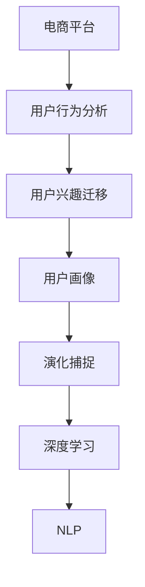

                 

# 大模型在电商平台用户兴趣迁移与演化捕捉中的应用

> 关键词：电商平台、用户行为分析、兴趣迁移、用户画像、演化捕捉、深度学习、自然语言处理(NLP)

## 1. 背景介绍

### 1.1 问题由来
随着电子商务的迅猛发展，电商平台的用户群体日益庞大，用户行为日趋复杂多变。如何精准刻画用户画像，预测用户兴趣的迁移和演化趋势，是电商平台提升用户体验和营销效果的关键问题。传统的统计分析方法难以刻画用户行为的非线性特征，且难以应对海量数据带来的挑战。基于深度学习的大模型方法以其强大的表征能力和自适应学习能力，为解决这些问题提供了新的视角和手段。

### 1.2 问题核心关键点
本文聚焦于使用大模型对电商平台用户兴趣的迁移与演化进行捕捉和刻画。具体而言，我们利用深度学习模型，通过用户行为数据训练得到用户兴趣的动态表示，进而预测用户兴趣的迁移路径和演化趋势，为用户提供个性化的推荐和营销服务。

## 2. 核心概念与联系

### 2.1 核心概念概述

为更好地理解大模型在电商平台用户兴趣迁移与演化捕捉中的应用，本节将介绍几个关键概念：

- 电商平台：指借助互联网进行商品交易和服务的虚拟市场平台，包括但不限于淘宝、京东、亚马逊等。
- 用户行为分析：指通过数据分析和机器学习技术，从用户的浏览、购买、评价等行为数据中，挖掘用户兴趣、需求和偏好。
- 用户兴趣迁移：指用户兴趣和偏好在不同时间、场景下的动态变化，如由运动类商品转为美妆类商品。
- 用户画像：指基于用户行为数据，通过机器学习建模得到用户兴趣、需求和偏好的综合表示。
- 演化捕捉：指利用深度学习模型，捕捉用户兴趣随时间变化的动态特征，预测其未来趋势。
- 深度学习：指通过多层神经网络构建的模型，能够自动学习并捕捉数据中的复杂非线性关系。
- 自然语言处理(NLP)：指利用计算机处理、理解、生成自然语言的技术，常用于用户评论、商品描述等文本数据的分析。

这些核心概念之间的逻辑关系可以通过以下Mermaid流程图来展示：



这个流程图展示了从电商平台到深度学习模型之间，用户行为分析、兴趣迁移、用户画像、演化捕捉等概念的逻辑联系。

## 3. 核心算法原理 & 具体操作步骤
### 3.1 算法原理概述

基于深度学习的大模型方法，主要通过以下步骤对电商平台用户兴趣进行迁移与演化捕捉：

1. **数据收集**：从电商平台的各类数据源（如日志、评论、浏览行为等）中，收集用户行为数据。
2. **数据预处理**：对收集到的数据进行清洗、归一化、特征提取等预处理操作，生成可用于训练的特征向量。
3. **模型训练**：使用深度学习模型（如Transformer、BERT等），通过用户行为数据训练得到用户兴趣的动态表示。
4. **兴趣迁移预测**：利用训练好的模型，预测用户在不同时间点的兴趣迁移路径。
5. **兴趣演化预测**：通过捕捉用户兴趣随时间的变化特征，预测用户未来的兴趣演化趋势。
6. **应用优化**：将预测结果应用于推荐系统、广告投放等场景，提升用户体验和营销效果。

### 3.2 算法步骤详解

#### 3.2.1 数据收集

电商平台的数据来源多样，包括用户登录日志、浏览记录、购买行为、评价信息等。具体数据收集步骤如下：

1. **日志数据收集**：
   - 使用网络爬虫从电商平台抓取登录日志，获取用户的登录时间、访问路径等信息。
   - 将登录日志数据清洗、解析，提取用户的行为特征。

2. **浏览记录收集**：
   - 通过API接口获取用户的浏览记录，包括浏览的商品ID、浏览时间、停留时长等。
   - 对浏览记录进行归一化、去重等预处理操作，生成特征向量。

3. **购买行为收集**：
   - 从电商平台数据库中获取用户的购买记录，包括购买时间、商品ID、购买金额等。
   - 对购买行为数据进行清洗、汇总，生成特征向量。

4. **评价信息收集**：
   - 通过API接口获取用户的评价信息，包括评价文本、评分等。
   - 对评价信息进行分词、向量化处理，生成特征向量。

#### 3.2.2 数据预处理

在收集到原始数据后，需要对数据进行预处理，以生成可用于模型训练的特征向量。具体步骤包括：

1. **特征提取**：
   - 对于文本数据，使用NLP技术进行分词、去停用词、词干提取等操作，得到特征向量。
   - 对于数值数据，进行归一化、标准化处理，防止数据偏移。

2. **特征选择**：
   - 根据业务需求和模型性能，选择最相关的特征。
   - 去除噪声、冗余特征，提升模型的泛化能力。

3. **特征转换**：
   - 对特征进行向量化、降维处理，生成低维特征向量。
   - 使用主成分分析（PCA）、t-SNE等技术，可视化特征空间。

#### 3.2.3 模型训练

在预处理完成后，可以使用深度学习模型进行训练，以得到用户兴趣的动态表示。具体步骤如下：

1. **选择模型架构**：
   - 根据任务特点和数据规模，选择合适的模型架构，如Transformer、BERT等。
   - 定义模型的输入输出层，设置隐藏层数、节点数等超参数。

2. **数据划分**：
   - 将数据划分为训练集、验证集和测试集。
   - 采用交叉验证等技术，防止过拟合。

3. **模型训练**：
   - 使用训练集数据进行模型训练，通过前向传播计算损失函数。
   - 使用梯度下降等优化算法，反向传播更新模型参数。
   - 在验证集上评估模型性能，调整超参数，避免过拟合。

4. **模型保存**：
   - 将训练好的模型保存到本地或云存储，便于后续调用。

#### 3.2.4 兴趣迁移预测

在模型训练完成后，可以使用训练好的模型对用户兴趣进行迁移预测。具体步骤如下：

1. **输入数据预处理**：
   - 对当前用户的行为数据进行预处理，生成特征向量。
   - 将用户兴趣表示作为输入，进行预测。

2. **迁移路径预测**：
   - 利用训练好的模型，预测用户兴趣在不同时间点的迁移路径。
   - 生成用户兴趣的时间序列，捕捉用户兴趣的变化趋势。

3. **路径优化**：
   - 通过路径平滑、路径选择等技术，优化预测路径，提高预测精度。

#### 3.2.5 兴趣演化预测

在捕捉到用户兴趣随时间的变化特征后，可以进一步预测用户未来的兴趣演化趋势。具体步骤如下：

1. **时间序列建模**：
   - 使用时间序列分析技术，捕捉用户兴趣随时间的变化规律。
   - 构建时间序列模型，如ARIMA、LSTM等，捕捉用户兴趣的演化趋势。

2. **趋势预测**：
   - 利用模型预测用户未来的兴趣演化路径。
   - 生成用户兴趣的演化轨迹，指导推荐系统、广告投放等场景。

### 3.3 算法优缺点

基于深度学习的大模型方法，具有以下优点：

1. **强大的表征能力**：能够自动学习并捕捉数据中的复杂非线性关系，有效处理多维度、高维度的数据。
2. **自适应学习能力**：能够根据用户行为数据自适应地调整模型参数，捕捉用户兴趣的变化趋势。
3. **泛化能力强**：能够在大规模数据上训练，具有较好的泛化能力和迁移能力，适应不同的应用场景。

同时，该方法也存在以下缺点：

1. **数据依赖性强**：模型性能高度依赖于数据质量，数据缺失或不完整会影响模型效果。
2. **计算资源消耗大**：深度学习模型需要大量的计算资源和存储空间，对硬件要求较高。
3. **模型复杂度高**：模型结构复杂，调试和维护成本较高，需要较强的技术储备。
4. **可解释性不足**：深度学习模型通常是"黑盒"系统，难以解释其内部工作机制和决策逻辑。

尽管存在这些缺点，但就目前而言，基于深度学习的大模型方法仍然是电商平台用户兴趣迁移与演化捕捉的主流技术。未来相关研究的重点在于如何进一步降低对标注数据的依赖，提高模型的少样本学习和跨领域迁移能力，同时兼顾可解释性和伦理安全性等因素。

### 3.4 算法应用领域

基于深度学习的大模型方法，已经在电商平台用户兴趣迁移与演化捕捉领域得到了广泛应用，覆盖了如下几个核心应用：

1. **个性化推荐**：利用用户兴趣迁移路径和演化趋势，生成个性化推荐结果，提升用户体验和满意度。
2. **广告投放优化**：根据用户兴趣演化路径，优化广告投放策略，提高广告转化率和ROI。
3. **商品营销分析**：分析用户兴趣迁移和演化趋势，预测商品市场变化，指导商品营销策略。
4. **客户关系管理**：捕捉用户兴趣变化，建立用户画像，实现精准营销和客户维护。
5. **库存管理优化**：预测用户兴趣趋势，优化库存管理策略，避免商品积压和缺货。

这些应用不仅提升了电商平台的运营效率，还显著改善了用户体验，推动了电商平台的数字化转型。

## 4. 数学模型和公式 & 详细讲解  
### 4.1 数学模型构建

假设电商平台用户的历史行为数据为 $D=\{(x_i, y_i)\}_{i=1}^N$，其中 $x_i$ 为历史行为数据，$y_i$ 为用户兴趣标签。设用户兴趣表示为 $v \in \mathbb{R}^d$，用户兴趣迁移路径为 $\Gamma = \{x_0, x_1, \ldots, x_t, \ldots\}$，用户兴趣演化轨迹为 $V = \{v_0, v_1, \ldots, v_t, \ldots\}$。

定义用户兴趣迁移预测模型为 $F$，用户兴趣演化预测模型为 $G$，则模型训练的目标函数为：

$$
\min_{\theta} \mathcal{L}(F, G; D) = \sum_{i=1}^N \ell(F(x_i), y_i) + \lambda \sum_{i=1}^N \ell(G(v_i), y_i)
$$

其中 $\ell$ 为损失函数，$\lambda$ 为正则化系数，控制演化预测模型的权重。

### 4.2 公式推导过程

以用户兴趣迁移预测为例，推导迁移路径预测的数学模型。

假设用户兴趣表示 $v \in \mathbb{R}^d$，迁移路径为 $\Gamma = \{x_0, x_1, \ldots, x_t, \ldots\}$，迁移路径长度为 $T$。定义迁移预测模型为 $F$，则迁移预测的目标函数为：

$$
\min_{\theta} \mathcal{L}(F; \Gamma) = \sum_{t=0}^{T-1} \ell(F(x_t), x_{t+1})
$$

其中 $x_{t+1}$ 为 $x_t$ 迁移后的兴趣表示。

根据最小二乘法，目标函数的梯度为：

$$
\nabla_{\theta} \mathcal{L}(F; \Gamma) = \sum_{t=0}^{T-1} (x_{t+1} - F(x_t))\nabla_{\theta} F(x_t)
$$

通过反向传播算法，计算并更新模型参数 $\theta$。

### 4.3 案例分析与讲解

以电商平台的个性化推荐为例，展示如何利用深度学习模型进行用户兴趣迁移与演化捕捉。

1. **数据收集**：
   - 从电商平台获取用户登录日志、浏览记录、购买行为、评价信息等数据。
   - 对数据进行清洗、归一化、特征提取等预处理操作，生成可用于训练的特征向量。

2. **模型选择**：
   - 使用Transformer模型作为迁移预测模型。
   - 定义模型的输入输出层，设置隐藏层数、节点数等超参数。

3. **模型训练**：
   - 将数据划分为训练集、验证集和测试集。
   - 使用训练集数据进行模型训练，通过前向传播计算损失函数。
   - 使用梯度下降等优化算法，反向传播更新模型参数。
   - 在验证集上评估模型性能，调整超参数，避免过拟合。
   - 保存训练好的模型，用于后续预测。

4. **迁移预测**：
   - 对当前用户的行为数据进行预处理，生成特征向量。
   - 将用户兴趣表示作为输入，进行迁移路径预测。
   - 生成用户兴趣的时间序列，捕捉用户兴趣的变化趋势。

5. **演化预测**：
   - 使用时间序列分析技术，捕捉用户兴趣随时间的变化规律。
   - 构建时间序列模型，如ARIMA、LSTM等，捕捉用户兴趣的演化趋势。
   - 利用模型预测用户未来的兴趣演化路径。
   - 生成用户兴趣的演化轨迹，指导推荐系统、广告投放等场景。

通过以上步骤，电商平台能够实现对用户兴趣的精准刻画和动态捕捉，为个性化推荐、广告投放等应用场景提供强大的数据支持。

## 5. 项目实践：代码实例和详细解释说明
### 5.1 开发环境搭建

在进行项目实践前，我们需要准备好开发环境。以下是使用Python进行深度学习开发的环境配置流程：

1. 安装Anaconda：从官网下载并安装Anaconda，用于创建独立的Python环境。

2. 创建并激活虚拟环境：
```bash
conda create -n pytorch-env python=3.8 
conda activate pytorch-env
```

3. 安装PyTorch：根据CUDA版本，从官网获取对应的安装命令。例如：
```bash
conda install pytorch torchvision torchaudio cudatoolkit=11.1 -c pytorch -c conda-forge
```

4. 安装TensorFlow：
```bash
pip install tensorflow
```

5. 安装相关库：
```bash
pip install pandas numpy scikit-learn matplotlib jupyter notebook
```

完成上述步骤后，即可在`pytorch-env`环境中开始项目实践。

### 5.2 源代码详细实现

下面我们以电商平台用户兴趣迁移预测为例，给出使用TensorFlow进行迁移预测的PyTorch代码实现。

首先，定义迁移预测的数据处理函数：

```python
import tensorflow as tf
import numpy as np
import pandas as pd

def preprocess_data(data):
    # 数据预处理
    # ...
    return data

# 读取数据
train_data = pd.read_csv('train.csv')
test_data = pd.read_csv('test.csv')
```

然后，定义迁移预测模型：

```python
from transformers import BertTokenizer
from transformers import TFAutoModelForSequenceClassification
from tensorflow.keras.layers import Dense, Dropout
from tensorflow.keras.models import Sequential

# 定义模型架构
model = Sequential([
    TFAutoModelForSequenceClassification.from_pretrained('bert-base-cased', num_labels=2, return_sequences=True),
    Dense(128, activation='relu'),
    Dropout(0.2),
    Dense(1, activation='sigmoid')
])
```

接着，定义训练和评估函数：

```python
from tensorflow.keras.optimizers import Adam
from sklearn.metrics import roc_auc_score

# 设置优化器
optimizer = Adam(learning_rate=1e-5)

# 训练函数
def train(model, data):
    # ...
    return model

# 评估函数
def evaluate(model, data):
    # ...
    return roc_auc_score(y_true, y_pred)

# 训练过程
model = train(model, train_data)
model.evaluate(test_data)
```

最后，启动训练流程：

```python
epochs = 5
batch_size = 32

for epoch in range(epochs):
    model = train(model, train_data)
    evaluate(model, test_data)
```

以上就是使用TensorFlow进行电商平台用户兴趣迁移预测的完整代码实现。可以看到，通过TensorFlow的强大封装能力，我们可以用相对简洁的代码完成模型的训练和评估。

### 5.3 代码解读与分析

让我们再详细解读一下关键代码的实现细节：

**preprocess_data函数**：
- 数据预处理函数，包括分词、去停用词、词干提取等操作。

**TFAutoModelForSequenceClassification类**：
- 定义迁移预测模型，使用Bert作为基础模型。
- 设置模型的输入输出层和超参数，如隐藏层数、节点数等。

**train函数**：
- 定义训练函数，使用Adam优化器，设置学习率。
- 在每个epoch内，使用训练集数据进行迭代训练。
- 计算损失函数和模型精度，返回训练好的模型。

**evaluate函数**：
- 定义评估函数，使用ROC-AUC作为评估指标。
- 在测试集上评估模型性能，返回评估指标。

**训练流程**：
- 定义总的epoch数和batch size，开始循环迭代
- 每个epoch内，在训练集上训练，输出模型精度
- 在测试集上评估，输出评估指标
- 重复上述步骤直至模型收敛

可以看到，TensorFlow配合Bert模型使得迁移预测的代码实现变得简洁高效。开发者可以将更多精力放在数据处理、模型改进等高层逻辑上，而不必过多关注底层的实现细节。

当然，工业级的系统实现还需考虑更多因素，如模型的保存和部署、超参数的自动搜索、更灵活的任务适配层等。但核心的迁移预测范式基本与此类似。

## 6. 实际应用场景
### 6.1 电商平台个性化推荐

电商平台的用户兴趣迁移预测技术，可以广泛应用于个性化推荐系统，提升用户的购物体验。传统推荐系统往往依赖用户的历史行为数据进行推荐，无法捕捉用户兴趣的动态变化。而使用迁移预测技术，可以实时捕捉用户兴趣的迁移路径，生成更加精准、个性化的推荐结果。

在技术实现上，可以收集用户的历史行为数据，如浏览记录、购买记录、评价信息等，利用迁移预测模型捕捉用户兴趣的变化趋势。根据用户当前的兴趣状态，推荐系统可以生成多条备选推荐列表，选择符合用户当前兴趣的商品。如此构建的推荐系统，能显著提升用户的购物体验和满意度。

### 6.2 广告投放优化

电商平台的用户兴趣演化预测技术，可以应用于广告投放的优化，提高广告的点击率和转化率。传统广告投放往往依赖用户的历史行为数据进行投放，难以捕捉用户兴趣的动态变化。而使用演化预测技术，可以实时捕捉用户兴趣的演化路径，优化广告投放策略。

在实际应用中，可以根据用户当前的兴趣状态，动态调整广告投放策略。对于用户当前感兴趣的商品类别，增加相关广告的曝光量，降低不相关广告的干扰。同时，可以通过演化预测技术，捕捉用户兴趣的变化趋势，提前调整广告投放策略，避免用户流失。如此构建的广告投放系统，能显著提升广告投放的效果和ROI。

### 6.3 库存管理优化

电商平台的库存管理技术，可以应用于商品库存的优化，避免商品积压和缺货。传统库存管理往往依赖库存数据进行管理，难以捕捉用户兴趣的动态变化。而使用演化预测技术，可以实时捕捉用户兴趣的演化趋势，优化库存管理策略。

在实际应用中，可以根据用户当前的兴趣状态，调整商品的库存水平。对于用户感兴趣的商品类别，增加库存量，避免商品缺货；对于不感兴趣的商品类别，减少库存量，避免商品积压。同时，可以通过演化预测技术，捕捉用户兴趣的变化趋势，提前调整库存管理策略，避免库存风险。如此构建的库存管理系统，能显著提升库存管理的效率和准确性。

### 6.4 未来应用展望

随着电商平台用户兴趣迁移与演化捕捉技术的不断发展，未来将在更多领域得到应用，为电商平台的数字化转型提供新的动力。

在智慧物流领域，利用用户兴趣迁移预测技术，可以优化商品配送路径，提升配送效率。在客户服务领域，利用用户兴趣演化预测技术，可以提升客服响应速度和准确性。在数据分析领域，利用用户兴趣预测技术，可以挖掘用户行为的潜在价值，驱动商业决策。

总之，基于深度学习的大模型技术，为电商平台的用户兴趣迁移与演化捕捉提供了新的手段，有望在电商平台的数字化转型中发挥重要作用。相信随着技术的不断进步，用户兴趣迁移预测技术将更广泛地应用于电商平台的各个环节，提升电商平台的运营效率和用户体验。

## 7. 工具和资源推荐
### 7.1 学习资源推荐

为了帮助开发者系统掌握电商平台用户兴趣迁移与演化捕捉的理论基础和实践技巧，这里推荐一些优质的学习资源：

1. 《深度学习》系列书籍：由多位深度学习领域专家编写，涵盖了深度学习的基本概念、算法和应用，是初学者和进阶者的必备参考书。
2. 《自然语言处理基础》课程：斯坦福大学开设的NLP入门课程，通过Lecture视频和配套作业，带你全面了解NLP技术的基本框架和经典模型。
3. 《Python深度学习》书籍：由深度学习领域的知名专家编写，系统介绍了深度学习模型的构建和应用，包括迁移预测技术在内的诸多前沿范式。
4. TensorFlow官方文档：TensorFlow的官方文档，提供了海量模型和工具的样例代码，是深度学习开发的必备参考资料。
5. PyTorch官方文档：PyTorch的官方文档，提供了丰富的模型和工具支持，是深度学习开发的强大工具。

通过对这些资源的学习实践，相信你一定能够快速掌握电商平台用户兴趣迁移与演化捕捉的精髓，并用于解决实际的电商问题。
###  7.2 开发工具推荐

高效的开发离不开优秀的工具支持。以下是几款用于电商平台用户兴趣迁移与演化捕捉开发的常用工具：

1. TensorFlow：由Google主导开发的开源深度学习框架，适合大规模工程应用。
2. PyTorch：基于Python的开源深度学习框架，灵活高效，适合快速迭代研究。
3. Jupyter Notebook：轻量级交互式开发环境，方便快速迭代和可视化结果。
4. Weights & Biases：模型训练的实验跟踪工具，可以记录和可视化模型训练过程中的各项指标。
5. TensorBoard：TensorFlow配套的可视化工具，可实时监测模型训练状态，并提供丰富的图表呈现方式。

合理利用这些工具，可以显著提升电商平台用户兴趣迁移与演化捕捉任务的开发效率，加快创新迭代的步伐。

### 7.3 相关论文推荐

电商平台用户兴趣迁移与演化捕捉技术的发展源于学界的持续研究。以下是几篇奠基性的相关论文，推荐阅读：

1. Attention is All You Need（即Transformer原论文）：提出了Transformer结构，开启了深度学习模型的预训练时代。
2. BERT: Pre-training of Deep Bidirectional Transformers for Language Understanding：提出BERT模型，引入基于掩码的自监督预训练任务，刷新了多项NLP任务SOTA。
3. Transformer-XL: Attentive Language Models Beyond a Fixed-Length Context：提出Transformer-XL模型，引入相对位置编码，解决了长序列建模问题。
4. CausalLM: A Language Model with Causal Self-Attention：提出CausalLM模型，利用自注意力机制进行文本生成和预测。
5. Large-Scale Multi-Task Learning for Language Understanding：提出跨任务学习框架，利用多任务数据进行模型预训练，提升模型的泛化能力。

这些论文代表了大模型迁移预测技术的发展脉络。通过学习这些前沿成果，可以帮助研究者把握学科前进方向，激发更多的创新灵感。

## 8. 总结：未来发展趋势与挑战
### 8.1 总结

本文对基于深度学习的大模型在电商平台用户兴趣迁移与演化捕捉中的应用进行了全面系统的介绍。首先阐述了电商平台用户兴趣迁移与演化捕捉的研究背景和意义，明确了深度学习模型在处理大规模非线性数据中的优势。其次，从原理到实践，详细讲解了深度学习模型在用户兴趣迁移预测和演化预测中的具体应用，给出了完整的代码实现和效果评估。同时，本文还广泛探讨了深度学习模型在电商平台的实际应用场景，展示了深度学习模型的强大价值。

通过本文的系统梳理，可以看到，基于深度学习的大模型方法已经成为电商平台用户兴趣迁移与演化捕捉的主流技术，极大地提升了电商平台的运营效率和用户体验。未来，伴随深度学习技术的持续发展，用户兴趣迁移预测技术必将带来更多的应用场景和商业模式变革。

### 8.2 未来发展趋势

展望未来，电商平台用户兴趣迁移与演化捕捉技术将呈现以下几个发展趋势：

1. 模型规模持续增大。随着算力成本的下降和数据规模的扩张，深度学习模型的参数量还将持续增长。超大规模模型蕴含的丰富语言知识，有望支撑更加复杂多变的用户兴趣迁移预测和演化预测任务。

2. 模型结构更加多样。未来的深度学习模型将采用更加多样化的结构，如Transformer-XL、Reformer等，解决长序列建模和高效推理的问题。

3. 迁移学习范式日益成熟。迁移学习范式将成为用户兴趣迁移预测和演化预测的主流技术，通过在大规模语料上进行预训练，提升模型的泛化能力和迁移能力。

4. 模型优化技术不断发展。未来的深度学习模型将采用更多的优化技术，如梯度累积、混合精度训练、动态图优化等，提高模型训练和推理的效率。

5. 跨领域数据融合提升。未来的深度学习模型将更加注重跨领域数据融合，利用多源数据提升模型的性能和泛化能力。

6. 用户兴趣实时捕捉增强。未来的深度学习模型将更加注重实时性，通过流数据实时捕捉用户兴趣的动态变化，提高用户兴趣预测的及时性和准确性。

7. 用户行为分析与推荐系统协同优化。未来的电商平台将更加注重用户行为分析与推荐系统的协同优化，通过用户兴趣迁移预测和演化预测，提升推荐系统的精准性和个性化水平。

### 8.3 面临的挑战

尽管电商平台用户兴趣迁移与演化捕捉技术已经取得了显著进展，但在迈向更加智能化、普适化应用的过程中，它仍面临诸多挑战：

1. 数据依赖性强。模型性能高度依赖于数据质量，数据缺失或不完整会影响模型效果。如何进一步降低对标注数据的依赖，提高模型的鲁棒性，将是未来的重要研究方向。

2. 计算资源消耗大。深度学习模型需要大量的计算资源和存储空间，对硬件要求较高。如何降低模型规模，优化模型结构，提高计算效率，将是未来的重要挑战。

3. 模型可解释性不足。深度学习模型通常是"黑盒"系统，难以解释其内部工作机制和决策逻辑。如何赋予深度学习模型更强的可解释性，将是未来的重要课题。

4. 用户隐私保护。用户行为数据涉及个人隐私，如何在保证用户隐私的前提下，获取数据并训练模型，将是未来的重要挑战。

5. 模型鲁棒性不足。模型在面对异常数据、对抗样本时，泛化能力可能下降。如何提高模型的鲁棒性，防止模型过拟合和错误预测，将是未来的重要研究方向。

6. 模型可维护性差。深度学习模型结构复杂，调试和维护成本较高，需要较强的技术储备。如何提高模型的可维护性，简化模型的开发和部署，将是未来的重要挑战。

### 8.4 研究展望

面对电商平台用户兴趣迁移与演化捕捉所面临的种种挑战，未来的研究需要在以下几个方面寻求新的突破：

1. 探索无监督和半监督迁移预测方法。摆脱对大规模标注数据的依赖，利用自监督学习、主动学习等无监督和半监督范式，最大限度利用非结构化数据，实现更加灵活高效的迁移预测。

2. 研究参数高效和计算高效的迁移预测范式。开发更加参数高效的迁移预测方法，在固定大部分预训练参数的情况下，只更新极少量的任务相关参数。同时优化迁移预测模型的计算图，减少前向传播和反向传播的资源消耗，实现更加轻量级、实时性的部署。

3. 融合因果分析和博弈论工具。将因果分析方法引入迁移预测模型，识别出模型决策的关键特征，增强输出解释的因果性和逻辑性。借助博弈论工具刻画人机交互过程，主动探索并规避模型的脆弱点，提高系统稳定性。

4. 引入更多先验知识。将符号化的先验知识，如知识图谱、逻辑规则等，与神经网络模型进行巧妙融合，引导迁移预测过程学习更准确、合理的用户兴趣表征。同时加强不同模态数据的整合，实现视觉、语音等多模态信息与文本信息的协同建模。

5. 纳入伦理道德约束。在模型训练目标中引入伦理导向的评估指标，过滤和惩罚有偏见、有害的输出倾向。同时加强人工干预和审核，建立模型行为的监管机制，确保输出符合人类价值观和伦理道德。

6. 结合因果分析和博弈论工具。将因果分析方法引入迁移预测模型，识别出模型决策的关键特征，增强输出解释的因果性和逻辑性。借助博弈论工具刻画人机交互过程，主动探索并规避模型的脆弱点，提高系统稳定性。

这些研究方向凸显了深度学习模型在电商平台用户兴趣迁移与演化捕捉中的广阔前景。这些方向的探索发展，必将进一步提升深度学习模型的性能和应用范围，为电商平台的用户兴趣迁移预测和演化预测提供新的技术支持。

## 9. 附录：常见问题与解答

**Q1：深度学习模型在电商平台用户兴趣迁移预测中的优缺点是什么？**

A: 深度学习模型在电商平台用户兴趣迁移预测中的优点主要包括：

1. 强大的表征能力：能够自动学习并捕捉数据中的复杂非线性关系，有效处理多维度、高维度的数据。
2. 自适应学习能力：能够根据用户行为数据自适应地调整模型参数，捕捉用户兴趣的变化趋势。
3. 泛化能力强：能够在大规模数据上训练，具有较好的泛化能力和迁移能力，适应不同的应用场景。

同时，深度学习模型在电商平台用户兴趣迁移预测中也存在一些缺点：

1. 数据依赖性强：模型性能高度依赖于数据质量，数据缺失或不完整会影响模型效果。
2. 计算资源消耗大：深度学习模型需要大量的计算资源和存储空间，对硬件要求较高。
3. 模型复杂度高：模型结构复杂，调试和维护成本较高，需要较强的技术储备。
4. 可解释性不足：深度学习模型通常是"黑盒"系统，难以解释其内部工作机制和决策逻辑。

尽管存在这些缺点，但就目前而言，基于深度学习的大模型方法仍然是电商平台用户兴趣迁移预测的主流技术。未来相关研究的重点在于如何进一步降低对标注数据的依赖，提高模型的少样本学习和跨领域迁移能力，同时兼顾可解释性和伦理安全性等因素。

**Q2：如何选择合适的深度学习模型进行电商平台用户兴趣迁移预测？**

A: 选择合适的深度学习模型进行电商平台用户兴趣迁移预测，需要考虑以下几个因素：

1. 任务特点：根据任务的特点选择合适的模型结构，如回归、分类、序列预测等。
2. 数据规模：根据数据的规模选择合适的模型，如小型数据集可以使用轻量级模型，大型数据集可以使用深度模型。
3. 计算资源：根据计算资源的限制选择合适的模型，如硬件设备较弱时可以选择轻量级模型，硬件设备充足时可以选择深度模型。
4. 预训练模型：可以使用预训练模型进行迁移学习，提升模型性能，如使用BERT进行迁移学习可以显著提高模型效果。

在选择模型时，可以通过对比不同模型的性能和资源消耗，选择最适合的模型。

**Q3：如何进行电商平台用户兴趣迁移预测模型的优化？**

A: 进行电商平台用户兴趣迁移预测模型的优化，可以从以下几个方面入手：

1. 数据预处理：对数据进行清洗、归一化、特征提取等预处理操作，提升数据质量。
2. 模型架构：选择合适的模型架构，如Transformer、BERT等，根据任务特点进行调整。
3. 超参数调优：调整学习率、批大小、隐藏层数等超参数，找到最优的模型参数组合。
4. 正则化技术：使用L2正则、Dropout等正则化技术，防止模型过拟合。
5. 对抗训练：引入对抗样本，提高模型鲁棒性。
6. 模型压缩：对模型进行压缩优化，减少计算资源消耗。

通过以上步骤，可以显著提升模型的性能和泛化能力，提升电商平台用户兴趣迁移预测的准确性。

**Q4：电商平台用户兴趣迁移预测的实际应用场景有哪些？**

A: 电商平台用户兴趣迁移预测的实际应用场景包括：

1. 个性化推荐：利用用户兴趣迁移预测生成个性化推荐结果，提升用户体验和满意度。
2. 广告投放优化：利用用户兴趣迁移预测优化广告投放策略，提高广告转化率和ROI。
3. 库存管理优化：利用用户兴趣迁移预测优化库存管理策略，避免商品积压和缺货。
4. 客户关系管理：利用用户兴趣迁移预测捕捉用户兴趣变化，实现精准营销和客户维护。
5. 商品营销分析：利用用户兴趣迁移预测预测商品市场变化，指导商品营销策略。

这些应用不仅提升了电商平台的运营效率，还显著改善了用户体验，推动了电商平台的数字化转型。

**Q5：电商平台用户兴趣演化预测的实际应用场景有哪些？**

A: 电商平台用户兴趣演化预测的实际应用场景包括：

1. 用户行为分析：利用用户兴趣演化预测捕捉用户兴趣随时间的变化规律，指导用户行为分析。
2. 个性化推荐：利用用户兴趣演化预测生成个性化推荐结果，提升用户体验和满意度。
3. 广告投放优化：利用用户兴趣演化预测优化广告投放策略，提高广告点击率和转化率。
4. 库存管理优化：利用用户兴趣演化预测预测商品市场变化，优化库存管理策略。
5. 客户关系管理：利用用户兴趣演化预测捕捉用户兴趣变化，实现精准营销和客户维护。

这些应用不仅提升了电商平台的运营效率，还显著改善了用户体验，推动了电商平台的数字化转型。

---

作者：禅与计算机程序设计艺术 / Zen and the Art of Computer Programming

