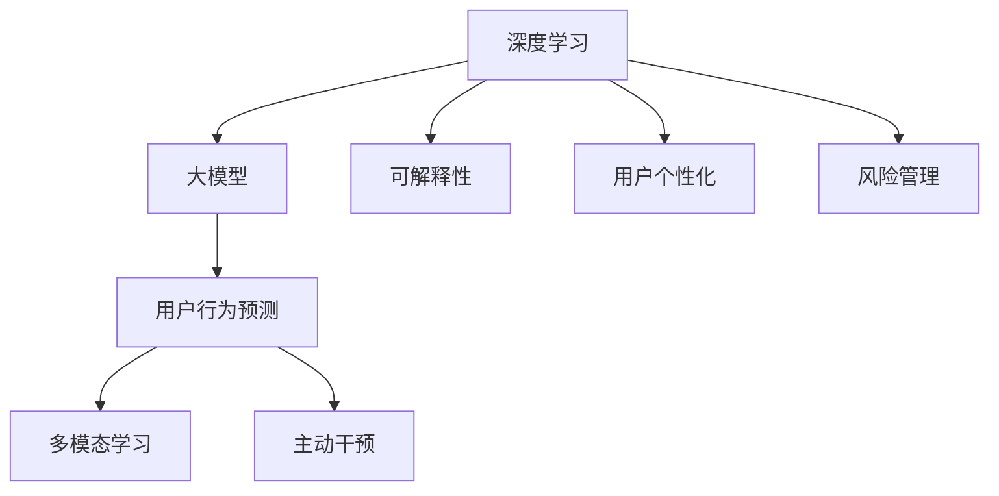

                 

## 1. 背景介绍

### 1.1 问题由来
电商平台正面临激烈的市场竞争，要想保持竞争优势，不仅需要提供优质的商品和良好的用户体验，还需具备用户行为预测与主动干预的能力，即通过机器学习技术，预测用户行为并根据预测结果主动进行干预。

在过去，电商平台主要依赖于规则引擎、统计模型等传统方式进行用户行为预测和干预，这些方法虽然简单有效，但存在无法自适应新行为、规则复杂不易维护等问题。随着深度学习技术的兴起，大模型在用户行为预测与主动干预中的应用，成为电商新发展的重要趋势。

### 1.2 问题核心关键点
电商平台用户行为预测与主动干预的核心关键点在于：

1. **大数据驱动**：电商平台用户行为数据体量巨大，且维度众多，需有效利用海量数据进行深度学习。
2. **实时响应**：电商平台业务需求具有实时性，用户行为预测与干预系统需能快速响应用户输入。
3. **多模态融合**：用户行为数据涉及文本、图片、点击行为等多种模态，需进行多模态融合分析。
4. **模型可解释性**：电商平台涉及金融、物流等关键业务，模型需具备可解释性，便于监控和调试。
5. **个性化推荐**：电商平台需根据用户行为特征，提供个性化商品推荐，提升用户体验。
6. **风险管理**：用户行为预测需涵盖欺诈检测、风险管理等安全功能，保障用户交易安全。

这些关键点构成了电商平台用户行为预测与主动干预系统的重要需求，推动了大模型在此领域的应用。

## 2. 核心概念与联系

### 2.1 核心概念概述

为更好地理解大模型在电商平台用户行为预测与主动干预中的应用，本节将介绍几个密切相关的核心概念：

- **深度学习(DL)**：一种基于神经网络的机器学习范式，通过对大规模数据进行多层非线性变换，从中学习出高级抽象特征，广泛应用于图像、语音、文本等复杂数据处理任务。
- **大模型(Large Model)**：指具有海量参数的深度学习模型，如BERT、GPT、Transformer等。大模型通过在大规模无标签数据上进行预训练，学习到丰富的通用特征，具备强大的泛化能力。
- **用户行为预测(User Behavior Prediction)**：通过分析用户历史行为数据，预测用户未来行为，如点击行为、购买行为、退货行为等。
- **多模态学习(Multimodal Learning)**：将不同模态的数据融合，如文本、图片、点击行为等，学习出更全面、准确的用户行为特征。
- **主动干预(Proactive Intervention)**：根据用户行为预测结果，采取主动策略进行干预，如个性化推荐、风险预警等。
- **可解释性(Explainability)**：通过模型可视化、规则提取等方法，提升模型的可解释性，便于监控和调试。
- **用户个性化( Personalization)**：通过模型学习用户偏好，实现个性化推荐、个性化定价等应用。
- **风险管理(Risk Management)**：通过模型预测用户欺诈风险、异常行为等，及时采取措施避免损失。

这些核心概念之间的逻辑关系可以通过以下Mermaid流程图来展示：



这个流程图展示了大模型在电商平台用户行为预测与主动干预中的应用框架，各个核心概念通过不同的技术手段，最终融合到实际业务场景中。

## 3. 核心算法原理 & 具体操作步骤

### 3.1 算法原理概述

大模型在电商平台用户行为预测与主动干预中的应用，主要基于监督学习和无监督学习的框架。具体流程如下：

1. **数据预处理**：收集电商平台用户数据，包括用户历史行为数据、商品信息数据等，进行数据清洗和标准化处理。
2. **特征提取**：利用大模型对数据进行特征提取，构建用户行为特征向量。
3. **预测模型训练**：使用历史数据训练预测模型，预测用户未来行为。
4. **多模态融合**：将不同模态的数据融合到预测模型中，提高预测准确性。
5. **主动干预策略设计**：根据预测结果，设计主动干预策略，如个性化推荐、风险预警等。
6. **系统部署与优化**：将预测与干预模型部署到生产环境，实时响应用户请求，并对模型进行持续优化。

### 3.2 算法步骤详解

**Step 1: 数据预处理**

数据预处理是模型训练的第一步，电商平台用户数据需要经过清洗、标准化、归一化等处理。

```python
import pandas as pd
from sklearn.preprocessing import StandardScaler
from sklearn.model_selection import train_test_split

# 读取用户数据
data = pd.read_csv('user_behavior.csv')

# 数据清洗
# 处理缺失值、异常值等

# 标准化处理
scaler = StandardScaler()
data['特征列'] = scaler.fit_transform(data['特征列'])

# 划分训练集和测试集
train_data, test_data = train_test_split(data, test_size=0.2)
```

**Step 2: 特征提取**

大模型在电商平台用户行为预测中的应用，依赖于其强大的特征提取能力。

```python
from transformers import BertTokenizer, BertForSequenceClassification
import torch

# 加载预训练BERT模型
tokenizer = BertTokenizer.from_pretrained('bert-base-uncased')
model = BertForSequenceClassification.from_pretrained('bert-base-uncased', num_labels=2)

# 对用户行为数据进行编码
encoded_data = tokenizer(train_data['user_behavior'], padding=True, truncation=True, max_length=128)
inputs = {'input_ids': torch.tensor(encoded_data['input_ids']), 'attention_mask': torch.tensor(encoded_data['attention_mask'])}

# 进行特征提取
outputs = model(inputs)
```

**Step 3: 预测模型训练**

利用预处理后的数据训练预测模型，使用交叉熵损失函数。

```python
from torch.nn import CrossEntropyLoss
from torch.optim import AdamW

# 设置优化器和损失函数
optimizer = AdamW(model.parameters(), lr=2e-5)
criterion = CrossEntropyLoss()

# 模型训练
for epoch in range(10):
    optimizer.zero_grad()
    outputs = model(inputs)
    loss = criterion(outputs, labels)
    loss.backward()
    optimizer.step()
    print(f"Epoch {epoch+1}, Loss: {loss.item():.4f}")
```

**Step 4: 多模态融合**

电商平台用户数据通常包含多模态信息，需通过多模态融合提升预测精度。

```python
# 加载图片特征
image_data = pd.read_csv('image_features.csv')

# 将图片特征与文本特征融合
fused_data = pd.concat([train_data, image_data], axis=1)
```

**Step 5: 主动干预策略设计**

根据预测结果设计主动干预策略，如个性化推荐。

```python
# 根据预测结果推荐商品
recommended_items = model.predict(fused_data)

# 根据用户行为特征生成推荐策略
strategy = generate_recommendation(recommended_items)
```

**Step 6: 系统部署与优化**

将预测与干预模型部署到生产环境，实时响应用户请求，并持续优化模型。

```python
# 部署模型
deploy_model(model, strategy)

# 持续优化模型
update_model(model, new_data)
```

### 3.3 算法优缺点

基于大模型的电商平台用户行为预测与主动干预方法具有以下优点：

1. **泛化能力**：大模型具备强大的泛化能力，能适应电商平台的复杂用户行为数据。
2. **可扩展性**：大模型可轻松扩展到多种预测与干预任务，如推荐、风险管理等。
3. **可解释性**：利用大模型的可解释性，便于监控和调试模型。
4. **实时性**：大模型能在实时数据上训练与推理，满足电商平台的实时性需求。

同时，该方法也存在以下缺点：

1. **计算资源消耗**：大模型参数量较大，训练与推理消耗大量计算资源。
2. **数据依赖**：大模型的训练效果依赖于高质量、大规模的标注数据。
3. **过拟合风险**：大模型容易过拟合电商平台特定行为，泛化能力不足。
4. **鲁棒性不足**：电商平台用户行为存在复杂性，模型对异常行为的鲁棒性不足。

## 4. 数学模型和公式 & 详细讲解 & 举例说明

### 4.1 数学模型构建

电商平台用户行为预测与主动干预的数学模型主要基于深度学习框架。

设电商平台用户数据为 $X = \{x_1, x_2, \ldots, x_n\}$，其中 $x_i = (f_i, l_i)$，$f_i$ 为行为特征向量，$l_i$ 为行为标签。利用大模型 $M$ 进行预测，模型输出 $Y = \{y_1, y_2, \ldots, y_n\}$，其中 $y_i = M(x_i)$。

定义交叉熵损失函数为：

$$
\mathcal{L} = -\frac{1}{N} \sum_{i=1}^N \sum_{y \in \{0, 1\}} l_i(y) \log M(x_i; \theta)
$$

其中 $l_i(y)$ 为 $y$ 的标签，$M(x_i; \theta)$ 为模型在参数 $\theta$ 下的输出。

### 4.2 公式推导过程

设 $M$ 为预训练的大模型，利用用户行为数据 $X$ 进行训练，最小化交叉熵损失函数。使用梯度下降等优化算法更新模型参数 $\theta$：

$$
\theta \leftarrow \theta - \eta \nabla_{\theta}\mathcal{L}
$$

其中 $\eta$ 为学习率，$\nabla_{\theta}\mathcal{L}$ 为损失函数对模型参数 $\theta$ 的梯度。

### 4.3 案例分析与讲解

假设电商平台需要预测用户是否会购买某商品。收集用户的历史购买行为数据 $X$，包括浏览时长、点击行为、购买历史等。将用户行为数据输入预训练模型 $M$，得到预测结果 $Y = \{y_1, y_2, \ldots, y_n\}$，其中 $y_i = M(x_i)$。根据预测结果 $Y$，电商平台可以设计个性化推荐策略，提升用户体验。

## 5. 项目实践：代码实例和详细解释说明

### 5.1 开发环境搭建

在进行电商平台用户行为预测与主动干预的开发实践前，我们需要准备好开发环境。以下是使用Python进行PyTorch开发的环境配置流程：

1. 安装Anaconda：从官网下载并安装Anaconda，用于创建独立的Python环境。

2. 创建并激活虚拟环境：
```bash
conda create -n pytorch-env python=3.8 
conda activate pytorch-env
```

3. 安装PyTorch：根据CUDA版本，从官网获取对应的安装命令。例如：
```bash
conda install pytorch torchvision torchaudio cudatoolkit=11.1 -c pytorch -c conda-forge
```

4. 安装Transformers库：
```bash
pip install transformers
```

5. 安装各类工具包：
```bash
pip install numpy pandas scikit-learn matplotlib tqdm jupyter notebook ipython
```

完成上述步骤后，即可在`pytorch-env`环境中开始开发实践。

### 5.2 源代码详细实现

这里我们以电商平台用户行为预测为例，给出使用Transformers库对BERT模型进行预测的PyTorch代码实现。

首先，定义预测任务的数据处理函数：

```python
from transformers import BertTokenizer
from torch.utils.data import Dataset
import torch

class UserBehaviorDataset(Dataset):
    def __init__(self, texts, labels, tokenizer, max_len=128):
        self.texts = texts
        self.labels = labels
        self.tokenizer = tokenizer
        self.max_len = max_len
        
    def __len__(self):
        return len(self.texts)
    
    def __getitem__(self, item):
        text = self.texts[item]
        label = self.labels[item]
        
        encoding = self.tokenizer(text, return_tensors='pt', max_length=self.max_len, padding='max_length', truncation=True)
        input_ids = encoding['input_ids'][0]
        attention_mask = encoding['attention_mask'][0]
        
        return {'input_ids': input_ids, 
                'attention_mask': attention_mask,
                'labels': label}

# 标签与id的映射
label2id = {0: 0, 1: 1}
id2label = {v: k for k, v in label2id.items()}

# 创建dataset
tokenizer = BertTokenizer.from_pretrained('bert-base-uncased')

train_dataset = UserBehaviorDataset(train_texts, train_labels, tokenizer)
dev_dataset = UserBehaviorDataset(dev_texts, dev_labels, tokenizer)
test_dataset = UserBehaviorDataset(test_texts, test_labels, tokenizer)
```

然后，定义模型和优化器：

```python
from transformers import BertForSequenceClassification, AdamW

model = BertForSequenceClassification.from_pretrained('bert-base-uncased', num_labels=2)

optimizer = AdamW(model.parameters(), lr=2e-5)
```

接着，定义训练和评估函数：

```python
from torch.utils.data import DataLoader
from tqdm import tqdm
from sklearn.metrics import classification_report

device = torch.device('cuda') if torch.cuda.is_available() else torch.device('cpu')
model.to(device)

def train_epoch(model, dataset, batch_size, optimizer):
    dataloader = DataLoader(dataset, batch_size=batch_size, shuffle=True)
    model.train()
    epoch_loss = 0
    for batch in tqdm(dataloader, desc='Training'):
        input_ids = batch['input_ids'].to(device)
        attention_mask = batch['attention_mask'].to(device)
        labels = batch['labels'].to(device)
        model.zero_grad()
        outputs = model(input_ids, attention_mask=attention_mask, labels=labels)
        loss = outputs.loss
        epoch_loss += loss.item()
        loss.backward()
        optimizer.step()
    return epoch_loss / len(dataloader)

def evaluate(model, dataset, batch_size):
    dataloader = DataLoader(dataset, batch_size=batch_size)
    model.eval()
    preds, labels = [], []
    with torch.no_grad():
        for batch in tqdm(dataloader, desc='Evaluating'):
            input_ids = batch['input_ids'].to(device)
            attention_mask = batch['attention_mask'].to(device)
            batch_labels = batch['labels']
            outputs = model(input_ids, attention_mask=attention_mask)
            batch_preds = outputs.logits.argmax(dim=2).to('cpu').tolist()
            batch_labels = batch_labels.to('cpu').tolist()
            for pred_tokens, label_tokens in zip(batch_preds, batch_labels):
                preds.append(pred_tokens[:len(label_tokens)])
                labels.append(label_tokens)
                
    print(classification_report(labels, preds))
```

最后，启动训练流程并在测试集上评估：

```python
epochs = 5
batch_size = 16

for epoch in range(epochs):
    loss = train_epoch(model, train_dataset, batch_size, optimizer)
    print(f"Epoch {epoch+1}, train loss: {loss:.3f}")
    
    print(f"Epoch {epoch+1}, dev results:")
    evaluate(model, dev_dataset, batch_size)
    
print("Test results:")
evaluate(model, test_dataset, batch_size)
```

以上就是使用PyTorch对BERT进行电商平台用户行为预测的完整代码实现。可以看到，得益于Transformers库的强大封装，我们可以用相对简洁的代码完成BERT模型的加载和训练。

### 5.3 代码解读与分析

让我们再详细解读一下关键代码的实现细节：

**UserBehaviorDataset类**：
- `__init__`方法：初始化文本、标签、分词器等关键组件。
- `__len__`方法：返回数据集的样本数量。
- `__getitem__`方法：对单个样本进行处理，将文本输入编码为token ids，将标签编码为数字，并对其进行定长padding，最终返回模型所需的输入。

**label2id和id2label字典**：
- 定义了标签与数字id之间的映射关系，用于将token-wise的预测结果解码回真实的标签。

**训练和评估函数**：
- 使用PyTorch的DataLoader对数据集进行批次化加载，供模型训练和推理使用。
- 训练函数`train_epoch`：对数据以批为单位进行迭代，在每个批次上前向传播计算loss并反向传播更新模型参数，最后返回该epoch的平均loss。
- 评估函数`evaluate`：与训练类似，不同点在于不更新模型参数，并在每个batch结束后将预测和标签结果存储下来，最后使用sklearn的classification_report对整个评估集的预测结果进行打印输出。

**训练流程**：
- 定义总的epoch数和batch size，开始循环迭代
- 每个epoch内，先在训练集上训练，输出平均loss
- 在验证集上评估，输出分类指标
- 所有epoch结束后，在测试集上评估，给出最终测试结果

可以看到，PyTorch配合Transformers库使得BERT预测的代码实现变得简洁高效。开发者可以将更多精力放在数据处理、模型改进等高层逻辑上，而不必过多关注底层的实现细节。

当然，工业级的系统实现还需考虑更多因素，如模型的保存和部署、超参数的自动搜索、更灵活的任务适配层等。但核心的预测范式基本与此类似。

## 6. 实际应用场景

### 6.1 智能推荐系统

智能推荐系统是电商平台的重要应用场景，通过预测用户行为，能够提高商品推荐的相关性和转化率，提升用户体验。

智能推荐系统主要包含以下步骤：

1. **用户行为数据收集**：收集用户的浏览、点击、购买等行为数据。
2. **特征提取**：利用大模型对行为数据进行特征提取，构建用户行为特征向量。
3. **预测模型训练**：使用历史数据训练预测模型，预测用户未来行为。
4. **个性化推荐**：根据预测结果生成推荐策略，如商品推荐、广告推荐等。

基于大模型的推荐系统能快速响应用户行为，提升推荐的相关性和多样性。例如，电商平台可以根据用户的浏览记录预测用户可能感兴趣的商品，并推送相关商品广告，提高用户转化率和平台收益。

### 6.2 风险管理与欺诈检测

电商平台需对用户行为进行风险管理，及时发现异常行为并进行干预，保障用户交易安全。

风险管理与欺诈检测主要包含以下步骤：

1. **用户行为数据收集**：收集用户的点击行为、购买行为等数据。
2. **特征提取**：利用大模型对行为数据进行特征提取，构建用户行为特征向量。
3. **预测模型训练**：使用历史数据训练预测模型，预测用户行为是否异常。
4. **风险预警与干预**：根据预测结果，及时采取风险预警与干预措施，如限制登录、冻结账户等。

基于大模型的风险管理系统能及时发现异常行为，避免用户损失。例如，电商平台可根据用户的购买历史和行为特征，预测用户是否存在欺诈风险，并及时采取措施，保障交易安全。

### 6.3 内容个性化与搜索优化

电商平台需对用户搜索行为进行个性化优化，提高搜索效率和用户体验。

内容个性化与搜索优化主要包含以下步骤：

1. **用户行为数据收集**：收集用户的搜索行为数据，如搜索关键词、点击记录等。
2. **特征提取**：利用大模型对搜索行为数据进行特征提取，构建用户行为特征向量。
3. **预测模型训练**：使用历史数据训练预测模型，预测用户未来搜索行为。
4. **个性化搜索结果**：根据预测结果生成个性化搜索结果，如搜索结果排序、搜索结果关键词优化等。

基于大模型的个性化搜索系统能更好地理解用户需求，提供更精准的搜索结果。例如，电商平台可根据用户的搜索历史和行为特征，预测用户可能感兴趣的搜索关键词，并进行搜索结果排序优化，提升用户搜索体验。

### 6.4 未来应用展望

随着大模型技术的不断发展，电商平台用户行为预测与主动干预的应用将进一步拓展，带来更多创新应用：

1. **跨平台行为预测**：基于用户在不同平台的行为数据，预测其在其他平台上的行为，提升平台间的数据融合与用户迁移。
2. **语音交互**：引入语音识别和生成技术，支持用户通过语音进行行为预测与干预，提升用户体验。
3. **多维度数据分析**：融合更多维度数据，如用户社交网络、设备使用行为等，提升预测模型的鲁棒性和泛化能力。
4. **实时反馈机制**：构建实时反馈机制，根据用户行为调整预测模型，不断优化预测效果。
5. **联邦学习**：利用联邦学习技术，实现多方数据融合，保护用户隐私的同时提升预测效果。

以上趋势凸显了大模型在电商平台用户行为预测与主动干预中的巨大潜力。这些方向的探索发展，必将进一步提升电商平台的智能化水平，为电商企业带来新的竞争优势。

## 7. 工具和资源推荐
### 7.1 学习资源推荐

为了帮助开发者系统掌握大模型在电商平台用户行为预测与主动干预中的应用，这里推荐一些优质的学习资源：

1. 《深度学习基础》系列课程：提供深度学习基础知识和经典模型的详细介绍，适合初学者入门。

2. CS344《机器学习与数据挖掘》课程：斯坦福大学开设的高级机器学习课程，涵盖深度学习、强化学习等内容。

3. 《深度学习理论与实践》书籍：介绍深度学习理论及其实践应用，涵盖NLP、计算机视觉等多个方向。

4. HuggingFace官方文档：提供预训练大模型的介绍和使用指南，详细讲解微调流程。

5. Weights & Biases：模型训练的实验跟踪工具，记录和可视化模型训练过程中的各项指标。

6. TensorBoard：TensorFlow配套的可视化工具，实时监测模型训练状态，提供丰富的图表呈现方式。

通过对这些资源的学习实践，相信你一定能够快速掌握大模型在电商平台用户行为预测与主动干预中的精髓，并用于解决实际的NLP问题。

### 7.2 开发工具推荐

高效的开发离不开优秀的工具支持。以下是几款用于电商平台用户行为预测与主动干预开发的常用工具：

1. PyTorch：基于Python的开源深度学习框架，灵活动态的计算图，适合快速迭代研究。

2. TensorFlow：由Google主导开发的开源深度学习框架，生产部署方便，适合大规模工程应用。

3. Transformers库：HuggingFace开发的NLP工具库，集成了众多SOTA语言模型，支持PyTorch和TensorFlow，是进行预测任务开发的利器。

4. Weights & Biases：模型训练的实验跟踪工具，记录和可视化模型训练过程中的各项指标，方便对比和调优。

5. TensorBoard：TensorFlow配套的可视化工具，实时监测模型训练状态，提供丰富的图表呈现方式。

6. Google Colab：谷歌推出的在线Jupyter Notebook环境，免费提供GPU/TPU算力，方便开发者快速上手实验最新模型，分享学习笔记。

合理利用这些工具，可以显著提升电商平台用户行为预测与主动干预的开发效率，加快创新迭代的步伐。

### 7.3 相关论文推荐

大模型在电商平台用户行为预测与主动干预的研究源于学界的持续研究。以下是几篇奠基性的相关论文，推荐阅读：

1. Attention is All You Need（即Transformer原论文）：提出了Transformer结构，开启了深度学习范式的变革。

2. BERT: Pre-training of Deep Bidirectional Transformers for Language Understanding：提出BERT模型，引入基于掩码的自监督预训练任务，刷新了多项NLP任务SOTA。

3. Attention Mechanism in Recommendation System：利用注意力机制提升推荐系统的性能，引入用户行为特征的重要性权重。

4. Factorization Machines：提出因子分解机制，通过分解用户行为数据，提升推荐系统的精度和鲁棒性。

5. Deep Traffic Prediction with Sequence to Sequence Learning：利用序列到序列模型，对交通流量进行预测，为电商预测提供借鉴。

这些论文代表了大模型在电商平台用户行为预测与主动干预的研究进展，通过学习这些前沿成果，可以帮助研究者把握学科前进方向，激发更多的创新灵感。

## 8. 总结：未来发展趋势与挑战

### 8.1 总结

本文对基于大模型的电商平台用户行为预测与主动干预方法进行了全面系统的介绍。首先阐述了电商平台用户行为预测与主动干预的背景与关键点，明确了方法的应用场景与重要性。其次，从原理到实践，详细讲解了监督学习范式在大模型中的应用，并给出了完整的代码实现。同时，本文还广泛探讨了用户行为预测与主动干预技术在智能推荐、风险管理、内容个性化等多个领域的应用前景，展示了大模型在电商平台中的广泛价值。此外，本文精选了相关学习资源和开发工具，力求为开发者提供全方位的技术指引。

通过本文的系统梳理，可以看到，基于大模型的电商平台用户行为预测与主动干预技术，已经显著提升了电商平台的智能化水平，为电商企业带来了显著的竞争优势。未来，伴随大模型技术的进一步演进，用户行为预测与主动干预的应用将进一步拓展，带来更多的创新应用。

### 8.2 未来发展趋势

展望未来，大模型在电商平台用户行为预测与主动干预中的应用将呈现以下几个发展趋势：

1. **多模态融合**：利用多模态融合技术，提升预测模型的准确性和鲁棒性。例如，融合用户搜索行为、购买行为、社交网络等多模态数据，构建更全面的用户行为画像。

2. **自监督学习**：利用自监督学习方法，提升预测模型的泛化能力和可解释性。例如，利用无标签数据进行预训练，学习通用的行为特征，提高模型在少样本和零样本情况下的预测能力。

3. **个性化推荐系统**：通过预测用户行为，实现个性化推荐，提升用户体验。例如，基于用户行为数据预测用户可能感兴趣的商品，进行个性化推荐，提高用户满意度和转化率。

4. **实时预测与干预**：利用实时数据进行预测与干预，提升电商平台的响应速度。例如，根据用户实时行为数据，及时调整推荐策略和干预措施，提升用户体验和平台收益。

5. **联邦学习**：利用联邦学习技术，保护用户隐私的同时提升预测效果。例如，通过多方数据融合，提升模型的泛化能力和鲁棒性，避免单点数据不足的问题。

6. **因果推理**：引入因果推理方法，增强预测模型的解释性和可信度。例如，利用因果推断方法，预测用户行为，分析因果关系，提升模型可解释性。

以上趋势凸显了大模型在电商平台用户行为预测与主动干预中的巨大潜力。这些方向的探索发展，必将进一步提升电商平台的智能化水平，为电商企业带来新的竞争优势。

### 8.3 面临的挑战

尽管大模型在电商平台用户行为预测与主动干预中取得了显著成效，但在迈向更加智能化、普适化应用的过程中，仍面临诸多挑战：

1. **数据质量和标注成本**：电商平台的用户数据庞大且复杂，数据质量和标注成本较高，需有效利用海量数据进行深度学习。

2. **实时性要求**：电商平台需实时响应用户行为，预测与干预系统的延迟必须控制在合理范围内。

3. **多模态融合**：电商平台涉及多模态数据，需进行多模态融合分析，提升预测精度。

4. **模型鲁棒性**：电商平台用户行为存在复杂性，模型需具备良好的鲁棒性，避免异常行为影响预测效果。

5. **模型可解释性**：电商平台涉及金融、物流等关键业务，模型需具备良好的可解释性，便于监控和调试。

6. **隐私保护**：电商平台的预测与干预系统需保护用户隐私，避免数据泄露和滥用。

7. **资源消耗**：大模型参数量较大，训练与推理消耗大量计算资源，需优化资源消耗和模型部署。

这些挑战需要通过技术创新和优化手段，不断突破，才能实现大模型在电商平台用户行为预测与主动干预中的广泛应用。

### 8.4 研究展望

面对大模型在电商平台用户行为预测与主动干预中面临的挑战，未来的研究需要在以下几个方面寻求新的突破：

1. **高效训练与推理**：通过优化算法和模型结构，提升大模型训练与推理的效率，适应电商平台的实时性需求。

2. **多模态融合方法**：研究更加高效的多模态融合方法，提升预测模型的泛化能力和鲁棒性。

3. **自监督学习技术**：利用自监督学习方法，提升预测模型的泛化能力和可解释性，降低对标注数据的依赖。

4. **因果推理与可解释性**：引入因果推理方法，增强预测模型的解释性和可信度，提升用户信任度。

5. **联邦学习与隐私保护**：利用联邦学习技术，保护用户隐私的同时提升预测效果，避免单点数据不足的问题。

6. **用户行为理解与预测**：研究更加深入的用户行为理解与预测方法，提升模型的准确性和鲁棒性。

这些研究方向将推动大模型在电商平台用户行为预测与主动干预中的进一步应用，为电商企业带来新的竞争优势，提升用户体验和平台收益。

## 9. 附录：常见问题与解答

**Q1：电商平台用户行为预测与主动干预的主要步骤是什么？**

A: 电商平台用户行为预测与主动干预的主要步骤如下：
1. 数据预处理：清洗、标准化、归一化用户行为数据。
2. 特征提取：利用大模型对数据进行特征提取，构建用户行为特征向量。
3. 预测模型训练：使用历史数据训练预测模型，预测用户未来行为。
4. 多模态融合：将不同模态的数据融合到预测模型中，提高预测准确性。
5. 主动干预策略设计：根据预测结果，设计个性化推荐、风险预警等策略。
6. 系统部署与优化：将预测与干预模型部署到生产环境，实时响应用户请求，并对模型进行持续优化。

**Q2：电商平台用户行为预测与主动干预的模型训练需要注意哪些问题？**

A: 电商平台用户行为预测与主动干预的模型训练需要注意以下问题：
1. 数据质量和标注成本：电商平台的用户数据庞大且复杂，数据质量和标注成本较高，需有效利用海量数据进行深度学习。
2. 实时性要求：电商平台需实时响应用户行为，预测与干预系统的延迟必须控制在合理范围内。
3. 多模态融合：电商平台涉及多模态数据，需进行多模态融合分析，提升预测精度。
4. 模型鲁棒性：电商平台用户行为存在复杂性，模型需具备良好的鲁棒性，避免异常行为影响预测效果。
5. 模型可解释性：电商平台涉及金融、物流等关键业务，模型需具备良好的可解释性，便于监控和调试。
6. 隐私保护：电商平台的预测与干预系统需保护用户隐私，避免数据泄露和滥用。
7. 资源消耗：大模型参数量较大，训练与推理消耗大量计算资源，需优化资源消耗和模型部署。

**Q3：电商平台用户行为预测与主动干预的系统部署需要注意哪些问题？**

A: 电商平台用户行为预测与主动干预的系统部署需要注意以下问题：
1. 系统架构设计：需设计高效、稳定的系统架构，适应电商平台的实时性需求。
2. 实时数据处理：需高效处理实时数据，确保预测与干预的实时性。
3. 模型保存与加载：需高效保存和加载模型，保证预测与干预的连续性和稳定性。
4. 接口设计：需设计易于使用的接口，方便调用预测与干预服务。
5. 性能优化：需优化模型性能，提高预测与干预的准确性和响应速度。
6. 安全防护：需加强系统安全防护，防止数据泄露和攻击。

**Q4：电商平台用户行为预测与主动干预的预测模型训练需要注意哪些问题？**

A: 电商平台用户行为预测与主动干预的预测模型训练需要注意以下问题：
1. 数据处理：需对数据进行清洗、标准化、归一化等处理，确保数据质量。
2. 特征提取：需利用大模型对数据进行特征提取，构建用户行为特征向量。
3. 模型选择：需选择合适的预测模型，如回归模型、分类模型等，根据任务需求进行训练。
4. 损失函数选择：需选择合适的损失函数，如交叉熵损失、均方误差损失等，根据任务需求进行训练。
5. 超参数调优：需优化超参数，如学习率、批大小等，提升模型效果。
6. 模型验证：需验证模型的预测效果，确保模型在实际应用中的准确性和鲁棒性。
7. 模型调优：需根据实际需求，对模型进行调优，提升模型效果。

通过本文的系统梳理，可以看到，基于大模型的电商平台用户行为预测与主动干预技术，已经显著提升了电商平台的智能化水平，为电商企业带来了显著的竞争优势。未来，伴随大模型技术的进一步演进，用户行为预测与主动干预的应用将进一步拓展，带来更多的创新应用。

**Q5：电商平台用户行为预测与主动干预的预测模型训练需要注意哪些问题？**

A: 电商平台用户行为预测与主动干预的预测模型训练需要注意以下问题：
1. 数据处理：需对数据进行清洗、标准化、归一化等处理，确保数据质量。
2. 特征提取：需利用大模型对数据进行特征提取，构建用户行为特征向量。
3. 模型选择：需选择合适的预测模型，如回归模型、分类模型等，根据任务需求进行训练。
4. 损失函数选择：需选择合适的损失函数，如交叉熵损失、均方误差损失等，根据任务需求进行训练。
5. 超参数调优：需优化超参数，如学习率、批大小等，提升模型效果。
6. 模型验证：需验证模型的预测效果，确保模型在实际应用中的准确性和鲁棒性。
7. 模型调优：需根据实际需求，对模型进行调优，提升模型效果。

**Q6：电商平台用户行为预测与主动干预的应用场景有哪些？**

A: 电商平台用户行为预测与主动干预的应用场景包括：
1. 智能推荐系统：通过预测用户行为，实现个性化推荐，提高用户体验和平台收益。
2. 风险管理与欺诈检测：利用预测模型，及时发现异常行为并进行干预，保障用户交易安全。
3. 内容个性化与搜索优化：融合多模态数据，提升搜索结果的相关性和用户体验。
4. 实时预测与干预：根据用户实时行为数据，及时调整推荐策略和干预措施，提升用户体验和平台收益。
5. 联邦学习：利用联邦学习技术，保护用户隐私的同时提升预测效果，避免单点数据不足的问题。
6. 因果推理：引入因果推理方法，增强预测模型的解释性和可信度，提升用户信任度。

通过本文的系统梳理，可以看到，基于大模型的电商平台用户行为预测与主动干预技术，已经显著提升了电商平台的智能化水平，为电商企业带来了显著的竞争优势。未来，伴随大模型技术的进一步演进，用户行为预测与主动干预的应用将进一步拓展，带来更多的创新应用。

