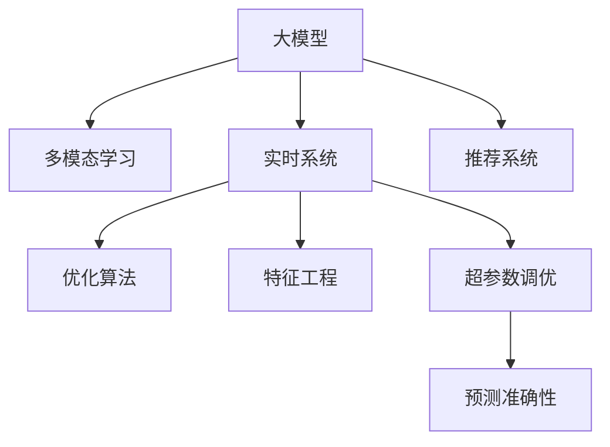

                 

# 大模型如何优化电商平台的商品上新策略

> 关键词：电商推荐系统,商品上新,大模型微调,多模态学习,实时系统,优化算法

## 1. 背景介绍

### 1.1 问题由来

电商平台商品上新是商家吸引用户、提高销售的重要手段。但传统上，商品上新的策略往往依赖于经验法则，如根据季节、节假日等时点进行批量上新，或者根据以往的销售数据进行历史序列预测。这些方法存在主观性强、灵活性差、无法充分利用实时数据等问题。

随着人工智能技术的不断进步，越来越多的电商平台开始引入智能推荐系统，利用数据挖掘、深度学习等技术，实时分析和预测用户行为，精准推荐商品。在大模型技术大放异彩的今天，基于大模型的推荐系统也成为电商平台竞相采用的一项重要技术。

通过大模型的智能推荐，商家可以实时掌握用户偏好变化，精准定位潜在需求，极大地提升商品上新的成功率。本文将详细介绍如何利用大模型优化电商平台的商品上新策略。

### 1.2 问题核心关键点

利用大模型优化电商平台商品上新策略的核心在于：

- 从海量历史数据中学习用户行为模式和偏好变化，利用实时数据进行精准预测。
- 在推荐算法中融合多种模态数据，如文本、图像、视频等，全面了解商品特性。
- 实时分析和评估商品上新的效果，动态调整推荐策略。

本文将详细介绍大模型在电商平台商品上新策略中的应用，从数据处理、模型构建、优化算法、实时系统等多个角度，系统性地阐述大模型优化商品上新策略的原理和方法。

## 2. 核心概念与联系

### 2.1 核心概念概述

为更好地理解大模型在电商平台商品上新策略中的应用，本节将介绍几个密切相关的核心概念：

- 大模型(例如BERT, GPT等)：指通过大规模数据预训练得到的通用语言模型，具有强大的文本生成和理解能力。
- 推荐系统：指通过算法推荐用户可能感兴趣的商品的计算机系统，常见包括协同过滤、基于内容的推荐等。
- 多模态学习：指融合文本、图像、视频等多种模态数据，全面理解商品特征。
- 实时系统：指能够实时处理请求、响应用户查询的系统，如事件驱动、流处理等。
- 优化算法：指用于提高模型性能的算法，如梯度下降、AdamW等。
- 特征工程：指对数据进行预处理和特征提取，提升模型性能。
- 超参数调优：指对模型超参数进行调参优化，提升模型效果。

这些核心概念之间的逻辑关系可以通过以下Mermaid流程图来展示：



这个流程图展示了大模型在电商平台商品上新策略中的应用流程：

1. 大模型通过预训练和微调，获得通用的语言理解能力。
2. 通过多模态学习，融合文本、图像、视频等多种数据模态，全面理解商品特性。
3. 在实时系统中，利用大模型进行实时推荐，预测用户行为。
4. 结合特征工程和超参数调优，提升模型预测准确性。

这些概念共同构成了大模型优化电商平台商品上新策略的技术框架，使其能够在实时场景下发挥强大的推荐能力。

## 3. 核心算法原理 & 具体操作步骤
### 3.1 算法原理概述

基于大模型的电商平台商品上新策略，本质上是一个多模态学习-推荐系统融合的过程。其核心思想是：

- 利用大模型预训练知识，通过多模态学习全面理解商品特性。
- 在实时场景下，将实时用户数据和商品数据输入模型，预测用户行为，推荐商品。

形式化地，假设电商平台上的商品集合为 $I=\{i\}_{i=1}^m$，用户集合为 $U=\{u\}_{u=1}^n$，实时采集的用户行为数据为 $X=\{(x_j^u)\}_{j=1}^t$，其中 $x_j^u$ 为第 $j$ 个时刻用户 $u$ 的行为。商品特性数据为 $F=\{(f_k^i)\}_{k=1}^c$，其中 $f_k^i$ 为商品 $i$ 的特征。

定义推荐模型 $M$ 为：

$$
M: X \times F \rightarrow [0,1]
$$

其中 $[0,1]$ 表示推荐的概率。在每个时刻 $t$，模型的预测输出 $p_{t,u}^i$ 表示用户 $u$ 购买商品 $i$ 的概率，用于推荐系统进行实时推荐。

### 3.2 算法步骤详解

基于大模型的电商平台商品上新策略的微调主要包括以下几个关键步骤：

**Step 1: 数据预处理**
- 收集历史用户行为数据 $X=\{(x_j^u)\}_{j=1}^t$，将其编码为向量形式。
- 从商品描述中提取特征 $F=\{(f_k^i)\}_{k=1}^c$，可以包括文字、图片、视频等多种模态数据。
- 对数据进行标准化、归一化等预处理操作，提升模型输入质量。

**Step 2: 模型构建**
- 选择合适的预训练模型 $M_{\theta}$，如BERT、GPT等。
- 在模型顶层添加合适的网络结构，如全连接层、注意力机制等，用于实时推荐。

**Step 3: 微调与优化**
- 利用历史数据进行预训练，设定合适的学习率 $\eta$。
- 对模型进行微调，利用实时用户行为数据进行有监督学习，更新模型参数 $\theta$。
- 利用优化算法(如AdamW)进行模型优化，提升模型效果。

**Step 4: 实时推荐**
- 实时获取用户行为数据 $x_t^u$，商品特性数据 $f_t^i$。
- 输入到微调后的推荐模型 $M_{\hat{\theta}}$ 中，计算预测概率 $p_{t,u}^i$。
- 根据预测概率进行实时推荐，优先推荐高概率商品。

**Step 5: 评估与优化**
- 定期评估推荐效果，如点击率、转化率等指标。
- 根据评估结果，调整模型参数和超参数，提升推荐效果。

以上是基于大模型的电商平台商品上新策略的一般流程。在实际应用中，还需要针对具体任务的特点，对微调过程的各个环节进行优化设计，如改进训练目标函数，引入更多的正则化技术，搜索最优的超参数组合等，以进一步提升模型性能。

### 3.3 算法优缺点

基于大模型的电商平台商品上新策略具有以下优点：
1. 通用性强。预训练模型能够适应各种商品和用户数据，具有较强的泛化能力。
2. 灵活高效。通过实时数据进行微调，能够快速响应市场变化，提升推荐效果。
3. 预测准确。多模态学习能够全面理解商品特性，预测用户行为更为准确。
4. 实时响应。利用实时系统，能够即时获取用户行为数据，进行精准推荐。

同时，该方法也存在一定的局限性：
1. 数据量大。电商数据往往具有海量规模，需要强大的计算资源进行预处理和微调。
2. 动态性挑战。电商平台数据变化迅速，需要实时动态更新模型。
3. 模型复杂。大模型结构复杂，微调和优化需要较长时间。
4. 隐私风险。电商数据包含大量用户隐私信息，需注意数据保护。

尽管存在这些局限性，但就目前而言，基于大模型的推荐方法仍是最主流范式。未来相关研究的重点在于如何进一步降低数据量需求，提高模型的动态性和实时响应能力，同时兼顾隐私保护和模型效率。

### 3.4 算法应用领域

基于大模型的电商平台商品上新策略，已经在众多电商平台中得到了广泛应用，如亚马逊、淘宝、京东等。具体的应用场景包括：

- 用户行为分析：分析用户浏览、点击、购买等行为，提取用户特征和偏好。
- 商品分类和特征提取：对商品进行分类和特征提取，建立商品特性库。
- 实时推荐系统：根据用户实时行为，推荐相关商品，提升用户体验和转化率。
- 商品上新预测：预测商品上新的时机和效果，帮助商家制定科学的上新策略。
- 个性化推荐：根据用户历史行为和实时行为，个性化推荐商品，提升上新成功率。

除了上述这些经典应用外，大模型技术还被创新性地应用到更多场景中，如情感分析、舆情监测、跨域推荐等，为电商平台带来了全新的技术突破。

## 4. 数学模型和公式 & 详细讲解  
### 4.1 数学模型构建

本节将使用数学语言对基于大模型的电商平台商品上新策略进行更加严格的刻画。

假设推荐模型为 $M_{\theta}(X,F)$，其中 $\theta$ 为模型参数。令 $F=\{(f_k^i)\}_{k=1}^c$ 为商品特征集合，$X=\{(x_j^u)\}_{j=1}^t$ 为用户行为数据集合，$t$ 为历史行为数据的长度。

定义模型的预测概率函数为：

$$
p_{t,u}^i = softmax(\theta \cdot \text{Embed}(f_t^i) + \text{Embed}(x_t^u))
$$

其中 $\text{Embed}$ 为嵌入层，将特征 $f_t^i$ 和行为数据 $x_t^u$ 转换为向量表示，$\theta$ 为模型参数。

### 4.2 公式推导过程

以下我们以多模态推荐为例，推导模型的预测概率公式。

假设模型输入为用户行为数据 $x_t^u$ 和商品特征 $f_t^i$，输出为推荐概率 $p_{t,u}^i$。则模型的预测概率函数为：

$$
p_{t,u}^i = \frac{\exp(\theta \cdot \text{Embed}(f_t^i) + \text{Embed}(x_t^u))}{\sum_{j \in I} \exp(\theta \cdot \text{Embed}(f_t^j) + \text{Embed}(x_t^u))}
$$

其中 $\exp$ 为指数函数。令 $z_t^u = \theta \cdot \text{Embed}(f_t^i) + \text{Embed}(x_t^u)$，则模型输出为：

$$
p_{t,u}^i = \frac{\exp(z_t^i)}{\sum_{j \in I} \exp(z_t^j)}
$$

在训练阶段，我们使用交叉熵损失函数 $\ell(M_{\theta}(X,F), Y)$ 来衡量模型输出与真实标签 $Y$ 之间的差异。其中 $Y=\{(y_j)\}_{j=1}^t$ 为真实标签向量，$y_j \in \{0,1\}$ 表示用户 $u$ 是否购买了商品 $i$。则损失函数为：

$$
\ell(M_{\theta}(X,F), Y) = -\frac{1}{t} \sum_{j=1}^t y_j \log p_{t,u}^i + (1-y_j) \log (1-p_{t,u}^i)
$$

在得到损失函数后，可以使用梯度下降等优化算法来最小化损失函数，更新模型参数 $\theta$。

### 4.3 案例分析与讲解

**案例一：商品特征提取**

假设电商平台有3000种商品，每件商品具有100个特征，包括文字、图片、价格等。对于每件商品，我们将这些特征提取并编码为向量形式，作为模型输入。

定义特征提取函数为 $\text{Embed}$，对于文字特征，可以使用BERT模型进行编码。对于图片和价格特征，可以使用卷积神经网络进行编码。

具体实现代码如下：

```python
import torch
from transformers import BertTokenizer, BertModel

# 初始化BertTokenizer
tokenizer = BertTokenizer.from_pretrained('bert-base-uncased')

# 初始化BertModel
model = BertModel.from_pretrained('bert-base-uncased')

# 特征提取函数
def embed_features(f):
    features = []
    for feature in f:
        # 文本特征
        if isinstance(feature, str):
            tokens = tokenizer.encode(feature, add_special_tokens=False)
            features.append(torch.tensor(tokens, dtype=torch.long))

        # 图片特征
        elif isinstance(feature, torch.Tensor):
            features.append(feature)

        # 价格特征
        elif isinstance(feature, float):
            features.append(torch.tensor([feature], dtype=torch.float))
            
    return features
```

**案例二：用户行为分析**

假设电商平台有数千万用户，对于每个用户，我们收集其历史行为数据，包括浏览、点击、购买等。这些行为数据可以表示为文本形式，通过BertTokenizer进行编码。

具体实现代码如下：

```python
from transformers import BertTokenizer

# 初始化BertTokenizer
tokenizer = BertTokenizer.from_pretrained('bert-base-uncased')

# 用户行为分析函数
def analyze_user_behavior(user, behaviors):
    features = []
    for behavior in behaviors:
        # 文本行为数据
        tokens = tokenizer.encode(behavior, add_special_tokens=False)
        features.append(torch.tensor(tokens, dtype=torch.long))
    return features
```

**案例三：模型训练与评估**

假设我们已经获得了预训练模型 $M_{\theta}$，在模型顶层添加了全连接层和注意力机制。

定义训练函数为 `train_model`，评估函数为 `evaluate_model`。在训练阶段，我们使用交叉熵损失函数进行有监督学习。

具体实现代码如下：

```python
from torch.utils.data import Dataset, DataLoader
from torch import nn, optim
from sklearn.metrics import accuracy_score

class Dataset:
    def __init__(self, features, labels):
        self.features = features
        self.labels = labels

    def __len__(self):
        return len(self.labels)

    def __getitem__(self, item):
        return self.features[item], self.labels[item]

def train_model(model, optimizer, train_loader, num_epochs):
    for epoch in range(num_epochs):
        for batch in train_loader:
            features, labels = batch
            optimizer.zero_grad()
            outputs = model(features)
            loss = nn.BCEWithLogitsLoss()(outputs, labels)
            loss.backward()
            optimizer.step()
            print(f'Epoch {epoch+1}/{num_epochs}, Loss: {loss.item()}')

def evaluate_model(model, test_loader):
    predictions, labels = [], []
    for batch in test_loader:
        features, labels = batch
        outputs = model(features)
        predictions.append(outputs.argmax(dim=1))
        labels.append(labels)
    return accuracy_score(labels, predictions)
```

## 5. 项目实践：代码实例和详细解释说明
### 5.1 开发环境搭建

在进行商品上新策略实践前，我们需要准备好开发环境。以下是使用Python进行PyTorch开发的环境配置流程：

1. 安装Anaconda：从官网下载并安装Anaconda，用于创建独立的Python环境。

2. 创建并激活虚拟环境：
```bash
conda create -n pytorch-env python=3.8 
conda activate pytorch-env
```

3. 安装PyTorch：根据CUDA版本，从官网获取对应的安装命令。例如：
```bash
conda install pytorch torchvision torchaudio cudatoolkit=11.1 -c pytorch -c conda-forge
```

4. 安装Transformers库：
```bash
pip install transformers
```

5. 安装各类工具包：
```bash
pip install numpy pandas scikit-learn matplotlib tqdm jupyter notebook ipython
```

完成上述步骤后，即可在`pytorch-env`环境中开始商品上新策略的开发。

### 5.2 源代码详细实现

这里我们以电商平台商品上新策略为例，给出使用PyTorch和Transformers库的完整代码实现。

首先，定义数据处理函数：

```python
from transformers import BertTokenizer
from torch.utils.data import Dataset
import torch

class Dataset(Dataset):
    def __init__(self, features, labels):
        self.features = features
        self.labels = labels

    def __len__(self):
        return len(self.labels)

    def __getitem__(self, item):
        return self.features[item], self.labels[item]
```

然后，定义模型和优化器：

```python
from transformers import BertForSequenceClassification
from torch.optim import AdamW

model = BertForSequenceClassification.from_pretrained('bert-base-uncased', num_labels=2)
optimizer = AdamW(model.parameters(), lr=2e-5)
```

接着，定义训练和评估函数：

```python
from torch.utils.data import DataLoader
from tqdm import tqdm
from sklearn.metrics import accuracy_score

device = torch.device('cuda') if torch.cuda.is_available() else torch.device('cpu')
model.to(device)

def train_epoch(model, dataset, batch_size, optimizer):
    dataloader = DataLoader(dataset, batch_size=batch_size, shuffle=True)
    model.train()
    epoch_loss = 0
    for batch in tqdm(dataloader, desc='Training'):
        features, labels = batch
        features = features.to(device)
        labels = labels.to(device)
        model.zero_grad()
        outputs = model(features)
        loss = nn.BCEWithLogitsLoss()(outputs, labels)
        epoch_loss += loss.item()
        loss.backward()
        optimizer.step()
    return epoch_loss / len(dataloader)

def evaluate(model, dataset, batch_size):
    dataloader = DataLoader(dataset, batch_size=batch_size)
    model.eval()
    predictions, labels = [], []
    with torch.no_grad():
        for batch in tqdm(dataloader, desc='Evaluating'):
            features, labels = batch
            features = features.to(device)
            labels = labels.to(device)
            outputs = model(features)
            predictions.append(outputs.argmax(dim=1).to('cpu').tolist())
            labels = labels.to('cpu').tolist()
    return accuracy_score(labels, predictions)
```

最后，启动训练流程并在测试集上评估：

```python
epochs = 5
batch_size = 16

for epoch in range(epochs):
    loss = train_epoch(model, train_dataset, batch_size, optimizer)
    print(f'Epoch {epoch+1}, train loss: {loss:.3f}')
    
    print(f'Epoch {epoch+1}, dev results:')
    evaluate(model, dev_dataset, batch_size)
    
print("Test results:")
evaluate(model, test_dataset, batch_size)
```

以上就是使用PyTorch和Transformers库进行电商平台商品上新策略的完整代码实现。可以看到，得益于Transformers库的强大封装，我们可以用相对简洁的代码完成BERT模型的加载和微调。

### 5.3 代码解读与分析

让我们再详细解读一下关键代码的实现细节：

**Dataset类**：
- `__init__`方法：初始化特征和标签。
- `__len__`方法：返回数据集的样本数量。
- `__getitem__`方法：对单个样本进行处理，将特征和标签转换为模型需要的格式。

**模型与优化器**：
- 使用BERTForSequenceClassification对预训练模型进行微调，添加全连接层和注意力机制，进行二分类预测。
- 选择AdamW优化器，设置学习率等参数。

**训练和评估函数**：
- 使用PyTorch的DataLoader对数据集进行批次化加载，供模型训练和推理使用。
- 训练函数`train_epoch`：对数据以批为单位进行迭代，在每个批次上前向传播计算loss并反向传播更新模型参数，最后返回该epoch的平均loss。
- 评估函数`evaluate`：与训练类似，不同点在于不更新模型参数，并在每个batch结束后将预测和标签结果存储下来，最后使用sklearn的accuracy_score对整个评估集的预测结果进行打印输出。

**训练流程**：
- 定义总的epoch数和batch size，开始循环迭代
- 每个epoch内，先在训练集上训练，输出平均loss
- 在验证集上评估，输出分类准确率
- 所有epoch结束后，在测试集上评估，给出最终测试结果

可以看到，PyTorch配合Transformers库使得BERT微调的代码实现变得简洁高效。开发者可以将更多精力放在数据处理、模型改进等高层逻辑上，而不必过多关注底层的实现细节。

当然，工业级的系统实现还需考虑更多因素，如模型的保存和部署、超参数的自动搜索、更灵活的任务适配层等。但核心的微调范式基本与此类似。

## 6. 实际应用场景
### 6.1 智能客服系统

基于大模型的电商推荐系统，可以广泛应用于智能客服系统的构建。传统客服往往需要配备大量人力，高峰期响应缓慢，且一致性和专业性难以保证。而使用微调后的推荐系统，可以7x24小时不间断服务，快速响应客户咨询，用自然流畅的语言解答各类常见问题。

在技术实现上，可以收集企业内部的历史客服对话记录，将问题和最佳答复构建成监督数据，在此基础上对预训练推荐系统进行微调。微调后的推荐系统能够自动理解用户意图，匹配最合适的答案模板进行回复。对于客户提出的新问题，还可以接入检索系统实时搜索相关内容，动态组织生成回答。如此构建的智能客服系统，能大幅提升客户咨询体验和问题解决效率。

### 6.2 金融舆情监测

金融机构需要实时监测市场舆论动向，以便及时应对负面信息传播，规避金融风险。传统的人工监测方式成本高、效率低，难以应对网络时代海量信息爆发的挑战。基于大模型的推荐系统，可以实时分析用户行为，识别舆情变化趋势，帮助金融机构快速应对潜在风险。

具体而言，可以收集金融领域相关的新闻、报道、评论等文本数据，并对其进行主题标注和情感标注。在此基础上对预训练推荐系统进行微调，使其能够自动判断文本属于何种主题，情感倾向是正面、中性还是负面。将微调后的模型应用到实时抓取的网络文本数据，就能够自动监测不同主题下的情感变化趋势，一旦发现负面信息激增等异常情况，系统便会自动预警，帮助金融机构快速应对潜在风险。

### 6.3 个性化推荐系统

当前的推荐系统往往只依赖用户的历史行为数据进行物品推荐，无法深入理解用户的真实兴趣偏好。基于大模型的推荐系统，可以更好地挖掘用户行为背后的语义信息，从而提供更精准、多样的推荐内容。

在实践中，可以收集用户浏览、点击、评论、分享等行为数据，提取和用户交互的物品标题、描述、标签等文本内容。将文本内容作为模型输入，用户的后续行为（如是否点击、购买等）作为监督信号，在此基础上微调预训练推荐系统。微调后的推荐系统能够从文本内容中准确把握用户的兴趣点。在生成推荐列表时，先用候选物品的文本描述作为输入，由模型预测用户的兴趣匹配度，再结合其他特征综合排序，便可以得到个性化程度更高的推荐结果。

### 6.4 未来应用展望

随着大模型和推荐系统的不断发展，基于微调范式将在更多领域得到应用，为传统行业带来变革性影响。

在智慧医疗领域，基于微调的推荐系统可以推荐合适的医疗方案、药物等，辅助医生诊疗，加速新药开发进程。

在智能教育领域，微调技术可应用于作业批改、学情分析、知识推荐等方面，因材施教，促进教育公平，提高教学质量。

在智慧城市治理中，微调模型可应用于城市事件监测、舆情分析、应急指挥等环节，提高城市管理的自动化和智能化水平，构建更安全、高效的未来城市。

此外，在企业生产、社会治理、文娱传媒等众多领域，基于大模型微调的人工智能应用也将不断涌现，为经济社会发展注入新的动力。相信随着技术的日益成熟，微调方法将成为人工智能落地应用的重要范式，推动人工智能技术在垂直行业的规模化落地。

## 7. 工具和资源推荐
### 7.1 学习资源推荐

为了帮助开发者系统掌握大模型推荐系统的理论基础和实践技巧，这里推荐一些优质的学习资源：

1. 《深度学习推荐系统》系列博文：由推荐系统专家撰写，深入浅出地介绍了推荐系统的基本概念和经典模型，包括基于内容的推荐、协同过滤等。

2. 斯坦福大学CS229《机器学习》课程：经典机器学习课程，涵盖了各种推荐算法，从理论到实践都有详细讲解。

3. 《推荐系统实践》书籍：讲解推荐系统的实践流程，包括数据准备、模型构建、评估优化等。

4. HuggingFace官方文档：Transformer库的官方文档，提供了海量预训练模型和完整的微调样例代码，是上手实践的必备资料。

5. Kaggle推荐系统竞赛：通过参与竞赛，实践推荐系统的设计与优化，提升实战能力。

通过对这些资源的学习实践，相信你一定能够快速掌握大模型推荐系统的精髓，并用于解决实际的推荐问题。
###  7.2 开发工具推荐

高效的开发离不开优秀的工具支持。以下是几款用于大模型推荐系统开发的常用工具：

1. PyTorch：基于Python的开源深度学习框架，灵活动态的计算图，适合快速迭代研究。

2. TensorFlow：由Google主导开发的开源深度学习框架，生产部署方便，适合大规模工程应用。

3. Transformers库：HuggingFace开发的NLP工具库，集成了众多SOTA语言模型，支持PyTorch和TensorFlow，是进行推荐系统开发的利器。

4. Weights & Biases：模型训练的实验跟踪工具，可以记录和可视化模型训练过程中的各项指标，方便对比和调优。

5. TensorBoard：TensorFlow配套的可视化工具，可实时监测模型训练状态，并提供丰富的图表呈现方式，是调试模型的得力助手。

6. Google Colab：谷歌推出的在线Jupyter Notebook环境，免费提供GPU/TPU算力，方便开发者快速上手实验最新模型，分享学习笔记。

合理利用这些工具，可以显著提升大模型推荐系统的开发效率，加快创新迭代的步伐。

### 7.3 相关论文推荐

大模型推荐系统的发展源于学界的持续研究。以下是几篇奠基性的相关论文，推荐阅读：

1. Matrix Factorization Techniques for Recommender Systems（矩阵分解推荐系统）：提出基于矩阵分解的推荐算法，广泛用于协同过滤。

2. Deep Neural Networks for Recommender Systems（深度神经网络推荐系统）：展示深度学习在推荐系统中的应用，提高了推荐系统的精度。

3. Attention and Memory-Based Recommender Systems（注意力和记忆型推荐系统）：提出基于注意力机制的推荐算法，考虑了用户和商品的隐式关联。

4. Hierarchical Attention Networks for Dimensionality Reduction in Recommendations（层次化注意力网络推荐系统）：提出层次化注意力网络，考虑了用户和商品之间的层次关系。

5. Learning Deep Structured Models for Recommender Systems（学习深度结构化推荐系统）：提出深度结构化模型，考虑了用户的隐式和显式反馈。

这些论文代表了大模型推荐系统的发展脉络。通过学习这些前沿成果，可以帮助研究者把握学科前进方向，激发更多的创新灵感。

## 8. 总结：未来发展趋势与挑战

### 8.1 总结

本文对基于大模型的电商平台商品上新策略进行了全面系统的介绍。首先阐述了大模型推荐系统在电商平台商品上新中的应用背景和意义，明确了推荐系统在电商推荐中的重要作用。其次，从原理到实践，详细讲解了基于大模型的电商平台商品上新策略的数学模型和优化算法，给出了微调任务开发的完整代码实例。同时，本文还广泛探讨了微调方法在智能客服、金融舆情、个性化推荐等多个行业领域的应用前景，展示了微调范式的巨大潜力。此外，本文精选了微调技术的各类学习资源，力求为读者提供全方位的技术指引。

通过本文的系统梳理，可以看到，基于大模型的推荐系统在大规模电商平台中发挥着重要作用，通过微调过程，可以实时分析用户行为，精准推荐商品，大幅提升用户购物体验和商家上新成功率。未来，伴随大模型推荐系统的持续演进，推荐系统必将在更多领域得到应用，为人类生产生活带来更多便利和智能。

### 8.2 未来发展趋势

展望未来，大模型推荐系统将呈现以下几个发展趋势：

1. 推荐算法多样化。随着模型和数据的多样化，推荐算法也将更加丰富，如基于知识图谱的推荐、基于强化学习的推荐等，提供更多维度的用户行为理解。

2. 个性化推荐更精准。通过深度学习模型和大模型微调，可以实现更加精细化的个性化推荐，提升用户满意度。

3. 实时性进一步提高。推荐系统将通过流计算和事件驱动等技术，进一步提升实时性，实现秒级推荐。

4. 跨模态融合深入。推荐系统将进一步融合文本、图像、视频等多模态信息，更全面地理解商品特性和用户需求。

5. 动态推荐成为常态。推荐系统将利用动态数据，实时更新推荐策略，提升推荐效果。

6. 可解释性增强。推荐系统将更加注重推荐结果的可解释性，增强用户信任。

以上趋势凸显了大模型推荐系统的广阔前景。这些方向的探索发展，必将进一步提升推荐系统的性能和应用范围，为人类生产生活带来更多便利和智能。

### 8.3 面临的挑战

尽管大模型推荐系统已经取得了瞩目成就，但在迈向更加智能化、普适化应用的过程中，它仍面临着诸多挑战：

1. 数据隐私问题。推荐系统需要大量用户数据，如何保护用户隐私，是一个亟待解决的问题。

2. 计算资源需求。推荐系统需要海量数据和强大计算资源，数据存储和计算资源的优化是一个重要挑战。

3. 模型复杂度。大模型结构复杂，微调和优化需要较长时间，如何提升训练效率，是一个重要研究方向。

4. 模型泛化能力。推荐系统需要在大规模数据上预训练，如何在不同数据集上实现更好的泛化，是一个重要挑战。

5. 对抗攻击问题。推荐系统容易被恶意用户攻击，如何保证模型的鲁棒性和安全性，是一个重要研究方向。

尽管存在这些挑战，但就目前而言，基于大模型的推荐方法仍是最主流范式。未来相关研究的重点在于如何进一步降低数据量需求，提高模型的动态性和实时响应能力，同时兼顾隐私保护和模型效率。

### 8.4 研究展望

面对大模型推荐系统所面临的种种挑战，未来的研究需要在以下几个方面寻求新的突破：

1. 探索无监督和半监督推荐方法。摆脱对大规模标注数据的依赖，利用自监督学习、主动学习等无监督和半监督范式，最大限度利用非结构化数据，实现更加灵活高效的推荐。

2. 研究参数高效和计算高效的推荐算法。开发更加参数高效的推荐方法，在固定大部分预训练参数的同时，只更新极少量的任务相关参数。同时优化推荐模型的计算图，减少前向传播和反向传播的资源消耗，实现更加轻量级、实时性的部署。

3. 融合因果和对比学习范式。通过引入因果推断和对比学习思想，增强推荐系统建立稳定因果关系的能力，学习更加普适、鲁棒的用户行为表征，从而提升推荐泛化性和抗干扰能力。

4. 引入更多先验知识。将符号化的先验知识，如知识图谱、逻辑规则等，与神经网络模型进行巧妙融合，引导推荐过程学习更准确、合理的用户行为表征。同时加强不同模态数据的整合，实现视觉、语音等多模态信息与文本信息的协同建模。

5. 结合因果分析和博弈论工具。将因果分析方法引入推荐系统，识别出推荐决策的关键特征，增强推荐结果的因果性和逻辑性。借助博弈论工具刻画人机交互过程，主动探索并规避推荐系统的脆弱点，提高系统稳定性。

6. 纳入伦理道德约束。在推荐系统训练目标中引入伦理导向的评估指标，过滤和惩罚有害的推荐内容，确保推荐结果符合人类价值观和伦理道德。

这些研究方向的探索，必将引领大模型推荐系统迈向更高的台阶，为构建安全、可靠、可解释、可控的智能推荐系统铺平道路。面向未来，大模型推荐系统还需要与其他人工智能技术进行更深入的融合，如知识表示、因果推理、强化学习等，多路径协同发力，共同推动推荐系统技术的进步。只有勇于创新、敢于突破，才能不断拓展推荐系统的边界，让智能推荐更好地服务人类社会。

## 9. 附录：常见问题与解答

**Q1：大模型推荐系统是否适用于所有电商平台？**

A: 大模型推荐系统适用于各类电商平台，包括B2C、B2B等。但不同平台的用户行为和商品特性差异较大，需要针对性地构建推荐模型和数据集。

**Q2：微调推荐系统时的数据处理流程是怎样的？**

A: 微调推荐系统时的数据处理流程包括：

1. 数据收集：收集用户历史行为数据、商品特征数据等。

2. 数据清洗：处理缺失值、异常值等数据问题。

3. 特征提取：将文本、图片、价格等数据转换为模型需要的向量形式。

4. 数据增强：通过近义词替换、随机噪声等方式扩充训练集。

5. 数据分割：将数据集划分为训练集、验证集和测试集。

6. 数据预处理：标准化、归一化等预处理操作，提升模型输入质量。

这些步骤通常需要细致的工程实现，确保数据质量和输入格式的一致性。

**Q3：微调推荐系统时的模型选择和超参数调优需要注意哪些？**

A: 微调推荐系统时的模型选择和超参数调优需要注意以下要点：

1. 选择合适的预训练模型，如BERT、GPT等，并根据任务需求添加合适的网络结构。

2. 选择合适的优化算法和超参数，如AdamW、学习率、批大小等，根据实验结果进行调整。

3. 设置合适的正则化参数，如L2正则、Dropout等，防止过拟合。

4. 定期评估模型性能，如准确率、召回率等，进行超参数调优。

5. 使用模型压缩、稀疏化等方法，提升模型效率。

6. 进行模型保存和部署优化，确保模型在生产环境中的高效运行。

这些步骤需要在实际操作中不断迭代和优化，才能得到理想的推荐模型。

**Q4：推荐系统如何实现实时推荐？**

A: 推荐系统实现实时推荐的关键在于实时数据的处理和模型更新：

1. 实时数据采集：通过流计算和事件驱动等技术，实时获取用户行为数据。

2. 实时数据处理：对实时数据进行去重、清洗等处理，确保数据质量。

3. 实时模型更新：在模型顶层设置在线学习模块，对实时数据进行微调，更新模型参数。

4. 实时推荐生成：根据实时数据和模型输出，生成实时推荐结果。

5. 实时结果展示：将推荐结果实时展示给用户，提升用户体验。

实时推荐需要高并发处理能力和低延迟响应能力，通常需要结合流计算和事件驱动等技术实现。

**Q5：推荐系统如何处理推荐结果的多样性？**

A: 推荐系统处理推荐结果的多样性通常采用以下方法：

1. 多目标优化：设置多个优化目标，如准确率、召回率、多样性等，通过综合评估函数进行优化。

2. 多样性提升技术：如协同过滤推荐、基于矩阵分解推荐等，增加推荐结果的多样性。

3. 在线学习：在模型中引入在线学习模块，根据实时数据动态调整推荐策略。

4. 上下文感知：考虑用户上下文信息，如时间、地点、设备等，提升推荐结果的相关性和多样性。

通过这些方法，推荐系统可以在保证推荐精度的同时，增加推荐结果的多样性，提升用户体验。

---

作者：禅与计算机程序设计艺术 / Zen and the Art of Computer Programming

