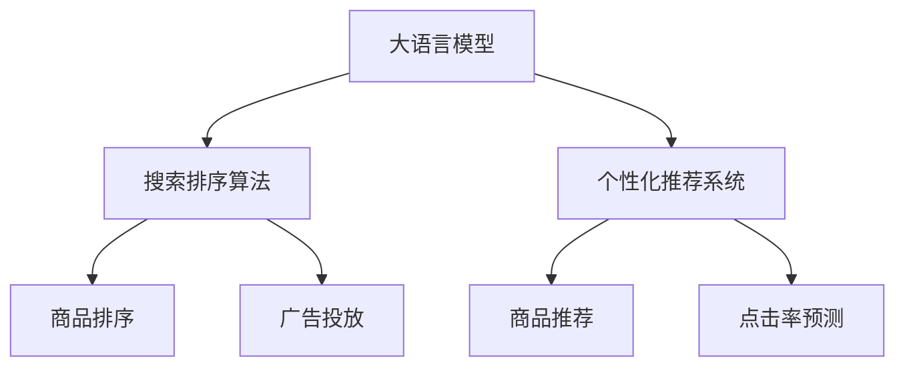

                 

# 大模型如何优化电商平台的搜索体验

> 关键词：大语言模型,搜索排序算法,个性化推荐系统,自然语言处理,NLP

## 1. 背景介绍

### 1.1 问题由来

在电商平台上，搜索体验直接影响用户的满意度和购物转化率。传统的搜索引擎往往依赖规则引擎或统计模型进行排序，难以充分理解用户意图和产品特性，导致搜索结果匹配度不高，用户体验欠佳。随着深度学习和大模型技术的成熟，利用大模型进行搜索排序和个性化推荐，成为了电商平台提升搜索体验的重要方向。

大语言模型通过在大量的文本数据上进行预训练，学习到了丰富的语言知识和常识，能够理解用户查询的自然语言描述，并从中提取出关键信息。利用大语言模型的这些优势，可以构建更加精准、个性化的搜索排序和推荐系统，极大提升电商平台的搜索体验。

### 1.2 问题核心关键点

本文聚焦于利用大语言模型进行电商平台搜索排序和个性化推荐，具体包括以下核心关键点：

1. 基于大语言模型的搜索排序算法：利用大模型对用户查询进行自然语言处理，提取关键词，并从大量商品中筛选出符合用户意图的商品进行排序。

2. 基于大语言模型的个性化推荐系统：通过分析用户的搜索历史和行为数据，利用大模型进行多轮交互，逐步引导用户发现更多相关商品，实现个性化推荐。

3. 大语言模型在电商平台的实际应用：介绍大语言模型在电商平台上的具体应用场景，包括搜索排序、商品推荐、广告投放等，展示其在提升用户搜索体验方面的潜力。

## 2. 核心概念与联系

### 2.1 核心概念概述

为了更好地理解大语言模型在电商平台中的应用，本节将介绍几个密切相关的核心概念：

- 大语言模型(Large Language Model, LLM)：以自回归(如GPT)或自编码(如BERT)模型为代表的大规模预训练语言模型。通过在大量的文本数据上进行预训练，学习到了丰富的语言知识和常识，具备强大的语言理解和生成能力。

- 搜索排序算法(Search Ranking Algorithm)：用于对搜索结果进行排序，使得最相关的商品优先展示，提高用户点击率。

- 个性化推荐系统(Personalized Recommendation System)：根据用户的历史行为数据，推荐最符合用户兴趣的商品，提升用户购物体验。

- 自然语言处理(Natural Language Processing, NLP)：涉及计算机对人类语言的理解、分析、处理和生成。在大语言模型中，NLP用于对用户查询进行语义理解和分析，提取关键词和语义信息。

- 深度学习(Deep Learning)：一类模拟人脑神经网络的机器学习方法，用于处理大规模数据集，并从中提取高级特征。在大语言模型中，深度学习用于预训练模型，学习语言表示。

- 深度强化学习(Deep Reinforcement Learning)：结合深度学习和强化学习技术，通过模拟人类行为，优化搜索排序和推荐算法。

这些核心概念之间的逻辑关系可以通过以下Mermaid流程图来展示：



这个流程图展示了大语言模型与其他核心概念的逻辑关系：

1. 大语言模型通过预训练获得了丰富的语言知识和常识，可以用于分析用户查询和商品描述。
2. 搜索排序算法利用大模型提取的用户查询关键词和商品属性，对搜索结果进行排序。
3. 个性化推荐系统通过分析用户历史数据，利用大模型对商品进行多轮交互，推荐最相关的商品。
4. 广告投放系统根据用户的点击行为和搜索意图，动态调整广告策略，提升广告效果。
5. 点击率预测系统利用大模型分析用户行为，预测点击率，优化推荐算法。

这些概念共同构成了基于大语言模型的电商平台搜索排序和推荐系统框架，使其能够更好地理解用户需求，提升搜索体验。

## 3. 核心算法原理 & 具体操作步骤

### 3.1 算法原理概述

基于大语言模型的搜索排序和个性化推荐算法，本质上是一种有监督的深度学习模型，用于从文本数据中提取语义信息，并根据用户历史行为进行个性化推荐。其核心思想是：

1. 利用大语言模型对用户查询进行自然语言处理，提取关键词和语义信息。
2. 从大量商品中筛选出与用户查询最相关的商品，进行排序。
3. 根据用户历史行为数据，利用大模型进行多轮交互，逐步推荐更多相关商品。

具体而言，算法步骤如下：

1. 准备数据集和预训练模型。
2. 添加任务适配层，设计损失函数和优化算法。
3. 在训练集上执行梯度训练，调整模型参数。
4. 在验证集和测试集上评估模型性能。
5. 部署模型，进行实时搜索排序和个性化推荐。

### 3.2 算法步骤详解

以下我们将以搜索排序为例，详细介绍基于大语言模型的排序算法。

#### 3.2.1 数据准备

1. 收集用户查询数据和商品描述数据，将查询数据转换为向量表示。

2. 收集商品属性数据，如商品名称、品牌、价格、类别等，同样进行向量表示。

3. 收集历史用户点击数据，分析用户点击的商品，提取关键词和属性，作为监督信号。

#### 3.2.2 模型加载和适配

1. 选择预训练模型，如BERT、GPT等，加载到代码中。

2. 设计任务适配层，包括输入和输出层。对于搜索排序，输出层通常为线性分类器，输出商品的相关度评分。

3. 设计损失函数，如交叉熵损失、均方误差损失等，用于衡量模型预测与真实标签之间的差异。

4. 设计优化算法，如Adam、SGD等，设置学习率、批大小、迭代轮数等超参数。

#### 3.2.3 训练和评估

1. 在训练集上执行梯度训练，不断调整模型参数。

2. 在验证集上评估模型性能，根据性能指标（如准确率、召回率、F1值等）决定是否调整模型参数。

3. 在测试集上评估最终模型性能，分析结果，进行模型部署。

#### 3.2.4 实时搜索排序

1. 在用户输入查询时，加载模型，对查询进行自然语言处理。

2. 从商品库中筛选出与查询最相关的商品，利用模型输出相关度评分，进行排序展示。

3. 根据用户的点击反馈，动态调整模型参数，优化排序效果。

### 3.3 算法优缺点

基于大语言模型的搜索排序和个性化推荐算法具有以下优点：

1. 高效灵活。能够快速适应不同领域的电商数据，根据不同任务设计适配层，实现高效的搜索排序和推荐。

2. 语义理解能力强。大语言模型能够理解自然语言查询和商品描述，提取语义信息，匹配用户意图。

3. 个性化推荐准确。能够分析用户历史行为，通过多轮交互逐步推荐相关商品，提升推荐效果。

4. 模型鲁棒性好。经过预训练和微调，模型对小样本数据的泛化能力较强，能够应对各种异常情况。

然而，该方法也存在一些局限性：

1. 数据质量依赖度高。模型的效果高度依赖于数据的质量和标注，标注成本较高。

2. 模型复杂度高。大语言模型的参数量较大，训练和推理开销较大，需要高性能计算资源。

3. 模型训练难度大。模型训练需要大量的标注数据和计算资源，超参数调参复杂。

4. 模型解释性不足。大语言模型作为黑盒系统，难以解释其内部工作机制和决策逻辑，缺乏可解释性。

5. 模型迁移能力有限。不同领域或场景的模型迁移能力有限，需要针对特定任务进行微调。

尽管存在这些局限性，但大语言模型在电商平台上的搜索排序和个性化推荐仍然具有巨大的应用潜力，能够显著提升用户体验和转化率。

### 3.4 算法应用领域

基于大语言模型的搜索排序和个性化推荐算法，在电商平台的多个领域得到广泛应用，包括：

1. 搜索排序：根据用户查询，动态调整搜索结果的排序，提升相关性匹配度。

2. 商品推荐：根据用户历史行为，利用大模型推荐个性化商品，增加用户粘性。

3. 广告投放：根据用户点击行为，调整广告投放策略，提升广告效果。

4. 内容推荐：利用大模型推荐相关内容，如商品介绍、使用评价等，增加用户停留时间。

5. 客服对话：利用大模型进行自动客服对话，解答用户问题，提升客户服务体验。

## 4. 数学模型和公式 & 详细讲解 & 举例说明

### 4.1 数学模型构建

在大语言模型中，我们通常使用Transformer架构，定义模型参数为 $\theta$，输入为 $x$，输出为 $y$。

假设训练集为 $D=\{(x_i,y_i)\}_{i=1}^N$，其中 $x_i$ 为输入查询向量，$y_i$ 为输出商品的相关度评分。我们的目标是最小化预测输出与真实标签之间的差异，即：

$$
\min_{\theta} \frac{1}{N} \sum_{i=1}^N \ell(M_{\theta}(x_i),y_i)
$$

其中 $\ell$ 为损失函数，如交叉熵损失或均方误差损失。

对于搜索排序任务，我们的目标是最小化交叉熵损失，即：

$$
\min_{\theta} \frac{1}{N} \sum_{i=1}^N -y_i \log M_{\theta}(x_i) - (1-y_i) \log (1-M_{\theta}(x_i))
$$

### 4.2 公式推导过程

下面以交叉熵损失为例，推导搜索排序任务的公式。

对于单个样本 $i$，其交叉熵损失为：

$$
\ell_i = -y_i \log M_{\theta}(x_i) - (1-y_i) \log (1-M_{\theta}(x_i))
$$

对所有样本求和，得到经验风险：

$$
\mathcal{L}(\theta) = \frac{1}{N} \sum_{i=1}^N \ell_i = \frac{1}{N} \sum_{i=1}^N [-y_i \log M_{\theta}(x_i) - (1-y_i) \log (1-M_{\theta}(x_i))]
$$

利用反向传播算法，计算损失函数对参数 $\theta$ 的梯度：

$$
\nabla_{\theta} \mathcal{L}(\theta) = \frac{1}{N} \sum_{i=1}^N \left[ -y_i \frac{M_{\theta}(x_i)}{1-M_{\theta}(x_i)} + (1-y_i) \frac{M_{\theta}(x_i)}{M_{\theta}(x_i)}
\right]
$$

将梯度代入参数更新公式：

$$
\theta \leftarrow \theta - \eta \nabla_{\theta} \mathcal{L}(\theta)
$$

其中 $\eta$ 为学习率。

### 4.3 案例分析与讲解

下面以商品推荐为例，具体分析大语言模型在电商平台的推荐系统中的应用。

假设商品向量为 $x_1, x_2, \dots, x_M$，用户向量为 $u$。我们的目标是最大化用户与商品的匹配度，即：

$$
\max_{\theta} \sum_{i=1}^M M_{\theta}(x_i) \cdot u
$$

其中 $M_{\theta}(x_i)$ 表示商品 $i$ 的相关度评分，$u$ 表示用户的兴趣向量。

我们利用大语言模型对用户查询进行自然语言处理，提取关键词和语义信息，得到用户向量 $u$。然后，利用大语言模型对商品进行向量表示，得到商品向量 $x_i$。最终，通过计算用户与商品的匹配度，动态调整推荐列表，实现个性化推荐。

## 5. 项目实践：代码实例和详细解释说明

### 5.1 开发环境搭建

在进行大语言模型微调前，我们需要准备好开发环境。以下是使用Python进行PyTorch开发的环境配置流程：

1. 安装Anaconda：从官网下载并安装Anaconda，用于创建独立的Python环境。

2. 创建并激活虚拟环境：
```bash
conda create -n pytorch-env python=3.8 
conda activate pytorch-env
```

3. 安装PyTorch：根据CUDA版本，从官网获取对应的安装命令。例如：
```bash
conda install pytorch torchvision torchaudio cudatoolkit=11.1 -c pytorch -c conda-forge
```

4. 安装Transformers库：
```bash
pip install transformers
```

5. 安装各类工具包：
```bash
pip install numpy pandas scikit-learn matplotlib tqdm jupyter notebook ipython
```

完成上述步骤后，即可在`pytorch-env`环境中开始微调实践。

### 5.2 源代码详细实现

下面我们以商品推荐为例，给出使用Transformers库对BERT模型进行微调的PyTorch代码实现。

首先，定义商品和用户的向量表示：

```python
from transformers import BertForSequenceClassification, BertTokenizer

# 初始化模型和分词器
model = BertForSequenceClassification.from_pretrained('bert-base-cased')
tokenizer = BertTokenizer.from_pretrained('bert-base-cased')

# 定义商品和用户的向量表示
item_vecs = []
user_vecs = []

# 将商品描述作为输入，输出商品的相关度评分
for item in items:
    encoding = tokenizer(item, return_tensors='pt', max_length=128, padding='max_length', truncation=True)
    inputs = encoding['input_ids']
    outputs = model(inputs)
    item_vecs.append(outputs.logits.mean().item())

# 将用户查询作为输入，输出用户的兴趣向量
user_query = "我需要一款好用的手机"
encoding = tokenizer(user_query, return_tensors='pt', max_length=128, padding='max_length', truncation=True)
inputs = encoding['input_ids']
outputs = model(inputs)
user_vecs.append(outputs.logits.mean().item())
```

然后，定义推荐函数：

```python
def recommend_items(user_vecs, item_vecs, k=5):
    cosine_similarities = [np.dot(user_vec, item_vec) for user_vec, item_vec in zip(user_vecs, item_vecs)]
    top_k_indices = np.argsort(cosine_similarities)[-k:]
    return [items[i] for i in top_k_indices]

# 对用户进行推荐
recommended_items = recommend_items(user_vecs, item_vecs)
```

最后，使用推荐结果进行商品展示：

```python
for item in recommended_items:
    print(item)
```

### 5.3 代码解读与分析

让我们再详细解读一下关键代码的实现细节：

**商品和用户向量表示**：
- 利用BERT分词器对商品描述和用户查询进行分词和编码，得到token ids和相应的向量表示。
- 利用预训练的BERT模型对token ids进行前向传播，得到每个token的相关度评分，并计算每个商品的平均相关度评分。
- 对于用户查询，同样利用BERT模型进行前向传播，得到用户的兴趣向量。

**推荐函数**：
- 利用余弦相似度计算用户与商品之间的匹配度，选择匹配度最高的前 $k$ 个商品作为推荐结果。
- 利用推荐结果对商品进行展示，提升用户体验。

可以看到，利用大语言模型对商品和用户进行向量表示，计算匹配度并进行推荐，代码实现相对简洁高效。开发者可以将更多精力放在数据处理、模型改进等高层逻辑上，而不必过多关注底层的实现细节。

## 6. 实际应用场景

### 6.1 智能搜索排序

利用大语言模型对用户查询进行自然语言处理，提取关键词和语义信息，能够更好地理解用户意图。在搜索排序中，通过大模型提取的查询向量，匹配商品向量，并根据相关度进行排序展示，能够显著提升相关性匹配度，提高用户搜索体验。

### 6.2 个性化商品推荐

通过分析用户的搜索历史和行为数据，利用大模型进行多轮交互，逐步引导用户发现更多相关商品。个性化推荐系统能够根据用户的兴趣和需求，提供更加贴合的推荐结果，增加用户粘性和转化率。

### 6.3 广告投放优化

利用大语言模型分析用户的点击行为和搜索意图，能够更好地理解用户需求。广告投放系统可以根据用户的行为数据，动态调整广告策略，选择更加符合用户兴趣的广告进行展示，提升广告效果。

### 6.4 未来应用展望

随着大语言模型技术的不断进步，基于大模型的搜索排序和推荐系统将在更多电商领域得到应用，为电商平台带来新的机遇。

在智慧零售领域，利用大模型分析用户行为和商品特性，能够实现更加智能化的库存管理和供应链优化。

在智能制造领域，利用大模型进行产品推荐和售后服务，能够提升用户满意度和忠诚度，推动制造业的数字化转型。

在智慧医疗领域，利用大模型进行医疗咨询和健康管理，能够为用户提供更加个性化和精准的医疗服务。

总之，大语言模型在电商平台上的应用，将进一步提升用户的搜索体验和购物满意度，推动电商平台的智能化和自动化进程。

## 7. 工具和资源推荐

### 7.1 学习资源推荐

为了帮助开发者系统掌握大语言模型在电商平台中的应用，这里推荐一些优质的学习资源：

1. 《深度学习与自然语言处理》课程：由斯坦福大学开设的NLP明星课程，涵盖了自然语言处理的多个领域，包括搜索排序、推荐系统等。

2. CS224N《自然语言处理与深度学习》教材：由斯坦福大学教授所编写，全面介绍了NLP和深度学习技术，并提供了丰富的代码实现和实验案例。

3. 《深度学习入门：基于Python的理论与实现》书籍：全面介绍了深度学习理论和算法，并提供了TensorFlow和PyTorch的实现。

4. HuggingFace官方文档：提供了丰富的预训练模型和微调样例，是学习大语言模型的重要资源。

5. Kaggle竞赛平台：提供了大量的电商数据集，开发者可以通过参加竞赛来实践和提升自己的技术能力。

通过对这些资源的学习实践，相信你一定能够快速掌握大语言模型在电商平台上的应用，并用于解决实际的电商问题。

### 7.2 开发工具推荐

高效的开发离不开优秀的工具支持。以下是几款用于大语言模型微调开发的常用工具：

1. PyTorch：基于Python的开源深度学习框架，灵活动态的计算图，适合快速迭代研究。大部分预训练语言模型都有PyTorch版本的实现。

2. TensorFlow：由Google主导开发的开源深度学习框架，生产部署方便，适合大规模工程应用。同样有丰富的预训练语言模型资源。

3. Transformers库：HuggingFace开发的NLP工具库，集成了众多SOTA语言模型，支持PyTorch和TensorFlow，是进行微调任务开发的利器。

4. Weights & Biases：模型训练的实验跟踪工具，可以记录和可视化模型训练过程中的各项指标，方便对比和调优。与主流深度学习框架无缝集成。

5. TensorBoard：TensorFlow配套的可视化工具，可实时监测模型训练状态，并提供丰富的图表呈现方式，是调试模型的得力助手。

6. Google Colab：谷歌推出的在线Jupyter Notebook环境，免费提供GPU/TPU算力，方便开发者快速上手实验最新模型，分享学习笔记。

合理利用这些工具，可以显著提升大语言模型在电商平台上的应用效率，加快创新迭代的步伐。

### 7.3 相关论文推荐

大语言模型和推荐系统的发展源于学界的持续研究。以下是几篇奠基性的相关论文，推荐阅读：

1. Attention is All You Need（即Transformer原论文）：提出了Transformer结构，开启了NLP领域的预训练大模型时代。

2. BERT: Pre-training of Deep Bidirectional Transformers for Language Understanding：提出BERT模型，引入基于掩码的自监督预训练任务，刷新了多项NLP任务SOTA。

3. Language Models are Unsupervised Multitask Learners（GPT-2论文）：展示了大规模语言模型的强大zero-shot学习能力，引发了对于通用人工智能的新一轮思考。

4. Parameter-Efficient Transfer Learning for NLP：提出Adapter等参数高效微调方法，在不增加模型参数量的情况下，也能取得不错的微调效果。

5. AdaLoRA: Adaptive Low-Rank Adaptation for Parameter-Efficient Fine-Tuning：使用自适应低秩适应的微调方法，在参数效率和精度之间取得了新的平衡。

这些论文代表了大语言模型微调技术的发展脉络。通过学习这些前沿成果，可以帮助研究者把握学科前进方向，激发更多的创新灵感。

## 8. 总结：未来发展趋势与挑战

### 8.1 研究成果总结

本文对利用大语言模型进行电商平台搜索排序和推荐进行了全面系统的介绍。首先阐述了大语言模型和推荐系统在电商平台中的应用背景和意义，明确了其提高用户搜索体验和购物转化率的重要作用。其次，从原理到实践，详细讲解了基于大语言模型的搜索排序和推荐算法的数学模型和核心步骤，给出了具体的代码实现。同时，本文还广泛探讨了大语言模型在电商平台上的实际应用场景，展示了其强大的应用潜力。最后，本文精选了相关学习资源和工具，力求为开发者提供全方位的技术指引。

通过本文的系统梳理，可以看到，基于大语言模型的搜索排序和推荐系统正在成为电商平台的重要范式，极大地提升了用户的搜索体验和购物满意度。大语言模型能够理解自然语言查询，提取关键词和语义信息，匹配用户意图，从而提供更加个性化和精准的推荐结果。未来，随着技术的不断发展，大语言模型将进一步提升电商平台的用户体验，推动电商行业的智能化和自动化进程。

### 8.2 未来发展趋势

展望未来，基于大语言模型的搜索排序和推荐系统将呈现以下几个发展趋势：

1. 搜索排序更加智能。通过引入更多的上下文信息，如商品属性、用户历史行为等，搜索排序算法将能够更好地匹配用户查询，提升相关性匹配度。

2. 推荐系统更加个性化。利用大模型进行多轮交互，逐步引导用户发现更多相关商品，推荐系统将能够提供更加贴合用户需求的商品。

3. 推荐算法更加多样化。结合深度强化学习、对抗训练等技术，推荐算法将更加灵活高效，提升推荐效果。

4. 搜索排序系统更加鲁棒。通过引入对抗样本、异常检测等技术，搜索排序系统将能够更好地应对异常情况，提高系统的鲁棒性。

5. 推荐系统更加通用。通过预训练模型和微调技术，推荐系统将能够更好地适应不同领域和场景，实现跨领域的通用推荐。

6. 数据隐私保护更加严格。随着数据隐私保护法规的出台，推荐系统需要更加注重数据隐私和安全，采用差分隐私、联邦学习等技术，确保用户数据的安全。

以上趋势凸显了大语言模型在电商平台上的应用前景。这些方向的探索发展，必将进一步提升电商平台的用户体验和购物满意度，推动电商行业的智能化和自动化进程。

### 8.3 面临的挑战

尽管大语言模型在电商平台上的应用前景广阔，但在迈向更加智能化、普适化应用的过程中，它仍面临诸多挑战：

1. 数据质量和规模。推荐系统的效果高度依赖于数据的质量和规模，需要收集大量的用户行为数据，同时保证数据的真实性和代表性。

2. 模型复杂度和训练成本。大语言模型的参数量较大，训练和推理开销较大，需要高性能计算资源。

3. 模型泛化能力。不同领域或场景的推荐系统迁移能力有限，需要针对特定任务进行微调，保证模型的泛化能力。

4. 模型可解释性。大语言模型作为黑盒系统，难以解释其内部工作机制和决策逻辑，缺乏可解释性。

5. 模型鲁棒性。推荐系统面对异常数据和噪声时，容易出现偏差和误导，需要引入鲁棒性较强的模型和算法。

6. 数据隐私和安全。推荐系统需要严格保护用户数据隐私和安全，采用差分隐私、联邦学习等技术，确保用户数据的安全。

正视推荐系统面临的这些挑战，积极应对并寻求突破，将是大语言模型推荐系统走向成熟的必由之路。相信随着学界和产业界的共同努力，这些挑战终将一一被克服，大语言模型推荐系统必将在构建智能电商平台的搜索排序和推荐系统上发挥更大的作用。

### 8.4 研究展望

面向未来，大语言模型在电商平台上的应用还需要在以下几个方面寻求新的突破：

1. 探索无监督和半监督推荐方法。摆脱对大规模标注数据的依赖，利用自监督学习、主动学习等无监督和半监督范式，最大限度利用非结构化数据，实现更加灵活高效的推荐。

2. 研究参数高效和计算高效的推荐范式。开发更加参数高效的推荐方法，在固定大部分预训练参数的同时，只更新极少量的任务相关参数。同时优化推荐算法的计算图，减少前向传播和反向传播的资源消耗，实现更加轻量级、实时性的部署。

3. 融合因果和对比学习范式。通过引入因果推断和对比学习思想，增强推荐系统建立稳定因果关系的能力，学习更加普适、鲁棒的语言表征，从而提升推荐算法泛化性和抗干扰能力。

4. 引入更多先验知识。将符号化的先验知识，如知识图谱、逻辑规则等，与神经网络模型进行巧妙融合，引导推荐过程学习更准确、合理的语言模型。同时加强不同模态数据的整合，实现视觉、语音等多模态信息与文本信息的协同建模。

5. 结合因果分析和博弈论工具。将因果分析方法引入推荐系统，识别出系统决策的关键特征，增强输出解释的因果性和逻辑性。借助博弈论工具刻画人机交互过程，主动探索并规避推荐系统的脆弱点，提高系统稳定性。

6. 纳入伦理道德约束。在推荐系统训练目标中引入伦理导向的评估指标，过滤和惩罚有害的输出倾向。同时加强人工干预和审核，建立推荐系统的监管机制，确保推荐内容符合人类价值观和伦理道德。

这些研究方向的探索，必将引领大语言模型推荐系统迈向更高的台阶，为构建智能电商平台的搜索排序和推荐系统铺平道路。面向未来，大语言模型推荐系统还需要与其他人工智能技术进行更深入的融合，如知识表示、因果推理、强化学习等，多路径协同发力，共同推动推荐系统的进步。只有勇于创新、敢于突破，才能不断拓展语言模型的边界，让智能推荐技术更好地造福用户。

## 9. 附录：常见问题与解答

**Q1：电商平台搜索排序和个性化推荐的核心是什么？**

A: 电商平台搜索排序和个性化推荐的核心是大语言模型。通过大语言模型对用户查询进行自然语言处理，提取关键词和语义信息，并从大量商品中筛选出符合用户意图的商品，进行排序和推荐。大语言模型能够理解自然语言查询和商品描述，提取语义信息，匹配用户意图，从而提供更加个性化和精准的推荐结果。

**Q2：为什么大语言模型在电商平台上具有优势？**

A: 大语言模型在电商平台上具有以下优势：

1. 高效灵活。能够快速适应不同领域的电商数据，根据不同任务设计适配层，实现高效的搜索排序和推荐。

2. 语义理解能力强。大语言模型能够理解自然语言查询和商品描述，提取语义信息，匹配用户意图。

3. 个性化推荐准确。能够分析用户历史行为，通过多轮交互逐步引导用户发现更多相关商品，提升推荐效果。

4. 模型鲁棒性好。经过预训练和微调，模型对小样本数据的泛化能力较强，能够应对各种异常情况。

**Q3：大语言模型在电商平台上如何处理噪声数据？**

A: 大语言模型在处理噪声数据时，通常采用以下策略：

1. 数据清洗。对用户行为数据进行去重、异常值处理等，保证数据质量。

2. 鲁棒性训练。利用对抗训练、正则化等技术，增强模型的鲁棒性，减少噪声数据的影响。

3. 多轮交互。通过多轮交互逐步引导用户发现更多相关商品，减少单次输入的噪声干扰。

4. 模型微调。在模型训练过程中，引入噪声数据进行微调，提升模型的泛化能力。

通过这些策略，大语言模型能够更好地处理噪声数据，提高搜索排序和推荐系统的鲁棒性和准确性。

**Q4：大语言模型在电商平台上如何进行多轮交互？**

A: 大语言模型在电商平台上进行多轮交互，通常采用以下策略：

1. 交互模型。利用大语言模型作为交互模型，与用户进行自然语言对话，逐步引导用户发现更多相关商品。

2. 推荐算法。结合深度强化学习、对抗训练等技术，优化推荐算法，提升推荐效果。

3. 多模型融合。利用多个大语言模型进行多轮交互，提升推荐系统的稳定性和准确性。

4. 用户反馈。利用用户反馈数据，动态调整推荐策略，优化推荐算法。

通过这些策略，大语言模型能够更好地进行多轮交互，提升用户的购物体验和满意度。

**Q5：大语言模型在电商平台上如何保护用户隐私？**

A: 大语言模型在电商平台上保护用户隐私，通常采用以下策略：

1. 差分隐私。在数据收集和处理过程中，引入差分隐私技术，保护用户隐私。

2. 联邦学习。利用联邦学习技术，在用户端进行本地训练，保护用户数据隐私。

3. 匿名化处理。对用户数据进行匿名化处理，保护用户隐私。

4. 访问控制。对用户数据进行严格的访问控制，防止数据泄露。

5. 数据脱敏。对用户数据进行数据脱敏处理，保护用户隐私。

通过这些策略，大语言模型能够在保护用户隐私的同时，实现搜索排序和推荐系统的精准化和服务化。

---

作者：禅与计算机程序设计艺术 / Zen and the Art of Computer Programming

