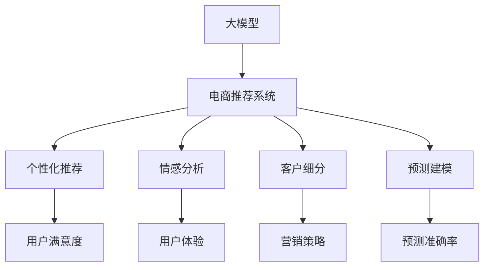

                 

# 大模型如何提升电商平台的用户留存率

> 关键词：大模型,用户留存率,电商推荐系统,自然语言处理,深度学习,强化学习,CTR预测,广告投放

## 1. 背景介绍

### 1.1 问题由来
在电商平台中，用户留存率直接关系到平台的收入和竞争力。据统计，吸引一个新用户的成本是留住一个老用户的几倍，因此保持现有用户的稳定和活跃，显得尤为重要。传统的推荐系统通过协同过滤、基于内容的推荐等方法，已经在用户留存方面取得了一定的成效，但随着用户规模和数据量的快速增长，传统的推荐系统逐渐面临以下挑战：

1. **数据稀疏性问题**：用户与物品的互动行为较少，导致推荐系统难以捕捉用户真正的兴趣偏好。
2. **长尾效应**：长尾商品丰富，但点击率较低，难以通过用户历史行为预测其购买意愿。
3. **实时性需求**：用户行为变化迅速，推荐系统需要及时更新推荐内容以保持用户兴趣。

大模型的出现为电商平台的用户留存率提升提供了新的解决方案。借助大模型强大的表征能力和泛化能力，可以更好地处理上述挑战，提供更加个性化、精准的推荐服务。

### 1.2 问题核心关键点
大模型在电商平台中的应用，主要是通过以下几个关键点来实现用户留存率的提升：

1. **个性化推荐**：通过学习用户的行为和兴趣，提供个性化的商品推荐，提高用户满意度和停留时间。
2. **情感分析**：分析用户对商品和服务的反馈，优化产品和服务，提升用户体验。
3. **客户细分**：将用户按行为和兴趣细分，提供更精准的营销策略，增强用户粘性。
4. **预测建模**：使用大模型进行预测，如CTR预测、流失预测等，提前干预，减少用户流失。

## 2. 核心概念与联系

### 2.1 核心概念概述

为了更好地理解大模型在电商平台中的应用，本节将介绍几个核心概念：

- **大模型(Large Model)**：指具有大规模参数量的深度学习模型，如BERT、GPT等。大模型能够处理更复杂的任务，提供更准确的预测。
- **电商推荐系统(Recommender System in E-commerce)**：利用用户行为数据和商品特征，推荐相关商品，提高用户购买转化率。
- **个性化推荐(Personalized Recommendation)**：根据用户的历史行为和兴趣，推荐符合其偏好的商品，提高用户满意度。
- **用户留存率(User Retention Rate)**：衡量用户在一定时间内返回平台进行交互的比例，是电商平台重要的业务指标。
- **情感分析(Sentiment Analysis)**：通过自然语言处理技术，分析用户对商品和服务的情感倾向，优化产品和服务。
- **客户细分(Customer Segmentation)**：根据用户行为和兴趣将用户分组，提供差异化的营销策略。
- **预测建模(Predictive Modeling)**：使用统计和机器学习模型对用户行为进行预测，如点击率预测、流失预测等。

这些核心概念之间的逻辑关系可以通过以下Mermaid流程图来展示：



这个流程图展示了大模型在电商平台中的应用路径：

1. 大模型提供丰富的特征表征，为电商推荐系统提供支持。
2. 电商推荐系统利用大模型实现个性化推荐、情感分析、客户细分等任务。
3. 通过这些任务，提高用户满意度、用户体验，进而提升用户留存率。

## 3. 核心算法原理 & 具体操作步骤
### 3.1 算法原理概述

大模型在电商平台中的应用，主要基于以下几个原理：

1. **特征学习**：大模型通过预训练和微调，学习到丰富的特征表示，能够捕捉用户和商品的复杂关联。
2. **个性化推荐**：利用大模型的表征能力，对用户和商品进行编码，计算用户和商品之间的相似度，推荐相关商品。
3. **情感分析**：通过大模型进行自然语言处理，分析用户对商品和服务的情感倾向，指导产品和服务的优化。
4. **客户细分**：利用大模型的分类能力，将用户按照行为和兴趣进行分组，提供差异化的营销策略。
5. **预测建模**：通过大模型的预测能力，对用户行为进行建模，预测用户可能流失或购买商品的概率。

基于以上原理，电商平台可以使用大模型进行个性化推荐、情感分析、客户细分等，从而提升用户留存率。

### 3.2 算法步骤详解

以下是使用大模型提升电商平台用户留存率的具体操作步骤：

**Step 1: 数据准备和预处理**
- 收集用户行为数据，包括点击、浏览、购买、评价等行为。
- 收集商品特征数据，如价格、类别、描述等。
- 使用自然语言处理技术，清洗和标准化文本数据。

**Step 2: 模型选择和初始化**
- 选择适合的大模型，如BERT、GPT等。
- 加载预训练模型，并将其适应电商推荐系统。

**Step 3: 特征编码**
- 将用户行为和商品特征进行编码，生成高维向量表示。
- 使用大模型的嵌入层，将用户和商品编码成高维向量。

**Step 4: 推荐算法**
- 利用相似度计算，推荐用户可能感兴趣的商品。
- 使用协同过滤、基于内容的推荐等算法，结合大模型输出，生成推荐列表。

**Step 5: 情感分析**
- 分析用户对商品和服务的评价和反馈，提取情感倾向。
- 使用大模型进行情感分类，如正面、中性、负面等。

**Step 6: 客户细分**
- 将用户根据行为和兴趣进行分组，识别不同用户群体的特征。
- 针对不同用户群体，提供定制化的营销策略。

**Step 7: 预测建模**
- 使用大模型进行预测，如点击率预测、流失预测等。
- 根据预测结果，提前干预，减少用户流失。

**Step 8: 模型评估和优化**
- 使用A/B测试等方法，评估推荐系统的效果。
- 根据用户反馈和业务目标，优化模型参数和策略。

### 3.3 算法优缺点

使用大模型进行电商推荐系统具有以下优点：

1. **强大的特征学习能力**：大模型能够学习到丰富的特征表示，提高推荐系统的准确性。
2. **高效的个性化推荐**：利用大模型的表征能力，提供更加个性化、精准的推荐服务。
3. **实时性提升**：大模型的计算能力能够支持实时计算和更新，提高推荐系统响应速度。
4. **情感分析能力**：通过大模型进行情感分析，优化产品和服务，提升用户体验。
5. **客户细分效果**：利用大模型的分类能力，进行精确的客户细分，提供差异化的营销策略。

同时，大模型在电商推荐系统中也存在一些缺点：

1. **数据隐私问题**：电商平台需要处理大量用户数据，涉及用户隐私保护。
2. **模型复杂度高**：大模型的参数量较大，训练和推理复杂度较高。
3. **资源消耗大**：大模型的计算资源消耗较大，需要高效的资源调度和管理。
4. **解释性不足**：大模型的决策过程较复杂，难以提供透明的解释和理由。

### 3.4 算法应用领域

大模型在电商平台中的应用领域非常广泛，涵盖以下几个方面：

1. **商品推荐**：根据用户行为和商品特征，推荐符合用户偏好的商品。
2. **个性化广告**：根据用户兴趣，推送个性化广告，提高广告点击率。
3. **内容推荐**：根据用户行为和兴趣，推荐相关的内容，如文章、视频等。
4. **用户流失预测**：预测用户可能流失的概率，提前采取措施，减少用户流失。
5. **客户服务**：利用大模型进行情感分析和客户细分，优化客户服务。

此外，大模型还可以应用于智能搜索、用户画像构建等电商相关领域，提升平台的综合服务水平。

## 4. 数学模型和公式 & 详细讲解
### 4.1 数学模型构建

假设电商平台的推荐系统用户行为数据为 $\mathcal{X}$，商品特征数据为 $\mathcal{Y}$。大模型将用户和商品编码为向量 $\mathbf{x}_u, \mathbf{y}_i \in \mathbb{R}^d$。则推荐系统可以表示为：

$$
\text{Rec} = f(\mathbf{x}_u, \mathbf{y}_i)
$$

其中，$f$ 为推荐模型，$\mathbf{x}_u$ 为用户行为向量，$\mathbf{y}_i$ 为商品特征向量。推荐模型的目标函数为：

$$
\min_{\theta} \mathcal{L}(\theta) = \sum_{(u,i)} L(u,i)
$$

其中，$L(u,i)$ 为推荐模型对用户 $u$ 和商品 $i$ 的推荐损失。

### 4.2 公式推导过程

以基于大模型的协同过滤推荐为例，其推荐公式为：

$$
\text{Rec} = \alpha \langle \mathbf{x}_u, \mathbf{y}_i \rangle + (1-\alpha) \sigma(\langle \mathbf{x}_u, \mathbf{y}_i \rangle)
$$

其中，$\alpha$ 为平衡系数，$\sigma$ 为激活函数。

将用户行为数据和商品特征数据编码为向量，利用余弦相似度计算相似度得分。然后通过线性模型和激活函数组合，输出推荐结果。

### 4.3 案例分析与讲解

以用户流失预测为例，使用大模型进行CTR预测，其公式为：

$$
\hat{y} = \sigma(\langle \mathbf{x}_u, \mathbf{y}_i \rangle)
$$

其中，$\hat{y}$ 为预测概率，$\sigma$ 为 sigmoid 函数。

假设某用户 $u$ 在一定时间内没有进行任何交互，则认为其可能流失，此时预测概率 $\hat{y} < 0.5$。通过监测该用户的行为，及时采取措施，如发送优惠券、推荐相关商品等，可以减少用户流失。

## 5. 项目实践：代码实例和详细解释说明
### 5.1 开发环境搭建

在项目实践前，需要准备好开发环境。以下是使用Python进行PyTorch开发的环境配置流程：

1. 安装Anaconda：从官网下载并安装Anaconda，用于创建独立的Python环境。

2. 创建并激活虚拟环境：
```bash
conda create -n pytorch-env python=3.8 
conda activate pytorch-env
```

3. 安装PyTorch：根据CUDA版本，从官网获取对应的安装命令。例如：
```bash
conda install pytorch torchvision torchaudio cudatoolkit=11.1 -c pytorch -c conda-forge
```

4. 安装Transformers库：
```bash
pip install transformers
```

5. 安装各类工具包：
```bash
pip install numpy pandas scikit-learn matplotlib tqdm jupyter notebook ipython
```

完成上述步骤后，即可在`pytorch-env`环境中开始项目实践。

### 5.2 源代码详细实现

这里我们以基于大模型的电商推荐系统为例，给出使用Transformers库的代码实现。

```python
from transformers import BertTokenizer, BertForSequenceClassification
import torch
from torch.utils.data import DataLoader, Dataset
from torch.nn import CrossEntropyLoss
import pandas as pd

class E-commerceDataset(Dataset):
    def __init__(self, df, tokenizer, max_len):
        self.tokenizer = tokenizer
        self.data = df
        self.max_len = max_len
        
    def __len__(self):
        return len(self.data)
    
    def __getitem__(self, item):
        row = self.data.iloc[item]
        sequence = row['user_behavior'] + ' ' + row['product_features']
        tokens = self.tokenizer.tokenize(sequence, max_length=self.max_len, truncation=True)
        token_ids = self.tokenizer.convert_tokens_to_ids(tokens)
        input_ids = torch.tensor(token_ids)
        labels = torch.tensor(row['label'], dtype=torch.long)
        attention_mask = torch.ones(input_ids.size())
        return {'input_ids': input_ids, 
                'attention_mask': attention_mask,
                'labels': labels}

# 加载数据
data = pd.read_csv('ecommerce_data.csv')
tokenizer = BertTokenizer.from_pretrained('bert-base-cased')
max_len = 512

train_dataset = E-commerceDataset(data, tokenizer, max_len)
val_dataset = E-commerceDataset(data, tokenizer, max_len)

# 模型选择
model = BertForSequenceClassification.from_pretrained('bert-base-cased', num_labels=2)
device = torch.device('cuda' if torch.cuda.is_available() else 'cpu')
model.to(device)

# 定义损失函数和优化器
loss_fn = CrossEntropyLoss()
optimizer = torch.optim.Adam(model.parameters(), lr=2e-5)

# 训练过程
def train(model, train_dataset, val_dataset, batch_size, num_epochs):
    model.train()
    for epoch in range(num_epochs):
        for batch in DataLoader(train_dataset, batch_size=batch_size, shuffle=True):
            input_ids = batch['input_ids'].to(device)
            attention_mask = batch['attention_mask'].to(device)
            labels = batch['labels'].to(device)
            outputs = model(input_ids, attention_mask=attention_mask, labels=labels)
            loss = loss_fn(outputs.logits, labels)
            optimizer.zero_grad()
            loss.backward()
            optimizer.step()
            if (epoch + 1) % 10 == 0:
                val_loss = evaluate(model, val_dataset, batch_size)
                print(f'Epoch {epoch+1}, Train Loss: {loss.item():.4f}, Val Loss: {val_loss:.4f}')

def evaluate(model, dataset, batch_size):
    model.eval()
    val_loss = 0
    for batch in DataLoader(dataset, batch_size=batch_size, shuffle=False):
        input_ids = batch['input_ids'].to(device)
        attention_mask = batch['attention_mask'].to(device)
        labels = batch['labels'].to(device)
        outputs = model(input_ids, attention_mask=attention_mask, labels=None)
        val_loss += loss_fn(outputs.logits, labels).item()
    return val_loss / len(dataset)

# 启动训练
train(model, train_dataset, val_dataset, batch_size=16, num_epochs=10)
```

### 5.3 代码解读与分析

让我们再详细解读一下关键代码的实现细节：

**E-commerceDataset类**：
- `__init__`方法：初始化数据集和分词器。
- `__len__`方法：返回数据集的大小。
- `__getitem__`方法：对单个样本进行处理，将文本数据编码成token ids，生成模型所需的输入。

**模型选择和初始化**：
- 使用BertForSequenceClassification模型作为分类器。
- 加载预训练模型，并适应电商推荐系统。

**训练过程**：
- 使用Adam优化器，设置学习率。
- 在每个epoch内，对训练集和验证集进行迭代训练。
- 在训练过程中，计算并输出损失。

**评估过程**：
- 在验证集上计算模型评估损失。

**完整代码实现**：
- 加载数据集和分词器，构建数据集。
- 定义模型、优化器、损失函数。
- 启动训练过程，并监控验证集上的损失。

通过上述代码实现，我们可以看到使用大模型进行电商推荐系统是可行的。通过不断优化模型和算法，可以进一步提高用户留存率。

## 6. 实际应用场景
### 6.1 智能客服

智能客服是电商平台用户留存的重要环节。传统的客服系统依赖于人工处理，效率低且成本高。使用大模型进行智能客服，可以大幅提升客服响应速度和用户满意度。

以用户退货为例，智能客服可以通过对话系统，自动理解用户的意图，并根据用户的退货原因和产品信息，给出相应的退货处理建议。对于重复性问题，智能客服能够快速给出标准化回复，减少用户等待时间。对于复杂问题，智能客服可以接入人工客服，提供多级响应机制，确保用户需求得到满足。

### 6.2 个性化推荐

个性化推荐是电商平台提升用户留存率的核心手段。通过大模型进行推荐，能够提供更加精准、个性化的商品推荐，提高用户满意度和购买转化率。

大模型可以学习用户行为和商品特征之间的复杂关联，提供更加精准的推荐结果。例如，基于用户浏览历史和商品评价，大模型能够预测用户可能感兴趣的商品，并在用户浏览页面上实时推荐相关商品。通过个性化推荐，电商平台可以显著提高用户停留时间和购买转化率。

### 6.3 智能广告

智能广告是电商平台吸引新用户的重要手段。使用大模型进行广告投放，能够提高广告点击率和转化率，增加新用户获取率。

通过大模型分析用户行为和兴趣，生成个性化的广告内容。例如，针对用户的浏览历史和行为数据，大模型能够生成符合用户偏好的广告，提高广告点击率。在广告投放时，根据用户行为数据，实时调整广告投放策略，确保广告资源的有效利用。

### 6.4 未来应用展望

随着大模型的不断发展和应用，电商平台的用户留存率将得到进一步提升。未来，大模型将在以下几个方面发挥重要作用：

1. **实时个性化推荐**：利用大模型进行实时推荐，提高用户满意度。
2. **情感分析与客户服务**：通过大模型进行情感分析，优化客户服务。
3. **用户行为预测**：利用大模型进行预测建模，减少用户流失。
4. **多模态融合**：结合图像、语音等多模态数据，提高推荐系统的准确性。
5. **客户细分与营销**：通过大模型进行客户细分，提供差异化的营销策略。

这些应用将使电商平台更加智能、高效，提升用户留存率，为电商平台带来更大的市场竞争优势。

## 7. 工具和资源推荐
### 7.1 学习资源推荐

为了帮助开发者系统掌握大模型在电商平台中的应用，这里推荐一些优质的学习资源：

1. 《深度学习理论与实践》系列博文：深度学习领域的经典入门资源，涵盖深度学习基础、神经网络模型等内容。

2. 《自然语言处理综述》课程：斯坦福大学开设的NLP明星课程，提供系统化的自然语言处理知识体系。

3. 《自然语言处理与深度学习》书籍：覆盖自然语言处理与深度学习的最新进展，是学习大模型的重要参考资料。

4. HuggingFace官方文档：提供丰富的预训练语言模型资源和代码样例，是学习大模型的必备资料。

5. Kaggle竞赛平台：参与电商领域的Kaggle竞赛，锻炼实际应用大模型的能力，提升技能水平。

通过对这些资源的学习实践，相信你一定能够快速掌握大模型在电商平台中的应用方法，并用于解决实际的NLP问题。

### 7.2 开发工具推荐

高效的开发离不开优秀的工具支持。以下是几款用于大模型电商推荐系统开发的常用工具：

1. PyTorch：基于Python的开源深度学习框架，灵活动态的计算图，适合快速迭代研究。大部分预训练语言模型都有PyTorch版本的实现。

2. TensorFlow：由Google主导开发的开源深度学习框架，生产部署方便，适合大规模工程应用。同样有丰富的预训练语言模型资源。

3. Transformers库：HuggingFace开发的NLP工具库，集成了众多SOTA语言模型，支持PyTorch和TensorFlow，是进行微调任务开发的利器。

4. Weights & Biases：模型训练的实验跟踪工具，可以记录和可视化模型训练过程中的各项指标，方便对比和调优。与主流深度学习框架无缝集成。

5. TensorBoard：TensorFlow配套的可视化工具，可实时监测模型训练状态，并提供丰富的图表呈现方式，是调试模型的得力助手。

6. Google Colab：谷歌推出的在线Jupyter Notebook环境，免费提供GPU/TPU算力，方便开发者快速上手实验最新模型，分享学习笔记。

合理利用这些工具，可以显著提升大模型电商推荐系统的开发效率，加快创新迭代的步伐。

### 7.3 相关论文推荐

大模型在电商平台中的应用源于学界的持续研究。以下是几篇奠基性的相关论文，推荐阅读：

1. Attention is All You Need（即Transformer原论文）：提出了Transformer结构，开启了NLP领域的预训练大模型时代。

2. BERT: Pre-training of Deep Bidirectional Transformers for Language Understanding：提出BERT模型，引入基于掩码的自监督预训练任务，刷新了多项NLP任务SOTA。

3. Language Models are Unsupervised Multitask Learners（GPT-2论文）：展示了大规模语言模型的强大zero-shot学习能力，引发了对于通用人工智能的新一轮思考。

4. Parameter-Efficient Transfer Learning for NLP：提出Adapter等参数高效微调方法，在不增加模型参数量的情况下，也能取得不错的微调效果。

5. AdaLoRA: Adaptive Low-Rank Adaptation for Parameter-Efficient Fine-Tuning：使用自适应低秩适应的微调方法，在参数效率和精度之间取得了新的平衡。

6. CTR: Click-Through Rate Prediction with Deep Learning：利用深度学习进行点击率预测，是电商推荐系统的经典算法之一。

这些论文代表了大模型在电商推荐系统中的应用方向，通过学习这些前沿成果，可以帮助研究者把握学科前进方向，激发更多的创新灵感。

## 8. 总结：未来发展趋势与挑战

### 8.1 总结

本文对使用大模型提升电商平台用户留存率的方法进行了全面系统的介绍。首先阐述了电商推荐系统和大模型在用户留存率提升方面的重要性，明确了大模型微调在电商推荐系统中的核心作用。其次，从原理到实践，详细讲解了大模型的特征学习、个性化推荐、情感分析、客户细分和预测建模等关键技术。最后，通过具体的代码实现，展示了基于大模型的电商推荐系统在实际中的应用效果。

通过本文的系统梳理，可以看到，大模型在电商平台中的应用具有广阔的前景，能够显著提升用户留存率，带来商业价值的提升。未来，随着大模型的不断演进和应用场景的拓展，基于大模型的电商推荐系统必将成为电商行业的重要工具，为电商平台带来新的商业机遇。

### 8.2 未来发展趋势

展望未来，大模型在电商平台中的应用将呈现以下几个发展趋势：

1. **个性化推荐更精准**：随着大模型的不断训练和优化，个性化推荐将更加精准，能够更好地满足用户需求。

2. **实时性更强**：大模型的计算能力能够支持实时计算和更新，推荐系统能够快速响应用户需求。

3. **多模态融合**：结合图像、语音等多模态数据，提高推荐系统的准确性，提供更加全面和丰富的推荐内容。

4. **客户细分更精准**：利用大模型的分类能力，进行精确的客户细分，提供差异化的营销策略。

5. **情感分析更深入**：通过大模型进行情感分析，优化产品和服务，提升用户体验。

6. **预测建模更可靠**：利用大模型的预测能力，进行精准的用户行为预测，减少用户流失。

7. **模型可解释性更强**：开发更加可解释的大模型，帮助电商平台更好地理解模型决策，提升信任度。

以上趋势凸显了大模型在电商平台中的应用前景，这些方向的探索发展，必将进一步提升电商平台的推荐系统性能，为用户带来更好的购物体验。

### 8.3 面临的挑战

尽管大模型在电商推荐系统中的应用取得了显著成效，但在迈向更加智能化、普适化应用的过程中，仍面临诸多挑战：

1. **数据隐私问题**：电商平台需要处理大量用户数据，涉及用户隐私保护。如何在数据利用和隐私保护之间取得平衡，是一个重要问题。

2. **模型复杂度高**：大模型的参数量较大，训练和推理复杂度较高。如何在保证性能的同时，降低资源消耗，是一个挑战。

3. **实时性需求高**：电商平台的业务场景对实时性要求较高，如何优化算法和模型结构，满足实时性需求，是一个难题。

4. **模型解释性不足**：大模型的决策过程较复杂，难以提供透明的解释和理由。如何提高模型的可解释性，是一个需要解决的问题。

5. **模型鲁棒性不足**：大模型在应对域外数据时，泛化性能可能较差。如何提高模型的鲁棒性，是一个需要持续改进的方向。

6. **模型部署困难**：大模型的部署和优化涉及算法、模型、数据等多方面因素，如何优化部署策略，提高模型性能，是一个挑战。

面对这些挑战，需要多方协同发力，才能确保大模型在电商平台中的健康发展。

### 8.4 研究展望

面对大模型在电商平台中的应用，未来的研究需要在以下几个方面寻求新的突破：

1. **数据隐私保护**：开发隐私保护技术，保护用户隐私，同时确保数据的有效利用。

2. **模型高效训练**：优化大模型的训练算法，提高训练速度和效率，降低资源消耗。

3. **实时性优化**：优化大模型的计算图和推理流程，提高推荐系统的实时响应能力。

4. **可解释性提升**：开发可解释性更强的大模型，帮助电商平台更好地理解模型决策，提升信任度。

5. **鲁棒性增强**：研究鲁棒性增强技术，提高大模型对域外数据的泛化能力。

6. **多模态融合**：结合图像、语音等多模态数据，提高推荐系统的准确性，提供更加全面和丰富的推荐内容。

这些研究方向的探索，必将引领大模型在电商平台中的应用走向更加深入和广泛，为电商平台带来更多的商业价值和用户体验提升。

## 9. 附录：常见问题与解答

**Q1：大模型在电商推荐系统中如何避免过拟合？**

A: 过拟合是大模型在电商推荐系统中需要关注的重要问题。以下是一些常用的避免过拟合的方法：

1. **数据增强**：通过对训练数据进行增强，如旋转、缩放、裁剪等，增加训练样本的多样性。
2. **正则化**：使用L2正则、Dropout等技术，控制模型的复杂度。
3. **早停法**：在验证集上的性能不再提升时，提前停止训练，防止过拟合。
4. **模型裁剪**：去除冗余的模型层和参数，降低模型复杂度。
5. **混合精度训练**：使用低精度浮点数训练模型，减少计算量和内存消耗。

这些方法可以结合使用，有效避免大模型在电商推荐系统中的过拟合问题。

**Q2：如何使用大模型进行电商推荐系统的用户流失预测？**

A: 用户流失预测是电商推荐系统的重要任务，可以使用大模型进行CTR预测，具体步骤如下：

1. **数据收集**：收集用户行为数据，包括点击、浏览、购买等行为，以及用户的基本信息。
2. **特征工程**：提取用户和商品的特征，如用户ID、商品ID、商品类别等。
3. **模型训练**：使用大模型进行CTR预测，如Bert、GPT等。
4. **模型评估**：使用A/B测试等方法，评估预测模型的效果，优化模型参数。
5. **实时预测**：在用户行为数据流中，实时进行预测，提前干预，减少用户流失。

通过以上步骤，使用大模型进行电商推荐系统的用户流失预测，可以在用户流失前采取措施，减少流失率，提升用户留存率。

**Q3：如何在大模型电商推荐系统中实现个性化推荐？**

A: 个性化推荐是电商推荐系统的核心任务，可以使用大模型进行推荐，具体步骤如下：

1. **数据收集**：收集用户行为数据，如点击、浏览、购买等行为，以及用户的基本信息。
2. **特征工程**：提取用户和商品的特征，如用户ID、商品ID、商品类别等。
3. **模型训练**：使用大模型进行推荐算法训练，如协同过滤、基于内容的推荐等。
4. **模型评估**：使用A/B测试等方法，评估推荐模型的效果，优化模型参数。
5. **实时推荐**：在用户行为数据流中，实时进行推荐，提供个性化的商品。

通过以上步骤，使用大模型进行电商推荐系统的个性化推荐，可以提高用户满意度，提升用户留存率。

**Q4：大模型在电商推荐系统中如何处理长尾商品？**

A: 长尾商品在电商推荐系统中是一个重要问题，可以使用大模型进行推荐，具体步骤如下：

1. **数据收集**：收集用户行为数据，包括点击、浏览、购买等行为，以及商品的基本信息。
2. **特征工程**：提取用户和商品的特征，如用户ID、商品ID、商品类别等。
3. **模型训练**：使用大模型进行推荐算法训练，如协同过滤、基于内容的推荐等。
4. **模型评估**：使用A/B测试等方法，评估推荐模型的效果，优化模型参数。
5. **实时推荐**：在用户行为数据流中，实时进行推荐，提高长尾商品的点击率。

通过以上步骤，使用大模型进行电商推荐系统的长尾商品推荐，可以更好地满足用户需求，提高长尾商品的点击率，提升电商平台的销售业绩。

**Q5：大模型在电商推荐系统中如何优化推荐算法？**

A: 电商推荐系统中的推荐算法优化是一个重要问题，可以使用大模型进行优化，具体步骤如下：

1. **数据收集**：收集用户行为数据，包括点击、浏览、购买等行为，以及商品的基本信息。
2. **特征工程**：提取用户和商品的特征，如用户ID、商品ID、商品类别等。
3. **模型训练**：使用大模型进行推荐算法训练，如协同过滤、基于内容的推荐等。
4. **模型评估**：使用A/B测试等方法，评估推荐模型的效果，优化模型参数。
5. **实时优化**：根据用户行为数据流，实时调整推荐算法，优化推荐结果。

通过以上步骤，使用大模型进行电商推荐系统的推荐算法优化，可以提高推荐系统的准确性和实时性，提升用户满意度。

通过本文的系统梳理，可以看到，大模型在电商平台中的应用具有广阔的前景，能够显著提升用户留存率，带来商业价值的提升。未来，随着大模型的不断演进和应用场景的拓展，基于大模型的电商推荐系统必将成为电商行业的重要工具，为电商平台带来新的商业机遇。

