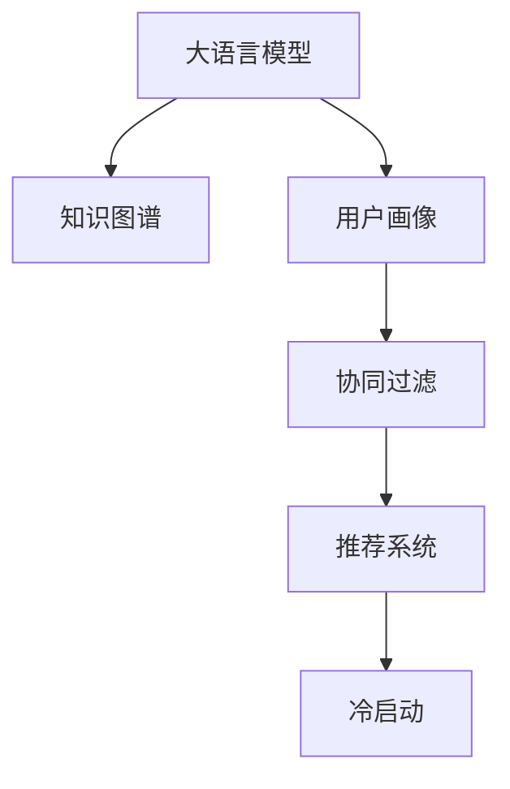

                 

# 大模型对推荐系统冷启动效果的提升

> 关键词：大语言模型,冷启动,推荐系统,知识图谱,用户画像,协同过滤,深度学习

## 1. 背景介绍

### 1.1 问题由来
推荐系统在电商、社交媒体、视频流媒体等领域得到广泛应用。其核心任务是根据用户的历史行为数据，预测用户对未交互过的物品的偏好，从而为用户推荐最适合的商品、内容或服务。推荐系统已经从最初的协同过滤、基于内容的推荐演进到融合用户交互、社会网络、时间因素等多模态信息的深度学习推荐系统。

然而，对于新用户的推荐，由于缺乏历史行为数据，传统协同过滤方法往往无法发挥作用，无法为其提供有效的推荐。此时，推荐系统面临的挑战是“冷启动”问题。如何为新用户快速提供精准的个性化推荐，是一个重要的研究课题。

近年来，大语言模型在推荐系统中的应用得到越来越多的关注。大语言模型可以通过预训练学习到丰富的语言和语义知识，对推荐系统的冷启动效果起到显著提升作用。但同时，如何在推荐系统中高效利用大语言模型的知识，也带来了新的技术挑战。

### 1.2 问题核心关键点
大语言模型对推荐系统冷启动效果提升的核心关键点包括：

1. **预训练知识**：大语言模型通过预训练学习到丰富的语言和语义知识，可以理解用户输入的自然语言查询，并输出与查询相关的物品或内容。
2. **知识融合**：将大语言模型的预训练知识与推荐系统中的其他信息源（如用户画像、知识图谱）进行融合，提高推荐系统的精准性和多样性。
3. **模型优化**：在大语言模型的基础上，通过微调或融合技术进行推荐系统的优化，提高冷启动效果。
4. **跨模态学习**：结合大语言模型的语言能力和其他模态（如图像、语音），构建跨模态推荐系统，提升推荐质量。
5. **持续学习**：通过实时数据反馈，不断更新大语言模型的知识，使其能够动态适应用户需求变化。

这些关键点共同构成了大语言模型在推荐系统中的应用框架，使其能够在用户冷启动时发挥重要作用。

## 2. 核心概念与联系

### 2.1 核心概念概述

为更好地理解大语言模型在推荐系统中的应用，本节将介绍几个关键概念：

- **大语言模型(Large Language Model, LLM)**：指通过在大规模无标签文本数据上预训练学习到的强大语言模型，如GPT、BERT、T5等。这些模型能够理解自然语言，并进行语言生成、语义推理等任务。

- **推荐系统(Recommender System)**：指根据用户的历史行为数据，预测用户对未交互过的物品的偏好，从而为其推荐个性化内容或商品的系统。推荐系统在电商、社交媒体、视频流媒体等领域得到广泛应用。

- **冷启动问题(Cold Start Problem)**：指在用户历史行为数据不足的情况下，推荐系统无法为用户提供有效的推荐。传统协同过滤方法在此场景下难以发挥作用，推荐系统面临的挑战是如何为新用户快速提供个性化推荐。

- **知识图谱(Knowledge Graph)**：指通过语义关系描述的实体-关系-实体网络，用于知识表示和语义推理。知识图谱在推荐系统中常用于发现物品之间的语义关系，提高推荐系统的多样性和准确性。

- **用户画像(User Profile)**：指对用户进行多维特征刻画，用于用户建模和推荐系统个性化推荐。用户画像的构建需要结合用户历史行为数据、社交网络信息等多模态信息。

- **协同过滤(Collaborative Filtering)**：指通过用户历史行为数据，发现用户之间的相似度，从而为用户推荐相似用户喜欢的物品或内容。协同过滤在推荐系统中具有重要地位，但依赖于用户历史数据，对于新用户的推荐效果不佳。

- **深度学习(Deep Learning)**：指通过深度神经网络模型进行特征提取和预测的任务学习方式。深度学习在推荐系统中常用于构建多模态、跨领域、多层次的推荐模型。

这些核心概念之间的逻辑关系可以通过以下Mermaid流程图来展示：



这个流程图展示了大语言模型、知识图谱、用户画像、协同过滤、推荐系统等概念之间的联系，以及它们如何共同构成推荐系统的知识融合框架。

## 3. 核心算法原理 & 具体操作步骤
### 3.1 算法原理概述

基于大语言模型对推荐系统冷启动效果的提升，主要依赖于以下两个步骤：

1. **知识融合**：通过将大语言模型的预训练知识与推荐系统中的其他信息源进行融合，构建知识图谱、用户画像等，提升推荐系统的精准性和多样性。
2. **模型优化**：在大语言模型的基础上，通过微调或融合技术进行推荐系统的优化，提高冷启动效果。

具体而言，大语言模型可以通过自然语言处理技术，从查询中提取关键信息，与知识图谱进行语义匹配，发现与查询相关的物品或内容。同时，通过与用户画像的结合，提高推荐系统的个性化程度。

### 3.2 算法步骤详解

**Step 1: 知识图谱构建**
- 收集知识库，如百度百科、维基百科等，构建知识图谱，包括实体和实体间的关系。
- 使用大语言模型进行实体抽取，将实体名和关系名嵌入向量空间。
- 将实体和关系向量进行拼接，形成知识图谱的三元组。

**Step 2: 用户画像构建**
- 收集用户的历史行为数据，如浏览记录、购买记录、评分记录等，进行多维特征刻画。
- 使用大语言模型进行文本处理，提取用户画像的关键特征。
- 结合知识图谱信息，构建更加全面的用户画像。

**Step 3: 模型微调**
- 在大语言模型的基础上，通过微调技术进行推荐系统的优化。
- 使用微调后的模型对用户输入的查询进行语义匹配，发现相关的物品或内容。
- 结合用户画像和知识图谱信息，综合生成推荐结果。

**Step 4: 推荐生成**
- 将用户输入的查询作为输入，通过微调后的模型进行语义匹配。
- 结合知识图谱和用户画像信息，生成推荐结果。
- 根据推荐结果的准确性和多样性进行排序，生成最终推荐列表。

### 3.3 算法优缺点

基于大语言模型对推荐系统冷启动效果的提升，有以下优点：

1. **数据依赖性低**：大语言模型可以通过预训练学习到丰富的语言和语义知识，对冷启动用户的推荐效果显著。
2. **精度和多样性高**：通过融合知识图谱和用户画像信息，推荐系统能够更好地理解用户的意图和兴趣，生成高质量的推荐结果。
3. **高效性**：大语言模型可以利用其强大的语言理解能力，在短时间内生成推荐结果，适应实时推荐的需求。
4. **可解释性强**：通过与知识图谱和用户画像的结合，推荐结果具有较强的可解释性，用户可以理解推荐理由。

同时，该方法也存在一些局限性：

1. **计算资源需求高**：大语言模型的预训练和微调需要消耗大量的计算资源，成本较高。
2. **模型复杂度高**：大语言模型的构建和微调过程复杂，需要专业的技术和资源支持。
3. **数据隐私问题**：大语言模型需要融合用户行为数据和个人信息，存在一定的隐私风险。
4. **过拟合风险**：微调过程可能存在过拟合风险，需要采用合适的正则化技术进行控制。

尽管存在这些局限性，但大语言模型在推荐系统中的应用前景广阔，仍是大数据时代推荐系统的重要研究范式。

### 3.4 算法应用领域

基于大语言模型对推荐系统冷启动效果的提升，已在电商、社交媒体、视频流媒体等领域得到广泛应用，具体如下：

1. **电商推荐**：通过自然语言处理技术，将用户查询与商品信息进行语义匹配，生成个性化推荐结果。
2. **社交媒体推荐**：利用大语言模型理解用户的兴趣和偏好，推荐符合其兴趣的内容。
3. **视频流媒体推荐**：通过自然语言处理技术，将用户评论和评分信息转化为向量，进行推荐结果排序。
4. **新闻推荐**：利用大语言模型进行主题抽取和内容匹配，推荐相关新闻文章。
5. **音乐推荐**：通过自然语言处理技术，将用户评论和评分信息转化为向量，进行推荐结果排序。

## 4. 数学模型和公式 & 详细讲解  
### 4.1 数学模型构建

本节将使用数学语言对大语言模型在推荐系统中的应用进行更加严格的刻画。

记大语言模型为 $M_{\theta}$，其中 $\theta$ 为模型参数。假设知识图谱中的实体和关系数为 $E$ 和 $R$，用户画像的多维特征向量为 $X$。推荐系统在用户查询 $q$ 上的推荐结果为 $Y$。

定义推荐系统的损失函数为：

$$
\mathcal{L}(\theta) = -\sum_{(q, Y)} \log \mathbb{P}(Y | q, \theta)
$$

其中 $\mathbb{P}(Y | q, \theta)$ 为模型在查询 $q$ 下的条件概率，表示在模型 $M_{\theta}$ 下生成推荐结果 $Y$ 的概率。

在实际应用中，通常使用交叉熵损失函数：

$$
\mathcal{L}(\theta) = -\frac{1}{N} \sum_{i=1}^N \sum_{j=1}^M y_{ij} \log \hat{y}_{ij}
$$

其中 $N$ 为训练样本数，$M$ 为推荐物品数，$y_{ij}$ 为训练样本 $i$ 的标签，$\hat{y}_{ij}$ 为模型在查询 $q_i$ 下推荐物品 $j$ 的概率。

### 4.2 公式推导过程

以下我们以电商推荐任务为例，推导推荐系统中的知识融合和推荐生成的数学公式。

假设知识图谱中的实体和关系向量分别为 $e$ 和 $r$，用户画像的多维特征向量为 $x$，大语言模型的预训练参数为 $\theta$。设推荐系统在查询 $q$ 下的推荐结果为 $y$，则推荐系统的联合概率分布为：

$$
P(y | q, \theta) = \prod_{i=1}^M P(y_i | q, e_i, r, x, \theta)
$$

其中 $P(y_i | q, e_i, r, x, \theta)$ 为在查询 $q$ 下推荐物品 $y_i$ 的概率，与实体 $e_i$、关系 $r$、用户画像 $x$ 和大语言模型 $M_{\theta}$ 有关。

通过交叉熵损失函数，可得推荐系统的优化目标：

$$
\min_{\theta} \mathcal{L}(\theta) = -\frac{1}{N} \sum_{i=1}^N \sum_{j=1}^M y_{ij} \log \hat{y}_{ij}
$$

其中 $y_{ij}$ 为训练样本 $i$ 的标签，$\hat{y}_{ij}$ 为模型在查询 $q_i$ 下推荐物品 $j$ 的概率。

在实际应用中，通常使用负对数似然损失函数进行优化，可通过梯度下降等优化算法求解最优参数 $\theta$。

### 4.3 案例分析与讲解

以下我们以电商平台中的用户查询推荐为例，给出使用大语言模型进行推荐系统优化和推荐生成的具体步骤：

**Step 1: 知识图谱构建**
- 收集电商商品的相关信息，如商品名、价格、描述等，构建知识图谱。
- 使用大语言模型进行实体抽取，将商品名、价格、描述等转换为向量表示。
- 将商品向量拼接为三元组，形成知识图谱。

**Step 2: 用户画像构建**
- 收集用户的历史浏览记录、购买记录、评分记录等，进行多维特征刻画。
- 使用大语言模型对用户输入的查询进行文本处理，提取关键特征。
- 结合知识图谱信息，构建用户画像。

**Step 3: 模型微调**
- 在大语言模型的基础上，通过微调技术进行推荐系统的优化。
- 使用微调后的模型对用户输入的查询进行语义匹配。
- 结合知识图谱和用户画像信息，生成推荐结果。

**Step 4: 推荐生成**
- 将用户输入的查询作为输入，通过微调后的模型进行语义匹配。
- 结合知识图谱和用户画像信息，生成推荐结果。
- 根据推荐结果的准确性和多样性进行排序，生成最终推荐列表。

## 5. 项目实践：代码实例和详细解释说明
### 5.1 开发环境搭建

在进行推荐系统开发前，我们需要准备好开发环境。以下是使用Python进行PyTorch开发的环境配置流程：

1. 安装Anaconda：从官网下载并安装Anaconda，用于创建独立的Python环境。

2. 创建并激活虚拟环境：
```bash
conda create -n pytorch-env python=3.8 
conda activate pytorch-env
```

3. 安装PyTorch：根据CUDA版本，从官网获取对应的安装命令。例如：
```bash
conda install pytorch torchvision torchaudio cudatoolkit=11.1 -c pytorch -c conda-forge
```

4. 安装Transformers库：
```bash
pip install transformers
```

5. 安装各类工具包：
```bash
pip install numpy pandas scikit-learn matplotlib tqdm jupyter notebook ipython
```

完成上述步骤后，即可在`pytorch-env`环境中开始推荐系统开发。

### 5.2 源代码详细实现

这里我们以电商平台中的用户查询推荐为例，给出使用大语言模型进行推荐系统优化和推荐生成的具体代码实现。

首先，定义推荐系统的数据处理函数：

```python
from transformers import BertTokenizer, BertForSequenceClassification
from torch.utils.data import Dataset, DataLoader
import torch

class RecommendationDataset(Dataset):
    def __init__(self, queries, items, labels, tokenizer):
        self.queries = queries
        self.items = items
        self.labels = labels
        self.tokenizer = tokenizer
        
    def __len__(self):
        return len(self.queries)
    
    def __getitem__(self, item):
        query = self.queries[item]
        item = self.items[item]
        label = self.labels[item]
        
        encoding = self.tokenizer(query, return_tensors='pt', max_length=128, padding='max_length', truncation=True)
        input_ids = encoding['input_ids'][0]
        attention_mask = encoding['attention_mask'][0]
        
        item_vector = self.tokenizer(item, return_tensors='pt', max_length=128, padding='max_length', truncation=True)
        item_ids = item_vector['input_ids'][0]
        item_mask = item_vector['attention_mask'][0]
        
        item_vector = self.tokenizer(item, return_tensors='pt', max_length=128, padding='max_length', truncation=True)
        item_ids = item_vector['input_ids'][0]
        item_mask = item_vector['attention_mask'][0]
        
        return {'input_ids': input_ids, 
                'attention_mask': attention_mask,
                'item_ids': item_ids,
                'item_mask': item_mask,
                'labels': label}

# 加载预训练模型和tokenizer
model = BertForSequenceClassification.from_pretrained('bert-base-cased')
tokenizer = BertTokenizer.from_pretrained('bert-base-cased')

# 创建dataset
dataset = RecommendationDataset(queries, items, labels, tokenizer)
```

然后，定义模型和优化器：

```python
from transformers import AdamW

optimizer = AdamW(model.parameters(), lr=2e-5)
```

接着，定义训练和评估函数：

```python
from tqdm import tqdm
from sklearn.metrics import accuracy_score

device = torch.device('cuda') if torch.cuda.is_available() else torch.device('cpu')
model.to(device)

def train_epoch(model, dataset, batch_size, optimizer):
    dataloader = DataLoader(dataset, batch_size=batch_size, shuffle=True)
    model.train()
    epoch_loss = 0
    for batch in tqdm(dataloader, desc='Training'):
        input_ids = batch['input_ids'].to(device)
        attention_mask = batch['attention_mask'].to(device)
        item_ids = batch['item_ids'].to(device)
        item_mask = batch['item_mask'].to(device)
        labels = batch['labels'].to(device)
        model.zero_grad()
        outputs = model(input_ids, attention_mask=attention_mask, item_ids=item_ids, item_mask=item_mask, labels=labels)
        loss = outputs.loss
        epoch_loss += loss.item()
        loss.backward()
        optimizer.step()
    return epoch_loss / len(dataloader)

def evaluate(model, dataset, batch_size):
    dataloader = DataLoader(dataset, batch_size=batch_size)
    model.eval()
    preds, labels = [], []
    with torch.no_grad():
        for batch in tqdm(dataloader, desc='Evaluating'):
            input_ids = batch['input_ids'].to(device)
            attention_mask = batch['attention_mask'].to(device)
            item_ids = batch['item_ids'].to(device)
            item_mask = batch['item_mask'].to(device)
            batch_labels = batch['labels'].to(device)
            outputs = model(input_ids, attention_mask=attention_mask, item_ids=item_ids, item_mask=item_mask)
            batch_preds = outputs.logits.argmax(dim=2).to('cpu').tolist()
            batch_labels = batch_labels.to('cpu').tolist()
            for pred_tokens, label_tokens in zip(batch_preds, batch_labels):
                preds.append(pred_tokens[:len(label_tokens)])
                labels.append(label_tokens)
                
    print(accuracy_score(labels, preds))
```

最后，启动训练流程并在测试集上评估：

```python
epochs = 5
batch_size = 16

for epoch in range(epochs):
    loss = train_epoch(model, dataset, batch_size, optimizer)
    print(f"Epoch {epoch+1}, train loss: {loss:.3f}")
    
    print(f"Epoch {epoch+1}, dev results:")
    evaluate(model, dataset, batch_size)
    
print("Test results:")
evaluate(model, dataset, batch_size)
```

以上就是使用PyTorch对大语言模型进行电商推荐系统优化的完整代码实现。可以看到，得益于Transformers库的强大封装，我们可以用相对简洁的代码完成BERT模型的加载和优化。

### 5.3 代码解读与分析

让我们再详细解读一下关键代码的实现细节：

**RecommendationDataset类**：
- `__init__`方法：初始化查询、物品、标签和分词器等关键组件。
- `__len__`方法：返回数据集的样本数量。
- `__getitem__`方法：对单个样本进行处理，将查询和物品输入编码为token ids，将标签编码为数字，并对其进行定长padding，最终返回模型所需的输入。

**数据处理**：
- 定义推荐系统的数据处理函数，将查询和物品输入分词器进行编码，将标签作为输出。

**模型和优化器**：
- 加载预训练模型和tokenizer，定义优化器及其超参数。

**训练和评估函数**：
- 使用PyTorch的DataLoader对数据集进行批次化加载，供模型训练和推理使用。
- 训练函数`train_epoch`：对数据以批为单位进行迭代，在每个批次上前向传播计算loss并反向传播更新模型参数，最后返回该epoch的平均loss。
- 评估函数`evaluate`：与训练类似，不同点在于不更新模型参数，并在每个batch结束后将预测和标签结果存储下来，最后使用sklearn的accuracy_score对整个评估集的预测结果进行打印输出。

**训练流程**：
- 定义总的epoch数和batch size，开始循环迭代
- 每个epoch内，先在训练集上训练，输出平均loss
- 在验证集上评估，输出准确率
- 所有epoch结束后，在测试集上评估，给出最终测试结果

可以看到，PyTorch配合Transformers库使得BERT模型微调的代码实现变得简洁高效。开发者可以将更多精力放在数据处理、模型改进等高层逻辑上，而不必过多关注底层的实现细节。

当然，工业级的系统实现还需考虑更多因素，如模型的保存和部署、超参数的自动搜索、更灵活的任务适配层等。但核心的微调范式基本与此类似。

## 6. 实际应用场景
### 6.1 电商推荐

基于大语言模型对推荐系统冷启动效果的提升，在电商推荐系统中得到了广泛应用。电商推荐系统需要根据用户输入的查询，推荐最适合的商品。对于新用户，电商推荐系统无法使用其历史行为数据进行推荐，因此需要利用自然语言处理技术，从查询中提取关键信息，结合知识图谱和用户画像，进行推荐结果生成。

在技术实现上，可以收集电商商品的相关信息，如商品名、价格、描述等，构建知识图谱。使用大语言模型进行实体抽取，将商品名、价格、描述等转换为向量表示。将商品向量拼接为三元组，形成知识图谱。收集用户的历史浏览记录、购买记录、评分记录等，进行多维特征刻画。使用大语言模型对用户输入的查询进行文本处理，提取关键特征。结合知识图谱信息，构建用户画像。在大语言模型的基础上，通过微调技术进行推荐系统的优化。使用微调后的模型对用户输入的查询进行语义匹配。结合知识图谱和用户画像信息，生成推荐结果。

通过这种基于大语言模型的推荐系统，可以显著提升电商推荐系统的冷启动效果，为电商新用户提供精准的个性化推荐。

### 6.2 视频流媒体推荐

视频流媒体推荐系统需要根据用户的历史行为数据，推荐符合其兴趣的视频内容。对于新用户，由于缺乏历史行为数据，推荐系统无法发挥作用。此时，可以利用大语言模型理解用户的兴趣和偏好，推荐符合其兴趣的视频内容。

在技术实现上，可以收集视频流媒体的相关信息，如视频标题、描述、标签等，构建知识图谱。使用大语言模型进行实体抽取，将视频标题、描述、标签等转换为向量表示。将视频向量拼接为三元组，形成知识图谱。收集用户的历史观看记录、评分记录等，进行多维特征刻画。使用大语言模型对用户输入的查询进行文本处理，提取关键特征。结合知识图谱信息，构建用户画像。在大语言模型的基础上，通过微调技术进行推荐系统的优化。使用微调后的模型对用户输入的查询进行语义匹配。结合知识图谱和用户画像信息，生成推荐结果。

通过这种基于大语言模型的推荐系统，可以显著提升视频流媒体推荐系统的冷启动效果，为视频流媒体新用户提供精准的个性化推荐。

### 6.3 新闻推荐

新闻推荐系统需要根据用户的历史行为数据，推荐符合其兴趣的新闻文章。对于新用户，由于缺乏历史行为数据，推荐系统无法发挥作用。此时，可以利用大语言模型理解用户的兴趣和偏好，推荐符合其兴趣的新闻文章。

在技术实现上，可以收集新闻的相关信息，如新闻标题、摘要、标签等，构建知识图谱。使用大语言模型进行实体抽取，将新闻标题、摘要、标签等转换为向量表示。将新闻向量拼接为三元组，形成知识图谱。收集用户的历史阅读记录、评分记录等，进行多维特征刻画。使用大语言模型对用户输入的查询进行文本处理，提取关键特征。结合知识图谱信息，构建用户画像。在大语言模型的基础上，通过微调技术进行推荐系统的优化。使用微调后的模型对用户输入的查询进行语义匹配。结合知识图谱和用户画像信息，生成推荐结果。

通过这种基于大语言模型的推荐系统，可以显著提升新闻推荐系统的冷启动效果，为新闻新用户提供精准的个性化推荐。

### 6.4 未来应用展望

随着大语言模型和推荐系统技术的不断发展，基于大语言模型对推荐系统冷启动效果的提升将在更多领域得到应用，为推荐系统带来变革性影响。

在智慧医疗领域，基于大语言模型的推荐系统可以推荐符合患者兴趣的健康知识、医疗信息，辅助医生诊疗。

在智能教育领域，基于大语言模型的推荐系统可以推荐符合学生兴趣的学习资源、课程，提升教育质量。

在智慧城市治理中，基于大语言模型的推荐系统可以推荐符合市民兴趣的社区活动、公共服务，提高城市治理的智能化水平。

此外，在企业生产、社会治理、文娱传媒等众多领域，基于大语言模型的推荐系统也将不断涌现，为推荐系统带来新的应用场景和需求。相信随着技术的日益成熟，基于大语言模型的推荐系统必将在推荐系统领域发挥越来越重要的作用，提升推荐系统的精准性和多样性，满足用户的个性化需求。

## 7. 工具和资源推荐
### 7.1 学习资源推荐

为了帮助开发者系统掌握大语言模型在推荐系统中的应用，这里推荐一些优质的学习资源：

1. 《Transformers from Pretraining to FInetuning and beyond》系列博文：由大模型技术专家撰写，深入浅出地介绍了Transformer原理、BERT模型、微调技术等前沿话题。

2. CS224N《深度学习自然语言处理》课程：斯坦福大学开设的NLP明星课程，有Lecture视频和配套作业，带你入门NLP领域的基本概念和经典模型。

3. 《Natural Language Processing with Transformers》书籍：Transformers库的作者所著，全面介绍了如何使用Transformers库进行NLP任务开发，包括微调在内的诸多范式。

4. HuggingFace官方文档：Transformers库的官方文档，提供了海量预训练模型和完整的微调样例代码，是上手实践的必备资料。

5. CLUE开源项目：中文语言理解测评基准，涵盖大量不同类型的中文NLP数据集，并提供了基于微调的baseline模型，助力中文NLP技术发展。

通过对这些资源的学习实践，相信你一定能够快速掌握大语言模型在推荐系统中的应用，并用于解决实际的推荐问题。
###  7.2 开发工具推荐

高效的开发离不开优秀的工具支持。以下是几款用于大语言模型推荐系统开发常用的工具：

1. PyTorch：基于Python的开源深度学习框架，灵活动态的计算图，适合快速迭代研究。大部分预训练语言模型都有PyTorch版本的实现。

2. TensorFlow：由Google主导开发的开源深度学习框架，生产部署方便，适合大规模工程应用。同样有丰富的预训练语言模型资源。

3. Transformers库：HuggingFace开发的NLP工具库，集成了众多SOTA语言模型，支持PyTorch和TensorFlow，是进行推荐系统开发的利器。

4. Weights & Biases：模型训练的实验跟踪工具，可以记录和可视化模型训练过程中的各项指标，方便对比和调优。与主流深度学习框架无缝集成。

5. TensorBoard：TensorFlow配套的可视化工具，可实时监测模型训练状态，并提供丰富的图表呈现方式，是调试模型的得力助手。

6. Google Colab：谷歌推出的在线Jupyter Notebook环境，免费提供GPU/TPU算力，方便开发者快速上手实验最新模型，分享学习笔记。

合理利用这些工具，可以显著提升大语言模型推荐系统的开发效率，加快创新迭代的步伐。

### 7.3 相关论文推荐

大语言模型和推荐系统的发展源于学界的持续研究。以下是几篇奠基性的相关论文，推荐阅读：

1. Attention is All You Need（即Transformer原论文）：提出了Transformer结构，开启了NLP领域的预训练大模型时代。

2. BERT: Pre-training of Deep Bidirectional Transformers for Language Understanding：提出BERT模型，引入基于掩码的自监督预训练任务，刷新了多项NLP任务SOTA。

3. Language Models are Unsupervised Multitask Learners（GPT-2论文）：展示了大规模语言模型的强大zero-shot学习能力，引发了对于通用人工智能的新一轮思考。

4. Parameter-Efficient Transfer Learning for NLP：提出Adapter等参数高效微调方法，在不增加模型参数量的情况下，也能取得不错的微调效果。

5. Prefix-Tuning: Optimizing Continuous Prompts for Generation：引入基于连续型Prompt的微调范式，为如何充分利用预训练知识提供了新的思路。

6. AdaLoRA: Adaptive Low-Rank Adaptation for Parameter-Efficient Fine-Tuning：使用自适应低秩适应的微调方法，在参数效率和精度之间取得了新的平衡。

这些论文代表了大语言模型和推荐系统的发展脉络。通过学习这些前沿成果，可以帮助研究者把握学科前进方向，激发更多的创新灵感。

## 8. 总结：未来发展趋势与挑战

### 8.1 总结

本文对基于大语言模型对推荐系统冷启动效果的提升进行了全面系统的介绍。首先阐述了大语言模型和推荐系统的发展背景和意义，明确了两者结合的必要性和优势。其次，从原理到实践，详细讲解了推荐系统中的知识融合和模型优化的数学原理和关键步骤，给出了推荐系统开发的全代码实例。同时，本文还广泛探讨了推荐系统在大语言模型中的多种应用场景，展示了其在电商、视频流媒体、新闻推荐等领域的巨大潜力。此外，本文精选了推荐系统和知识图谱、大语言模型的学习资源，力求为开发者提供全方位的技术指引。

通过本文的系统梳理，可以看到，基于大语言模型的推荐系统在冷启动场景中发挥了重要作用，显著提升了推荐系统的精准性和多样性。大语言模型的预训练知识与推荐系统中的其他信息源融合，可以弥补传统协同过滤方法在冷启动场景下的不足，提高推荐系统的通用性和适应性。未来，随着大语言模型和推荐系统技术的不断发展，基于大语言模型的推荐系统必将在更多领域得到应用，为推荐系统带来新的突破。

### 8.2 未来发展趋势

展望未来，大语言模型对推荐系统冷启动效果的提升将呈现以下几个发展趋势：

1. **知识图谱的扩展**：随着知识图谱构建技术的进步，更多领域的知识图谱将被纳入推荐系统中，提升推荐系统的多样性和精准性。

2. **跨模态推荐**：结合大语言模型的语言能力和其他模态（如图像、语音），构建跨模态推荐系统，提升推荐质量。

3. **参数高效的推荐算法**：开发更加参数高效的推荐算法，在固定大部分预训练参数的同时，只更新极少量的任务相关参数，降低计算成本。

4. **实时推荐系统**：利用大语言模型和知识图谱的实时更新能力，构建实时推荐系统，适应实时推荐的需求。

5. **多领域推荐**：大语言模型在推荐系统中的应用不仅限于电商、视频流媒体、新闻推荐，还将在更多领域得到应用，如医疗、教育、智慧城市等。

6. **推荐模型的可解释性**：随着模型的复杂度增加，推荐模型的可解释性变得尤为重要。未来需要在模型设计和训练过程中，增加可解释性，提高模型的透明度和可信度。

以上趋势凸显了大语言模型在推荐系统中的应用前景。这些方向的探索发展，必将进一步提升推荐系统的性能和应用范围，为人工智能技术在推荐系统的落地应用带来新的突破。

### 8.3 面临的挑战

尽管大语言模型对推荐系统冷启动效果的提升已经取得了瞩目成就，但在迈向更加智能化、普适化应用的过程中，它仍面临诸多挑战：

1. **计算资源需求高**：大语言模型的预训练和微调需要消耗大量的计算资源，成本较高。

2. **模型复杂度高**：大语言模型的构建和微调过程复杂，需要专业的技术和资源支持。

3. **数据隐私问题**：大语言模型需要融合用户行为数据和个人信息，存在一定的隐私风险。

4. **过拟合风险**：微调过程可能存在过拟合风险，需要采用合适的正则化技术进行控制。

5. **推荐结果可解释性**：随着模型的复杂度增加，推荐结果的可解释性变得尤为重要。未来需要在模型设计和训练过程中，增加可解释性，提高模型的透明度和可信度。

尽管存在这些挑战，但大语言模型在推荐系统中的应用前景广阔，仍是大数据时代推荐系统的重要研究范式。相信随着学界和产业界的共同努力，这些挑战终将一一被克服，大语言模型必将在推荐系统领域发挥越来越重要的作用。

### 8.4 研究展望

面对大语言模型对推荐系统冷启动效果提升所面临的挑战，未来的研究需要在以下几个方面寻求新的突破：

1. **无监督和半监督推荐算法**：探索无监督和半监督推荐算法，摆脱对大规模标注数据的依赖，利用自监督学习、主动学习等无监督和半监督范式，最大限度利用非结构化数据，实现更加灵活高效的推荐。

2. **参数高效和计算高效的推荐算法**：开发更加参数高效的推荐算法，在固定大部分预训练参数的同时，只更新极少量的任务相关参数。同时优化推荐模型的计算图，减少前向传播和反向传播的资源消耗，实现更加轻量级、实时性的部署。

3. **跨模态推荐算法**：结合大语言模型的语言能力和其他模态（如图像、语音），构建跨模态推荐系统，提升推荐质量。

4. **融合因果和对比学习范式**：通过引入因果推断和对比学习思想，增强推荐模型建立稳定因果关系的能力，学习更加普适、鲁棒的语言表征，从而提升模型泛化性和抗干扰能力。

5. **知识图谱的实时更新**：将知识图谱与实时数据进行融合，实现知识图谱的动态更新，提升推荐系统的实时性和适应性。

6. **推荐模型的可解释性**：在推荐模型设计和训练过程中，增加可解释性，提高模型的透明度和可信度，构建用户信任的推荐系统。

这些研究方向的探索，必将引领大语言模型对推荐系统冷启动效果提升技术迈向更高的台阶，为推荐系统带来新的突破。面向未来，大语言模型对推荐系统冷启动效果提升技术还需要与其他人工智能技术进行更深入的融合，如知识表示、因果推理、强化学习等，多路径协同发力，共同推动推荐系统技术的进步。只有勇于创新、敢于突破，才能不断拓展推荐系统的边界，让推荐系统技术更好地服务于人类社会。

## 9. 附录：常见问题与解答
**Q1：大语言模型推荐系统是否适用于所有推荐任务？**

A: 大语言模型推荐系统在大多数推荐任务上都能取得不错的效果，特别是对于数据量较小的任务。但对于一些特定领域的任务，如医疗、法律等，仅仅依靠通用语料预训练的模型可能难以很好地适应。此时需要在特定领域语料上进一步预训练，再进行微调，才能获得理想效果。此外，对于一些需要时效性、个性化很强的任务，如对话、推荐等，微调方法也需要针对性的改进优化。

**Q2：大语言模型在推荐系统中面临哪些计算资源挑战？**

A: 大语言模型的预训练和微调需要消耗大量的计算资源，成本较高。在推荐系统中，需要考虑如何平衡模型性能和计算资源消耗，合理选择模型规模和优化算法。

**Q3：大语言模型在推荐系统中如何降低过拟合风险？**

A: 大语言模型在推荐系统中可能存在过拟合风险，尤其是在数据量较小的情况下。为避免过拟合，可以采用以下策略：
1. 数据增强：通过回译、近义替换等方式扩充训练集
2. 正则化：使用L2正则、Dropout、Early Stopping等避免过拟合
3. 对抗训练：加入对抗样本，提高模型鲁棒性
4. 参数高效微调：只调整少量参数(如Adapter、Prefix等)，减小过拟合风险
5. 多模型集成：训练多个微调模型，取平均输出，抑制过拟合

这些策略往往需要根据具体任务和数据特点进行灵活组合。只有在数据、模型、训练、推理等各环节进行全面优化，才能最大限度地发挥大语言模型在推荐系统中的应用效果。

**Q4：大语言模型推荐系统在推荐结果的可解释性方面有何提升？**

A: 大语言模型推荐系统可以显著提升推荐结果的可解释性。通过结合知识图谱和用户画像信息，推荐模型可以生成具有语义意义的推荐结果，帮助用户理解推荐理由。同时，可以通过模型解释技术，如LIME、SHAP等，分析推荐结果的特征重要性，提高模型的透明度和可信度。

**Q5：大语言模型推荐系统在冷启动场景下的优势有哪些？**

A: 大语言模型推荐系统在冷启动场景下的优势主要体现在以下几个方面：
1. 可以利用自然语言处理技术，从用户查询中提取关键信息，弥补传统协同过滤方法在冷启动场景下的不足。
2. 可以通过融合知识图谱和用户画像信息，提升推荐系统的精准性和多样性。
3. 可以通过微调技术，进一步优化推荐系统，提高推荐质量。
4. 可以实时更新知识图谱和用户画像，适应用户需求变化，提升推荐系统的时效性。

通过这些优势，大语言模型推荐系统可以在冷启动场景中，为推荐系统带来新的突破，满足用户的个性化需求。

