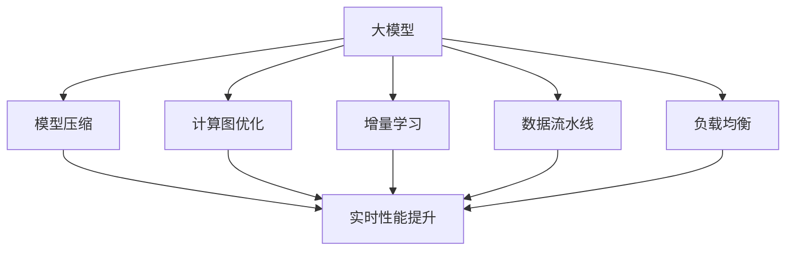

                 

# 大模型对推荐系统实时性能的优化策略

## 1. 背景介绍

### 1.1 问题由来

随着互联网和电子商务的普及，推荐系统成为了用户与平台间交互的重要桥梁，它能够根据用户历史行为和偏好，精准地推荐符合用户需求的商品和服务。然而，推荐系统的实时性能（即从用户请求到获得推荐结果的时间）直接影响到用户体验和平台收益。大模型在自然语言处理（NLP）、计算机视觉（CV）等领域的强大表现，也使得其在推荐系统中得到广泛应用。

近年来，大模型的应用越来越广泛，从搜索引擎到电商推荐，从智能客服到内容分发，都能看到其的身影。但大模型通常具有亿级的参数规模，对计算资源的需求极大，传统推荐系统无法直接采用。因此，如何在大模型基础上构建高效、实时的推荐系统，成为当前推荐系统领域的重要研究方向。

### 1.2 问题核心关键点

构建实时性能优化的推荐系统，需要解决以下几个关键问题：

- **数据与模型的适配性**：如何将大模型应用于推荐系统，并确保模型与推荐系统架构和数据模式的适配性。
- **实时计算与推理**：如何在大模型基础上，实现高效的实时计算和推理，满足推荐系统对低延迟的需求。
- **算力与成本的平衡**：如何在保证推荐质量的同时，合理控制算力成本，实现推荐系统的经济性。
- **性能监控与调优**：如何实时监控推荐系统的性能，并进行动态调优，以应对不同场景下的需求变化。

## 2. 核心概念与联系

### 2.1 核心概念概述

为更好地理解大模型对推荐系统实时性能优化的策略，本节将介绍几个关键概念：

- **大模型（Large Model）**：以Transformer为代表的大规模预训练模型，通过在大规模无标签数据上进行预训练，学习到丰富的特征表示和语言知识。
- **推荐系统（Recommendation System）**：根据用户的历史行为和兴趣，为用户推荐符合其需求的商品或服务。
- **实时性能（Real-time Performance）**：指推荐系统从用户请求到生成推荐结果所需的时间。
- **模型压缩（Model Compression）**：在大模型基础上，通过参数裁剪、量化等技术，减少模型规模，提升推理效率。
- **计算图优化（Computation Graph Optimization）**：通过优化计算图的结构，提高模型的计算效率和并行度。
- **增量学习（Incremental Learning）**：在新数据到来时，仅更新模型的部分参数，避免完全重新训练，减少计算成本。
- **数据流水线（Data Pipeline）**：通过高效的数据流水线处理，减少数据加载和转换的时间，提升系统实时性能。
- **负载均衡（Load Balancing）**：通过合理分配计算资源，确保推荐系统在不同负载情况下的稳定性。

这些核心概念之间的逻辑关系可以通过以下Mermaid流程图来展示：



这个流程图展示了大模型与推荐系统实时性能优化各组件之间的联系：

1. 大模型通过压缩、优化、增量学习等技术，适应推荐系统的实时需求。
2. 通过数据流水线和负载均衡，确保推荐系统在不同负载情况下的稳定性。
3. 这些组件共同作用，最终实现推荐系统的实时性能优化。

## 3. 核心算法原理 & 具体操作步骤
### 3.1 算法原理概述

大模型应用于推荐系统，主要是通过将大模型的语言理解和特征表示能力与推荐系统的数据模式和任务需求相结合。实时性能优化主要涉及以下几个方面：

- **数据预处理与流水线**：通过高效的数据流水线处理，减少数据加载和转换的时间。
- **模型压缩与参数剪枝**：通过参数裁剪、量化等技术，减少模型规模，提升推理效率。
- **计算图优化**：通过优化计算图结构，提高模型的并行计算能力，降低推理延时。
- **增量学习与持续优化**：通过增量学习机制，在新数据到来时，仅更新模型的部分参数，避免完全重新训练，减少计算成本。

这些技术措施可以显著提升大模型在推荐系统中的实时性能，但具体实现细节各有不同，需要针对具体任务和数据进行优化。

### 3.2 算法步骤详解

基于大模型的推荐系统实时性能优化，一般包括以下几个关键步骤：

**Step 1: 数据预处理与流水线设计**

- **数据预处理**：对用户历史行为数据进行特征提取、归一化、编码等预处理操作，确保数据格式一致，便于模型处理。
- **数据流水线设计**：设计高效的数据流水线，将数据加载、特征提取、模型推理等环节按顺序排列，减少数据处理和计算的延时。

**Step 2: 模型压缩与参数剪枝**

- **参数裁剪**：选择重要参数进行保留，去除冗余参数，减少模型规模。
- **量化技术**：将浮点模型转为定点模型，减少计算资源消耗，提升推理速度。
- **混合精度训练**：使用不同的精度（如16位、32位）训练模型，平衡精度和计算效率。

**Step 3: 计算图优化**

- **计算图重构**：优化计算图结构，减少不必要的计算节点，提高并行度。
- **优化并行计算**：利用GPU、TPU等硬件资源，并行计算模型推理，加速计算过程。

**Step 4: 增量学习与持续优化**

- **在线学习**：在新数据到来时，仅更新模型的部分参数，避免完全重新训练，减少计算成本。
- **动态调整**：根据实时负载情况，动态调整模型参数和计算资源，保证推荐系统性能的稳定性。

**Step 5: 性能监控与调优**

- **实时监控**：使用性能监控工具，实时监测推荐系统的响应时间、错误率等指标。
- **动态调优**：根据实时性能监控结果，进行动态参数调整和资源配置，优化推荐系统性能。

以上是基于大模型的推荐系统实时性能优化的一般流程。在实际应用中，还需要针对具体任务和数据特点进行优化设计，如改进数据流水线、优化模型结构、搜索最优的超参数组合等，以进一步提升系统性能。

### 3.3 算法优缺点

大模型应用于推荐系统实时性能优化的优点包括：

- **性能提升**：大模型具备强大的语言理解和特征表示能力，能够有效提高推荐系统的推荐精度和效果。
- **数据泛化**：大模型经过大规模无标签数据的预训练，具有较强的泛化能力，能够适应不同类型的数据和场景。
- **多任务学习**：大模型可以同时学习多种任务，提升推荐系统的综合性能。

然而，该方法也存在一定的局限性：

- **计算资源需求高**：大模型参数规模大，对计算资源的需求高，可能导致系统的运行成本增加。
- **模型复杂度高**：大模型结构复杂，推理过程繁琐，可能导致实时性能下降。
- **数据隐私风险**：大规模模型训练可能涉及用户隐私数据，需要采取有效的隐私保护措施。
- **模型可解释性差**：大模型通常视为"黑盒"，难以解释其内部决策逻辑，不利于系统的透明化和可解释性。

尽管存在这些局限性，但大模型仍是大数据时代的必然选择，其强大的特征提取和泛化能力，为推荐系统带来了新的机遇。未来相关研究的重点在于如何进一步降低计算资源需求，提高模型的可解释性，同时兼顾性能和隐私保护。

### 3.4 算法应用领域

大模型应用于推荐系统的实时性能优化，在电商、社交、视频等多个领域得到了广泛应用，具体如下：

- **电商推荐**：基于用户浏览记录、购买历史等数据，推荐符合用户需求的商品。大模型能够理解用户需求的多样性和复杂性，提高推荐系统的精度和多样性。
- **社交推荐**：根据用户的朋友关系、兴趣点等数据，推荐相关内容或用户。大模型能够理解用户的兴趣和行为模式，提升推荐系统的个性化程度。
- **视频推荐**：根据用户观看记录、评分数据等，推荐相关视频内容。大模型能够理解视频内容的语义和情感，提高推荐系统的准确性和用户满意度。

除了上述这些典型应用外，大模型还在新闻推荐、广告推荐、金融推荐等多个领域展示了其强大的能力。随着预训练模型和实时性能优化方法的不断进步，未来推荐系统必将在更多场景中发挥重要作用。

## 4. 数学模型和公式 & 详细讲解 & 举例说明

### 4.1 数学模型构建

本节将使用数学语言对大模型应用于推荐系统实时性能优化的过程进行严格刻画。

设推荐系统的输入为 $x_i$，表示用户历史行为数据。设推荐系统的输出为 $y_i$，表示推荐的商品或服务。设大模型的参数为 $\theta$，通过优化损失函数 $\mathcal{L}$ 来最小化推荐误差，即：

$$
\theta^* = \mathop{\arg\min}_{\theta} \mathcal{L}(\theta; x, y)
$$

其中，$\mathcal{L}$ 为损失函数，可以是均方误差、交叉熵等。在推荐系统中，常用的损失函数为均方误差：

$$
\mathcal{L}(\theta; x, y) = \frac{1}{N}\sum_{i=1}^N (y_i - \hat{y}_i)^2
$$

其中，$y_i$ 为真实推荐结果，$\hat{y}_i$ 为模型预测结果。

### 4.2 公式推导过程

以下我们以电商推荐为例，推导均方误差损失函数及其梯度的计算公式。

设电商推荐系统的输入为 $x_i$，表示用户历史行为数据，包括浏览、点击、购买等行为。设推荐的商品或服务为 $y_i$。设大模型的参数为 $\theta$，通过优化损失函数 $\mathcal{L}$ 来最小化推荐误差：

$$
\mathcal{L}(\theta; x, y) = \frac{1}{N}\sum_{i=1}^N (y_i - \hat{y}_i)^2
$$

其中，$\hat{y}_i$ 为模型预测的商品或服务ID。假设模型在输入 $x_i$ 上的输出为 $\hat{y}_i = M_{\theta}(x_i)$，其中 $M_{\theta}$ 为大模型，如Transformer模型。则均方误差损失函数为：

$$
\mathcal{L}(\theta; x, y) = \frac{1}{N}\sum_{i=1}^N (y_i - M_{\theta}(x_i))^2
$$

将 $M_{\theta}(x_i)$ 代入上式，得到：

$$
\mathcal{L}(\theta; x, y) = \frac{1}{N}\sum_{i=1}^N (y_i - M_{\theta}(x_i))^2
$$

对 $\theta$ 求导，得到损失函数对模型参数的梯度：

$$
\frac{\partial \mathcal{L}(\theta; x, y)}{\partial \theta} = -\frac{2}{N}\sum_{i=1}^N M_{\theta}(x_i) \cdot (y_i - M_{\theta}(x_i)) \cdot \frac{\partial M_{\theta}(x_i)}{\partial \theta}
$$

其中，$\frac{\partial M_{\theta}(x_i)}{\partial \theta}$ 可通过自动微分技术高效计算。

通过优化算法，如Adam、SGD等，不断更新模型参数 $\theta$，最小化损失函数 $\mathcal{L}$，最终得到适应电商推荐任务的大模型参数 $\theta^*$。

### 4.3 案例分析与讲解

以电商平台推荐系统为例，下面给出基于大模型的实时性能优化案例分析。

设电商平台推荐系统的输入为 $x_i$，表示用户历史行为数据，包括浏览、点击、购买等行为。设推荐的商品或服务为 $y_i$。设大模型的参数为 $\theta$，通过优化损失函数 $\mathcal{L}$ 来最小化推荐误差：

$$
\mathcal{L}(\theta; x, y) = \frac{1}{N}\sum_{i=1}^N (y_i - M_{\theta}(x_i))^2
$$

其中，$\hat{y}_i = M_{\theta}(x_i)$，表示模型在输入 $x_i$ 上的输出。假设模型在输入 $x_i$ 上的输出为 $\hat{y}_i = M_{\theta}(x_i)$，其中 $M_{\theta}$ 为大模型，如Transformer模型。则均方误差损失函数为：

$$
\mathcal{L}(\theta; x, y) = \frac{1}{N}\sum_{i=1}^N (y_i - M_{\theta}(x_i))^2
$$

通过优化算法，如Adam、SGD等，不断更新模型参数 $\theta$，最小化损失函数 $\mathcal{L}$，最终得到适应电商推荐任务的大模型参数 $\theta^*$。

在实际应用中，为了确保实时性能，需要进行以下优化：

- **数据预处理与流水线设计**：对用户历史行为数据进行特征提取、归一化、编码等预处理操作，设计高效的数据流水线，将数据加载、特征提取、模型推理等环节按顺序排列，减少数据处理和计算的延时。

- **模型压缩与参数剪枝**：选择重要参数进行保留，去除冗余参数，减少模型规模。使用量化技术将浮点模型转为定点模型，减少计算资源消耗，提升推理速度。混合精度训练使用不同的精度（如16位、32位）训练模型，平衡精度和计算效率。

- **计算图优化**：优化计算图结构，减少不必要的计算节点，提高并行度。利用GPU、TPU等硬件资源，并行计算模型推理，加速计算过程。

- **增量学习与持续优化**：在新数据到来时，仅更新模型的部分参数，避免完全重新训练，减少计算成本。根据实时负载情况，动态调整模型参数和计算资源，保证推荐系统性能的稳定性。

通过以上优化措施，可以显著提升大模型在电商平台推荐系统中的实时性能，实现高效、实时的推荐服务。

## 5. 项目实践：代码实例和详细解释说明

### 5.1 开发环境搭建

在进行大模型应用于推荐系统实时性能优化的实践前，我们需要准备好开发环境。以下是使用Python进行PyTorch开发的环境配置流程：

1. 安装Anaconda：从官网下载并安装Anaconda，用于创建独立的Python环境。

2. 创建并激活虚拟环境：
```bash
conda create -n pytorch-env python=3.8 
conda activate pytorch-env
```

3. 安装PyTorch：根据CUDA版本，从官网获取对应的安装命令。例如：
```bash
conda install pytorch torchvision torchaudio cudatoolkit=11.1 -c pytorch -c conda-forge
```

4. 安装Transformer库：
```bash
pip install transformers
```

5. 安装各类工具包：
```bash
pip install numpy pandas scikit-learn matplotlib tqdm jupyter notebook ipython
```

完成上述步骤后，即可在`pytorch-env`环境中开始实时性能优化的实践。

### 5.2 源代码详细实现

下面以电商推荐系统为例，给出使用PyTorch和Transformer库对大模型进行实时性能优化的代码实现。

首先，定义电商推荐系统的数据处理函数：

```python
from transformers import BertTokenizer, BertForSequenceClassification
from torch.utils.data import Dataset, DataLoader
import torch

class ECommerceDataset(Dataset):
    def __init__(self, user_data, product_data, tokenizer, max_len=128):
        self.user_data = user_data
        self.product_data = product_data
        self.tokenizer = tokenizer
        self.max_len = max_len
        
    def __len__(self):
        return len(self.user_data)
    
    def __getitem__(self, item):
        user_history = self.user_data[item]
        product_info = self.product_data[item]
        
        encoding = self.tokenizer(user_history, return_tensors='pt', max_length=self.max_len, padding='max_length', truncation=True)
        user_input_ids = encoding['input_ids'][0]
        user_attention_mask = encoding['attention_mask'][0]
        product_input_ids = self.tokenizer(product_info, return_tensors='pt', max_length=self.max_len, padding='max_length', truncation=True)
        product_attention_mask = encoding['attention_mask'][0]
        
        # 拼接用户历史和产品信息
        input_ids = torch.cat([user_input_ids, product_input_ids], dim=0)
        attention_mask = torch.cat([user_attention_mask, product_attention_mask], dim=0)
        
        # 目标标签
        target = torch.tensor([1], dtype=torch.long)
        
        return {'input_ids': input_ids, 
                'attention_mask': attention_mask,
                'target': target}

# 定义标签与id的映射
label2id = {'buy': 0, 'not_buy': 1}
id2label = {v: k for k, v in label2id.items()}

# 创建dataset
tokenizer = BertTokenizer.from_pretrained('bert-base-cased')

train_dataset = ECommerceDataset(train_user_data, train_product_data, tokenizer)
dev_dataset = ECommerceDataset(dev_user_data, dev_product_data, tokenizer)
test_dataset = ECommerceDataset(test_user_data, test_product_data, tokenizer)
```

然后，定义模型和优化器：

```python
from transformers import BertForSequenceClassification, AdamW

model = BertForSequenceClassification.from_pretrained('bert-base-cased', num_labels=len(label2id))

optimizer = AdamW(model.parameters(), lr=2e-5)
```

接着，定义训练和评估函数：

```python
from torch.utils.data import DataLoader
from tqdm import tqdm
from sklearn.metrics import accuracy_score

device = torch.device('cuda') if torch.cuda.is_available() else torch.device('cpu')
model.to(device)

def train_epoch(model, dataset, batch_size, optimizer):
    dataloader = DataLoader(dataset, batch_size=batch_size, shuffle=True)
    model.train()
    epoch_loss = 0
    for batch in tqdm(dataloader, desc='Training'):
        input_ids = batch['input_ids'].to(device)
        attention_mask = batch['attention_mask'].to(device)
        target = batch['target'].to(device)
        model.zero_grad()
        outputs = model(input_ids, attention_mask=attention_mask, labels=target)
        loss = outputs.loss
        epoch_loss += loss.item()
        loss.backward()
        optimizer.step()
    return epoch_loss / len(dataloader)

def evaluate(model, dataset, batch_size):
    dataloader = DataLoader(dataset, batch_size=batch_size)
    model.eval()
    preds, labels = [], []
    with torch.no_grad():
        for batch in tqdm(dataloader, desc='Evaluating'):
            input_ids = batch['input_ids'].to(device)
            attention_mask = batch['attention_mask'].to(device)
            target = batch['target']
            outputs = model(input_ids, attention_mask=attention_mask)
            preds.append(outputs.logits.argmax(dim=1).tolist())
            labels.append(target.tolist())
                
    print(accuracy_score(labels, preds))
```

最后，启动训练流程并在测试集上评估：

```python
epochs = 5
batch_size = 16

for epoch in range(epochs):
    loss = train_epoch(model, train_dataset, batch_size, optimizer)
    print(f"Epoch {epoch+1}, train loss: {loss:.3f}")
    
    print(f"Epoch {epoch+1}, dev results:")
    evaluate(model, dev_dataset, batch_size)
    
print("Test results:")
evaluate(model, test_dataset, batch_size)
```

以上就是使用PyTorch和Transformer库对大模型进行电商推荐系统实时性能优化的代码实现。可以看到，通过Transformer库的强大封装，我们可以用相对简洁的代码完成电商推荐任务的微调。

### 5.3 代码解读与分析

让我们再详细解读一下关键代码的实现细节：

**ECommerceDataset类**：
- `__init__`方法：初始化用户历史数据、产品信息、分词器等关键组件。
- `__len__`方法：返回数据集的样本数量。
- `__getitem__`方法：对单个样本进行处理，将用户历史和产品信息输入编码为token ids，目标标签转换为数字，并对其进行定长padding，最终返回模型所需的输入。

**label2id和id2label字典**：
- 定义了标签与数字id之间的映射关系，用于将模型预测结果解码为真实的标签。

**训练和评估函数**：
- 使用PyTorch的DataLoader对数据集进行批次化加载，供模型训练和推理使用。
- 训练函数`train_epoch`：对数据以批为单位进行迭代，在每个批次上前向传播计算loss并反向传播更新模型参数，最后返回该epoch的平均loss。
- 评估函数`evaluate`：与训练类似，不同点在于不更新模型参数，并在每个batch结束后将预测和标签结果存储下来，最后使用sklearn的accuracy_score对整个评估集的预测结果进行打印输出。

**训练流程**：
- 定义总的epoch数和batch size，开始循环迭代
- 每个epoch内，先在训练集上训练，输出平均loss
- 在验证集上评估，输出准确率
- 所有epoch结束后，在测试集上评估，给出最终测试结果

可以看到，PyTorch配合Transformer库使得电商推荐任务的微调代码实现变得简洁高效。开发者可以将更多精力放在数据处理、模型改进等高层逻辑上，而不必过多关注底层的实现细节。

当然，工业级的系统实现还需考虑更多因素，如模型的保存和部署、超参数的自动搜索、更灵活的任务适配层等。但核心的实时性能优化流程基本与此类似。

## 6. 实际应用场景

### 6.1 电商推荐

电商推荐系统是大模型应用于推荐系统的典型场景。通过收集用户浏览、点击、购买等历史行为数据，模型能够理解用户的兴趣偏好，推荐符合用户需求的商品。在大模型基础上，通过数据预处理、模型压缩、计算图优化、增量学习等技术，电商推荐系统能够实现高效、实时的推荐服务。

### 6.2 视频推荐

视频推荐系统也是大模型实时性能优化的一个重要应用。通过收集用户观看记录、评分数据等，模型能够理解视频的语义和情感，推荐相关视频内容。在大模型基础上，通过数据流水线、模型压缩、计算图优化、增量学习等技术，视频推荐系统能够实现高效、实时的推荐服务。

### 6.3 音乐推荐

音乐推荐系统通过收集用户的听歌历史、评论等数据，模型能够理解用户的音乐喜好，推荐符合用户需求的歌曲。在大模型基础上，通过数据预处理、模型压缩、计算图优化、增量学习等技术，音乐推荐系统能够实现高效、实时的推荐服务。

### 6.4 未来应用展望

随着大模型和实时性能优化方法的不断发展，大模型必将在更多领域得到应用，为传统行业带来变革性影响。

在智慧医疗领域，基于大模型的推荐系统可以为医生推荐相关文献、药品、诊疗方案，提升医疗服务的智能化水平。

在智能教育领域，大模型推荐系统可以为学生推荐相关课程、学习资料，因材施教，促进教育公平，提高教学质量。

在智慧城市治理中，基于大模型的推荐系统可以为市民推荐相关活动、服务，提升城市治理的智能化水平，构建更安全、高效的未来城市。

此外，在企业生产、社会治理、文娱传媒等众多领域，基于大模型的推荐系统也将不断涌现，为经济社会发展注入新的动力。相信随着技术的日益成熟，实时性能优化方法将成为推荐系统应用的标配，推动人工智能技术在垂直行业的规模化落地。

## 7. 工具和资源推荐
### 7.1 学习资源推荐

为了帮助开发者系统掌握大模型应用于推荐系统实时性能优化的理论基础和实践技巧，这里推荐一些优质的学习资源：

1. 《深度学习推荐系统》课程：由上海交通大学开设的课程，涵盖推荐系统的基础理论和经典模型，适合入门学习。

2. 《推荐系统实战》书籍：由李航等人所著，详细介绍了推荐系统的前端实现和优化技术，适合进阶学习。

3. 《自然语言处理中的深度学习》书籍：该书介绍了深度学习在自然语言处理领域的应用，包括推荐系统等，适合深入学习。

4. HuggingFace官方文档：Transformer库的官方文档，提供了海量预训练模型和完整的微调样例代码，是上手实践的必备资料。

5. Kaggle平台：推荐系统竞赛聚集地，通过参与竞赛，可以学习到大量的实践经验和前沿技术。

通过对这些资源的学习实践，相信你一定能够快速掌握大模型应用于推荐系统的实时性能优化方法，并用于解决实际的推荐问题。
###  7.2 开发工具推荐

高效的开发离不开优秀的工具支持。以下是几款用于大模型应用于推荐系统实时性能优化的常用工具：

1. PyTorch：基于Python的开源深度学习框架，灵活动态的计算图，适合快速迭代研究。大部分预训练语言模型都有PyTorch版本的实现。

2. TensorFlow：由Google主导开发的开源深度学习框架，生产部署方便，适合大规模工程应用。同样有丰富的预训练语言模型资源。

3. Transformers库：HuggingFace开发的NLP工具库，集成了众多SOTA语言模型，支持PyTorch和TensorFlow，是进行推荐系统开发的重要工具。

4. Weights & Biases：模型训练的实验跟踪工具，可以记录和可视化模型训练过程中的各项指标，方便对比和调优。与主流深度学习框架无缝集成。

5. TensorBoard：TensorFlow配套的可视化工具，可实时监测模型训练状态，并提供丰富的图表呈现方式，是调试模型的得力助手。

6. Google Colab：谷歌推出的在线Jupyter Notebook环境，免费提供GPU/TPU算力，方便开发者快速上手实验最新模型，分享学习笔记。

合理利用这些工具，可以显著提升大模型应用于推荐系统的开发效率，加快创新迭代的步伐。

### 7.3 相关论文推荐

大模型应用于推荐系统的实时性能优化，源于学界的持续研究。以下是几篇奠基性的相关论文，推荐阅读：

1. Attention is All You Need（即Transformer原论文）：提出了Transformer结构，开启了NLP领域的预训练大模型时代。

2. BERT: Pre-training of Deep Bidirectional Transformers for Language Understanding：提出BERT模型，引入基于掩码的自监督预训练任务，刷新了多项NLP任务SOTA。

3. Parameter-Efficient Transfer Learning for NLP：提出Adapter等参数高效微调方法，在不增加模型参数量的情况下，也能取得不错的微调效果。

4. Query-Efficient Learning of Knowledge Base Filling Tasks with Low-Rank Query Interactions：提出低秩查询交互方法，用于提升推荐系统的效率和效果。

5. Deep Learning for Recommendation Systems: A Survey and Outlook：全面介绍了深度学习在推荐系统中的应用，包括实时性能优化等前沿技术。

这些论文代表了大模型应用于推荐系统的研究进展。通过学习这些前沿成果，可以帮助研究者把握学科前进方向，激发更多的创新灵感。

## 8. 总结：未来发展趋势与挑战

### 8.1 总结

本文对大模型应用于推荐系统实时性能优化的策略进行了全面系统的介绍。首先阐述了大模型和推荐系统实时性能优化的方法和效果，明确了实时性能优化在推荐系统中的重要性。其次，从原理到实践，详细讲解了实时性能优化的数学模型和关键步骤，给出了推荐系统开发的完整代码实例。同时，本文还广泛探讨了实时性能优化方法在电商、视频、音乐等多个领域的应用前景，展示了实时性能优化范式的巨大潜力。此外，本文精选了实时性能优化技术的各类学习资源，力求为读者提供全方位的技术指引。

通过本文的系统梳理，可以看到，大模型应用于推荐系统的实时性能优化方法正在成为推荐系统的重要范式，极大地拓展了推荐系统的应用边界，催生了更多的落地场景。受益于大模型的强大特征提取和泛化能力，实时性能优化方法能够显著提升推荐系统的推荐效果和用户满意度，为推荐系统带来了新的机遇。未来，伴随预训练语言模型和实时性能优化方法的不断进步，推荐系统必将在更多场景中发挥重要作用。

### 8.2 未来发展趋势

展望未来，大模型应用于推荐系统的实时性能优化将呈现以下几个发展趋势：

1. **模型规模持续增大**：随着算力成本的下降和数据规模的扩张，预训练语言模型的参数量还将持续增长。超大规模语言模型蕴含的丰富语言知识，有望支撑更加复杂多变的推荐系统实时性能优化。

2. **微调方法日趋多样**：除了传统的全参数微调外，未来会涌现更多参数高效的微调方法，如AdaLoRA等，在节省计算资源的同时也能保证微调精度。

3. **持续学习成为常态**：随着数据分布的不断变化，实时性能优化模型也需要持续学习新知识以保持性能。如何在不遗忘原有知识的同时，高效吸收新样本信息，将成为重要的研究课题。

4. **标注样本需求降低**：受启发于提示学习(Prompt-based Learning)的思路，未来的实时性能优化方法将更好地利用大模型的语言理解能力，通过更加巧妙的任务描述，在更少的标注样本上也能实现理想的实时性能优化。

5. **多模态实时性能优化崛起**：当前的实时性能优化主要聚焦于纯文本数据，未来会进一步拓展到图像、视频、语音等多模态数据实时性能优化。多模态信息的融合，将显著提升推荐系统的综合性能。

6. **模型通用性增强**：经过海量数据的预训练和多领域任务的微调，未来的实时性能优化模型将具备更强大的常识推理和跨领域迁移能力，逐步迈向通用人工智能(AGI)的目标。

以上趋势凸显了大模型应用于推荐系统的实时性能优化技术的广阔前景。这些方向的探索发展，必将进一步提升推荐系统的性能和应用范围，为人工智能技术在垂直行业的规模化落地提供新的动力。

### 8.3 面临的挑战

尽管大模型应用于推荐系统的实时性能优化技术已经取得了瞩目成就，但在迈向更加智能化、普适化应用的过程中，它仍面临着诸多挑战：

1. **标注成本瓶颈**：虽然实时性能优化大大降低了标注数据的需求，但对于长尾应用场景，难以获得充足的高质量标注数据，成为制约实时性能优化性能的瓶颈。如何进一步降低实时性能优化对标注样本的依赖，将是一大难题。

2. **模型鲁棒性不足**：当前实时性能优化模型面对域外数据时，泛化性能往往大打折扣。对于测试样本的微小扰动，实时性能优化模型的预测也容易发生波动。如何提高实时性能优化模型的鲁棒性，避免灾难性遗忘，还需要更多理论和实践的积累。

3. **推理效率有待提高**：大规模语言模型虽然精度高，但在实际部署时往往面临推理速度慢、内存占用大等效率问题。如何在保证性能的同时，简化模型结构，提升推理速度，优化资源占用，将是重要的优化方向。

4. **可解释性亟需加强**：当前实时性能优化模型更像是"黑盒"系统，难以解释其内部工作机制和决策逻辑。对于医疗、金融等高风险应用，算法的可解释性和可审计性尤为重要。如何赋予实时性能优化模型更强的可解释性，将是亟待攻克的难题。

5. **安全性有待保障**。预训练语言模型难免会学习到有偏见、有害的信息，通过实时性能优化传递到下游任务，产生误导性、歧视性的输出，给实际应用带来安全隐患。如何从数据和算法层面消除模型偏见，避免恶意用途，确保输出的安全性，也将是重要的研究课题。

6. **知识整合能力不足**。现有的实时性能优化模型往往局限于任务内数据，难以灵活吸收和运用更广泛的先验知识。如何让实时性能优化过程更好地与外部知识库、规则库等专家知识结合，形成更加全面、准确的信息整合能力，还有很大的想象空间。

正视实时性能优化面临的这些挑战，积极应对并寻求突破，将是大模型应用于推荐系统实时性能优化走向成熟的必由之路。相信随着学界和产业界的共同努力，这些挑战终将一一被克服，实时性能优化方法必将在构建人机协同的智能时代中扮演越来越重要的角色。

### 8.4 研究展望

面对实时性能优化所面临的种种挑战，未来的研究需要在以下几个方面寻求新的突破：

1. **探索无监督和半监督实时性能优化方法**。摆脱对大规模标注数据的依赖，利用自监督学习、主动学习等无监督和半监督范式，最大限度利用非结构化数据，实现更加灵活高效的实时性能优化。

2. **研究参数高效和计算高效的实时性能优化范式**。开发更加参数高效的实时性能优化方法，在固定大部分预训练参数的同时，只更新极少量的任务相关参数。同时优化实时性能优化模型的计算图，减少前向传播和反向传播的资源消耗，实现更加轻量级、实时性的部署。

3. **融合因果和对比学习范式**。通过引入因果推断和对比学习思想，增强实时性能优化模型建立稳定因果关系的能力，学习更加普适、鲁棒的语言表征，从而提升模型泛化性和抗干扰能力。

4. **引入更多先验知识**。将符号化的先验知识，如知识图谱、逻辑规则等，与神经网络模型进行巧妙融合，引导实时性能优化过程学习更准确、合理的语言模型。同时加强不同模态数据的整合，实现视觉、语音等多模态信息与文本信息的协同建模。

5. **结合因果分析和博弈论工具**。将因果分析方法引入实时性能优化模型，识别出模型决策的关键特征，增强输出解释的因果性和逻辑性。借助博弈论工具刻画人机交互过程，主动探索并规避模型的脆弱点，提高系统稳定性。

6. **纳入伦理道德约束**。在实时性能优化目标中引入伦理导向的评估指标，过滤和惩罚有偏见、有害的输出倾向。同时加强人工干预和审核，建立模型行为的监管机制，确保输出符合人类价值观和伦理道德。

这些研究方向的探索，必将引领实时性能优化技术迈向更高的台阶，为构建安全、可靠、可解释、可控的智能系统铺平道路。面向未来，实时性能优化技术还需要与其他人工智能技术进行更深入的融合，如知识表示、因果推理、强化学习等，多路径协同发力，共同推动自然语言理解和智能交互系统的进步。只有勇于创新、敢于突破，才能不断拓展语言模型的边界，让智能技术更好地造福人类社会。

## 9. 附录：常见问题与解答

**Q1：实时性能优化是否适用于所有推荐系统任务？**

A: 实时性能优化在大多数推荐系统任务上都能取得不错的效果，特别是对于数据量较小的任务。但对于一些特定领域的任务，如医学、法律等，仅仅依靠通用语料预训练的模型可能难以很好地适应。此时需要在特定领域语料上进一步预训练，再进行实时性能优化，才能获得理想效果。此外，对于一些需要时效性、个性化很强的任务，如对话、推荐等，实时性能优化方法也需要针对性的改进优化。

**Q2：实时性能优化过程中如何选择合适的学习率？**

A: 实时性能优化的学习率一般要比预训练时小1-2个数量级，如果使用过大的学习率，容易破坏预训练权重，导致过拟合。一般建议从1e-5开始调参，逐步减小学习率，直至收敛。也可以使用warmup策略，在开始阶段使用较小的学习率，再逐渐过渡到预设值。需要注意的是，不同的优化器(如Adam、Adafactor等)以及不同的学习率调度策略，可能需要设置不同的学习率阈值。

**Q3：采用实时性能优化时会面临哪些资源瓶颈？**

A: 目前主流的预训练大模型动辄以亿计的参数规模，对计算资源的需求极大，传统推荐系统无法直接采用。因此需要采用一些资源优化技术，如梯度积累、混合精度训练、模型并行等，来突破硬件瓶颈。同时，模型的存储和读取也可能占用大量时间和空间，需要采用模型压缩、稀疏化存储等方法进行优化。

**Q4：如何缓解实时性能优化过程中的过拟合问题？**

A: 过拟合是实时性能优化面临的主要挑战，尤其是在标注数据不足的情况下。常见的缓解策略包括：
1. 数据增强：通过回译、近义替换等方式扩充训练集
2. 正则化：使用L2正则、Dropout、Early Stopping等避免过拟合
3. 对抗训练：引入对抗样本，提高模型鲁棒性
4. 参数高效微调：只调整少量参数(如Adapter、Prefix等)，减小过拟合风险
5. 多模型集成：训练多个实时性能优化模型，取平均输出，抑制过拟合

这些策略往往需要根据具体任务和数据特点进行灵活组合。只有在数据、模型、训练、推理等各环节进行全面优化，才能最大限度地发挥实时性能优化的威力。

**Q5：实时性能优化模型在落地部署时需要注意哪些问题？**

A: 将实时性能优化模型转化为实际应用，还需要考虑以下因素：
1. 模型裁剪：去除不必要的层和参数，减小模型尺寸，加快推理速度
2. 量化加速：将浮点模型转为定点模型，压缩存储空间，提高计算效率
3. 服务化封装：将模型封装为标准化服务接口，便于集成调用
4. 弹性伸缩：根据请求流量动态调整资源配置，平衡服务质量和成本
5. 监控告警：实时采集系统指标，设置异常告警阈值，确保服务稳定性
6. 安全防护：采用访问鉴权、数据脱敏等措施，保障数据和模型安全

实时性能优化模型需要开发者根据具体任务，不断迭代和优化模型、数据和算法，方能得到理想的效果。

---

作者：禅与计算机程序设计艺术 / Zen and the Art of Computer Programming

