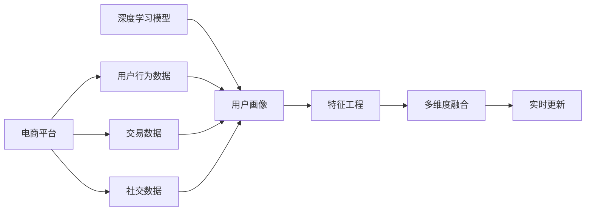

                 

# 大模型技术在电商平台用户多维度画像构建中的创新

> 关键词：电商平台,用户画像,深度学习,大模型技术,特征工程,多维度融合,实时更新

## 1. 背景介绍

在当前数字化浪潮的推动下，电商平台正处于快速发展阶段。随着在线零售市场的规模不断扩大，如何更好地了解和满足用户需求，成为电商平台在竞争中脱颖而出的关键。用户画像（User Profile）作为描述用户特征的关键工具，为电商平台个性化推荐、精准营销、用户行为分析等提供了重要依据。传统上，用户画像的构建主要依靠人工标记和统计方法，费时费力且效果有限。近年来，随着深度学习和大模型技术的兴起，用户画像的构建方式迎来了新的变革。

本文将详细介绍大模型技术在电商平台用户多维度画像构建中的应用，探讨如何在用户行为数据、交易数据、社交数据等多种数据源的基础上，构建精准、高效的用户画像，并进一步利用这些画像提升电商平台的运营效率和用户满意度。

## 2. 核心概念与联系

### 2.1 核心概念概述

在探讨大模型技术在用户画像构建中的应用前，首先需理解几个关键概念：

- **电商平台**：以线上交易为核心，提供商品展示、购买、配送、售后等全流程服务的数字平台。
- **用户画像**：基于用户的历史行为数据，构建用于描述用户特征的标签集合。
- **深度学习**：一种机器学习技术，通过构建多层神经网络模型，从数据中提取高层次特征。
- **大模型技术**：通过大规模预训练语言模型或图像模型，学习海量数据中的复杂模式，如BERT、GPT-3、DALL-E等。
- **特征工程**：数据预处理和特征提取的过程，目标是提升模型对数据的理解和利用效率。
- **多维度融合**：将来自不同数据源的多维特征融合起来，形成更为全面、细致的用户画像。
- **实时更新**：用户画像应能够根据用户的最新行为数据进行实时更新，以保持其时效性和准确性。

### 2.2 核心概念原理和架构的 Mermaid 流程图



此图展示了用户画像构建的核心流程：

1. **数据收集**：电商平台收集用户行为数据、交易数据、社交数据等。
2. **深度学习模型**：使用预训练的大模型，对数据进行特征提取。
3. **用户画像**：将提取出的特征融合形成用户画像。
4. **特征工程**：对用户画像进行预处理，提高其可用性。
5. **多维度融合**：将不同来源的数据融合在一起，形成更为全面的用户画像。
6. **实时更新**：根据用户最新行为数据，持续更新用户画像。

## 3. 核心算法原理 & 具体操作步骤

### 3.1 算法原理概述

大模型技术在用户画像构建中的应用主要基于深度学习，特别是预训练语言模型。预训练模型通过在大规模无标签数据上自监督学习，学习到丰富的语言和视觉特征，可以应用于各种任务，包括文本生成、情感分析、图像分类等。电商平台可以借助这些预训练模型，从用户行为数据、交易数据、社交数据等多维度构建用户画像。

以BERT模型为例，其原理是通过自监督语言建模任务（如掩码语言模型、下一句预测）预训练得到语言表示，再通过微调应用于特定任务（如命名实体识别、情感分析等）。用户画像构建过程中，可以将用户的多维度数据转化为文本或图像形式，输入预训练模型进行特征提取，形成高层次的语义和视觉表示。

### 3.2 算法步骤详解

用户画像的构建流程主要包括以下几个步骤：

1. **数据准备**：收集用户行为数据、交易数据、社交数据等，并进行数据清洗和预处理。
2. **特征提取**：使用预训练的大模型（如BERT、GPT-3等），对文本或图像数据进行特征提取，得到高层次的语义或视觉表示。
3. **用户画像构建**：将提取出的特征进行融合，形成用户画像。
4. **特征工程**：对用户画像进行预处理，如标准化、归一化、降维等，提高其可用性。
5. **多维度融合**：将来自不同数据源的多维特征融合在一起，形成更为全面、细致的用户画像。
6. **实时更新**：根据用户最新行为数据，持续更新用户画像。

### 3.3 算法优缺点

大模型技术在用户画像构建中的应用，具有以下优点：

- **高效特征提取**：大模型能够自动学习数据中的复杂模式，提取高层次特征，大幅减少人工特征工程的复杂度。
- **多维度融合**：通过将来自不同数据源的多维特征融合，可以构建更全面、细致的用户画像。
- **实时更新**：用户画像可以实时根据用户最新行为数据进行更新，保持其时效性和准确性。

但同时，也存在一些局限：

- **高计算资源需求**：大规模预训练模型的训练和推理需要较高的计算资源，可能对平台带来较大的计算成本。
- **模型泛化能力**：大模型在特定领域的泛化能力可能不足，需要针对具体场景进行微调。
- **隐私保护问题**：用户行为数据和交易数据的隐私保护需引起重视，确保数据使用的合规性。

### 3.4 算法应用领域

大模型技术在用户画像构建中的应用，不仅限于电商平台，还包括金融、社交、医疗等多个领域。例如，在金融领域，可以通过用户交易记录、信用记录等数据构建用户画像，进行风险评估和信用评分；在医疗领域，可以通过患者就诊记录、健康数据等构建用户画像，进行个性化健康管理。

## 4. 数学模型和公式 & 详细讲解 & 举例说明

### 4.1 数学模型构建

用户画像的构建过程可以形式化地表示为一个优化问题。设用户画像为 $P$，数据集为 $D$，优化目标为最大化用户画像的准确性和鲁棒性。具体模型构建如下：

$$
P^* = \arg\max_P \sum_{x\in D} \frac{1}{N} \log(P(x|y))
$$

其中 $N$ 为数据集大小，$x$ 为单个样本，$y$ 为样本的真实标签。

### 4.2 公式推导过程

以文本数据的特征提取为例，假设使用BERT模型，其输出表示为 $H$，用户画像表示为 $P$，优化目标为最大化模型的似然函数：

$$
\log(P(x|y)) = \sum_{i=1}^N \log(P(x_i|y_i)) = \log(P(x|y)) + \log(P(x'|y')) + \ldots
$$

通过最大化似然函数，可以优化用户画像 $P$，使其尽可能准确地描述用户特征。

### 4.3 案例分析与讲解

以电商平台的用户画像构建为例，具体步骤如下：

1. **数据收集**：收集用户的行为数据，包括浏览记录、购买记录、评价记录等。
2. **数据预处理**：将文本数据转化为BERT模型的输入格式，并进行标准化、分词等预处理。
3. **特征提取**：使用预训练的BERT模型对文本数据进行特征提取，得到高层次的语义表示。
4. **用户画像构建**：将提取出的语义表示作为用户画像，表示为向量形式。
5. **多维度融合**：将用户画像与交易数据、社交数据等进行融合，形成多维度的用户特征向量。
6. **实时更新**：根据用户最新行为数据，持续更新用户画像。

## 5. 项目实践：代码实例和详细解释说明

### 5.1 开发环境搭建

在进行用户画像构建的实践前，首先需要搭建好开发环境。以下是使用Python和PyTorch进行开发的快速搭建流程：

1. **安装Anaconda**：从官网下载并安装Anaconda，用于创建独立的Python环境。
2. **创建虚拟环境**：
```bash
conda create -n user_profiles python=3.8
conda activate user_profiles
```
3. **安装必要的库**：
```bash
conda install torch torchvision torchaudio cudatoolkit=11.1 -c pytorch -c conda-forge
pip install transformers
```

### 5.2 源代码详细实现

以下是一个简单的用户画像构建示例，展示了如何使用BERT模型提取用户行为数据的特征：

```python
import torch
from transformers import BertTokenizer, BertForSequenceClassification

# 定义BERT模型和分词器
tokenizer = BertTokenizer.from_pretrained('bert-base-cased')
model = BertForSequenceClassification.from_pretrained('bert-base-cased', num_labels=2)

# 加载用户行为数据
with open('user_data.txt', 'r') as f:
    data = f.read()

# 分词和编码
inputs = tokenizer.encode(data, return_tensors='pt', max_length=512, padding=True, truncation=True)

# 模型推理
outputs = model(inputs)
logits = outputs.logits

# 获取预测结果
predicted_label = torch.argmax(logits, dim=1).item()
```

### 5.3 代码解读与分析

以上代码展示了使用BERT模型进行文本特征提取的基本流程：

- **模型加载**：通过预训练的BERT模型和分词器，进行特征提取。
- **数据加载**：读取用户行为数据，并进行分词和编码。
- **模型推理**：将编码后的数据输入模型，得到特征表示。
- **预测结果**：通过softmax层输出预测结果，并取最大值作为最终标签。

### 5.4 运行结果展示

在实际应用中，可以根据用户行为数据的不同类型，选择合适的预训练模型进行特征提取。例如，对于文本数据可以使用BERT，对于图像数据可以使用DALL-E等。运行结果可以通过可视化工具（如TensorBoard）进行展示，帮助理解模型的特征提取效果。

## 6. 实际应用场景

### 6.1 个性化推荐

电商平台可以利用用户画像，为用户提供个性化的商品推荐。通过分析用户画像中的兴趣和行为特征，电商平台可以实时推送最符合用户需求的商品。

### 6.2 用户行为分析

通过对用户画像的持续更新和分析，电商平台可以了解用户的行为模式和偏好，进行精准营销和用户流失预警。例如，通过分析用户最近的浏览和购买记录，预测其下一次购买意向。

### 6.3 客户服务

用户画像可以帮助电商平台构建更智能的客户服务体系。例如，通过分析用户画像中的消费习惯和偏好，客服人员可以更精准地解答用户问题，提升用户体验。

### 6.4 未来应用展望

未来，随着深度学习和大模型技术的进一步发展，用户画像的构建将更加精准、高效。例如，通过多模态数据融合，用户画像可以包含语音、视频等多种形式的信息；通过实时更新，用户画像可以动态反映用户最新的行为数据。这些技术进步将为用户画像带来更大的应用潜力和价值。

## 7. 工具和资源推荐

### 7.1 学习资源推荐

为了帮助开发者深入了解大模型技术在用户画像构建中的应用，以下是一些优质的学习资源：

1. **《深度学习理论与实践》**：介绍深度学习的基本理论和实践方法，适合初学者学习。
2. **《自然语言处理入门》**：涵盖自然语言处理的各个方面，包括预训练模型、多维度特征融合等。
3. **HuggingFace官方文档**：提供预训练模型的详细文档和样例代码，帮助开发者快速上手。
4. **arXiv论文**：搜索与用户画像构建相关的最新研究论文，了解前沿进展。

### 7.2 开发工具推荐

以下是一些常用的开发工具，可以帮助开发者高效地构建用户画像：

1. **Jupyter Notebook**：Python的交互式编程环境，适合进行数据处理和模型实验。
2. **TensorBoard**：可视化工具，用于监控模型训练和推理过程。
3. **PyTorch Lightning**：轻量级深度学习框架，适合构建和训练复杂的模型。

### 7.3 相关论文推荐

以下是一些影响较大的相关论文，建议阅读：

1. **《深度学习与用户画像的构建与优化》**：介绍深度学习在用户画像构建中的应用和优化方法。
2. **《多模态用户画像构建》**：讨论多模态数据融合在用户画像构建中的应用。
3. **《用户画像的实时更新与动态管理》**：探讨如何实现用户画像的实时更新和动态管理。

## 8. 总结：未来发展趋势与挑战

### 8.1 研究成果总结

本文详细探讨了大模型技术在电商平台用户画像构建中的应用，提出了一种基于深度学习的多维度特征融合方法，并通过代码示例展示了其实现过程。用户画像的构建不仅是电商平台个性化推荐、精准营销等应用的重要基础，也是其他领域如金融、社交等的重要工具。

### 8.2 未来发展趋势

未来，随着深度学习和大模型技术的不断进步，用户画像的构建将更加精准、高效。例如，通过多模态数据融合和实时更新，用户画像可以包含更多维度的信息，反映用户的全面特征。同时，随着模型的不断优化和算法的进步，用户画像的构建成本也将逐渐降低，应用场景将更加广泛。

### 8.3 面临的挑战

尽管用户画像的构建具有广阔的应用前景，但仍需面对以下挑战：

1. **计算资源需求高**：大规模预训练模型的训练和推理需要较高的计算资源，可能对平台带来较大的计算成本。
2. **数据隐私问题**：用户行为数据和交易数据的隐私保护需引起重视，确保数据使用的合规性。
3. **模型泛化能力不足**：大模型在特定领域的泛化能力可能不足，需要针对具体场景进行微调。

### 8.4 研究展望

未来，用户画像的构建将更多地结合大数据和人工智能技术，进一步提升其精准性和时效性。例如，通过结合因果推断和强化学习，可以实现更加动态和个性化的用户画像更新。同时，随着联邦学习等新兴技术的兴起，用户画像的构建将更加注重数据隐私保护和用户权益。

## 9. 附录：常见问题与解答

**Q1：大模型技术在用户画像构建中是否需要重新训练？**

A: 使用大模型进行用户画像构建，主要通过特征提取而不是重新训练模型。这可以大大减少计算资源和时间成本，同时利用大模型的预训练知识提升特征提取的准确性。

**Q2：用户画像的实时更新如何实现？**

A: 用户画像的实时更新可以通过订阅机制实现。例如，利用消息队列或事件驱动架构，在用户行为发生时触发更新流程，通过API接口更新用户画像。

**Q3：如何保护用户隐私？**

A: 用户隐私保护可以通过数据匿名化、差分隐私等技术手段实现。例如，在用户画像构建过程中，对敏感信息进行去标识化处理，确保数据使用的合规性。

**Q4：大模型技术在用户画像构建中存在哪些限制？**

A: 大模型技术在用户画像构建中存在计算资源需求高、模型泛化能力不足等限制。解决这些问题需要结合业务需求和计算资源，选择合适的预训练模型和参数配置。

**Q5：用户画像的构建是否需要大规模标注数据？**

A: 使用大模型进行用户画像构建，通常不需要大规模标注数据。用户画像的构建更多依赖于用户行为数据和交易数据的自然标签。

通过本文的深入探讨，相信读者能够全面理解大模型技术在用户画像构建中的应用，并掌握其实现方法。未来，随着深度学习和大模型技术的不断发展，用户画像将进一步提升电商平台的运营效率和用户体验，推动人工智能技术在各行各业的广泛应用。

