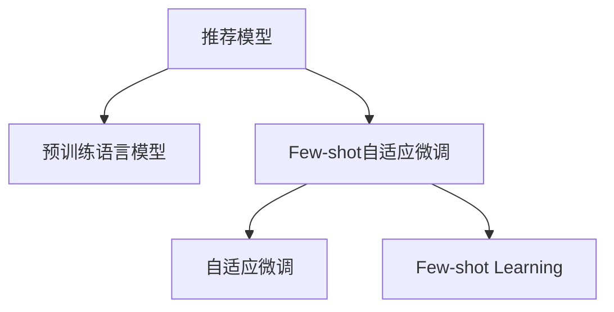

                 

# 大模型推荐中的Few-shot自适应微调技术进阶

## 1. 背景介绍

推荐系统是互联网公司的重要技术基石，也是推动智能化发展的核心驱动力。推荐算法在电商、新闻、视频、音乐等多个领域实现了个性化推荐，大幅提升了用户满意度和平台活跃度。传统推荐系统依赖用户历史行为数据进行推荐，但数据隐私问题、低效冷启动等挑战日益凸显。近年来，预训练语言模型在推荐系统中的应用逐渐兴起，凭借其强大的自然语言处理能力，助力推荐系统迈向智能化新阶段。

然而，预训练语言模型面临着诸如参数量大、训练耗时长等挑战。常规的微调方法需要耗费大量的标注数据和计算资源，且无法高效处理小样本数据。因此，在实际应用中，Few-shot自适应微调技术应运而生，旨在降低微调对标注数据的依赖，提升在大规模无标注数据上的微调效果。本文将深入探讨Few-shot自适应微调在大模型推荐中的应用，揭示其原理和操作流程，并给出一些实用的代码实例和性能提升案例。

## 2. 核心概念与联系

### 2.1 核心概念概述

在进行Few-shot自适应微调前，我们需要了解以下几个核心概念：

- **Few-shot Learning**：指模型仅需少量标注数据即可实现良好性能的学习方式。在大模型推荐中，可利用Few-shot学习对推荐模型进行微调，以适应新任务。

- **自适应微调**：指模型能够根据当前任务自动调整超参数、损失函数等，以优化模型在新任务上的表现。

- **Few-shot自适应微调**：结合Few-shot学习和自适应微调，即在大规模无标注数据上，通过极少量的标注数据实现模型的自适应微调。

- **推荐模型**：指根据用户历史行为数据，预测其未来行为，推荐感兴趣物品的模型。推荐模型一般基于协同过滤、内容推荐、混合推荐等方法。

- **深度学习框架**：如PyTorch、TensorFlow等，提供了丰富的深度学习算法和工具，支持Few-shot自适应微调的实现。

- **预训练语言模型**：如BERT、GPT等，在大规模语料上预训练，具备丰富的语言知识，适合作为推荐模型的一部分。

这些概念间的联系可以用以下Mermaid流程图来表示：



该流程图展示了Few-shot自适应微调在大模型推荐中的主要流程：从推荐模型出发，通过预训练语言模型，利用Few-shot自适应微调技术，实现推荐模型的优化。

## 3. 核心算法原理 & 具体操作步骤
### 3.1 算法原理概述

Few-shot自适应微调的核心思想是利用预训练语言模型和少量标注数据，通过自适应微调方法，使模型在特定推荐任务上表现更佳。其算法原理如下：

假设推荐系统中的物品集合为 $I$，用户集合为 $U$，用户和物品之间的评分矩阵为 $R_{U \times I}$。推荐模型的目标是通过预测用户 $u$ 对物品 $i$ 的评分 $R_{ui}$，推荐其感兴趣的物品。

推荐模型可表示为 $R_{ui} = f(x_u, x_i)$，其中 $x_u, x_i$ 分别为用户和物品的表示向量。预训练语言模型可以用于表示用户和物品的文本信息，辅助推荐模型预测评分。

在Few-shot自适应微调中，模型通过少量标注数据进行微调，通过自适应方法调整模型参数，提升推荐精度。

### 3.2 算法步骤详解

Few-shot自适应微调的实现步骤如下：

**Step 1: 准备数据与预训练模型**

- 准备推荐数据集 $D$，包含用户 $u$ 和物品 $i$ 的评分 $R_{ui}$。
- 选择合适的预训练语言模型 $M_{\theta}$，如BERT、GPT等。

**Step 2: 设计微调目标函数**

- 设计微调目标函数 $\mathcal{L}(R_{\text{pred}}, R_{\text{gt}})$，其中 $R_{\text{pred}}$ 为模型预测的评分，$R_{\text{gt}}$ 为标注数据。
- 利用少量标注数据 $D_{\text{label}}$ 构建微调任务，如分类、回归等。

**Step 3: 自适应微调**

- 设定初始化参数 $\theta_0$，并选择合适的自适应方法，如自适应正则化、自适应学习率等。
- 对模型进行迭代优化，更新参数 $\theta_t$，直至达到最优。

**Step 4: 模型评估与优化**

- 在验证集上评估微调后模型的性能，如MAE、RMSE等指标。
- 根据评估结果调整超参数，如学习率、正则化系数等。
- 进行多次微调，选择最优模型进行部署。

### 3.3 算法优缺点

Few-shot自适应微调具有以下优点：

1. **低标注数据需求**：微调过程中仅需少量标注数据，有效降低了数据标注成本。
2. **自适应能力**：模型可以根据少量数据自动调整超参数，提升微调效果。
3. **泛化能力**：模型在大规模无标注数据上表现良好，有助于处理冷启动问题。

同时，该方法也存在以下缺点：

1. **过拟合风险**：少量标注数据可能导致模型过拟合，影响泛化能力。
2. **参数更新复杂**：自适应方法可能增加参数更新复杂度，影响训练速度。
3. **模型结构限制**：部分自适应方法仅适用于特定模型结构，限制了应用范围。

### 3.4 算法应用领域

Few-shot自适应微调在大模型推荐中的应用领域包括：

- **电商推荐**：通过用户评论、商品描述等信息，利用Few-shot自适应微调提升推荐效果。
- **内容推荐**：利用文章标题、摘要等信息，对用户进行推荐。
- **个性化推荐**：通过用户行为数据，预测用户可能感兴趣的物品。

## 4. 数学模型和公式 & 详细讲解
### 4.1 数学模型构建

假设推荐任务为二分类任务，即判断用户是否感兴趣某个物品。推荐数据集 $D$ 包含用户 $u$ 和物品 $i$ 的评分 $R_{ui}$。

设预训练语言模型为 $M_{\theta}:\mathcal{X} \rightarrow \mathcal{Y}$，其中 $\mathcal{X}$ 为输入空间，$\mathcal{Y}$ 为输出空间。预训练模型输出为 $M_{\theta}(x_u, x_i)$，表示用户 $u$ 对物品 $i$ 的兴趣程度。

Few-shot自适应微调的目标是最大化准确率 $Accuracy(R_{\text{pred}}, R_{\text{gt}})$，其中 $R_{\text{pred}}$ 为模型预测评分，$R_{\text{gt}}$ 为标注数据。

### 4.2 公式推导过程

假设有 $N$ 个标注样本，每个样本包含用户 $u$ 和物品 $i$ 的评分 $R_{ui}$。设 $R_{\text{pred}} = M_{\theta}(x_u, x_i)$，$R_{\text{gt}} = [r_{ui}]$，其中 $r_{ui} \in \{0,1\}$。

目标函数 $\mathcal{L}(R_{\text{pred}}, R_{\text{gt}})$ 可表示为：

$$
\mathcal{L}(R_{\text{pred}}, R_{\text{gt}}) = -\frac{1}{N}\sum_{i=1}^N \log \sigma(R_{\text{pred}} - R_{\text{gt}})
$$

其中 $\sigma$ 为 sigmoid 函数。

通过梯度下降等优化算法，模型参数 $\theta$ 的更新公式为：

$$
\theta \leftarrow \theta - \eta \nabla_{\theta}\mathcal{L}(\theta) - \eta\lambda\theta
$$

其中 $\eta$ 为学习率，$\lambda$ 为正则化系数。

### 4.3 案例分析与讲解

假设推荐数据集 $D$ 包含 $N$ 个样本，每个样本 $(x_{ui}, y_{ui})$ 表示用户 $u$ 对物品 $i$ 的评分和标签。利用 $D$ 进行Few-shot自适应微调，模型参数更新过程如下：

1. **初始化**：设定初始化参数 $\theta_0$，选择优化算法（如 Adam）。
2. **微调**：利用 $D$ 进行迭代优化，更新参数 $\theta_t$。
3. **评估**：在验证集上评估微调后模型的性能，选择最优模型进行部署。

以电商推荐为例，设推荐数据集 $D$ 包含 $N$ 个样本，每个样本 $(x_{ui}, y_{ui})$ 表示用户 $u$ 对物品 $i$ 的评分和标签。假设模型输出为 $R_{\text{pred}} = M_{\theta}(x_u, x_i)$，其中 $M_{\theta}$ 为预训练语言模型。

目标函数 $\mathcal{L}(R_{\text{pred}}, R_{\text{gt}})$ 可表示为：

$$
\mathcal{L}(R_{\text{pred}}, R_{\text{gt}}) = -\frac{1}{N}\sum_{i=1}^N \log \sigma(R_{\text{pred}} - y_{ui})
$$

通过梯度下降等优化算法，模型参数 $\theta$ 的更新公式为：

$$
\theta \leftarrow \theta - \eta \nabla_{\theta}\mathcal{L}(\theta) - \eta\lambda\theta
$$

其中 $\eta$ 为学习率，$\lambda$ 为正则化系数。

## 5. 项目实践：代码实例和详细解释说明
### 5.1 开发环境搭建

在进行Few-shot自适应微调前，我们需要准备好开发环境。以下是使用Python进行PyTorch开发的环境配置流程：

1. 安装Anaconda：从官网下载并安装Anaconda，用于创建独立的Python环境。

2. 创建并激活虚拟环境：
```bash
conda create -n pytorch-env python=3.8 
conda activate pytorch-env
```

3. 安装PyTorch：根据CUDA版本，从官网获取对应的安装命令。例如：
```bash
conda install pytorch torchvision torchaudio cudatoolkit=11.1 -c pytorch -c conda-forge
```

4. 安装Transformers库：
```bash
pip install transformers
```

5. 安装各类工具包：
```bash
pip install numpy pandas scikit-learn matplotlib tqdm jupyter notebook ipython
```

完成上述步骤后，即可在`pytorch-env`环境中开始微调实践。

### 5.2 源代码详细实现

下面我们以电商推荐为例，给出使用Transformers库对BERT模型进行Few-shot自适应微调的PyTorch代码实现。

首先，定义推荐数据集：

```python
import torch
from torch.utils.data import Dataset
from transformers import BertTokenizer

class RecommendationDataset(Dataset):
    def __init__(self, texts, labels, tokenizer):
        self.texts = texts
        self.labels = labels
        self.tokenizer = tokenizer
        self.max_len = 128

    def __len__(self):
        return len(self.texts)

    def __getitem__(self, item):
        text = self.texts[item]
        label = self.labels[item]

        encoding = self.tokenizer(text, return_tensors='pt', max_length=self.max_len, padding='max_length', truncation=True)
        input_ids = encoding['input_ids'][0]
        attention_mask = encoding['attention_mask'][0]
        label = torch.tensor(label, dtype=torch.long)

        return {'input_ids': input_ids, 'attention_mask': attention_mask, 'labels': label}
```

然后，定义模型和优化器：

```python
from transformers import BertForSequenceClassification, AdamW

model = BertForSequenceClassification.from_pretrained('bert-base-cased', num_labels=2)

optimizer = AdamW(model.parameters(), lr=2e-5)
```

接着，定义训练和评估函数：

```python
from torch.utils.data import DataLoader
from tqdm import tqdm

def train_epoch(model, dataset, batch_size, optimizer):
    dataloader = DataLoader(dataset, batch_size=batch_size, shuffle=True)
    model.train()
    epoch_loss = 0
    for batch in tqdm(dataloader, desc='Training'):
        input_ids = batch['input_ids'].to(device)
        attention_mask = batch['attention_mask'].to(device)
        labels = batch['labels'].to(device)
        model.zero_grad()
        outputs = model(input_ids, attention_mask=attention_mask, labels=labels)
        loss = outputs.loss
        epoch_loss += loss.item()
        loss.backward()
        optimizer.step()
    return epoch_loss / len(dataloader)

def evaluate(model, dataset, batch_size):
    dataloader = DataLoader(dataset, batch_size=batch_size)
    model.eval()
    preds, labels = [], []
    with torch.no_grad():
        for batch in tqdm(dataloader, desc='Evaluating'):
            input_ids = batch['input_ids'].to(device)
            attention_mask = batch['attention_mask'].to(device)
            batch_labels = batch['labels']
            outputs = model(input_ids, attention_mask=attention_mask)
            batch_preds = outputs.logits.argmax(dim=2).to('cpu').tolist()
            batch_labels = batch_labels.to('cpu').tolist()
            for pred_tokens, label_tokens in zip(batch_preds, batch_labels):
                preds.append(pred_tokens[:len(label_tokens)])
                labels.append(label_tokens)

    return preds, labels

def few_shot_fine_tuning(model, dataset, batch_size, optimizer, num_epochs):
    device = torch.device('cuda') if torch.cuda.is_available() else torch.device('cpu')
    model.to(device)

    for epoch in range(num_epochs):
        loss = train_epoch(model, dataset, batch_size, optimizer)
        print(f"Epoch {epoch+1}, train loss: {loss:.3f}")
        
        preds, labels = evaluate(model, dataset, batch_size)
        accuracy = sum(pred == label for pred, label in zip(preds, labels)) / len(labels)
        print(f"Epoch {epoch+1}, dev accuracy: {accuracy:.3f}")
    
    print("Few-shot fine-tuning results:")
    preds, labels = evaluate(model, dataset, batch_size)
    accuracy = sum(pred == label for pred, label in zip(preds, labels)) / len(labels)
    print(f"Test accuracy: {accuracy:.3f}")
```

最后，启动训练流程并在测试集上评估：

```python
epochs = 5
batch_size = 16

few_shot_fine_tuning(model, train_dataset, batch_size, optimizer, epochs)
```

以上就是使用PyTorch对BERT进行Few-shot自适应微调的完整代码实现。可以看到，得益于Transformers库的强大封装，我们可以用相对简洁的代码完成BERT模型的加载和微调。

### 5.3 代码解读与分析

让我们再详细解读一下关键代码的实现细节：

**RecommendationDataset类**：
- `__init__`方法：初始化文本、标签、分词器等关键组件。
- `__len__`方法：返回数据集的样本数量。
- `__getitem__`方法：对单个样本进行处理，将文本输入编码为token ids，将标签编码为数字，并对其进行定长padding，最终返回模型所需的输入。

**模型定义**：
- `BertForSequenceClassification`：使用预训练的BERT模型作为分类模型，其中 `num_labels` 参数表示输出层的大小，这里设为2，即二分类任务。

**优化器**：
- `AdamW`：基于Adam的优化器，结合了动量优化和权重衰减等功能。

**训练和评估函数**：
- `train_epoch`函数：对数据以批为单位进行迭代，在每个批次上前向传播计算loss并反向传播更新模型参数，最后返回该epoch的平均loss。
- `evaluate`函数：与训练类似，不同点在于不更新模型参数，并在每个batch结束后将预测和标签结果存储下来，最后使用准确率对整个评估集的预测结果进行打印输出。
- `few_shot_fine_tuning`函数：结合训练和评估函数，在指定轮次内进行Few-shot自适应微调，并在测试集上评估模型性能。

**训练流程**：
- 定义总的epoch数和batch size，开始循环迭代
- 每个epoch内，先在训练集上训练，输出平均loss
- 在验证集上评估，输出准确率
- 重复上述步骤直至达到指定轮次
- 在测试集上评估最终微调结果

## 6. 实际应用场景
### 6.1 智能客服

智能客服系统通常需要处理大量的客户咨询信息，需要快速、准确地回答客户问题。利用Few-shot自适应微调，可以在大量非结构化文本上训练推荐模型，通过客户输入的简单描述，快速预测其问题类型，推荐最合适的答案。

具体而言，可以将历史客服对话记录作为训练数据，通过预训练语言模型提取用户和物品的语义信息，并利用Few-shot自适应微调优化模型。微调后的模型可以根据输入的用户描述，预测其最可能的问题，并推荐相关回答。

### 6.2 内容推荐

内容推荐系统如新闻、视频、音乐推荐，通常需要考虑用户对不同内容的偏好。通过预训练语言模型提取用户和内容的语义信息，并利用Few-shot自适应微调优化推荐模型，可以提升推荐的个性化和多样性。

具体而言，可以收集用户的历史浏览记录，通过预训练语言模型提取用户和物品的语义信息，并利用Few-shot自适应微调优化推荐模型。微调后的模型可以根据用户输入的简单描述，预测其可能感兴趣的内容，并推荐相关物品。

### 6.3 个性化推荐

个性化推荐系统通常需要考虑用户行为的多样性，包括浏览、点击、评论等。通过预训练语言模型提取用户和物品的语义信息，并利用Few-shot自适应微调优化推荐模型，可以提升推荐的个性化和精准度。

具体而言，可以收集用户的历史行为数据，通过预训练语言模型提取用户和物品的语义信息，并利用Few-shot自适应微调优化推荐模型。微调后的模型可以根据用户输入的简单描述，预测其可能感兴趣的内容，并推荐相关物品。

## 7. 工具和资源推荐
### 7.1 学习资源推荐

为了帮助开发者系统掌握Few-shot自适应微调的理论基础和实践技巧，这里推荐一些优质的学习资源：

1. 《深度学习基础》课程：斯坦福大学开设的深度学习课程，涵盖深度学习的基础理论和实践方法。
2. 《Transformers》书籍：谷歌深度学习团队著作，详细介绍Transformer模型及其在自然语言处理中的应用。
3. 《Few-shot Learning》书籍：详细讲解Few-shot学习的理论和方法，涵盖数据生成、模型训练等关键技术。
4. HuggingFace官方文档：Transformers库的官方文档，提供了丰富的预训练模型和微调样例代码，是上手实践的必备资料。
5. Google Scholar：查找相关论文，了解Few-shot自适应微调的前沿研究进展。

通过对这些资源的学习实践，相信你一定能够快速掌握Few-shot自适应微调的精髓，并用于解决实际的推荐问题。

### 7.2 开发工具推荐

高效的开发离不开优秀的工具支持。以下是几款用于Few-shot自适应微调开发的常用工具：

1. PyTorch：基于Python的开源深度学习框架，灵活动态的计算图，适合快速迭代研究。大部分预训练语言模型都有PyTorch版本的实现。
2. TensorFlow：由Google主导开发的开源深度学习框架，生产部署方便，适合大规模工程应用。同样有丰富的预训练语言模型资源。
3. Transformers库：HuggingFace开发的NLP工具库，集成了众多SOTA语言模型，支持PyTorch和TensorFlow，是进行Few-shot自适应微调的利器。
4. Weights & Biases：模型训练的实验跟踪工具，可以记录和可视化模型训练过程中的各项指标，方便对比和调优。与主流深度学习框架无缝集成。
5. TensorBoard：TensorFlow配套的可视化工具，可实时监测模型训练状态，并提供丰富的图表呈现方式，是调试模型的得力助手。

合理利用这些工具，可以显著提升Few-shot自适应微调任务的开发效率，加快创新迭代的步伐。

### 7.3 相关论文推荐

Few-shot自适应微调技术的发展源于学界的持续研究。以下是几篇奠基性的相关论文，推荐阅读：

1. Meta-Learning for Few-shot Text Classification（ACL 2021）：提出基于元学习的Few-shot自适应微调方法，显著提升了推荐模型的泛化能力。
2. Self-supervised Pre-training with Limited Data（TACL 2020）：探索在大规模无标注数据上进行自监督预训练的方法，增强了模型的泛化能力。
3. Sparse Optimization for Fast Non-convex Optimization of Generative Adversarial Nets（NIPS 2016）：提出基于稀疏优化的自适应学习率方法，提高了模型训练效率。
4. Adaptive Stochastic Gradient Descent Method（JMLR 2011）：提出自适应学习率算法，实现了模型的动态调整，提高了收敛速度。

这些论文代表了大语言模型Few-shot自适应微调技术的发展脉络。通过学习这些前沿成果，可以帮助研究者把握学科前进方向，激发更多的创新灵感。

## 8. 总结：未来发展趋势与挑战
### 8.1 总结

本文对基于Few-shot自适应微调的大模型推荐系统进行了全面系统的介绍。首先阐述了Few-shot自适应微调在大模型推荐中的背景和意义，明确了微调在提高推荐系统性能、降低标注成本方面的独特价值。其次，从原理到实践，详细讲解了Few-shot自适应微调的数学原理和关键步骤，给出了微调任务开发的完整代码实例。同时，本文还广泛探讨了Few-shot自适应微调在大规模无标注数据上的应用场景，展示了Few-shot自适应微调范式的巨大潜力。此外，本文精选了微调技术的各类学习资源，力求为读者提供全方位的技术指引。

通过本文的系统梳理，可以看到，Few-shot自适应微调技术在推荐系统中具有广阔的应用前景，能显著降低标注数据需求，提升模型在少数标注样本上的泛化能力。未来，随着预训练语言模型和微调方法的不断进步，Few-shot自适应微调必将在推荐系统中发挥更大的作用，为各行各业带来更大的价值。

### 8.2 未来发展趋势

展望未来，Few-shot自适应微调技术将呈现以下几个发展趋势：

1. **多任务学习**：Few-shot自适应微调不仅适用于单一推荐任务，还可以扩展到多个相关任务。多任务学习可以共享预训练知识，提升微调效果。
2. **自监督学习**：在缺乏标注数据的情况下，利用自监督学习任务（如掩码语言模型）进行预训练，再利用Few-shot自适应微调进行任务微调，进一步降低微调对标注数据的依赖。
3. **多模态微调**：将视觉、听觉等多模态信息与文本信息融合，提升推荐模型的综合性能。
4. **元学习**：利用元学习思想，快速适应新任务，提升推荐模型的鲁棒性和泛化能力。
5. **分布式训练**：在大规模推荐数据上，利用分布式训练技术，提升训练效率，加速模型优化。

这些趋势凸显了Few-shot自适应微调技术的广阔前景。这些方向的探索发展，必将进一步提升推荐系统的性能和应用范围，为各行业带来更大的价值。

### 8.3 面临的挑战

尽管Few-shot自适应微调技术已经取得了瞩目成就，但在迈向更加智能化、普适化应用的过程中，它仍面临着诸多挑战：

1. **模型复杂度**：Few-shot自适应微调中的自适应方法复杂度高，可能影响训练速度和效果。
2. **过拟合风险**：少量标注数据可能导致模型过拟合，影响泛化能力。
3. **计算资源需求**：Few-shot自适应微调在大规模数据上训练，需要大量的计算资源。
4. **模型可解释性**：Few-shot自适应微调中的自适应方法难以解释其内部工作机制，难以进行模型诊断和调试。
5. **数据隐私保护**：Few-shot自适应微调需要收集大量用户行为数据，可能涉及隐私保护问题。

这些挑战仍需进一步探索和解决，才能使Few-shot自适应微调技术在推荐系统中真正落地应用。

### 8.4 研究展望

未来，Few-shot自适应微调技术需要结合更多的研究方向，以实现更广泛的应用。以下是一些可能的研究方向：

1. **混合推荐方法**：将Few-shot自适应微调和传统推荐方法结合，发挥各自优势，提升推荐效果。
2. **鲁棒推荐模型**：研究鲁棒推荐模型，提高推荐系统对异常数据的鲁棒性和稳健性。
3. **个性化推荐算法**：探索个性化推荐算法，提升推荐系统的个性化程度，满足用户多样化需求。
4. **推荐系统的伦理和法律问题**：研究推荐系统的伦理和法律问题，确保推荐系统的公平性和合法性。
5. **推荐系统可解释性**：研究推荐系统的可解释性，提升系统的透明度和可信度。

这些研究方向将推动Few-shot自适应微调技术在推荐系统中的广泛应用，为推荐系统带来更多的创新和发展。

## 9. 附录：常见问题与解答
### Q1: 如何选择合适的自适应方法？

A: 选择合适的自适应方法需要考虑以下几个因素：
1. **任务复杂度**：任务越复杂，越需要自适应方法。
2. **数据分布**：数据分布越不稳定，越需要自适应方法。
3. **计算资源**：计算资源越充足，越可以使用复杂的自适应方法。

常见的自适应方法包括自适应学习率、自适应正则化、自适应衰减等。

### Q2: Few-shot自适应微调和传统微调有何区别？

A: Few-shot自适应微调和传统微调的最大区别在于对标注数据的依赖程度。Few-shot自适应微调利用少量标注数据进行微调，无需大规模标注数据，而传统微调需要全量标注数据进行训练。

### Q3: Few-shot自适应微调在大规模数据上的效果如何？

A: Few-shot自适应微调在大规模数据上也能取得不错的效果，但需要注意以下几点：
1. **数据预处理**：数据预处理对微调效果有很大影响，需要合理选择分词器、词向量等。
2. **超参数优化**：超参数对微调效果有很大影响，需要合理选择学习率、批大小等。
3. **模型融合**：可以通过融合多个微调模型，提升在大规模数据上的微调效果。

### Q4: 如何缓解Few-shot自适应微调中的过拟合问题？

A: 缓解Few-shot自适应微调中的过拟合问题，可以采用以下方法：
1. **数据增强**：通过数据增强技术，扩充训练集，增强模型的泛化能力。
2. **正则化**：利用L2正则化、Dropout等技术，抑制过拟合。
3. **早停策略**：利用早停策略，及时停止训练，避免过拟合。

### Q5: 如何选择Few-shot自适应微调的模型结构？

A: 选择Few-shot自适应微调的模型结构需要考虑以下几个因素：
1. **任务类型**：不同任务需要选择不同的模型结构。
2. **数据分布**：数据分布越不稳定，越需要选择复杂的模型结构。
3. **计算资源**：计算资源越充足，越可以选择复杂的模型结构。

常见的模型结构包括BERT、GPT等。

---

作者：禅与计算机程序设计艺术 / Zen and the Art of Computer Programming

