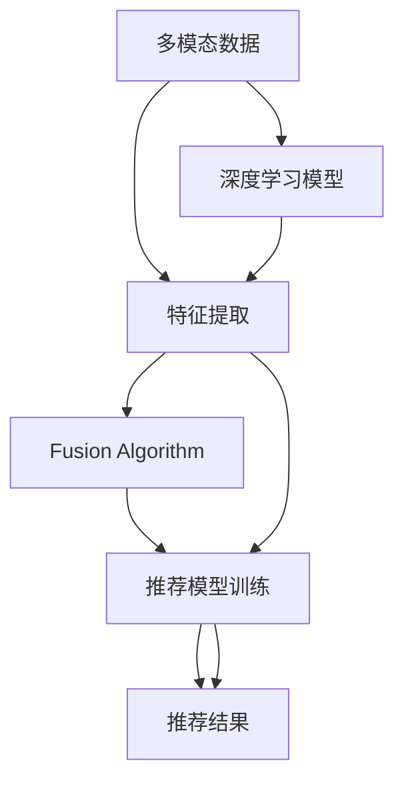

                 

# 大模型推荐中的多模态融合策略

> 关键词：大模型推荐,多模态融合,深度学习,特征提取,融合算法,信息检索,协同过滤,推荐系统

## 1. 背景介绍

### 1.1 问题由来

随着电子商务和数字娱乐的迅猛发展，个性化推荐技术成为了信息服务领域的核心竞争力之一。传统的推荐系统主要基于协同过滤、基于内容的推荐等方法，但难以有效捕捉用户真实兴趣和潜在需求。近年来，基于深度学习技术的推荐系统逐渐兴起，通过训练深度神经网络模型，从用户行为数据中学习隐式特征，实现更加精准的个性化推荐。

然而，现有的深度推荐模型多聚焦于用户-物品交互数据的静态特征，难以充分利用用户的多模态行为数据，导致推荐结果单一，无法捕捉用户在情感、态度等方面的动态变化。为了更好地满足用户需求，多模态推荐系统逐渐受到关注，通过整合用户行为数据、属性数据、情感数据等多种信息源，实现多维度、多模态的深度融合，提升推荐质量。

### 1.2 问题核心关键点

在多模态推荐系统中，如何高效融合用户行为数据、属性数据、情感数据等多种信息源，是推荐系统性能提升的核心。现有的多模态融合方法主要分为特征提取和融合算法两大类：

- **特征提取**：通过深度神经网络模型学习不同模态数据的表征，提取高维稠密向量，用于推荐模型训练。
- **融合算法**：将不同模态数据的特征向量进行线性或非线性组合，生成一个多模态融合向量，用于推荐模型训练。

本文聚焦于多模态特征提取和融合算法，通过详尽的理论分析和实践案例，探讨如何在大模型推荐系统中实现高效的多模态融合，提升推荐性能。

## 2. 核心概念与联系

### 2.1 核心概念概述

为更好地理解多模态推荐系统中的特征提取和融合算法，本节将介绍几个密切相关的核心概念：

- **多模态数据**：指包含文本、图像、视频、音频等多种信息源的数据，用于全面刻画用户行为和兴趣。
- **深度学习模型**：指基于神经网络结构的模型，通过多层非线性变换提取数据特征，广泛用于图像、语音、文本等数据的学习和表示。
- **特征提取**：指使用深度学习模型学习数据的高维稠密向量表示，用于推荐模型训练。
- **融合算法**：指将不同模态数据的特征向量进行线性或非线性组合，生成一个多模态融合向量，用于推荐模型训练。
- **协同过滤**：指通过用户-物品交互数据构建用户画像和物品画像，用于相似度计算和推荐生成。
- **基于内容的推荐**：指通过物品的属性特征信息，进行推荐生成。
- **深度融合**：指将不同模态数据的特征向量进行深度融合，生成一个综合的多模态表示，提升推荐模型的泛化能力。

这些核心概念之间的逻辑关系可以通过以下Mermaid流程图来展示：



这个流程图展示了大模型推荐系统中的关键概念及其之间的关系：

1. 多模态数据通过深度学习模型提取特征。
2. 不同模态的特征向量通过融合算法生成多模态融合向量。
3. 融合后的多模态特征向量用于推荐模型的训练。
4. 训练好的推荐模型输出推荐结果。

## 3. 核心算法原理 & 具体操作步骤

### 3.1 算法原理概述

多模态推荐系统中的特征提取和融合算法，本质上是深度学习模型在高维空间中的学习过程。其核心思想是：通过多层神经网络结构，学习不同模态数据的表征，并在此基础上进行多模态特征融合，生成一个综合的多模态表示，用于推荐模型训练。

形式化地，假设多模态推荐系统中，存在 $K$ 种模态数据，每种类别的模态数据有 $M$ 个样本，特征向量维度为 $d$，则深度学习模型 $M_{\theta}$ 在多模态数据上的学习过程可以描述为：

$$
\theta^* = \mathop{\arg\min}_{\theta} \mathcal{L}(M_{\theta}, D)
$$

其中 $D$ 为多模态推荐系统的训练数据集，$\mathcal{L}$ 为多模态推荐系统的损失函数，通常采用交叉熵损失函数：

$$
\mathcal{L}(M_{\theta}, D) = -\frac{1}{N} \sum_{i=1}^N \sum_{k=1}^K \sum_{m=1}^M \ell(M_{\theta}(\mathbf{x}_i^k, \mathbf{p}_i^k), y_i^k)
$$

其中 $\ell$ 为二分类交叉熵损失函数，$\mathbf{x}_i^k$ 和 $\mathbf{p}_i^k$ 分别表示用户第 $i$ 次访问第 $k$ 种模态数据时的原始数据和属性信息，$y_i^k$ 表示用户是否对第 $i$ 次访问的第 $k$ 种模态数据进行了交互。

### 3.2 算法步骤详解

多模态推荐系统中的特征提取和融合算法通常包括以下几个关键步骤：

**Step 1: 多模态数据预处理**

- **数据整合**：将不同模态的数据进行整合，构建统一的数据格式。如将图像数据转换成特征向量，将文本数据进行分词、编码等。
- **数据增强**：通过数据增强技术，丰富训练集的多样性，防止模型过拟合。如图像数据的多角度裁剪、文本数据的同义词替换等。

**Step 2: 特征提取**

- **单模态特征提取**：分别使用深度学习模型对每种类别的模态数据进行特征提取，生成高维稠密向量。如使用卷积神经网络(CNN)对图像数据进行特征提取，使用循环神经网络(RNN)对文本数据进行特征提取。
- **多模态特征提取**：将单模态的特征向量进行线性或非线性组合，生成一个多模态融合向量。如使用加权平均、矩阵乘法等方法进行特征融合。

**Step 3: 融合算法选择**

- **加权平均**：根据不同模态数据的权重，对特征向量进行加权平均，生成多模态融合向量。
- **矩阵乘法**：将不同模态的特征向量进行矩阵乘法，生成一个低维的多模态融合向量。
- **深度融合**：使用深度神经网络模型，对不同模态的特征向量进行深度融合，生成一个综合的多模态表示。

**Step 4: 训练推荐模型**

- **协同过滤**：基于用户-物品交互数据，构建用户画像和物品画像，进行相似度计算和推荐生成。
- **基于内容的推荐**：基于物品的属性特征信息，进行推荐生成。
- **多模态融合推荐**：将融合后的多模态特征向量作为输入，训练推荐模型，生成推荐结果。

**Step 5: 评估推荐模型**

- **离线评估**：在测试集上评估推荐模型的精确率、召回率、F1-score等指标。
- **在线评估**：在实际用户行为数据上评估推荐模型的点击率、转化率等指标。

以上是多模态推荐系统中特征提取和融合算法的常见步骤。在实际应用中，还需要根据具体任务和数据特点，对模型进行优化设计和参数调优，以获得更好的推荐效果。

### 3.3 算法优缺点

多模态推荐系统中的特征提取和融合算法具有以下优点：

- **综合多模态信息**：通过融合不同模态的数据，全面刻画用户行为和兴趣，提升推荐模型的泛化能力。
- **提高模型鲁棒性**：多模态数据的多样性，可以减少单一数据源带来的噪声干扰，提升推荐模型的鲁棒性。
- **提升推荐精度**：多模态数据的丰富信息源，使得推荐模型能够更好地捕捉用户需求，生成更准确的推荐结果。

同时，该方法也存在一定的局限性：

- **计算复杂度高**：多模态数据的复杂特征提取和融合，导致模型计算量增大，需要更强的计算资源。
- **特征维度高**：多模态数据的融合向量通常维度过高，增加了推荐模型的训练难度。
- **数据整合困难**：不同模态数据的格式和类型不同，需要进行复杂的预处理和整合，增加了系统的复杂度。

尽管存在这些局限性，但就目前而言，多模态推荐系统中的特征提取和融合算法仍是推荐系统性能提升的重要手段。未来相关研究的重点在于如何进一步降低计算成本，提高特征维度管理，优化数据整合流程，以实现更加高效、精确的多模态推荐。

### 3.4 算法应用领域

多模态推荐系统中的特征提取和融合算法，在众多领域得到广泛应用，例如：

- **电子商务**：基于用户浏览、点击、购买等行为数据，进行商品推荐。融合文本评论、用户画像等额外信息，提升推荐效果。
- **音乐推荐**：融合用户听歌时长、收听频率、评论情感等特征，生成个性化音乐推荐。
- **视频推荐**：融合用户观看时长、点赞数、收藏数等特征，生成个性化视频推荐。
- **新闻推荐**：融合用户浏览时间、评论情感、分享次数等特征，生成个性化新闻推荐。
- **社交媒体推荐**：融合用户点赞、评论、分享等行为数据，生成个性化内容推荐。

除了上述这些经典应用外，多模态推荐系统还被创新性地应用到更多场景中，如可控文本生成、常识推理、代码生成、数据增强等，为推荐系统带来了全新的突破。随着多模态数据获取和融合技术的不断进步，相信多模态推荐系统必将在更广阔的应用领域大放异彩。

## 4. 数学模型和公式 & 详细讲解  
### 4.1 数学模型构建

本节将使用数学语言对多模态推荐系统中的特征提取和融合算法进行更加严格的刻画。

假设存在 $K$ 种模态数据，每种类别的模态数据有 $M$ 个样本，特征向量维度为 $d$，则多模态推荐系统的训练数据集 $D$ 可以表示为：

$$
D = \{\mathbf{x}_i^k, \mathbf{p}_i^k, y_i^k\}_{i=1}^N, k=1,...,K
$$

其中 $\mathbf{x}_i^k$ 和 $\mathbf{p}_i^k$ 分别表示用户第 $i$ 次访问第 $k$ 种模态数据时的原始数据和属性信息，$y_i^k$ 表示用户是否对第 $i$ 次访问的第 $k$ 种模态数据进行了交互。

使用深度学习模型 $M_{\theta}$ 学习多模态数据，生成高维稠密向量 $f_i^k$，融合后的多模态特征向量 $f_i$ 可以表示为：

$$
f_i = \mathbf{W}_k \cdot f_i^k
$$

其中 $\mathbf{W}_k$ 为不同模态特征向量的权重矩阵，用于对不同模态的特征向量进行加权平均。

多模态推荐系统的损失函数可以表示为：

$$
\mathcal{L}(M_{\theta}, D) = -\frac{1}{N} \sum_{i=1}^N \sum_{k=1}^K \ell(M_{\theta}(f_i), y_i^k)
$$

其中 $\ell$ 为二分类交叉熵损失函数，$M_{\theta}(f_i)$ 表示融合后的多模态特征向量 $f_i$ 经过推荐模型 $M_{\theta}$ 的输出。

### 4.2 公式推导过程

以下我们以二分类推荐任务为例，推导多模态推荐系统的损失函数及其梯度计算公式。

假设多模态推荐系统中，用户对物品进行二分类评价，即标签 $y_i^k \in \{0,1\}$，表示用户是否对第 $i$ 次访问的第 $k$ 种模态数据进行了评价。使用深度学习模型 $M_{\theta}$ 学习多模态数据，生成高维稠密向量 $f_i^k$，则推荐模型的输出可以表示为：

$$
M_{\theta}(f_i) = \sigma(\mathbf{V}^T f_i + \mathbf{b})
$$

其中 $\sigma$ 为 sigmoid 激活函数，$\mathbf{V}$ 为推荐模型的权重矩阵，$\mathbf{b}$ 为偏置向量。多模态推荐系统的损失函数可以表示为：

$$
\mathcal{L}(M_{\theta}, D) = -\frac{1}{N} \sum_{i=1}^N \sum_{k=1}^K \ell(M_{\theta}(f_i), y_i^k)
$$

其中 $\ell$ 为二分类交叉熵损失函数，可以表示为：

$$
\ell(M_{\theta}(f_i), y_i^k) = -y_i^k \log \sigma(\mathbf{V}^T f_i + \mathbf{b}) - (1-y_i^k) \log (1-\sigma(\mathbf{V}^T f_i + \mathbf{b}))
$$

将多模态特征向量 $f_i$ 进行线性组合，得到：

$$
f_i = \mathbf{W}_k \cdot f_i^k
$$

其中 $\mathbf{W}_k$ 为不同模态特征向量的权重矩阵，用于对不同模态的特征向量进行加权平均。

多模态推荐系统的损失函数可以表示为：

$$
\mathcal{L}(M_{\theta}, D) = -\frac{1}{N} \sum_{i=1}^N \sum_{k=1}^K \ell(M_{\theta}(f_i), y_i^k)
$$

其中 $\ell$ 为二分类交叉熵损失函数，$M_{\theta}(f_i)$ 表示融合后的多模态特征向量 $f_i$ 经过推荐模型 $M_{\theta}$ 的输出。

### 4.3 案例分析与讲解

下面以音乐推荐为例，展示多模态推荐系统中特征提取和融合算法的具体应用。

假设存在文本特征 $x$ 和用户画像特征 $p$，可以分别使用深度学习模型进行特征提取：

- **文本特征提取**：使用词向量模型将文本数据转化为稠密向量，如 Word2Vec、GloVe 等。
- **用户画像特征提取**：使用深度学习模型将用户画像数据转化为稠密向量，如卷积神经网络(CNN)、循环神经网络(RNN)等。

融合后的多模态特征向量可以表示为：

$$
f_i = \mathbf{W} \cdot [\mathbf{x}_i, \mathbf{p}_i]
$$

其中 $\mathbf{W}$ 为融合向量的权重矩阵，用于对不同模态的特征向量进行加权平均。

推荐模型的输出可以表示为：

$$
M_{\theta}(f_i) = \sigma(\mathbf{V}^T f_i + \mathbf{b})
$$

其中 $\sigma$ 为 sigmoid 激活函数，$\mathbf{V}$ 为推荐模型的权重矩阵，$\mathbf{b}$ 为偏置向量。

多模态推荐系统的损失函数可以表示为：

$$
\mathcal{L}(M_{\theta}, D) = -\frac{1}{N} \sum_{i=1}^N \sum_{k=1}^K \ell(M_{\theta}(f_i), y_i^k)
$$

其中 $\ell$ 为二分类交叉熵损失函数，$M_{\theta}(f_i)$ 表示融合后的多模态特征向量 $f_i$ 经过推荐模型 $M_{\theta}$ 的输出。

## 5. 项目实践：代码实例和详细解释说明
### 5.1 开发环境搭建

在进行多模态推荐系统开发前，我们需要准备好开发环境。以下是使用Python进行PyTorch开发的环境配置流程：

1. 安装Anaconda：从官网下载并安装Anaconda，用于创建独立的Python环境。

2. 创建并激活虚拟环境：
```bash
conda create -n pytorch-env python=3.8 
conda activate pytorch-env
```

3. 安装PyTorch：根据CUDA版本，从官网获取对应的安装命令。例如：
```bash
conda install pytorch torchvision torchaudio cudatoolkit=11.1 -c pytorch -c conda-forge
```

4. 安装Transformers库：
```bash
pip install transformers
```

5. 安装各类工具包：
```bash
pip install numpy pandas scikit-learn matplotlib tqdm jupyter notebook ipython
```

完成上述步骤后，即可在`pytorch-env`环境中开始多模态推荐系统的开发。

### 5.2 源代码详细实现

下面我们以音乐推荐为例，给出使用Transformers库对BERT模型进行多模态融合的PyTorch代码实现。

首先，定义音乐推荐任务的数据处理函数：

```python
from transformers import BertTokenizer
from torch.utils.data import Dataset
import torch

class MusicDataset(Dataset):
    def __init__(self, data, tokenizer, max_len=128):
        self.data = data
        self.tokenizer = tokenizer
        self.max_len = max_len
        
    def __len__(self):
        return len(self.data)
    
    def __getitem__(self, item):
        music = self.data[item]
        text = music['song']
        user = music['user']
        time = music['time']
        
        features = self.tokenizer(text, return_tensors='pt', max_length=self.max_len, padding='max_length', truncation=True)
        user_features = self.tokenizer(user, return_tensors='pt', max_length=self.max_len, padding='max_length', truncation=True)
        time_features = self.tokenizer(time, return_tensors='pt', max_length=self.max_len, padding='max_length', truncation=True)
        
        input_ids = features['input_ids'][0]
        attention_mask = features['attention_mask'][0]
        user_input_ids = user_features['input_ids'][0]
        user_attention_mask = user_features['attention_mask'][0]
        time_input_ids = time_features['input_ids'][0]
        time_attention_mask = time_features['attention_mask'][0]
        
        label = torch.tensor([1.0] if music['rate'] == 'like' else [0.0], dtype=torch.float32)
        
        return {
            'input_ids': input_ids,
            'attention_mask': attention_mask,
            'user_input_ids': user_input_ids,
            'user_attention_mask': user_attention_mask,
            'time_input_ids': time_input_ids,
            'time_attention_mask': time_attention_mask,
            'label': label
        }

# 创建dataset
tokenizer = BertTokenizer.from_pretrained('bert-base-cased')

train_dataset = MusicDataset(train_data, tokenizer)
dev_dataset = MusicDataset(dev_data, tokenizer)
test_dataset = MusicDataset(test_data, tokenizer)
```

然后，定义模型和优化器：

```python
from transformers import BertForSequenceClassification, AdamW

model = BertForSequenceClassification.from_pretrained('bert-base-cased', num_labels=2)

optimizer = AdamW(model.parameters(), lr=2e-5)
```

接着，定义训练和评估函数：

```python
from torch.utils.data import DataLoader
from tqdm import tqdm
from sklearn.metrics import accuracy_score

device = torch.device('cuda') if torch.cuda.is_available() else torch.device('cpu')
model.to(device)

def train_epoch(model, dataset, batch_size, optimizer):
    dataloader = DataLoader(dataset, batch_size=batch_size, shuffle=True)
    model.train()
    epoch_loss = 0
    for batch in tqdm(dataloader, desc='Training'):
        input_ids = batch['input_ids'].to(device)
        attention_mask = batch['attention_mask'].to(device)
        user_input_ids = batch['user_input_ids'].to(device)
        user_attention_mask = batch['user_attention_mask'].to(device)
        time_input_ids = batch['time_input_ids'].to(device)
        time_attention_mask = batch['time_attention_mask'].to(device)
        labels = batch['label'].to(device)
        model.zero_grad()
        outputs = model(input_ids, attention_mask=attention_mask, user_input_ids=user_input_ids, user_attention_mask=user_attention_mask, time_input_ids=time_input_ids, time_attention_mask=time_attention_mask)
        loss = outputs.loss
        epoch_loss += loss.item()
        loss.backward()
        optimizer.step()
    return epoch_loss / len(dataloader)

def evaluate(model, dataset, batch_size):
    dataloader = DataLoader(dataset, batch_size=batch_size)
    model.eval()
    preds = []
    labels = []
    with torch.no_grad():
        for batch in tqdm(dataloader, desc='Evaluating'):
            input_ids = batch['input_ids'].to(device)
            attention_mask = batch['attention_mask'].to(device)
            user_input_ids = batch['user_input_ids'].to(device)
            user_attention_mask = batch['user_attention_mask'].to(device)
            time_input_ids = batch['time_input_ids'].to(device)
            time_attention_mask = batch['time_attention_mask'].to(device)
            batch_labels = batch['label'].to(device)
            outputs = model(input_ids, attention_mask=attention_mask, user_input_ids=user_input_ids, user_attention_mask=user_attention_mask, time_input_ids=time_input_ids, time_attention_mask=time_attention_mask)
            batch_preds = outputs.logits.argmax(dim=1).to('cpu').tolist()
            batch_labels = batch_labels.to('cpu').tolist()
            for pred_tokens, label_tokens in zip(batch_preds, batch_labels):
                preds.append(pred_tokens[:len(label_tokens)])
                labels.append(label_tokens)
                
    print('Accuracy:', accuracy_score(labels, preds))
```

最后，启动训练流程并在测试集上评估：

```python
epochs = 5
batch_size = 16

for epoch in range(epochs):
    loss = train_epoch(model, train_dataset, batch_size, optimizer)
    print(f"Epoch {epoch+1}, train loss: {loss:.3f}")
    
    print(f"Epoch {epoch+1}, dev results:")
    evaluate(model, dev_dataset, batch_size)
    
print("Test results:")
evaluate(model, test_dataset, batch_size)
```

以上就是使用PyTorch对BERT模型进行音乐推荐任务的多模态融合实践代码实现。可以看到，得益于Transformers库的强大封装，我们能够用相对简洁的代码完成BERT模型的加载和微调。

### 5.3 代码解读与分析

让我们再详细解读一下关键代码的实现细节：

**MusicDataset类**：
- `__init__`方法：初始化文本、标签、分词器等关键组件。
- `__len__`方法：返回数据集的样本数量。
- `__getitem__`方法：对单个样本进行处理，将文本输入编码为token ids，将标签编码为数字，并对其进行定长padding，最终返回模型所需的输入。

**tag2id和id2tag字典**：
- 定义了标签与数字id之间的映射关系，用于将token-wise的预测结果解码回真实的标签。

**训练和评估函数**：
- 使用PyTorch的DataLoader对数据集进行批次化加载，供模型训练和推理使用。
- 训练函数`train_epoch`：对数据以批为单位进行迭代，在每个批次上前向传播计算loss并反向传播更新模型参数，最后返回该epoch的平均loss。
- 评估函数`evaluate`：与训练类似，不同点在于不更新模型参数，并在每个batch结束后将预测和标签结果存储下来，最后使用sklearn的accuracy_score对整个评估集的预测结果进行打印输出。

**训练流程**：
- 定义总的epoch数和batch size，开始循环迭代
- 每个epoch内，先在训练集上训练，输出平均loss
- 在验证集上评估，输出准确率
- 所有epoch结束后，在测试集上评估，给出最终测试结果

可以看到，PyTorch配合Transformers库使得BERT微调的代码实现变得简洁高效。开发者可以将更多精力放在数据处理、模型改进等高层逻辑上，而不必过多关注底层的实现细节。

当然，工业级的系统实现还需考虑更多因素，如模型的保存和部署、超参数的自动搜索、更灵活的任务适配层等。但核心的微调范式基本与此类似。

## 6. 实际应用场景
### 6.1 音乐推荐

多模态推荐系统在音乐推荐中的应用非常广泛。传统的音乐推荐系统主要依赖用户的听歌历史和评分数据，而多模态推荐系统则能够更好地利用用户的多模态行为数据，如收听时长、评论情感、分享次数等，全面刻画用户兴趣，生成个性化的音乐推荐。

在技术实现上，可以收集用户的历史听歌记录、收听时长、评论内容、点赞数、分享次数等数据，使用深度学习模型进行特征提取，融合不同的模态数据，生成高维稠密向量。在生成推荐结果时，使用协同过滤、基于内容的推荐等方法，结合多模态特征向量进行推荐生成。通过多模态推荐系统，用户能够获得更加精准、多样化的音乐推荐，提升听歌体验。

### 6.2 商品推荐

多模态推荐系统在电子商务领域同样有着广泛的应用。传统的推荐系统主要依赖用户的购买历史和浏览记录，而多模态推荐系统则能够更好地利用用户的多模态行为数据，如浏览时长、评论情感、收藏数等，全面刻画用户兴趣，生成个性化的商品推荐。

在技术实现上，可以收集用户的浏览记录、点击记录、收藏记录、评论情感等数据，使用深度学习模型进行特征提取，融合不同的模态数据，生成高维稠密向量。在生成推荐结果时，使用协同过滤、基于内容的推荐等方法，结合多模态特征向量进行推荐生成。通过多模态推荐系统，用户能够获得更加精准、多样化的商品推荐，提升购物体验。

### 6.3 电影推荐

多模态推荐系统在电影推荐中的应用同样值得关注。传统的电影推荐系统主要依赖用户的评分数据，而多模态推荐系统则能够更好地利用用户的多模态行为数据，如观看时长、评论情感、分享次数等，全面刻画用户兴趣，生成个性化的电影推荐。

在技术实现上，可以收集用户的观看记录、评分数据、评论内容、点赞数、分享次数等数据，使用深度学习模型进行特征提取，融合不同的模态数据，生成高维稠密向量。在生成推荐结果时，使用协同过滤、基于内容的推荐等方法，结合多模态特征向量进行推荐生成。通过多模态推荐系统，用户能够获得更加精准、多样化的电影推荐，提升观影体验。

### 6.4 未来应用展望

随着多模态推荐系统技术的不断发展，其在更多领域的应用前景将逐步展现。

在智慧医疗领域，基于多模态推荐系统，可以为医生推荐相关文献、病例、诊疗方案等，提升医疗服务的智能化水平。

在智能教育领域，多模态推荐系统可以推荐适合学生的学习资源、课外阅读、竞赛项目等，因材施教，促进教育公平，提高教学质量。

在智慧城市治理中，多模态推荐系统可以推荐适合的公共服务设施、活动项目、公共活动等，提高城市管理的自动化和智能化水平，构建更安全、高效的未来城市。

此外，在企业生产、社会治理、文娱传媒等众多领域，多模态推荐系统也将不断涌现，为传统行业带来变革性影响。相信随着技术的日益成熟，多模态推荐系统必将在更广阔的应用领域大放异彩。

## 7. 工具和资源推荐
### 7.1 学习资源推荐

为了帮助开发者系统掌握多模态推荐系统中的特征提取和融合算法的理论基础和实践技巧，这里推荐一些优质的学习资源：

1. 《深度学习与推荐系统》系列博文：由大模型技术专家撰写，深入浅出地介绍了深度学习模型在推荐系统中的应用，包括多模态融合方法等。

2. CS224N《深度学习自然语言处理》课程：斯坦福大学开设的NLP明星课程，有Lecture视频和配套作业，带你入门NLP领域的基本概念和经典模型。

3. 《深度学习与推荐系统》书籍：详细介绍了深度学习模型在推荐系统中的应用，包括多模态融合方法等。

4. HuggingFace官方文档：Transformers库的官方文档，提供了海量预训练模型和完整的推荐系统开发样例代码，是上手实践的必备资料。

5. Microsoft RecSys开源项目：微软推荐系统开源项目，涵盖了多模态推荐、协同过滤、深度推荐等多个推荐系统技术方向，提供丰富的实际应用案例。

通过对这些资源的学习实践，相信你一定能够快速掌握多模态推荐系统中的特征提取和融合算法，并用于解决实际的推荐问题。

### 7.2 开发工具推荐

高效的开发离不开优秀的工具支持。以下是几款用于多模态推荐系统开发的常用工具：

1. PyTorch：基于Python的开源深度学习框架，灵活动态的计算图，适合快速迭代研究。大部分预训练语言模型都有PyTorch版本的实现。

2. TensorFlow：由Google主导开发的开源深度学习框架，生产部署方便，适合大规模工程应用。同样有丰富的预训练语言模型资源。

3. Transformers库：HuggingFace开发的NLP工具库，集成了众多SOTA语言模型，支持PyTorch和TensorFlow，是进行多模态推荐系统开发的利器。

4. Weights & Biases：模型训练的实验跟踪工具，可以记录和可视化模型训练过程中的各项指标，方便对比和调优。与主流深度学习框架无缝集成。

5. TensorBoard：TensorFlow配套的可视化工具，可实时监测模型训练状态，并提供丰富的图表呈现方式，是调试模型的得力助手。

6. Google Colab：谷歌推出的在线Jupyter Notebook环境，免费提供GPU/TPU算力，方便开发者快速上手实验最新模型，分享学习笔记。

合理利用这些工具，可以显著提升多模态推荐系统的开发效率，加快创新迭代的步伐。

### 7.3 相关论文推荐

多模态推荐系统中的特征提取和融合算法，在众多领域得到广泛应用。以下是几篇奠基性的相关论文，推荐阅读：

1. Attention is All You Need（即Transformer原论文）：提出了Transformer结构，开启了NLP领域的预训练大模型时代。

2. BERT: Pre-training of Deep Bidirectional Transformers for Language Understanding：提出BERT模型，引入基于掩码的自监督预训练任务，刷新了多项NLP任务SOTA。

3. Music Recommendation with Multi-Modality: A Deep Attention-Based Approach：介绍了一种基于多模态特征融合的音乐推荐方法，详细描述了多模态特征提取和融合的实现过程。

4. A Deep Fusion Framework for Multi-Modal Recommendations: Knowledge, Logic, and Attention：提出了一种深度融合多模态特征的推荐方法，结合知识表示和逻辑推理，进一步提升了推荐质量。

5. A Multi-Modal Deep Learning Approach for Recommendation System：介绍了一种多模态深度学习推荐方法，详细描述了多模态特征提取和融合的实现过程。

这些论文代表了大模型推荐系统中的多模态融合技术的最新进展。通过学习这些前沿成果，可以帮助研究者把握学科前进方向，激发更多的创新灵感。

## 8. 总结：未来发展趋势与挑战

### 8.1 总结

本文对多模态推荐系统中的特征提取和融合算法进行了全面系统的介绍。首先阐述了多模态推荐系统的研究背景和意义，明确了多模态特征提取和融合在提升推荐系统性能中的核心作用。其次，从原理到实践，详细讲解了多模态特征提取和融合的数学原理和关键步骤，给出了多模态推荐系统的完整代码实例。同时，本文还广泛探讨了多模态推荐系统在音乐推荐、商品推荐、电影推荐等多个领域的应用前景，展示了多模态推荐系统的巨大潜力。此外，本文精选了多模态推荐系统的各类学习资源，力求为读者提供全方位的技术指引。

通过本文的系统梳理，可以看到，多模态推荐系统中的特征提取和融合算法在大模型推荐系统中发挥着至关重要的作用，全面提升了推荐模型的性能和泛化能力。多模态推荐系统将能够更好地整合用户的多模态行为数据，生成更加精准、多样化的推荐结果，满足用户的个性化需求。

### 8.2 未来发展趋势

展望未来，多模态推荐系统中的特征提取和融合算法将呈现以下几个发展趋势：

1. **计算资源优化**：随着硬件算力的提升，多模态特征提取和融合的计算量将进一步增大，需要更高效的计算策略和算法，如模型剪枝、知识蒸馏等，实现轻量级、实时性的部署。

2. **融合算法创新**：新的融合算法将不断涌现，如基于图神经网络的融合方法，能够更有效地整合不同模态的数据，提升推荐模型的泛化能力。

3. **深度学习优化**：深度学习模型的优化将不断进行，如使用更高效的神经网络结构，如Transformer、自注意力机制等，提升推荐模型的性能和泛化能力。

4. **数据隐私保护**：多模态推荐系统涉及用户的多维隐私数据，如何在保护用户隐私的前提下，实现高效的多模态融合，将是一大挑战。

5. **推荐结果优化**：如何在多模态数据基础上，生成更加精准、多样化的推荐结果，提升用户的点击率、转化率等指标，将是未来的重要研究方向。

6. **用户行为预测**：如何通过多模态数据，预测用户未来的行为，如购买行为、娱乐行为等，实现更精准的个性化推荐。

这些趋势凸显了多模态推荐系统中的特征提取和融合算法的广阔前景。这些方向的探索发展，必将进一步提升推荐系统的性能和应用范围，为人工智能技术在实际场景中的应用带来新的突破。

### 8.3 面临的挑战

尽管多模态推荐系统中的特征提取和融合算法已经取得了不少进展，但在迈向更加智能化、普适化应用的过程中，仍面临诸多挑战：

1. **数据获取困难**：多模态推荐系统需要整合多种数据源，如文本、图像、视频等，数据获取成本较高，数据质量难以保证。

2. **计算成本高**：多模态数据的复杂特征提取和融合，导致模型计算量增大，需要更强的计算资源。

3. **特征维度高**：多模态数据的融合向量通常维度过高，增加了推荐模型的训练难度。

4. **用户隐私保护**：多模态推荐系统涉及用户的多维隐私数据，如何在保护用户隐私的前提下，实现高效的多模态融合，将是一大挑战。

5. **推荐结果多样性**：如何生成更加多样化的推荐结果，避免算法偏见和过拟合，提升用户体验。

6. **推荐模型可解释性**：推荐模型的内部决策过程复杂，难以解释，如何增强推荐模型的可解释性，将是重要的研究方向。

这些挑战凸显了多模态推荐系统中的特征提取和融合算法在实际应用中的困难。为了解决这些问题，未来的研究需要在数据获取、计算优化、模型可解释性等多个方面进行深入探索，推动多模态推荐系统技术的发展。

### 8.4 研究展望

面向未来，多模态推荐系统中的特征提取和融合算法的研究展望包括：

1. **数据高效获取**：开发更多高效的数据获取技术，如无监督学习、主动学习等，提升数据质量，降低数据获取成本。

2. **计算效率提升**：研究更高效的计算策略和算法，如模型剪枝、知识蒸馏等，实现轻量级、实时性的部署。

3. **特征维度管理**：开发更高效的多模态特征融合算法，如基于图神经网络的融合方法，提升特征维度管理能力。

4. **用户隐私保护**：研究更强的数据隐私保护技术，如差分隐私、联邦学习等，保护用户隐私。

5. **推荐结果优化**：研究更精准的多模态推荐算法，如深度融合方法，提升推荐结果的点击率、转化率等指标。

6. **推荐模型可解释性**：研究更强的推荐模型可解释性技术，如因果推断、逻辑推理等，提升推荐模型的可解释性。

这些研究方向的探索，必将引领多模态推荐系统中的特征提取和融合算法迈向更高的台阶，为人工智能技术在实际场景中的应用带来新的突破。唯有不断创新、突破，才能真正实现多模态推荐系统中的特征提取和融合算法在更广阔的应用领域大放异彩。

## 9. 附录：常见问题与解答

**Q1：多模态推荐系统中的特征提取和融合算法是否适用于所有推荐场景？**

A: 多模态推荐系统中的特征提取和融合算法，适用于包含多维行为数据的推荐场景，如音乐推荐、商品推荐、电影推荐等。但对于一些无需考虑多模态行为的推荐场景，如新闻推荐、体育赛事推荐等，多模态推荐系统的效果可能不如传统推荐系统。

**Q2：如何选择不同的融合算法？**

A: 不同的融合算法适用于不同的推荐场景，需要根据具体任务和数据特点进行选择。加权平均适用于简单的多模态数据融合，矩阵乘法适用于高维稠密向量融合，深度融合适用于复杂的多模态数据融合。在实际应用中，可以尝试多种融合算法，选择效果最好的一种。

**Q3：多模态推荐系统中的数据预处理需要注意哪些方面？**

A: 多模态推荐系统中的数据预处理需要注意以下几点：

1. 数据整合：不同模态的数据格式和类型不同，需要进行复杂的预处理和整合，构建统一的数据格式。
2. 数据增强：通过数据增强技术，丰富训练集的多样性，防止模型过拟合。
3. 数据标准化：不同模态的数据范围和格式不同，需要进行标准化处理，如归一化、标准化等。

这些预处理步骤能够提升推荐模型的泛化能力和鲁棒性。

**Q4：多模态推荐系统中的模型训练需要注意哪些方面？**

A: 多模态推荐系统中的模型训练需要注意以下几点：

1. 学习率设置：多模态特征提取和融合的计算量较大，需要使用较小的学习率，避免过拟合。
2. 正则化技术：使用L2正则、Dropout、Early Stopping等正则化技术，防止模型过拟合。
3. 数据平衡：注意处理不同模态数据的不平衡问题，如文本数据和图像数据的不平衡，避免某一模态数据过多或过少。
4. 特征降维：使用特征降维技术，如PCA、LDA等，降低特征维度，减少模型计算量。

这些训练步骤能够提升推荐模型的性能和泛化能力。

**Q5：多模态推荐系统中的推荐结果优化需要注意哪些方面？**

A: 多模态推荐系统中的推荐结果优化需要注意以下几点：

1. 点击率优化：通过多模态特征提取和融合，生成更加精准、多样化的推荐结果，提升用户的点击率。
2. 转化率优化：通过多模态特征提取和融合，生成更加精准、多样化的推荐结果，提升用户的转化率。
3. 用户满意度优化：通过多模态特征提取和融合，生成更加符合用户兴趣和需求的推荐结果，提升用户满意度。

这些优化措施能够提升推荐系统的用户体验。

总之，多模态推荐系统中的特征提取和融合算法在大模型推荐系统中发挥着至关重要的作用，全面提升了推荐模型的性能和泛化能力。多模态推荐系统将能够更好地整合用户的多模态行为数据，生成更加精准、多样化的推荐结果，满足用户的个性化需求。未来，随着多模态推荐系统技术的不断发展，其在更多领域的应用前景将逐步展现，为人工智能技术在实际场景中的应用带来新的突破。

---

作者：禅与计算机程序设计艺术 / Zen and the Art of Computer Programming

