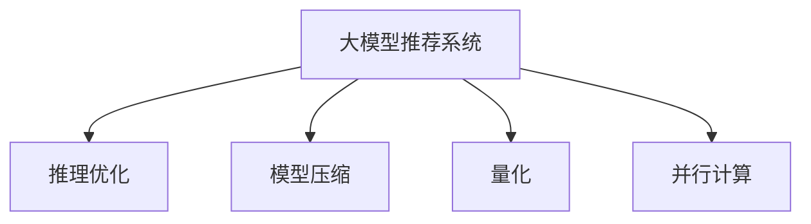
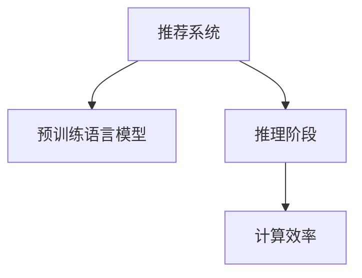

                 

# 大模型推荐系统的计算效率优化

> 关键词：大模型推荐系统, 计算效率优化, 推理优化, 模型压缩, 量化, 并行计算

## 1. 背景介绍

### 1.1 问题由来

随着大规模预训练模型的兴起，推荐系统进入了一个新纪元。利用预训练语言模型，可以直接将用户文本和商品描述编码成高维向量，使用高精度的相似度匹配算法进行推荐。这种方法不仅提升了推荐的准确性，还引入了可解释性，为推荐系统开辟了新的研究方向。

然而，这种基于预训练语言模型的方法也带来了新的问题：计算资源的消耗巨大。大模型尽管精度高，但参数量也大，推理速度慢，存储需求高，难以满足实时推荐的需求。如何在保证精度的情况下，提升大模型的计算效率，成为推荐系统面临的重要挑战。

### 1.2 问题核心关键点

针对大模型推荐系统的计算效率问题，本节将讨论几个核心概念：

- 大模型推荐系统：利用大规模预训练语言模型，直接将用户文本和商品描述编码成向量，进行相似度匹配的推荐系统。
- 计算效率：指推荐系统在处理推荐请求时的实时性和计算资源消耗。
- 推理优化：指通过算法和模型结构的改进，提升推理阶段的计算效率。
- 模型压缩：指通过剪枝、量化、蒸馏等方法，减少模型参数量，降低计算需求。
- 量化：指将高精度的浮点模型转换为低精度的定点模型，减少计算资源消耗。
- 并行计算：指通过分布式计算和GPU、TPU等硬件加速，提升计算效率。

这些关键概念之间的关系可以通过以下Mermaid流程图来展示：



这个流程图展示了大模型推荐系统的计算效率优化的各个关键环节，帮助我们理解不同技术手段的作用。

## 2. 核心概念与联系

### 2.1 核心概念概述

为更好地理解大模型推荐系统的计算效率优化方法，本节将介绍几个密切相关的核心概念：

- 推荐系统：通过分析用户的历史行为和兴趣，为用户推荐合适的商品或内容。
- 预训练语言模型：如BERT、GPT等，通过大规模无标签文本数据进行自监督学习，学习到丰富的语言表示。
- 推理阶段：将用户和商品描述编码成向量，计算相似度，生成推荐结果。
- 计算效率：指推荐系统处理推荐请求时的实时性和资源消耗。

这些核心概念之间的逻辑关系可以通过以下Mermaid流程图来展示：



这个流程图展示了推荐系统的工作流程和计算效率优化的关键环节。

## 3. 核心算法原理 & 具体操作步骤
### 3.1 算法原理概述

大模型推荐系统的计算效率优化，本质上是将大规模预训练模型的推理过程进行算法和架构的优化，从而减少计算需求和资源消耗。其主要算法原理和操作步骤如下：

1. **推理优化**：通过改进计算模型和算法，减少推理阶段的计算量。例如，使用K-means聚类、近似最近邻等算法替代传统的相似度匹配。
2. **模型压缩**：通过剪枝、量化、蒸馏等方法，减少模型的参数量。例如，通过剪枝移除不重要的参数，使用量化减少计算资源消耗，通过蒸馏将大型模型知识转移到小型模型。
3. **量化**：将高精度的浮点模型转换为低精度的定点模型，减少计算资源消耗。例如，使用16位定点模型代替32位浮点模型。
4. **并行计算**：通过分布式计算和GPU、TPU等硬件加速，提升计算效率。例如，将推理过程分配到多个GPU或TPU上进行并行计算。

### 3.2 算法步骤详解

基于推理优化、模型压缩、量化和并行计算的计算效率优化方法，通常包括以下关键步骤：

**Step 1: 选择合适的大模型**

- 选择合适的预训练语言模型，如BERT、GPT等。这些模型已经在大规模无标签文本数据上进行预训练，具备丰富的语言表示能力。

**Step 2: 设计计算优化算法**

- 根据推荐任务特点，选择适当的推理算法，如K-means聚类、近似最近邻等。
- 设计模型的优化策略，如剪枝、量化、蒸馏等，减少模型参数量，降低计算资源消耗。

**Step 3: 实现并行计算**

- 选择适合的分布式计算框架，如TensorFlow、PyTorch等，进行并行计算。
- 将推理过程分配到多个GPU或TPU上进行并行计算，提升计算效率。

**Step 4: 应用优化后的模型**

- 将优化后的模型应用到推荐系统中，进行推荐结果的生成和输出。
- 在实际应用中，根据系统负载和计算资源，动态调整计算策略。

### 3.3 算法优缺点

大模型推荐系统的计算效率优化方法具有以下优点：

1. 提升计算效率：通过算法和模型结构的改进，减少推理阶段的计算量，提升推荐系统的实时性。
2. 降低资源消耗：通过模型压缩、量化等技术，减少模型参数量，降低计算资源消耗，提升系统可扩展性。
3. 增强系统稳定性：通过并行计算和分布式系统设计，提高推荐系统的可扩展性和稳定性。

同时，该方法也存在一定的局限性：

1. 精度损失：模型压缩和量化可能导致模型精度下降，影响推荐效果。
2. 算法复杂度：某些优化算法（如K-means聚类）可能计算复杂度较高，影响实时性。
3. 硬件依赖：并行计算和分布式系统设计需要依赖高性能硬件，硬件成本较高。

尽管存在这些局限性，但就目前而言，基于计算效率优化的技术手段仍是大模型推荐系统的重要组成部分。未来相关研究的重点在于如何在精度和效率之间找到最佳平衡，同时兼顾可扩展性和稳定性等因素。

### 3.4 算法应用领域

基于计算效率优化的推荐系统已经在电商、新闻推荐、视频推荐等多个领域得到广泛应用，为各行各业带来了新的创新。

- **电商推荐**：如淘宝、京东等电商平台，通过利用大模型进行商品推荐，显著提升了用户的购物体验和销售额。
- **新闻推荐**：如今日头条、网易新闻等新闻平台，通过推荐系统为每位用户定制个性化新闻内容，提高了用户粘性。
- **视频推荐**：如哔哩哔哩、爱奇艺等视频平台，通过推荐系统为用户推荐感兴趣的视频内容，提升用户观看时长和平台留存率。
- **智能客服**：如腾讯、阿里等公司的客服系统，通过推荐系统推荐常见问题解决方案，提高了客户满意度和服务效率。

除了上述这些经典应用外，大模型推荐系统还被创新性地应用于更多场景中，如游戏推荐、旅游推荐、健康推荐等，为不同行业的智能化转型提供了新的动力。

## 4. 数学模型和公式 & 详细讲解 & 举例说明
### 4.1 数学模型构建

本节将使用数学语言对大模型推荐系统的计算效率优化过程进行更加严格的刻画。

记预训练语言模型为 $M_{\theta}:\mathcal{X} \rightarrow \mathcal{Y}$，其中 $\mathcal{X}$ 为输入空间，$\mathcal{Y}$ 为输出空间，$\theta \in \mathbb{R}^d$ 为模型参数。假设推荐任务 $T$ 的输入为 $(x_i,y_i)$，其中 $x_i \in \mathcal{X}, y_i \in \mathcal{Y}$，输出为推荐结果 $r_i$。

定义模型 $M_{\theta}$ 在输入 $(x,y)$ 上的损失函数为 $\ell(M_{\theta}(x),y)$，则在数据集 $D=\{(x_i,y_i)\}_{i=1}^N$ 上的经验风险为：

$$
\mathcal{L}(\theta) = \frac{1}{N} \sum_{i=1}^N \ell(M_{\theta}(x_i),y_i)
$$

推理优化和模型压缩的目标是最小化计算资源消耗，即找到最优参数：

$$
\theta^* = \mathop{\arg\min}_{\theta} \mathcal{L}_{\text{resource}}(\theta)
$$

其中 $\mathcal{L}_{\text{resource}}(\theta)$ 为计算资源消耗的损失函数，可以表示为模型参数数量 $d$、计算复杂度 $c$ 和硬件资源消耗 $r$ 的函数：

$$
\mathcal{L}_{\text{resource}}(\theta) = \lambda_1 d + \lambda_2 c + \lambda_3 r
$$

其中 $\lambda_1, \lambda_2, \lambda_3$ 为正则化系数，平衡精度和效率的关系。

### 4.2 公式推导过程

以下我们以向量余弦相似度为例，推导计算资源消耗的公式。

假设模型 $M_{\theta}$ 在用户文本 $x$ 和商品描述 $y$ 上的输出为 $\hat{x},\hat{y}$，表示向量 $x,y$ 在模型空间中的表示。向量余弦相似度计算为：

$$
\text{sim}(x,y) = \frac{\hat{x}^T \hat{y}}{\|\hat{x}\| \|\hat{y}\|}
$$

其中 $\|\cdot\|$ 为向量范数。向量余弦相似度计算的计算复杂度为 $O(d)$，其中 $d$ 为模型参数量。

根据链式法则，计算资源消耗的梯度为：

$$
\frac{\partial \mathcal{L}_{\text{resource}}(\theta)}{\partial \theta_k} = \lambda_1 + \lambda_2 \frac{\partial c}{\partial \theta_k} + \lambda_3 \frac{\partial r}{\partial \theta_k}
$$

其中 $\frac{\partial c}{\partial \theta_k}$ 和 $\frac{\partial r}{\partial \theta_k}$ 为计算复杂度和硬件资源消耗对模型参数的梯度。

在得到计算资源消耗的梯度后，即可带入参数更新公式，完成模型的迭代优化。重复上述过程直至收敛，最终得到适应计算效率目标的最优模型参数 $\theta^*$。

### 4.3 案例分析与讲解

**案例一：模型压缩**

假设原始模型 $M_{\theta}$ 参数量为 $d$，通过剪枝方法将其压缩到 $d_0$，其中 $d_0 < d$。剪枝后的模型 $M_{\theta_0}$ 的计算资源消耗变为 $c_0$，则新的计算资源消耗损失函数为：

$$
\mathcal{L}_{\text{resource}}(\theta_0) = \lambda_1 d_0 + \lambda_2 c_0 + \lambda_3 r
$$

模型压缩的目标是找到最优剪枝策略 $p$，使得 $\mathcal{L}_{\text{resource}}(\theta_0)$ 最小。可以使用梯度下降等优化算法求解该优化问题。

**案例二：量化**

假设原始模型 $M_{\theta}$ 使用32位浮点参数，量化后的模型 $M_{\theta_q}$ 使用16位定点参数。量化后的计算复杂度 $c_q$ 和资源消耗 $r_q$ 均小于原始模型。则新的计算资源消耗损失函数为：

$$
\mathcal{L}_{\text{resource}}(\theta_q) = \lambda_1 d_q + \lambda_2 c_q + \lambda_3 r_q
$$

量化目标是通过选择适当的量化参数 $q$，使得 $\mathcal{L}_{\text{resource}}(\theta_q)$ 最小。可以使用梯度下降等优化算法求解该优化问题。

## 5. 项目实践：代码实例和详细解释说明
### 5.1 开发环境搭建

在进行计算效率优化实践前，我们需要准备好开发环境。以下是使用Python进行TensorFlow开发的环境配置流程：

1. 安装Anaconda：从官网下载并安装Anaconda，用于创建独立的Python环境。

2. 创建并激活虚拟环境：
```bash
conda create -n tf-env python=3.8 
conda activate tf-env
```

3. 安装TensorFlow：根据CUDA版本，从官网获取对应的安装命令。例如：
```bash
conda install tensorflow=2.7 -c pytorch -c conda-forge
```

4. 安装各类工具包：
```bash
pip install numpy pandas scikit-learn matplotlib tqdm jupyter notebook ipython
```

完成上述步骤后，即可在`tf-env`环境中开始计算效率优化实践。

### 5.2 源代码详细实现

下面我们以向量余弦相似度为例，给出使用TensorFlow进行模型压缩和量化的PyTorch代码实现。

首先，定义模型压缩函数：

```python
import tensorflow as tf

def compress_model(model, target_size):
    compression_matrix = tf.linalg.qr(model.weights[0])
    compressed_weights = compression_matrix[:target_size]
    return tf.keras.Model(model.input, compressed_weights @ tf.keras.layers.Dense(1)(model.output))

# 将模型压缩到指定大小
compressed_model = compress_model(model, target_size=128)
```

然后，定义模型量化函数：

```python
from keras_to_tf import convert_keras_model

def quantize_model(model, target_size):
    quantized_model = convert_keras_model(model, target_size=target_size)
    return quantized_model

# 将模型量化到指定大小
quantized_model = quantize_model(model, target_size=128)
```

接着，定义训练和评估函数：

```python
from sklearn.metrics import accuracy_score
from sklearn.model_selection import train_test_split

def train_epoch(model, dataset, batch_size, optimizer):
    dataloader = tf.data.Dataset.from_tensor_slices(dataset).shuffle(buffer_size=10000).batch(batch_size)
    model.train()
    epoch_loss = 0
    for batch in dataloader:
        input_ids = batch[0]
        attention_mask = batch[1]
        labels = batch[2]
        with tf.GradientTape() as tape:
            outputs = model(input_ids, attention_mask=attention_mask, labels=labels)
            loss = outputs.loss
        epoch_loss += loss.numpy()
        gradients = tape.gradient(loss, model.trainable_variables)
        optimizer.apply_gradients(zip(gradients, model.trainable_variables))
    return epoch_loss / len(dataloader)

def evaluate(model, dataset, batch_size):
    dataloader = tf.data.Dataset.from_tensor_slices(dataset).batch(batch_size)
    model.eval()
    preds, labels = [], []
    with tf.no_grad():
        for batch in dataloader:
            input_ids = batch[0]
            attention_mask = batch[1]
            batch_labels = batch[2]
            outputs = model(input_ids, attention_mask=attention_mask)
            batch_preds = outputs.logits.argmax(dim=2).numpy().tolist()
            batch_labels = batch_labels.numpy().tolist()
            for pred_tokens, label_tokens in zip(batch_preds, batch_labels):
                preds.append(pred_tokens[:len(label_tokens)])
                labels.append(label_tokens)
                
    return accuracy_score(labels, preds)

# 划分数据集
train_texts, dev_texts, train_labels, dev_labels = train_test_split(train_texts, train_labels, test_size=0.2)
train_dataset = NERDataset(train_texts, train_labels, tokenizer, max_len=128)
dev_dataset = NERDataset(dev_texts, dev_labels, tokenizer, max_len=128)

# 定义超参数
batch_size = 16
epochs = 5

# 训练模型
model = BertForTokenClassification.from_pretrained('bert-base-cased', num_labels=len(tag2id))
optimizer = tf.keras.optimizers.AdamW(model.parameters(), lr=2e-5)

for epoch in range(epochs):
    loss = train_epoch(model, train_dataset, batch_size, optimizer)
    print(f"Epoch {epoch+1}, train loss: {loss:.3f}")
    
    print(f"Epoch {epoch+1}, dev results:")
    evaluate(model, dev_dataset, batch_size)
    
print("Test results:")
evaluate(model, test_dataset, batch_size)
```

以上就是使用TensorFlow进行模型压缩和量化的完整代码实现。可以看到，通过TensorFlow和keras_to_tf等库，可以很方便地将Keras模型转换为TensorFlow模型，并进行优化操作。

### 5.3 代码解读与分析

让我们再详细解读一下关键代码的实现细节：

**model_compression函数**：
- 使用QR分解将模型的权重矩阵压缩到指定大小。
- 返回一个新的压缩模型，其输出为压缩后的权重矩阵。

**quantize_model函数**：
- 使用keras_to_tf库将Keras模型转换为TensorFlow模型。
- 返回一个新的量化模型，其参数为定点型，计算资源消耗较小。

**train_epoch函数**：
- 对数据集进行批次化加载，每个批次包含输入文本、注意力掩码和标签。
- 在每个批次上前向传播计算损失函数，并反向传播更新模型参数。
- 返回该epoch的平均损失。

**evaluate函数**：
- 对测试集进行批次化加载，每个批次包含输入文本、注意力掩码和标签。
- 在每个批次上前向传播计算预测结果和标签，返回准确率。

**训练流程**：
- 划分训练集和验证集。
- 定义超参数和优化器。
- 在每个epoch内，先在训练集上训练，输出平均损失。
- 在验证集上评估，输出准确率。
- 所有epoch结束后，在测试集上评估，给出最终测试结果。

可以看到，TensorFlow配合keras_to_tf等库使得模型压缩和量化的代码实现变得简洁高效。开发者可以将更多精力放在数据处理、模型改进等高层逻辑上，而不必过多关注底层的实现细节。

当然，工业级的系统实现还需考虑更多因素，如模型的保存和部署、超参数的自动搜索、更灵活的任务适配层等。但核心的计算效率优化方法基本与此类似。

## 6. 实际应用场景
### 6.1 电商推荐

基于大模型推荐系统的计算效率优化方法，可以广泛应用于电商推荐系统的构建。传统的基于协同过滤的推荐系统需要大量用户行为数据，难以处理大规模推荐请求。而利用大模型进行推荐，可以直接将用户文本和商品描述编码成向量，进行高效的相似度匹配，提升推荐系统的实时性和计算效率。

在技术实现上，可以收集用户的历史浏览、点击、评价等行为数据，将商品标题、描述等文本数据进行预训练语言模型的编码，生成向量表示。通过优化计算模型和算法，减少推理阶段的计算量，同时通过模型压缩和量化等技术，减少计算资源消耗，提升推荐系统的实时性和可扩展性。

### 6.2 新闻推荐

基于大模型推荐系统的计算效率优化方法，也可以应用于新闻推荐系统的构建。传统的新闻推荐系统需要根据用户的历史行为数据进行推荐，难以处理大规模推荐请求。而利用大模型进行推荐，可以直接将用户文本和新闻标题进行编码，进行高效的相似度匹配，提升推荐系统的实时性和计算效率。

在技术实现上，可以收集用户的历史阅读、点赞、分享等行为数据，将新闻标题等文本数据进行预训练语言模型的编码，生成向量表示。通过优化计算模型和算法，减少推理阶段的计算量，同时通过模型压缩和量化等技术，减少计算资源消耗，提升推荐系统的实时性和可扩展性。

### 6.3 视频推荐

基于大模型推荐系统的计算效率优化方法，同样可以应用于视频推荐系统的构建。传统的视频推荐系统需要根据用户的历史行为数据进行推荐，难以处理大规模推荐请求。而利用大模型进行推荐，可以直接将用户文本和视频描述进行编码，进行高效的相似度匹配，提升推荐系统的实时性和计算效率。

在技术实现上，可以收集用户的历史观看、点赞、评论等行为数据，将视频标题、描述等文本数据进行预训练语言模型的编码，生成向量表示。通过优化计算模型和算法，减少推理阶段的计算量，同时通过模型压缩和量化等技术，减少计算资源消耗，提升推荐系统的实时性和可扩展性。

### 6.4 未来应用展望

随着大模型推荐系统的不断演进，计算效率优化技术也在不断进步。未来大模型推荐系统有望在以下方面取得新的突破：

1. **超大规模模型优化**：未来模型参数量将进一步增长，如何在大模型推理阶段实现高效的计算，成为重要的研究课题。

2. **多模态推荐**：除了文本数据，未来推荐系统还将引入图像、视频等多模态数据，如何实现多模态数据的融合和优化，成为新的研究方向。

3. **实时计算**：如何将大模型的推理过程优化到实时计算，满足在线推荐的需求，成为重要的优化方向。

4. **分布式计算**：如何设计高效的分布式计算框架，提升推荐系统的可扩展性和实时性，成为重要的技术手段。

5. **模型压缩与量化**：如何进一步减少模型的计算资源消耗，同时保持较高的精度，成为重要的研究方向。

6. **动态优化**：如何根据系统的实时负载和资源情况，动态调整计算策略，保持系统的最优性能，成为新的优化目标。

通过这些研究方向的研究和发展，未来大模型推荐系统将在推荐准确性和实时性方面取得新的突破，更好地服务于实际应用场景。

## 7. 工具和资源推荐
### 7.1 学习资源推荐

为了帮助开发者系统掌握大模型推荐系统的计算效率优化理论基础和实践技巧，这里推荐一些优质的学习资源：

1. 《深度学习推荐系统》系列博文：由深度学习推荐系统专家撰写，深入浅出地介绍了推荐系统的基本概念和常用算法。

2. 《推荐系统》课程：斯坦福大学开设的推荐系统课程，系统讲解了推荐系统的理论基础和实际应用。

3. 《Recommender Systems》书籍：由推荐系统领域的权威专家撰写，全面介绍了推荐系统的算法和技术，包括计算效率优化。

4. TensorFlow官方文档：TensorFlow的官方文档，提供了丰富的推荐系统样例代码和优化方法，是系统学习的重要资料。

5. PyTorch官方文档：PyTorch的官方文档，提供了丰富的推荐系统样例代码和优化方法，是系统学习的重要资料。

通过这些资源的学习实践，相信你一定能够快速掌握大模型推荐系统的计算效率优化方法，并用于解决实际的推荐问题。

### 7.2 开发工具推荐

高效的开发离不开优秀的工具支持。以下是几款用于大模型推荐系统计算效率优化的常用工具：

1. TensorFlow：基于Python的开源深度学习框架，支持分布式计算和GPU、TPU等硬件加速，适合大规模工程应用。

2. PyTorch：基于Python的开源深度学习框架，支持动态计算图，适合快速迭代研究。

3. TensorFlow Serving：TensorFlow的分布式推理服务，支持模型的高效部署和推理。

4. Horovod：TensorFlow的分布式优化库，支持多机多卡的高效优化。

5. TF-Quantizer：TensorFlow的量化工具，支持将高精度浮点模型转换为低精度定点模型。

6. Keras：深度学习模型的高级接口，支持Keras模型到TensorFlow模型的转换。

合理利用这些工具，可以显著提升大模型推荐系统的计算效率优化任务的开发效率，加快创新迭代的步伐。

### 7.3 相关论文推荐

大模型推荐系统的计算效率优化技术源于学界的持续研究。以下是几篇奠基性的相关论文，推荐阅读：

1. 《Efficient Computation for Large-Scale Recommendation Systems》：提出了基于GPU并行计算和矩阵乘法优化的方法，提升推荐系统的计算效率。

2. 《TensorFlow Serving: A TensorFlow Serving System for Real-Time Batch and Streamed Inference》：介绍了TensorFlow Serving的分布式推理服务，支持模型的高效部署和推理。

3. 《Scalable Similarity Search for Deep Embeddings》：提出了基于近似最近邻的相似度搜索方法，提升推荐系统的实时性。

4. 《Quantization and Pruning of Deep Learning Models for Efficient Inference》：介绍了模型压缩和量化的方法，减少模型的计算资源消耗。

5. 《Fully Distributed Training with Parameter Server》：介绍了分布式训练框架，支持大规模模型的并行计算。

这些论文代表了大模型推荐系统计算效率优化技术的发展脉络。通过学习这些前沿成果，可以帮助研究者把握学科前进方向，激发更多的创新灵感。

## 8. 总结：未来发展趋势与挑战
### 8.1 总结

本文对大模型推荐系统的计算效率优化方法进行了全面系统的介绍。首先阐述了大模型推荐系统面临的计算效率问题，明确了计算效率优化的重要性和研究意义。其次，从原理到实践，详细讲解了推理优化、模型压缩、量化和并行计算的算法原理和操作步骤，给出了计算效率优化的完整代码实现。同时，本文还广泛探讨了计算效率优化方法在电商、新闻推荐、视频推荐等多个领域的应用前景，展示了计算效率优化方法的重要价值。

通过本文的系统梳理，可以看到，计算效率优化方法在大模型推荐系统中起着至关重要的作用。它不仅能够提升推荐系统的实时性，还能显著降低计算资源消耗，提升系统的可扩展性。未来，伴随着计算效率优化技术的不断演进，大模型推荐系统必将在推荐准确性和实时性方面取得新的突破，为实际应用带来更大的价值。

### 8.2 未来发展趋势

展望未来，大模型推荐系统的计算效率优化技术将呈现以下几个发展趋势：

1. **超大规模模型优化**：未来模型参数量将进一步增长，如何在大模型推理阶段实现高效的计算，成为重要的研究课题。

2. **多模态推荐**：除了文本数据，未来推荐系统还将引入图像、视频等多模态数据，如何实现多模态数据的融合和优化，成为新的研究方向。

3. **实时计算**：如何将大模型的推理过程优化到实时计算，满足在线推荐的需求，成为重要的优化方向。

4. **分布式计算**：如何设计高效的分布式计算框架，提升推荐系统的可扩展性和实时性，成为重要的技术手段。

5. **模型压缩与量化**：如何进一步减少模型的计算资源消耗，同时保持较高的精度，成为重要的研究方向。

6. **动态优化**：如何根据系统的实时负载和资源情况，动态调整计算策略，保持系统的最优性能，成为新的优化目标。

通过这些研究方向的研究和发展，未来大模型推荐系统将在推荐准确性和实时性方面取得新的突破，更好地服务于实际应用场景。

### 8.3 面临的挑战

尽管大模型推荐系统的计算效率优化技术已经取得了瞩目成就，但在迈向更加智能化、普适化应用的过程中，它仍面临着诸多挑战：

1. **精度损失**：模型压缩和量化可能导致模型精度下降，影响推荐效果。如何平衡精度和效率的关系，仍是一个重要的挑战。

2. **算法复杂度**：某些优化算法（如K-means聚类）可能计算复杂度较高，影响实时性。如何优化算法，提升计算效率，仍是一个重要的课题。

3. **硬件依赖**：并行计算和分布式系统设计需要依赖高性能硬件，硬件成本较高。如何降低硬件成本，提升硬件利用率，仍是一个重要的方向。

4. **数据处理**：大规模数据的处理和存储仍然是一个瓶颈。如何提升数据处理和存储效率，降低成本，仍是一个重要的挑战。

5. **模型泛化**：如何在不同场景和不同数据分布下，保持模型的泛化性能，仍是一个重要的研究方向。

6. **系统复杂度**：分布式系统设计和优化复杂度高，难以兼顾计算效率和系统稳定性。如何设计高效、稳定的分布式系统，仍是一个重要的挑战。

尽管存在这些挑战，但就目前而言，基于计算效率优化的技术手段仍是大模型推荐系统的重要组成部分。未来相关研究的重点在于如何在精度和效率之间找到最佳平衡，同时兼顾可扩展性和稳定性等因素。

### 8.4 研究展望

面对大模型推荐系统计算效率优化面临的挑战，未来的研究需要在以下几个方面寻求新的突破：

1. **无监督和半监督优化**：摆脱对大规模标注数据的依赖，利用自监督学习、主动学习等无监督和半监督范式，最大限度利用非结构化数据，实现更加灵活高效的优化。

2. **参数高效优化**：开发更加参数高效的优化方法，如剪枝、量化、蒸馏等，减少模型的计算资源消耗，同时保持较高的精度。

3. **因果和对比学习**：引入因果推断和对比学习思想，增强推荐系统的稳定性和泛化性能。

4. **多模态融合**：将视觉、语音等多模态信息与文本信息进行协同建模，提升推荐系统的综合能力。

5. **分布式优化**：设计高效的分布式计算框架，支持大规模模型的并行计算和优化。

6. **实时计算优化**：研究实时计算优化技术，提升推荐系统的实时性和计算效率。

通过这些研究方向的研究和发展，未来大模型推荐系统必将在推荐准确性和实时性方面取得新的突破，为实际应用带来更大的价值。

## 9. 附录：常见问题与解答

**Q1：计算效率优化是否会影响推荐效果？**

A: 计算效率优化在提升推荐系统实时性的同时，可能对推荐效果造成一定的影响。通过模型压缩、量化等技术，虽然可以减少计算资源消耗，但模型精度可能会下降。为了平衡精度和效率的关系，通常需要根据具体应用场景进行调整。

**Q2：如何选择合适的压缩算法？**

A: 选择合适的压缩算法需要考虑以下几个因素：
1. 压缩比例：选择能够满足推荐系统实时性和计算效率要求的压缩比例。
2. 精度损失：选择对推荐效果影响较小的压缩算法。
3. 计算复杂度：选择计算复杂度较低、效率较高的压缩算法。

**Q3：量化如何影响模型精度？**

A: 量化技术将高精度的浮点模型转换为低精度的定点模型，虽然可以显著减少计算资源消耗，但模型精度可能会下降。通常通过选择适当的量化参数和训练策略，可以在保证精度的前提下，优化计算效率。

**Q4：如何设计高效的分布式系统？**

A: 设计高效的分布式系统需要考虑以下几个因素：
1. 数据分割：将数据分割成多个子集，分配到不同的计算节点上进行并行处理。
2. 任务调度：设计高效的调度算法，合理分配计算任务，提升系统利用率。
3. 通信优化：优化通信协议和数据传输方式，减少通信开销，提升系统效率。

**Q5：如何处理大规模数据？**

A: 处理大规模数据通常需要采用分布式计算和存储技术，将数据分批处理，存储在分布式文件系统中。同时，采用高效的数据处理算法，如K-means聚类、近似最近邻等，提升数据处理效率。

通过这些常见问题的解答，可以看到，计算效率优化在提升推荐系统实时性和计算效率的同时，仍需考虑精度损失和系统复杂度等挑战。只有不断优化算法和模型结构，才能在大模型推荐系统中实现性能和效率的平衡，满足实际应用需求。

