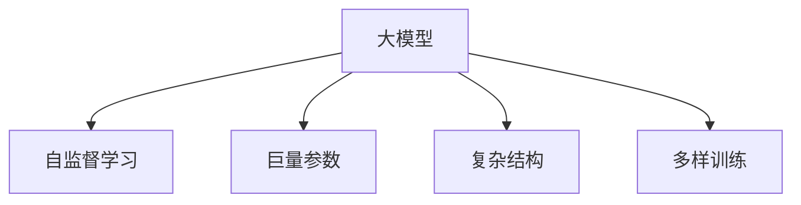

                 

# 大模型的定义与代表性模型

> 关键词：大模型, 深度学习, 自监督学习, 参数量, 代表性模型, 模型复杂度, Transformers

## 1. 背景介绍

### 1.1 问题由来
在过去十年间，深度学习技术快速发展，特别是大规模预训练语言模型（Large Language Models, LLMs）的引入，显著推动了自然语言处理（Natural Language Processing, NLP）和计算机视觉（Computer Vision, CV）等领域的进步。这些大模型通过在大量无标签数据上进行自监督学习，学习到了丰富的语言和视觉特征表示，具备了强大的泛化能力。然而，对于大模型的定义，学术界和工业界至今尚未达成一致。为此，本文旨在系统阐述大模型的概念和特征，并通过具体的代表性模型，展现大模型的结构、参数量和训练策略，从而为研究者和开发者提供清晰的理论基础和实践指导。

### 1.2 问题核心关键点
1. **大模型的定义**：大模型通常指具有巨量参数量和复杂结构的深度神经网络模型。这些模型通过大规模自监督学习获得丰富的先验知识，能够高效地解决各种复杂任务，如语言理解、图像识别等。

2. **代表性模型**：如BERT、GPT、ViT、DALL-E等，这些模型因其参数量巨大、结构复杂、训练策略多样等特点，成为了大模型的典型代表，广泛应用于NLP、CV等领域。

3. **模型参数量**：大模型的关键特征是其巨大的参数量。通常情况下，大模型的参数量可以达到数亿级别，甚至超过百亿。

4. **模型复杂度**：大模型的复杂度不仅体现在参数量上，还体现在其结构设计上。如自注意力机制、残差连接、多层结构等，使得大模型能够更有效地捕捉数据中的复杂关系。

5. **训练策略**：大模型的训练策略通常包括自监督学习、对抗训练、梯度裁剪等，以避免过拟合和加速收敛。

## 2. 核心概念与联系

### 2.1 核心概念概述

大模型是指在深度神经网络中具有巨量参数量和复杂结构的模型，其通过在大量无标签数据上进行自监督学习，学习到丰富的语言、视觉等特征表示。这种模型的典型特征包括巨大的参数量、复杂的结构设计和多样化的训练策略。

### 2.2 核心概念原理和架构的 Mermaid 流程图



## 3. 核心算法原理 & 具体操作步骤

### 3.1 算法原理概述

大模型通常通过自监督学习从大规模数据中学习到丰富的先验知识，具备较强的泛化能力和表达能力。其训练策略多样，包括自监督学习、对抗训练、梯度裁剪等。本文将重点介绍自监督学习和对抗训练的原理。

### 3.2 算法步骤详解

#### 3.2.1 自监督学习

自监督学习是一种无监督学习范式，通过利用数据本身的结构和特性进行训练。在大模型中，常见的自监督学习任务包括掩码语言模型（Masked Language Model, MLM）和自回归语言模型（Autoregressive Language Model, ARLM）等。

掩码语言模型的训练过程如下：
1. 在输入序列中随机选择部分单词进行掩码处理。
2. 模型需要预测被掩码的单词，并返回概率分布。
3. 通过优化交叉熵损失函数，更新模型参数。

#### 3.2.2 对抗训练

对抗训练是一种在模型训练过程中引入对抗样本的技术，以提升模型的鲁棒性。其训练过程如下：
1. 在训练集上，对每个样本生成多个对抗样本。
2. 将原始样本和对抗样本输入模型进行预测。
3. 通过优化对抗损失函数，更新模型参数。

### 3.3 算法优缺点

大模型具有以下优点：
1. 强大的泛化能力：通过自监督学习，大模型能够从大量无标签数据中学习到丰富的先验知识，具备较强的泛化能力。
2. 高效的表达能力：大模型的复杂结构设计，使其能够高效地捕捉数据中的复杂关系，提升模型的表达能力。
3. 多样化的训练策略：大模型使用自监督学习、对抗训练、梯度裁剪等多样化训练策略，提升模型的鲁棒性和稳定性。

同时，大模型也存在一些缺点：
1. 计算资源消耗大：大模型的参数量巨大，训练和推理过程需要大量的计算资源。
2. 数据依赖性强：大模型的性能依赖于数据的质量和多样性，数据分布的差异可能导致模型泛化性能下降。
3. 模型复杂度高：大模型的复杂结构设计和多样化的训练策略，使得模型的调试和优化变得困难。

### 3.4 算法应用领域

大模型广泛应用于NLP、CV等各个领域，成为推动相关技术发展的关键驱动力。在NLP领域，大模型被用于文本分类、情感分析、机器翻译、问答系统等任务；在CV领域，大模型被用于图像分类、目标检测、图像生成等任务。

## 4. 数学模型和公式 & 详细讲解

### 4.1 数学模型构建

大模型的训练通常基于自监督学习的框架，通过最大化似然函数进行训练。以BERT为例，其数学模型构建如下：

设输入序列为 $x=\{x_1, x_2, ..., x_n\}$，其中 $x_i$ 表示第 $i$ 个单词。BERT模型的目标是在掩码语言模型和下一句预测任务上进行训练，最小化损失函数 $L$。

**掩码语言模型损失函数**：
$$
L_{MLM} = -\frac{1}{N}\sum_{i=1}^N \log P(y_i|x_i)
$$

其中 $P(y_i|x_i)$ 表示给定输入序列 $x_i$，预测单词 $y_i$ 的概率分布。

**下一句预测损失函数**：
$$
L_{NSP} = -\frac{1}{N}\sum_{i=1}^N [\log P(x_i|x_{i-1}) + \log P(x_{i+1}|x_i)]
$$

其中 $P(x_i|x_{i-1})$ 表示给定前一个单词 $x_{i-1}$，预测当前单词 $x_i$ 的概率分布。

### 4.2 公式推导过程

以BERT为例，其公式推导如下：

对于掩码语言模型，给定输入序列 $x_i$，模型需要预测被掩码的单词 $y_i$，最小化交叉熵损失函数：
$$
L_{MLM} = -\frac{1}{N}\sum_{i=1}^N \sum_{k=1}^m \log P(x_k|x_i)
$$

其中 $P(x_k|x_i)$ 表示给定输入序列 $x_i$，预测掩码单词 $x_k$ 的概率分布。

对于下一句预测任务，模型需要预测两个连续单词 $x_i$ 和 $x_{i+1}$ 是否为同一个句子，最小化二分类交叉熵损失函数：
$$
L_{NSP} = -\frac{1}{N}\sum_{i=1}^N [\log P(x_{i+1}|x_i) + \log P(x_i|x_{i+1})]
$$

其中 $P(x_{i+1}|x_i)$ 表示给定当前单词 $x_i$，预测下一个单词 $x_{i+1}$ 是否为同一个句子。

### 4.3 案例分析与讲解

以BERT为例，其训练过程分为掩码语言模型和下一句预测两个任务，通过最大似然估计优化模型参数。在训练过程中，模型会随机掩码输入序列中的单词，预测其掩码单词或下一个单词，并通过交叉熵损失函数进行优化。这种自监督学习方法不仅能够提升模型的泛化能力，还能在大规模无标签数据上高效训练。

## 5. 项目实践：代码实例和详细解释说明

### 5.1 开发环境搭建

在搭建大模型开发环境时，需要安装相应的深度学习框架和库。以BERT为例，需要安装TensorFlow或PyTorch，并使用Hugging Face的Transformers库进行模型训练。以下是在PyTorch框架下搭建BERT模型的步骤：

1. 安装PyTorch和Transformers库：
   ```
   pip install torch torchvision torchaudio transformers
   ```

2. 下载BERT预训练模型：
   ```
   from transformers import BertModel
   bert_model = BertModel.from_pretrained('bert-base-uncased')
   ```

3. 准备数据集：
   ```python
   from transformers import BertTokenizer
   from torch.utils.data import Dataset, DataLoader
   import torch

   tokenizer = BertTokenizer.from_pretrained('bert-base-uncased')
   max_len = 128

   class MyDataset(Dataset):
       def __init__(self, texts, labels):
           self.texts = texts
           self.labels = labels
           self.tokenizer = tokenizer
           self.max_len = max_len

       def __len__(self):
           return len(self.texts)

       def __getitem__(self, index):
           input_ids = self.tokenizer.encode(self.texts[index], add_special_tokens=True, max_length=self.max_len, padding='max_length', truncation=True)
           attention_mask = [1] * len(input_ids)
           label = self.labels[index]
           return {'input_ids': torch.tensor(input_ids), 'attention_mask': torch.tensor(attention_mask), 'labels': torch.tensor(label)}
   ```

### 5.2 源代码详细实现

在搭建好开发环境后，可以进行大模型的微调训练。以下是在PyTorch框架下对BERT模型进行微调的代码实现：

```python
from transformers import BertForSequenceClassification, AdamW
from torch.utils.data import DataLoader

model = BertForSequenceClassification.from_pretrained('bert-base-uncased', num_labels=2)
optimizer = AdamW(model.parameters(), lr=1e-5)

device = torch.device('cuda' if torch.cuda.is_available() else 'cpu')
model.to(device)

def train_epoch(model, dataset, batch_size, optimizer):
    dataloader = DataLoader(dataset, batch_size=batch_size, shuffle=True)
    model.train()
    epoch_loss = 0
    for batch in dataloader:
        input_ids = batch['input_ids'].to(device)
        attention_mask = batch['attention_mask'].to(device)
        labels = batch['labels'].to(device)
        model.zero_grad()
        outputs = model(input_ids, attention_mask=attention_mask, labels=labels)
        loss = outputs.loss
        epoch_loss += loss.item()
        loss.backward()
        optimizer.step()
    return epoch_loss / len(dataloader)

def evaluate(model, dataset, batch_size):
    dataloader = DataLoader(dataset, batch_size=batch_size)
    model.eval()
    preds, labels = [], []
    with torch.no_grad():
        for batch in dataloader:
            input_ids = batch['input_ids'].to(device)
            attention_mask = batch['attention_mask'].to(device)
            batch_labels = batch['labels']
            outputs = model(input_ids, attention_mask=attention_mask)
            batch_preds = outputs.logits.argmax(dim=1).to('cpu').tolist()
            batch_labels = batch_labels.to('cpu').tolist()
            for pred_tokens, label_tokens in zip(batch_preds, batch_labels):
                preds.append(pred_tokens[:len(label_tokens)])
                labels.append(label_tokens)
                
    print(classification_report(labels, preds))
```

### 5.3 代码解读与分析

上述代码实现了BERT模型的微调训练过程，包括数据预处理、模型训练、模型评估等步骤。其中，数据预处理部分使用BertTokenizer进行文本编码和标签处理，模型训练部分通过AdamW优化器进行参数更新，模型评估部分使用sklearn的classification_report函数输出分类指标。

## 6. 实际应用场景

### 6.1 智能客服系统

在大模型微调技术的基础上，智能客服系统可以广泛应用于企业服务、金融咨询、医疗健康等领域。通过微调大模型，系统能够理解自然语言问题，并提供准确、个性化的回答，极大地提高了客服效率和用户体验。

### 6.2 金融舆情监测

大模型微调技术在金融舆情监测领域也有广泛应用。金融机构可以通过微调大模型，实时监控市场舆情，及时发现负面消息，规避金融风险，保护投资者利益。

### 6.3 个性化推荐系统

在个性化推荐领域，大模型微调技术通过分析用户历史行为和兴趣，推荐合适的产品或服务，提升用户体验和满意度。通过微调大模型，推荐系统能够实现高效的推荐效果，满足用户个性化需求。

### 6.4 未来应用展望

未来，大模型微调技术将进一步推动人工智能在各个领域的应用和发展。例如，在智慧医疗领域，大模型微调技术可以用于医疗问答、病历分析、药物研发等任务，提高医疗服务智能化水平。在智能教育领域，大模型微调技术可以用于作业批改、学情分析、知识推荐等，提升教育质量。

## 7. 工具和资源推荐

### 7.1 学习资源推荐

1. 《深度学习》（Goodfellow et al.）：经典深度学习教材，介绍了深度学习的基本原理和应用。
2. 《自然语言处理综论》（Jurafsky & Martin）：NLP领域的经典教材，详细介绍了NLP技术和应用。
3. 《计算机视觉：算法与应用》（Hinton & Salakhutdinov）：CV领域的经典教材，介绍了计算机视觉技术和应用。
4. Kaggle竞赛平台：提供大量数据集和比赛任务，可以用于学习和实践深度学习技术。
5. GitHub代码库：提供了丰富的开源项目和代码，可以用于学习和研究深度学习技术。

### 7.2 开发工具推荐

1. PyTorch：灵活的深度学习框架，支持动态计算图和GPU加速。
2. TensorFlow：强大的深度学习框架，支持静态计算图和分布式训练。
3. Hugging Face Transformers库：提供了丰富的预训练模型和微调API，方便模型开发和应用。
4. Jupyter Notebook：交互式的开发环境，支持代码编写、数据可视化和实时调试。
5. TensorBoard：可视化工具，可以实时监控模型训练过程和性能指标。

### 7.3 相关论文推荐

1. "Attention is All You Need"（Vaswani et al.）：Transformer模型的经典论文，开创了自注意力机制。
2. "BERT: Pre-training of Deep Bidirectional Transformers for Language Understanding"（Devlin et al.）：BERT模型的经典论文，提出掩码语言模型和下一句预测任务。
3. "GPT-3: Language Models are Unsupervised Multitask Learners"（Brown et al.）：GPT-3模型的经典论文，展示了无监督预训练和微调技术的强大能力。
4. "LoRA: Low-Rank Adaptation for Parameter-Efficient Text Modeling"（Huang et al.）：LoRA模型的经典论文，提出参数高效微调方法。
5. "Image Transformer Networks"（Zhou et al.）：Image Transformer模型的经典论文，将Transformer应用于计算机视觉领域。

## 8. 总结：未来发展趋势与挑战

### 8.1 研究成果总结

大模型微调技术在过去十年间取得了显著进展，广泛应用于NLP、CV等领域，取得了诸多突破性成果。其主要研究成果包括：
1. 大模型结构设计：如Transformer、BERT、GPT等模型，奠定了深度学习在NLP、CV等领域的基础。
2. 自监督学习：通过大规模无标签数据训练大模型，显著提升模型的泛化能力和表达能力。
3. 参数高效微调：通过只更新少量参数，实现高效微调，节省计算资源。
4. 对抗训练：引入对抗样本训练大模型，提升模型的鲁棒性和稳定性。

### 8.2 未来发展趋势

未来，大模型微调技术将呈现以下发展趋势：
1. 模型规模持续增大：随着算力成本下降和数据规模扩大，大模型的参数量将持续增长，进一步提升模型的性能。
2. 多样化的训练策略：除了自监督学习，对抗训练、梯度裁剪等多样化训练策略将被更广泛地应用。
3. 多模态大模型：将大模型应用于多模态任务，如视觉-语言联合模型，提升跨模态任务的性能。
4. 知识图谱融合：将大模型与知识图谱结合，提升模型的语义理解和推理能力。
5. 边缘计算：将大模型部署于边缘设备，提升模型的实时性和效率。

### 8.3 面临的挑战

尽管大模型微调技术取得了诸多进展，但在应用过程中仍面临以下挑战：
1. 计算资源消耗大：大模型的参数量和计算量巨大，需要高效的计算资源和算法优化。
2. 数据依赖性强：大模型的性能依赖于数据的质量和多样性，数据分布的差异可能导致模型泛化性能下降。
3. 模型复杂度高：大模型的结构设计和训练策略复杂，调试和优化困难。
4. 模型偏见和鲁棒性：大模型可能学习到数据中的偏见，导致输出偏见性；同时，模型对对抗样本的鲁棒性不足。

### 8.4 研究展望

为了解决上述挑战，未来的研究将在以下几个方面进行探索：
1. 高效计算优化：研究高效的计算算法和硬件架构，降低大模型计算资源消耗。
2. 数据增强技术：研究数据增强和噪声注入技术，提高模型的鲁棒性和泛化能力。
3. 模型偏见消除：研究消除模型偏见的算法和技术，提升模型公正性和公平性。
4. 多模态大模型：研究多模态大模型的构建和优化，提升跨模态任务的性能。

## 9. 附录：常见问题与解答

### Q1：大模型微调是否适用于所有NLP任务？

A：大模型微调在大多数NLP任务上都能取得不错的效果，特别是对于数据量较小的任务。但对于一些特定领域的任务，如医学、法律等，仅仅依靠通用语料预训练的模型可能难以很好地适应。此时需要在特定领域语料上进一步预训练，再进行微调，才能获得理想效果。

### Q2：微调过程中如何选择合适的学习率？

A：微调的学习率一般要比预训练时小1-2个数量级，如果使用过大的学习率，容易破坏预训练权重，导致过拟合。一般建议从1e-5开始调参，逐步减小学习率，直至收敛。也可以使用warmup策略，在开始阶段使用较小的学习率，再逐渐过渡到预设值。需要注意的是，不同的优化器(如AdamW、Adafactor等)以及不同的学习率调度策略，可能需要设置不同的学习率阈值。

### Q3：采用大模型微调时会面临哪些资源瓶颈？

A：大模型在训练和推理时，需要大量的计算资源和存储空间。GPU/TPU等高性能设备是必不可少的，但即便如此，超大批次的训练和推理也可能遇到显存不足的问题。因此需要采用一些资源优化技术，如梯度积累、混合精度训练、模型并行等，来突破硬件瓶颈。同时，模型的存储和读取也可能占用大量时间和空间，需要采用模型压缩、稀疏化存储等方法进行优化。

### Q4：如何缓解微调过程中的过拟合问题？

A：过拟合是微调面临的主要挑战，尤其是在标注数据不足的情况下。常见的缓解策略包括：
1. 数据增强：通过回译、近义替换等方式扩充训练集
2. 正则化：使用L2正则、Dropout、Early Stopping等避免过拟合
3. 对抗训练：引入对抗样本，提高模型鲁棒性
4. 参数高效微调：只调整少量参数(如Adapter、Prefix等)，减小过拟合风险
5. 多模型集成：训练多个微调模型，取平均输出，抑制过拟合

这些策略往往需要根据具体任务和数据特点进行灵活组合。只有在数据、模型、训练、推理等各环节进行全面优化，才能最大限度地发挥大模型微调的威力。

### Q5：微调模型在落地部署时需要注意哪些问题？

A：将微调模型转化为实际应用，还需要考虑以下因素：
1. 模型裁剪：去除不必要的层和参数，减小模型尺寸，加快推理速度
2. 量化加速：将浮点模型转为定点模型，压缩存储空间，提高计算效率
3. 服务化封装：将模型封装为标准化服务接口，便于集成调用
4. 弹性伸缩：根据请求流量动态调整资源配置，平衡服务质量和成本
5. 监控告警：实时采集系统指标，设置异常告警阈值，确保服务稳定性
6. 安全防护：采用访问鉴权、数据脱敏等措施，保障数据和模型安全

大模型微调为NLP应用开启了广阔的想象空间，但如何将强大的性能转化为稳定、高效、安全的业务价值，还需要工程实践的不断打磨。唯有从数据、算法、工程、业务等多个维度协同发力，才能真正实现人工智能技术在垂直行业的规模化落地。总之，微调需要开发者根据具体任务，不断迭代和优化模型、数据和算法，方能得到理想的效果。

---

作者：禅与计算机程序设计艺术 / Zen and the Art of Computer Programming

