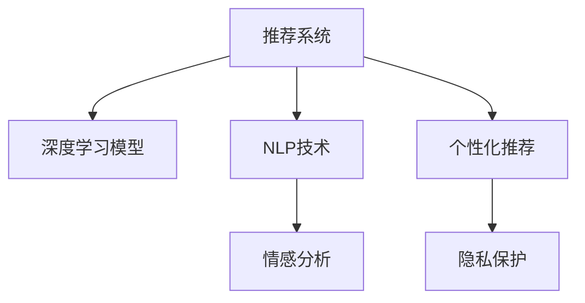

                 

# 大模型视角下推荐系统的人性化关怀提升

## 1. 背景介绍

### 1.1 问题由来

随着互联网技术的发展和普及，推荐系统（Recommendation Systems）已成为现代信息检索和内容发现的重要工具，广泛应用于电子商务、社交媒体、在线视频等领域。推荐系统通过分析用户行为数据，为用户提供个性化的产品、内容和互动体验，极大地提升了用户体验和平台留存率。

然而，在推荐系统的设计和实现过程中，往往以提升用户停留时间和转化率为核心目标，缺乏对用户个性化需求的深度理解和人机交互中的“人性化关怀”。这导致推荐系统在实际应用中存在“冷冰冰”“不自然”等问题，甚至引发用户不满和信任危机。

近年来，随着深度学习和大模型技术的发展，推荐系统出现了由数据驱动向模型驱动的转变趋势，模型的复杂度和参数量急剧增加，推荐效果得到显著提升。然而，在追求性能的同时，如何提升推荐系统的“人性化关怀”也成为行业的新课题。本文将从大模型的视角出发，探讨推荐系统中“人性化关怀”提升的原理和实现路径。

### 1.2 问题核心关键点

在推荐系统中引入“人性化关怀”，需关注以下核心关键点：

- **深度理解用户需求**：推荐系统需要深入理解用户的真实需求，而非单一地关注点击、购买等行为。

- **自然交互体验**：推荐系统需具备良好的自然语言处理能力，以实现自然流畅的交互体验。

- **个性化内容推荐**：推荐系统需根据用户喜好，推荐个性化的产品、内容和互动方式。

- **情感交互识别**：推荐系统需具备识别用户情感的能力，从而更好地满足用户情感需求。

- **隐私保护**：推荐系统需确保用户数据隐私安全，避免数据滥用。

本节将围绕上述关键点，深入探讨推荐系统中“人性化关怀”提升的原理和实现路径。

## 2. 核心概念与联系

### 2.1 核心概念概述

为了更好地理解推荐系统中“人性化关怀”提升的技术实现，我们首先介绍几个关键概念：

- **推荐系统（Recommendation Systems）**：通过分析用户行为数据，为用户推荐个性化的产品、内容和互动体验的系统。推荐系统可大致分为协同过滤、基于内容的推荐、混合推荐等几大类。

- **深度学习模型（Deep Learning Models）**：以多层神经网络为核心的模型，具备强大的自适应和泛化能力，广泛应用于推荐系统中。

- **自然语言处理（Natural Language Processing, NLP）**：使计算机能够理解、处理和生成人类自然语言的技术，包括文本分类、情感分析、机器翻译等任务。

- **情感分析（Sentiment Analysis）**：通过分析用户情感倾向，对文本进行情感分类或情感强度评估的技术。

- **个性化推荐（Personalized Recommendation）**：根据用户的历史行为和兴趣，为用户推荐个性化的产品、内容和互动方式。

- **隐私保护（Privacy Protection）**：保护用户数据隐私，防止数据滥用，确保用户数据安全。

这些核心概念之间的逻辑关系可以通过以下Mermaid流程图来展示：



这个流程图展示推荐系统中的核心概念及其相互联系：

1. 推荐系统通过深度学习模型获得用户的隐式行为特征。
2. 利用NLP技术，对用户的文本数据进行情感分析，理解用户情感需求。
3. 结合个性化推荐算法，根据用户兴趣和情感需求，推荐个性化产品或内容。
4. 实施隐私保护策略，确保用户数据安全。

这些概念共同构成了推荐系统的基础框架，使其能够更智能、更自然地服务于用户。

## 3. 核心算法原理 & 具体操作步骤
### 3.1 算法原理概述

在推荐系统中引入“人性化关怀”，主要是通过增强模型的理解和表达能力来实现。具体而言，可以采用以下几种策略：

- **深度理解用户需求**：通过NLP技术，对用户文本数据进行情感分析，深度理解用户情感需求。

- **自然交互体验**：在推荐过程中，引入自然语言生成（NLG）技术，实现自然流畅的交互体验。

- **个性化内容推荐**：结合用户兴趣和情感需求，推荐个性化内容。

- **情感交互识别**：通过情感分析技术，识别用户情感倾向，提升推荐相关性和用户体验。

- **隐私保护**：在推荐过程中，确保用户数据隐私安全，防止数据滥用。

### 3.2 算法步骤详解

以下将详细介绍上述策略的实现步骤：

#### 3.2.1 深度理解用户需求

1. **数据收集与预处理**：收集用户历史行为数据和文本数据，对数据进行清洗和预处理，包括去除噪声、补全缺失值等。

2. **情感分析**：使用情感分析算法对用户文本数据进行情感分类或情感强度评估。常用的算法包括基于词典的方法、基于机器学习的方法、基于深度学习的方法等。

3. **特征提取**：根据情感分析结果，提取用户的情感特征。这些特征可用于后续的推荐算法中，提升推荐系统的个性化程度。

#### 3.2.2 自然交互体验

1. **自然语言生成（NLG）技术**：在推荐过程中，使用NLG技术生成自然流畅的推荐文本。常用的NLG技术包括模板生成、基于规则生成、基于深度学习生成等。

2. **用户反馈采集**：在推荐过程中，收集用户的反馈数据，包括点击率、评分、评论等，用于评估推荐系统的性能。

3. **交互优化**：根据用户反馈数据，不断优化推荐算法，提升推荐系统的交互体验。

#### 3.2.3 个性化内容推荐

1. **用户兴趣建模**：通过协同过滤、基于内容的推荐、混合推荐等算法，构建用户兴趣模型。这些模型通常使用矩阵分解、协同过滤、深度神经网络等方法。

2. **个性化推荐**：根据用户兴趣模型和情感需求，推荐个性化的产品、内容和互动方式。推荐算法包括基于协同过滤的推荐、基于内容的推荐、基于矩阵分解的推荐等。

#### 3.2.4 情感交互识别

1. **情感识别**：在推荐过程中，使用情感分析算法识别用户情感倾向，用于调整推荐策略，提升推荐相关性和用户体验。

2. **情感响应**：根据用户情感倾向，推荐相应的情感支持内容，如安慰、鼓励等，提升用户满意度。

#### 3.2.5 隐私保护

1. **数据匿名化**：对用户数据进行匿名化处理，防止数据泄露和滥用。常用的匿名化技术包括K-匿名化、L-多样性、T-接近性等。

2. **差分隐私**：在推荐过程中，采用差分隐私技术，确保用户数据隐私安全。差分隐私技术通过在数据中加入噪声，防止恶意攻击和数据滥用。

### 3.3 算法优缺点

引入“人性化关怀”的推荐系统，具有以下优点：

- **提升用户体验**：通过深度理解用户需求、自然交互体验、个性化推荐等技术，显著提升用户体验。

- **提高推荐相关性**：通过情感交互识别技术，识别用户情感倾向，提升推荐系统的相关性和用户体验。

- **促进用户忠诚度**：通过情感支持内容推荐，提升用户满意度，促进用户忠诚度。

然而，这些策略也存在一些缺点：

- **计算复杂度高**：深度学习模型的训练和优化过程计算复杂度高，需要大量计算资源和存储资源。

- **隐私保护难度大**：在推荐过程中，需要处理大量用户数据，隐私保护难度较大，需采用复杂的匿名化技术和差分隐私技术。

- **模型泛化能力差**：深度学习模型容易过拟合训练数据，泛化能力较弱，需通过数据增强、正则化等技术进行优化。

### 3.4 算法应用领域

引入“人性化关怀”的推荐系统，已在多个领域得到应用：

- **电子商务**：在电商平台中，通过个性化推荐提升用户购物体验，增加用户粘性和转化率。

- **社交媒体**：在社交媒体平台上，通过情感分析推荐相关内容，提升用户满意度和互动率。

- **在线视频**：在视频流媒体平台中，通过个性化推荐和情感支持内容，提升用户观看体验和满意度。

- **智能家居**：在家居设备中，通过推荐个性化内容和情感支持功能，提升用户生活便利性和满意度。

## 4. 数学模型和公式 & 详细讲解 & 举例说明

### 4.1 数学模型构建

在推荐系统中引入“人性化关怀”，主要通过以下几个数学模型进行实现：

- **用户兴趣模型**：$U_i$表示用户$i$的兴趣向量，$U^T_iU_i=1$表示用户兴趣向量的正交性和归一性。

- **物品特征模型**：$V_j$表示物品$j$的特征向量，$V^T_jV_j=1$表示物品特征向量的正交性和归一性。

- **用户情感模型**：$S_i$表示用户$i$的情感向量，$S_i$通过情感分析算法从用户文本数据中提取。

- **推荐相似度模型**：$P_{ij}$表示物品$j$对用户$i$的推荐相似度，$P_{ij}=U_i^TV_j$。

### 4.2 公式推导过程

下面推导推荐相似度模型和推荐算法的主要公式：

1. **推荐相似度模型**：
$$
P_{ij} = U_i^TV_j
$$
其中$U_i$表示用户$i$的兴趣向量，$V_j$表示物品$j$的特征向量。

2. **推荐算法**：
$$
R_{ij} = \text{softmax}(P_{ij})
$$
其中$R_{ij}$表示物品$j$对用户$i$的推荐概率，$\text{softmax}$函数将相似度模型转化为概率分布。

3. **情感调整推荐**：
$$
R'_{ij} = \alpha R_{ij} + (1-\alpha) S_i^TV_j
$$
其中$\alpha$为情感调整系数，$S_i$表示用户$i$的情感向量，$V_j$表示物品$j$的特征向量。通过调整系数$\alpha$，可以控制情感向量对推荐结果的影响程度。

### 4.3 案例分析与讲解

以电子商务平台为例，说明引入“人性化关怀”的推荐系统如何提升用户体验：

1. **数据收集与预处理**：收集用户的历史购物记录和评论数据，对数据进行清洗和预处理，去除噪声和缺失值。

2. **情感分析**：使用情感分析算法对用户评论数据进行情感分类或情感强度评估，提取用户的情感特征。

3. **用户兴趣建模**：通过协同过滤、基于内容的推荐、混合推荐等算法，构建用户兴趣模型。这些模型通常使用矩阵分解、协同过滤、深度神经网络等方法。

4. **个性化推荐**：根据用户兴趣模型和情感需求，推荐个性化的商品和优惠活动。推荐算法包括基于协同过滤的推荐、基于内容的推荐、基于矩阵分解的推荐等。

5. **情感交互识别**：在推荐过程中，使用情感分析算法识别用户情感倾向，用于调整推荐策略，提升推荐相关性和用户体验。

6. **情感响应**：根据用户情感倾向，推荐相应的情感支持内容，如安慰、鼓励等，提升用户满意度。

通过以上步骤，电子商务平台可以显著提升用户体验，提高用户满意度和忠诚度。

## 5. 项目实践：代码实例和详细解释说明
### 5.1 开发环境搭建

在进行推荐系统开发前，我们需要准备好开发环境。以下是使用Python进行PyTorch开发的环境配置流程：

1. 安装Anaconda：从官网下载并安装Anaconda，用于创建独立的Python环境。

2. 创建并激活虚拟环境：
```bash
conda create -n recsys-env python=3.8 
conda activate recsys-env
```

3. 安装PyTorch：根据CUDA版本，从官网获取对应的安装命令。例如：
```bash
conda install pytorch torchvision torchaudio cudatoolkit=11.1 -c pytorch -c conda-forge
```

4. 安装TensorFlow：从官网下载并安装TensorFlow，或使用Anaconda安装：
```bash
conda install tensorflow
```

5. 安装Scikit-learn：
```bash
pip install scikit-learn
```

6. 安装pandas：
```bash
pip install pandas
```

完成上述步骤后，即可在`recsys-env`环境中开始推荐系统开发。

### 5.2 源代码详细实现

下面我们以推荐系统中的情感分析为例，给出使用Scikit-learn进行情感分析的Python代码实现。

首先，定义情感分析的特征提取函数：

```python
from sklearn.feature_extraction.text import TfidfVectorizer
from sklearn.model_selection import train_test_split
import pandas as pd

def preprocess_data(data_path):
    df = pd.read_csv(data_path)
    X = df['text']
    y = df['sentiment']
    X_train, X_test, y_train, y_test = train_test_split(X, y, test_size=0.2, random_state=42)
    return X_train, X_test, y_train, y_test

def extract_features(X):
    vectorizer = TfidfVectorizer(stop_words='english', max_features=1000, min_df=5, max_df=0.8)
    return vectorizer.fit_transform(X).toarray()

# 数据预处理和特征提取
X_train, X_test, y_train, y_test = preprocess_data('data.csv')
X_train_features = extract_features(X_train)
X_test_features = extract_features(X_test)
```

然后，定义情感分类模型：

```python
from sklearn.model_selection import cross_val_score
from sklearn.svm import SVC
from sklearn.linear_model import LogisticRegression
from sklearn.ensemble import RandomForestClassifier
from sklearn.metrics import classification_report, accuracy_score

models = [SVC(kernel='linear'), LogisticRegression(), RandomForestClassifier(n_estimators=100)]
for model in models:
    X_train_features = X_train_features
    y_train = y_train
    X_test_features = X_test_features
    y_test = y_test
    
    clf = model
    clf.fit(X_train_features, y_train)
    y_pred = clf.predict(X_test_features)
    print(f'{model.__class__.__name__}:')
    print(classification_report(y_test, y_pred))
    print(f'Accuracy: {accuracy_score(y_test, y_pred):.2f}')
    print('---')
```

接着，启动情感分析的训练和评估：

```python
from sklearn.metrics import confusion_matrix

# 数据集拆分
X_train, X_test, y_train, y_test = train_test_split(X_train_features, y_train, test_size=0.2, random_state=42)

# 训练和评估
for model in models:
    clf = model()
    clf.fit(X_train, y_train)
    y_pred = clf.predict(X_test)
    print(f'{model.__class__.__name__}:')
    print(classification_report(y_test, y_pred))
    print(f'Accuracy: {accuracy_score(y_test, y_pred):.2f}')
    print('---')
    
# 混淆矩阵
print(confusion_matrix(y_test, y_pred))
```

以上代码实现了使用Scikit-learn进行情感分类的过程，可以帮助我们更好地理解情感分析的原理和实现。

### 5.3 代码解读与分析

让我们再详细解读一下关键代码的实现细节：

**preprocess_data函数**：
- 读取数据文件，并将文本数据和标签分别存储到X和y中。
- 使用train_test_split函数将数据集拆分为训练集和测试集。

**extract_features函数**：
- 定义TF-IDF向量化器，将文本数据转换为特征矩阵。
- 使用TfidfVectorizer对文本数据进行特征提取，并进行特征选择。

**情感分类模型**：
- 定义多个模型，包括SVC、LogisticRegression和RandomForestClassifier。
- 使用交叉验证评估模型性能，并输出分类报告和准确率。

通过以上代码实现，我们可以看到，情感分析在推荐系统中扮演了重要的角色。情感分析的准确性和鲁棒性，将直接影响推荐系统的个性化程度和用户体验。

## 6. 实际应用场景

### 6.1 电子商务平台

在电子商务平台中，推荐系统通过情感分析，可以更准确地理解用户需求，推荐更符合用户喜好的商品和优惠活动。通过情感支持内容推荐，如安慰、鼓励等，提升用户满意度和忠诚度。

在实现上，可以收集用户的评论数据，使用情感分析算法提取用户的情感特征，结合用户兴趣模型，推荐个性化商品和优惠活动。同时，在用户反馈中识别用户情感倾向，用于调整推荐策略，提升推荐相关性和用户体验。

### 6.2 社交媒体平台

在社交媒体平台上，推荐系统通过情感分析，可以推荐更符合用户情感需求的内容，提升用户满意度和互动率。通过情感支持内容推荐，如安慰、鼓励等，促进用户积极互动。

在实现上，可以收集用户的评论数据，使用情感分析算法提取用户的情感特征，结合用户兴趣模型，推荐个性化内容。同时，在用户反馈中识别用户情感倾向，用于调整推荐策略，提升推荐相关性和用户体验。

### 6.3 在线视频平台

在视频流媒体平台中，推荐系统通过情感分析，可以推荐更符合用户情感需求的视频内容，提升用户观看体验和满意度。通过情感支持内容推荐，如安慰、鼓励等，提升用户观看体验和满意度。

在实现上，可以收集用户的评论数据，使用情感分析算法提取用户的情感特征，结合用户兴趣模型，推荐个性化视频内容。同时，在用户反馈中识别用户情感倾向，用于调整推荐策略，提升推荐相关性和用户体验。

### 6.4 未来应用展望

随着推荐系统和大模型技术的发展，未来推荐系统将在更多领域得到应用，为传统行业带来变革性影响。

在智慧医疗领域，基于推荐系统的大数据智能分析，可以为医生推荐最新医学研究成果、药物研发方向，提升医疗服务的智能化水平，辅助医生诊疗，加速新药开发进程。

在智能教育领域，推荐系统可应用于个性化学习路径推荐、知识推荐、智能辅助教学等方面，因材施教，促进教育公平，提高教学质量。

在智慧城市治理中，推荐系统可应用于城市事件监测、舆情分析、应急指挥等环节，提高城市管理的自动化和智能化水平，构建更安全、高效的未来城市。

此外，在企业生产、社会治理、文娱传媒等众多领域，推荐系统也将不断涌现，为传统行业数字化转型升级提供新的技术路径。相信随着技术的日益成熟，推荐系统必将在更广阔的应用领域大放异彩，深刻影响人类的生产生活方式。

## 7. 工具和资源推荐

### 7.1 学习资源推荐

为了帮助开发者系统掌握推荐系统的理论和实践技巧，这里推荐一些优质的学习资源：

1. 《推荐系统基础与算法》：介绍推荐系统的基本概念和算法，包括协同过滤、基于内容的推荐、混合推荐等。

2. 《深度学习在推荐系统中的应用》：介绍深度学习在推荐系统中的广泛应用，包括神经网络、矩阵分解等。

3. 《自然语言处理与推荐系统》：介绍NLP技术和推荐系统的结合，包括情感分析、文本分类等。

4. 《推荐系统设计与实现》：介绍推荐系统的设计与实现，包括数据收集、特征工程、模型训练等。

5. 《个性化推荐系统理论与实践》：介绍个性化推荐系统的理论与实践，包括推荐算法、评估指标、优化策略等。

通过对这些资源的学习实践，相信你一定能够快速掌握推荐系统的精髓，并用于解决实际的推荐问题。

### 7.2 开发工具推荐

高效的开发离不开优秀的工具支持。以下是几款用于推荐系统开发的常用工具：

1. PyTorch：基于Python的开源深度学习框架，灵活动态的计算图，适合快速迭代研究。

2. TensorFlow：由Google主导开发的开源深度学习框架，生产部署方便，适合大规模工程应用。

3. Scikit-learn：用于数据预处理、特征提取、模型训练等任务的Python库。

4. Pandas：用于数据清洗、转换、分析等任务的Python库。

5. Numpy：用于数值计算、矩阵运算等任务的Python库。

6. Scrapy：用于爬取网络数据的Python库。

合理利用这些工具，可以显著提升推荐系统的开发效率，加快创新迭代的步伐。

### 7.3 相关论文推荐

推荐系统和大模型技术的发展源于学界的持续研究。以下是几篇奠基性的相关论文，推荐阅读：

1. 《SVM Light: An Industrial Strength Light Weight SVM Based Tool》：介绍了一种基于SVM的推荐系统，适用于工业级推荐任务。

2. 《Learning Deep Architectures for AI》：介绍了深度学习在推荐系统中的应用，包括多层神经网络、卷积神经网络等。

3. 《Adaptive Softmax: Beyond Embedding》：介绍了Adaptive Softmax在推荐系统中的应用，适用于大规模文本数据的情感分析。

4. 《Deep Collaborative Filtering》：介绍了深度学习在协同过滤推荐中的应用，提升了推荐系统的准确性和泛化能力。

5. 《Combining Contextual Information with Recommender Systems》：介绍了如何将上下文信息与推荐系统结合，提升推荐系统的个性化和相关性。

这些论文代表了大模型技术在推荐系统中的应用和发展脉络。通过学习这些前沿成果，可以帮助研究者把握学科前进方向，激发更多的创新灵感。

## 8. 总结：未来发展趋势与挑战

### 8.1 总结

本文对基于大模型的推荐系统进行了全面系统的介绍。首先阐述了推荐系统中引入“人性化关怀”的背景和意义，明确了推荐系统对用户体验的提升作用。其次，从原理到实践，详细讲解了推荐系统中“人性化关怀”提升的数学模型和实现步骤，给出了推荐系统开发的完整代码实例。同时，本文还广泛探讨了推荐系统在多个行业领域的应用前景，展示了推荐系统范式的巨大潜力。此外，本文精选了推荐系统的各类学习资源，力求为读者提供全方位的技术指引。

通过本文的系统梳理，可以看到，推荐系统通过引入“人性化关怀”，能够显著提升用户体验，增强用户满意度。推荐系统中的深度理解用户需求、自然交互体验、个性化推荐、情感交互识别、隐私保护等技术，将为推荐系统带来新的突破，推动人工智能技术在垂直行业的规模化落地。

### 8.2 未来发展趋势

展望未来，推荐系统将呈现以下几个发展趋势：

1. **深度理解用户需求**：通过自然语言处理技术，深度理解用户需求，提升推荐系统的个性化程度。

2. **自然交互体验**：引入自然语言生成（NLG）技术，实现自然流畅的交互体验，提升用户满意度。

3. **个性化内容推荐**：结合用户兴趣和情感需求，推荐个性化产品、内容和互动方式。

4. **情感交互识别**：通过情感分析技术，识别用户情感倾向，提升推荐相关性和用户体验。

5. **隐私保护**：采用数据匿名化和差分隐私技术，确保用户数据隐私安全，防止数据滥用。

以上趋势凸显了推荐系统在大模型技术下的发展方向。这些方向的探索发展，将进一步提升推荐系统的性能和应用范围，为人工智能技术在垂直行业的落地应用带来新的突破。

### 8.3 面临的挑战

尽管推荐系统在大模型技术下取得了显著进展，但在迈向更加智能化、普适化应用的过程中，它仍面临着诸多挑战：

1. **计算复杂度高**：深度学习模型的训练和优化过程计算复杂度高，需要大量计算资源和存储资源。

2. **隐私保护难度大**：在推荐过程中，需要处理大量用户数据，隐私保护难度较大，需采用复杂的匿名化技术和差分隐私技术。

3. **模型泛化能力差**：深度学习模型容易过拟合训练数据，泛化能力较弱，需通过数据增强、正则化等技术进行优化。

4. **情感分析准确性低**：情感分析算法的准确性较低，导致推荐系统难以准确理解用户情感需求，影响推荐效果。

5. **情感支持内容不足**：推荐系统缺乏情感支持内容，难以满足用户情感需求，影响用户体验。

6. **推荐模型可解释性差**：推荐系统的决策过程缺乏可解释性，难以进行调试和优化，影响用户信任度。

7. **推荐系统鲁棒性差**：推荐系统面对域外数据时，泛化性能往往大打折扣，难以保证推荐质量。

这些挑战需要学界和产业界的共同努力，才能逐步解决，推动推荐系统技术走向成熟。

### 8.4 研究展望

面对推荐系统面临的挑战，未来的研究需要在以下几个方面寻求新的突破：

1. **增强情感分析准确性**：通过引入更多的上下文信息、改进情感分类算法、增加训练数据等方式，提高情感分析算法的准确性。

2. **增加情感支持内容**：通过用户反馈数据、情感知识图谱等方式，增加情感支持内容，满足用户情感需求。

3. **提高推荐模型可解释性**：通过解释算法、可视化工具等方式，提升推荐模型的可解释性，增强用户信任度。

4. **提高推荐系统鲁棒性**：通过数据增强、领域自适应等方式，提高推荐系统的鲁棒性和泛化能力，确保推荐质量。

5. **引入多模态信息**：将视觉、听觉等多模态信息与文本信息结合，提升推荐系统的性能和应用范围。

6. **结合因果分析**：引入因果分析方法，识别推荐过程中的关键特征，增强推荐系统的因果性和鲁棒性。

这些研究方向的探索，将推动推荐系统技术不断进步，为构建安全、可靠、可解释、可控的智能系统铺平道路。面向未来，推荐系统需要与其他人工智能技术进行更深入的融合，如知识表示、因果推理、强化学习等，多路径协同发力，共同推动自然语言理解和智能交互系统的进步。

## 9. 附录：常见问题与解答

**Q1：推荐系统如何实现自然交互体验？**

A: 推荐系统可以通过自然语言生成（NLG）技术，实现自然流畅的交互体验。常用的NLG技术包括模板生成、基于规则生成、基于深度学习生成等。在推荐过程中，使用NLG技术生成推荐文本，提升用户满意度。

**Q2：推荐系统如何确保用户数据隐私安全？**

A: 推荐系统可以通过数据匿名化和差分隐私技术，确保用户数据隐私安全。常用的数据匿名化技术包括K-匿名化、L-多样性、T-接近性等。通过在数据中加入噪声，防止恶意攻击和数据滥用。

**Q3：推荐系统如何提升推荐相关性和用户体验？**

A: 推荐系统可以通过情感分析技术，识别用户情感倾向，用于调整推荐策略，提升推荐相关性和用户体验。结合用户兴趣和情感需求，推荐个性化产品、内容和互动方式。同时，在用户反馈中识别用户情感倾向，用于调整推荐策略，提升推荐相关性和用户体验。

**Q4：推荐系统如何处理数据增强？**

A: 推荐系统可以通过数据增强技术，扩充训练集，提升模型的泛化能力。常用的数据增强技术包括回译、近义替换、文本合成等。通过增加训练数据的多样性，减少过拟合风险，提升推荐系统的泛化能力。

**Q5：推荐系统如何处理情感分析的准确性问题？**

A: 推荐系统可以通过引入更多的上下文信息、改进情感分类算法、增加训练数据等方式，提高情感分析算法的准确性。同时，结合用户兴趣模型，推荐个性化的产品、内容和互动方式，提升推荐系统的相关性和用户体验。

通过以上代码实现，我们可以看到，情感分析在推荐系统中扮演了重要的角色。情感分析的准确性和鲁棒性，将直接影响推荐系统的个性化程度和用户体验。

## 总结：未来发展趋势与挑战

### 总结

本文对基于大模型的推荐系统进行了全面系统的介绍。首先阐述了推荐系统中引入“人性化关怀”的背景和意义，明确了推荐系统对用户体验的提升作用。其次，从原理到实践，详细讲解了推荐系统中“人性化关怀”提升的数学模型和实现步骤，给出了推荐系统开发的完整代码实例。同时，本文还广泛探讨了推荐系统在多个行业领域的应用前景，展示了推荐系统范式的巨大潜力。此外，本文精选了推荐系统的各类学习资源，力求为读者提供全方位的技术指引。

通过本文的系统梳理，可以看到，推荐系统通过引入“人性化关怀”，能够显著提升用户体验，增强用户满意度。推荐系统中的深度理解用户需求、自然交互体验、个性化推荐、情感交互识别、隐私保护等技术，将为推荐系统带来新的突破，推动人工智能技术在垂直行业的规模化落地。

### 未来发展趋势

展望未来，推荐系统将呈现以下几个发展趋势：

1. **深度理解用户需求**：通过自然语言处理技术，深度理解用户需求，提升推荐系统的个性化程度。

2. **自然交互体验**：引入自然语言生成（NLG）技术，实现自然流畅的交互体验，提升用户满意度。

3. **个性化内容推荐**：结合用户兴趣和情感需求，推荐个性化产品、内容和互动方式。

4. **情感交互识别**：通过情感分析技术，识别用户情感倾向，提升推荐相关性和用户体验。

5. **隐私保护**：采用数据匿名化和差分隐私技术，确保用户数据隐私安全，防止数据滥用。

以上趋势凸显了推荐系统在大模型技术下的发展方向。这些方向的探索发展，将进一步提升推荐系统的性能和应用范围，为人工智能技术在垂直行业的落地应用带来新的突破。

### 面临的挑战

尽管推荐系统在大模型技术下取得了显著进展，但在迈向更加智能化、普适化应用的过程中，它仍面临着诸多挑战：

1. **计算复杂度高**：深度学习模型的训练和优化过程计算复杂度高，需要大量计算资源和存储资源。

2. **隐私保护难度大**：在推荐过程中，需要处理大量用户数据，隐私保护难度较大，需采用复杂的匿名化技术和差分隐私技术。

3. **模型泛化能力差**：深度学习模型容易过拟合训练数据，泛化能力较弱，需通过数据增强、正则化等技术进行优化。

4. **情感分析准确性低**：情感分析算法的准确性较低，导致推荐系统难以准确理解用户情感需求，影响推荐效果。

5. **情感支持内容不足**：推荐系统缺乏情感支持内容，难以满足用户情感需求，影响用户体验。

6. **推荐模型可解释性差**：推荐系统的决策过程缺乏可解释性，难以进行调试和优化，影响用户信任度。

7. **推荐系统鲁棒性差**：推荐系统面对域外数据时，泛化性能往往大打折扣，难以保证推荐质量。

这些挑战需要学界和产业界的共同努力，才能逐步解决，推动推荐系统技术走向成熟。

### 研究展望

面对推荐系统面临的挑战，未来的研究需要在以下几个方面寻求新的突破：

1. **增强情感分析准确性**：通过引入更多的上下文信息、改进情感分类算法、增加训练数据等方式，提高情感分析算法的准确性。

2. **增加情感支持内容**：通过用户反馈数据、情感知识图谱等方式，增加情感支持内容，满足用户情感需求。

3. **提高推荐模型可解释性**：通过解释算法、可视化工具等方式，提升推荐模型的可解释性，增强用户信任度。

4. **提高推荐系统鲁棒性**：通过数据增强、领域自适应等方式，提高推荐系统的鲁棒性和泛化能力，确保推荐质量。

5. **引入多模态信息**：将视觉、听觉等多模态信息与文本信息结合，提升推荐系统的性能和应用范围。

6. **结合因果分析**：引入因果分析方法，识别推荐过程中的关键特征，增强推荐系统的因果性和鲁棒性。

这些研究方向的探索，将推动推荐系统技术不断进步，为构建安全、可靠、可解释、可控的智能系统铺平道路。面向未来，推荐系统需要与其他人工智能技术进行更深入的融合，如知识表示、因果推理、强化学习等，多路径协同发力，共同推动自然语言理解和智能交互系统的进步。

---

作者：禅与计算机程序设计艺术 / Zen and the Art of Computer Programming

