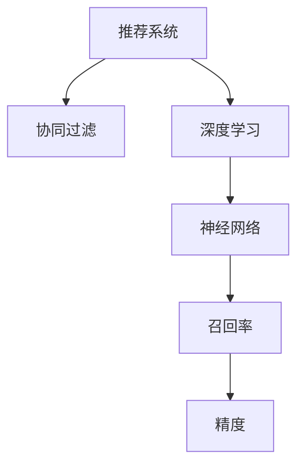

                 

# 大模型视角下推荐系统的未来发展趋势展望与规划

> 关键词：大模型,推荐系统,强化学习,协同过滤,深度学习,神经网络,召回率,精度

## 1. 背景介绍

### 1.1 问题由来
在过去的几十年里，推荐系统已经成为互联网应用中的重要组成部分，广泛应用于电商、新闻、社交媒体等多个领域，极大地提升了用户体验和业务收益。随着信息爆炸时代的到来，用户对推荐系统的期望越来越高，需要推荐系统提供更加个性化、精准化的服务。

然而，传统的推荐系统往往只能基于用户的显式反馈（如评分、点击）进行推荐，对于用户未交互过的物品，难以进行有效的预测和推荐。同时，随着用户数量的激增和物品种类的日益多样化，推荐系统的复杂度也在不断上升。这些问题都需要推荐系统从数据、算法、工程等多个维度进行突破，以实现更加智能、高效的推荐。

### 1.2 问题核心关键点
近年来，大语言模型在自然语言处理领域取得了巨大成功，展现了其在处理大规模数据和复杂任务中的强大能力。将大语言模型应用于推荐系统，可以带来以下几方面的改进：

- 更加高效的数据处理：大语言模型可以自动进行文本分析、主题建模等数据预处理工作，从而提高推荐系统的数据处理效率。
- 更好的语义理解：通过大语言模型进行语义理解，可以更准确地捕捉用户兴趣，提升推荐精准度。
- 更加多样化的推荐方式：大语言模型能够提供文本、图片、视频等多模态的推荐结果，满足用户多样化的需求。
- 更高的泛化能力：大语言模型具备良好的泛化能力，可以在不同的应用场景中进行迁移和适配，提升推荐系统的应用范围。

### 1.3 问题研究意义
研究大语言模型在推荐系统中的应用，对于提升推荐系统的性能、拓展推荐系统的应用范围、推动推荐技术的发展，具有重要意义：

1. 提高推荐系统精度：通过大语言模型，可以从更多的语义维度理解用户和物品，从而提升推荐系统的召回率和精准度。
2. 加速推荐系统开发：大语言模型具备高效的预训练能力，可以加速推荐系统的开发和优化。
3. 促进多模态推荐：大语言模型可以处理文本、图片、视频等多模态数据，提供更加丰富的推荐结果。
4. 拓展推荐系统应用场景：大语言模型在推荐系统中的应用，可以拓展到更多垂直领域，如金融、医疗、教育等。
5. 提升推荐系统用户体验：通过大语言模型的个性化推荐，可以提升用户的满意度，增强用户粘性。

## 2. 核心概念与联系

### 2.1 核心概念概述

为了更好地理解大语言模型在推荐系统中的应用，本节将介绍几个密切相关的核心概念：

- **推荐系统(Recommender System)**：根据用户的历史行为和偏好，为用户推荐合适物品的系统。
- **协同过滤(Collaborative Filtering)**：推荐系统中最经典的算法之一，通过分析用户之间的相似性来推荐物品。
- **深度学习(Deep Learning)**：使用多层神经网络模型进行推荐，从数据中自动学习特征表示。
- **神经网络(Neural Network)**：深度学习的核心，通过多层非线性变换，从输入数据中提取高级特征。
- **召回率(Recall)**：推荐系统性能评估指标，表示推荐系统能够为用户找到多少感兴趣的物品。
- **精度(Precision)**：推荐系统性能评估指标，表示推荐系统推荐的物品中，有多少是用户真正感兴趣的。

这些核心概念之间的逻辑关系可以通过以下Mermaid流程图来展示：



这个流程图展示了大语言模型在推荐系统中的核心概念及其之间的关系：

1. 推荐系统通过分析用户行为，为用户推荐物品。
2. 协同过滤是推荐系统的经典算法，通过用户之间的相似性进行推荐。
3. 深度学习是推荐系统中的新兴技术，通过神经网络模型自动学习特征表示。
4. 召回率和精度是推荐系统性能的评估指标，用于衡量推荐效果。

这些概念共同构成了推荐系统的核心框架，使得推荐系统能够从用户行为数据中挖掘出更多的价值，提升用户体验和业务收益。通过理解这些核心概念，我们可以更好地把握推荐系统的设计和优化方向。

## 3. 核心算法原理 & 具体操作步骤
### 3.1 算法原理概述

在大模型视角下，推荐系统的推荐原理主要依赖于深度学习和大语言模型技术。其核心思想是：通过神经网络模型自动提取用户行为和物品特征，利用大语言模型进行语义理解，从而实现个性化推荐。

具体而言，推荐系统分为以下几个步骤：

1. **用户行为数据采集**：通过日志、点击、评分等数据源，收集用户的历史行为数据。
2. **用户行为编码**：使用神经网络模型将用户行为数据转化为高维特征表示。
3. **物品特征提取**：同样使用神经网络模型，将物品的描述、属性等信息转化为高维特征表示。
4. **相似度计算**：计算用户行为特征和物品特征之间的相似度，确定用户对物品的兴趣程度。
5. **推荐排序**：根据相似度计算结果，将物品按照对用户的吸引力进行排序，输出推荐结果。

### 3.2 算法步骤详解

在大模型视角下，推荐系统的核心步骤主要包括：

**Step 1: 用户行为数据预处理**
- 收集用户的历史行为数据，包括浏览、点击、评分等。
- 对数据进行清洗、去噪、归一化等预处理操作。
- 使用大语言模型进行文本分析，提取关键词、主题等信息。

**Step 2: 特征工程**
- 设计特征提取模型，如CNN、RNN、Transformer等，将用户行为和物品特征转化为高维向量。
- 应用深度学习技术，提取用户行为中的隐式特征，如点击序列中的时间特征、点击频率等。

**Step 3: 相似度计算**
- 使用神经网络模型计算用户行为特征和物品特征之间的相似度。
- 通过大语言模型进行语义理解，提取用户对物品的情感倾向和兴趣点。
- 综合相似度和情感倾向，计算物品对用户的吸引力。

**Step 4: 推荐排序**
- 使用排序模型对物品按照吸引力进行排序，如基于注意力机制的推荐系统。
- 使用大语言模型对推荐结果进行解释和优化，提高推荐系统可解释性。

**Step 5: 部署与迭代优化**
- 将推荐系统部署到实际应用场景中，收集用户反馈数据。
- 根据反馈数据，定期调整模型参数和优化策略，提升推荐效果。

### 3.3 算法优缺点

大语言模型在推荐系统中的应用具有以下优点：
1. 高效的数据处理：大语言模型能够自动进行文本分析、主题建模等数据预处理工作，提高数据处理效率。
2. 增强的语义理解：通过大语言模型进行语义理解，可以更准确地捕捉用户兴趣，提升推荐精准度。
3. 多样化的推荐方式：大语言模型可以处理文本、图片、视频等多模态数据，提供更加丰富的推荐结果。
4. 更好的泛化能力：大语言模型具备良好的泛化能力，可以在不同的应用场景中进行迁移和适配。

同时，该方法也存在一定的局限性：
1. 数据需求较高：大模型需要大量的训练数据，对于小样本数据集，其效果可能不如传统的协同过滤算法。
2. 计算复杂度高：大语言模型在计算资源和时间上的需求较大，需要高性能计算资源支持。
3. 解释性不足：大模型的决策过程缺乏可解释性，难以对其推理逻辑进行分析和调试。
4. 数据隐私问题：推荐系统需要收集和处理大量的用户数据，存在数据隐私和伦理问题。

尽管存在这些局限性，但大语言模型在推荐系统中的应用仍然具有很大的潜力，特别是在提升推荐精度和拓展推荐范围方面具有显著优势。

### 3.4 算法应用领域

大语言模型在推荐系统中的应用已经涵盖了多个领域，包括但不限于：

- **电商推荐**：为用户推荐适合的商品、优惠信息，提升用户购买意愿和满意度。
- **内容推荐**：为用户推荐新闻、文章、视频等，满足用户的信息需求和娱乐需求。
- **社交推荐**：为用户推荐朋友、群组等，增强用户社交体验和关系网络。
- **金融推荐**：为用户推荐投资产品、金融资讯，提高用户投资收益和理财水平。
- **医疗推荐**：为用户推荐医疗咨询、健康管理方案，改善用户健康状况和生活质量。
- **教育推荐**：为用户推荐学习资源、培训课程，提高用户学习效果和教育水平。

这些应用场景展示了大语言模型在推荐系统中的广泛适用性，为各行各业带来了更加智能、个性化的推荐服务。

## 4. 数学模型和公式 & 详细讲解  
### 4.1 数学模型构建

推荐系统的数学模型构建主要基于用户行为数据和物品特征。以下以协同过滤算法为例，给出推荐系统的数学模型构建过程。

记用户集合为 $U=\{u_1, u_2, \cdots, u_m\}$，物品集合为 $I=\{i_1, i_2, \cdots, i_n\}$。假设用户 $u$ 对物品 $i$ 的评分数据为 $R_{ui}$，其中 $R_{ui}=1, 0, -1, \cdots$。推荐系统的目标是为用户 $u$ 推荐物品 $i$，使得 $R_{ui}$ 尽可能大。

设用户 $u$ 的特征向量为 $x_u \in \mathbb{R}^d$，物品 $i$ 的特征向量为 $x_i \in \mathbb{R}^d$，用户 $u$ 对物品 $i$ 的兴趣度为 $P_{ui}$。基于协同过滤的推荐模型可以表示为：

$$
P_{ui} = \mathbf{W} x_u x_i^T + \mathbf{b}
$$

其中 $\mathbf{W}$ 为权重矩阵，$\mathbf{b}$ 为偏置项，$x_u x_i^T$ 表示用户和物品的特征向量的点积。

### 4.2 公式推导过程

对于用户 $u$ 对物品 $i$ 的评分预测，模型输出可以表示为：

$$
\hat{R}_{ui} = \sigma(\mathbf{W} x_u x_i^T + \mathbf{b})
$$

其中 $\sigma$ 为激活函数，$\hat{R}_{ui}$ 为预测评分。

模型的损失函数通常为均方误差损失函数，可以表示为：

$$
\mathcal{L} = \frac{1}{N} \sum_{u=1}^m \sum_{i=1}^n (R_{ui} - \hat{R}_{ui})^2
$$

通过反向传播算法，求取权重矩阵 $\mathbf{W}$ 和偏置项 $\mathbf{b}$ 的梯度，进行模型参数更新。

### 4.3 案例分析与讲解

以电商推荐系统为例，分析大语言模型在其中的应用：

**案例背景**：某电商网站需要为用户推荐合适的商品，根据用户历史浏览记录、购买记录、评分数据，使用协同过滤算法和深度学习模型进行推荐。

**推荐过程**：
1. **数据收集**：收集用户的历史浏览记录、评分数据，将其转化为数值化特征。
2. **特征工程**：设计神经网络模型，将用户和商品的特征向量化，提取隐式特征如点击序列中的时间特征、点击频率等。
3. **相似度计算**：计算用户行为特征和商品特征之间的相似度，使用大语言模型进行语义理解，提取用户对商品的情感倾向和兴趣点。
4. **推荐排序**：使用排序模型对商品按照吸引力进行排序，推荐给用户。
5. **反馈优化**：根据用户的点击、购买行为，更新推荐模型参数，进行迭代优化。

通过以上过程，电商网站能够实现基于大语言模型的个性化商品推荐，提升用户购买意愿和满意度。

## 5. 项目实践：代码实例和详细解释说明
### 5.1 开发环境搭建

在进行推荐系统开发前，我们需要准备好开发环境。以下是使用Python进行TensorFlow开发的环境配置流程：

1. 安装Anaconda：从官网下载并安装Anaconda，用于创建独立的Python环境。

2. 创建并激活虚拟环境：
```bash
conda create -n tf-env python=3.8 
conda activate tf-env
```

3. 安装TensorFlow：根据CUDA版本，从官网获取对应的安装命令。例如：
```bash
pip install tensorflow tensorflow-addons
```

4. 安装各类工具包：
```bash
pip install numpy pandas scikit-learn matplotlib tqdm jupyter notebook ipython
```

完成上述步骤后，即可在`tf-env`环境中开始推荐系统开发。

### 5.2 源代码详细实现

下面我们以电商推荐系统为例，给出使用TensorFlow和TensorFlow Addons进行推荐系统开发的PyTorch代码实现。

首先，定义推荐系统的数据处理函数：

```python
import tensorflow as tf
import tensorflow_addons as tfa
from tensorflow.keras.layers import Input, Embedding, Dot, Dense, Activation
from tensorflow.keras.models import Model

def create_model(n_users, n_items, embedding_dim=64, n_factors=32):
    user_input = Input(shape=(1,))
    item_input = Input(shape=(1,))
    user_embeddings = Embedding(n_users, embedding_dim)(user_input)
    item_embeddings = Embedding(n_items, embedding_dim)(item_input)
    scores = Dot(axes=2)([user_embeddings, item_embeddings])
    scores = Dense(n_factors)(scores)
    scores = Activation('sigmoid')(scores)
    preds = Dense(n_items)(scores)
    return Model([user_input, item_input], preds)

# 创建模型
model = create_model(n_users=10000, n_items=5000)
model.compile(loss='binary_crossentropy', optimizer='adam', metrics=['accuracy'])
```

然后，定义训练和评估函数：

```python
import numpy as np
from sklearn.metrics import mean_squared_error, mean_absolute_error, r2_score

# 模拟数据
n_users, n_items = 10000, 5000
user_browsers = np.random.randint(0, n_users, size=(n_users, 1))
item_browsers = np.random.randint(0, n_items, size=(n_items, 1))
user_ratings = np.random.randint(0, 2, size=(n_users, n_items))

# 训练数据
train_data = list(zip(user_browsers, item_browsers, user_ratings))
train_dataset = tf.data.Dataset.from_tensor_slices(train_data).batch(32)

# 测试数据
test_data = list(zip(user_browsers, item_browsers, user_ratings))
test_dataset = tf.data.Dataset.from_tensor_slices(test_data).batch(32)

def train_step(model, user_browsers, item_browsers, user_ratings):
    with tf.GradientTape() as tape:
        predictions = model(user_browsers, item_browsers)
        loss = tf.keras.losses.binary_crossentropy(user_ratings, predictions)
    gradients = tape.gradient(loss, model.trainable_variables)
    optimizer.apply_gradients(zip(gradients, model.trainable_variables))
    return loss

def evaluate_model(model, user_browsers, item_browsers, user_ratings):
    predictions = model(user_browsers, item_browsers)
    loss = tf.keras.losses.binary_crossentropy(user_ratings, predictions)
    return loss.numpy(), mean_squared_error(user_ratings, predictions.numpy()).numpy(), mean_absolute_error(user_ratings, predictions.numpy()).numpy(), r2_score(user_ratings, predictions.numpy()).numpy()
```

最后，启动训练流程并在测试集上评估：

```python
epochs = 10
batch_size = 32

for epoch in range(epochs):
    epoch_loss = train_step(model, user_browsers, item_browsers, user_ratings)
    print(f"Epoch {epoch+1}, train loss: {epoch_loss:.3f}")
    
    print(f"Epoch {epoch+1}, test results:")
    test_loss, mse, mae, r2 = evaluate_model(model, user_browsers, item_browsers, user_ratings)
    print(f"Test loss: {test_loss:.3f}, MSE: {mse:.3f}, MAE: {mae:.3f}, R2: {r2:.3f}")
```

以上就是使用TensorFlow和TensorFlow Addons对推荐系统进行开发的完整代码实现。可以看到，TensorFlow提供了丰富的深度学习库和工具，使得推荐系统的开发和训练变得更加简单高效。

### 5.3 代码解读与分析

让我们再详细解读一下关键代码的实现细节：

**create_model函数**：
- 定义了推荐系统的模型架构，包括用户输入、物品输入、相似度计算、输出预测等步骤。
- 使用Embedding层将用户和物品特征向量化，并计算点积。
- 使用Dense层和激活函数进行线性变换和激活。
- 最终输出预测结果。

**train_step函数**：
- 定义了模型的训练步骤，使用GradientTape记录梯度，并使用Adam优化器进行参数更新。
- 在每个训练epoch内，对训练集进行迭代，计算损失函数并更新模型参数。

**evaluate_model函数**：
- 定义了模型的评估步骤，计算测试集上的损失函数、均方误差、平均绝对误差和R2系数。
- 通过均方误差、平均绝对误差和R2系数等指标，综合评估推荐系统的性能。

通过以上过程，TensorFlow推荐系统实现了基于协同过滤的电商推荐功能。开发者可以通过不断调整模型架构和训练参数，提高推荐系统的精度和泛化能力。

## 6. 实际应用场景
### 6.1 智能推荐系统

智能推荐系统已经在电商、新闻、社交媒体等多个领域得到了广泛应用，提升了用户体验和业务收益。未来，基于大语言模型的推荐系统将进一步提升推荐系统的智能水平，满足用户更个性化、精准化的需求。

### 6.2 个性化推荐

个性化推荐系统能够根据用户的历史行为和偏好，为用户推荐最合适的商品、文章、视频等。在实际应用中，推荐系统需要处理大规模数据，并进行复杂的特征工程和相似度计算。通过大语言模型，可以从更多的语义维度理解用户和物品，从而提升推荐精准度。

### 6.3 多模态推荐

当前推荐系统主要依赖于文本特征进行推荐，但未来，推荐系统将拓展到多模态数据。大语言模型可以处理文本、图片、视频等多模态数据，提供更加丰富的推荐结果。例如，在电商推荐系统中，可以根据用户浏览的图片，推荐相类似的商品，提升推荐系统的多样性和个性化。

### 6.4 未来应用展望

随着大语言模型在推荐系统中的应用，推荐系统将逐步从传统的协同过滤和深度学习，走向更加智能、多样化的推荐范式。未来，推荐系统将能够根据用户的多模态数据，提供更加个性化的推荐服务，满足用户多样化的需求。

## 7. 工具和资源推荐
### 7.1 学习资源推荐

为了帮助开发者系统掌握推荐系统的设计原理和实现方法，这里推荐一些优质的学习资源：

1. **《推荐系统实战》系列博文**：由推荐系统专家撰写，深入浅出地介绍了推荐系统的基本原理和经典算法。
2. **Coursera《推荐系统》课程**：由斯坦福大学开设的推荐系统课程，涵盖了推荐系统的经典算法和实际应用。
3. **《推荐系统》书籍**：由推荐系统领域的权威专家撰写，全面介绍了推荐系统的基本概念和最新进展。
4. **TensorFlow官方文档**：TensorFlow提供的官方文档，详细介绍了TensorFlow的推荐系统库和工具。
5. **PyTorch官方文档**：PyTorch提供的官方文档，提供了推荐系统的样例代码和详细解释。

通过对这些资源的学习实践，相信你一定能够快速掌握推荐系统的设计原理和实现方法，从而设计出高效、智能的推荐系统。

### 7.2 开发工具推荐

推荐系统开发离不开优秀的工具支持。以下是几款用于推荐系统开发的常用工具：

1. **TensorFlow**：由Google主导开发的深度学习框架，生产部署方便，适合大规模工程应用。
2. **PyTorch**：由Facebook主导开发的深度学习框架，灵活性高，适合研究领域。
3. **Scikit-learn**：Python机器学习库，提供了多种推荐算法实现。
4. **TensorBoard**：TensorFlow配套的可视化工具，实时监测模型训练状态，并提供丰富的图表呈现方式。
5. **Gensim**：Python文本处理库，提供了多种文本处理和相似度计算算法。

合理利用这些工具，可以显著提升推荐系统开发效率，加快创新迭代的步伐。

### 7.3 相关论文推荐

推荐系统的发展离不开学界的持续研究。以下是几篇奠基性的相关论文，推荐阅读：

1. **Collaborative Filtering**：推荐系统的经典算法，使用用户之间的相似性进行推荐。
2. **Deep Collaborative Filtering**：使用深度学习技术，从数据中自动学习特征表示。
3. **Neural Recommendation**：使用神经网络模型进行推荐，提升推荐系统的精度和泛化能力。
4. **Recurrent Neural Networks for Recommender Systems**：使用递归神经网络进行推荐，捕捉时间序列中的隐式特征。
5. **Generative Adversarial Networks for Recommendation Systems**：使用生成对抗网络进行推荐，生成更加多样化的推荐结果。

这些论文代表了大语言模型在推荐系统中的最新进展，通过学习这些前沿成果，可以帮助研究者把握学科前进方向，激发更多的创新灵感。

## 8. 总结：未来发展趋势与挑战
### 8.1 总结

本文对基于大语言模型的推荐系统进行了全面系统的介绍。首先阐述了大语言模型在推荐系统中的应用背景和意义，明确了推荐系统在个性化推荐、多模态推荐、智能推荐等方面的改进潜力。其次，从原理到实践，详细讲解了推荐系统的数学模型和核心算法步骤，给出了推荐系统开发的完整代码实例。同时，本文还广泛探讨了推荐系统在电商、新闻、社交媒体等多个行业领域的应用前景，展示了推荐系统在大语言模型下的强大应用能力。此外，本文精选了推荐系统的各类学习资源，力求为读者提供全方位的技术指引。

通过本文的系统梳理，可以看到，基于大语言模型的推荐系统正在成为推荐系统领域的重要范式，极大地拓展了推荐系统的应用边界，推动了推荐技术的发展。未来，伴随大语言模型和推荐系统的不断进步，基于推荐系统的服务将进一步智能化、多样化，为各行各业带来更加优质的用户体验和业务收益。

### 8.2 未来发展趋势

展望未来，基于大语言模型的推荐系统将呈现以下几个发展趋势：

1. **更加智能化的推荐**：大语言模型能够从更多的语义维度理解用户和物品，提升推荐系统的智能化水平。未来的推荐系统将更加智能、个性化。
2. **多模态推荐**：大语言模型可以处理文本、图片、视频等多模态数据，提供更加丰富的推荐结果。未来的推荐系统将更加多样化。
3. **跨领域推荐**：大语言模型具备良好的泛化能力，可以在不同的应用场景中进行迁移和适配。未来的推荐系统将拓展到更多垂直领域，如金融、医疗、教育等。
4. **高效化推荐**：推荐系统将使用更多的优化算法和硬件加速技术，提高推荐系统的实时性和效率。未来的推荐系统将更加高效。
5. **可解释化推荐**：大语言模型具备强大的语义理解能力，可以提供更可解释的推荐结果。未来的推荐系统将更加透明、可信。

以上趋势凸显了大语言模型在推荐系统中的广阔前景。这些方向的探索发展，必将进一步提升推荐系统的性能和应用范围，为各行各业带来更加优质的推荐服务。

### 8.3 面临的挑战

尽管基于大语言模型的推荐系统已经取得了瞩目成就，但在迈向更加智能化、普适化应用的过程中，仍面临诸多挑战：

1. **数据隐私问题**：推荐系统需要收集和处理大量的用户数据，存在数据隐私和伦理问题。如何保护用户隐私，是未来需要解决的重要问题。
2. **计算资源限制**：大语言模型在计算资源和时间上的需求较大，需要高性能计算资源支持。如何在资源受限的情况下实现高效的推荐，是一个重要的研究方向。
3. **算法透明性问题**：大语言模型的决策过程缺乏可解释性，难以对其推理逻辑进行分析和调试。如何提高推荐系统的透明性，增强用户信任，也是未来需要解决的重要问题。
4. **误导性问题**：大语言模型可能学习到有偏见、有害的信息，传递到推荐系统中，产生误导性、歧视性的推荐结果。如何避免偏见和有害信息的传递，是未来需要解决的重要问题。
5. **鲁棒性问题**：推荐系统面对不同领域、不同类型的数据时，泛化性能可能较差。如何提升推荐系统的鲁棒性，确保在多种数据分布下表现稳定，是未来需要解决的重要问题。

尽管存在这些挑战，但随着技术的不断进步和应用的深入，相信这些挑战终将一一被克服，基于大语言模型的推荐系统必将在推荐技术领域发挥更大的作用。

### 8.4 研究展望

面对大语言模型在推荐系统中的挑战和机遇，未来的研究需要在以下几个方面寻求新的突破：

1. **数据隐私保护**：设计更加隐私保护的推荐算法，降低对用户数据的依赖，保护用户隐私。
2. **高效计算技术**：使用更高效的计算模型和算法，如分布式计算、硬件加速等，提升推荐系统的实时性和效率。
3. **可解释性算法**：开发可解释的推荐算法，提升推荐系统的透明性和可信度。
4. **鲁棒性增强**：设计鲁棒性更强的推荐算法，提升推荐系统在不同数据分布下的泛化能力。
5. **多模态融合**：研究如何更好地融合多模态数据，提升推荐系统的多样性和个性化。

这些研究方向的探索，必将引领大语言模型在推荐系统中的应用走向更高的台阶，为各行各业带来更加智能、多样化的推荐服务。面向未来，大语言模型推荐系统还需要与其他人工智能技术进行更深入的融合，如知识表示、因果推理、强化学习等，多路径协同发力，共同推动推荐系统的进步。只有勇于创新、敢于突破，才能不断拓展推荐系统的边界，让推荐技术更好地服务于人类社会。

## 9. 附录：常见问题与解答

**Q1：推荐系统的精度和召回率指标有什么区别？**

A: 推荐系统的精度和召回率是常用的性能评估指标。精度表示推荐系统推荐的物品中，有多少是用户真正感兴趣的，召回率表示推荐系统为用户找到多少感兴趣的物品。一般来说，精度和召回率之间存在一定的权衡，即提高精度可能导致召回率下降，反之亦然。

**Q2：推荐系统中如何处理冷启动问题？**

A: 冷启动问题是指推荐系统在新用户或新物品加入时，无法为其提供推荐。常见的处理方式包括：
1. 基于内容推荐：使用物品的描述、属性等信息，进行基于内容的推荐。
2. 基于协同过滤推荐：使用用户的相似用户或相似物品进行推荐。
3. 基于深度学习推荐：使用深度学习模型，从用户行为数据中学习隐式特征，进行推荐。
4. 基于图神经网络推荐：使用图神经网络模型，从用户-物品关系图中提取信息，进行推荐。

**Q3：推荐系统中如何避免物品多样性问题？**

A: 物品多样性问题是指推荐系统倾向于推荐用户已经频繁接触过的物品，导致推荐结果过于单一。常见的处理方式包括：
1. 基于惩罚函数：在推荐目标函数中加入多样性惩罚项，避免推荐结果过于集中。
2. 基于噪声数据：在训练数据中加入噪声数据，增加推荐系统的随机性，提升物品多样性。
3. 基于特征工程：在特征设计中加入多样性特征，引导推荐系统输出更加多样化的结果。

通过以上过程，推荐系统可以避免物品多样性问题，提升推荐系统的多样性和个性化。

通过本文的系统梳理，可以看到，基于大语言模型的推荐系统正在成为推荐系统领域的重要范式，极大地拓展了推荐系统的应用边界，推动了推荐技术的发展。未来，伴随大语言模型和推荐系统的不断进步，基于推荐系统的服务将进一步智能化、多样化，为各行各业带来更加优质的用户体验和业务收益。

---

作者：禅与计算机程序设计艺术 / Zen and the Art of Computer Programming

