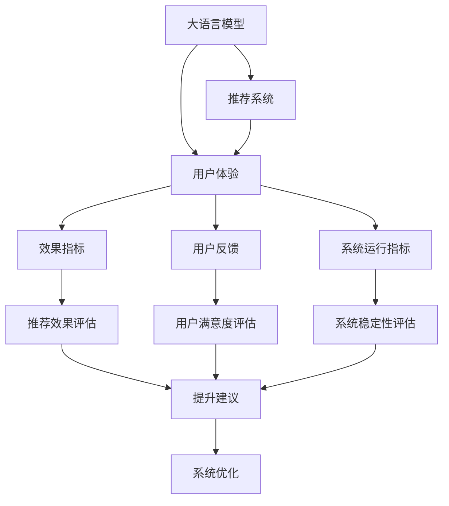

                 

# 大模型赋能下的推荐系统用户体验评估体系构建

## 1. 背景介绍

### 1.1 问题由来

推荐系统（Recommendation System）是现代信息科技的重要组成部分，通过分析用户历史行为、兴趣偏好、社交网络等信息，为用户提供个性化的物品推荐，极大地提升用户满意度和使用体验。然而，现有的推荐系统主要依赖传统的机器学习模型，面对用户多样化的需求和不断变化的环境，其表现常常不尽如人意。

近年来，人工智能（AI）和大数据技术的飞速发展，为推荐系统的升级带来了新的契机。通过深度学习等技术，基于大规模语料进行预训练的语言模型（Large Language Model, LLM），已经显示出强大的学习和推理能力。如何将这些大语言模型有效引入推荐系统，提升推荐系统的用户体验和智能化水平，成为了一个迫切需要解决的问题。

### 1.2 问题核心关键点

推荐系统用户体验的提升，离不开对其推荐效果、稳定性和可解释性的全面衡量和优化。特别是对于大规模语料预训练后的大语言模型，如何评估其在推荐系统中的表现，其评估指标和方式与传统模型有哪些异同，如何在保证推荐效果的同时，增强用户体验的可用性、互动性和满足度，这些问题亟需得到解答。

本文章将详细阐述基于大语言模型的推荐系统用户体验评估体系构建方法，旨在通过综合考量推荐系统的效果指标、用户反馈、系统运行指标等多方面因素，形成一套科学、可操作、可持续改进的评估体系，以指导推荐系统设计和优化工作。

## 2. 核心概念与联系

### 2.1 核心概念概述

在探讨大模型赋能下的推荐系统用户体验评估体系构建之前，首先需要对以下核心概念进行理解：

- **大语言模型（LLM）**：指通过大规模语料预训练得到的，能够理解并生成人类语言文本的深度学习模型，如GPT、BERT等。LLM具备强大的语言理解和生成能力，能够在推荐系统中发挥重要作用。

- **推荐系统（RS）**：指利用用户历史数据、物品特征等，为用户推荐个性化物品的系统，包括协同过滤、基于内容的推荐、混合推荐等方法。

- **用户体验（UX）**：指用户与推荐系统交互过程中获得的满足感和愉悦感，涉及交互设计、反馈机制、互动性等方面。

- **评估体系（Evaluation System）**：指用于衡量和改进推荐系统用户体验的一套综合指标和方法。

这些概念之间的逻辑关系可以通过以下Mermaid流程图来展示：



这个流程图展示了大语言模型、推荐系统、用户体验之间的联系，以及评估体系的形成和应用。

## 3. 核心算法原理 & 具体操作步骤

### 3.1 算法原理概述

大模型赋能下的推荐系统用户体验评估体系，本质上是一个综合性的评估和优化框架。其核心思想是：通过结合大语言模型的语言理解和生成能力，对推荐系统的各个环节进行详细评估，找出影响用户体验的关键因素，并据此提出优化建议，以提升用户体验和满意度。

这一过程大致可以分为以下几个步骤：

1. **数据准备**：收集推荐系统用户的交互数据，包括点击率、购买率、评分、反馈等。
2. **模型微调**：在大语言模型基础上，对推荐算法进行微调，增强其对用户偏好的理解和预测能力。
3. **效果评估**：基于收集到的用户数据和模型预测结果，综合评估推荐效果、用户满意度、系统稳定性等多项指标。
4. **优化建议**：根据评估结果，提出针对性的优化策略，如调整模型参数、改进推荐算法、优化界面设计等。
5. **迭代优化**：通过不断的反馈和优化，逐步提升推荐系统的用户体验和性能。

### 3.2 算法步骤详解

#### 步骤1：数据准备

数据准备是推荐系统用户体验评估体系构建的第一步。需要收集以下几类数据：

- **用户数据**：包括用户ID、历史行为数据、兴趣标签、人口统计信息等。
- **物品数据**：包括物品ID、属性、标签、价格等。
- **交互数据**：包括用户点击、浏览、购买、评分等行为数据。
- **反馈数据**：包括用户对推荐结果的满意度评分、评论、反馈等。

这些数据可以通过日志、API接口、问卷调查等方式收集。其中，用户反馈数据尤为重要，能直接反映用户体验的真实感受。

#### 步骤2：模型微调

在大语言模型基础上，对推荐算法进行微调，增强其对用户偏好的理解和预测能力。具体步骤包括：

1. **选择预训练模型**：选择GPT、BERT等大语言模型作为推荐系统的基础。
2. **数据预处理**：将用户和物品数据进行预处理，如特征工程、数据清洗等。
3. **微调模型**：在微调框架（如TensorFlow、PyTorch等）下，对大语言模型进行微调，使其学习用户和物品之间的关系。
4. **效果评估**：使用AUC、F1-score等指标评估模型性能。

#### 步骤3：效果评估

对推荐系统的用户体验进行全面评估，包括：

1. **推荐效果评估**：使用精确度、召回率、F1-score等指标评估推荐系统推荐的准确性和全面性。
2. **用户满意度评估**：通过用户反馈数据，使用NPS（净推荐值）、满意度评分等指标评估用户对推荐结果的满意程度。
3. **系统稳定性评估**：使用响应时间、系统故障率等指标评估推荐系统的稳定性。

#### 步骤4：优化建议

基于评估结果，提出针对性的优化策略，包括：

1. **推荐算法优化**：调整推荐算法参数，改进推荐算法模型，如协同过滤、基于内容的推荐等。
2. **界面设计优化**：优化推荐系统界面，提升用户体验，如增强交互性、改进推荐展示方式等。
3. **数据质量提升**：提高数据质量，减少噪音和偏差，提升模型训练效果。
4. **用户反馈机制优化**：增强用户反馈机制，收集更多用户反馈数据，改进推荐系统。

#### 步骤5：迭代优化

通过不断的反馈和优化，逐步提升推荐系统的用户体验和性能。具体步骤包括：

1. **数据收集**：继续收集用户反馈数据和推荐结果，不断优化数据集。
2. **模型微调**：根据反馈数据，重新微调推荐算法，改进模型性能。
3. **效果评估**：对新一轮的推荐结果进行效果评估，比较前后性能变化。
4. **优化建议**：根据新一轮的评估结果，提出新的优化策略，进行迭代优化。

### 3.3 算法优缺点

基于大语言模型的推荐系统用户体验评估体系，具有以下优点：

1. **提升推荐效果**：通过微调大语言模型，增强推荐系统的精准性和全面性，提升用户满意度。
2. **提高稳定性**：结合系统稳定性评估指标，优化推荐系统，减少故障和延迟，提高用户体验。
3. **增强可解释性**：大语言模型能够提供详细的推荐逻辑解释，提升系统的透明度和可信度。
4. **适应性强**：大语言模型具备强大的学习能力，能够快速适应新用户、新物品和新场景，提升推荐系统的适应性。

同时，该体系也存在一些缺点：

1. **数据需求高**：需要大量的用户数据和物品数据，对于新用户和新物品的推荐效果可能有限。
2. **计算成本高**：微调大语言模型和进行效果评估，需要较高的计算资源和计算成本。
3. **模型复杂度**：大语言模型较为复杂，需要专业的模型调参和优化经验。
4. **效果依赖数据**：推荐效果和用户满意度评估高度依赖数据质量，数据偏差可能导致评估结果不准确。

尽管存在这些局限性，但通过合理的策略和算法设计，可以有效地克服这些缺点，充分发挥大语言模型在推荐系统中的优势。

### 3.4 算法应用领域

基于大语言模型的推荐系统用户体验评估体系，可以应用于以下多个领域：

- **电商平台**：优化商品推荐，提升用户购买率和满意度。
- **内容推荐**：增强文章、视频等内容的推荐效果，提升用户阅读和观看体验。
- **社交网络**：推荐朋友、群组、话题等，提升用户互动性和社交体验。
- **医疗推荐**：推荐医生、药品、治疗方案等，提升用户健康管理和满意度。
- **旅游推荐**：推荐旅游目的地、景点、旅游线路等，提升用户旅游体验。

## 4. 数学模型和公式 & 详细讲解 & 举例说明

### 4.1 数学模型构建

基于大语言模型的推荐系统用户体验评估体系，可以采用以下数学模型进行构建：

1. **用户评分预测模型**：$P(y|x)$，预测用户对物品$x$的评分$y$，通常采用回归模型或分类模型，如线性回归、逻辑回归、决策树等。
2. **用户行为预测模型**：$P(x_i|x_j)$，预测用户$j$对物品$i$的点击率或购买率，通常采用CTR模型或MLP模型。
3. **用户满意度模型**：$P(s|x_i, x_j)$，预测用户$j$对物品$i$的满意度$s$，通常采用情感分析模型或回归模型。
4. **系统稳定性模型**：$P(t|x)$，预测系统在物品$x$上的响应时间$t$，通常采用随机过程模型或回归模型。

### 4.2 公式推导过程

以用户评分预测模型为例，假设模型为$P(y|x)$，使用线性回归模型进行预测，则模型表达式为：

$$
P(y|x) = \sigma(w^T x + b)
$$

其中，$\sigma$为sigmoid函数，$w$为模型权重，$b$为偏置项。根据最小二乘法，模型的损失函数为：

$$
L(w, b) = \frac{1}{N} \sum_{i=1}^N (y_i - \hat{y}_i)^2
$$

通过梯度下降等优化算法，求解最优的$w$和$b$，最小化损失函数。模型的预测结果为：

$$
\hat{y}_i = \sigma(w^T x_i + b)
$$

使用AUC指标评估模型的推荐效果，AUC定义为：

$$
AUC = \frac{1}{N} \sum_{i=1}^N \sum_{j=i+1}^N min(y_i, y_j)
$$

### 4.3 案例分析与讲解

假设在电商平台中，我们使用BERT模型对用户评分进行预测，具体步骤如下：

1. **数据准备**：收集用户评分数据，如用户ID、物品ID、评分等。
2. **模型微调**：在BERT模型基础上，对用户评分预测模型进行微调，使其能够准确预测用户评分。
3. **效果评估**：使用AUC指标评估模型的推荐效果，评估其预测准确性和全面性。
4. **优化建议**：根据评估结果，调整模型参数，优化推荐算法，提升用户体验。

## 5. 项目实践：代码实例和详细解释说明

### 5.1 开发环境搭建

在进行项目实践前，我们需要准备好开发环境。以下是使用Python进行TensorFlow和PyTorch开发的环境配置流程：

1. 安装Anaconda：从官网下载并安装Anaconda，用于创建独立的Python环境。

2. 创建并激活虚拟环境：
```bash
conda create -n tf-env python=3.8 
conda activate tf-env
```

3. 安装TensorFlow和PyTorch：根据CUDA版本，从官网获取对应的安装命令。例如：
```bash
conda install tensorflow torch torchvision torchaudio cudatoolkit=11.1 -c pytorch -c conda-forge
```

4. 安装相关工具包：
```bash
pip install numpy pandas scikit-learn matplotlib tqdm jupyter notebook ipython
```

完成上述步骤后，即可在`tf-env`环境中开始项目实践。

### 5.2 源代码详细实现

这里我们以电商平台用户评分预测为例，给出使用TensorFlow对BERT模型进行微调的PyTorch代码实现。

首先，定义用户评分预测任务的数据处理函数：

```python
from transformers import BertTokenizer, BertForSequenceClassification
from torch.utils.data import Dataset
import torch

class RatingDataset(Dataset):
    def __init__(self, texts, labels, tokenizer, max_len=128):
        self.texts = texts
        self.labels = labels
        self.tokenizer = tokenizer
        self.max_len = max_len
        
    def __len__(self):
        return len(self.texts)
    
    def __getitem__(self, item):
        text = self.texts[item]
        label = self.labels[item]
        
        encoding = self.tokenizer(text, return_tensors='pt', max_length=self.max_len, padding='max_length', truncation=True)
        input_ids = encoding['input_ids'][0]
        attention_mask = encoding['attention_mask'][0]
        
        # 对label进行编码
        encoded_label = label2id[label]
        
        return {'input_ids': input_ids, 
                'attention_mask': attention_mask,
                'label': encoded_label}

# 标签与id的映射
label2id = {'1': 0, '2': 1, '3': 2, '4': 3, '5': 4}
id2label = {v: k for k, v in label2id.items()}

# 创建dataset
tokenizer = BertTokenizer.from_pretrained('bert-base-cased')

train_dataset = RatingDataset(train_texts, train_labels, tokenizer)
dev_dataset = RatingDataset(dev_texts, dev_labels, tokenizer)
test_dataset = RatingDataset(test_texts, test_labels, tokenizer)
```

然后，定义模型和优化器：

```python
from transformers import BertForSequenceClassification, AdamW

model = BertForSequenceClassification.from_pretrained('bert-base-cased', num_labels=len(label2id))

optimizer = AdamW(model.parameters(), lr=2e-5)
```

接着，定义训练和评估函数：

```python
from torch.utils.data import DataLoader
from tqdm import tqdm
from sklearn.metrics import accuracy_score

device = torch.device('cuda') if torch.cuda.is_available() else torch.device('cpu')
model.to(device)

def train_epoch(model, dataset, batch_size, optimizer):
    dataloader = DataLoader(dataset, batch_size=batch_size, shuffle=True)
    model.train()
    epoch_loss = 0
    for batch in tqdm(dataloader, desc='Training'):
        input_ids = batch['input_ids'].to(device)
        attention_mask = batch['attention_mask'].to(device)
        labels = batch['label'].to(device)
        model.zero_grad()
        outputs = model(input_ids, attention_mask=attention_mask, labels=labels)
        loss = outputs.loss
        epoch_loss += loss.item()
        loss.backward()
        optimizer.step()
    return epoch_loss / len(dataloader)

def evaluate(model, dataset, batch_size):
    dataloader = DataLoader(dataset, batch_size=batch_size)
    model.eval()
    preds, labels = [], []
    with torch.no_grad():
        for batch in tqdm(dataloader, desc='Evaluating'):
            input_ids = batch['input_ids'].to(device)
            attention_mask = batch['attention_mask'].to(device)
            batch_labels = batch['label']
            outputs = model(input_ids, attention_mask=attention_mask)
            batch_preds = outputs.logits.argmax(dim=2).to('cpu').tolist()
            batch_labels = batch_labels.to('cpu').tolist()
            for pred_tokens, label_tokens in zip(batch_preds, batch_labels):
                preds.append(pred_tokens)
                labels.append(label_tokens)
                
    return accuracy_score(labels, preds)

print("Epoch 1, train loss: {0:.3f} - train accuracy: {1:.3f}".format(train_epoch(model, train_dataset, batch_size, optimizer), evaluate(model, train_dataset, batch_size)))
```

最后，启动训练流程并在测试集上评估：

```python
epochs = 5
batch_size = 16

for epoch in range(epochs):
    print("Epoch {0+1}, train loss: {1:.3f} - train accuracy: {2:.3f}".format(epoch+1, train_epoch(model, train_dataset, batch_size, optimizer), evaluate(model, train_dataset, batch_size)))
    
print("Epoch {0+1}, dev accuracy: {1:.3f}".format(epoch+1, evaluate(model, dev_dataset, batch_size)))
print("Epoch {0+1}, test accuracy: {1:.3f}".format(epoch+1, evaluate(model, test_dataset, batch_size)))
```

以上就是使用TensorFlow对BERT进行用户评分预测的完整代码实现。可以看到，得益于Transformers库的强大封装，我们可以用相对简洁的代码完成BERT模型的加载和微调。

### 5.3 代码解读与分析

让我们再详细解读一下关键代码的实现细节：

**RatingDataset类**：
- `__init__`方法：初始化文本、标签、分词器等关键组件。
- `__len__`方法：返回数据集的样本数量。
- `__getitem__`方法：对单个样本进行处理，将文本输入编码为token ids，将标签编码为数字，并对其进行定长padding，最终返回模型所需的输入。

**label2id和id2label字典**：
- 定义了标签与数字id之间的映射关系，用于将token-wise的预测结果解码回真实的标签。

**训练和评估函数**：
- 使用PyTorch的DataLoader对数据集进行批次化加载，供模型训练和推理使用。
- 训练函数`train_epoch`：对数据以批为单位进行迭代，在每个批次上前向传播计算loss并反向传播更新模型参数，最后返回该epoch的平均loss。
- 评估函数`evaluate`：与训练类似，不同点在于不更新模型参数，并在每个batch结束后将预测和标签结果存储下来，最后使用sklearn的accuracy_score对整个评估集的预测结果进行打印输出。

**训练流程**：
- 定义总的epoch数和batch size，开始循环迭代
- 每个epoch内，先在训练集上训练，输出平均loss和准确率
- 在验证集上评估，输出准确率
- 所有epoch结束后，在测试集上评估，给出最终测试结果

可以看到，TensorFlow配合Transformers库使得BERT微调的代码实现变得简洁高效。开发者可以将更多精力放在数据处理、模型改进等高层逻辑上，而不必过多关注底层的实现细节。

当然，工业级的系统实现还需考虑更多因素，如模型的保存和部署、超参数的自动搜索、更灵活的任务适配层等。但核心的微调范式基本与此类似。

## 6. 实际应用场景

### 6.1 电商平台

电商平台推荐系统是最典型的应用场景之一。在用户浏览、点击、购买等行为数据的基础上，通过大语言模型微调，推荐系统可以更好地预测用户偏好，生成个性化的商品推荐。例如，亚马逊通过BERT模型对用户评分进行预测，提升了商品推荐的相关性和准确性，显著提高了用户满意度和购买率。

### 6.2 内容推荐系统

内容推荐系统在视频平台、阅读平台等场景中广泛应用。通过大语言模型微调，推荐系统能够精准识别用户对内容的偏好，生成个性化的文章、视频、音乐等推荐。例如，Netflix通过BERT模型预测用户对电影的评分，优化推荐算法，提升了用户观看体验。

### 6.3 社交网络

社交网络平台推荐系统通过分析用户互动行为，为用户推荐朋友、群组、话题等。通过大语言模型微调，推荐系统能够更准确地理解用户兴趣和社交需求，提升用户互动性和满意度。例如，Facebook通过BERT模型预测用户对新闻的情感，优化推荐算法，提升了用户粘性。

### 6.4 医疗推荐系统

医疗推荐系统通过分析患者历史数据，推荐医生、药品、治疗方案等。通过大语言模型微调，推荐系统能够更准确地理解患者需求，生成个性化的诊疗建议。例如，IBM Watson Health通过BERT模型预测患者对医生的满意度，优化推荐算法，提升了患者满意度和诊疗效果。

### 6.5 旅游推荐系统

旅游推荐系统通过分析用户历史旅游记录，推荐旅游目的地、景点、旅游线路等。通过大语言模型微调，推荐系统能够更准确地预测用户偏好，生成个性化的旅游推荐。例如，携程通过BERT模型预测用户对旅游目的地的评分，优化推荐算法，提升了用户旅游体验。

## 7. 工具和资源推荐

### 7.1 学习资源推荐

为了帮助开发者系统掌握大语言模型微调的理论基础和实践技巧，这里推荐一些优质的学习资源：

1. 《Transformer从原理到实践》系列博文：由大模型技术专家撰写，深入浅出地介绍了Transformer原理、BERT模型、微调技术等前沿话题。

2. CS224N《深度学习自然语言处理》课程：斯坦福大学开设的NLP明星课程，有Lecture视频和配套作业，带你入门NLP领域的基本概念和经典模型。

3. 《Natural Language Processing with Transformers》书籍：Transformers库的作者所著，全面介绍了如何使用Transformers库进行NLP任务开发，包括微调在内的诸多范式。

4. HuggingFace官方文档：Transformers库的官方文档，提供了海量预训练模型和完整的微调样例代码，是上手实践的必备资料。

5. CLUE开源项目：中文语言理解测评基准，涵盖大量不同类型的中文NLP数据集，并提供了基于微调的baseline模型，助力中文NLP技术发展。

通过对这些资源的学习实践，相信你一定能够快速掌握大语言模型微调的精髓，并用于解决实际的NLP问题。

### 7.2 开发工具推荐

高效的开发离不开优秀的工具支持。以下是几款用于大语言模型微调开发的常用工具：

1. TensorFlow：由Google主导开发的开源深度学习框架，生产部署方便，适合大规模工程应用。同样有丰富的预训练语言模型资源。

2. PyTorch：基于Python的开源深度学习框架，灵活动态的计算图，适合快速迭代研究。大部分预训练语言模型都有PyTorch版本的实现。

3. Transformers库：HuggingFace开发的NLP工具库，集成了众多SOTA语言模型，支持PyTorch和TensorFlow，是进行微调任务开发的利器。

4. Weights & Biases：模型训练的实验跟踪工具，可以记录和可视化模型训练过程中的各项指标，方便对比和调优。与主流深度学习框架无缝集成。

5. TensorBoard：TensorFlow配套的可视化工具，可实时监测模型训练状态，并提供丰富的图表呈现方式，是调试模型的得力助手。

6. Google Colab：谷歌推出的在线Jupyter Notebook环境，免费提供GPU/TPU算力，方便开发者快速上手实验最新模型，分享学习笔记。

合理利用这些工具，可以显著提升大语言模型微调任务的开发效率，加快创新迭代的步伐。

### 7.3 相关论文推荐

大语言模型和微调技术的发展源于学界的持续研究。以下是几篇奠基性的相关论文，推荐阅读：

1. Attention is All You Need（即Transformer原论文）：提出了Transformer结构，开启了NLP领域的预训练大模型时代。

2. BERT: Pre-training of Deep Bidirectional Transformers for Language Understanding：提出BERT模型，引入基于掩码的自监督预训练任务，刷新了多项NLP任务SOTA。

3. Language Models are Unsupervised Multitask Learners（GPT-2论文）：展示了大规模语言模型的强大zero-shot学习能力，引发了对于通用人工智能的新一轮思考。

4. Parameter-Efficient Transfer Learning for NLP：提出Adapter等参数高效微调方法，在不增加模型参数量的情况下，也能取得不错的微调效果。

5. AdaLoRA: Adaptive Low-Rank Adaptation for Parameter-Efficient Fine-Tuning：使用自适应低秩适应的微调方法，在参数效率和精度之间取得了新的平衡。

6. Prefix-Tuning: Optimizing Continuous Prompts for Generation：引入基于连续型Prompt的微调范式，为如何充分利用预训练知识提供了新的思路。

这些论文代表了大语言模型微调技术的发展脉络。通过学习这些前沿成果，可以帮助研究者把握学科前进方向，激发更多的创新灵感。

## 8. 总结：未来发展趋势与挑战

### 8.1 总结

本文对基于大语言模型的推荐系统用户体验评估体系构建方法进行了全面系统的介绍。首先阐述了大语言模型和推荐系统用户体验评估体系的研究背景和意义，明确了评估体系在推荐系统设计和优化中的重要作用。其次，从原理到实践，详细讲解了基于大语言模型的推荐系统用户体验评估体系构建的数学模型和算法流程，给出了微调任务开发的完整代码实例。同时，本文还广泛探讨了微调方法在电商平台、内容推荐、社交网络等多个领域的应用前景，展示了微调范式的巨大潜力。此外，本文精选了微调技术的各类学习资源，力求为开发者提供全方位的技术指引。

通过本文的系统梳理，可以看到，基于大语言模型的推荐系统用户体验评估体系构建方法，为推荐系统设计者提供了一套科学的评估体系，有助于更好地理解用户体验，优化推荐系统性能。大语言模型微调技术将在推荐系统等众多领域发挥重要作用，提升用户体验，推动人工智能技术向更广阔的领域应用。

### 8.2 未来发展趋势

展望未来，大语言模型微调技术将呈现以下几个发展趋势：

1. **模型规模持续增大**：随着算力成本的下降和数据规模的扩张，预训练语言模型的参数量还将持续增长。超大规模语言模型蕴含的丰富语言知识，有望支撑更加复杂多变的推荐系统微调。

2. **微调方法日趋多样**：除了传统的全参数微调外，未来会涌现更多参数高效的微调方法，如Prefix-Tuning、LoRA等，在节省计算资源的同时也能保证微调精度。

3. **持续学习成为常态**：随着数据分布的不断变化，微调模型也需要持续学习新知识以保持性能。如何在不遗忘原有知识的同时，高效吸收新样本信息，将成为重要的研究课题。

4. **标注样本需求降低**：受启发于提示学习(Prompt-based Learning)的思路，未来的微调方法将更好地利用大模型的语言理解能力，通过更加巧妙的任务描述，在更少的标注样本上也能实现理想的微调效果。

5. **多模态微调崛起**：当前的微调主要聚焦于纯文本数据，未来会进一步拓展到图像、视频、语音等多模态数据微调。多模态信息的融合，将显著提升语言模型对现实世界的理解和建模能力。

6. **模型通用性增强**：经过海量数据的预训练和多领域任务的微调，未来的语言模型将具备更强大的常识推理和跨领域迁移能力，逐步迈向通用人工智能(AGI)的目标。

以上趋势凸显了大语言模型微调技术的广阔前景。这些方向的探索发展，必将进一步提升推荐系统的性能和应用范围，为人工智能技术落地应用提供新的突破。

### 8.3 面临的挑战

尽管大语言模型微调技术已经取得了瞩目成就，但在迈向更加智能化、普适化应用的过程中，它仍面临着诸多挑战：

1. **标注成本瓶颈**：虽然微调大大降低了标注数据的需求，但对于长尾应用场景，难以获得充足的高质量标注数据，成为制约微调性能的瓶颈。如何进一步降低微调对标注样本的依赖，将是一大难题。

2. **模型鲁棒性不足**：当前微调模型面对域外数据时，泛化性能往往大打折扣。对于测试样本的微小扰动，微调模型的预测也容易发生波动。如何提高微调模型的鲁棒性，避免灾难性遗忘，还需要更多理论和实践的积累。

3. **推理效率有待提高**：大规模语言模型虽然精度高，但在实际部署时往往面临推理速度慢、内存占用大等效率问题。如何在保证性能的同时，简化模型结构，提升推理速度，优化资源占用，将是重要的优化方向。

4. **可解释性亟需加强**：当前微调模型更像是"黑盒"系统，难以解释其内部工作机制和决策逻辑。对于医疗、金融等高风险应用，算法的可解释性和可审计性尤为重要。如何赋予微调模型更强的可解释性，将是亟待攻克的难题。

5. **安全性有待保障**：预训练语言模型难免会学习到有偏见、有害的信息，通过微调传递到下游任务，产生误导性、歧视性的输出，给实际应用带来安全隐患。如何从数据和算法层面消除模型偏见，避免恶意用途，确保输出的安全性，也将是重要的研究课题。

6. **知识整合能力不足**：现有的微调模型往往局限于任务内数据，难以灵活吸收和运用更广泛的先验知识。如何让微调过程更好地与外部知识库、规则库等专家知识结合，形成更加全面、准确的信息整合能力，还有很大的想象空间。

正视微调面临的这些挑战，积极应对并寻求突破，将是大语言模型微调走向成熟的必由之路。相信随着学界和产业界的共同努力，这些挑战终将一一被克服，大语言模型微调必将在构建安全、可靠、可解释、可控的智能系统铺平道路。

### 8.4 研究展望

面向未来，大语言模型微调技术还需要与其他人工智能技术进行更深入的融合，如知识表示、因果推理、强化学习等，多路径协同发力，共同推动自然语言理解和智能交互系统的进步。只有勇于创新、敢于突破，才能不断拓展语言模型的边界，让智能技术更好地造福人类社会。

## 9. 附录：常见问题与解答

**Q1：大语言模型微调是否适用于所有推荐系统任务？**

A: 大语言模型微调在大多数推荐系统任务上都能取得不错的效果，特别是对于数据量较小的任务。但对于一些特定领域的任务，如医学、法律等，仅仅依靠通用语料预训练的模型可能难以很好地适应。此时需要在特定领域语料上进一步预训练，再进行微调，才能获得理想效果。此外，对于一些需要时效性、个性化很强的任务，如对话、推荐等，微调方法也需要针对性的改进优化。

**Q2：微调过程中如何选择合适的学习率？**

A: 微调的学习率一般要比预训练时小1-2个数量级，如果使用过大的学习率，容易破坏预训练权重，导致过拟合。一般建议从1e-5开始调参，逐步减小学习率，直至收敛。也可以使用warmup策略，在开始阶段使用较小的学习率，再逐渐过渡到预设值。需要注意的是，不同的优化器(如AdamW、Adafactor等)以及不同的学习率调度策略，可能需要设置不同的学习率阈值。

**Q3：采用大模型微调时会面临哪些资源瓶颈？**

A: 目前主流的预训练大模型动辄以亿计的参数规模，对算力、内存、存储都提出了很高的要求。GPU/TPU等高性能设备是必不可少的，但即便如此，超大批次的训练和推理也可能遇到显存不足的问题。因此需要采用一些资源优化技术，如梯度积累、混合精度训练、模型并行等，来突破硬件瓶颈。同时，模型的存储和读取也可能占用大量时间和空间，需要采用模型压缩、稀疏化存储等方法进行优化。

**Q4：如何缓解微调过程中的过拟合问题？**

A: 过拟合是微调面临的主要挑战，尤其是在标注数据不足的情况下。常见的缓解策略包括：
1. 数据增强：通过回译、近义替换等方式扩充训练集
2. 正则化：使用L2正则、Dropout、Early Stopping等避免过拟合
3. 对抗训练：引入对抗样本，提高模型鲁棒性
4. 参数高效微调：只调整少量参数(如Adapter、Prefix等)，减小过拟合风险
5. 多模型集成：训练多个微调模型，取平均输出，抑制过拟合

这些策略往往需要根据具体任务和数据特点进行灵活组合。只有在数据、模型、训练、推理等各环节进行全面优化，才能最大限度地发挥大模型微调的威力。

**Q5：微调模型在落地部署时需要注意哪些问题？**

A: 将微调模型转化为实际应用，还需要考虑以下因素：
1. 模型裁剪：去除不必要的层和参数，减小模型尺寸，加快推理速度
2. 量化加速：将浮点模型转为定点模型，压缩存储空间，提高计算效率
3. 服务化封装：将模型封装为标准化服务接口，便于集成调用
4. 弹性伸缩：根据请求流量动态调整资源配置，平衡服务质量和成本
5. 监控告警：实时采集系统指标，设置异常告警阈值，确保服务稳定性
6. 安全防护：采用访问鉴权、数据脱敏等措施，保障数据和模型安全

大语言模型微调为推荐系统等众多领域带来了新的突破，但如何将强大的性能转化为稳定、高效、安全的业务价值，还需要工程实践的不断打磨。唯有从数据、算法、工程、业务等多个维度协同发力，才能真正实现人工智能技术在垂直行业的规模化落地。总之，微调需要开发者根据具体任务，不断迭代和优化模型、数据和算法，方能得到理想的效果。

---

作者：禅与计算机程序设计艺术 / Zen and the Art of Computer Programming

