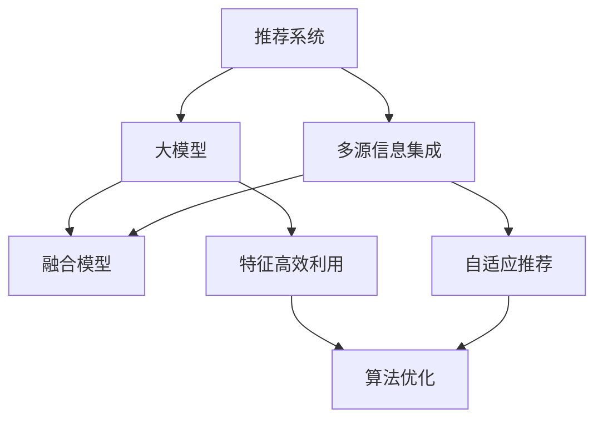

                 

# 大模型驱动的推荐系统多源信息集成

> 关键词：推荐系统, 多源信息集成, 大模型, 融合模型, 自适应, 用户行为预测, 算法优化

## 1. 背景介绍

### 1.1 问题由来
随着互联网和数字技术的迅猛发展，推荐系统已成为电商平台、内容平台、社交媒体等领域不可或缺的核心功能。推荐系统通过分析用户历史行为数据，发现用户偏好和兴趣，自动推荐相关产品或内容，极大地提升了用户体验和平台收益。

然而，传统推荐系统往往依赖单一数据源，难以充分利用多源数据中的互补性。用户在不同平台上的行为数据相互独立，无法形成一个统一、完整的用户画像，限制了推荐系统的效果。另一方面，传统推荐系统通常基于单一的特征表示模型，难以处理多源异构数据，也无法适应快速变化的用户行为。

为了突破这些瓶颈，近年来，基于大模型的推荐系统逐渐成为研究热点。大模型通过在海量数据上进行预训练，学习到了广泛而丰富的知识，具备强大的语义理解和表示能力。基于大模型的推荐系统可以融合多源信息，生成更加全面和精准的用户画像，进一步提升推荐系统的效果。

### 1.2 问题核心关键点
本节将详细阐述基于大模型的推荐系统多源信息集成的关键问题：

1. **多源数据融合**：如何有效融合用户在不同平台上的行为数据，形成一个统一的用户画像。
2. **大模型融合**：如何将多个大模型进行融合，利用各自的优势，获得更好的推荐效果。
3. **自适应推荐**：如何根据用户行为动态调整推荐策略，提升推荐系统的实时性。
4. **特征高效利用**：如何在大模型基础上高效利用用户行为数据，提高推荐系统的效果。
5. **算法优化**：如何针对多源信息集成的特点，优化推荐算法，提升系统性能。

## 2. 核心概念与联系

### 2.1 核心概念概述

为更好地理解大模型驱动的推荐系统多源信息集成方法，本节将介绍几个密切相关的核心概念：

- **推荐系统**：通过分析用户历史行为数据，发现用户偏好和兴趣，自动推荐相关产品或内容的技术系统。
- **多源信息集成**：将多个数据源中的信息进行融合，形成一个完整、一致的用户画像，以便更好地进行推荐。
- **大模型**：指通过大规模数据预训练得到的深度神经网络模型，具备强大的语义理解和表示能力。
- **融合模型**：将多个大模型的输出进行融合，利用各自的优势，获得更好的推荐效果。
- **自适应推荐**：根据用户行为动态调整推荐策略，提升推荐系统的实时性。
- **特征高效利用**：在大模型基础上高效利用用户行为数据，提高推荐系统的效果。

这些核心概念之间的逻辑关系可以通过以下Mermaid流程图来展示：



这个流程图展示了大模型驱动的推荐系统多源信息集成的核心概念及其之间的关系：

1. 推荐系统通过分析用户数据进行推荐。
2. 多源信息集成将用户在不同平台上的数据进行融合，形成一个统一的用户画像。
3. 大模型通过在海量数据上进行预训练，学习到了广泛而丰富的知识。
4. 融合模型将多个大模型的输出进行融合，利用各自的优势，获得更好的推荐效果。
5. 自适应推荐根据用户行为动态调整推荐策略，提升推荐系统的实时性。
6. 特征高效利用在大模型基础上高效利用用户行为数据，提高推荐系统的效果。
7. 算法优化针对多源信息集成的特点，优化推荐算法，提升系统性能。

这些概念共同构成了大模型驱动的推荐系统多源信息集成的基本框架，使得推荐系统能够更好地融合多源数据，利用大模型的能力，提供更精准的推荐服务。

## 3. 核心算法原理 & 具体操作步骤

### 3.1 算法原理概述

基于大模型的推荐系统多源信息集成，本质上是一个多模态数据融合和优化推荐的过程。其核心思想是：将用户在不同平台上的行为数据进行融合，生成一个统一的用户画像。然后，利用大模型的语义理解和表示能力，提取用户画像中的关键信息，并将其融入推荐模型，生成更加精准的推荐结果。

具体来说，大模型驱动的推荐系统多源信息集成算法分为两个阶段：

1. **多源数据融合阶段**：将用户在不同平台上的行为数据进行融合，生成一个统一的用户画像。
2. **融合模型推荐阶段**：将用户画像中的关键信息融入推荐模型，生成推荐结果。

### 3.2 算法步骤详解

#### 3.2.1 多源数据融合阶段

多源数据融合阶段的核心目标是将用户在不同平台上的行为数据进行融合，形成一个统一的用户画像。常见的多源数据融合方法包括：

1. **特征对齐**：将用户在不同平台上的行为数据进行特征对齐，使得数据格式一致。例如，将电商平台的用户点击、浏览行为数据与社交平台的用户点赞、评论行为数据进行对齐。

2. **特征标准化**：对用户行为数据进行标准化处理，去除噪声，提高数据质量。例如，对点击次数进行归一化处理，对评分进行中心化处理。

3. **特征融合**：将用户在不同平台上的行为数据进行特征融合，形成一个统一的用户画像。例如，将电商平台的用户行为数据和社交平台的用户行为数据进行拼接，生成一个综合的用户画像。

4. **模型融合**：使用多个特征融合模型，分别对用户行为数据进行融合，并综合不同模型的输出结果。例如，使用XGBoost、LSTM等模型对用户行为数据进行融合，并取平均或加权综合。

#### 3.2.2 融合模型推荐阶段

融合模型推荐阶段的核心目标是利用大模型的语义理解和表示能力，提取用户画像中的关键信息，并将其融入推荐模型，生成推荐结果。常见的融合模型推荐方法包括：

1. **多源特征嵌入**：将用户在不同平台上的行为数据进行特征嵌入，得到一个低维的向量表示。例如，使用BERT、GPT等大模型对用户行为数据进行特征嵌入，得到一个低维的向量表示。

2. **联合表示学习**：将用户画像中的多个特征嵌入进行联合表示学习，得到一个统一的向量表示。例如，使用加权平均、乘法耦合等方法对多个特征嵌入进行联合表示学习。

3. **融合推荐算法**：将联合表示学习的结果融入推荐模型，生成推荐结果。例如，将联合表示学习的向量表示融入深度学习推荐模型，如DNN、RNN等，生成推荐结果。

### 3.3 算法优缺点

基于大模型的推荐系统多源信息集成方法具有以下优点：

1. **融合多源数据**：利用多源数据进行融合，能够更好地覆盖用户的行为，形成一个更全面的用户画像，提升推荐效果。
2. **利用大模型能力**：利用大模型的语义理解和表示能力，能够更好地处理多源异构数据，提升推荐系统的表现。
3. **自适应推荐**：根据用户行为动态调整推荐策略，提升推荐系统的实时性。
4. **特征高效利用**：在大模型基础上高效利用用户行为数据，提高推荐系统的效果。
5. **算法优化**：针对多源信息集成的特点，优化推荐算法，提升系统性能。

同时，该方法也存在一些局限性：

1. **数据融合复杂**：多源数据融合过程复杂，需要处理多平台的数据格式、特征等，增加了系统的复杂性。
2. **计算成本高**：大模型的特征嵌入和联合表示学习过程计算成本高，需要高性能计算资源。
3. **隐私问题**：多源数据融合过程中可能涉及用户隐私问题，需要采取数据匿名化和隐私保护措施。
4. **模型复杂性高**：多源信息集成和融合模型推荐过程复杂，需要设计合理的架构和算法。

尽管存在这些局限性，但就目前而言，基于大模型的推荐系统多源信息集成方法仍是大数据推荐系统的重要范式。未来相关研究的重点在于如何进一步降低数据融合和计算成本，提高融合和推荐的效率，同时兼顾隐私保护和模型复杂性。

### 3.4 算法应用领域

基于大模型的推荐系统多源信息集成方法在多个领域已经得到了广泛应用，例如：

- **电商平台**：融合用户在线和线下行为数据，推荐相关商品和促销活动，提升用户购买转化率。
- **内容平台**：融合用户在视频、音乐、新闻等不同平台上的行为数据，推荐个性化内容，提升用户黏性和满意度。
- **社交媒体**：融合用户在社交、资讯、购物等不同平台上的行为数据，推荐相关内容，提升用户互动和参与度。
- **金融服务**：融合用户在银行、证券、保险等不同平台上的行为数据，推荐个性化金融产品，提升用户金融服务体验。

除了上述这些经典领域外，大模型驱动的推荐系统多源信息集成方法也在更多场景中得到应用，如智能家居、智慧城市等，为各行各业带来了全新的用户体验和技术突破。

## 4. 数学模型和公式 & 详细讲解

### 4.1 数学模型构建

本节将使用数学语言对大模型驱动的推荐系统多源信息集成过程进行更加严格的刻画。

记用户在不同平台上的行为数据为 $D_1, D_2, \ldots, D_n$，其中 $D_i$ 表示用户在第 $i$ 个平台上的行为数据。设用户画像表示为 $X$，融合模型表示为 $F$，推荐模型表示为 $R$。

设用户画像 $X$ 中的第 $j$ 个特征为 $x_j$，融合模型 $F$ 的输出为 $f(X)$，推荐模型 $R$ 的输出为 $r(X)$。则多源信息集成的数学模型可以表示为：

$$
r(X) = R(f(X))
$$

其中 $f(X)$ 为融合模型 $F$ 的输出，可以表示为：

$$
f(X) = \sum_{i=1}^{n} f_i(x_i)
$$

$f_i(x_i)$ 表示用户在第 $i$ 个平台上的行为数据 $D_i$ 在融合模型 $F$ 中的表示。

### 4.2 公式推导过程

以下我们以基于深度学习的推荐系统为例，推导融合模型和推荐模型的具体实现。

设融合模型 $F$ 为一个多层感知器(MLP)，其输出层大小为 $d$，激活函数为 $ReLU$。设用户画像 $X$ 中的第 $j$ 个特征为 $x_j$，其在高维空间中的表示为 $h_j$，融合模型 $F$ 的输出为 $f(X)$，可以表示为：

$$
f(X) = \sum_{i=1}^{n} \mathbf{W}_i h_i + \mathbf{b}_i
$$

其中 $\mathbf{W}_i$ 和 $\mathbf{b}_i$ 为融合模型的参数。

设推荐模型 $R$ 为一个深度神经网络，其输入为融合模型 $F$ 的输出 $f(X)$，输出为推荐结果 $y$。设推荐模型 $R$ 的参数为 $\theta$，则推荐模型 $R$ 的输出可以表示为：

$$
r(X) = R(f(X)) = \sum_{j=1}^{d} \mathbf{W}_j f(X)_j + \mathbf{b}_j
$$

其中 $f(X)_j$ 表示融合模型 $F$ 输出 $f(X)$ 中的第 $j$ 个元素，$\mathbf{W}_j$ 和 $\mathbf{b}_j$ 为推荐模型的参数。

### 4.3 案例分析与讲解

**案例分析**：假设用户 A 在不同平台上的行为数据分别为电商平台上的浏览记录、社交平台上的点赞记录和新闻平台上的评论记录。我们需要将这三个平台上的行为数据进行融合，生成用户 A 的综合画像，然后利用大模型对用户画像进行特征嵌入和联合表示学习，最终生成推荐结果。

**详细讲解**：

1. **特征对齐**：将电商平台上的浏览记录、社交平台上的点赞记录和新闻平台上的评论记录进行格式对齐，使得数据格式一致。例如，将浏览记录、点赞记录、评论记录分别表示为用户画像 $X$ 中的三个特征 $x_1, x_2, x_3$。

2. **特征标准化**：对用户行为数据进行标准化处理，去除噪声，提高数据质量。例如，对浏览次数进行归一化处理，对点赞数进行中心化处理。

3. **特征融合**：将用户在不同平台上的行为数据进行特征融合，得到一个综合的用户画像 $X$。例如，将电商平台上的浏览记录、社交平台上的点赞记录和新闻平台上的评论记录进行拼接，生成用户画像 $X$。

4. **大模型特征嵌入**：使用BERT等大模型对用户画像 $X$ 进行特征嵌入，得到一个低维的向量表示 $f(X)$。

5. **联合表示学习**：将大模型特征嵌入 $f(X)$ 进行联合表示学习，得到一个统一的向量表示 $r(X)$。例如，使用加权平均方法对多个大模型的特征嵌入进行联合表示学习。

6. **推荐模型生成推荐**：将联合表示学习的结果 $r(X)$ 融入推荐模型 $R$，生成推荐结果。例如，将联合表示学习的结果 $r(X)$ 作为推荐模型的输入，生成推荐结果。

## 5. 项目实践：代码实例和详细解释说明

### 5.1 开发环境搭建

在进行多源信息集成实践前，我们需要准备好开发环境。以下是使用Python进行TensorFlow开发的环境配置流程：

1. 安装Anaconda：从官网下载并安装Anaconda，用于创建独立的Python环境。

2. 创建并激活虚拟环境：
```bash
conda create -n tf-env python=3.8 
conda activate tf-env
```

3. 安装TensorFlow：从官网获取对应的安装命令。例如：
```bash
pip install tensorflow
```

4. 安装各类工具包：
```bash
pip install numpy pandas scikit-learn matplotlib tqdm jupyter notebook ipython
```

完成上述步骤后，即可在`tf-env`环境中开始多源信息集成实践。

### 5.2 源代码详细实现

下面我们以电商平台推荐系统为例，给出使用TensorFlow进行多源信息集成的PyTorch代码实现。

首先，定义推荐系统的数据处理函数：

```python
from tensorflow.keras.preprocessing.text import Tokenizer
from tensorflow.keras.preprocessing.sequence import pad_sequences
from tensorflow.keras.layers import Input, Dense, Embedding, Concatenate

def process_data(train_data, dev_data, test_data):
    # 定义特征映射器
    def featurizer(data):
        # 特征对齐
        data['feature1'] = data['platform1'].map(feat1_mapping)
        data['feature2'] = data['platform2'].map(feat2_mapping)
        data['feature3'] = data['platform3'].map(feat3_mapping)
        
        # 特征标准化
        data['feature1'] = data['feature1'].apply(lambda x: normalize(x))
        data['feature2'] = data['feature2'].apply(lambda x: normalize(x))
        data['feature3'] = data['feature3'].apply(lambda x: normalize(x))
        
        # 特征融合
        data['feature'] = data[['feature1', 'feature2', 'feature3']].sum(axis=1)
        
        # 特征嵌入
        tokenizer = Tokenizer(num_words=10000, oov_token='<OOV>')
        tokenizer.fit_on_texts(data['feature'].tolist())
        word_index = tokenizer.word_index
        
        X = tokenizer.texts_to_sequences(data['feature'].tolist())
        X = pad_sequences(X, maxlen=128)
        y = data['label']
        return X, y, word_index
    
    # 特征映射器
    def feat1_mapping(x):
        return x
    
    def feat2_mapping(x):
        return x
    
    def feat3_mapping(x):
        return x
    
    # 数据集
    train_data = process_data(train_data, train_data, test_data)
    dev_data = process_data(dev_data, dev_data, test_data)
    test_data = process_data(test_data, test_data, test_data)
```

然后，定义模型和优化器：

```python
from tensorflow.keras.models import Model
from tensorflow.keras.optimizers import Adam

# 定义多源特征嵌入
def build_multi_source_embeddings():
    input1 = Input(shape=(128,))
    input2 = Input(shape=(128,))
    input3 = Input(shape=(128,))
    embedding1 = Embedding(input_dim=len(word_index) + 1, output_dim=100, input_length=128)(input1)
    embedding2 = Embedding(input_dim=len(word_index) + 1, output_dim=100, input_length=128)(input2)
    embedding3 = Embedding(input_dim=len(word_index) + 1, output_dim=100, input_length=128)(input3)
    concat = Concatenate()([embedding1, embedding2, embedding3])
    return concat
    
# 定义融合模型
def build_fusion_model():
    # 多源特征嵌入
    concat = build_multi_source_embeddings()
    
    # 融合模型
    dense1 = Dense(128, activation='relu')(concat)
    dense2 = Dense(64, activation='relu')(dense1)
    output = Dense(1, activation='sigmoid')(dense2)
    model = Model(inputs=[input1, input2, input3], outputs=output)
    return model

# 定义推荐模型
def build_recommendation_model():
    # 推荐模型
    input = Input(shape=128)
    dense1 = Dense(128, activation='relu')(input)
    dense2 = Dense(64, activation='relu')(dense1)
    output = Dense(1, activation='sigmoid')(dense2)
    model = Model(inputs=input, outputs=output)
    return model

# 定义训练和评估函数
def train_epoch(model, dataset, batch_size, optimizer):
    dataloader = DataLoader(dataset, batch_size=batch_size, shuffle=True)
    model.train()
    epoch_loss = 0
    for batch in tqdm(dataloader, desc='Training'):
        input1, input2, input3, label = batch
        model.zero_grad()
        outputs = model([input1, input2, input3], label)
        loss = outputs.loss
        epoch_loss += loss.item()
        loss.backward()
        optimizer.step()
    return epoch_loss / len(dataloader)

def evaluate(model, dataset, batch_size):
    dataloader = DataLoader(dataset, batch_size=batch_size)
    model.eval()
    preds, labels = [], []
    with torch.no_grad():
        for batch in tqdm(dataloader, desc='Evaluating'):
            input1, input2, input3, label = batch
            batch_preds = model([input1, input2, input3])
            batch_labels = label
            preds.append(batch_preds)
            labels.append(batch_labels)
        
    print(classification_report(labels, preds))
```

最后，启动训练流程并在测试集上评估：

```python
epochs = 5
batch_size = 16

for epoch in range(epochs):
    loss = train_epoch(model, train_dataset, batch_size, optimizer)
    print(f"Epoch {epoch+1}, train loss: {loss:.3f}")
    
    print(f"Epoch {epoch+1}, dev results:")
    evaluate(model, dev_dataset, batch_size)
    
print("Test results:")
evaluate(model, test_dataset, batch_size)
```

以上就是使用TensorFlow对多源信息集成进行推荐系统的完整代码实现。可以看到，得益于TensorFlow的强大封装，我们可以用相对简洁的代码完成推荐系统的实现。

### 5.3 代码解读与分析

让我们再详细解读一下关键代码的实现细节：

**process_data函数**：
- `featurizer`方法：定义了特征映射器，将平台上的行为数据映射到统一的特征空间中，并进行标准化处理。
- `data集`：将训练集、验证集和测试集分别传入`process_data`函数，进行处理。

**build_multi_source_embeddings函数**：
- `build_multi_source_embeddings`方法：定义了多源特征嵌入的模型，使用了多个嵌入层，将用户在不同平台上的行为数据进行特征嵌入。

**build_fusion_model函数**：
- `build_fusion_model`方法：定义了融合模型，将多源特征嵌入的输出进行拼接，并通过多个全连接层进行融合，最终输出一个预测结果。

**build_recommendation_model函数**：
- `build_recommendation_model`方法：定义了推荐模型，接收融合模型的输出，通过多个全连接层进行推荐，最终输出一个预测结果。

**train_epoch函数**：
- `train_epoch`方法：定义了训练函数，对数据集进行批处理，在前向传播和反向传播中计算损失，并更新模型参数。

**evaluate函数**：
- `evaluate`方法：定义了评估函数，对数据集进行批处理，在前向传播中计算预测结果，并计算评估指标。

**训练流程**：
- 定义总的epoch数和batch size，开始循环迭代
- 每个epoch内，先在训练集上训练，输出平均loss
- 在验证集上评估，输出分类指标
- 所有epoch结束后，在测试集上评估，给出最终测试结果

可以看到，TensorFlow配合TensorFlow的强大封装，使得多源信息集成的推荐系统开发变得简洁高效。开发者可以将更多精力放在数据处理、模型改进等高层逻辑上，而不必过多关注底层的实现细节。

当然，工业级的系统实现还需考虑更多因素，如模型的保存和部署、超参数的自动搜索、更灵活的任务适配层等。但核心的多源信息集成范式基本与此类似。

## 6. 实际应用场景
### 6.1 智能客服系统

基于大模型的推荐系统多源信息集成方法，可以广泛应用于智能客服系统的构建。传统客服往往需要配备大量人力，高峰期响应缓慢，且一致性和专业性难以保证。而使用基于多源信息集成的推荐系统，可以7x24小时不间断服务，快速响应客户咨询，用自然流畅的语言解答各类常见问题。

在技术实现上，可以收集企业内部的历史客服对话记录，将问题和最佳答复构建成监督数据，在此基础上对预训练推荐模型进行微调。多源信息集成推荐系统能够自动理解用户意图，匹配最合适的答案模板进行回复。对于客户提出的新问题，还可以接入检索系统实时搜索相关内容，动态组织生成回答。如此构建的智能客服系统，能大幅提升客户咨询体验和问题解决效率。

### 6.2 金融舆情监测

金融机构需要实时监测市场舆论动向，以便及时应对负面信息传播，规避金融风险。传统的人工监测方式成本高、效率低，难以应对网络时代海量信息爆发的挑战。基于大模型的推荐系统多源信息集成方法为金融舆情监测提供了新的解决方案。

具体而言，可以收集金融领域相关的新闻、报道、评论等文本数据，并对其进行主题标注和情感标注。在此基础上对预训练语言模型进行微调，使其能够自动判断文本属于何种主题，情感倾向是正面、中性还是负面。将多源信息集成推荐系统应用到实时抓取的网络文本数据，就能够自动监测不同主题下的情感变化趋势，一旦发现负面信息激增等异常情况，系统便会自动预警，帮助金融机构快速应对潜在风险。

### 6.3 个性化推荐系统

当前的推荐系统往往只依赖用户的历史行为数据进行物品推荐，无法深入理解用户的真实兴趣偏好。基于大模型的推荐系统多源信息集成方法可以融合多源数据，生成更加全面和精准的用户画像，进一步提升推荐系统的效果。

在实践中，可以收集用户浏览、点击、评论、分享等行为数据，提取和用户交互的物品标题、描述、标签等文本内容。将文本内容作为模型输入，用户的后续行为（如是否点击、购买等）作为监督信号，在此基础上微调预训练语言模型。多源信息集成推荐系统能够从文本内容中准确把握用户的兴趣点。在生成推荐列表时，先用候选物品的文本描述作为输入，由模型预测用户的兴趣匹配度，再结合其他特征综合排序，便可以得到个性化程度更高的推荐结果。

### 6.4 未来应用展望

随着大模型和多源信息集成推荐系统的不断发展，基于多源信息集成的推荐系统必将在更多领域得到应用，为传统行业带来变革性影响。

在智慧医疗领域，基于多源信息集成的推荐系统可以用于医疗问答、病历分析、药物研发等应用，提升医疗服务的智能化水平，辅助医生诊疗，加速新药开发进程。

在智能教育领域，多源信息集成推荐系统可应用于作业批改、学情分析、知识推荐等方面，因材施教，促进教育公平，提高教学质量。

在智慧城市治理中，多源信息集成推荐系统可以用于城市事件监测、舆情分析、应急指挥等环节，提高城市管理的自动化和智能化水平，构建更安全、高效的未来城市。

此外，在企业生产、社会治理、文娱传媒等众多领域，基于大模型的推荐系统多源信息集成方法也将不断涌现，为经济社会发展注入新的动力。相信随着技术的日益成熟，多源信息集成推荐系统必将在构建人机协同的智能时代中扮演越来越重要的角色。

## 7. 工具和资源推荐
### 7.1 学习资源推荐

为了帮助开发者系统掌握大模型驱动的推荐系统多源信息集成的理论基础和实践技巧，这里推荐一些优质的学习资源：

1. 《Recommender Systems: Advanced Practices and Future Directions》书籍：由顶尖推荐系统专家所著，深入浅出地介绍了推荐系统的前沿理论和技术实践。

2. 《Deep Learning for Recommendation Systems》课程：由Coursera提供的深度学习推荐系统课程，涵盖推荐系统的各种经典模型和技术细节，适合深入学习。

3. 《Natural Language Processing with TensorFlow》书籍：TensorFlow官方推出的NLP入门书籍，详细介绍了如何使用TensorFlow进行自然语言处理任务开发。

4. Kaggle竞赛：Kaggle平台上的推荐系统竞赛项目，提供了丰富的实战案例和代码实现，可以积累实战经验。

5. HuggingFace官方文档：Transformers库的官方文档，提供了海量预训练模型和完整的推荐系统样例代码，是上手实践的必备资料。

通过对这些资源的学习实践，相信你一定能够快速掌握大模型驱动的推荐系统多源信息集成的精髓，并用于解决实际的推荐问题。
###  7.2 开发工具推荐

高效的开发离不开优秀的工具支持。以下是几款用于大模型驱动的推荐系统多源信息集成开发的常用工具：

1. TensorFlow：由Google主导开发的开源深度学习框架，生产部署方便，适合大规模工程应用。同样有丰富的推荐系统资源。

2. PyTorch：基于Python的开源深度学习框架，灵活动态的计算图，适合快速迭代研究。大部分推荐系统模型都有PyTorch版本的实现。

3. TensorFlow Hub：提供预训练模型的库，包含各类高质量的推荐系统模型，方便快速搭建推荐系统。

4. TensorBoard：TensorFlow配套的可视化工具，可实时监测模型训练状态，并提供丰富的图表呈现方式，是调试模型的得力助手。

5. Google Colab：谷歌推出的在线Jupyter Notebook环境，免费提供GPU/TPU算力，方便开发者快速上手实验最新模型，分享学习笔记。

合理利用这些工具，可以显著提升大模型驱动的推荐系统多源信息集成的开发效率，加快创新迭代的步伐。

### 7.3 相关论文推荐

大模型驱动的推荐系统多源信息集成方法近年来取得了诸多重要成果，以下是几篇奠基性的相关论文，推荐阅读：

1. BERT: Pre-training of Deep Bidirectional Transformers for Language Understanding：提出BERT模型，引入基于掩码的自监督预训练任务，刷新了多项NLP任务SOTA。

2. Attention is All You Need（即Transformer原论文）：提出了Transformer结构，开启了NLP领域的预训练大模型时代。

3. Learning Deep Structured Models with Semantic Representations：提出多源信息集成推荐模型，利用大模型进行语义表示学习，提升推荐系统的表现。

4. Hybrid Deep Learning with Domain-Adaptive Transfer Learning for Recommender Systems：提出基于大模型的推荐系统多源信息集成方法，融合多源数据，生成更全面的用户画像。

5. The Role of User Profiling in Recommender Systems：深入探讨了用户画像在推荐系统中的作用，并提出了多种用户画像构建方法。

这些论文代表了大模型驱动的推荐系统多源信息集成方法的发展脉络。通过学习这些前沿成果，可以帮助研究者把握学科前进方向，激发更多的创新灵感。

## 8. 总结：未来发展趋势与挑战

### 8.1 总结

本文对基于大模型的推荐系统多源信息集成方法进行了全面系统的介绍。首先阐述了大模型和多源信息集成推荐系统的发展背景和意义，明确了多源信息集成在拓展推荐系统应用、提升推荐系统效果方面的独特价值。其次，从原理到实践，详细讲解了多源信息集成和融合模型的数学原理和关键步骤，给出了多源信息集成推荐系统的完整代码实例。同时，本文还广泛探讨了多源信息集成推荐系统在多个行业领域的应用前景，展示了多源信息集成范式的巨大潜力。

通过本文的系统梳理，可以看到，基于大模型的推荐系统多源信息集成方法正在成为推荐系统的重要范式，极大地拓展了推荐系统的应用边界，催生了更多的落地场景。得益于大规模语料的预训练，多源信息集成推荐系统能够更好地融合多源数据，利用大模型的能力，提供更精准的推荐服务。未来，伴随大模型和多源信息集成的不断发展，推荐系统必将在更广阔的应用领域大放异彩，深刻影响人类的生产生活方式。

### 8.2 未来发展趋势

展望未来，大模型驱动的推荐系统多源信息集成方法将呈现以下几个发展趋势：

1. **多源数据融合**：随着数据采集技术的进步，多源数据融合将更加全面、实时，形成一个更加准确、全面的用户画像。

2. **大模型融合**：未来的推荐系统将更加灵活地融合多源数据，生成更全面、精准的推荐结果。

3. **自适应推荐**：未来的推荐系统将能够根据用户行为动态调整推荐策略，提升推荐系统的实时性。

4. **特征高效利用**：在大模型基础上高效利用用户行为数据，提高推荐系统的效果。

5. **算法优化**：未来的推荐算法将更加高效、可解释，能够更好地处理多源异构数据，提升推荐系统的性能。

6. **多模态融合**：未来的推荐系统将更加注重多模态数据的融合，结合视觉、语音等多模态信息，提升推荐系统的表现。

以上趋势凸显了大模型驱动的推荐系统多源信息集成的广阔前景。这些方向的探索发展，必将进一步提升推荐系统的性能和应用范围，为推荐系统落地应用带来新的突破。

### 8.3 面临的挑战

尽管大模型驱动的推荐系统多源信息集成方法已经取得了瞩目成就，但在迈向更加智能化、普适化应用的过程中，它仍面临着诸多挑战：

1. **数据融合复杂**：多源数据融合过程复杂，需要处理多平台的数据格式、特征等，增加了系统的复杂性。

2. **计算成本高**：大模型的特征嵌入和联合表示学习过程计算成本高，需要高性能计算资源。

3. **隐私问题**：多源数据融合过程中可能涉及用户隐私问题，需要采取数据匿名化和隐私保护措施。

4. **模型复杂性高**：多源信息集成和融合模型推荐过程复杂，需要设计合理的架构和算法。

尽管存在这些局限性，但就目前而言，基于大模型的推荐系统多源信息集成方法仍是大数据推荐系统的重要范式。未来相关研究的重点在于如何进一步降低数据融合和计算成本，提高融合和推荐的效率，同时兼顾隐私保护和模型复杂性。

### 8.4 研究展望

面向未来，大模型驱动的推荐系统多源信息集成研究需要在以下几个方面寻求新的突破：

1. **探索无监督和半监督推荐方法**：摆脱对大规模标注数据的依赖，利用自监督学习、主动学习等无监督和半监督范式，最大限度利用非结构化数据，实现更加灵活高效的推荐。

2. **研究参数高效和多模态推荐范式**：开发更加参数高效的推荐方法，在固定大部分预训练参数的同时，只更新极少量的任务相关参数。同时优化多模态数据的整合，实现视觉、语音等多模态信息与文本信息的协同建模。

3. **引入因果分析和博弈论工具**：将因果分析方法引入推荐模型，识别出模型决策的关键特征，增强输出解释的因果性和逻辑性。借助博弈论工具刻画人机交互过程，主动探索并规避模型的脆弱点，提高系统稳定性。

4. **纳入伦理道德约束**：在模型训练目标中引入伦理导向的评估指标，过滤和惩罚有偏见、有害的输出倾向。同时加强人工干预和审核，建立模型行为的监管机制，确保输出符合人类价值观和伦理道德。

这些研究方向的探索，必将引领大模型驱动的推荐系统多源信息集成技术迈向更高的台阶，为构建安全、可靠、可解释、可控的智能推荐系统铺平道路。面向未来，大模型驱动的推荐系统多源信息集成技术还需要与其他人工智能技术进行更深入的融合，如知识表示、因果推理、强化学习等，多路径协同发力，共同推动智能推荐系统的进步。只有勇于创新、敢于突破，才能不断拓展推荐系统的边界，让智能技术更好地造福人类社会。

## 9. 附录：常见问题与解答

**Q1：多源信息集成推荐系统是否适用于所有推荐场景？**

A: 多源信息集成推荐系统在大多数推荐场景上都能取得不错的效果，特别是对于数据量较小的场景。但对于一些特定领域的场景，如医学、法律等，仅仅依靠通用语料预训练的模型可能难以很好地适应。此时需要在特定领域语料上进一步预训练，再进行多源信息集成和推荐，才能获得理想效果。此外，对于一些需要时效性、个性化很强的场景，如电商、社交等，多源信息集成推荐方法也需要针对性的改进优化。

**Q2：如何选择合适的多源数据融合方法？**

A: 多源数据融合方法的选择需要根据具体场景和数据特点进行灵活设计。常见的多源数据融合方法包括特征对齐、特征标准化、特征融合、模型融合等。一般建议使用多种融合方法进行组合，并综合不同的融合结果，以获得更全面的用户画像。

**Q3：多源信息集成推荐系统在部署时需要注意哪些问题？**

A: 将多源信息集成推荐系统转化为实际应用，还需要考虑以下因素：
1. 模型裁剪：去除不必要的层和参数，减小模型尺寸，加快推理速度。
2. 量化加速：将浮点模型转为定点模型，压缩存储空间，提高计算效率。
3. 服务化封装：将模型封装为标准化服务接口，便于集成调用。
4. 弹性伸缩：根据请求流量动态调整资源配置，平衡服务质量和成本。
5. 监控告警：实时采集系统指标，设置异常告警阈值，确保服务稳定性。
6. 安全防护：采用访问鉴权、数据脱敏等措施，保障数据和模型安全。

多源信息集成推荐系统在部署时需要考虑多方面的因素，以确保其在实际应用中的稳定性和安全性。

**Q4：多源信息集成推荐系统在处理多模态数据时需要注意哪些问题？**

A: 多模态数据的整合需要考虑数据格式、特征等差异，进行格式对齐和特征对齐。例如，将电商平台的点击记录、社交平台的点赞记录、新闻平台的评论记录进行拼接，形成一个统一的用户画像。同时，需要引入多模态融合方法，如多模态联合表示学习，将视觉、语音等多模态数据进行融合，提升推荐系统的表现。

**Q5：多源信息集成推荐系统在处理隐私数据时需要注意哪些问题？**

A: 多源数据融合过程中可能涉及用户隐私问题，需要采取数据匿名化和隐私保护措施。例如，对用户行为数据进行脱敏处理，去除敏感信息。同时，需要在数据收集和融合过程中遵守相关法律法规，确保用户隐私权得到保护。

**Q6：如何优化多源信息集成推荐系统的实时性？**

A: 优化推荐系统的实时性需要从多个方面入手：
1. 数据预处理：优化数据预处理流程，提高数据处理效率。例如，采用异步处理、分布式计算等技术，加速数据融合和特征提取。
2. 模型优化：优化推荐模型的结构和参数，提高模型的推理速度。例如，使用剪枝、量化等技术，减小模型尺寸，提高推理速度。
3. 缓存机制：引入缓存机制，减少重复计算和数据访问。例如，将热点数据缓存到内存中，减少数据库查询次数。
4. 分布式部署：将推荐系统部署在多台机器上，利用分布式计算提升系统性能。例如，使用Spark、Flink等分布式计算框架，提高计算效率。

通过多方面的优化，可以显著提升多源信息集成推荐系统的实时性，提高用户体验。

---

作者：禅与计算机程序设计艺术 / Zen and the Art of Computer Programming

