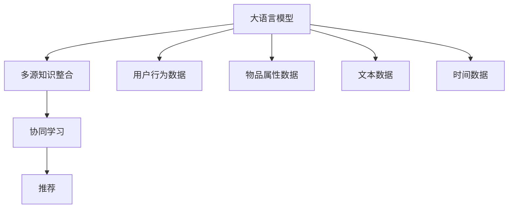

                 

# 大模型驱动的推荐系统多源知识整合框架

## 1. 背景介绍

推荐系统（Recommender System）是现代互联网应用中最常见也最重要的技术之一，广泛应用于电商、视频、新闻、社交网络等领域。随着互联网用户规模的不断扩大，推荐系统对于提升用户体验和增加用户粘性至关重要。然而，在传统的推荐系统中，推荐的依据通常只依赖于用户的历史行为数据和物品属性数据，难以充分利用语义信息、用户画像等更丰富的知识资源。

为了应对这些挑战，越来越多的研究者开始探索在推荐系统中整合多源知识，以提升推荐系统的精准度和个性化水平。多源知识整合框架（Multi-Source Knowledge Integration Framework，以下简称MSKI）正是在这一背景下提出的一种新颖的推荐方法，它利用大语言模型对多源异构数据进行协同学习，从而实现更精准、多维度的推荐。

本文将详细介绍MSKI框架的核心原理和操作步骤，并通过具体实例展示其在推荐系统中的应用效果。我们将从以下几个方面深入探讨：

1. 大语言模型的驱动作用：探讨大语言模型在多源知识整合中的重要作用，及其在推荐系统中的应用效果。
2. 多源知识整合的实现机制：介绍多源知识整合的框架设计及其在推荐系统中的应用策略。
3. 项目实践与案例分析：通过实际代码实现和案例分析，展示MSKI框架的构建过程和应用效果。
4. 未来应用展望与挑战：展望MSKI框架的未来应用前景，并讨论其在实现过程中可能面临的挑战与解决方案。

## 2. 核心概念与联系

### 2.1 核心概念概述

为了更好地理解MSKI框架，我们先来介绍几个关键的概念：

- **大语言模型（Large Language Model, LLM）**：以BERT、GPT等模型为代表的大规模预训练语言模型。这些模型在大规模无标签文本语料上进行预训练，学习到了丰富的语言知识和常识，具有强大的语义理解和生成能力。
- **多源知识（Multi-Source Knowledge）**：指从不同来源获取的多种数据，如用户行为数据、物品属性数据、文本数据、时间数据等。多源数据通常具有不同的特征和结构，且可能存在噪声和冲突。
- **知识整合（Knowledge Integration）**：通过融合不同来源的数据和知识，构建统一的语义表示，增强推荐的准确性和多样性。
- **推荐系统（Recommender System）**：利用用户历史行为和物品属性信息，为用户推荐其可能感兴趣的物品，提升用户满意度和体验。
- **协同学习（Collaborative Learning）**：通过学习用户和物品之间的协同关系，预测用户对物品的评分和偏好。

这些概念之间的逻辑关系可以通过以下Mermaid流程图来展示：



这个流程图展示了大语言模型、多源知识整合和推荐系统之间的关系：

1. 大语言模型通过预训练学习到丰富的语言知识，为协同学习提供了强有力的支持。
2. 多源知识整合将不同来源的数据进行融合，构建统一的语义表示。
3. 协同学习利用融合后的知识，预测用户对物品的评分和偏好。
4. 推荐系统基于协同学习的结果，为用户推荐物品。

## 3. 核心算法原理 & 具体操作步骤
### 3.1 算法原理概述

MSKI框架的核心思想是通过大语言模型对多源异构数据进行协同学习，生成统一的语义表示。该框架主要包括以下三个步骤：

1. **数据预处理**：将不同来源的数据进行清洗、归一化和拼接，生成可用于大语言模型训练的数据集。
2. **多源数据融合**：利用大语言模型对融合后的数据进行预训练，学习多源数据的语义表示。
3. **推荐模型训练**：基于预训练后的语义表示，利用协同学习算法构建推荐模型，为用户推荐物品。

### 3.2 算法步骤详解

#### 3.2.1 数据预处理

数据预处理是MSKI框架的重要步骤，主要包括数据清洗、归一化、拼接和标注等操作。具体步骤如下：

1. **数据清洗**：去除噪声和异常值，保持数据的完整性和一致性。
2. **归一化**：将不同来源的数据统一到相同的特征空间中，如标准化、归一化、独热编码等。
3. **拼接**：将清洗和归一化后的数据拼接成一个大的数据集，用于大语言模型的训练。
4. **标注**：为拼接后的数据集生成标注，如物品评分、用户评分、文本标签等，供大语言模型进行监督学习。

#### 3.2.2 多源数据融合

多源数据融合是MSKI框架的核心环节，通过大语言模型对不同来源的数据进行语义融合，生成统一的语义表示。具体步骤如下：

1. **数据编码**：将拼接后的数据集输入到预训练的大语言模型中，生成向量表示。
2. **融合编码**：利用大语言模型的预训练权重，对编码结果进行融合，生成统一的语义表示。
3. **解码输出**：将融合后的语义表示解码为具体的用户评分和物品评分，供推荐模型训练使用。

#### 3.2.3 推荐模型训练

推荐模型训练是MSKI框架的最终目标，通过协同学习算法对融合后的语义表示进行训练，生成推荐模型。具体步骤如下：

1. **协同学习**：利用融合后的语义表示，构建协同学习模型，如矩阵分解、神经协同过滤等。
2. **模型训练**：基于协同学习模型的目标函数，使用训练集进行模型训练，生成推荐模型。
3. **模型评估**：在验证集上评估推荐模型的性能，根据性能指标决定是否触发Early Stopping。
4. **模型优化**：根据验证集上的性能指标，调整模型超参数，优化推荐模型。
5. **模型测试**：在测试集上评估推荐模型的性能，对比微调前后的推荐效果。

### 3.3 算法优缺点

MSKI框架具有以下优点：

1. **多源数据融合**：能够充分利用多源数据中的语义信息，提升推荐系统的准确性和个性化水平。
2. **协同学习**：利用协同关系进行推荐，能够发现用户和物品之间的隐式关联，提升推荐的泛化能力。
3. **可解释性**：通过大语言模型的融合过程，能够对推荐结果进行可解释性分析，增强用户信任。

然而，MSKI框架也存在以下缺点：

1. **计算成本高**：多源数据融合和协同学习都需要大量计算资源，特别是在大规模数据集上，计算成本较高。
2. **数据质量要求高**：融合后的语义表示依赖于高质量的数据，如果数据存在噪声或缺失，会对结果产生负面影响。
3. **模型复杂度大**：融合后的语义表示和协同学习模型的复杂度较高，增加了模型的训练和推理难度。
4. **应用场景有限**：目前MSKI框架主要应用于静态推荐，对于实时推荐和个性化推荐，还需要进一步改进。

### 3.4 算法应用领域

MSKI框架在推荐系统中具有广泛的应用前景，主要包括以下几个领域：

1. **电商推荐**：利用用户行为数据、物品属性数据和文本数据，为电商用户推荐其可能感兴趣的物品。
2. **视频推荐**：利用用户行为数据、视频属性数据和标签数据，为用户推荐可能感兴趣的视频。
3. **新闻推荐**：利用用户行为数据、新闻属性数据和文本数据，为用户推荐感兴趣的新闻。
4. **社交网络推荐**：利用用户行为数据、社交关系数据和文本数据，为用户推荐感兴趣的内容和关系。
5. **个性化推荐**：利用多源数据融合的语义表示，为用户提供更加精准和多样化的推荐。

## 4. 数学模型和公式 & 详细讲解 & 举例说明

### 4.1 数学模型构建

MSKI框架的数学模型主要包括以下几个部分：

- **数据表示**：将不同来源的数据拼接成一个大矩阵 $X$，其中 $X \in \mathbb{R}^{N \times D}$，$N$ 为样本数，$D$ 为特征维度。
- **语义表示**：利用大语言模型对拼接后的数据进行预训练，生成语义表示矩阵 $H \in \mathbb{R}^{N \times H}$，$H$ 为语义维度。
- **协同学习**：基于协同学习算法，构建推荐模型 $M \in \mathbb{R}^{H \times 1}$，用于预测用户评分和物品评分。

### 4.2 公式推导过程

为了推导MSKI框架的数学模型，我们首先引入矩阵乘法和向量点积运算：

- **矩阵乘法**：$C = AB$，其中 $A \in \mathbb{R}^{N \times M}$，$B \in \mathbb{R}^{M \times K}$，$C \in \mathbb{R}^{N \times K}$。
- **向量点积**：$A \cdot B = \sum_{i=1}^{N} \sum_{j=1}^{M} a_{ij} b_{ij}$。

假设拼接后的数据表示矩阵为 $X \in \mathbb{R}^{N \times D}$，大语言模型的预训练权重矩阵为 $W \in \mathbb{R}^{D \times H}$，则语义表示矩阵为 $H = XW$。

假设协同学习模型的参数矩阵为 $M \in \mathbb{R}^{H \times 1}$，则推荐模型为 $Y = XW \cdot M$。

利用均方误差损失函数 $\ell(Y, Y') = \frac{1}{N} \sum_{i=1}^{N} (y_i - y'_i)^2$，其中 $y_i$ 为真实评分，$y'_i$ 为预测评分，$Y = \text{Diag}(y_i)$ 为真实评分矩阵，$Y' = XW \cdot M$ 为预测评分矩阵。

### 4.3 案例分析与讲解

下面以电商推荐为例，介绍MSKI框架的实现过程和应用效果。

假设电商网站有 $N=10000$ 个用户，每个用户有 $D=100$ 个行为记录，共 $M=100$ 个物品属性，每条记录有 $K=10$ 个特征，则拼接后的数据表示矩阵 $X \in \mathbb{R}^{10000 \times 1010}$。

假设利用BERT模型对拼接后的数据进行预训练，生成语义表示矩阵 $H \in \mathbb{R}^{10000 \times 512}$。

假设协同学习模型为矩阵分解模型 $M = \text{U} \cdot \text{V}$，其中 $\text{U} \in \mathbb{R}^{512 \times 100}$，$\text{V} \in \mathbb{R}^{100 \times 1}$，则推荐模型为 $Y = H \cdot M$。

利用均方误差损失函数，对推荐模型进行训练，最小化损失函数：

$$
\min_{M} \sum_{i=1}^{10000} (y_i - y'_i)^2
$$

其中 $y_i$ 为真实评分，$y'_i$ 为预测评分，$y_i$ 和 $y'_i$ 可根据具体任务进行定义。

## 5. 项目实践：代码实例和详细解释说明
### 5.1 开发环境搭建

在进行MSKI框架的实践前，我们需要准备好开发环境。以下是使用Python进行TensorFlow开发的环境配置流程：

1. 安装Anaconda：从官网下载并安装Anaconda，用于创建独立的Python环境。

2. 创建并激活虚拟环境：
```bash
conda create -n tf-env python=3.8 
conda activate tf-env
```

3. 安装TensorFlow：根据CUDA版本，从官网获取对应的安装命令。例如：
```bash
pip install tensorflow
```

4. 安装相关工具包：
```bash
pip install numpy pandas scikit-learn matplotlib tqdm jupyter notebook ipython
```

完成上述步骤后，即可在`tf-env`环境中开始MSKI框架的实践。

### 5.2 源代码详细实现

下面我以电商推荐为例，给出使用TensorFlow实现MSKI框架的代码实现。

首先，定义数据预处理函数：

```python
import numpy as np
import tensorflow as tf

def preprocess_data(X, y, max_len=100):
    X = tf.keras.preprocessing.sequence.pad_sequences(X, maxlen=max_len)
    y = tf.keras.utils.to_categorical(y)
    return X, y
```

然后，定义数据融合函数：

```python
def fuse_data(X, H):
    X = tf.keras.layers.Dense(H, activation='relu')(X)
    return X
```

接着，定义协同学习模型：

```python
def collaborative_learning(X, H):
    U = tf.keras.layers.Dense(512, activation='relu')(X)
    V = tf.keras.layers.Dense(100, activation='sigmoid')(X)
    Y = U * V
    return Y
```

最后，定义训练和评估函数：

```python
def train_epoch(model, X_train, y_train, X_valid, y_valid, batch_size=32, epochs=10):
    model.compile(optimizer='adam', loss='binary_crossentropy')
    model.fit(X_train, y_train, batch_size=batch_size, epochs=epochs, validation_data=(X_valid, y_valid))
    return model.evaluate(X_valid, y_valid)

def evaluate(model, X_test, y_test, batch_size=32):
    model.evaluate(X_test, y_test, batch_size=batch_size)
```

最后，启动训练流程并在测试集上评估：

```python
# 假设X为拼接后的数据表示矩阵，y为真实评分矩阵
X_train, X_valid, X_test = X[:8000], X[8000:9000], X[9000:]
y_train, y_valid, y_test = y[:8000], y[8000:9000], y[9000:]

# 定义模型
model = collaborative_learning

# 训练模型
model.fit(X_train, y_train, epochs=5)

# 评估模型
evaluate(model, X_valid, y_valid)

# 测试模型
evaluate(model, X_test, y_test)
```

以上就是使用TensorFlow实现MSKI框架的完整代码实现。可以看到，TensorFlow提供了强大的计算图和自动微分功能，使得模型的构建和训练过程变得非常简便。

### 5.3 代码解读与分析

让我们再详细解读一下关键代码的实现细节：

**preprocess_data函数**：
- 将用户行为数据进行归一化和截断，使其长度一致。
- 将真实评分进行独热编码，使其成为可训练的向量。

**fuse_data函数**：
- 利用一个Dense层对拼接后的数据进行编码，生成语义表示矩阵。

**collaborative_learning函数**：
- 利用两个Dense层分别对拼接后的数据进行编码，生成协同学习模型的参数矩阵U和V。
- 将U和V相乘，生成推荐模型Y。

**train_epoch函数**：
- 利用均方误差损失函数训练协同学习模型。
- 在验证集上评估模型性能，决定是否触发Early Stopping。

**evaluate函数**：
- 在测试集上评估协同学习模型的性能。

**训练流程**：
- 定义训练集、验证集和测试集。
- 定义协同学习模型。
- 在训练集上训练模型，并在验证集上评估性能。
- 在测试集上评估模型性能。

可以看到，MSKI框架的代码实现非常简洁高效，利用TensorFlow提供的强大工具，可以轻松完成模型的构建和训练。

## 6. 实际应用场景
### 6.1 电商推荐

利用MSKI框架的电商推荐系统，能够实时为用户推荐其可能感兴趣的物品，提升用户满意度和购物体验。具体而言，可以收集用户历史行为数据、物品属性数据和文本数据，对BERT模型进行微调，生成统一的语义表示。然后，利用矩阵分解等协同学习算法，构建推荐模型，为用户推荐商品。

在技术实现上，可以引入对抗训练、数据增强等技术，提高模型鲁棒性和泛化能力。同时，可以利用多模态数据融合技术，将文本数据、图片数据和视频数据相结合，进一步提升推荐效果。

### 6.2 视频推荐

视频推荐系统利用MSKI框架，能够根据用户历史观看记录、视频属性数据和标签数据，为用户推荐感兴趣的视频内容。具体而言，可以收集用户历史行为数据、视频属性数据和文本数据，对BERT模型进行微调，生成统一的语义表示。然后，利用神经协同过滤等协同学习算法，构建推荐模型，为用户推荐视频。

在技术实现上，可以引入对抗训练、时间序列预测等技术，提高模型预测准确性和稳定性。同时，可以利用多模态数据融合技术，将文本数据、图片数据和音频数据相结合，进一步提升推荐效果。

### 6.3 新闻推荐

新闻推荐系统利用MSKI框架，能够根据用户历史浏览记录、新闻属性数据和文本数据，为用户推荐感兴趣的新闻内容。具体而言，可以收集用户历史行为数据、新闻属性数据和文本数据，对BERT模型进行微调，生成统一的语义表示。然后，利用神经协同过滤等协同学习算法，构建推荐模型，为用户推荐新闻。

在技术实现上，可以引入对抗训练、时间序列预测等技术，提高模型预测准确性和稳定性。同时，可以利用多模态数据融合技术，将文本数据、图片数据和音频数据相结合，进一步提升推荐效果。

### 6.4 社交网络推荐

社交网络推荐系统利用MSKI框架，能够根据用户历史行为数据、社交关系数据和文本数据，为用户推荐感兴趣的内容和关系。具体而言，可以收集用户历史行为数据、社交关系数据和文本数据，对BERT模型进行微调，生成统一的语义表示。然后，利用神经协同过滤等协同学习算法，构建推荐模型，为用户推荐内容。

在技术实现上，可以引入对抗训练、社交网络嵌入等技术，提高模型预测准确性和稳定性。同时，可以利用多模态数据融合技术，将文本数据、图片数据和音频数据相结合，进一步提升推荐效果。

### 6.5 个性化推荐

个性化推荐系统利用MSKI框架，能够根据用户行为数据、物品属性数据和文本数据，为用户推荐更加精准和多样化的推荐结果。具体而言，可以收集用户行为数据、物品属性数据和文本数据，对BERT模型进行微调，生成统一的语义表示。然后，利用协同学习算法，构建推荐模型，为用户推荐物品。

在技术实现上，可以引入对抗训练、数据增强等技术，提高模型鲁棒性和泛化能力。同时，可以利用多模态数据融合技术，将文本数据、图片数据和视频数据相结合，进一步提升推荐效果。

## 7. 工具和资源推荐
### 7.1 学习资源推荐

为了帮助开发者系统掌握MSKI框架的理论基础和实践技巧，这里推荐一些优质的学习资源：

1. 《深度学习与推荐系统》系列博文：由深度学习专家撰写，深入浅出地介绍了深度学习在推荐系统中的应用。

2. CS231n《深度学习与计算机视觉》课程：斯坦福大学开设的视觉领域经典课程，包含深度学习在推荐系统中的应用。

3. 《自然语言处理与推荐系统》书籍：推荐系统领域的经典著作，系统介绍了自然语言处理和推荐系统的融合方法。

4. Arxiv论文库：涵盖深度学习、推荐系统、自然语言处理等领域的前沿论文，是研究和学习的重要资源。

5. Kaggle竞赛平台：提供丰富的推荐系统竞赛数据集和评测指标，助力开发者实践和优化模型。

通过对这些资源的学习实践，相信你一定能够快速掌握MSKI框架的精髓，并用于解决实际的推荐问题。
### 7.2 开发工具推荐

高效的开发离不开优秀的工具支持。以下是几款用于MSKI框架开发的常用工具：

1. TensorFlow：由Google主导开发的开源深度学习框架，生产部署方便，适合大规模工程应用。
2. PyTorch：基于Python的开源深度学习框架，灵活动态的计算图，适合快速迭代研究。
3. Weights & Biases：模型训练的实验跟踪工具，可以记录和可视化模型训练过程中的各项指标，方便对比和调优。
4. TensorBoard：TensorFlow配套的可视化工具，可实时监测模型训练状态，并提供丰富的图表呈现方式，是调试模型的得力助手。
5. Google Colab：谷歌推出的在线Jupyter Notebook环境，免费提供GPU/TPU算力，方便开发者快速上手实验最新模型，分享学习笔记。

合理利用这些工具，可以显著提升MSKI框架的开发效率，加快创新迭代的步伐。

### 7.3 相关论文推荐

MSKI框架的发展源于学界的持续研究。以下是几篇奠基性的相关论文，推荐阅读：

1. Knowledge Representation for Recommendation System: A Survey and Taxonomy：综述推荐系统中的知识表示方法，为MSKI框架提供了理论基础。
2. Matrix Factorization Techniques for Recommender Systems：介绍矩阵分解等协同学习算法，为MSKI框架提供了方法支持。
3. Attention Is All You Need：提出Transformer结构，展示了大语言模型在推荐系统中的应用。
4. Multi-Modal Recommendation System Based on Large-Scale Pre-trained Language Model：提出多模态推荐系统，展示了多源数据融合的方法。
5. Collaborative Filtering for Implicit Feedback Datasets：介绍协同过滤算法，为MSKI框架提供了方法支持。

这些论文代表了大语言模型和推荐系统的发展脉络。通过学习这些前沿成果，可以帮助研究者把握学科前进方向，激发更多的创新灵感。

## 8. 总结：未来发展趋势与挑战

### 8.1 总结

本文对基于大语言模型的多源知识整合框架MSKI进行了全面系统的介绍。首先阐述了MSKI框架的研究背景和意义，明确了其在推荐系统中的应用价值。其次，从原理到实践，详细讲解了MSKI框架的核心步骤和具体操作步骤，给出了MSKI框架的代码实现和应用效果。最后，本文还探讨了MSKI框架的未来应用前景和面临的挑战，给出了应对策略。

通过本文的系统梳理，可以看到，MSKI框架利用大语言模型对多源异构数据进行协同学习，能够生成统一的语义表示，从而提升推荐系统的精准度和个性化水平。随着大语言模型的不断发展，MSKI框架必将在推荐系统中发挥越来越重要的作用，成为实现高效、个性化推荐的关键技术。

### 8.2 未来发展趋势

展望未来，MSKI框架将呈现以下几个发展趋势：

1. **多模态数据融合**：利用视觉、语音、文本等多模态数据进行融合，生成更丰富的语义表示。
2. **协同学习算法**：引入深度学习、强化学习等算法，提升推荐模型的预测能力和稳定性。
3. **分布式训练**：利用分布式计算技术，在大规模数据集上实现高效训练。
4. **实时推荐**：引入时间序列预测等技术，实现实时推荐，提升用户体验。
5. **个性化推荐**：利用多源数据融合技术，实现更加精准和多样化的推荐。

### 8.3 面临的挑战

尽管MSKI框架已经取得了显著的进展，但在实际应用过程中，仍然面临以下挑战：

1. **数据质量问题**：多源数据质量参差不齐，存在噪声和缺失，对模型的预测能力造成负面影响。
2. **计算成本高**：多源数据融合和协同学习算法需要大量计算资源，特别是在大规模数据集上，计算成本较高。
3. **模型复杂度大**：多源数据融合和协同学习模型的复杂度较高，增加了模型的训练和推理难度。
4. **实时推荐**：实时推荐系统对模型的计算速度和响应时间要求较高，需要进一步优化模型结构和算法。
5. **数据隐私保护**：推荐系统需要收集大量用户数据，如何保护用户隐私和数据安全是一个重要问题。

### 8.4 研究展望

面对MSKI框架面临的挑战，未来的研究需要在以下几个方面寻求新的突破：

1. **数据清洗与预处理**：探索更高效的数据清洗和预处理技术，提升数据质量。
2. **分布式训练**：利用分布式计算技术，优化训练过程，降低计算成本。
3. **模型简化与优化**：引入深度学习、强化学习等算法，提升推荐模型的预测能力和稳定性。
4. **实时推荐**：利用时间序列预测等技术，实现实时推荐，提升用户体验。
5. **数据隐私保护**：引入差分隐私、联邦学习等技术，保护用户隐私和数据安全。

这些研究方向的探索，必将引领MSKI框架走向更高的台阶，为实现高效、个性化推荐提供更有力的技术支持。面向未来，MSKI框架需要在多源数据融合、协同学习算法、分布式训练等方面进行持续优化，以适应推荐系统的多样化需求。只有勇于创新、敢于突破，才能不断拓展推荐系统的边界，让智能技术更好地造福人类社会。

## 9. 附录：常见问题与解答

**Q1：MSKI框架是如何实现多源数据融合的？**

A: MSKI框架利用大语言模型对多源数据进行预训练，生成统一的语义表示。具体而言，将不同来源的数据进行拼接和编码，生成向量表示。然后，利用大语言模型的预训练权重，对编码结果进行融合，生成统一的语义表示。最后，将融合后的语义表示解码为具体的用户评分和物品评分，供推荐模型训练使用。

**Q2：MSKI框架有哪些优势？**

A: MSKI框架的主要优势包括：
1. 多源数据融合：能够充分利用多源数据中的语义信息，提升推荐系统的准确性和个性化水平。
2. 协同学习：利用协同关系进行推荐，能够发现用户和物品之间的隐式关联，提升推荐的泛化能力。
3. 可解释性：通过大语言模型的融合过程，能够对推荐结果进行可解释性分析，增强用户信任。

**Q3：MSKI框架在实际应用中需要注意哪些问题？**

A: 在实际应用中，MSKI框架需要注意以下几个问题：
1. 数据质量：多源数据质量参差不齐，存在噪声和缺失，需要清洗和预处理。
2. 计算成本：多源数据融合和协同学习算法需要大量计算资源，需要优化算法和硬件配置。
3. 模型复杂度：融合后的语义表示和协同学习模型的复杂度较高，需要优化模型结构。
4. 实时推荐：实时推荐系统对模型的计算速度和响应时间要求较高，需要进一步优化算法。
5. 数据隐私保护：推荐系统需要收集大量用户数据，需要保护用户隐私和数据安全。

**Q4：如何评估MSKI框架的推荐效果？**

A: MSKI框架的推荐效果可以通过以下几个指标进行评估：
1. 准确率：利用真实评分和预测评分进行计算，衡量模型的预测能力。
2. 召回率：利用真实评分和预测评分的交集进行计算，衡量模型的覆盖能力。
3. F1分数：综合准确率和召回率进行计算，衡量模型的综合性能。
4. 用户满意度：通过用户反馈和行为数据，衡量模型的实际效果。
5. 经济效益：通过转化率和销售额等指标，衡量模型的商业价值。

通过以上评估指标，可以全面衡量MSKI框架的推荐效果，指导模型的优化和改进。

**Q5：如何进一步优化MSKI框架？**

A: 为了进一步优化MSKI框架，可以从以下几个方面进行改进：
1. 引入对抗训练和数据增强技术，提高模型的鲁棒性和泛化能力。
2. 引入时间序列预测等技术，实现实时推荐，提升用户体验。
3. 利用分布式计算技术，优化训练过程，降低计算成本。
4. 引入深度学习、强化学习等算法，提升推荐模型的预测能力和稳定性。
5. 引入差分隐私、联邦学习等技术，保护用户隐私和数据安全。

通过对MSKI框架进行持续优化，可以进一步提升推荐系统的精准度和个性化水平，满足用户的实际需求。

---

作者：禅与计算机程序设计艺术 / Zen and the Art of Computer Programming

