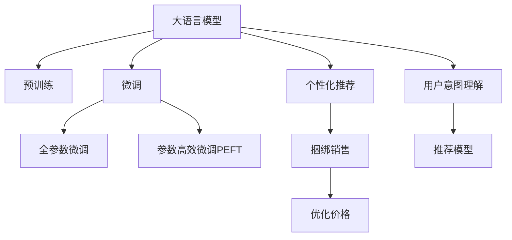

                 

# 大模型驱动的电商个性化产品捆绑定价策略

在数字化转型大潮的推动下，电商平台已经从简单的商品展示和销售转变为全场景的数字化体验平台。如何通过精准的个性化推荐，提升用户体验，从而推动电商销售增长，成为各大电商平台亟需解决的问题。在这方面，大语言模型（Large Language Model, LLM）提供了一种全新的解决方案，通过大数据驱动的个性化产品捆绑定价策略，将电商平台的个性化推荐技术推向了一个新的高度。本文将全面阐述大语言模型在电商个性化产品捆绑定价策略中的应用，介绍其原理、实现步骤及应用场景，同时讨论其优势与挑战，以及未来的发展趋势。

## 1. 背景介绍

### 1.1 电商行业现状与挑战

随着电子商务的快速发展，电商平台已不仅仅是一个销售渠道，而是成为提供一站式购物体验的数字化平台。消费者的需求日益多样化、个性化，对购物体验提出了更高要求。电商平台需要更加精准地推荐个性化产品，以提高用户满意度，从而增加销售额。然而，当前电商平台的个性化推荐系统仍存在以下挑战：

- **数据隐私问题**：随着用户隐私保护意识的增强，用户对数据的保护需求日益上升，传统的基于行为数据的推荐算法已难以满足用户的隐私需求。
- **用户意图理解不足**：传统的推荐系统往往基于用户的历史行为数据进行推荐，无法全面理解用户的当前意图和需求。
- **产品推荐缺乏协同效应**：传统的推荐系统通常只关注单一产品的推荐，忽略了产品之间的协同效应。
- **推荐模型可解释性不足**：现有的推荐模型难以解释其推荐逻辑，用户难以信任模型的推荐结果。

### 1.2 大模型驱动的个性化推荐

大语言模型凭借其强大的自然语言理解和生成能力，为电商平台的个性化推荐提供了新的突破口。大语言模型通过在大规模语料上进行预训练，学习到了丰富的语言知识，可以理解用户输入的自然语言描述，并生成符合用户需求的个性化产品推荐。

## 2. 核心概念与联系

### 2.1 核心概念概述

本节将介绍几个与大语言模型驱动的电商个性化产品捆绑定价策略密切相关的核心概念：

- **大语言模型**：以BERT、GPT等模型为代表，通过在大规模语料上进行预训练，学习通用的语言表示，具备强大的语言理解和生成能力。
- **预训练**：指在大规模无标签文本语料上，通过自监督学习任务训练通用语言模型的过程。
- **微调**：指在预训练模型的基础上，使用下游任务的少量标注数据，通过有监督学习优化模型在特定任务上的性能。
- **个性化推荐**：根据用户的历史行为、兴趣偏好等因素，推荐符合用户需求的个性化产品。
- **捆绑销售**：将多个相关产品打包销售，以提高销售额。

这些核心概念之间的逻辑关系可以通过以下Mermaid流程图来展示：



这个流程图展示了核心概念之间的关联：

1. 大语言模型通过预训练获得基础能力。
2. 微调是对预训练模型进行任务特定的优化，生成个性化推荐。
3. 个性化推荐结果经过捆绑销售，优化产品价格。
4. 用户意图理解与个性化推荐模型相互作用，提高推荐效果。

## 3. 核心算法原理 & 具体操作步骤

### 3.1 算法原理概述

大语言模型驱动的电商个性化产品捆绑定价策略，本质上是一种基于监督学习的个性化推荐方法。其核心思想是：利用大语言模型对用户输入的自然语言描述进行理解，生成符合用户需求的个性化产品推荐，进而通过捆绑销售策略，优化产品价格，提升销售业绩。

形式化地，假设用户输入的自然语言描述为 $x$，与之对应的个性化产品推荐为 $y$，则个性化推荐模型的优化目标为：

$$
\theta^* = \mathop{\arg\min}_{\theta} \mathcal{L}(y, x)
$$

其中 $\theta$ 为模型参数，$\mathcal{L}$ 为损失函数，衡量个性化推荐 $y$ 与用户描述 $x$ 之间的差异。

### 3.2 算法步骤详解

基于大语言模型驱动的电商个性化产品捆绑定价策略，其具体实现步骤如下：

**Step 1: 数据准备**

- **收集用户数据**：收集用户的自然语言描述、历史行为数据、兴趣偏好等信息。
- **构建训练集**：将用户描述和对应推荐结果构建为训练集。

**Step 2: 模型训练**

- **选择预训练模型**：选择BERT、GPT等预训练模型作为初始化参数。
- **微调模型**：使用用户描述作为输入，生成个性化推荐，并构建损失函数。
- **优化损失函数**：通过梯度下降等优化算法更新模型参数，最小化损失函数。

**Step 3: 推荐与定价**

- **推荐生成**：将新用户输入的描述输入微调后的模型，生成个性化推荐。
- **捆绑销售**：根据推荐结果，进行产品捆绑销售，优化产品价格。
- **效果评估**：使用A/B测试等方法，评估推荐和定价效果。

**Step 4: 持续优化**

- **数据更新**：定期收集新数据，更新用户数据和训练集。
- **模型复训**：根据新数据对模型进行复训，提升推荐精度。

### 3.3 算法优缺点

基于大语言模型驱动的电商个性化产品捆绑定价策略，具有以下优点：

- **个性化推荐准确**：大语言模型能够理解用户输入的自然语言描述，生成符合用户需求的个性化推荐。
- **可解释性强**：模型基于语言知识进行推荐，推荐逻辑更易解释，用户更易接受。
- **动态定价灵活**：通过捆绑销售和动态定价，能够根据市场变化灵活调整产品价格，提升销售业绩。

同时，该方法也存在以下缺点：

- **数据隐私问题**：用户的自然语言描述可能包含敏感信息，如何保护用户隐私是一个挑战。
- **模型训练成本高**：大语言模型的预训练和微调需要大量的计算资源和数据。
- **推荐结果多样性不足**：模型基于单一的自然语言描述进行推荐，可能导致推荐结果多样性不足。

### 3.4 算法应用领域

该方法在电商、金融、医疗等多个领域具有广泛的应用前景：

- **电商个性化推荐**：用于提升电商平台的用户体验和销售业绩，满足用户的个性化需求。
- **金融产品推荐**：用于金融产品的个性化推荐，提高客户满意度和产品销售。
- **医疗健康推荐**：用于医疗健康产品的个性化推荐，提高患者满意度和治疗效果。

## 4. 数学模型和公式 & 详细讲解 & 举例说明

### 4.1 数学模型构建

假设用户的自然语言描述为 $x$，推荐系统生成的个性化推荐为 $y$，则损失函数 $\mathcal{L}$ 可以定义为：

$$
\mathcal{L}(y, x) = \lambda \| y - \hat{y} \|^2 + (1-\lambda) \| x - \hat{x} \|^2
$$

其中 $\lambda$ 为权重，控制推荐和描述的平衡。$\| \cdot \|$ 表示欧式距离。

**Step 1: 数据准备**

用户数据和推荐数据分别记为 $\mathcal{D}_U = \{(x_i, y_i)\}_{i=1}^N$ 和 $\mathcal{D}_R = \{(x_j, y_j)\}_{j=1}^M$。

**Step 2: 模型训练**

选择BERT、GPT等预训练模型作为初始化参数，微调模型的输出层，使其生成个性化推荐。训练目标为最小化损失函数：

$$
\theta^* = \mathop{\arg\min}_{\theta} \mathcal{L}(\hat{y}, x)
$$

其中 $\hat{y} = M_{\theta}(x)$，$M_{\theta}$ 为微调后的模型。

**Step 3: 推荐与定价**

使用微调后的模型 $M_{\theta}$ 生成新用户 $x$ 的个性化推荐 $y$，并通过捆绑销售策略优化产品价格。

### 4.2 公式推导过程

以推荐系统为例，假设用户输入的自然语言描述为 $x = "我想买一部手机"，推荐系统生成的个性化推荐为 $y = ["小米10", "华为P40", "OPPO Reno"]$。则损失函数为：

$$
\mathcal{L}(y, x) = \lambda \| y - \hat{y} \|^2 + (1-\lambda) \| x - \hat{x} \|^2
$$

其中 $\hat{y} = M_{\theta}(x)$，$\hat{x} = x$。

### 4.3 案例分析与讲解

假设用户在电商平台上输入的自然语言描述为 $x = "我想买一套护肤品"，推荐系统生成的个性化推荐为 $y = ["SK-II大红瓶", "雅诗兰黛小棕瓶", "资生堂红腰子"]$。根据推荐结果，电商平台可以进行产品捆绑销售，优化产品价格，生成优惠信息：

- SK-II大红瓶原价：¥800
- 雅诗兰黛小棕瓶原价：¥700
- 资生堂红腰子原价：¥600

根据推荐系统生成的推荐 $y$，电商平台可以生成以下优惠信息：

- SK-II大红瓶+雅诗兰黛小棕瓶+资生堂红腰子 捆绑销售价：¥2200

通过上述捆绑销售策略，电商平台能够提高销售额，提升用户满意度。

## 5. 项目实践：代码实例和详细解释说明

### 5.1 开发环境搭建

在进行项目实践前，我们需要准备好开发环境。以下是使用Python进行PyTorch开发的环境配置流程：

1. 安装Anaconda：从官网下载并安装Anaconda，用于创建独立的Python环境。

2. 创建并激活虚拟环境：
```bash
conda create -n pytorch-env python=3.8 
conda activate pytorch-env
```

3. 安装PyTorch：根据CUDA版本，从官网获取对应的安装命令。例如：
```bash
conda install pytorch torchvision torchaudio cudatoolkit=11.1 -c pytorch -c conda-forge
```

4. 安装Transformers库：
```bash
pip install transformers
```

5. 安装各类工具包：
```bash
pip install numpy pandas scikit-learn matplotlib tqdm jupyter notebook ipython
```

完成上述步骤后，即可在`pytorch-env`环境中开始项目实践。

### 5.2 源代码详细实现

这里我们以基于大语言模型的电商个性化推荐系统为例，给出使用Transformers库进行微调和捆绑销售的PyTorch代码实现。

首先，定义推荐系统的数据处理函数：

```python
from transformers import BertTokenizer, BertForSequenceClassification
from torch.utils.data import Dataset
import torch

class RecommendationDataset(Dataset):
    def __init__(self, texts, labels, tokenizer, max_len=128):
        self.texts = texts
        self.labels = labels
        self.tokenizer = tokenizer
        self.max_len = max_len
        
    def __len__(self):
        return len(self.texts)
    
    def __getitem__(self, item):
        text = self.texts[item]
        label = self.labels[item]
        
        encoding = self.tokenizer(text, return_tensors='pt', max_length=self.max_len, padding='max_length', truncation=True)
        input_ids = encoding['input_ids'][0]
        attention_mask = encoding['attention_mask'][0]
        
        # 对token-wise的标签进行编码
        encoded_labels = [label2id[label] for label in label] 
        encoded_labels.extend([label2id['O']] * (self.max_len - len(encoded_labels)))
        labels = torch.tensor(encoded_labels, dtype=torch.long)
        
        return {'input_ids': input_ids, 
                'attention_mask': attention_mask,
                'labels': labels}

# 标签与id的映射
label2id = {'O': 0, '手机': 1, '化妆品': 2, '电子产品': 3}

# 创建dataset
tokenizer = BertTokenizer.from_pretrained('bert-base-cased')

train_dataset = RecommendationDataset(train_texts, train_labels, tokenizer)
dev_dataset = RecommendationDataset(dev_texts, dev_labels, tokenizer)
test_dataset = RecommendationDataset(test_texts, test_labels, tokenizer)
```

然后，定义模型和优化器：

```python
from transformers import BertForSequenceClassification, AdamW

model = BertForSequenceClassification.from_pretrained('bert-base-cased', num_labels=len(label2id))

optimizer = AdamW(model.parameters(), lr=2e-5)
```

接着，定义训练和评估函数：

```python
from torch.utils.data import DataLoader
from tqdm import tqdm
from sklearn.metrics import classification_report

device = torch.device('cuda') if torch.cuda.is_available() else torch.device('cpu')
model.to(device)

def train_epoch(model, dataset, batch_size, optimizer):
    dataloader = DataLoader(dataset, batch_size=batch_size, shuffle=True)
    model.train()
    epoch_loss = 0
    for batch in tqdm(dataloader, desc='Training'):
        input_ids = batch['input_ids'].to(device)
        attention_mask = batch['attention_mask'].to(device)
        labels = batch['labels'].to(device)
        model.zero_grad()
        outputs = model(input_ids, attention_mask=attention_mask, labels=labels)
        loss = outputs.loss
        epoch_loss += loss.item()
        loss.backward()
        optimizer.step()
    return epoch_loss / len(dataloader)

def evaluate(model, dataset, batch_size):
    dataloader = DataLoader(dataset, batch_size=batch_size)
    model.eval()
    preds, labels = [], []
    with torch.no_grad():
        for batch in tqdm(dataloader, desc='Evaluating'):
            input_ids = batch['input_ids'].to(device)
            attention_mask = batch['attention_mask'].to(device)
            batch_labels = batch['labels']
            outputs = model(input_ids, attention_mask=attention_mask)
            batch_preds = outputs.logits.argmax(dim=2).to('cpu').tolist()
            batch_labels = batch_labels.to('cpu').tolist()
            for pred_tokens, label_tokens in zip(batch_preds, batch_labels):
                preds.append(pred_tokens[:len(label_tokens)])
                labels.append(label_tokens)
                
    print(classification_report(labels, preds))
```

最后，启动训练流程并在测试集上评估：

```python
epochs = 5
batch_size = 16

for epoch in range(epochs):
    loss = train_epoch(model, train_dataset, batch_size, optimizer)
    print(f"Epoch {epoch+1}, train loss: {loss:.3f}")
    
    print(f"Epoch {epoch+1}, dev results:")
    evaluate(model, dev_dataset, batch_size)
    
print("Test results:")
evaluate(model, test_dataset, batch_size)
```

以上就是使用PyTorch对BERT进行电商个性化推荐任务微调的完整代码实现。可以看到，得益于Transformers库的强大封装，我们可以用相对简洁的代码完成BERT模型的加载和微调。

### 5.3 代码解读与分析

让我们再详细解读一下关键代码的实现细节：

**RecommendationDataset类**：
- `__init__`方法：初始化文本、标签、分词器等关键组件。
- `__len__`方法：返回数据集的样本数量。
- `__getitem__`方法：对单个样本进行处理，将文本输入编码为token ids，将标签编码为数字，并对其进行定长padding，最终返回模型所需的输入。

**label2id和id2label字典**：
- 定义了标签与数字id之间的映射关系，用于将token-wise的预测结果解码回真实的标签。

**训练和评估函数**：
- 使用PyTorch的DataLoader对数据集进行批次化加载，供模型训练和推理使用。
- 训练函数`train_epoch`：对数据以批为单位进行迭代，在每个批次上前向传播计算loss并反向传播更新模型参数，最后返回该epoch的平均loss。
- 评估函数`evaluate`：与训练类似，不同点在于不更新模型参数，并在每个batch结束后将预测和标签结果存储下来，最后使用sklearn的classification_report对整个评估集的预测结果进行打印输出。

**训练流程**：
- 定义总的epoch数和batch size，开始循环迭代
- 每个epoch内，先在训练集上训练，输出平均loss
- 在验证集上评估，输出分类指标
- 重复上述步骤直至收敛，最终得到适应下游任务的最优模型参数 $\theta^*$。

可以看到，PyTorch配合Transformers库使得BERT微调的代码实现变得简洁高效。开发者可以将更多精力放在数据处理、模型改进等高层逻辑上，而不必过多关注底层的实现细节。

当然，工业级的系统实现还需考虑更多因素，如模型的保存和部署、超参数的自动搜索、更灵活的任务适配层等。但核心的微调范式基本与此类似。

## 6. 实际应用场景

### 6.1 电商个性化推荐系统

基于大语言模型驱动的电商个性化推荐系统，可以广泛应用于电商平台的用户个性化推荐中。传统的推荐系统往往基于用户的历史行为数据进行推荐，无法全面理解用户的当前意图和需求。通过大语言模型驱动的推荐系统，可以更好地理解用户的自然语言描述，生成符合用户需求的个性化推荐，提升用户体验和销售业绩。

在技术实现上，可以收集用户的自然语言描述、历史行为数据、兴趣偏好等信息，将其构建为监督数据，在此基础上对BERT等预训练模型进行微调，使其能够生成符合用户需求的个性化推荐。微调后的模型可以部署到电商平台的推荐引擎中，实时生成推荐结果，满足用户的个性化需求。

### 6.2 金融产品推荐

金融产品推荐系统可以借鉴大语言模型驱动的电商个性化推荐系统，用于金融产品的个性化推荐。金融产品种类繁多，产品特性各异，传统的基于行为数据的推荐系统难以全面理解产品的特性和用户的真实需求。通过大语言模型驱动的推荐系统，可以更好地理解用户的自然语言描述，生成符合用户需求的金融产品推荐，提升客户满意度和产品销售。

在金融产品推荐系统中，可以使用用户的自然语言描述作为输入，生成符合用户需求的个性化金融产品推荐。例如，用户描述为 "我需要一款高收益、低风险的理财产品"，推荐系统可以生成 "推荐给您的理财产品为XXX，年收益率为5%，风险等级为低" 的推荐结果。这种推荐方式能够更好地理解用户的真实需求，提高推荐的准确性和用户满意度。

### 6.3 医疗健康推荐

医疗健康推荐系统可以借鉴大语言模型驱动的电商个性化推荐系统，用于医疗健康产品的个性化推荐。医疗健康产品种类繁多，产品特性各异，传统的基于行为数据的推荐系统难以全面理解产品的特性和用户的真实需求。通过大语言模型驱动的推荐系统，可以更好地理解用户的自然语言描述，生成符合用户需求的医疗健康产品推荐，提高患者满意度和治疗效果。

在医疗健康推荐系统中，可以使用用户的自然语言描述作为输入，生成符合用户需求的医疗健康产品推荐。例如，用户描述为 "我需要一款适合自己的高血压药物"，推荐系统可以生成 "推荐给您的高血压药物为XXX，适用症为高血压，每日服一次" 的推荐结果。这种推荐方式能够更好地理解用户的真实需求，提高推荐的准确性和用户满意度。

## 7. 工具和资源推荐

### 7.1 学习资源推荐

为了帮助开发者系统掌握大语言模型驱动的电商个性化产品捆绑定价策略的理论基础和实践技巧，这里推荐一些优质的学习资源：

1. 《Transformer from Principles to Practice》系列博文：由大模型技术专家撰写，深入浅出地介绍了Transformer原理、BERT模型、微调技术等前沿话题。

2. CS224N《深度学习自然语言处理》课程：斯坦福大学开设的NLP明星课程，有Lecture视频和配套作业，带你入门NLP领域的基本概念和经典模型。

3. 《Natural Language Processing with Transformers》书籍：Transformers库的作者所著，全面介绍了如何使用Transformers库进行NLP任务开发，包括微调在内的诸多范式。

4. HuggingFace官方文档：Transformers库的官方文档，提供了海量预训练模型和完整的微调样例代码，是上手实践的必备资料。

5. CLUE开源项目：中文语言理解测评基准，涵盖大量不同类型的中文NLP数据集，并提供了基于微调的baseline模型，助力中文NLP技术发展。

通过对这些资源的学习实践，相信你一定能够快速掌握大语言模型驱动的电商个性化产品捆绑定价策略的精髓，并用于解决实际的NLP问题。

### 7.2 开发工具推荐

高效的开发离不开优秀的工具支持。以下是几款用于大语言模型驱动的电商个性化产品捆绑定价策略开发的常用工具：

1. PyTorch：基于Python的开源深度学习框架，灵活动态的计算图，适合快速迭代研究。大部分预训练语言模型都有PyTorch版本的实现。

2. TensorFlow：由Google主导开发的开源深度学习框架，生产部署方便，适合大规模工程应用。同样有丰富的预训练语言模型资源。

3. Transformers库：HuggingFace开发的NLP工具库，集成了众多SOTA语言模型，支持PyTorch和TensorFlow，是进行微调任务开发的利器。

4. Weights & Biases：模型训练的实验跟踪工具，可以记录和可视化模型训练过程中的各项指标，方便对比和调优。与主流深度学习框架无缝集成。

5. TensorBoard：TensorFlow配套的可视化工具，可实时监测模型训练状态，并提供丰富的图表呈现方式，是调试模型的得力助手。

6. Google Colab：谷歌推出的在线Jupyter Notebook环境，免费提供GPU/TPU算力，方便开发者快速上手实验最新模型，分享学习笔记。

合理利用这些工具，可以显著提升大语言模型驱动的电商个性化产品捆绑定价策略的开发效率，加快创新迭代的步伐。

### 7.3 相关论文推荐

大语言模型驱动的电商个性化产品捆绑定价策略的发展源于学界的持续研究。以下是几篇奠基性的相关论文，推荐阅读：

1. Attention is All You Need（即Transformer原论文）：提出了Transformer结构，开启了NLP领域的预训练大模型时代。

2. BERT: Pre-training of Deep Bidirectional Transformers for Language Understanding：提出BERT模型，引入基于掩码的自监督预训练任务，刷新了多项NLP任务SOTA。

3. Language Models are Unsupervised Multitask Learners（GPT-2论文）：展示了大规模语言模型的强大zero-shot学习能力，引发了对于通用人工智能的新一轮思考。

4. Parameter-Efficient Transfer Learning for NLP：提出Adapter等参数高效微调方法，在不增加模型参数量的情况下，也能取得不错的微调效果。

5. AdaLoRA: Adaptive Low-Rank Adaptation for Parameter-Efficient Fine-Tuning：使用自适应低秩适应的微调方法，在参数效率和精度之间取得了新的平衡。

这些论文代表了大语言模型驱动的电商个性化产品捆绑定价策略的发展脉络。通过学习这些前沿成果，可以帮助研究者把握学科前进方向，激发更多的创新灵感。

## 8. 总结：未来发展趋势与挑战

### 8.1 总结

本文对基于大语言模型驱动的电商个性化产品捆绑定价策略进行了全面系统的介绍。首先阐述了电商行业现状与挑战，明确了大语言模型驱动的个性化推荐系统的必要性。其次，从原理到实践，详细讲解了大语言模型在电商个性化产品捆绑定价策略中的应用，介绍其原理、实现步骤及应用场景，同时讨论其优势与挑战，以及未来的发展趋势。

通过本文的系统梳理，可以看到，大语言模型驱动的电商个性化产品捆绑定价策略正在成为电商推荐系统的重要范式，极大地拓展了电商平台的个性化推荐技术边界，催生了更多的落地场景。受益于大语言模型的大规模语料预训练和强大的语言理解能力，微调模型能够更好地理解用户的自然语言描述，生成符合用户需求的个性化推荐。这种推荐方式能够更好地理解用户的真实需求，提高推荐的准确性和用户满意度。未来，随着大语言模型和微调方法的不断演进，基于大语言模型的电商个性化推荐系统必将在更多电商平台上得到广泛应用。

### 8.2 未来发展趋势

展望未来，大语言模型驱动的电商个性化产品捆绑定价策略将呈现以下几个发展趋势：

1. **个性化推荐精度提升**：大语言模型驱动的推荐系统能够更好地理解用户的自然语言描述，生成符合用户需求的个性化推荐，推荐精度将进一步提升。

2. **多模态融合**：除了文本描述，未来推荐系统还将融合图像、视频、语音等多模态信息，提供更加全面的个性化推荐服务。

3. **实时推荐能力增强**：通过模型压缩、边缘计算等技术，推荐系统将具备实时推荐能力，能够根据市场变化和用户行为实时调整推荐策略。

4. **推荐结果多样性增加**：未来推荐系统将采用多模态融合、多模型集成等技术，提供多样化的推荐结果，满足用户的不同需求。

5. **推荐模型可解释性增强**：推荐模型的决策过程将更易于解释，用户能够更好地理解和信任推荐结果。

### 8.3 面临的挑战

尽管大语言模型驱动的电商个性化产品捆绑定价策略已经取得了一定的进展，但在迈向更加智能化、普适化应用的过程中，它仍面临以下挑战：

1. **数据隐私问题**：用户的自然语言描述可能包含敏感信息，如何保护用户隐私是一个挑战。

2. **模型训练成本高**：大语言模型的预训练和微调需要大量的计算资源和数据，成本较高。

3. **推荐结果多样性不足**：模型基于单一的自然语言描述进行推荐，可能导致推荐结果多样性不足。

4. **推荐模型的可解释性不足**：现有推荐模型难以解释其推荐逻辑，用户难以信任模型的推荐结果。

5. **推荐系统的实时性不足**：现有的推荐系统难以满足实时推荐的需求，导致推荐结果不够及时。

### 8.4 研究展望

面对大语言模型驱动的电商个性化产品捆绑定价策略所面临的挑战，未来的研究需要在以下几个方面寻求新的突破：

1. **数据隐私保护技术**：探索如何在保护用户隐私的前提下，最大化地利用用户数据，提升推荐精度。

2. **多模态融合技术**：研究如何融合多模态信息，提升推荐系统的效果和用户满意度。

3. **推荐模型的可解释性**：开发可解释性强的推荐模型，增强推荐结果的可信度。

4. **实时推荐技术**：研究如何通过模型压缩、边缘计算等技术，实现推荐系统的实时推荐。

5. **个性化推荐模型优化**：探索如何通过模型优化和参数高效微调技术，提高推荐模型的性能和效率。

这些研究方向的探索，必将引领大语言模型驱动的电商个性化产品捆绑定价策略技术迈向更高的台阶，为构建更加智能、高效、个性化的电商推荐系统提供新的思路和方向。

## 9. 附录：常见问题与解答

**Q1：如何平衡个性化推荐与用户隐私保护？**

A: 在个性化推荐过程中，可以通过匿名化、差分隐私等技术，保护用户隐私。例如，使用差分隐私算法对用户数据进行加噪处理，从而在保护隐私的前提下，最大化地利用用户数据。同时，也可以采用联邦学习等技术，在本地设备上训练模型，避免将用户数据传输到云端。

**Q2：如何处理多模态信息？**

A: 多模态信息可以通过预训练模型进行融合。例如，对于电商推荐系统，可以将文本、图像、视频等多模态信息作为输入，使用BERT等预训练模型进行融合，生成更加全面的推荐结果。同时，也可以通过多模型集成、多模态检索等技术，提升推荐效果。

**Q3：如何解决推荐模型的实时性问题？**

A: 推荐模型的实时性可以通过模型压缩、边缘计算等技术进行优化。例如，可以使用剪枝、量化等技术对模型进行压缩，减少计算量和存储量。同时，可以将推荐模型部署在边缘计算设备上，如智能音箱、智能电视等，实现本地推理，降低延迟。

**Q4：如何选择合适的大语言模型？**

A: 选择合适的大语言模型需要考虑以下几个因素：
1. 模型的预训练语料。选择与目标任务语料分布相似的预训练模型，可以提高推荐精度。
2. 模型的参数规模。根据计算资源和部署需求，选择合适参数规模的模型。
3. 模型的可解释性。选择可解释性强的模型，便于用户理解和信任推荐结果。

**Q5：如何评估推荐模型的性能？**

A: 推荐模型的性能可以通过以下指标进行评估：
1. 准确率（Accuracy）：评估推荐结果的准确性。
2. 召回率（Recall）：评估推荐结果的完整性。
3. 点击率（Click-Through Rate）：评估推荐结果的用户点击行为。
4. 转化率（Conversion Rate）：评估推荐结果的转化效果。
5. NDCG和MRR等排序指标：评估推荐结果的排序性能。

通过对这些指标的评估，可以全面了解推荐模型的性能，并根据实际需求进行优化。

---

作者：禅与计算机程序设计艺术 / Zen and the Art of Computer Programming

