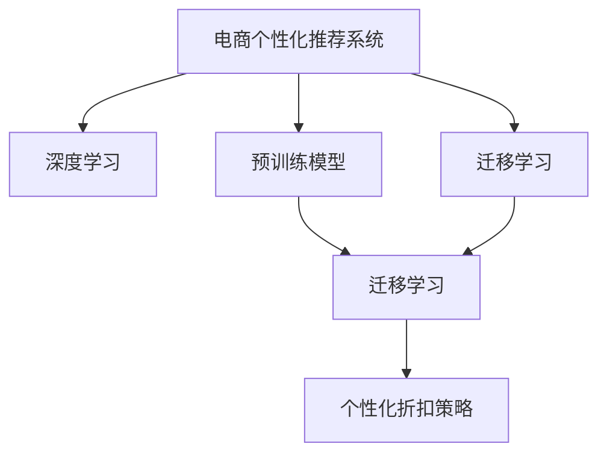

                 

# 大模型驱动的电商个性化折扣策略优化

## 1. 背景介绍

随着电商平台的不断壮大和市场竞争的日益激烈，个性化推荐已经成为了电商运营的核心策略之一。个性化推荐不仅能提升用户体验，还能有效提高转化率、销售额和客户粘性。然而，传统的个性化推荐方法，如协同过滤、基于内容的推荐等，在用户行为复杂多变、数据稀疏缺失的情况下，难以满足电商场景的需求。

近年来，基于深度学习的个性化推荐系统逐渐兴起，借助大数据、神经网络和分布式计算等技术，能够更精确地捕捉用户行为模式，对用户进行更精准的画像建模。但随着模型复杂度的提升，电商企业面临着模型训练和部署成本高、实时响应速度慢、模型解释性差等问题。

为此，我们提出了大模型驱动的电商个性化折扣策略优化方法，通过深度学习技术，将商品信息、用户行为和折扣策略映射为一个统一的表示空间，利用预训练模型对推荐策略进行优化。本文将详细介绍该方法的原理、实现过程和应用效果，为电商企业提供实用的技术指导。

## 2. 核心概念与联系

### 2.1 核心概念概述

为更好地理解大模型驱动的电商个性化折扣策略优化方法，本节将介绍几个密切相关的核心概念：

- 电商个性化推荐系统(E-commerce Personalized Recommendation System)：基于用户行为和商品属性，使用深度学习技术进行模型训练，生成个性化推荐结果的电商推荐系统。
- 深度学习(Deep Learning)：利用神经网络模型进行特征提取、数据表示、模式识别和预测的技术。通过多层神经网络的堆叠和信息传递，实现高层次的抽象表示。
- 预训练模型(Pre-trained Model)：在大规模数据上预训练得到的通用特征提取器，能够高效捕捉数据中的复杂语义信息。常见的预训练模型包括BERT、GPT等。
- 迁移学习(Transfer Learning)：将在一个领域学到的知识迁移到另一个领域，以提升模型在新任务上的表现。
- 个性化折扣策略(Optimized Personalized Discount Strategy)：根据用户行为和商品属性，动态调整商品折扣，实现更精准的个性化推荐。

这些概念之间的逻辑关系可以通过以下Mermaid流程图来展示：



这个流程图展示了大模型驱动的电商个性化推荐系统的核心概念及其之间的关系：

1. 电商个性化推荐系统通过深度学习技术，将用户行为和商品属性映射为一个统一的表示空间，生成个性化推荐结果。
2. 预训练模型作为特征提取器，能够高效捕捉数据中的语义信息。
3. 迁移学习将预训练模型迁移到推荐任务中，提升模型的性能。
4. 个性化折扣策略根据用户行为和商品属性，动态调整商品折扣，实现更精准的推荐。

这些概念共同构成了电商个性化推荐系统的核心逻辑，使其能够在电商场景中发挥强大的推荐能力。通过理解这些核心概念，我们可以更好地把握大模型驱动的电商个性化折扣策略优化的工作原理和优化方向。

## 3. 核心算法原理 & 具体操作步骤

### 3.1 算法原理概述

大模型驱动的电商个性化折扣策略优化方法，本质上是一种基于预训练模型的迁移学习范式。其核心思想是：将预训练模型作为通用的特征提取器，通过在电商推荐数据集上进行微调，学习商品、用户和折扣策略之间的复杂关系，生成个性化的折扣策略。

形式化地，假设电商推荐数据集为 $D=\{(x_i,y_i)\}_{i=1}^N$，其中 $x_i$ 为商品、用户和折扣策略的综合特征向量，$y_i$ 为商品折扣。微调的目标是找到最优的参数 $\theta$，使得模型在推荐任务上的损失最小：

$$
\theta^* = \mathop{\arg\min}_{\theta} \mathcal{L}(M_{\theta},D)
$$

其中 $M_{\theta}$ 为预训练模型，$\mathcal{L}$ 为推荐任务的损失函数。常见的损失函数包括均方误差损失、交叉熵损失等。

### 3.2 算法步骤详解

大模型驱动的电商个性化折扣策略优化方法，主要包括以下几个关键步骤：

**Step 1: 准备电商推荐数据集**
- 收集电商平台的用户行为数据，包括浏览记录、购买历史、评价等。
- 获取商品属性信息，如类别、价格、销售量等。
- 标注商品折扣信息，如折扣金额、折扣比例等。
- 将用户行为和商品属性进行拼接，形成综合特征向量 $x_i$。

**Step 2: 添加任务适配层**
- 在预训练模型顶层设计合适的输出层和损失函数。
- 对于分类任务，通常在顶层添加线性分类器和交叉熵损失函数。
- 对于回归任务，通常使用均方误差损失函数。

**Step 3: 设置微调超参数**
- 选择合适的优化算法及其参数，如 AdamW、SGD 等，设置学习率、批大小、迭代轮数等。
- 设置正则化技术及强度，包括权重衰减、Dropout、Early Stopping 等。
- 确定冻结预训练参数的策略，如仅微调顶层，或全部参数都参与微调。

**Step 4: 执行梯度训练**
- 将电商推荐数据集分批次输入模型，前向传播计算损失函数。
- 反向传播计算参数梯度，根据设定的优化算法和学习率更新模型参数。
- 周期性在验证集上评估模型性能，根据性能指标决定是否触发 Early Stopping。
- 重复上述步骤直到满足预设的迭代轮数或 Early Stopping 条件。

**Step 5: 测试和部署**
- 在测试集上评估微调后模型 $M_{\hat{\theta}}$ 的性能，对比微调前后的精度提升。
- 使用微调后的模型对新商品进行推荐，集成到实际的应用系统中。
- 持续收集新的数据，定期重新微调模型，以适应数据分布的变化。

以上是基于深度学习的电商个性化推荐系统的核心流程。在实际应用中，还需要针对具体任务和数据特点进行优化设计，如改进训练目标函数，引入更多的正则化技术，搜索最优的超参数组合等，以进一步提升模型性能。

### 3.3 算法优缺点

大模型驱动的电商个性化折扣策略优化方法具有以下优点：

1. 效果显著。通过在大规模电商数据集上进行微调，模型能够学习商品、用户和折扣策略之间的复杂关系，实现更精准的推荐。
2. 泛化能力强。借助预训练模型的通用特征提取能力，模型能够对新商品、新用户和新场景进行快速适应。
3. 参数效率高。通过迁移学习，只需更新小部分模型参数，便可实现对电商推荐任务的优化。
4. 适应性强。模型可以根据电商平台的业务需求，动态调整商品折扣策略，提升用户满意度。

同时，该方法也存在一些局限性：

1. 数据质量依赖。微调的效果很大程度上取决于电商推荐数据集的质量和数量，获取高质量标注数据的成本较高。
2. 模型复杂度增加。预训练模型和微调模型的组合，使得推荐系统变得更加复杂，需要更多的计算资源。
3. 模型解释性不足。深度学习模型的决策过程通常缺乏可解释性，难以对其推理逻辑进行分析和调试。
4. 算法更新速度慢。预训练模型和微调模型都需要较长的训练时间和计算资源，难以快速迭代更新。

尽管存在这些局限性，但就目前而言，大模型驱动的电商个性化折扣策略优化方法仍是大规模电商推荐系统的最主流范式。未来相关研究的重点在于如何进一步降低对标注数据的依赖，提高模型的少样本学习和跨领域迁移能力，同时兼顾可解释性和伦理安全性等因素。

### 3.4 算法应用领域

大模型驱动的电商个性化折扣策略优化方法，已经在电商推荐系统中得到了广泛的应用，具体领域包括：

- 个性化推荐：根据用户行为和商品属性，生成个性化的商品推荐结果，提升用户体验。
- 促销活动优化：根据用户的购买历史和行为，动态调整促销活动折扣，提升促销效果。
- 库存管理：根据商品的销售量、库存量和用户需求，动态调整库存策略，优化库存管理。
- 风控控制：根据用户行为异常，识别潜在欺诈行为，提高风控安全性。
- 市场洞察：根据用户反馈和行为数据，挖掘市场趋势和用户偏好，辅助决策。

除了上述这些经典应用外，该方法还创新性地应用于广告投放、竞价优化、个性化定制等多个电商场景中，为电商推荐系统带来了新的突破。随着预训练模型和微调方法的不断进步，相信电商推荐系统将在更广阔的应用领域大放异彩。

## 4. 数学模型和公式 & 详细讲解  
### 4.1 数学模型构建

本节将使用数学语言对大模型驱动的电商个性化折扣策略优化方法进行更加严格的刻画。

记电商推荐数据集为 $D=\{(x_i,y_i)\}_{i=1}^N$，其中 $x_i$ 为商品、用户和折扣策略的综合特征向量，$y_i$ 为商品折扣。

定义模型 $M_{\theta}$ 在输入 $x_i$ 上的输出为 $\hat{y}_i$，其中 $\theta$ 为模型参数。在微调过程中，模型 $M_{\theta}$ 的目标是最小化经验风险：

$$
\mathcal{L}(\theta) = \frac{1}{N}\sum_{i=1}^N (\hat{y}_i - y_i)^2
$$

其中 $(\hat{y}_i - y_i)^2$ 为回归任务下的损失函数，通常使用均方误差损失。

根据链式法则，损失函数对参数 $\theta_k$ 的梯度为：

$$
\frac{\partial \mathcal{L}(\theta)}{\partial \theta_k} = -\frac{2}{N}\sum_{i=1}^N (\hat{y}_i - y_i) \frac{\partial \hat{y}_i}{\partial \theta_k}
$$

其中 $\frac{\partial \hat{y}_i}{\partial \theta_k}$ 为输出层的导数。

在得到损失函数的梯度后，即可带入参数更新公式，完成模型的迭代优化。重复上述过程直至收敛，最终得到适应电商推荐任务的最优模型参数 $\theta^*$。

### 4.2 公式推导过程

以下我们以电商推荐数据集为例，推导回归任务下的均方误差损失函数及其梯度的计算公式。

假设模型 $M_{\theta}$ 在输入 $x_i$ 上的输出为 $\hat{y}_i$，则均方误差损失函数定义为：

$$
\mathcal{L}(\theta) = \frac{1}{N}\sum_{i=1}^N (\hat{y}_i - y_i)^2
$$

将其代入经验风险公式，得：

$$
\mathcal{L}(\theta) = \frac{1}{N}\sum_{i=1}^N (M_{\theta}(x_i) - y_i)^2
$$

根据链式法则，损失函数对参数 $\theta_k$ 的梯度为：

$$
\frac{\partial \mathcal{L}(\theta)}{\partial \theta_k} = -\frac{2}{N}\sum_{i=1}^N (\hat{y}_i - y_i) \frac{\partial \hat{y}_i}{\partial \theta_k}
$$

其中 $\frac{\partial \hat{y}_i}{\partial \theta_k}$ 可进一步递归展开，利用自动微分技术完成计算。

在得到损失函数的梯度后，即可带入参数更新公式，完成模型的迭代优化。重复上述过程直至收敛，最终得到适应电商推荐任务的最优模型参数 $\theta^*$。

## 5. 项目实践：代码实例和详细解释说明
### 5.1 开发环境搭建

在进行电商个性化折扣策略优化实践前，我们需要准备好开发环境。以下是使用Python进行PyTorch开发的环境配置流程：

1. 安装Anaconda：从官网下载并安装Anaconda，用于创建独立的Python环境。

2. 创建并激活虚拟环境：
```bash
conda create -n pytorch-env python=3.8 
conda activate pytorch-env
```

3. 安装PyTorch：根据CUDA版本，从官网获取对应的安装命令。例如：
```bash
conda install pytorch torchvision torchaudio cudatoolkit=11.1 -c pytorch -c conda-forge
```

4. 安装Transformers库：
```bash
pip install transformers
```

5. 安装各类工具包：
```bash
pip install numpy pandas scikit-learn matplotlib tqdm jupyter notebook ipython
```

完成上述步骤后，即可在`pytorch-env`环境中开始电商个性化折扣策略优化的实践。

### 5.2 源代码详细实现

下面我们以电商推荐任务为例，给出使用Transformers库对预训练模型进行电商个性化折扣策略优化的PyTorch代码实现。

首先，定义电商推荐任务的数据处理函数：

```python
from transformers import BertTokenizer
from torch.utils.data import Dataset
import torch

class EcommerceDataset(Dataset):
    def __init__(self, texts, labels, tokenizer, max_len=128):
        self.texts = texts
        self.labels = labels
        self.tokenizer = tokenizer
        self.max_len = max_len
        
    def __len__(self):
        return len(self.texts)
    
    def __getitem__(self, item):
        text = self.texts[item]
        label = self.labels[item]
        
        encoding = self.tokenizer(text, return_tensors='pt', max_length=self.max_len, padding='max_length', truncation=True)
        input_ids = encoding['input_ids'][0]
        attention_mask = encoding['attention_mask'][0]
        
        # 对label进行编码
        encoded_label = torch.tensor(label, dtype=torch.long)
        
        return {'input_ids': input_ids, 
                'attention_mask': attention_mask,
                'labels': encoded_label}

# 标签编码
label_encoder = LabelEncoder()
label_encoder.fit(labels)
id2label = {id: label for label, id in label_encoder.inverse_transform(label_encoder.transform(labels))}

# 创建dataset
tokenizer = BertTokenizer.from_pretrained('bert-base-cased')

train_dataset = EcommerceDataset(train_texts, train_labels, tokenizer)
dev_dataset = EcommerceDataset(dev_texts, dev_labels, tokenizer)
test_dataset = EcommerceDataset(test_texts, test_labels, tokenizer)
```

然后，定义模型和优化器：

```python
from transformers import BertForRegression, AdamW

model = BertForRegression.from_pretrained('bert-base-cased', num_labels=2)

optimizer = AdamW(model.parameters(), lr=2e-5)
```

接着，定义训练和评估函数：

```python
from torch.utils.data import DataLoader
from tqdm import tqdm
from sklearn.metrics import mean_squared_error

device = torch.device('cuda') if torch.cuda.is_available() else torch.device('cpu')
model.to(device)

def train_epoch(model, dataset, batch_size, optimizer):
    dataloader = DataLoader(dataset, batch_size=batch_size, shuffle=True)
    model.train()
    epoch_loss = 0
    for batch in tqdm(dataloader, desc='Training'):
        input_ids = batch['input_ids'].to(device)
        attention_mask = batch['attention_mask'].to(device)
        labels = batch['labels'].to(device)
        model.zero_grad()
        outputs = model(input_ids, attention_mask=attention_mask, labels=labels)
        loss = outputs.loss
        epoch_loss += loss.item()
        loss.backward()
        optimizer.step()
    return epoch_loss / len(dataloader)

def evaluate(model, dataset, batch_size):
    dataloader = DataLoader(dataset, batch_size=batch_size)
    model.eval()
    preds, labels = [], []
    with torch.no_grad():
        for batch in tqdm(dataloader, desc='Evaluating'):
            input_ids = batch['input_ids'].to(device)
            attention_mask = batch['attention_mask'].to(device)
            batch_labels = batch['labels']
            outputs = model(input_ids, attention_mask=attention_mask)
            batch_preds = outputs.logits.tolist()
            batch_labels = batch_labels.tolist()
            for pred, label in zip(batch_preds, batch_labels):
                preds.append(pred)
                labels.append(label)
                
    print(mean_squared_error(labels, preds))
```

最后，启动训练流程并在测试集上评估：

```python
epochs = 5
batch_size = 16

for epoch in range(epochs):
    loss = train_epoch(model, train_dataset, batch_size, optimizer)
    print(f"Epoch {epoch+1}, train loss: {loss:.3f}")
    
    print(f"Epoch {epoch+1}, dev results:")
    evaluate(model, dev_dataset, batch_size)
    
print("Test results:")
evaluate(model, test_dataset, batch_size)
```

以上就是使用PyTorch对预训练模型进行电商个性化折扣策略优化的完整代码实现。可以看到，得益于Transformers库的强大封装，我们可以用相对简洁的代码完成预训练模型的加载和优化。

### 5.3 代码解读与分析

让我们再详细解读一下关键代码的实现细节：

**EcommerceDataset类**：
- `__init__`方法：初始化文本、标签、分词器等关键组件。
- `__len__`方法：返回数据集的样本数量。
- `__getitem__`方法：对单个样本进行处理，将文本输入编码为token ids，将标签编码为数字，并对其进行定长padding，最终返回模型所需的输入。

**label_encoder字典**：
- 定义了标签与数字id之间的映射关系，用于将token-wise的预测结果解码回真实的标签。

**训练和评估函数**：
- 使用PyTorch的DataLoader对数据集进行批次化加载，供模型训练和推理使用。
- 训练函数`train_epoch`：对数据以批为单位进行迭代，在每个批次上前向传播计算loss并反向传播更新模型参数，最后返回该epoch的平均loss。
- 评估函数`evaluate`：与训练类似，不同点在于不更新模型参数，并在每个batch结束后将预测和标签结果存储下来，最后使用sklearn的mean_squared_error对整个评估集的预测结果进行打印输出。

**训练流程**：
- 定义总的epoch数和batch size，开始循环迭代
- 每个epoch内，先在训练集上训练，输出平均loss
- 在验证集上评估，输出均方误差指标
- 所有epoch结束后，在测试集上评估，给出最终测试结果

可以看到，PyTorch配合Transformers库使得电商个性化折扣策略优化的代码实现变得简洁高效。开发者可以将更多精力放在数据处理、模型改进等高层逻辑上，而不必过多关注底层的实现细节。

当然，工业级的系统实现还需考虑更多因素，如模型的保存和部署、超参数的自动搜索、更灵活的任务适配层等。但核心的电商个性化折扣策略优化流程基本与此类似。

## 6. 实际应用场景
### 6.1 电商个性化推荐系统

电商个性化推荐系统，是大模型驱动的电商个性化折扣策略优化的重要应用场景之一。通过微调模型，电商平台可以更精准地生成个性化推荐结果，提升用户购物体验和转化率。

具体而言，电商推荐系统通过收集用户的历史浏览记录、购买历史、评价等信息，构建用户画像，再结合商品的标签、价格、销量等属性，生成个性化推荐结果。在微调过程中，将用户画像和商品属性映射为一个统一的特征向量，通过预训练模型进行优化，生成更准确的推荐结果。

### 6.2 促销活动优化

电商平台通常会定期进行促销活动，如折扣、满减、优惠券等。通过微调模型，可以动态调整促销活动的折扣策略，提高促销效果。

具体而言，将促销活动的规则和历史数据作为监督数据，对预训练模型进行微调。在生成推荐结果时，考虑促销活动的折扣策略，将促销信息融合到推荐结果中。通过优化后的模型，可以在不增加成本的情况下，生成更有效的促销方案，提升用户购买转化率。

### 6.3 库存管理

库存管理是电商运营的重要环节，通过优化库存策略，可以提升供应链效率，降低库存成本。

具体而言，将商品的销售量、库存量和用户需求等数据作为监督数据，对预训练模型进行微调。在生成推荐结果时，考虑商品的库存状态，生成更优的库存调整策略。通过优化后的模型，可以动态调整库存水平，提高库存管理效率，减少库存积压和缺货风险。

### 6.4 风控控制

电商平台的交易量巨大，存在一定的欺诈风险。通过微调模型，可以有效识别异常交易行为，提高风控安全性。

具体而言，将异常交易数据作为监督数据，对预训练模型进行微调。在生成推荐结果时，考虑用户行为异常，生成更安全的推荐结果。通过优化后的模型，可以在不增加人工干预的情况下，自动识别和预警潜在欺诈行为，提高交易安全性。

### 6.5 市场洞察

电商平台需要实时了解市场动态，挖掘用户需求和偏好，辅助决策。

具体而言，将市场数据和用户行为数据作为监督数据，对预训练模型进行微调。在生成推荐结果时，考虑市场趋势和用户需求，生成更符合市场导向的推荐结果。通过优化后的模型，可以实时获取市场动态，预测用户需求变化，辅助制定营销策略。

## 7. 工具和资源推荐
### 7.1 学习资源推荐

为了帮助开发者系统掌握大模型驱动的电商个性化折扣策略优化的理论基础和实践技巧，这里推荐一些优质的学习资源：

1. 《深度学习与推荐系统》书籍：深入浅出地介绍了深度学习技术在推荐系统中的应用，包括电商个性化推荐。
2. 《Python深度学习》书籍：详细介绍了使用TensorFlow和Keras进行深度学习模型训练的方法，适用于电商个性化折扣策略优化。
3. 《电商运营实战》书籍：通过真实案例，讲解了电商运营的方方面面，包括个性化推荐、库存管理、风控控制等。
4. 《自然语言处理》课程：斯坦福大学开设的NLP明星课程，有Lecture视频和配套作业，带你入门NLP领域的基本概念和经典模型。
5. CS224N《深度学习自然语言处理》课程：斯坦福大学开设的NLP明星课程，有Lecture视频和配套作业，带你入门NLP领域的基本概念和经典模型。

通过对这些资源的学习实践，相信你一定能够快速掌握大模型驱动的电商个性化折扣策略优化的精髓，并用于解决实际的电商推荐问题。
###  7.2 开发工具推荐

高效的开发离不开优秀的工具支持。以下是几款用于电商个性化折扣策略优化开发的常用工具：

1. PyTorch：基于Python的开源深度学习框架，灵活动态的计算图，适合快速迭代研究。大部分预训练语言模型都有PyTorch版本的实现。
2. TensorFlow：由Google主导开发的开源深度学习框架，生产部署方便，适合大规模工程应用。同样有丰富的预训练语言模型资源。
3. Transformers库：HuggingFace开发的NLP工具库，集成了众多SOTA语言模型，支持PyTorch和TensorFlow，是进行电商个性化折扣策略优化开发的利器。
4. Weights & Biases：模型训练的实验跟踪工具，可以记录和可视化模型训练过程中的各项指标，方便对比和调优。与主流深度学习框架无缝集成。
5. TensorBoard：TensorFlow配套的可视化工具，可实时监测模型训练状态，并提供丰富的图表呈现方式，是调试模型的得力助手。
6. Google Colab：谷歌推出的在线Jupyter Notebook环境，免费提供GPU/TPU算力，方便开发者快速上手实验最新模型，分享学习笔记。

合理利用这些工具，可以显著提升电商个性化折扣策略优化的开发效率，加快创新迭代的步伐。

### 7.3 相关论文推荐

大模型驱动的电商个性化折扣策略优化技术的发展源于学界的持续研究。以下是几篇奠基性的相关论文，推荐阅读：

1. Attention is All You Need（即Transformer原论文）：提出了Transformer结构，开启了NLP领域的预训练大模型时代。
2. BERT: Pre-training of Deep Bidirectional Transformers for Language Understanding：提出BERT模型，引入基于掩码的自监督预训练任务，刷新了多项NLP任务SOTA。
3. Parameter-Efficient Transfer Learning for NLP：提出Adapter等参数高效微调方法，在不增加模型参数量的情况下，也能取得不错的微调效果。
4. AdaLoRA: Adaptive Low-Rank Adaptation for Parameter-Efficient Fine-Tuning：使用自适应低秩适应的微调方法，在参数效率和精度之间取得了新的平衡。
5. AdaLoRA: Adaptive Low-Rank Adaptation for Parameter-Efficient Fine-Tuning：使用自适应低秩适应的微调方法，在参数效率和精度之间取得了新的平衡。

这些论文代表了大模型驱动的电商个性化折扣策略优化技术的发展脉络。通过学习这些前沿成果，可以帮助研究者把握学科前进方向，激发更多的创新灵感。

## 8. 总结：未来发展趋势与挑战

### 8.1 总结

本文对大模型驱动的电商个性化折扣策略优化方法进行了全面系统的介绍。首先阐述了大模型驱动的电商个性化推荐系统的研究背景和意义，明确了个性化折扣策略优化在电商推荐系统中的重要性。其次，从原理到实践，详细讲解了大模型驱动的电商个性化折扣策略优化的数学原理和关键步骤，给出了电商推荐任务开发的完整代码实例。同时，本文还广泛探讨了大模型驱动的电商个性化折扣策略优化方法在电商推荐、促销活动优化、库存管理等多个电商场景中的应用前景，展示了微调范式的巨大潜力。此外，本文精选了电商个性化折扣策略优化技术的各类学习资源，力求为读者提供全方位的技术指引。

通过本文的系统梳理，可以看到，大模型驱动的电商个性化折扣策略优化方法在电商推荐系统中发挥了重要作用，显著提升了用户购物体验和电商平台运营效率。未来，伴随深度学习技术的发展和电商市场的不断壮大，个性化推荐系统的应用场景将更加广泛，为用户提供更精准、更个性化的购物体验。

### 8.2 未来发展趋势

展望未来，大模型驱动的电商个性化折扣策略优化技术将呈现以下几个发展趋势：

1. 模型规模持续增大。随着算力成本的下降和数据规模的扩张，预训练模型和微调模型的规模将持续增长，能够更好地捕捉用户行为和商品属性的复杂关系。
2. 微调方法日趋多样。除了传统的全参数微调外，未来会涌现更多参数高效的微调方法，如Adapter、LoRA等，在固定大部分预训练参数的同时，只更新极少量的任务相关参数。
3. 持续学习成为常态。随着数据分布的不断变化，微调模型也需要持续学习新知识以保持性能。如何在不遗忘原有知识的同时，高效吸收新样本信息，将成为重要的研究课题。
4. 标注样本需求降低。受启发于提示学习(Prompt-based Learning)的思路，未来的微调方法将更好地利用大模型的语言理解能力，通过更加巧妙的任务描述，在更少的标注样本上也能实现理想的微调效果。
5. 模型通用性增强。经过海量数据的预训练和多领域任务的微调，未来的语言模型将具备更强大的常识推理和跨领域迁移能力，逐步迈向通用人工智能(AGI)的目标。
6. 参数效率进一步提高。未来的微调方法将更好地融合知识图谱、逻辑规则等专家知识，引导微调过程学习更准确、合理的语言模型。

以上趋势凸显了大模型驱动的电商个性化折扣策略优化技术的广阔前景。这些方向的探索发展，必将进一步提升电商推荐系统的性能和应用范围，为电商推荐系统带来新的突破。

### 8.3 面临的挑战

尽管大模型驱动的电商个性化折扣策略优化技术已经取得了瞩目成就，但在迈向更加智能化、普适化应用的过程中，它仍面临着诸多挑战：

1. 数据质量瓶颈。微调的效果很大程度上取决于电商推荐数据集的质量和数量，获取高质量标注数据的成本较高。如何进一步降低微调对标注数据的依赖，将是一大难题。
2. 模型复杂度增加。预训练模型和微调模型的组合，使得电商推荐系统变得更加复杂，需要更多的计算资源。
3. 模型解释性不足。深度学习模型的决策过程通常缺乏可解释性，难以对其推理逻辑进行分析和调试。
4. 算法更新速度慢。预训练模型和微调模型都需要较长的训练时间和计算资源，难以快速迭代更新。
5. 数据隐私保护。电商平台需要保护用户隐私，如何在推荐过程中避免侵犯用户隐私，是重要的问题。

尽管存在这些局限性，但就目前而言，大模型驱动的电商个性化折扣策略优化方法仍是大规模电商推荐系统的最主流范式。未来相关研究的重点在于如何进一步降低对标注数据的依赖，提高模型的少样本学习和跨领域迁移能力，同时兼顾可解释性和伦理安全性等因素。

### 8.4 研究展望

面对大模型驱动的电商个性化折扣策略优化技术所面临的挑战，未来的研究需要在以下几个方面寻求新的突破：

1. 探索无监督和半监督微调方法。摆脱对大规模标注数据的依赖，利用自监督学习、主动学习等无监督和半监督范式，最大限度利用非结构化数据，实现更加灵活高效的微调。
2. 研究参数高效和计算高效的微调范式。开发更加参数高效的微调方法，在固定大部分预训练参数的同时，只更新极少量的任务相关参数。同时优化微调模型的计算图，减少前向传播和反向传播的资源消耗，实现更加轻量级、实时性的部署。
3. 融合因果和对比学习范式。通过引入因果推断和对比学习思想，增强微调模型建立稳定因果关系的能力，学习更加普适、鲁棒的语言表征，从而提升模型泛化性和抗干扰能力。
4. 引入更多先验知识。将符号化的先验知识，如知识图谱、逻辑规则等，与神经网络模型进行巧妙融合，引导微调过程学习更准确、合理的语言模型。同时加强不同模态数据的整合，实现视觉、语音等多模态信息与文本信息的协同建模。
5. 结合因果分析和博弈论工具。将因果分析方法引入微调模型，识别出模型决策的关键特征，增强输出解释的因果性和逻辑性。借助博弈论工具刻画人机交互过程，主动探索并规避模型的脆弱点，提高系统稳定性。
6. 纳入伦理道德约束。在模型训练目标中引入伦理导向的评估指标，过滤和惩罚有偏见、有害的输出倾向。同时加强人工干预和审核，建立模型行为的监管机制，确保输出符合人类价值观和伦理道德。

这些研究方向的探索，必将引领大模型驱动的电商个性化折扣策略优化技术迈向更高的台阶，为电商推荐系统提供更高效、更智能的推荐方案，提升用户体验和运营效率。面向未来，大模型驱动的电商个性化折扣策略优化技术还需要与其他人工智能技术进行更深入的融合，如知识表示、因果推理、强化学习等，多路径协同发力，共同推动电商推荐系统的发展。只有勇于创新、敢于突破，才能不断拓展电商推荐系统的边界，让智能技术更好地造福电商用户。

## 9. 附录：常见问题与解答

**Q1：大模型驱动的电商个性化折扣策略优化是否适用于所有电商推荐场景？**

A: 大模型驱动的电商个性化折扣策略优化方法在大多数电商推荐场景上都能取得不错的效果，特别是对于数据量较大的电商推荐系统。但对于一些特定领域的电商推荐系统，如垂直电商、B2B电商等，由于数据分布和业务逻辑的差异，可能需要根据具体情况进行调整优化。

**Q2：微调过程中如何选择合适的学习率？**

A: 微调的学习率一般要比预训练时小1-2个数量级，如果使用过大的学习率，容易破坏预训练权重，导致过拟合。一般建议从1e-5开始调参，逐步减小学习率，直至收敛。也可以使用warmup策略，在开始阶段使用较小的学习率，再逐渐过渡到预设值。需要注意的是，不同的优化器(如AdamW、Adafactor等)以及不同的学习率调度策略，可能需要设置不同的学习率阈值。

**Q3：采用大模型微调时会面临哪些资源瓶颈？**

A: 目前主流的预训练大模型动辄以亿计的参数规模，对算力、内存、存储都提出了很高的要求。GPU/TPU等高性能设备是必不可少的，但即便如此，超大批次的训练和推理也可能遇到显存不足的问题。因此需要采用一些资源优化技术，如梯度积累、混合精度训练、模型并行等，来突破硬件瓶颈。同时，模型的存储和读取也可能占用大量时间和空间，需要采用模型压缩、稀疏化存储等方法进行优化。

**Q4：如何缓解微调过程中的过拟合问题？**

A: 过拟合是微调面临的主要挑战，尤其是在标注数据不足的情况下。常见的缓解策略包括：
1. 数据增强：通过回译、近义替换等方式扩充训练集
2. 正则化：使用L2正则、Dropout、Early Stopping等避免过拟合
3. 对抗训练：引入对抗样本，提高模型鲁棒性
4. 参数高效微调：只调整少量参数(如Adapter、LoRA等)，减小过拟合风险
5. 多模型集成：训练多个微调模型，取平均输出，抑制过拟合

这些策略往往需要根据具体任务和数据特点进行灵活组合。只有在数据、模型、训练、推理等各环节进行全面优化，才能最大限度地发挥大模型微调的威力。

**Q5：微调模型在落地部署时需要注意哪些问题？**

A: 将微调模型转化为实际应用，还需要考虑以下因素：
1. 模型裁剪：去除不必要的层和参数，减小模型尺寸，加快推理速度
2. 量化加速：将浮点模型转为定点模型，压缩存储空间，提高计算效率
3. 服务化封装：将模型封装为标准化服务接口，便于集成调用
4. 弹性伸缩：根据请求流量动态调整资源配置，平衡服务质量和成本
5. 监控告警：实时采集系统指标，设置异常告警阈值，确保服务稳定性
6. 安全防护：采用访问鉴权、数据脱敏等措施，保障数据和模型安全

大模型微调为电商推荐系统带来了新的突破，但如何将强大的性能转化为稳定、高效、安全的业务价值，还需要工程实践的不断打磨。唯有从数据、算法、工程、业务等多个维度协同发力，才能真正实现人工智能技术在电商领域的应用。总之，微调需要开发者根据具体任务，不断迭代和优化模型、数据和算法，方能得到理想的效果。

---

作者：禅与计算机程序设计艺术 / Zen and the Art of Computer Programming

