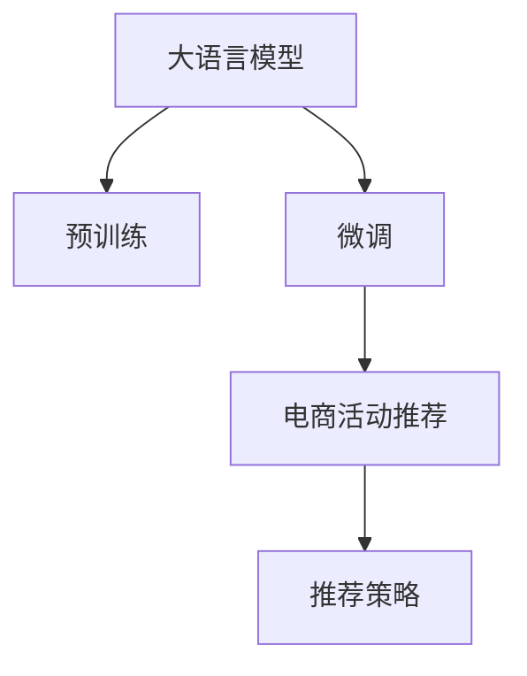

                 

# 大模型驱动的电商个性化活动推荐

## 1. 背景介绍

### 1.1 问题由来
在电商行业中，个性化活动推荐是提升用户粘性、增加复购率的重要手段。传统的基于规则或协同过滤的推荐方法，往往难以全面、准确地刻画用户兴趣和行为。而随着深度学习技术的成熟，基于大模型的推荐系统逐渐成为业界主流。大模型通过在海量用户数据上进行预训练，学习到丰富的用户和商品表示，能够显著提升个性化推荐的效果。

当前，主流的大模型推荐系统多基于预训练语言模型，如BERT、GPT等，通过微调参数来适应特定电商场景。大模型的强大表达能力和泛化能力，使得其在电商领域展现出巨大的应用潜力。本文将深入探讨大模型在电商个性化活动推荐中的原理与实践，为电商行业带来前沿的技术见解。

### 1.2 问题核心关键点
大模型驱动的电商个性化活动推荐涉及以下关键点：

1. **预训练与微调**：大模型的预训练-微调范式是基础，通过在大规模电商数据上预训练，学习用户行为和商品特征，再在特定活动推荐任务上进行微调，适应电商场景。
2. **用户行为理解**：通过大模型的语言理解能力，从用户行为数据中抽取行为模式和兴趣偏好，构建用户画像。
3. **活动内容生成**：利用大模型的文本生成能力，生成多样化的活动内容和广告文案，吸引用户参与。
4. **推荐策略优化**：结合大模型的泛化能力和电商业务逻辑，设计合理的推荐策略，提升推荐效果。

## 2. 核心概念与联系

### 2.1 核心概念概述

为更好地理解大模型驱动的电商个性化活动推荐，本节将介绍几个密切相关的核心概念：

- 大语言模型(Large Language Model, LLM)：以自回归(如GPT)或自编码(如BERT)模型为代表的大规模预训练语言模型。通过在大规模无标签文本语料上进行预训练，学习通用的语言表示，具备强大的语言理解和生成能力。
- 预训练(Pre-training)：指在大规模无标签文本语料上，通过自监督学习任务训练通用语言模型的过程。常见的预训练任务包括言语建模、遮挡语言模型等。
- 微调(Fine-tuning)：指在预训练模型的基础上，使用电商活动推荐任务的少量标注数据，通过有监督地训练来优化模型在特定任务上的性能。通常只需要调整顶层分类器或解码器，并以较小的学习率更新全部或部分的模型参数。
- 迁移学习(Transfer Learning)：指将一个领域学习到的知识，迁移应用到另一个不同但相关的领域的学习范式。大模型的预训练-微调过程即是一种典型的迁移学习方式。
- 个性化推荐系统：根据用户的历史行为数据，推荐用户可能感兴趣的商品或活动的系统。

这些核心概念之间的逻辑关系可以通过以下Mermaid流程图来展示：



这个流程图展示了大语言模型的核心概念及其之间的关系：

1. 大语言模型通过预训练获得基础能力。
2. 微调是对预训练模型进行任务特定的优化，适应电商场景。
3. 个性化推荐系统利用微调后的模型进行用户兴趣匹配和活动推荐。
4. 推荐策略设计将电商业务逻辑与模型预测结果结合，优化推荐效果。

## 3. 核心算法原理 & 具体操作步骤
### 3.1 算法原理概述

大模型驱动的电商个性化活动推荐，本质上是一个有监督的细粒度迁移学习过程。其核心思想是：将大语言模型视作一个强大的"特征提取器"，通过在电商活动推荐任务的少量标注数据上进行有监督的微调，使得模型输出能够匹配特定任务，从而获得针对电商场景优化的模型。

形式化地，假设预训练模型为 $M_{\theta}$，其中 $\theta$ 为预训练得到的模型参数。给定电商活动推荐任务的训练集 $D=\{(x_i, y_i)\}_{i=1}^N$，微调的目标是找到新的模型参数 $\hat{\theta}$，使得：

$$
\hat{\theta}=\mathop{\arg\min}_{\theta} \mathcal{L}(M_{\theta},D)
$$

其中 $\mathcal{L}$ 为针对电商活动推荐任务的损失函数，用于衡量模型预测输出与真实标签之间的差异。常见的损失函数包括交叉熵损失、均方误差损失等。

通过梯度下降等优化算法，微调过程不断更新模型参数 $\theta$，最小化损失函数 $\mathcal{L}$，使得模型输出逼近真实标签。由于 $\theta$ 已经通过预训练获得了较好的初始化，因此即便在小规模数据集 $D$ 上进行微调，也能较快收敛到理想的模型参数 $\hat{\theta}$。

### 3.2 算法步骤详解

基于监督学习的大模型驱动电商个性化活动推荐一般包括以下几个关键步骤：

**Step 1: 准备预训练模型和数据集**
- 选择合适的预训练语言模型 $M_{\theta}$ 作为初始化参数，如 BERT、GPT等。
- 准备电商活动推荐任务的标注数据集 $D$，划分为训练集、验证集和测试集。一般要求标注数据与预训练数据的分布不要差异过大。

**Step 2: 添加任务适配层**
- 根据任务类型，在预训练模型顶层设计合适的输出层和损失函数。
- 对于电商活动推荐任务，通常在顶层添加商品和活动相关分类器或生成器，以交叉熵或均方误差为损失函数。

**Step 3: 设置微调超参数**
- 选择合适的优化算法及其参数，如 AdamW、SGD 等，设置学习率、批大小、迭代轮数等。
- 设置正则化技术及强度，包括权重衰减、Dropout、Early Stopping等。
- 确定冻结预训练参数的策略，如仅微调顶层，或全部参数都参与微调。

**Step 4: 执行梯度训练**
- 将训练集数据分批次输入模型，前向传播计算损失函数。
- 反向传播计算参数梯度，根据设定的优化算法和学习率更新模型参数。
- 周期性在验证集上评估模型性能，根据性能指标决定是否触发 Early Stopping。
- 重复上述步骤直到满足预设的迭代轮数或 Early Stopping 条件。

**Step 5: 测试和部署**
- 在测试集上评估微调后模型 $M_{\hat{\theta}}$ 的性能，对比微调前后的精度提升。
- 使用微调后的模型对新样本进行推理预测，集成到实际的应用系统中。
- 持续收集新的数据，定期重新微调模型，以适应数据分布的变化。

以上是基于监督学习微调大模型进行电商个性化活动推荐的一般流程。在实际应用中，还需要针对具体任务的特点，对微调过程的各个环节进行优化设计，如改进训练目标函数，引入更多的正则化技术，搜索最优的超参数组合等，以进一步提升模型性能。

### 3.3 算法优缺点

大模型驱动的电商个性化活动推荐方法具有以下优点：
1. 提升推荐精度：利用大模型的强大表征能力，对用户和商品进行精确建模，显著提升推荐系统的准确性和个性化程度。
2. 适应性强：大模型能够适应多样化的电商活动推荐任务，通过微调能够快速适配不同的电商场景。
3. 自动化程度高：基于大模型的推荐系统自动化程度高，无需人工干预，可以实时动态调整推荐内容。
4. 拓展性强：大模型可以轻松拓展到多模态推荐，结合图片、视频等非文本信息，提升推荐效果。

同时，该方法也存在一定的局限性：
1. 数据依赖性强：大模型的微调性能高度依赖于标注数据的质量和数量，获取高质量标注数据的成本较高。
2. 冷启动问题：对于新用户的推荐，由于缺乏历史数据，难以进行有效建模，可能导致推荐效果不佳。
3. 解释性不足：大模型推荐的决策过程通常缺乏可解释性，难以对其推理逻辑进行分析和调试。

尽管存在这些局限性，但就目前而言，基于监督学习的大模型推荐方法仍是大规模电商推荐系统的重要手段。未来相关研究的重点在于如何进一步降低推荐对标注数据的依赖，提高模型的少样本学习和跨领域迁移能力，同时兼顾可解释性和伦理安全性等因素。

### 3.4 算法应用领域

大模型驱动的电商个性化活动推荐方法，在电商行业已经得到了广泛的应用，覆盖了商品推荐、活动推荐、广告投放等多个领域，具体应用场景包括：

1. **商品推荐**：根据用户的历史购买记录、浏览行为等数据，推荐用户可能感兴趣的商品。大模型可以分析用户的兴趣模式，推荐与之相匹配的商品。
2. **活动推荐**：根据用户的历史行为数据，推荐用户可能感兴趣的活动和促销信息。大模型可以生成有吸引力的活动描述和广告文案，引导用户参与。
3. **广告投放**：根据用户的兴趣和行为特征，推荐用户可能感兴趣的广告内容。大模型可以生成多样化的广告文案，提升广告点击率和转化率。
4. **个性化搜索**：在用户进行搜索时，推荐与搜索词相关的商品和活动。大模型可以理解用户的查询意图，推荐最相关的结果。

除了上述这些经典应用外，大模型推荐方法还被创新性地应用于更高级的推荐策略，如基于序列模型的推荐、交互式推荐、实时推荐等，为电商行业带来全新的突破。随着预训练模型和推荐方法的不断进步，相信电商推荐技术将在更广阔的应用领域大放异彩。

## 4. 数学模型和公式 & 详细讲解  
### 4.1 数学模型构建

本节将使用数学语言对基于监督学习的大模型驱动电商个性化活动推荐过程进行更加严格的刻画。

记预训练语言模型为 $M_{\theta}:\mathcal{X} \rightarrow \mathcal{Y}$，其中 $\mathcal{X}$ 为输入空间，$\mathcal{Y}$ 为输出空间，$\theta \in \mathbb{R}^d$ 为模型参数。假设电商活动推荐任务的训练集为 $D=\{(x_i,y_i)\}_{i=1}^N, x_i \in \mathcal{X}, y_i \in \mathcal{Y}$。

定义模型 $M_{\theta}$ 在数据样本 $(x,y)$ 上的损失函数为 $\ell(M_{\theta}(x),y)$，则在数据集 $D$ 上的经验风险为：

$$
\mathcal{L}(\theta) = \frac{1}{N} \sum_{i=1}^N \ell(M_{\theta}(x_i),y_i)
$$

微调的优化目标是最小化经验风险，即找到最优参数：

$$
\theta^* = \mathop{\arg\min}_{\theta} \mathcal{L}(\theta)
$$

在实践中，我们通常使用基于梯度的优化算法（如SGD、Adam等）来近似求解上述最优化问题。设 $\eta$ 为学习率，$\lambda$ 为正则化系数，则参数的更新公式为：

$$
\theta \leftarrow \theta - \eta \nabla_{\theta}\mathcal{L}(\theta) - \eta\lambda\theta
$$

其中 $\nabla_{\theta}\mathcal{L}(\theta)$ 为损失函数对参数 $\theta$ 的梯度，可通过反向传播算法高效计算。

### 4.2 公式推导过程

以下我们以电商活动推荐任务为例，推导交叉熵损失函数及其梯度的计算公式。

假设模型 $M_{\theta}$ 在输入 $x$ 上的输出为 $\hat{y}=M_{\theta}(x) \in [0,1]$，表示商品或活动被推荐给用户的可能性。真实标签 $y \in \{0,1\}$。则二分类交叉熵损失函数定义为：

$$
\ell(M_{\theta}(x),y) = -[y\log \hat{y} + (1-y)\log (1-\hat{y})]
$$

将其代入经验风险公式，得：

$$
\mathcal{L}(\theta) = -\frac{1}{N}\sum_{i=1}^N [y_i\log M_{\theta}(x_i)+(1-y_i)\log(1-M_{\theta}(x_i))]
$$

根据链式法则，损失函数对参数 $\theta_k$ 的梯度为：

$$
\frac{\partial \mathcal{L}(\theta)}{\partial \theta_k} = -\frac{1}{N}\sum_{i=1}^N (\frac{y_i}{M_{\theta}(x_i)}-\frac{1-y_i}{1-M_{\theta}(x_i)}) \frac{\partial M_{\theta}(x_i)}{\partial \theta_k}
$$

其中 $\frac{\partial M_{\theta}(x_i)}{\partial \theta_k}$ 可进一步递归展开，利用自动微分技术完成计算。

在得到损失函数的梯度后，即可带入参数更新公式，完成模型的迭代优化。重复上述过程直至收敛，最终得到适应电商活动推荐任务的最优模型参数 $\theta^*$。

## 5. 项目实践：代码实例和详细解释说明
### 5.1 开发环境搭建

在进行电商个性化活动推荐系统开发前，我们需要准备好开发环境。以下是使用Python进行PyTorch开发的环境配置流程：

1. 安装Anaconda：从官网下载并安装Anaconda，用于创建独立的Python环境。

2. 创建并激活虚拟环境：
```bash
conda create -n pytorch-env python=3.8 
conda activate pytorch-env
```

3. 安装PyTorch：根据CUDA版本，从官网获取对应的安装命令。例如：
```bash
conda install pytorch torchvision torchaudio cudatoolkit=11.1 -c pytorch -c conda-forge
```

4. 安装Transformers库：
```bash
pip install transformers
```

5. 安装各类工具包：
```bash
pip install numpy pandas scikit-learn matplotlib tqdm jupyter notebook ipython
```

完成上述步骤后，即可在`pytorch-env`环境中开始电商个性化活动推荐系统的开发。

### 5.2 源代码详细实现

下面我们以电商活动推荐任务为例，给出使用Transformers库对BERT模型进行电商个性化活动推荐微调的PyTorch代码实现。

首先，定义电商活动推荐任务的数据处理函数：

```python
from transformers import BertTokenizer
from torch.utils.data import Dataset
import torch

class ActivityDataset(Dataset):
    def __init__(self, texts, labels, tokenizer, max_len=128):
        self.texts = texts
        self.labels = labels
        self.tokenizer = tokenizer
        self.max_len = max_len
        
    def __len__(self):
        return len(self.texts)
    
    def __getitem__(self, item):
        text = self.texts[item]
        label = self.labels[item]
        
        encoding = self.tokenizer(text, return_tensors='pt', max_length=self.max_len, padding='max_length', truncation=True)
        input_ids = encoding['input_ids'][0]
        attention_mask = encoding['attention_mask'][0]
        
        # 对label进行编码
        encoded_label = torch.tensor(label, dtype=torch.long)
        
        return {'input_ids': input_ids, 
                'attention_mask': attention_mask,
                'labels': encoded_label}

# 创建dataset
tokenizer = BertTokenizer.from_pretrained('bert-base-cased')

train_dataset = ActivityDataset(train_texts, train_labels, tokenizer)
dev_dataset = ActivityDataset(dev_texts, dev_labels, tokenizer)
test_dataset = ActivityDataset(test_texts, test_labels, tokenizer)
```

然后，定义模型和优化器：

```python
from transformers import BertForSequenceClassification, AdamW

model = BertForSequenceClassification.from_pretrained('bert-base-cased', num_labels=2)

optimizer = AdamW(model.parameters(), lr=2e-5)
```

接着，定义训练和评估函数：

```python
from torch.utils.data import DataLoader
from tqdm import tqdm
from sklearn.metrics import classification_report

device = torch.device('cuda') if torch.cuda.is_available() else torch.device('cpu')
model.to(device)

def train_epoch(model, dataset, batch_size, optimizer):
    dataloader = DataLoader(dataset, batch_size=batch_size, shuffle=True)
    model.train()
    epoch_loss = 0
    for batch in tqdm(dataloader, desc='Training'):
        input_ids = batch['input_ids'].to(device)
        attention_mask = batch['attention_mask'].to(device)
        labels = batch['labels'].to(device)
        model.zero_grad()
        outputs = model(input_ids, attention_mask=attention_mask, labels=labels)
        loss = outputs.loss
        epoch_loss += loss.item()
        loss.backward()
        optimizer.step()
    return epoch_loss / len(dataloader)

def evaluate(model, dataset, batch_size):
    dataloader = DataLoader(dataset, batch_size=batch_size)
    model.eval()
    preds, labels = [], []
    with torch.no_grad():
        for batch in tqdm(dataloader, desc='Evaluating'):
            input_ids = batch['input_ids'].to(device)
            attention_mask = batch['attention_mask'].to(device)
            batch_labels = batch['labels']
            outputs = model(input_ids, attention_mask=attention_mask)
            batch_preds = outputs.logits.argmax(dim=2).to('cpu').tolist()
            batch_labels = batch_labels.to('cpu').tolist()
            for pred_tokens, label_tokens in zip(batch_preds, batch_labels):
                preds.append(pred_tokens)
                labels.append(label_tokens)
                
    print(classification_report(labels, preds))
```

最后，启动训练流程并在测试集上评估：

```python
epochs = 5
batch_size = 16

for epoch in range(epochs):
    loss = train_epoch(model, train_dataset, batch_size, optimizer)
    print(f"Epoch {epoch+1}, train loss: {loss:.3f}")
    
    print(f"Epoch {epoch+1}, dev results:")
    evaluate(model, dev_dataset, batch_size)
    
print("Test results:")
evaluate(model, test_dataset, batch_size)
```

以上就是使用PyTorch对BERT进行电商个性化活动推荐任务的微调代码实现。可以看到，得益于Transformers库的强大封装，我们可以用相对简洁的代码完成BERT模型的加载和微调。

### 5.3 代码解读与分析

让我们再详细解读一下关键代码的实现细节：

**ActivityDataset类**：
- `__init__`方法：初始化文本、标签、分词器等关键组件。
- `__len__`方法：返回数据集的样本数量。
- `__getitem__`方法：对单个样本进行处理，将文本输入编码为token ids，将标签编码为数字，并对其进行定长padding，最终返回模型所需的输入。

**train_epoch函数**：
- 使用PyTorch的DataLoader对数据集进行批次化加载，供模型训练和推理使用。
- 在每个批次上前向传播计算loss并反向传播更新模型参数，最后返回该epoch的平均loss。

**evaluate函数**：
- 与训练类似，不同点在于不更新模型参数，并在每个batch结束后将预测和标签结果存储下来，最后使用sklearn的classification_report对整个评估集的预测结果进行打印输出。

**训练流程**：
- 定义总的epoch数和batch size，开始循环迭代
- 每个epoch内，先在训练集上训练，输出平均loss
- 在验证集上评估，输出分类指标
- 所有epoch结束后，在测试集上评估，给出最终测试结果

可以看到，PyTorch配合Transformers库使得BERT微调的代码实现变得简洁高效。开发者可以将更多精力放在数据处理、模型改进等高层逻辑上，而不必过多关注底层的实现细节。

当然，工业级的系统实现还需考虑更多因素，如模型的保存和部署、超参数的自动搜索、更灵活的任务适配层等。但核心的微调范式基本与此类似。

## 6. 实际应用场景
### 6.1 智能客服系统

基于大模型驱动的电商个性化活动推荐技术，可以广泛应用于智能客服系统的构建。传统的客服往往需要配备大量人力，高峰期响应缓慢，且一致性和专业性难以保证。而使用电商推荐系统推荐的活动，可以提升用户参与度，降低人工成本，提高客服系统的智能化水平。

在技术实现上，可以收集企业内部的历史客服对话记录，将问题和最佳答复构建成监督数据，在此基础上对预训练模型进行微调。微调后的推荐模型能够自动理解用户意图，匹配最合适的活动推荐，并通过智能客服系统实时推送给用户。这样不仅能够提高用户的满意度和忠诚度，还能大大减少客服人力成本，提升服务效率。

### 6.2 个性化营销活动

电商推荐系统可以根据用户的购物历史、浏览行为等数据，自动推荐个性化的营销活动和促销信息。通过大模型驱动的推荐，可以生成多样化的活动内容和广告文案，提升活动的点击率和转化率。同时，活动推荐系统能够实时监测活动效果，自动调整活动策略，提升广告投放效果。

具体而言，可以收集用户的历史活动参与数据，将这些数据作为监督信号，训练大模型进行推荐。微调后的模型可以动态生成活动文案和描述，并根据用户的互动反馈进行实时调整，提升推荐效果。如此构建的个性化营销活动系统，可以大幅提升活动营销的精准度和效果。

### 6.3 库存管理和补货

电商推荐系统还可以应用于库存管理和补货决策。通过分析用户的历史行为数据和商品销售数据，推荐用户可能感兴趣的商品，从而预测商品的销售量和库存需求。微调后的模型可以根据销售预测结果，自动生成补货计划，优化库存管理，降低库存成本。

具体实现时，可以将商品销售数据和用户行为数据整合，训练大模型进行销售预测。微调后的模型可以生成精细化的销售预测结果，辅助库存决策。同时，系统可以根据实时销售数据，动态调整补货计划，确保库存始终处于合理水平。

### 6.4 未来应用展望

随着大语言模型微调技术的不断发展，基于电商推荐系统的应用将更加广泛，带来更多的商业价值和社会效益。

在智慧零售领域，基于大模型的推荐系统可以提升用户的购物体验，推荐更加个性化的商品和活动，增强用户粘性。同时，通过分析用户行为数据，发现潜在的消费趋势和热点，提升供应链的灵活性和响应速度。

在智能金融领域，基于大模型的推荐系统可以精准识别用户需求，推荐个性化的金融产品和服务，提升用户的金融服务体验。同时，通过分析用户的交易行为，预测市场趋势和风险，辅助投资决策，提高金融服务的智能化水平。

在智慧城市治理中，基于大模型的推荐系统可以提升城市的精细化管理水平，推荐最合适的公共服务活动和政策，提高市民的生活质量和满意度。同时，通过分析市民的反馈数据，优化公共服务方案，提升城市治理的智能化水平。

此外，在社交网络、教育培训、健康医疗等多个领域，基于大模型的推荐系统也将不断涌现，为各行各业带来全新的突破。相信随着技术的日益成熟，大语言模型微调技术将成为电商推荐系统的核心驱动力，为经济社会发展注入新的动力。

## 7. 工具和资源推荐
### 7.1 学习资源推荐

为了帮助开发者系统掌握大模型驱动的电商个性化活动推荐技术的理论基础和实践技巧，这里推荐一些优质的学习资源：

1. 《深度学习与推荐系统》课程：北京大学的《深度学习与推荐系统》在线课程，涵盖了深度学习在推荐系统中的应用，是推荐系统学习的入门级课程。

2. 《推荐系统实战》书籍：《推荐系统实战》一书详细介绍了推荐系统的原理、算法和工程实践，是推荐系统开发者的必备工具书。

3. 《TensorFlow推荐系统实战》在线教程：谷歌开发的《TensorFlow推荐系统实战》在线教程，涵盖推荐系统的模型构建、训练和优化等各个环节，适合深度学习实践者。

4. Kaggle推荐系统竞赛：Kaggle平台上有多个推荐系统竞赛，通过参与竞赛，可以快速掌握推荐系统的实际应用，积累实践经验。

5. Weights & Biases：模型训练的实验跟踪工具，可以记录和可视化模型训练过程中的各项指标，方便对比和调优。

通过对这些资源的学习实践，相信你一定能够快速掌握大模型驱动的电商个性化活动推荐技术的精髓，并用于解决实际的电商推荐问题。
###  7.2 开发工具推荐

高效的开发离不开优秀的工具支持。以下是几款用于大模型驱动电商个性化活动推荐开发的常用工具：

1. PyTorch：基于Python的开源深度学习框架，灵活动态的计算图，适合快速迭代研究。

2. TensorFlow：由Google主导开发的开源深度学习框架，生产部署方便，适合大规模工程应用。

3. Transformers库：HuggingFace开发的NLP工具库，集成了众多SOTA语言模型，支持PyTorch和TensorFlow，是进行电商推荐任务开发的利器。

4. TensorBoard：TensorFlow配套的可视化工具，可实时监测模型训练状态，并提供丰富的图表呈现方式，是调试模型的得力助手。

5. Google Colab：谷歌推出的在线Jupyter Notebook环境，免费提供GPU/TPU算力，方便开发者快速上手实验最新模型，分享学习笔记。

合理利用这些工具，可以显著提升大模型驱动电商个性化活动推荐任务的开发效率，加快创新迭代的步伐。

### 7.3 相关论文推荐

大语言模型驱动电商个性化活动推荐的研究源于学界的持续研究。以下是几篇奠基性的相关论文，推荐阅读：

1. Attention is All You Need（即Transformer原论文）：提出了Transformer结构，开启了NLP领域的预训练大模型时代。

2. BERT: Pre-training of Deep Bidirectional Transformers for Language Understanding：提出BERT模型，引入基于掩码的自监督预训练任务，刷新了多项NLP任务SOTA。

3. Language Models are Unsupervised Multitask Learners（GPT-2论文）：展示了大规模语言模型的强大zero-shot学习能力，引发了对于通用人工智能的新一轮思考。

4. Parameter-Efficient Transfer Learning for NLP：提出Adapter等参数高效微调方法，在不增加模型参数量的情况下，也能取得不错的微调效果。

5. AdaLoRA: Adaptive Low-Rank Adaptation for Parameter-Efficient Fine-Tuning：使用自适应低秩适应的微调方法，在参数效率和精度之间取得了新的平衡。

这些论文代表了大语言模型驱动电商个性化活动推荐技术的发展脉络。通过学习这些前沿成果，可以帮助研究者把握学科前进方向，激发更多的创新灵感。

## 8. 总结：未来发展趋势与挑战

### 8.1 总结

本文对大模型驱动的电商个性化活动推荐方法进行了全面系统的介绍。首先阐述了电商推荐系统和大模型的预训练-微调范式的基本原理，明确了其对电商个性化活动推荐的独特价值。其次，从原理到实践，详细讲解了基于监督学习的大模型驱动电商个性化活动推荐过程的数学模型和算法步骤，给出了电商推荐任务开发的完整代码实例。同时，本文还广泛探讨了基于大模型的电商推荐系统在智能客服、个性化营销活动、库存管理等多个电商场景中的应用前景，展示了大模型推荐技术的巨大潜力。最后，本文精选了推荐技术的各类学习资源，力求为读者提供全方位的技术指引。

通过本文的系统梳理，可以看到，基于大模型的电商个性化活动推荐方法正在成为电商推荐系统的核心驱动力，极大地提升了电商推荐的效果和个性化程度，为电商行业带来了前所未有的变革。未来，伴随大语言模型和电商推荐方法的不断进步，基于大模型的推荐系统将在更广阔的应用领域大放异彩，深刻影响电商行业的运营模式和发展趋势。

### 8.2 未来发展趋势

展望未来，大模型驱动的电商个性化活动推荐技术将呈现以下几个发展趋势：

1. 模型规模持续增大。随着算力成本的下降和数据规模的扩张，预训练语言模型的参数量还将持续增长。超大规模语言模型蕴含的丰富语言知识，有望支撑更加复杂多变的电商推荐场景。

2. 微调方法日趋多样。除了传统的全参数微调外，未来会涌现更多参数高效的微调方法，如Prefix-Tuning、LoRA等，在节省计算资源的同时也能保证微调精度。

3. 持续学习成为常态。随着电商推荐场景的快速变化，微调模型也需要持续学习新知识以保持性能。如何在不遗忘原有知识的同时，高效吸收新样本信息，将成为重要的研究课题。

4. 标注样本需求降低。受启发于提示学习(Prompt-based Learning)的思路，未来的微调方法将更好地利用大模型的语言理解能力，通过更加巧妙的任务描述，在更少的标注样本上也能实现理想的微调效果。

5. 推荐策略优化。结合大模型的泛化能力和电商业务逻辑，设计更加灵活多变的推荐策略，提升推荐效果和用户体验。

6. 多模态推荐崛起。当前的推荐多聚焦于文本信息，未来会进一步拓展到图像、视频、音频等多模态信息，提升推荐系统的多样性和丰富性。

以上趋势凸显了大语言模型驱动电商个性化活动推荐技术的广阔前景。这些方向的探索发展，必将进一步提升电商推荐系统的性能和用户体验，为电商行业带来深远的变革。

### 8.3 面临的挑战

尽管大模型驱动的电商个性化活动推荐技术已经取得了瞩目成就，但在迈向更加智能化、普适化应用的过程中，它仍面临着诸多挑战：

1. 标注成本瓶颈。虽然大模型的微调性能高度依赖于标注数据的质量和数量，获取高质量标注数据的成本较高。如何进一步降低微调对标注样本的依赖，将是一大难题。

2. 冷启动问题。对于新用户的推荐，由于缺乏历史数据，难以进行有效建模，可能导致推荐效果不佳。如何解决冷启动问题，是电商推荐系统的重要挑战。

3. 推荐效果可控性。大模型的泛化能力可能导致推荐结果过于多样化，难以控制。如何设计合理的推荐策略，确保推荐效果可控，将是重要的研究方向。

4. 推荐结果可解释性。大模型推荐的决策过程通常缺乏可解释性，难以对其推理逻辑进行分析和调试。如何赋予推荐模型更强的可解释性，将是亟待攻克的难题。

5. 数据隐私保护。电商推荐系统涉及用户的隐私数据，如何保护用户隐私，防止数据滥用，是推荐系统的重要伦理问题。

6. 模型鲁棒性。大模型面临的对抗攻击、数据噪声等风险，可能影响推荐效果。如何提高推荐系统的鲁棒性，保证其在各种场景下的稳定表现，将是重要的研究课题。

正视推荐系统面临的这些挑战，积极应对并寻求突破，将是大模型驱动电商个性化活动推荐走向成熟的必由之路。相信随着学界和产业界的共同努力，这些挑战终将一一被克服，大模型推荐技术必将在构建智能电商生态中扮演越来越重要的角色。

### 8.4 研究展望

面向未来，大模型驱动的电商个性化活动推荐技术需要在以下几个方面寻求新的突破：

1. 探索无监督和半监督微调方法。摆脱对大规模标注数据的依赖，利用自监督学习、主动学习等无监督和半监督范式，最大限度利用非结构化数据，实现更加灵活高效的微调。

2. 研究参数高效和计算高效的微调范式。开发更加参数高效的微调方法，在固定大部分预训练参数的同时，只更新极少量的任务相关参数。同时优化微调模型的计算图，减少前向传播和反向传播的资源消耗，实现更加轻量级、实时性的部署。

3. 融合因果和对比学习范式。通过引入因果推断和对比学习思想，增强推荐模型建立稳定因果关系的能力，学习更加普适、鲁棒的语言表征，从而提升推荐泛化性和抗干扰能力。

4. 引入更多先验知识。将符号化的先验知识，如知识图谱、逻辑规则等，与神经网络模型进行巧妙融合，引导微调过程学习更准确、合理的语言模型。同时加强不同模态数据的整合，实现视觉、语音等多模态信息与文本信息的协同建模。

5. 结合因果分析和博弈论工具。将因果分析方法引入推荐模型，识别出模型决策的关键特征，增强推荐结果的因果性和逻辑性。借助博弈论工具刻画人机交互过程，主动探索并规避推荐系统的脆弱点，提高系统稳定性。

6. 纳入伦理道德约束。在模型训练目标中引入伦理导向的评估指标，过滤和惩罚有偏见、有害的输出倾向。同时加强人工干预和审核，建立推荐模型的监管机制，确保推荐结果符合人类价值观和伦理道德。

这些研究方向的探索，必将引领大语言模型驱动电商个性化活动推荐技术迈向更高的台阶，为构建安全、可靠、可解释、可控的智能推荐系统铺平道路。面向未来，大语言模型推荐技术还需要与其他人工智能技术进行更深入的融合，如知识表示、因果推理、强化学习等，多路径协同发力，共同推动智能推荐系统的进步。只有勇于创新、敢于突破，才能不断拓展语言模型的边界，让智能技术更好地造福电商行业和广大用户。

## 9. 附录：常见问题与解答

**Q1：大模型推荐系统是否可以用于电商活动推荐？**

A: 是的，大模型推荐系统可以通过微调用于电商活动推荐。大模型通过在大规模电商数据上预训练，学习到用户和商品的丰富表示，能够对电商活动推荐任务进行有效的适配。微调后的模型可以根据用户行为数据，生成多样化的活动内容和广告文案，提升推荐效果。

**Q2：大模型推荐系统在电商推荐中面临的主要挑战是什么？**

A: 大模型推荐系统在电商推荐中面临的主要挑战包括：
1. 标注成本高：电商推荐系统需要大量的标注数据，获取高质量标注数据的成本较高。
2. 冷启动问题：对于新用户的推荐，由于缺乏历史数据，难以进行有效建模，可能导致推荐效果不佳。
3. 推荐效果可控性：大模型的泛化能力可能导致推荐结果过于多样化，难以控制。
4. 推荐结果可解释性：大模型推荐的决策过程通常缺乏可解释性，难以对其推理逻辑进行分析和调试。
5. 数据隐私保护：电商推荐系统涉及用户的隐私数据，如何保护用户隐私，防止数据滥用，是推荐系统的重要伦理问题。
6. 模型鲁棒性：大模型面临的对抗攻击、数据噪声等风险，可能影响推荐效果。

**Q3：如何使用大模型推荐系统进行电商个性化活动推荐？**

A: 使用大模型推荐系统进行电商个性化活动推荐的步骤如下：
1. 收集电商活动推荐任务的标注数据集，划分为训练集、验证集和测试集。
2. 选择合适的预训练语言模型，如BERT、GPT等，作为初始化参数。
3. 在预训练模型的基础上，设计合适的输出层和损失函数，进行微调。
4. 设置合适的微调超参数，如学习率、批大小、迭代轮数等。
5. 使用微调后的模型对新样本进行推理预测，生成个性化活动推荐。

**Q4：电商推荐系统的推荐效果如何评估？**

A: 电商推荐系统的推荐效果可以通过以下指标进行评估：
1. 点击率（CTR）：用户点击广告或活动的比例，评估推荐的相关性。
2. 转化率（CVR）：用户点击广告后进行购买的比例，评估推荐的转化效果。
3. 平均处理时间（APT）：用户从看到推荐到完成购买的时间，评估推荐的效率。
4. 用户满意度（NPS）：用户对推荐结果的满意度，评估推荐的用户体验。
5. 用户留存率：用户长期使用推荐系统并持续购买的比例，评估推荐的长期效果。

通过评估这些指标，可以全面了解电商推荐系统的表现，并不断优化推荐策略。

