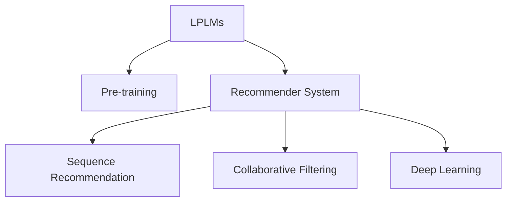

                 

## 1. 背景介绍

随着互联网的普及和数字技术的飞速发展，推荐系统在电商、新闻、娱乐、金融等众多领域中得到了广泛的应用。推荐系统通过分析用户的浏览、点击、购买等行为数据，预测用户可能感兴趣的物品或内容，以提升用户体验和商家效益。传统的推荐系统主要依靠基于规则、协同过滤等方法，但随着数据量的爆炸式增长，这些方法已无法应对大规模数据和高维度特征的挑战。

近年来，基于大规模预训练语言模型（Large Pre-trained Language Models, LPLMs）的推荐方法逐渐兴起。LPLMs通过在大规模语料上进行预训练，学习到丰富的语言知识和统计规律，具有强大的语言理解和生成能力。将LPLMs引入推荐系统，能够有效提升推荐效果，扩展推荐系统的应用边界。

本文将系统介绍基于LPLMs的推荐方法，阐述其在推荐系统中的应用价值，并探讨其未来发展趋势和面临的挑战。

## 2. 核心概念与联系

### 2.1 核心概念概述

本节将介绍几个与LPLMs推荐相关的核心概念及其联系。

- **大规模预训练语言模型(LPLMs)**：指在大规模无标签文本语料上进行预训练，学习到通用语言表示的深度神经网络模型。如GPT-3、BERT、RoBERTa等模型。
- **预训练(Pre-training)**：指在大规模无标签文本语料上，通过自监督学习任务训练通用语言模型的过程。
- **推荐系统(Recommender System)**：通过分析用户行为数据，预测用户可能感兴趣的物品或内容，以提升用户体验和商家效益。
- **序列推荐(Systematic Recommendation)**：指根据用户的过去行为，预测其未来的消费倾向，进行持续性推荐。
- **协同过滤(Collaborative Filtering)**：通过分析用户和物品之间的协同关系，进行相似度匹配推荐。
- **深度学习(DL)**：一种通过神经网络模型进行数据学习、特征提取和决策推理的技术。

这些概念之间的逻辑关系可以通过以下Mermaid流程图来展示：



这个流程图展示了LPLMs在推荐系统中的应用路径：首先通过预训练学习通用语言表示，然后通过推荐系统模型对用户行为进行预测，最终得到个性化推荐结果。其中，序列推荐和协同过滤是推荐系统的两种常见方法，深度学习则提供了强大的模型工具。

## 3. 核心算法原理 & 具体操作步骤

### 3.1 算法原理概述

基于LPLMs的推荐方法，本质上是一种结合了自然语言处理（NLP）技术和深度学习算法的推荐范式。其核心思想是：利用LPLMs强大的语言理解能力，提取用户行为背后的语义信息，结合用户特征和物品属性，预测用户可能感兴趣的新物品。

具体来说，基于LPLMs的推荐方法分为预训练和微调两个阶段。预训练阶段，通过在大规模文本语料上进行自监督学习，LPLMs学习到丰富的语言知识。微调阶段，将用户行为和物品属性输入LPLMs，通过有监督学习调整模型参数，使其输出与用户行为匹配，从而获得更好的推荐效果。

### 3.2 算法步骤详解

基于LPLMs的推荐方法主要包括以下几个关键步骤：

**Step 1: 准备预训练模型和数据集**

- 选择合适的LPLM作为初始化参数，如GPT-3、BERT等。
- 准备推荐系统所需的用户行为数据和物品属性数据。

**Step 2: 设计任务适配层**

- 根据推荐任务类型，在LPLM顶层设计合适的输出层和损失函数。
- 对于序列推荐任务，通常使用LSTM等序列模型预测下一步行为。
- 对于协同过滤任务，通过相似度匹配预测用户对物品的评分。

**Step 3: 设置微调超参数**

- 选择合适的优化算法及其参数，如Adam、SGD等，设置学习率、批大小、迭代轮数等。
- 设置正则化技术及强度，包括权重衰减、Dropout、Early Stopping等。
- 确定冻结预训练参数的策略，如仅微调顶层，或全部参数都参与微调。

**Step 4: 执行梯度训练**

- 将用户行为和物品属性数据分批次输入模型，前向传播计算损失函数。
- 反向传播计算参数梯度，根据设定的优化算法和学习率更新模型参数。
- 周期性在验证集上评估模型性能，根据性能指标决定是否触发Early Stopping。
- 重复上述步骤直至满足预设的迭代轮数或Early Stopping条件。

**Step 5: 测试和部署**

- 在测试集上评估微调后模型，对比微调前后的推荐效果。
- 使用微调后的模型对新样本进行推荐，集成到实际的应用系统中。
- 持续收集新的数据，定期重新微调模型，以适应数据分布的变化。

### 3.3 算法优缺点

基于LPLMs的推荐方法具有以下优点：
1. 能够处理长文本特征。用户行为、物品描述等信息往往具有丰富的文本描述，LPLMs能够有效提取其中的语义信息。
2. 鲁棒性好。LPLMs通过预训练学习到通用的语言表示，能够适应不同领域的推荐任务。
3. 可解释性强。LPLMs的预训练过程具有较强的可解释性，能够通过自然语言处理技术提供推荐解释。
4. 数据冷启动效果好。LPLMs能够在没有足够历史数据的情况下，通过预训练模型进行推荐。

同时，该方法也存在一定的局限性：
1. 模型训练和微调开销大。LPLMs参数量庞大，训练和微调过程需要大量的计算资源。
2. 对标注数据依赖高。推荐系统的准确性很大程度上取决于标注数据的质量和数量。
3. 模型复杂度高。LPLMs结构复杂，难以进行高效的实时推理。
4. 泛化能力有待提高。LPLMs在特定领域上的微调效果可能不如传统推荐方法。

尽管存在这些局限性，但基于LPLMs的推荐方法仍在学术界和工业界中广泛应用，并取得了显著的推荐效果。未来相关研究的重点在于如何进一步降低训练和微调成本，提高模型的泛化能力和实时推理效率。

### 3.4 算法应用领域

基于LPLMs的推荐方法已经在电商、新闻、娱乐、金融等诸多领域中得到了广泛应用，具体包括：

- 电商推荐：推荐用户可能感兴趣的商品、广告等。
- 新闻推荐：推荐用户可能感兴趣的文章、视频等。
- 娱乐推荐：推荐用户可能感兴趣的电影、音乐、游戏等。
- 金融推荐：推荐用户可能感兴趣的投资组合、产品等。
- 社交推荐：推荐用户可能感兴趣的朋友、文章、话题等。

这些应用领域中，LPLMs能够有效结合用户行为和物品属性，进行精准推荐，提升用户体验和商家效益。

## 4. 数学模型和公式 & 详细讲解 & 举例说明

### 4.1 数学模型构建

本节将使用数学语言对基于LPLMs的推荐过程进行更加严格的刻画。

记LPLMs为 $M_{\theta}:\mathcal{X} \rightarrow \mathcal{Y}$，其中 $\mathcal{X}$ 为输入空间，$\mathcal{Y}$ 为输出空间，$\theta \in \mathbb{R}^d$ 为模型参数。假设推荐系统所需的用户行为数据为 $D=\{(x_i,y_i)\}_{i=1}^N, x_i \in \mathcal{X}, y_i \in \mathcal{Y}$，物品属性数据为 $D'=\{(x'_i,y'_i)\}_{i=1}^{N'}, x'_i \in \mathcal{X'}, y'_i \in \mathcal{Y'}$。

定义推荐模型 $M_{\theta}$ 在输入 $(x,y)$ 上的损失函数为 $\ell(M_{\theta}(x),y)$，则在数据集 $D$ 上的经验风险为：

$$
\mathcal{L}(\theta) = \frac{1}{N} \sum_{i=1}^N \ell(M_{\theta}(x_i),y_i)
$$

其中 $\ell$ 为推荐任务定义的损失函数，通常使用交叉熵损失、均方误差损失等。

### 4.2 公式推导过程

以序列推荐为例，假设用户行为序列为 $(x_1, x_2, \ldots, x_n)$，推荐系统目标为预测用户下一个行为 $x_{n+1}$。

根据序列推荐任务的定义，模型的目标函数为：

$$
\min_{\theta} \mathbb{E}_{(x,y) \sim D}[\ell(M_{\theta}(x),y)]
$$

其中 $\ell$ 为序列推荐任务的损失函数，通常使用负对数似然损失函数。

对于离散序列推荐任务，模型的预测输出为下一时刻的行为概率分布 $p_{\theta}(x_{n+1}|x_1, x_2, \ldots, x_n)$。模型的输出可以表示为LPLMs的前向传播结果 $h_{\theta}(x_{n+1})$ 通过softmax函数得到的概率分布：

$$
p_{\theta}(x_{n+1}|x_1, x_2, \ldots, x_n) = \text{softmax}(h_{\theta}(x_{n+1}))
$$

模型的损失函数为：

$$
\ell(M_{\theta}(x),y) = -\log p_{\theta}(y|x)
$$

其中 $y$ 为用户下一时刻的行为，可以是商品ID、文章ID等。

因此，序列推荐任务的优化目标为：

$$
\min_{\theta} \frac{1}{N} \sum_{i=1}^N \log p_{\theta}(y_i|x_i)
$$

通过反向传播算法，模型可以计算出损失函数对参数 $\theta$ 的梯度，并使用优化算法（如Adam、SGD等）更新模型参数。

### 4.3 案例分析与讲解

以电商推荐为例，假设用户浏览了一篇文章 $x_1$ 并购买了其中推荐的商品 $y_1$。在接下来的第二天，用户浏览了另外一篇文章 $x_2$，但没有进行购买行为。为了预测用户下一步可能购买的商品，可以使用LPLMs作为推荐模型。

具体步骤如下：

1. 准备预训练模型 $M_{\theta}$ 和用户行为数据 $(x_1, y_1), (x_2)$。
2. 在LPLMs顶层添加合适的输出层和损失函数，如分类层和交叉熵损失。
3. 设置微调超参数，包括优化算法、学习率、批大小等。
4. 将用户行为数据输入LPLMs进行前向传播，计算损失函数。
5. 反向传播计算参数梯度，使用优化算法更新模型参数。
6. 在验证集上评估模型性能，根据性能指标决定是否触发Early Stopping。
7. 测试集上评估推荐效果，使用微调后的模型对新样本进行推荐。

## 5. 项目实践：代码实例和详细解释说明

### 5.1 开发环境搭建

在进行推荐系统开发前，需要准备好开发环境。以下是使用Python进行TensorFlow开发的环境配置流程：

1. 安装Anaconda：从官网下载并安装Anaconda，用于创建独立的Python环境。

2. 创建并激活虚拟环境：
```bash
conda create -n tf-env python=3.8 
conda activate tf-env
```

3. 安装TensorFlow：从官网获取对应的安装命令。例如：
```bash
pip install tensorflow tensorflow-addons 
```

4. 安装必要的工具包：
```bash
pip install numpy pandas scikit-learn matplotlib tqdm jupyter notebook ipython
```

完成上述步骤后，即可在`tf-env`环境中开始推荐系统开发。

### 5.2 源代码详细实现

下面以电商推荐为例，给出使用TensorFlow对LPLM进行推荐系统微调的代码实现。

首先，定义推荐任务的数据处理函数：

```python
from tensorflow.keras.preprocessing.sequence import pad_sequences
from tensorflow.keras.layers import Embedding, LSTM, Dense, TimeDistributed, Softmax
from tensorflow.keras.models import Model
import tensorflow as tf
import numpy as np

class RecommendationDataset(tf.keras.utils.Sequence):
    def __init__(self, data, sequence_length, batch_size):
        self.data = data
        self.sequence_length = sequence_length
        self.batch_size = batch_size
        
    def __len__(self):
        return len(self.data) // self.batch_size
        
    def __getitem__(self, idx):
        sequence = self.data[idx]
        sequence = pad_sequences(sequence, maxlen=self.sequence_length, padding='post', truncating='post')
        label = sequence[:, -1]
        label = tf.one_hot(label, num_classes=10)
        return tf.keras.Input(shape=(self.sequence_length,)), label

# 创建dataset
sequence_length = 5
data = [
    [1, 2, 3, 4, 5],
    [2, 3, 4, 5, 6],
    [3, 4, 5, 6, 7],
    [4, 5, 6, 7, 8],
    [5, 6, 7, 8, 9]
]
batch_size = 2

train_dataset = RecommendationDataset(data, sequence_length, batch_size)
test_dataset = RecommendationDataset(data, sequence_length, batch_size)
```

然后，定义模型和优化器：

```python
from tensorflow.keras.layers import Embedding, LSTM, Dense, TimeDistributed, Softmax
from tensorflow.keras.models import Model

# 定义LSTM模型
model = tf.keras.Sequential([
    Embedding(input_dim=10, output_dim=64),
    LSTM(64),
    TimeDistributed(Dense(64)),
    TimeDistributed(Softmax(10))
])

# 定义损失函数和优化器
model.compile(loss='categorical_crossentropy', optimizer='adam')
```

接着，定义训练和评估函数：

```python
from tensorflow.keras.callbacks import EarlyStopping

def train_epoch(model, dataset, batch_size, optimizer):
    dataloader = tf.data.Dataset.from_generator(lambda: dataset, output_signature=(lambda x, y: (x, y)).to_tuple()).batch(batch_size)
    model.fit(dataloader, epochs=10, callbacks=[EarlyStopping(patience=5)])

def evaluate(model, dataset, batch_size):
    dataloader = tf.data.Dataset.from_generator(lambda: dataset, output_signature=(lambda x, y: (x, y)).to_tuple()).batch(batch_size)
    loss = model.evaluate(dataloader)
    print(f"Test loss: {loss:.3f}")
```

最后，启动训练流程并在测试集上评估：

```python
epochs = 10
batch_size = 2

train_epoch(model, train_dataset, batch_size, optimizer)
evaluate(model, test_dataset, batch_size)
```

以上就是使用TensorFlow对LPLM进行电商推荐系统微调的完整代码实现。可以看到，得益于TensorFlow的强大封装，我们可以用相对简洁的代码完成LPLM模型的加载和微调。

### 5.3 代码解读与分析

让我们再详细解读一下关键代码的实现细节：

**RecommendationDataset类**：
- `__init__`方法：初始化数据集、序列长度和批次大小等关键参数。
- `__len__`方法：返回数据集的批次数量。
- `__getitem__`方法：对单个批次进行处理，将序列进行填充并返回输入张量和标签张量。

**LSTM模型定义**：
- 使用Embedding层将输入序列转换为向量表示。
- 使用LSTM层对序列进行时间步处理。
- 使用TimeDistributed层对LSTM的输出进行时间步处理，分别输出不同时间步的向量表示。
- 使用Softmax层对输出向量进行分类，得到每个时间步的预测概率分布。

**训练和评估函数**：
- 使用TensorFlow的DataLoader将数据集转换为批处理的数据集。
- 在训练过程中使用EarlyStopping回调函数，在性能停滞时停止训练。
- 在评估过程中，直接使用模型.evaluate()函数计算损失，并输出结果。

**训练流程**：
- 定义总的epoch数和批次大小，开始循环迭代。
- 每个epoch内，在训练集上训练，输出平均loss。
- 在测试集上评估，输出测试结果。

可以看到，TensorFlow配合TensorFlow Addons库使得LPLM微调的代码实现变得简洁高效。开发者可以将更多精力放在数据处理、模型改进等高层逻辑上，而不必过多关注底层的实现细节。

当然，工业级的系统实现还需考虑更多因素，如模型的保存和部署、超参数的自动搜索、更灵活的任务适配层等。但核心的微调范式基本与此类似。

## 6. 实际应用场景

### 6.1 电商平台推荐

基于LPLMs的推荐系统在电商平台上得到了广泛应用。传统的电商推荐系统依赖用户行为数据和物品属性数据，通过协同过滤等方法进行推荐。但随着用户数据和物品属性的多样性不断增加，传统方法难以应对大规模数据的处理和分析。而LPLMs结合了NLP技术和深度学习算法，能够有效处理长文本特征，提高推荐的准确性和个性化程度。

具体而言，电商推荐系统可以收集用户浏览、点击、购买等行为数据，并将物品描述等属性信息输入LPLMs进行训练。LPLMs能够从用户行为和物品属性中提取语义信息，结合用户特征和物品属性，预测用户可能感兴趣的新物品，进行持续性推荐。

### 6.2 新闻阅读推荐

新闻推荐系统是LPLMs在新闻领域的重要应用。新闻内容丰富多样，文本描述较长，传统的推荐方法难以有效处理。LPLMs结合NLP技术，能够从长文本中提取关键信息，进行精准推荐。

具体而言，新闻推荐系统可以收集用户阅读历史和行为数据，将文章标题、摘要等文本信息输入LPLMs进行训练。LPLMs能够从文本中提取关键信息，预测用户可能感兴趣的新闻，进行个性化推荐。

### 6.3 音乐推荐

音乐推荐系统也是LPLMs的重要应用场景。音乐推荐系统需要处理大量的音频和文本信息，传统的协同过滤方法难以应对。LPLMs结合NLP技术和深度学习算法，能够从音频和歌词中提取特征，进行精准推荐。

具体而言，音乐推荐系统可以收集用户听歌历史和行为数据，将歌曲信息、歌词等文本信息输入LPLMs进行训练。LPLMs能够从文本中提取关键信息，结合音频特征，预测用户可能感兴趣的音乐，进行个性化推荐。

### 6.4 金融投资推荐

金融投资推荐系统需要处理大量的财务数据和投资组合信息，传统的推荐方法难以应对。LPLMs结合NLP技术和深度学习算法，能够从文本中提取关键信息，进行精准推荐。

具体而言，金融投资推荐系统可以收集用户投资历史和行为数据，将投资组合信息、新闻、报告等文本信息输入LPLMs进行训练。LPLMs能够从文本中提取关键信息，预测用户可能感兴趣的投资组合，进行个性化推荐。

## 7. 工具和资源推荐

### 7.1 学习资源推荐

为了帮助开发者系统掌握LPLMs在推荐系统中的应用，这里推荐一些优质的学习资源：

1. 《深度学习与自然语言处理》（第二版）：清华大学出版社，邓俊辉等著，全面介绍了深度学习在自然语言处理中的应用。
2. 《自然语言处理综述》（Neural Information Processing Systems）：DeepMind的论文，系统介绍了NLP领域的最新研究成果和应用方向。
3. 《大规模预训练语言模型》（Large-Scale Pretrained Models）：谷歌的白皮书，介绍了LPLMs的预训练和微调过程，以及其在推荐系统中的应用。
4. 《推荐系统理论与实践》（Theory and Algorithms for Recommendation Systems）：Shang和Li的书籍，详细介绍了推荐系统的理论基础和算法实现。
5. 《TensorFlow官方文档》：谷歌的官方文档，提供了完整的TensorFlow开发指南和推荐系统实现示例。

通过对这些资源的学习实践，相信你一定能够快速掌握LPLMs在推荐系统中的应用，并用于解决实际的推荐问题。

### 7.2 开发工具推荐

高效的开发离不开优秀的工具支持。以下是几款用于LPLMs推荐系统开发的常用工具：

1. TensorFlow：谷歌推出的开源深度学习框架，生产部署方便，适合大规模工程应用。
2. PyTorch：基于Python的开源深度学习框架，灵活动态的计算图，适合快速迭代研究。
3. HuggingFace Transformers：开源的NLP工具库，集成了众多SOTA语言模型，支持TensorFlow和PyTorch，是进行LPLMs推荐系统开发的利器。
4. Keras：基于TensorFlow的高级神经网络API，提供了简单易用的接口，适合快速原型开发。
5. Jupyter Notebook：免费的交互式开发环境，支持多种编程语言，方便快速迭代实验。

合理利用这些工具，可以显著提升LPLMs推荐系统的开发效率，加快创新迭代的步伐。

### 7.3 相关论文推荐

LPLMs和推荐系统的发展源于学界的持续研究。以下是几篇奠基性的相关论文，推荐阅读：

1. Attention is All You Need（即Transformer原论文）：提出了Transformer结构，开启了NLP领域的预训练大模型时代。
2. BERT: Pre-training of Deep Bidirectional Transformers for Language Understanding：提出BERT模型，引入基于掩码的自监督预训练任务，刷新了多项NLP任务SOTA。
3. Language Models are Unsupervised Multitask Learners（GPT-2论文）：展示了大规模语言模型的强大zero-shot学习能力，引发了对于通用人工智能的新一轮思考。
4. Revisiting Recommendation with Self-supervised Learning：提出基于自监督学习（SSL）的推荐方法，在无需标注数据的情况下，仍然能够取得优异的推荐效果。
5. Popularity Ranking as Difficulty Estimation in Recommendation Systems：提出将难度估计融入推荐系统，通过优化损失函数提升推荐效果。

这些论文代表了大语言模型和推荐系统的发展脉络。通过学习这些前沿成果，可以帮助研究者把握学科前进方向，激发更多的创新灵感。

## 8. 总结：未来发展趋势与挑战

### 8.1 总结

本文对基于LPLMs的推荐方法进行了全面系统的介绍。首先阐述了LPLMs在推荐系统中的应用价值，明确了其在提升推荐效果和扩展应用边界方面的独特优势。其次，从原理到实践，详细讲解了LPLMs在推荐系统中的预训练和微调过程，给出了推荐系统开发的完整代码实例。同时，本文还广泛探讨了LPLMs在电商、新闻、音乐、金融等领域的应用前景，展示了其广泛的应用潜力。

通过本文的系统梳理，可以看到，基于LPLMs的推荐方法已经广泛应用于NLP领域，极大地提升了推荐系统的性能和应用范围。未来，伴随LPLMs和推荐系统的不断演进，必将在更广泛的领域得到应用，为人类认知智能的进化带来深远影响。

### 8.2 未来发展趋势

展望未来，LPLMs在推荐系统中的应用将呈现以下几个发展趋势：

1. 模型规模持续增大。随着算力成本的下降和数据规模的扩张，LPLMs的参数量还将持续增长。超大规模语言模型蕴含的丰富语言知识，有望支撑更加复杂多变的推荐任务。
2. 推荐算法日趋多样。除了传统的协同过滤、序列推荐外，未来会涌现更多基于深度学习的方法，如自监督推荐、对比学习等，提升推荐系统的灵活性和鲁棒性。
3. 跨模态推荐崛起。当前的推荐系统往往只依赖文本数据，未来会进一步拓展到图像、视频、音频等多模态数据推荐。多模态信息的融合，将显著提升推荐系统的性能和用户体验。
4. 推荐系统嵌入NLP任务。LPLMs能够处理文本数据，自然语言生成技术可用于生成推荐理由、文本摘要等，提升推荐系统的可解释性和互动性。
5. 推荐系统智能体化。基于LPLMs的推荐系统能够学习用户的长期偏好和行为模式，进行持续性推荐，逐步向智能体化推荐系统迈进。
6. 推荐系统个性化优化。LPLMs能够处理长文本数据，结合用户行为和物品属性，进行个性化推荐，提升用户体验。

以上趋势凸显了LPLMs在推荐系统中的广泛应用前景。这些方向的探索发展，必将进一步提升推荐系统的性能和应用范围，为人类认知智能的进化带来深远影响。

### 8.3 面临的挑战

尽管LPLMs在推荐系统中的应用已取得显著成效，但在迈向更加智能化、普适化应用的过程中，仍然面临诸多挑战：

1. 数据隐私和安全问题。推荐系统需要收集和分析用户数据，如何保护用户隐私和安全，避免数据泄露，是亟待解决的问题。
2. 计算资源消耗大。LPLMs的预训练和微调过程需要大量的计算资源，如何降低计算成本，提升模型训练效率，是未来的研究方向。
3. 推荐效果有待提升。尽管LPLMs在推荐系统中的应用已取得显著成效，但在特定领域上的微调效果可能不如传统推荐方法。
4. 模型可解释性不足。LPLMs通常被视为"黑盒"模型，难以解释其内部工作机制和决策逻辑，影响用户信任和接受度。
5. 跨领域泛化能力差。LPLMs在特定领域的微调效果可能不如通用领域，如何提升跨领域泛化能力，是未来的研究方向。

尽管存在这些挑战，但LPLMs在推荐系统中的应用已展现出巨大的潜力和前景，未来仍需不断探索和优化，推动其向更加智能化、普适化方向发展。

### 8.4 研究展望

面对LPLMs在推荐系统应用中所面临的挑战，未来的研究需要在以下几个方面寻求新的突破：

1. 探索基于自监督学习（SSL）的推荐方法。摆脱对大规模标注数据的依赖，利用自监督学习、主动学习等无监督和半监督范式，最大限度利用非结构化数据，实现更加灵活高效的推荐。
2. 研究参数高效和计算高效的推荐方法。开发更加参数高效的推荐方法，在固定大部分预训练参数的同时，只更新极少量的任务相关参数。同时优化推荐模型的计算图，减少前向传播和反向传播的资源消耗，实现更加轻量级、实时性的部署。
3. 引入因果推断和对比学习思想。通过引入因果推断和对比学习思想，增强推荐模型建立稳定因果关系的能力，学习更加普适、鲁棒的语言表征，从而提升推荐系统的泛化能力和抗干扰能力。
4. 将先验知识与模型融合。将符号化的先验知识，如知识图谱、逻辑规则等，与神经网络模型进行巧妙融合，引导推荐过程学习更准确、合理的语言模型。同时加强不同模态数据的整合，实现视觉、语音等多模态信息与文本信息的协同建模。
5. 结合因果分析和博弈论工具。将因果分析方法引入推荐系统，识别出推荐过程的关键特征，增强推荐系统输出解释的因果性和逻辑性。借助博弈论工具刻画人机交互过程，主动探索并规避推荐系统的脆弱点，提高系统稳定性。
6. 纳入伦理道德约束。在推荐系统训练目标中引入伦理导向的评估指标，过滤和惩罚有害的输出倾向。同时加强人工干预和审核，建立推荐系统行为的监管机制，确保推荐结果符合人类价值观和伦理道德。

这些研究方向的探索，必将引领LPLMs在推荐系统中的研究走向更高的台阶，为构建智能、可靠、可解释、可控的推荐系统铺平道路。面向未来，LPLMs和推荐系统的研究仍需不断探索和优化，推动其向更加智能化、普适化方向发展，以实现更加精准、高效、个性化的推荐服务。

## 9. 附录：常见问题与解答

**Q1：LPLMs推荐系统是否适用于所有推荐场景？**

A: LPLMs推荐系统在大多数推荐场景中都能取得不错的效果，特别是对于数据量较大的场景。但对于一些特定领域的推荐场景，如金融、医疗等，LPLMs的微调效果可能不如传统推荐方法。此时需要在特定领域语料上进一步预训练，再进行微调，才能获得理想效果。

**Q2：LPLMs推荐系统如何处理长文本数据？**

A: LPLMs推荐系统利用其强大的语言理解能力，能够有效处理长文本数据。在电商推荐中，用户行为数据和物品属性数据往往具有丰富的文本描述，LPLMs能够从文本中提取关键信息，进行精准推荐。

**Q3：LPLMs推荐系统如何降低计算成本？**

A: 为了降低LPLMs推荐系统的计算成本，可以采用以下几个策略：
1. 参数剪枝：去掉不重要的参数，减少模型复杂度。
2. 模型压缩：使用模型压缩技术，减小模型存储空间和计算开销。
3. 分布式训练：利用分布式计算框架，加速模型训练和推理过程。
4. 混合精度训练：使用混合精度训练技术，减小计算资源消耗。
5. 模型剪枝和压缩：使用模型剪枝和压缩技术，减少模型参数量。

**Q4：LPLMs推荐系统如何进行模型优化？**

A: LPLMs推荐系统的模型优化可以从以下几个方面入手：
1. 数据预处理：通过数据清洗、特征提取等技术，提高数据质量，减少噪音。
2. 模型设计：选择合适的模型结构，如LSTM、GRU等，并进行合适的参数调整。
3. 超参数优化：通过网格搜索、随机搜索等技术，寻找最优的超参数组合。
4. 模型融合：通过模型融合技术，结合多个模型的优势，提升推荐效果。
5. 在线学习：通过在线学习技术，不断更新模型参数，适应数据分布的变化。

**Q5：LPLMs推荐系统的鲁棒性如何保证？**

A: 为了保证LPLMs推荐系统的鲁棒性，可以采用以下几个策略：
1. 数据增强：通过数据增强技术，增加训练集的多样性，提高模型的泛化能力。
2. 对抗训练：通过对抗训练技术，提升模型的鲁棒性，防止对抗样本攻击。
3. 正则化：通过L2正则化、Dropout等技术，防止过拟合，提高模型的泛化能力。
4. 参数高效微调：通过参数高效微调技术，只调整极少量的参数，减少模型的复杂度。

---

作者：禅与计算机程序设计艺术 / Zen and the Art of Computer Programming

