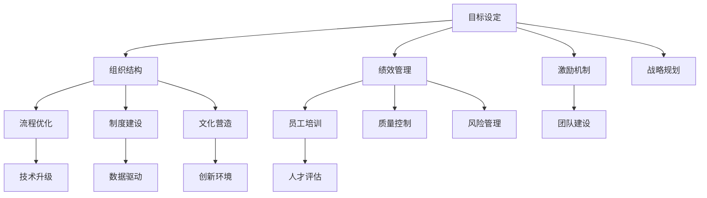

                 

## 1. 背景介绍

好的管理者和普通管理者之间的差距，在很大程度上体现在是否拥有一个完善的管理体系上。一个好的管理体系，不仅能够提升组织的执行效率和运营质量，还能够为员工提供清晰的发展方向和激励机制，从而形成良性的组织氛围和生产力。本文将从多个维度深入探讨管理体系的重要性，并提出构建有效管理体系的具体建议。

## 2. 核心概念与联系

### 2.1 核心概念概述

管理是一个涉及组织、领导、激励、控制等多个层面的复杂过程。管理体系作为管理的核心工具，包括但不限于组织结构、流程、制度、文化等方面。一个好的管理体系，能够为组织提供一个规范化的工作环境，使各个部门和员工能够高效协作，实现组织目标。

### 2.2 核心概念原理和架构的 Mermaid 流程图



这个流程图展示了管理体系的主要组成和相互关系。

### 2.3 管理体系构建

一个完善的管理体系需要包括以下几个关键要素：

1. **目标设定**：明确组织和个人的目标，确保所有工作都有明确的方向。
2. **组织结构**：根据业务需要设计合理的组织架构，明确各个部门的职责和权限。
3. **流程优化**：设计和优化业务流程，提高工作效率和质量。
4. **制度建设**：建立和完善各类管理制度，包括但不限于考勤制度、绩效评估、奖惩机制等。
5. **文化营造**：培育和弘扬积极向上的企业文化，增强员工归属感和忠诚度。
6. **绩效管理**：通过科学的绩效管理体系，确保员工的工作成果得到公正评价。
7. **激励机制**：设计多样化的激励手段，激发员工的工作积极性和创造力。
8. **团队建设**：通过团队协作和领导力的培养，提升整体团队的能力。
9. **人才评估**：建立科学的评价体系，识别和培养高潜质人才。
10. **技术升级**：持续改进和升级技术设施，提高组织的技术水平。
11. **数据驱动**：利用数据支持决策，提高决策的科学性和准确性。
12. **创新环境**：营造开放创新的工作氛围，鼓励员工提出新思路和解决方案。
13. **质量控制**：建立严格的质量管理体系，确保产品和服务的质量。
14. **风险管理**：识别和控制各类风险，确保组织的稳定运营。
15. **战略规划**：制定和实施长期战略规划，确保组织的可持续发展。

## 3. 核心算法原理 & 具体操作步骤

### 3.1 算法原理概述

管理体系构建的本质是一个复杂的系统工程，涉及多种资源的整合和优化。其核心算法原理可以归纳为以下几个方面：

1. **目标一致性算法**：确保组织和个人目标的一致性，通过目标分解和对齐，形成共同的努力方向。
2. **流程优化算法**：通过分析和优化业务流程，提高组织的执行效率和质量。
3. **数据驱动算法**：利用数据支持决策，提高管理决策的科学性和准确性。
4. **激励和绩效算法**：设计和实施有效的激励和绩效评估机制，激发员工的工作热情和创造力。

### 3.2 算法步骤详解

#### 步骤1：目标设定

1. **确定总体目标**：根据组织愿景和使命，设定明确的总体目标。
2. **分解目标**：将总体目标分解为具体的工作目标和绩效指标。
3. **对齐目标**：确保各个部门和团队的目标与总体目标一致。

#### 步骤2：组织结构设计

1. **功能划分**：根据业务需求，划分部门和职能。
2. **层级设计**：确定管理层级和职责范围。
3. **关系定义**：明确各部门和员工之间的协作和汇报关系。

#### 步骤3：流程优化

1. **业务流程分析**：分析和梳理现有业务流程，识别瓶颈和问题。
2. **流程优化**：设计和优化业务流程，提高效率和质量。
3. **流程执行**：实施优化后的流程，并进行持续改进。

#### 步骤4：制度建设

1. **制度设计**：根据业务需要，设计各类管理制度。
2. **制度实施**：制定制度执行流程，确保制度的有效落地。
3. **制度评审**：定期评审和优化制度，确保其适应性。

#### 步骤5：文化营造

1. **价值观塑造**：定义和弘扬积极向上的企业文化价值观。
2. **员工参与**：鼓励员工积极参与企业文化建设。
3. **文化传播**：通过多种渠道传播企业文化，形成组织共识。

#### 步骤6：绩效管理

1. **绩效指标设定**：制定科学的绩效评估指标。
2. **绩效评估**：定期进行绩效评估，提供反馈和改进建议。
3. **绩效激励**：根据绩效评估结果，实施奖励和激励措施。

#### 步骤7：激励机制设计

1. **激励手段**：设计多样化的激励手段，如薪酬福利、晋升机会等。
2. **激励政策**：制定激励政策，确保激励措施的公平性和合理性。
3. **激励实施**：根据政策实施激励措施，激发员工积极性。

#### 步骤8：团队建设

1. **团队组建**：根据业务需求组建团队，明确团队目标和角色。
2. **领导力培养**：加强团队领导力的培养，提升团队管理水平。
3. **团队协作**：促进团队成员之间的沟通和协作，形成高效的团队。

#### 步骤9：人才评估

1. **人才识别**：识别和发掘高潜质人才。
2. **人才培养**：制定人才培养计划，提升人才能力。
3. **人才保留**：通过激励和职业发展路径，留住优秀人才。

#### 步骤10：技术升级

1. **技术需求分析**：根据业务发展需求，分析技术升级的必要性。
2. **技术规划**：制定技术升级路线图，明确技术目标和实施步骤。
3. **技术实施**：推进技术升级项目，确保技术设施的现代化。

#### 步骤11：数据驱动

1. **数据收集**：收集和整理各类业务数据。
2. **数据分析**：利用数据分析技术，挖掘数据价值。
3. **数据应用**：将数据分析结果应用于决策和管理，提高决策科学性。

#### 步骤12：创新环境营造

1. **创新文化**：营造开放创新的工作氛围，鼓励员工提出创新建议。
2. **创新机制**：建立创新的激励和支持机制，推动创新成果转化。
3. **创新实践**：实施创新项目，推动组织的创新发展。

#### 步骤13：质量控制

1. **质量管理体系建立**：制定和实施质量管理体系，确保产品和服务的质量。
2. **质量监控**：建立质量监控机制，持续改进产品和服务的质量。
3. **质量评估**：定期进行质量评估，确保质量管理体系的有效性。

#### 步骤14：风险管理

1. **风险识别**：识别各类潜在风险。
2. **风险评估**：对识别出的风险进行评估，确定风险程度。
3. **风险控制**：制定风险控制措施，降低风险影响。

#### 步骤15：战略规划

1. **战略制定**：根据组织愿景和市场需求，制定长期战略规划。
2. **战略实施**：制定和实施战略行动计划，确保战略目标的实现。
3. **战略调整**：根据战略实施情况，调整和优化战略规划。

### 3.3 算法优缺点

管理体系构建的算法优点包括：

1. **系统性**：通过系统的管理体系，实现各个要素的协调和优化。
2. **科学性**：利用数据和分析技术，提高管理的科学性和准确性。
3. **可操作性**：将管理体系转化为具体的执行步骤，便于实施。

其缺点主要体现在：

1. **复杂性**：管理体系涉及多个环节，设计和实施过程较为复杂。
2. **资源投入**：管理体系构建需要投入大量人力、物力和时间。
3. **灵活性不足**：管理体系的设计和实施过程较为固定，难以快速适应变化。

### 3.4 管理体系应用领域

管理体系在多个领域都有广泛应用，包括但不限于：

1. **制造业**：通过优化生产流程、提升质量控制，提高生产效率和产品质量。
2. **金融业**：通过建立风险管理体系，确保金融产品的安全性和稳定性。
3. **零售业**：通过优化供应链管理和客户服务流程，提升客户体验和销售效率。
4. **医疗业**：通过优化医疗流程和质量管理，提高医疗服务质量和患者满意度。
5. **教育业**：通过建立科学的教育管理体系，提升教学质量和学生发展水平。
6. **政府机构**：通过优化行政流程和提升服务质量，提高政府服务效率和公众满意度。

## 4. 数学模型和公式 & 详细讲解 & 举例说明

### 4.1 数学模型构建

管理体系的构建可以抽象为以下几个数学模型：

1. **目标一致性模型**：
   $$
   \text{Consistency} = \sum_{i=1}^n (A_i \times B_i)
   $$
   其中 $A_i$ 表示第 $i$ 个部门的目标，$B_i$ 表示与总体目标的一致性系数。

2. **流程优化模型**：
   $$
   \text{Efficiency} = \frac{\sum_{i=1}^n (F_i \times E_i)}{\sum_{i=1}^n F_i}
   $$
   其中 $F_i$ 表示第 $i$ 个流程的效率，$E_i$ 表示流程优化后的效率提升。

3. **数据驱动模型**：
   $$
   \text{Data-Driven} = \frac{\sum_{i=1}^n (D_i \times O_i)}{\sum_{i=1}^n D_i}
   $$
   其中 $D_i$ 表示第 $i$ 个决策的数据支持程度，$O_i$ 表示决策的优化效果。

### 4.2 公式推导过程

以目标一致性模型为例，推导过程如下：

设总体目标为 $A$，部门目标为 $B_1, B_2, ..., B_n$。目标一致性系数为 $C_i$，表示第 $i$ 个部门目标与总体目标的一致性程度。则目标一致性模型为：
$$
\text{Consistency} = \sum_{i=1}^n (A_i \times C_i)
$$
其中 $C_i$ 可通过目标对齐矩阵计算得到：
$$
C_i = \frac{\sum_{j=1}^n A_j \times B_i}{\sqrt{\sum_{j=1}^n A_j^2} \times \sqrt{\sum_{j=1}^n B_i^2}}
$$
$$
\text{Consistency} = \sum_{i=1}^n \frac{A_i \times \sum_{j=1}^n A_j \times B_i}{\sqrt{\sum_{j=1}^n A_j^2} \times \sqrt{\sum_{j=1}^n B_i^2}}
$$

### 4.3 案例分析与讲解

#### 案例一：某制造企业的管理体系构建

某制造企业通过以下步骤构建了其管理体系：

1. **目标设定**：总体目标为提升生产效率和产品质量。
2. **组织结构设计**：划分生产、质量、销售等部门，明确各部门职责。
3. **流程优化**：分析现有生产流程，优化生产调度、物料管理等环节。
4. **制度建设**：制定和实施考勤制度、绩效评估制度、质量控制制度等。
5. **文化营造**：弘扬精益求精的企业精神，鼓励员工创新和改进。
6. **绩效管理**：建立科学的绩效评估体系，定期进行绩效评估。
7. **激励机制设计**：设计薪酬福利、晋升机会等激励措施。
8. **团队建设**：组建跨部门团队，加强团队协作和领导力培养。
9. **人才评估**：识别和培养高潜质人才，提升人才能力。
10. **技术升级**：推进自动化生产线建设，提升技术水平。
11. **数据驱动**：利用数据分析提升决策科学性，优化生产流程。
12. **创新环境营造**：营造开放创新的工作氛围，推动技术创新。
13. **质量控制**：建立严格的质量管理体系，确保产品质量。
14. **风险管理**：识别和控制供应链、生产等方面的风险。
15. **战略规划**：制定和实施长期战略规划，确保可持续发展。

通过这些步骤，该制造企业实现了生产效率和产品质量的显著提升，同时增强了员工的归属感和忠诚度，形成了良好的组织氛围。

## 5. 项目实践：代码实例和详细解释说明

### 5.1 开发环境搭建

管理体系构建的开发环境主要依赖于各种管理工具和软件，如项目管理工具（如JIRA）、数据管理工具（如Tableau）、协作工具（如Confluence）等。以下是搭建开发环境的步骤：

1. **安装项目管理工具**：下载并安装JIRA，用于项目管理和任务跟踪。
2. **配置项目计划**：在JIRA中创建项目，设定项目目标、里程碑和任务。
3. **集成数据管理工具**：将Tableau与JIRA集成，利用数据可视化功能进行数据驱动决策。
4. **使用协作工具**：通过Confluence创建文档和知识库，促进团队协作和知识共享。

### 5.2 源代码详细实现

管理体系构建的代码实现主要涉及项目管理、数据分析和协作工具的使用。以下是具体的实现步骤：

1. **项目管理代码**：
   ```python
   from jira import Jira
   jira = Jira('https://your.jira.com', username='your_username', password='your_password')
   project = jira.project('your_project')
   ```

2. **数据分析代码**：
   ```python
   import pandas as pd
   import numpy as np
   data = pd.read_csv('data.csv')
   summary_stats = data.describe()
   ```

3. **协作工具代码**：
   ```python
   from pyconfluence import PyConfluence
   confluence = PyConfluence('https://your.confluence.com', username='your_username', password='your_password')
   page = confluence.create_page('your_page', 'Your Page Content')
   ```

### 5.3 代码解读与分析

在管理体系构建的代码实现中，项目管理工具JIRA主要用于任务跟踪和进度管理，数据分析工具Pandas用于数据处理和统计分析，协作工具PyConfluence用于文档管理和知识共享。

### 5.4 运行结果展示

通过上述代码，可以在JIRA中创建和管理项目，在Pandas中处理和分析数据，在PyConfluence中创建和共享文档，从而实现管理体系的全面构建和实施。

## 6. 实际应用场景

### 6.1 制造业

在制造业中，通过建立完善的管理体系，可以有效提升生产效率和产品质量，降低生产成本，增强市场竞争力。具体应用场景包括：

- **流程优化**：优化生产流程，提高生产效率。
- **质量控制**：建立严格的质量管理体系，确保产品质量。
- **数据驱动**：利用数据分析技术，优化生产调度和管理决策。

### 6.2 金融业

在金融业中，通过建立完善的风险管理体系，可以有效控制金融产品的风险，保障金融安全。具体应用场景包括：

- **风险识别**：识别各类潜在风险，制定风险控制策略。
- **风险评估**：对识别出的风险进行评估，确定风险程度。
- **风险控制**：制定和实施风险控制措施，降低风险影响。

### 6.3 零售业

在零售业中，通过建立完善的管理体系，可以有效提升客户体验和销售效率，增加市场份额。具体应用场景包括：

- **供应链管理**：优化供应链流程，提高物流效率。
- **客户服务**：建立高效的客户服务体系，提升客户满意度。
- **数据分析**：利用数据分析技术，优化销售策略和产品推荐。

### 6.4 医疗业

在医疗业中，通过建立完善的质量管理体系，可以有效提升医疗服务质量，保障患者安全。具体应用场景包括：

- **流程优化**：优化医疗流程，提高诊疗效率。
- **质量控制**：建立严格的质量管理体系，确保诊疗质量。
- **数据分析**：利用数据分析技术，优化医疗决策和资源分配。

### 6.5 教育业

在教育业中，通过建立完善的教育管理体系，可以有效提升教学质量和学生发展水平，满足社会需求。具体应用场景包括：

- **教师管理**：优化教师管理流程，提高教师工作效率。
- **学生评估**：建立科学的评估体系，提升学生学习效果。
- **资源整合**：整合各类教育资源，提供优质教育服务。

### 6.6 政府机构

在政府机构中，通过建立完善的管理体系，可以有效提升政府服务效率和公众满意度，增强政府公信力。具体应用场景包括：

- **行政流程优化**：优化行政流程，提高服务效率。
- **公众服务**：建立高效的公众服务体系，提升公众满意度。
- **数据应用**：利用数据分析技术，优化公共决策和资源分配。

## 7. 工具和资源推荐

### 7.1 学习资源推荐

1. **《管理学原理》**：经典管理学教材，全面介绍管理学的基本原理和方法。
2. **《高效能人士的七个习惯》**：史蒂芬·柯维的畅销书籍，通过七个习惯提升个人和组织效能。
3. **Coursera《管理学》课程**：由耶鲁大学开设的管理学课程，涵盖管理学基本理论和实践。
4. **TED Talks《好的管理之道》**：多位知名管理专家在TED上的演讲，分享管理经验和见解。
5. **《管理学的艺术》**：经典管理学著作，从艺术的角度探讨管理学的应用。

### 7.2 开发工具推荐

1. **JIRA**：项目管理工具，支持任务跟踪、进度管理、团队协作等功能。
2. **Tableau**：数据可视化工具，支持数据驱动决策。
3. **Confluence**：协作工具，支持文档管理和知识共享。
4. **Microsoft Project**：项目管理软件，支持项目计划和进度跟踪。
5. **Google Analytics**：数据分析工具，支持用户行为分析和数据挖掘。

### 7.3 相关论文推荐

1. **《精益管理与六西格玛》**：介绍精益管理和六西格玛在企业管理中的应用。
2. **《组织行为学》**：研究组织行为和人际关系的管理学著作。
3. **《大数据与企业管理》**：探讨大数据在企业管理中的应用。
4. **《跨文化管理》**：研究跨文化环境下企业管理的理论和实践。
5. **《组织设计与创新》**：探讨组织设计和创新在企业管理中的应用。

## 8. 总结：未来发展趋势与挑战

### 8.1 研究成果总结

管理体系构建是现代企业管理的重要组成部分，其重要性体现在多个方面：

1. **提升组织效率**：通过目标设定、流程优化等手段，提升组织的执行效率和运营质量。
2. **增强员工激励**：通过激励机制和绩效管理，激发员工的工作热情和创造力。
3. **促进文化建设**：通过企业文化营造，增强员工的归属感和忠诚度。
4. **优化资源配置**：通过数据分析和资源配置，提高资源利用效率。
5. **应对市场变化**：通过战略规划和风险管理，应对市场变化和外部环境的不确定性。

### 8.2 未来发展趋势

管理体系的未来发展趋势包括：

1. **数字化转型**：通过数字化工具和平台，提升管理体系的效率和灵活性。
2. **智能化管理**：利用AI和大数据技术，实现智能化的管理和决策。
3. **多部门协同**：加强跨部门协作，提升整体管理和运营水平。
4. **全球化管理**：适应全球化环境，提升跨国管理和国际化水平。
5. **可持续发展**：注重环境保护和社会责任，推动可持续发展管理。

### 8.3 面临的挑战

管理体系构建在实践中仍面临诸多挑战：

1. **资源投入**：管理体系的构建需要投入大量人力、物力和时间。
2. **文化差异**：不同组织和文化背景下，管理体系的设计和实施存在差异。
3. **数据质量**：管理体系依赖于数据支持，数据质量直接影响管理决策。
4. **变革阻力**：员工对管理体系变革的接受度和适应度，直接影响管理体系的实施效果。
5. **持续改进**：管理体系需要持续改进和优化，以适应不断变化的业务需求。

### 8.4 研究展望

未来，管理体系的研究将从以下几个方向进行：

1. **跨学科融合**：结合心理学、社会学等学科的理论和方法，提升管理体系的科学性和人文性。
2. **多领域应用**：将管理体系的理论和方法应用于更多领域，如医疗、教育、金融等。
3. **技术创新**：利用AI和大数据技术，推动管理体系的数字化和智能化。
4. **全球化管理**：适应全球化环境，提升跨国管理和国际化水平。
5. **可持续发展**：注重环境保护和社会责任，推动可持续发展管理。

## 9. 附录：常见问题与解答

### 9.1 Q1：管理体系如何影响组织绩效？

**A1**：管理体系通过优化组织流程、提升员工激励、促进文化建设等手段，显著提升组织绩效。具体而言：

1. **流程优化**：通过流程优化，提升执行效率，减少资源浪费。
2. **员工激励**：通过激励机制和绩效管理，激发员工积极性和创造力。
3. **文化建设**：通过企业文化营造，增强员工归属感和忠诚度。

这些措施共同作用，使得组织在效率、质量、员工满意度等方面得到显著提升，从而实现组织绩效的全面提升。

### 9.2 Q2：管理体系是否适用于所有组织？

**A2**：管理体系的构建需要考虑组织的特点和需求，并非适用于所有组织。对于小型组织，可能需要简化管理体系，避免过于复杂的流程和制度。而对于大型组织，则需要更为细致和全面的管理体系。

### 9.3 Q3：管理体系构建的难点在哪里？

**A3**：管理体系构建的难点在于：

1. **跨部门协作**：不同部门之间的协作和沟通是管理体系构建中的重要环节，需要建立有效的沟通机制。
2. **数据质量**：管理体系依赖于数据支持，数据的质量直接影响管理决策。
3. **变革管理**：管理体系的变革需要得到全体员工的认可和支持，需要进行有效的变革管理。

### 9.4 Q4：如何评估管理体系的效果？

**A4**：管理体系的效果评估可以从以下几个方面进行：

1. **绩效指标**：设定科学的绩效评估指标，定期进行评估和改进。
2. **员工满意度**：通过员工满意度调查，了解员工对管理体系的接受度和认可度。
3. **客户反馈**：通过客户反馈，了解客户对组织服务质量和效率的评价。

通过这些指标的评估，可以全面了解管理体系的效果，并进行持续改进和优化。

### 9.5 Q5：如何推动管理体系的变革？

**A5**：推动管理体系的变革需要从以下几个方面入手：

1. **领导支持**：高层领导的支持和参与是管理体系变革成功的关键。
2. **员工参与**：通过培训和激励，提高员工对管理体系变革的认同和支持。
3. **持续改进**：定期评估和优化管理体系，确保其适应性。
4. **技术支持**：利用数字化工具和平台，提升管理体系的效率和灵活性。

通过这些措施，可以有效推动管理体系的变革，实现组织的持续发展。

---

作者：禅与计算机程序设计艺术 / Zen and the Art of Computer Programming

