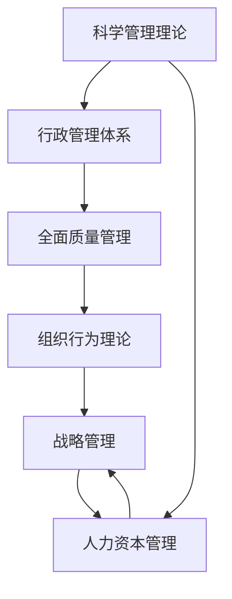

                 

# 如何从经典中汲取管理智慧

## 1. 背景介绍

### 1.1 问题由来

在管理领域，经典理论和管理实践之间的联系一直是学术界和实务界关注的焦点。随着全球化和数字化的快速发展，企业管理环境变得日益复杂多变，新的管理挑战不断涌现。在这样的背景下，传统经典管理理论如何帮助现代管理者做出有效决策，如何从历史中汲取智慧，成为了亟待回答的问题。

### 1.2 问题核心关键点

管理智慧的汲取需要从以下几个方面进行：

- **经典理论的挖掘**：梳理历史上的经典管理理论，如泰勒的科学管理理论、马克斯·韦伯的行政管理体系、戴明的全面质量管理等，理解其核心思想和实际应用场景。
- **实践经验的总结**：通过案例分析和实证研究，了解经典理论在现代企业的应用效果，识别其局限性。
- **未来发展的展望**：结合当前管理实践，分析经典管理理论的现代意义，探索如何在新环境下加以改进和创新。

### 1.3 问题研究意义

从经典中汲取管理智慧，对现代管理者而言具有重要意义：

1. **提高决策水平**：经典管理理论提供了经过时间验证的管理框架和工具，可以帮助管理者在复杂多变的环境下做出更科学、合理的决策。
2. **增强问题解决能力**：了解历史上的管理挑战和解决方案，管理者可以在面对类似问题时，快速定位问题的本质，找到合适的应对策略。
3. **促进创新思维**：通过对经典理论的深入理解，管理者可以从中获得启发，创新性地解决现代管理问题，推动企业的持续发展。
4. **提升组织效能**：经典理论中蕴含的科学方法和高效管理实践，有助于提升组织的运营效率和市场竞争力。

## 2. 核心概念与联系

### 2.1 核心概念概述

在管理智慧的汲取过程中，以下几个核心概念尤为关键：

- **科学管理理论**：由弗雷德里克·泰勒提出，强调效率、标准化和劳动分工，认为管理是科学而非艺术。
- **行政管理体系**：由马克斯·韦伯提出，强调层级、权威和规则，认为组织应基于法理型权威进行管理。
- **全面质量管理(TQM)**：由戴明提出，强调质量控制、员工参与和持续改进，认为质量是管理的核心。
- **组织行为理论**：研究个体、团队和组织的行为，理解如何通过组织设计和激励机制提升组织效能。
- **战略管理**：从外部环境分析和内部资源评估出发，制定和实施企业战略，确保长期发展。
- **人力资本管理**：重视人力资源的开发和利用，关注员工的能力提升和职业发展。

这些经典管理理论通过不同的视角和方法，共同构建起现代企业管理的基础框架。理解它们之间的关系，有助于管理者全面掌握管理智慧。

### 2.2 核心概念原理和架构的 Mermaid 流程图



这个流程图展示了经典管理理论之间的联系和相互影响：

1. **科学管理理论**为基础，通过提高生产效率和管理效率，为其他理论的实施提供了条件。
2. **行政管理体系**在科学管理的基础上，通过规范组织结构和层级管理，进一步提升管理效能。
3. **全面质量管理**在前两者基础上，通过质量控制和持续改进，增强组织的市场竞争力。
4. **组织行为理论**研究个体和团队行为，为其他理论提供人员和心理方面的支持。
5. **战略管理**综合内部资源和外部环境，指导企业的长期发展。
6. **人力资本管理**关注人才的开发和利用，确保其他理论的实施和持续改进。

## 3. 核心算法原理 & 具体操作步骤

### 3.1 算法原理概述

从经典中汲取管理智慧，本质上是应用历史上的管理理论和方法，结合当前的管理实践，进行系统化的学习、理解和创新。这一过程可以分为以下几个步骤：

1. **理论学习**：深入研究经典管理理论的核心理念和应用方法。
2. **案例分析**：通过实际案例了解经典理论的实际应用效果和局限性。
3. **实践改进**：结合当前管理实践，创新性地应用经典理论，进行管理创新。
4. **持续优化**：通过反馈和迭代，持续改进管理策略，确保理论和方法的适用性。

### 3.2 算法步骤详解

以下是详细的算法步骤：

#### 第一步：理论学习

1. **选择合适的经典理论**：根据企业的实际情况和面临的问题，选择合适的经典管理理论。例如，在面临生产效率低下时，可以学习科学管理理论；在组织结构复杂时，可以学习行政管理体系。
2. **深入理解理论核心**：通过阅读经典文献、参加培训课程等方式，深入理解理论的核心思想和方法。

#### 第二步：案例分析

1. **搜集案例数据**：从企业档案、学术文献、行业报告等渠道搜集经典管理理论的实际应用案例。
2. **分析案例效果**：通过数据分析和案例研究，识别经典理论在具体应用中的效果和局限性。例如，泰勒的科学管理理论在提升生产效率方面的优势，但在员工参与和心理健康方面的不足。

#### 第三步：实践改进

1. **结合当前实践**：将经典理论应用到当前管理实践中，结合现代技术和工具进行改进。例如，利用大数据和AI技术提升全面质量管理的效果。
2. **创新管理方法**：在经典理论的基础上，结合现代管理实践，进行创新。例如，引入精益管理、敏捷开发等现代管理方法，优化生产流程和组织结构。

#### 第四步：持续优化

1. **建立反馈机制**：通过定期反馈和评估，识别管理实践中的问题和改进空间。
2. **持续改进管理策略**：根据反馈结果，不断优化管理策略，确保理论和方法的适应性。

### 3.3 算法优缺点

从经典中汲取管理智慧，具有以下优点：

- **科学性**：经典管理理论经过历史验证，具有较高的科学性和可靠性。
- **系统性**：经典理论提供了系统的管理框架和方法，有助于管理者全面掌握管理智慧。
- **可操作性**：经典理论通常包含具体的操作方法和步骤，易于在实践中应用。

同时，这种方法也存在一定的局限性：

- **理论适用性**：经典理论往往基于特定的历史背景和环境，可能不完全适用于现代管理实践。
- **创新不足**：过于依赖经典理论，可能忽视了现代管理实践中的创新需求。
- **复杂性**：经典理论通常较为复杂，需要较高的理论水平和实践经验。

### 3.4 算法应用领域

经典管理理论在多个领域得到了广泛应用，例如：

- **制造业**：通过科学管理和全面质量管理，提升生产效率和产品质量。
- **服务业**：通过组织行为理论和行政管理体系，优化服务流程和客户体验。
- **金融业**：通过战略管理和风险管理，提高金融服务的稳定性和安全性。
- **医疗健康**：通过全面质量管理和组织行为理论，提升医疗服务的质量和患者满意度。

## 4. 数学模型和公式 & 详细讲解 & 举例说明

### 4.1 数学模型构建

从经典中汲取管理智慧，通常不需要使用复杂的数学模型。但在某些特殊情况下，可以通过数学模型来辅助理解和管理决策。例如，可以使用线性规划模型来优化资源配置，使用统计模型来评估管理效果。

### 4.2 公式推导过程

以科学管理理论为例，泰勒提出的时间研究法可以用以下数学公式表示：

$$
\text{工时} = \text{单位操作时间} \times \text{完成操作次数}
$$

其中，单位操作时间是指完成一个操作所需的平均时间，完成操作次数是指在一定时间内可以完成的操作数量。通过测量和分析，可以优化工时分配，提高生产效率。

### 4.3 案例分析与讲解

假设某工厂生产某种产品，平均每个产品的生产时间为5小时，每天工作8小时，工人完成产品数量需要1000个。根据时间研究法，可以计算出每个工人在一天内可以完成的操作次数，进而优化生产流程和工人安排。

## 5. 项目实践：代码实例和详细解释说明

### 5.1 开发环境搭建

在实践管理智慧的汲取过程中，不需要编写大量的代码。但在某些情况下，可以使用编程工具来辅助数据分析和管理决策。以下是Python和R语言在管理分析中的简单应用：

- **Python**：使用pandas库进行数据处理，使用matplotlib和seaborn库进行数据可视化。
- **R语言**：使用ggplot2进行数据可视化，使用dplyr进行数据操作。

### 5.2 源代码详细实现

以下是一个使用Python的简单示例，展示如何使用pandas库进行数据处理：

```python
import pandas as pd

# 读取数据
data = pd.read_csv('production_data.csv')

# 计算每个工人的生产效率
data['worker_efficiency'] = data['total_production'] / data['total_hours']

# 计算每个工人的平均生产时间
data['average_time_per_unit'] = data['total_hours'] / data['total_production']

# 输出结果
print(data['worker_efficiency'].head())
```

### 5.3 代码解读与分析

在这个简单的代码示例中，通过pandas库读取生产数据，计算每个工人的生产效率和平均生产时间，并输出结果。这可以帮助管理者识别生产流程中的瓶颈和优化空间。

### 5.4 运行结果展示

运行上述代码后，可以得到每个工人的生产效率和平均生产时间，为管理决策提供数据支持。

## 6. 实际应用场景

### 6.1 制造业

在制造业中，科学管理理论和全面质量管理得到了广泛应用。通过科学管理，企业可以优化生产流程，提高生产效率。通过全面质量管理，企业可以提升产品质量，增强市场竞争力。

### 6.2 服务业

在服务业中，组织行为理论和行政管理体系的应用尤为显著。通过改善组织结构和人员管理，提升服务流程和客户体验，是企业提升市场竞争力的关键。

### 6.3 金融业

在金融业中，战略管理和风险管理是核心。通过制定和实施长期战略，企业可以抵御市场风险，实现可持续发展。

### 6.4 医疗健康

在医疗健康领域，全面质量管理和组织行为理论得到了广泛应用。通过提升医疗服务的质量和患者满意度，企业可以增强市场影响力。

## 7. 工具和资源推荐

### 7.1 学习资源推荐

为了帮助管理者更好地理解经典管理理论，推荐以下学习资源：

1. **经典文献**：阅读泰勒、韦伯、戴明等经典管理理论家的原始文献，了解其核心理念和应用方法。
2. **学术课程**：参加由知名大学和机构开设的管理课程，系统学习经典管理理论和方法。
3. **在线平台**：利用Coursera、edX等在线学习平台，获取经典管理理论的实践应用案例。

### 7.2 开发工具推荐

在实践中，可以使用以下工具来辅助管理决策：

- **数据分析工具**：使用Excel、Google Sheets、Tableau等工具进行数据处理和可视化。
- **项目管理工具**：使用Asana、Trello等工具进行项目管理和任务分配。
- **文档协作工具**：使用Confluence、Google Docs等工具进行团队协作和知识共享。

### 7.3 相关论文推荐

以下是几篇经典的管理学论文，推荐阅读：

1. 《科学管理原理》（Frederick Taylor）：介绍了科学管理的核心理念和应用方法。
2. 《行政组织体系理论》（Max Weber）：阐述了组织管理的层级和权威体系。
3. 《全面质量管理》（W. Edwards Deming）：介绍了质量控制和持续改进的方法。
4. 《组织行为学》（George C. Homans）：研究个体和组织行为，提供组织设计和管理建议。

## 8. 总结：未来发展趋势与挑战

### 8.1 研究成果总结

从经典中汲取管理智慧，已取得了显著成果。经典管理理论提供了系统的管理框架和方法，有助于提升企业管理水平。但在实际应用中也暴露了一些问题，如理论适用性和创新不足等。

### 8.2 未来发展趋势

展望未来，从经典中汲取管理智慧将呈现以下几个趋势：

1. **跨学科融合**：经典管理理论将与其他学科（如社会学、心理学、工程学）进行融合，形成更加全面的管理智慧。
2. **数据驱动管理**：通过大数据和AI技术，优化管理决策，提升管理效率。
3. **全球化视野**：结合全球化管理实践，提升企业的国际化水平。
4. **可持续发展**：结合可持续发展理念，推动企业实现环境和社会责任。

### 8.3 面临的挑战

在汲取管理智慧的过程中，仍面临以下挑战：

1. **理论与实践的脱节**：经典管理理论可能与现代管理实践存在一定的脱节，需要进一步验证和改进。
2. **复杂性增加**：现代管理环境变得更加复杂，经典理论的应用需要考虑更多的因素。
3. **创新需求增加**：现代管理需要更多创新，经典理论可能无法完全满足当前需求。

### 8.4 研究展望

未来的研究可以从以下几个方面进行：

1. **理论创新**：结合现代管理实践，对经典管理理论进行创新，提出新的管理模型和方法。
2. **方法改进**：改进经典管理理论的应用方法，使其更适应现代管理环境。
3. **技术融合**：将大数据、AI等技术引入管理决策，提升管理效果。

## 9. 附录：常见问题与解答

**Q1：如何评价经典管理理论的适用性？**

A: 评价经典管理理论的适用性需要考虑多个因素：

1. **环境匹配**：评估理论所基于的历史环境和现代环境的匹配程度。
2. **效果评估**：通过案例研究和实证分析，评估理论在实际应用中的效果。
3. **局限性分析**：识别理论的局限性，结合现代管理实践进行改进。

**Q2：如何结合现代技术应用经典管理理论？**

A: 结合现代技术应用经典管理理论，可以从以下几个方面入手：

1. **数据分析**：利用大数据和AI技术，进行数据处理和分析，优化管理决策。
2. **系统优化**：使用项目管理工具和文档协作工具，提高团队协作和知识共享效率。
3. **知识管理**：通过知识管理平台，收集和整理管理知识，形成知识库，提升企业学习能力。

**Q3：如何处理理论与实践的脱节问题？**

A: 处理理论与实践的脱节问题，可以从以下几个方面进行：

1. **案例研究**：通过深入研究实际案例，理解经典理论在现代管理实践中的应用效果和局限性。
2. **理论改进**：结合现代管理实践，对经典理论进行改进和创新，使其更适应现代管理环境。
3. **多学科融合**：结合其他学科的理论和方法，进行跨学科研究，提升管理智慧的全面性。

**Q4：如何提升管理理论的创新性？**

A: 提升管理理论的创新性，可以从以下几个方面进行：

1. **跨学科研究**：结合社会学、心理学、工程学等学科，进行跨学科研究，提出新的管理模型和方法。
2. **数据驱动决策**：利用大数据和AI技术，优化管理决策，提升管理效率。
3. **持续学习**：通过持续学习和不断实践，不断积累管理经验，提升创新能力。

通过不断优化和改进，管理者可以更好地从经典中汲取管理智慧，提升企业的竞争力。相信随着管理实践的不断发展和理论研究的不断深入，从经典中汲取管理智慧将变得更加系统和有效。

---

作者：禅与计算机程序设计艺术 / Zen and the Art of Computer Programming

