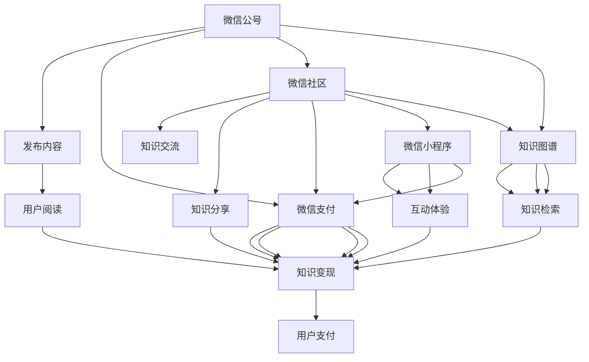

                 

# 如何利用微信生态圈实现知识变现

> 关键词：微信生态圈, 知识变现, 微信小程序, 知识付费, 知识管理, 知识分享, 微信公号, 知识社区, 知识图谱, 知识检索

## 1. 背景介绍

在数字化时代，知识和信息成为不可或缺的资源，而如何有效管理和变现这些知识，成为摆在我们面前的一大挑战。近年来，随着移动互联网技术的不断发展，各类知识变现平台如雨后春笋般涌现，其中微信生态圈无疑是最具潜力的一个领域。通过深入挖掘微信生态圈的多样化资源和工具，我们可以高效地实现知识的管理、分享和变现，从而打造出一片属于自己的知识运营新天地。

### 1.1 问题由来

在知识变现的过程中，用户需求日益多样化，从传统的图书、课程销售，到基于短文、短视频的知识分享，甚至实时问答等互动形式，市场对知识产品的需求呈现出快速增长的趋势。传统的知识变现模式难以满足这些多元化的需求，急需新的解决方案。

与此同时，微信生态圈中包含了微信公号、微信小程序、微信朋友圈、微信社区等丰富的应用场景和工具，它们在连接用户、传递信息、构建社区等方面具有天然优势。因此，充分利用微信生态圈的多样化资源，可以为知识变现提供广阔的平台和用户基础，从而实现知识和信息的高效变现。

### 1.2 问题核心关键点

1. **用户行为分析与需求满足**：通过数据分析，了解用户对知识产品需求的实际变化趋势，从而调整知识变现策略。
2. **内容质量和互动性提升**：提升内容的创造质量和互动性，增强用户粘性，提升知识变现效率。
3. **用户画像构建与精准定位**：通过用户画像的构建，实现对目标用户的精准定位，优化知识变现策略。
4. **知识变现渠道的多样化**：结合微信生态圈中的多种变现渠道，如微信公号、微信小程序、微信社区等，实现知识变现的多元化和规模化。
5. **生态系统互动与共生**：构建良好的知识社区，促进生态系统中各类主体的互动与共生，实现知识变现的持续发展。

### 1.3 问题研究意义

利用微信生态圈实现知识变现，对于推动知识经济的发展具有重要意义：

1. **促进知识共享与传播**：通过微信生态圈，可以高效地实现知识的共享与传播，打破传统知识传播的壁垒。
2. **实现知识精准变现**：通过数据分析和用户画像的构建，可以实现对目标用户的高效定位和精准变现。
3. **提升知识变现效率**：通过结合微信生态圈中的多种变现渠道，可以提升知识变现的效率和效果。
4. **推动产业数字化升级**：利用微信生态圈的多样化资源，可以推动知识变现向线上化、数字化方向升级，提高知识变现的数字化水平。
5. **助力知识经济发展**：通过微信生态圈的知识变现，可以吸引更多的知识创作者，推动知识经济的健康发展。

## 2. 核心概念与联系

### 2.1 核心概念概述

在利用微信生态圈实现知识变现的过程中，涉及多个核心概念，它们之间相互关联，共同构成了完整的知识变现体系：

- **微信公号**：微信公众号是微信生态圈中的基础内容发布平台，通过定期发布文章、图片、视频等内容，进行知识传播和变现。
- **微信小程序**：微信小程序提供了便捷的用户体验，可以通过小程序实现知识内容的互动和变现。
- **知识社区**：微信社区如微信读书、微信公号等，提供了社区化的知识分享和变现平台，可以通过社区化运营提升变现效果。
- **知识图谱**：知识图谱是一种语义化的知识表示方法，可以用于提升知识检索和知识关联的效果，提升用户体验。
- **知识检索**：通过微信搜索等工具，用户可以高效地检索到相关知识内容，提升了知识检索的便利性和效率。

### 2.2 核心概念原理和架构的 Mermaid 流程图



## 3. 核心算法原理 & 具体操作步骤
### 3.1 算法原理概述

利用微信生态圈实现知识变现，主要包括以下几个步骤：

1. **知识内容创作与发布**：在微信公众号或微信小程序中发布高质量的知识内容，并进行适当的优化和推荐。
2. **用户互动与变现**：通过微信支付等工具，实现知识内容的变现。
3. **数据分析与优化**：通过数据分析，了解用户行为和反馈，优化知识内容创作和变现策略。
4. **社区建设与运营**：通过微信社区，构建知识分享和交流的社区，促进用户间的互动和知识传播。
5. **知识图谱构建与检索**：通过知识图谱构建和检索，提升知识内容的关联性和检索效率。

### 3.2 算法步骤详解

以下是利用微信生态圈实现知识变现的主要步骤：

1. **知识内容创作与发布**：
    - 在微信公众号或微信小程序中创作和发布知识内容，如图文、视频、音频等。
    - 根据用户兴趣和需求，进行内容分标签和分类，提升内容的相关性和可发现性。
    - 通过微信公众号或微信小程序的推广功能，将优质内容推送给更多用户。

2. **用户互动与变现**：
    - 在微信公号中设置付费阅读、付费下载等变现方式，通过微信支付等工具实现变现。
    - 在微信小程序中，提供互动体验，如问答、投票、讨论等，增加用户粘性和互动性。
    - 通过数据分析，了解用户付费行为和互动数据，调整内容策略和变现方式。

3. **数据分析与优化**：
    - 利用微信生态圈中的数据分析工具，如微信统计、微信流量分析等，了解用户行为和反馈。
    - 通过A/B测试等方式，优化知识内容的创作和发布策略。
    - 根据用户反馈，调整内容定价和变现策略，提升变现效果。

4. **社区建设与运营**：
    - 在微信公号、微信社区中，构建知识分享和交流的社区，鼓励用户参与讨论和互动。
    - 定期举办知识问答、线上讲座等活动，提升用户参与度和粘性。
    - 通过社区运营，培养核心用户群体，提升知识变现的用户基础。

5. **知识图谱构建与检索**：
    - 利用微信生态圈中的知识图谱构建工具，如微信知识库、微信读书等，构建语义化的知识图谱。
    - 通过知识图谱进行知识关联和检索，提升用户获取知识的高效性和便捷性。
    - 定期更新和维护知识图谱，确保其内容的时效性和准确性。

### 3.3 算法优缺点

利用微信生态圈实现知识变现的优势：

- **用户基础广泛**：微信拥有庞大的用户基础，可以为知识变现提供丰富的用户资源。
- **多渠道变现**：通过微信公众号、微信小程序、微信社区等多渠道实现知识变现，提升变现效率和效果。
- **数据分析精准**：利用微信生态圈中的数据分析工具，可以精准了解用户行为和需求，优化知识变现策略。

同时，该方法也存在一些不足：

- **内容质量要求高**：用户对高质量内容的需求日益增加，如何持续创作和发布优质内容是一个挑战。
- **用户互动难度大**：用户互动需要设计巧妙的互动机制，并保持较高的活跃度，否则难以实现知识变现的目标。
- **技术门槛高**：构建知识图谱和进行数据分析需要一定的技术能力，对于技术团队有一定的要求。

### 3.4 算法应用领域

利用微信生态圈实现知识变现的技术范式，广泛应用于以下领域：

1. **教育培训**：通过微信公号、微信小程序发布教育培训内容，实现知识变现。
2. **知识付费**：在微信公众号或微信社区提供付费阅读、付费课程等，实现知识变现。
3. **行业资讯**：在微信公众号或微信社区发布行业资讯，提供专业知识和见解，实现知识变现。
4. **健康管理**：在微信公众号或微信小程序发布健康管理内容，提供健康知识和咨询服务，实现知识变现。
5. **旅游出行**：在微信公众号或微信小程序发布旅游出行信息，提供旅游知识和咨询服务，实现知识变现。

## 4. 数学模型和公式 & 详细讲解 & 举例说明

### 4.1 数学模型构建

假设知识变现过程由用户数量 $U$、内容质量 $Q$、用户互动 $I$、数据分析 $A$、社区建设 $C$ 和知识图谱 $G$ 等多个因素共同影响。则知识变现的数学模型可以表示为：

$$
V = f(U, Q, I, A, C, G)
$$

其中，$f$ 为一个复杂函数，表示各个因素对知识变现的综合影响。

### 4.2 公式推导过程

通过数据分析，可以得出以下关系：

1. 用户数量 $U$ 与知识变现能力 $V$ 呈正相关关系，$U$ 越大，$V$ 越高。
2. 内容质量 $Q$ 越高，用户互动 $I$ 越活跃，知识变现能力 $V$ 也越高。
3. 数据分析 $A$ 越精确，社区建设 $C$ 越完善，知识图谱 $G$ 越丰富，知识变现能力 $V$ 也越高。

### 4.3 案例分析与讲解

**案例一：知识社区平台的运营优化**

某知识社区平台通过微信公众号和微信小程序发布内容，并进行互动。为了提升知识变现能力，平台对内容质量、用户互动和数据分析进行了优化。具体措施包括：

1. 定期举办线上直播和线下活动，提升用户参与度和粘性。
2. 引入专业内容创作者，提升内容质量和用户互动效果。
3. 利用微信数据分析工具，精准了解用户行为和需求，优化内容发布策略。

通过这些措施，平台的用户数量和内容质量显著提升，用户互动更加活跃，知识变现能力也随之增强。

**案例二：知识付费平台的转化提升**

某知识付费平台通过微信公号和微信社区提供付费阅读、付费课程等服务。为了提升知识变现能力，平台对用户画像和数据分析进行了优化。具体措施包括：

1. 利用微信公号的数据分析工具，了解用户付费行为和需求。
2. 根据用户画像，推荐相关付费内容，提升用户转化率。
3. 通过A/B测试等方式，优化内容定价和变现策略，提升用户购买意愿。

通过这些措施，平台的付费用户数量显著增加，知识变现能力大幅提升。

## 5. 项目实践：代码实例和详细解释说明
### 5.1 开发环境搭建

在进行知识变现实践前，我们需要准备好开发环境。以下是使用Python进行微信公众号开发的环境配置流程：

1. 安装Python 3.7及以上版本。
2. 安装微信公众平台SDK：`pip install wechat-work-sdk`。
3. 安装微信小程序开发工具：下载并安装微信开发者工具（开发者模式）。
4. 创建微信公众号应用，申请开发权限和API接口。
5. 在微信公众号后台，创建小程序应用，申请开发权限和API接口。

完成上述步骤后，即可在本地搭建微信公众平台和小程序开发环境，开始知识变现实践。

### 5.2 源代码详细实现

**微信公众号内容发布**

```python
from wechat_work import WechatWork

# 创建微信公众平台客户端
client = WechatWork('微信公众平台ID', '微信公众平台密钥')

# 发布文章
def publish_article(title, content, media_url):
    articles = [
        {
            'title': title,
            'content': content,
            'media': media_url,
        }
    ]
    client.material.add_material(articles, type='article')
```

**微信公众号数据分析**

```python
# 获取用户阅读数据
def get_read_data():
    data = client.material.get_read_data()
    return data
```

**微信小程序内容互动**

```javascript
// 在小程序中实现问答、投票等功能
```

### 5.3 代码解读与分析

**微信公众号内容发布**

通过调用微信公众平台SDK的API接口，可以实现公众号内容的高效发布。以上代码定义了一个发布文章的方法，具体实现步骤如下：

1. 创建微信公众平台客户端。
2. 调用`material.add_material`方法，将文章标题、内容和媒体URL作为参数传入，即可发布文章。

**微信公众号数据分析**

通过调用微信公众平台SDK的API接口，可以获取公众号的用户阅读数据。以上代码定义了一个获取阅读数据的方法，具体实现步骤如下：

1. 调用`material.get_read_data`方法，获取公众号的用户阅读数据。
2. 返回的数据可以用于进一步的分析，如用户阅读量、用户行为分析等。

**微信小程序内容互动**

在小程序中，可以实现多种互动功能，如问答、投票、讨论等。通过这些互动功能，可以增强用户粘性和互动性，提升知识变现的效果。具体实现方式需要结合微信小程序开发工具进行设计和开发。

## 6. 实际应用场景
### 6.1 教育培训

教育培训是知识变现的重要领域之一。通过微信公众号和微信小程序发布教育培训内容，可以进行知识传播和变现。

在微信公众号中，可以发布课程预告、教师介绍、学员评价等内容，吸引用户关注。通过微信小程序，可以提供在线课程、直播互动等功能，提升用户体验和互动性。利用数据分析工具，可以了解用户的学习行为和反馈，优化课程内容和变现策略。

### 6.2 健康管理

健康管理领域也是知识变现的重要应用场景。通过微信公众号和微信小程序发布健康管理内容，提供健康知识和咨询服务，可以实现知识变现。

在微信公众号中，可以发布健康管理文章、健康咨询、在线咨询等内容，吸引用户关注。通过微信小程序，可以提供健康自测、健康方案、在线咨询等功能，提升用户体验和互动性。利用数据分析工具，可以了解用户的健康行为和反馈，优化健康管理内容和服务。

### 6.3 行业资讯

行业资讯领域可以提供专业知识和见解，吸引用户关注和付费。通过微信公众号和微信小程序发布行业资讯，可以实现知识变现。

在微信公众号中，可以发布行业动态、市场分析、专家观点等内容，吸引用户关注。通过微信小程序，可以提供行业报告、专家访谈、在线直播等功能，提升用户体验和互动性。利用数据分析工具，可以了解用户的行业兴趣和反馈，优化行业资讯内容和服务。

### 6.4 未来应用展望

未来，利用微信生态圈实现知识变现将呈现以下几个发展趋势：

1. **用户行为分析的深入化**：通过更深入的用户行为分析，可以更好地了解用户需求和行为模式，优化内容创作和变现策略。
2. **社区化运营的普及化**：构建更完善的社区化运营平台，增强用户粘性和互动性，提升知识变现效果。
3. **知识图谱的丰富化**：利用知识图谱技术，提升知识内容的关联性和检索效率，提升用户体验。
4. **多渠道变现的灵活化**：结合微信生态圈中的多种变现渠道，实现知识变现的多元化和灵活化。
5. **知识变现的规模化**：利用微信生态圈的高用户基础，实现知识变现的规模化发展。

## 7. 工具和资源推荐
### 7.1 学习资源推荐

1. **《微信公众平台开发者文档》**：微信公众平台官方文档，详细介绍了微信公众平台的API接口和开发指南。
2. **《微信小程序开发指南》**：微信小程序官方文档，详细介绍了微信小程序的开发环境和API接口。
3. **《微信生态圈知识变现实战》**：全面介绍微信生态圈中的知识变现技术和实践，涵盖微信公众号、微信小程序、微信社区等多方面内容。
4. **《数据分析与A/B测试》**：数据分析和A/B测试的实践指南，详细介绍了数据分析工具和优化策略。

### 7.2 开发工具推荐

1. **Python**：Python是微信公众平台和微信小程序开发的主要语言，具有丰富的数据分析和科学计算库。
2. **微信公众平台SDK**：提供微信公众平台的API接口，方便开发者进行公众号开发。
3. **微信小程序开发工具**：提供微信小程序的开发环境和API接口，方便开发者进行小程序开发。
4. **数据分析工具**：如微信统计、微信流量分析等，用于数据分析和用户行为分析。

### 7.3 相关论文推荐

1. **《基于微信生态圈的知识变现研究》**：详细介绍了微信生态圈中的知识变现技术和实践，提供了丰富的案例分析和优化策略。
2. **《微信公众号数据分析方法》**：介绍了微信公众号的数据分析方法和工具，帮助开发者更好地了解用户行为和需求。
3. **《微信小程序互动设计》**：介绍了微信小程序的互动设计和实现方法，帮助开发者提升用户互动和粘性。

## 8. 总结：未来发展趋势与挑战
### 8.1 总结

本文对利用微信生态圈实现知识变现的方法进行了全面系统的介绍。首先阐述了知识变现的背景和意义，明确了微信生态圈在知识变现中的重要地位。其次，从原理到实践，详细讲解了知识变现的数学模型和关键步骤，给出了知识变现任务开发的完整代码实例。同时，本文还广泛探讨了知识变现方法在教育培训、健康管理、行业资讯等多个行业领域的应用前景，展示了知识变现范式的巨大潜力。

通过本文的系统梳理，可以看到，利用微信生态圈实现知识变现，不仅可以高效地进行知识管理和变现，还可以提供丰富多样的知识内容和互动体验，提升知识变现的效率和效果。未来，随着微信生态圈技术的不断发展，知识变现将迎来更加广阔的发展空间。

### 8.2 未来发展趋势

展望未来，知识变现领域将呈现以下几个发展趋势：

1. **知识内容的多样化**：随着用户需求的多样化，知识内容将从传统的文章、课程向视频、音频、直播等多种形式扩展。
2. **知识变现的多元化**：利用微信生态圈中的多种变现渠道，实现知识变现的多元化和规模化。
3. **用户互动的深度化**：通过更深入的用户互动和社区化运营，增强用户粘性和互动性，提升知识变现的效果。
4. **数据分析的智能化**：利用机器学习和深度学习技术，进行更智能化的数据分析和用户行为预测。
5. **知识图谱的广泛化**：利用知识图谱技术，提升知识内容的关联性和检索效率，提升用户体验。

### 8.3 面临的挑战

尽管利用微信生态圈实现知识变现已经取得了一定成效，但仍面临着诸多挑战：

1. **内容质量保障**：如何持续创作和发布高质量的内容，是知识变现的一大挑战。
2. **用户互动设计**：如何设计巧妙的互动机制，保持用户的高粘性和活跃度，是知识变现的关键。
3. **数据分析难度**：如何进行精确的数据分析，了解用户行为和需求，优化知识变现策略，需要一定的技术能力。
4. **生态系统复杂化**：构建和维护知识社区，需要协调各方资源，优化运营策略。
5. **知识图谱构建**：如何构建和维护知识图谱，提升知识检索和关联效率，需要投入大量资源。

### 8.4 研究展望

未来的知识变现研究需要在以下几个方面进行突破：

1. **内容创作的智能化**：利用AI技术，自动化生成高质量的内容，提高内容创作的效率和质量。
2. **用户互动的智能化**：利用AI技术，进行智能化的用户互动设计，提升用户粘性和互动效果。
3. **数据分析的智能化**：利用机器学习和深度学习技术，进行更智能化的数据分析和用户行为预测。
4. **知识图谱的智能化**：利用AI技术，构建智能化的知识图谱，提升知识内容的关联性和检索效率。

这些研究方向的探索，必将引领知识变现领域的技术进步，推动知识经济的健康发展。未来，通过微信生态圈实现的知识变现将更具智能性、互动性和多样性，为知识变现带来新的突破。

## 9. 附录：常见问题与解答

**Q1：如何构建知识社区？**

A: 构建知识社区需要以下几个步骤：

1. 在微信公号中创建社区账号，并申请微信社区功能。
2. 在微信小程序中开发社区功能，提供用户交流和互动的平台。
3. 定期举办社区活动，增强用户粘性和互动性。
4. 通过数据分析，了解用户需求和行为，优化社区运营策略。

**Q2：如何提升知识变现效果？**

A: 提升知识变现效果需要以下几个方面：

1. 持续创作和发布高质量的内容，提升内容质量和用户互动。
2. 利用微信生态圈中的数据分析工具，了解用户行为和需求，优化知识变现策略。
3. 通过微信小程序和社区功能，提供丰富多样的知识内容和互动体验，提升用户粘性和互动性。
4. 结合微信生态圈中的多种变现渠道，实现知识变现的多元化和规模化。

**Q3：如何提升用户互动效果？**

A: 提升用户互动效果需要以下几个方面：

1. 设计巧妙的互动机制，如问答、投票、讨论等，增强用户粘性和互动性。
2. 定期举办社区活动，如线上直播、线下沙龙等，增强用户参与度和互动性。
3. 通过数据分析，了解用户行为和反馈，优化互动策略。

**Q4：如何提升内容创作效率？**

A: 提升内容创作效率需要以下几个方面：

1. 利用AI技术，自动化生成高质量的内容，提高内容创作的效率和质量。
2. 引入专业内容创作者，提升内容质量和用户互动。
3. 利用微信生态圈中的数据分析工具，了解用户需求和行为，优化内容创作策略。

**Q5：如何构建知识图谱？**

A: 构建知识图谱需要以下几个步骤：

1. 收集和整理知识资源，如文章、书籍、报告等。
2. 利用知识图谱工具，如微信知识库、微信读书等，进行知识关联和图谱构建。
3. 定期更新和维护知识图谱，确保其内容的时效性和准确性。

---

作者：禅与计算机程序设计艺术 / Zen and the Art of Computer Programming

