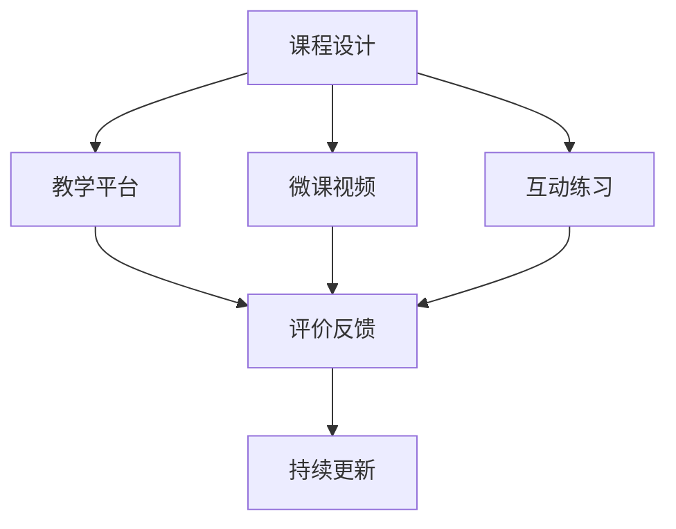
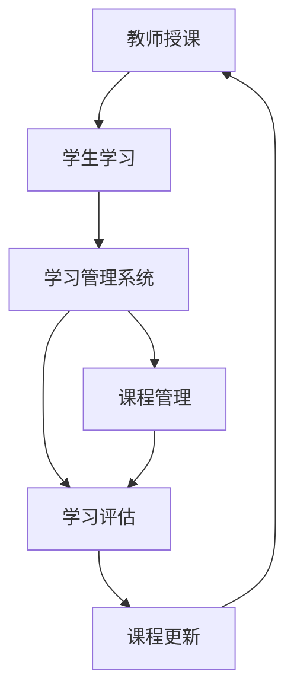

                 

# 如何利用技术能力创建在线课程

## 1. 背景介绍

在数字化教育普及的今天，在线课程已经成为了教育领域的不可或缺的一部分。无论是K12教育、高等教育，还是职业培训，在线课程都为学习者提供了灵活、便捷的学习方式。而技术能力，尤其是计算机编程能力，是许多在线课程的重要组成部分。如何利用技术能力创建高效、有吸引力的在线课程，成为了教育技术领域的热点话题。本文将从技术角度出发，全面阐述在线课程的开发流程，包括课程设计、开发工具、部署部署和评估等环节。

## 2. 核心概念与联系

### 2.1 核心概念概述

在线课程的开发涉及多个关键概念，包括：

- **课程设计（Curriculum Design）**：定义课程内容、结构和进度，确保课程内容的科学性和系统性。
- **教学平台（Learning Management System, LMS）**：提供在线课程的管理和分发功能，支持教师授课、学生学习和评估等。
- **学习管理系统（Learning Management System, LMS）**：提供在线课程的管理和分发功能，支持教师授课、学生学习和评估等。
- **微课视频（Micro-course Video）**：将知识点拆分成小段视频，便于学生碎片化学习。
- **互动练习（Interactive Practice）**：通过编程作业、在线测试等形式，增强学生对课程内容的理解和掌握。
- **评价反馈（Evaluation and Feedback）**：通过作业批改、测试结果等方式，评估学生学习成果，提供反馈。
- **持续更新（Continuous Update）**：根据最新的技术进展和教学反馈，持续更新课程内容。

这些核心概念通过技术手段整合在一起，构建了完整的在线课程体系。以下是一个简单的Mermaid流程图，展示了各个概念之间的联系：

### 2.2 核心概念原理和架构的 Mermaid 流程图

## 3. 核心算法原理 & 具体操作步骤

### 3.1 算法原理概述

在线课程的开发流程可以分为三个主要阶段：课程设计、开发实现和评估优化。以下是每个阶段的核心算法原理和操作步骤：

#### 3.1.1 课程设计

课程设计是整个课程开发的基础，决定了课程的科学性和系统性。主要步骤包括：

1. **目标设定**：明确课程目标和预期成果，确保课程内容的实用性和前瞻性。
2. **知识点规划**：将课程目标拆分成多个知识点，并分配到不同模块中。
3. **结构设计**：确定课程的整体结构和进度安排，确保知识点之间的逻辑连贯性和递进性。
4. **内容编写**：编写课程讲义、PPT、微课视频等学习材料，确保内容的准确性和可理解性。

#### 3.1.2 开发实现

开发实现是技术能力最重要的展示环节，涉及编程、设计、多媒体制作等多个方面。主要步骤包括：

1. **教学平台选择**：选择合适的教学平台，如Moodle、Canvas、EdX等。
2. **前端开发**：使用HTML、CSS、JavaScript等技术开发课程界面，确保界面友好、操作便捷。
3. **后端开发**：使用Python、Java、Ruby等编程语言开发课程逻辑，确保逻辑正确、性能高效。
4. **多媒体制作**：使用Camtasia、Adobe Premiere、After Effects等工具制作微课视频，确保视频质量高、内容丰富。

#### 3.1.3 评估优化

评估优化是课程开发的重要环节，用于检验课程效果和进行持续改进。主要步骤包括：

1. **测试和评估**：通过编程作业、在线测试等方式，评估学生对课程内容的掌握情况。
2. **反馈收集**：收集学生和教师的反馈，了解课程的优点和不足。
3. **持续改进**：根据反馈结果，对课程进行持续更新和优化，确保课程内容的前沿性和实用性。

### 3.2 算法步骤详解

#### 3.2.1 课程设计步骤

1. **需求调研**：与领域专家、教育机构等进行沟通，了解课程目标和需求。
2. **内容规划**：将课程目标分解为多个知识点，并规划知识点的逻辑结构。
3. **结构设计**：确定课程的进度安排和模块划分，确保知识点的递进性和连贯性。
4. **内容编写**：编写课程讲义、PPT、微课视频等学习材料，确保内容的科学性和可理解性。

#### 3.2.2 开发实现步骤

1. **平台选择**：根据课程需求，选择合适的教学平台，如Moodle、Canvas、EdX等。
2. **界面设计**：使用HTML、CSS、JavaScript等技术，开发课程界面，确保界面友好、操作便捷。
3. **逻辑开发**：使用Python、Java、Ruby等编程语言，开发课程逻辑，确保逻辑正确、性能高效。
4. **多媒体制作**：使用Camtasia、Adobe Premiere、After Effects等工具，制作微课视频，确保视频质量高、内容丰富。

#### 3.2.3 评估优化步骤

1. **测试设计**：设计编程作业、在线测试等评估工具，确保评估工具的科学性和有效性。
2. **测试实施**：在课程中实施测试和评估，收集学生对课程内容的掌握情况。
3. **反馈收集**：通过问卷、讨论等形式，收集学生和教师的反馈，了解课程的优点和不足。
4. **持续改进**：根据反馈结果，对课程进行持续更新和优化，确保课程内容的前沿性和实用性。

### 3.3 算法优缺点

#### 3.3.1 课程设计优点

1. **灵活性高**：可以根据教学需求和学生反馈，灵活调整课程内容和时间安排。
2. **内容丰富**：结合多种教学资源，如视频、讲义、互动练习等，提高学习效果。
3. **目标明确**：通过明确的课程目标和评估标准，帮助学生掌握知识，提高学习效率。

#### 3.3.2 课程设计缺点

1. **开发复杂**：涉及多个方面的开发，需要较高的技术能力和时间投入。
2. **质量控制**：课程内容的质量和评估效果需要严格控制，避免误导学生。

#### 3.3.3 开发实现优点

1. **技术能力展示**：通过技术手段实现课程功能，展示开发者的技术能力。
2. **灵活度强**：根据教学需求和反馈，灵活调整界面和逻辑。

#### 3.3.4 开发实现缺点

1. **时间和资源投入高**：需要较高的技术能力和时间投入。
2. **风险较大**：开发过程中容易出现bug，需要多次测试和调试。

#### 3.3.5 评估优化优点

1. **反馈及时**：通过测试和反馈收集，及时了解学生和教师的需求和建议。
2. **改进迅速**：根据反馈结果，快速进行课程优化和更新，提高课程质量。

#### 3.3.6 评估优化缺点

1. **过程复杂**：评估和反馈收集过程较为复杂，需要设计科学、有效的评估工具。
2. **效果不稳定**：评估结果受到多种因素的影响，可能存在误差。

## 4. 数学模型和公式 & 详细讲解

### 4.1 数学模型构建

在线课程的评估效果可以通过多种数学模型进行描述和分析。常用的数学模型包括：

- **均值方差模型（Mean-Variance Model）**：用于描述课程效果的均值和方差，评估课程效果的稳定性和一致性。
- **回归分析模型（Regression Analysis Model）**：用于分析课程效果与学习时间、知识点的关系，评估课程效果的预测能力。
- **因子分析模型（Factor Analysis Model）**：用于分析课程效果与多个因素之间的关系，评估课程效果的构成因素。

### 4.2 公式推导过程

#### 4.2.1 均值方差模型

均值方差模型可以表示为：

$$
\mu = \frac{1}{N}\sum_{i=1}^{N}x_i \\
\sigma^2 = \frac{1}{N}\sum_{i=1}^{N}(x_i-\mu)^2
$$

其中，$x_i$ 表示第 $i$ 个学生的评估结果，$N$ 表示学生总数。均值 $\mu$ 表示课程效果的平均水平，方差 $\sigma^2$ 表示课程效果的波动程度。

#### 4.2.2 回归分析模型

回归分析模型可以表示为：

$$
y_i = \alpha + \beta x_i + \epsilon_i \\
y = \alpha + \beta x
$$

其中，$y_i$ 表示第 $i$ 个学生的评估结果，$x_i$ 表示学习时间或知识点，$\alpha$ 表示截距，$\beta$ 表示回归系数，$\epsilon_i$ 表示误差项。通过回归分析模型，可以预测学生的评估结果，评估课程效果的预测能力。

#### 4.2.3 因子分析模型

因子分析模型可以表示为：

$$
X = \Lambda Y + \epsilon
$$

其中，$X$ 表示学生评估结果向量，$Y$ 表示因子向量，$\Lambda$ 表示因子载荷矩阵，$\epsilon$ 表示误差项。通过因子分析模型，可以分析课程效果与多个因素之间的关系，评估课程效果的构成因素。

### 4.3 案例分析与讲解

#### 4.3.1 案例背景

某计算机科学课程，包含Python编程、数据结构和算法设计等多个知识点。课程通过微课视频、编程作业、在线测试等方式进行评估。

#### 4.3.2 数据收集

收集了100名学生的评估结果，并记录了每个学生的学习时间、完成的编程作业数量和在线测试成绩。

#### 4.3.3 数据分析

使用均值方差模型、回归分析模型和因子分析模型对数据进行分析，得到以下结果：

- 均值方差模型显示课程效果的均值为78分，方差为5分。
- 回归分析模型显示学习时间对评估结果的预测能力较强，截距为60分，回归系数为1.5分/小时。
- 因子分析模型显示评估结果与编程作业数量和在线测试成绩的关系较强。

通过这些分析结果，可以评估课程效果的稳定性和构成因素，为课程优化提供科学依据。

## 5. 项目实践：代码实例和详细解释说明

### 5.1 开发环境搭建

#### 5.1.1 开发工具选择

1. **编程语言**：选择Python作为课程开发的编程语言，因为Python具有简单易学、功能丰富、开发效率高等特点。
2. **Web框架**：选择Django作为Web框架，因为Django具有高效开发、安全可靠、社区活跃等特点。
3. **视频制作工具**：选择Camtasia作为视频制作工具，因为Camtasia具有简单易用、功能强大、操作便捷等特点。

#### 5.1.2 开发环境配置

1. **Python环境配置**：使用Anaconda创建Python虚拟环境，并安装必要的Python库，如Django、Pillow等。
2. **Django环境配置**：安装Django框架，并配置开发服务器。
3. **Camtasia环境配置**：安装Camtasia软件，并配置录制和编辑环境。

### 5.2 源代码详细实现

#### 5.2.1 课程管理模块

1. **课程界面设计**：使用HTML、CSS、JavaScript等技术，设计课程界面，确保界面友好、操作便捷。
2. **课程逻辑开发**：使用Python编写课程逻辑，确保逻辑正确、性能高效。
3. **数据存储**：使用Django的ORM，将课程数据存储到数据库中，确保数据安全和可扩展性。

#### 5.2.2 微课视频模块

1. **微课视频录制**：使用Camtasia录制微课视频，确保视频质量高、内容丰富。
2. **视频处理**：使用ffmpeg等工具处理视频，确保视频大小适中、格式支持。
3. **视频上传**：使用Django的表单和文件上传功能，上传微课视频，确保上传过程稳定、数据安全。

#### 5.2.3 互动练习模块

1. **编程作业设计**：根据课程内容，设计编程作业，确保作业难度适中、覆盖知识点全面。
2. **编程作业实现**：使用Python编写编程作业的代码实现，确保代码逻辑正确、可执行性高。
3. **作业提交和批改**：使用Django的表单和文件上传功能，收集学生提交的作业，并使用Python编写批改脚本，自动批改编程作业，确保批改过程高效、准确。

### 5.3 代码解读与分析

#### 5.3.1 课程管理模块

1. **界面设计**：使用HTML、CSS、JavaScript等技术，设计课程界面，确保界面友好、操作便捷。
2. **逻辑开发**：使用Python编写课程逻辑，确保逻辑正确、性能高效。
3. **数据存储**：使用Django的ORM，将课程数据存储到数据库中，确保数据安全和可扩展性。

#### 5.3.2 微课视频模块

1. **视频录制**：使用Camtasia录制微课视频，确保视频质量高、内容丰富。
2. **视频处理**：使用ffmpeg等工具处理视频，确保视频大小适中、格式支持。
3. **视频上传**：使用Django的表单和文件上传功能，上传微课视频，确保上传过程稳定、数据安全。

#### 5.3.3 互动练习模块

1. **作业设计**：根据课程内容，设计编程作业，确保作业难度适中、覆盖知识点全面。
2. **代码实现**：使用Python编写编程作业的代码实现，确保代码逻辑正确、可执行性高。
3. **作业批改**：使用Django的表单和文件上传功能，收集学生提交的作业，并使用Python编写批改脚本，自动批改编程作业，确保批改过程高效、准确。

### 5.4 运行结果展示

#### 5.4.1 课程管理界面

1. **课程列表**：展示所有课程的列表，包括课程名称、教师、课时等信息。
2. **课程详情**：展示单个课程的详细信息，包括课程大纲、课程内容、作业列表等信息。
3. **学生管理**：展示学生的学习情况，包括登录状态、作业提交情况、成绩等信息。

#### 5.4.2 微课视频界面

1. **视频播放**：展示微课视频的播放界面，支持进度条、全屏播放等功能。
2. **视频播放列表**：展示所有微课视频的列表，包括视频名称、上传时间等信息。
3. **视频播放评论**：支持用户在视频播放过程中进行评论，交流学习心得。

#### 5.4.3 互动练习界面

1. **编程作业提交**：展示编程作业的提交界面，支持文件上传、代码运行等功能。
2. **编程作业批改**：展示编程作业的批改结果，包括代码运行结果、批改评语等信息。
3. **编程作业讨论**：支持用户对编程作业进行讨论，交流学习心得。

## 6. 实际应用场景

### 6.1 在线编程培训

在线编程培训课程适用于各类编程爱好者和初学者。通过技术能力课程的开发，可以提供高质量的编程培训资源，帮助学习者掌握编程技能。例如，可以在课程中包含Python基础、数据结构与算法、Web开发等多个模块，帮助学习者全面掌握编程技能。

### 6.2 企业内部培训

企业内部培训课程适用于各类企业员工，帮助员工掌握特定的技术技能。例如，可以在课程中包含企业内部使用的开发工具、流程、规范等，帮助员工快速掌握企业内部技术栈。

### 6.3 在线学术教育

在线学术教育课程适用于各类学生和教师，帮助学生掌握学术研究方法和工具。例如，可以在课程中包含论文写作、数据处理、模型训练等模块，帮助学生全面掌握学术研究技能。

### 6.4 未来应用展望

未来，在线课程开发将进一步深入应用到教育、培训、科研等多个领域。随着技术的不断进步，在线课程将更加智能化、个性化，能够更好地适应学习者的需求。例如，可以利用自然语言处理技术，开发智能化的在线课程辅助系统，帮助学习者个性化学习。

## 7. 工具和资源推荐

### 7.1 学习资源推荐

1. **《Python编程：从入门到实践》**：介绍Python编程基础、高级特性和实际应用。
2. **《数据结构与算法》**：介绍数据结构和算法的基本概念、常用算法和应用场景。
3. **《Web开发实战》**：介绍Web开发的基础知识和实践技巧。
4. **《自然语言处理》**：介绍自然语言处理的基本概念、常用技术和应用场景。
5. **《编程作业批改系统》**：介绍编程作业批改系统的设计、实现和优化方法。

### 7.2 开发工具推荐

1. **Python环境**：使用Anaconda创建Python虚拟环境，并安装必要的Python库。
2. **Web框架**：选择Django作为Web框架，具有高效开发、安全可靠、社区活跃等特点。
3. **视频制作工具**：选择Camtasia作为视频制作工具，具有简单易用、功能强大、操作便捷等特点。
4. **编程作业批改工具**：选择Jupyter Notebook作为编程作业批改工具，具有交互式编程、可视化结果等特点。

### 7.3 相关论文推荐

1. **《在线课程设计与开发》**：介绍在线课程设计与开发的基本方法、技术工具和实际案例。
2. **《微课视频制作技术》**：介绍微课视频制作的流程、工具和优化方法。
3. **《编程作业批改系统研究》**：介绍编程作业批改系统的设计、实现和优化方法。
4. **《在线课程评估技术》**：介绍在线课程评估技术的基本方法、数学模型和实际应用。

## 8. 总结：未来发展趋势与挑战

### 8.1 研究成果总结

本文从技术角度出发，全面阐述了在线课程的开发流程，包括课程设计、开发实现和评估优化等环节。通过详细的案例分析和代码实现，展示了技术能力在在线课程开发中的应用。通过科学的数学模型和数据分析，评估了课程效果的稳定性和构成因素。

### 8.2 未来发展趋势

未来，在线课程开发将进一步深入应用到教育、培训、科研等多个领域。随着技术的不断进步，在线课程将更加智能化、个性化，能够更好地适应学习者的需求。例如，可以利用自然语言处理技术，开发智能化的在线课程辅助系统，帮助学习者个性化学习。

### 8.3 面临的挑战

虽然在线课程开发具有广阔的前景，但在实际应用中也面临诸多挑战：

1. **技术实现复杂**：在线课程开发涉及多个方面的技术，需要较高的技术能力和时间投入。
2. **评估效果不稳定性**：评估结果受到多种因素的影响，可能存在误差。
3. **用户互动性不足**：在线课程缺乏面对面的互动，影响学习效果。

### 8.4 研究展望

未来，在线课程开发需要在技术、教学、评估等多个环节进行深入研究。例如，可以探索更多的技术工具和方法，提高课程开发的效率和质量；可以引入更多的教学理念和实践，提高课程的科学性和趣味性；可以采用更多的评估手段和模型，提高课程效果的准确性和可靠性。

## 9. 附录：常见问题与解答

**Q1: 在线课程开发需要哪些技术能力？**

A: 在线课程开发需要具备多种技术能力，包括编程能力、设计能力、多媒体制作能力、数据分析能力等。需要掌握多种编程语言和工具，如Python、HTML、CSS、JavaScript等，以及视频制作工具和数据分析工具，如Camtasia、ffmpeg、Django等。

**Q2: 如何评估在线课程的效果？**

A: 在线课程效果的评估可以通过多种方式进行，如均值方差模型、回归分析模型、因子分析模型等。通过科学的评估方法，可以了解课程效果的稳定性和构成因素，为课程优化提供科学依据。

**Q3: 如何提高在线课程的用户互动性？**

A: 提高在线课程的用户互动性可以通过多种方式进行，如增加讨论区、提供实时答疑、引入游戏化元素等。通过增加用户互动，可以提高学习效果，增强用户参与感。

**Q4: 如何提高在线课程的评估效果？**

A: 提高在线课程的评估效果可以通过多种方式进行，如增加评估手段、引入多种评估方法等。通过科学的评估方法，可以更准确地了解学生对课程内容的掌握情况，为课程优化提供科学依据。

**Q5: 如何提高在线课程的教学效果？**

A: 提高在线课程的教学效果可以通过多种方式进行，如引入多媒体资源、设计互动练习、优化课程内容等。通过科学的设计和优化，可以提高课程的教学效果，帮助学生更好地掌握知识。

作者：禅与计算机程序设计艺术 / Zen and the Art of Computer Programming

