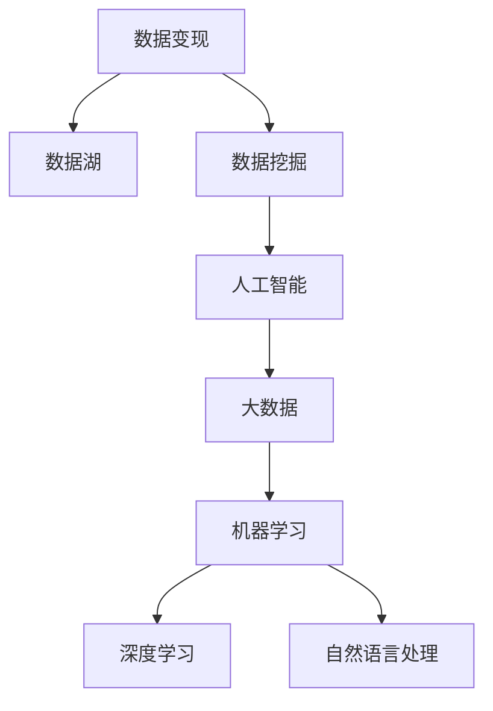

                 

## 1. 背景介绍

随着数据量的爆炸式增长，数据已成为企业的重要资产，如何充分利用这些数据创造价值，成为当下企业亟需解决的问题。传统的数据分析方法已无法满足现代企业的业务需求，因此，利用技术手段进行数据变现变得尤为重要。本文将深入探讨如何利用技术能力进行数据变现，提出一系列可行的策略和方法，帮助企业在数据驱动的业务转型中取得突破。

## 2. 核心概念与联系

### 2.1 核心概念概述

为了更好地理解数据变现的原理和架构，本节将介绍几个密切相关的核心概念：

- 数据变现(Data Monetization)：指将企业数据转化为经济效益的过程，通过数据分析和挖掘，为企业创造新的价值。
- 数据湖(Data Lake)：大规模、结构化、非结构化数据的集中存储和处理平台，支持海量数据的分布式处理和快速分析。
- 数据挖掘(Data Mining)：利用算法从大量数据中发现有价值的模式和规律，为企业决策提供支持。
- 人工智能(AI)：通过模拟人类智能过程，使机器能够进行学习、推理、决策等任务。
- 大数据(Big Data)：指数据体量巨大、类型多样、生成速度快，难以用传统方式处理的复杂数据集。
- 机器学习(Machine Learning)：使机器能够从数据中自动学习规律并做出决策，是实现数据变现的重要工具。
- 深度学习(Deep Learning)：一种特殊的机器学习方法，通过多层神经网络模拟人脑，能够处理更复杂的模式识别问题。
- 自然语言处理(NLP)：使机器能够理解和处理人类语言，通过数据分析实现文本挖掘和文本分类等任务。

这些核心概念之间的逻辑关系可以通过以下Mermaid流程图来展示：



这个流程图展示了数据变现的逻辑过程：首先通过数据湖集中存储和管理数据，然后通过数据挖掘发现数据中的价值，再利用人工智能和大数据技术进行深入分析，最后通过机器学习和深度学习算法实现数据变现。

## 3. 核心算法原理 & 具体操作步骤

### 3.1 算法原理概述

数据变现的核心原理是通过数据分析和挖掘，发现数据中的价值，并应用这些价值创造新的业务机会。其基本步骤如下：

1. 数据收集：从各种来源收集数据，包括企业内部数据、外部公开数据、社交媒体数据等。
2. 数据清洗和整合：对数据进行清洗和整合，去除噪声和冗余，形成结构化的数据集。
3. 数据分析和挖掘：利用数据分析和挖掘算法，从数据中发现规律和模式，生成有价值的洞察。
4. 数据应用：将分析结果应用于业务决策、产品改进、客户关系管理等领域，实现数据变现。

### 3.2 算法步骤详解

#### 3.2.1 数据收集

数据收集是数据变现的第一步，主要包括以下几种方式：

- **企业内部数据**：如销售记录、客户数据、财务报表等。
- **外部公开数据**：如政府公开数据、社交媒体数据、市场研究报告等。
- **传感器数据**：如物联网设备收集的数据、定位数据等。

#### 3.2.2 数据清洗和整合

数据清洗和整合是确保数据质量的关键步骤，主要包括以下几个方面：

- **数据清洗**：去除重复数据、缺失值、异常值等。
- **数据整合**：将不同来源的数据进行格式转换和集成，形成统一的数据格式。
- **数据存储**：采用分布式存储系统（如Hadoop、Spark），支持大规模数据处理和存储。

#### 3.2.3 数据分析和挖掘

数据分析和挖掘是发现数据价值的核心步骤，主要包括以下几种方法：

- **描述性分析**：通过统计分析描述数据特征，如均值、中位数、方差等。
- **诊断性分析**：通过可视化工具（如Tableau、Power BI）分析数据分布和趋势。
- **预测性分析**：利用机器学习算法进行预测，如回归分析、时间序列预测等。
- **规范性分析**：通过优化算法生成业务决策建议，如决策树、随机森林等。

#### 3.2.4 数据应用

数据应用是将分析结果转化为业务价值的关键步骤，主要包括以下几个方面：

- **市场细分**：通过数据分析细分市场，针对不同客户群体进行精准营销。
- **产品改进**：利用客户反馈和行为数据改进产品设计和服务流程。
- **客户关系管理**：通过客户行为分析提高客户满意度和忠诚度。
- **风险管理**：通过风险分析识别和控制业务风险。

### 3.3 算法优缺点

数据变现的优点包括：

- **提升决策质量**：通过数据分析和挖掘，决策更具科学性和准确性。
- **优化运营效率**：通过数据分析优化业务流程，提高运营效率。
- **增加收入来源**：通过数据变现，开辟新的收入渠道。

数据变现的缺点包括：

- **数据隐私风险**：在数据收集和应用过程中，可能存在隐私泄露的风险。
- **数据质量问题**：数据收集和清洗过程中可能存在数据质量和一致性问题。
- **技术和人才成本**：数据变现需要高级数据分析和挖掘技术，需要投入大量技术和人才资源。

### 3.4 算法应用领域

数据变现的应用领域非常广泛，涵盖了各个行业的业务场景，例如：

- **零售业**：通过分析客户购买行为，进行精准营销和个性化推荐。
- **金融业**：利用客户财务数据进行信用评估和风险控制。
- **制造业**：通过设备运行数据进行故障预测和维护优化。
- **医疗业**：利用患者数据进行疾病诊断和治疗方案优化。
- **旅游业**：通过用户行为数据进行旅游推荐和客户关系管理。

## 4. 数学模型和公式 & 详细讲解 & 举例说明

### 4.1 数学模型构建

数据变现的数学模型主要由数据收集、数据清洗和整合、数据分析和挖掘以及数据应用四个部分组成。

### 4.2 公式推导过程

#### 4.2.1 数据收集模型

数据收集模型主要描述如何从不同来源收集数据，包括企业内部数据、外部公开数据和传感器数据。

假设企业内部数据来源为 $S_1$，外部公开数据来源为 $S_2$，传感器数据来源为 $S_3$，则数据收集模型可表示为：

$$
D = \{S_1, S_2, S_3\}
$$

#### 4.2.2 数据清洗和整合模型

数据清洗和整合模型主要描述数据清洗和整合的流程和步骤。

假设数据清洗的参数为 $\beta$，数据整合的参数为 $\gamma$，则数据清洗和整合模型可表示为：

$$
D' = \mathcal{F}(D, \beta, \gamma)
$$

其中，$\mathcal{F}$ 表示数据清洗和整合函数。

#### 4.2.3 数据分析和挖掘模型

数据分析和挖掘模型主要描述如何通过数据分析和挖掘算法从数据中发现规律和模式。

假设数据挖掘算法为 $A$，数据应用算法为 $B$，则数据分析和挖掘模型可表示为：

$$
I = A(D', \alpha)
$$

其中，$\alpha$ 表示数据分析和挖掘算法的参数。

#### 4.2.4 数据应用模型

数据应用模型主要描述如何通过数据分析结果生成业务价值。

假设数据应用的结果为 $V$，则数据应用模型可表示为：

$$
V = B(I, \delta)
$$

其中，$\delta$ 表示数据应用的参数。

### 4.3 案例分析与讲解

#### 4.3.1 零售业案例

某零售企业希望通过数据变现提升销售额。首先，通过内部销售系统收集客户购买数据，包括购买时间、购买商品、购买金额等。然后，对数据进行清洗和整合，去除重复数据和异常值，将数据存储在分布式存储系统中。

接着，利用机器学习算法进行数据分析和挖掘，发现客户的购买行为模式和偏好。通过预测模型，预测客户的未来购买行为，进行精准营销和个性化推荐。最终，企业通过客户细分和个性化推荐，实现了销售额的显著提升。

#### 4.3.2 金融业案例

某银行希望通过数据变现进行风险控制。首先，从内部系统收集客户的财务数据，包括收入、支出、贷款记录等。然后，对数据进行清洗和整合，生成结构化的数据集。

接着，利用数据挖掘算法进行数据分析和挖掘，发现客户的信用评级和风险等级。通过规范性分析，生成业务决策建议，进行信用评估和风险控制。最终，银行通过信用评估和风险控制，降低了坏账率，提高了业务效率。

## 5. 项目实践：代码实例和详细解释说明

### 5.1 开发环境搭建

在进行数据变现项目实践前，我们需要准备好开发环境。以下是使用Python进行PyTorch和Pandas开发的环境配置流程：

1. 安装Anaconda：从官网下载并安装Anaconda，用于创建独立的Python环境。

2. 创建并激活虚拟环境：
```bash
conda create -n data_monetization python=3.8 
conda activate data_monetization
```

3. 安装PyTorch：根据CUDA版本，从官网获取对应的安装命令。例如：
```bash
conda install pytorch torchvision torchaudio cudatoolkit=11.1 -c pytorch -c conda-forge
```

4. 安装Pandas：
```bash
pip install pandas
```

5. 安装各类工具包：
```bash
pip install numpy matplotlib scikit-learn scikit-optimize
```

完成上述步骤后，即可在`data_monetization`环境中开始数据变现项目的开发。

### 5.2 源代码详细实现

下面以零售业数据变现项目为例，给出使用PyTorch和Pandas进行数据收集、清洗、分析和应用的代码实现。

```python
import pandas as pd
import numpy as np
from sklearn.model_selection import train_test_split
from sklearn.linear_model import LinearRegression
from sklearn.metrics import mean_squared_error

# 数据收集
data = pd.read_csv('sales_data.csv')

# 数据清洗
data = data.drop_duplicates()
data = data.dropna()

# 数据整合
data['day_of_week'] = data['date'].dt.dayofweek
data['hour_of_day'] = data['date'].dt.hour

# 数据分析和挖掘
X = data[['day_of_week', 'hour_of_day', 'weather']]
y = data['sales']
X_train, X_test, y_train, y_test = train_test_split(X, y, test_size=0.2, random_state=42)
model = LinearRegression()
model.fit(X_train, y_train)

# 数据应用
y_pred = model.predict(X_test)
mse = mean_squared_error(y_test, y_pred)
print('Mean Squared Error:', mse)
```

### 5.3 代码解读与分析

让我们再详细解读一下关键代码的实现细节：

**数据收集**：
- 使用Pandas的`read_csv`函数从CSV文件中读取数据，生成DataFrame对象。

**数据清洗**：
- 使用`drop_duplicates`函数去除重复数据，使用`dropna`函数去除缺失值。

**数据整合**：
- 将日期字段转换为日期时间格式，提取星期和小时信息，并添加至DataFrame中。

**数据分析和挖掘**：
- 使用`train_test_split`函数将数据集划分为训练集和测试集，其中80%的数据用于训练，20%的数据用于测试。
- 使用Scikit-learn的`LinearRegression`模型进行线性回归预测，评估模型性能使用均方误差（MSE）。

**数据应用**：
- 使用训练好的模型对测试集进行预测，计算预测值和真实值之间的均方误差。

## 6. 实际应用场景

### 6.1 零售业

零售业是数据变现的重要应用场景之一。通过对客户购买数据的分析，可以发现客户的购买行为模式和偏好，进行精准营销和个性化推荐，提升销售额和客户满意度。

### 6.2 金融业

金融业中的风险控制和信用评估是数据变现的重要应用场景。通过分析客户的财务数据，可以识别高风险客户，进行风险控制和信用评估，降低坏账率，提高业务效率。

### 6.3 制造业

制造业中的设备维护和故障预测是数据变现的重要应用场景。通过对设备运行数据的分析，可以预测设备的故障时间和维护需求，进行故障预防和维护优化，提高生产效率。

### 6.4 医疗业

医疗业中的疾病诊断和治疗方案优化是数据变现的重要应用场景。通过分析患者数据，可以识别高风险患者，进行疾病诊断和治疗方案优化，提高治疗效果和患者满意度。

### 6.5 旅游业

旅游业中的客户关系管理和个性化推荐是数据变现的重要应用场景。通过分析客户行为数据，可以生成旅游推荐，提高客户满意度和旅游收入。

## 7. 工具和资源推荐

### 7.1 学习资源推荐

为了帮助开发者系统掌握数据变现的理论基础和实践技巧，这里推荐一些优质的学习资源：

1. 《数据科学导论》书籍：由统计学和计算机科学专家撰写，全面介绍了数据科学的理论基础和实践方法，适合入门学习。

2. Coursera《数据科学与机器学习》课程：由斯坦福大学和密歇根大学开设的在线课程，涵盖数据科学和机器学习的核心概念和实践技巧。

3. Kaggle竞赛平台：提供丰富的数据集和竞赛任务，适合实践和提升数据分析和挖掘能力。

4. DataCamp在线学习平台：提供大量数据分析和机器学习的实战课程，适合系统学习数据科学技能。

5. GitHub开源项目：搜索和参考大量的开源数据科学项目，了解前沿技术应用案例。

通过对这些资源的学习实践，相信你一定能够快速掌握数据变现的精髓，并用于解决实际的数据问题。

### 7.2 开发工具推荐

高效的开发离不开优秀的工具支持。以下是几款用于数据变现开发的常用工具：

1. Jupyter Notebook：提供交互式的数据分析和代码执行环境，适合进行数据科学研究和项目开发。

2. SQL查询工具：如MySQL、PostgreSQL，用于数据库管理和数据分析。

3. Python开发环境：如Anaconda、PyCharm，支持Python语言的开发和调试。

4. 数据可视化工具：如Tableau、Power BI，用于数据可视化和报表生成。

5. 机器学习框架：如Scikit-learn、TensorFlow，支持机器学习算法的实现和优化。

6. 大数据处理框架：如Hadoop、Spark，支持大规模数据的分布式处理和分析。

合理利用这些工具，可以显著提升数据变现任务的开发效率，加快创新迭代的步伐。

### 7.3 相关论文推荐

数据变现的研究源于学界的持续研究。以下是几篇奠基性的相关论文，推荐阅读：

1. "Predictive Analytics: The Power of Data Mining for Business and Science" 书籍：介绍了预测分析的理论基础和实践方法，适合理解数据变现的原理。

2. "Machine Learning: A Probabilistic Perspective" 书籍：由机器学习领域的权威专家撰写，深入浅出地介绍了机器学习的基本原理和算法。

3. "Data Mining: Concepts and Techniques" 书籍：全面介绍了数据挖掘的基本概念和实践方法，适合系统学习数据科学技能。

4. "Deep Learning" 书籍：由深度学习领域的权威专家撰写，全面介绍了深度学习的基本原理和算法。

5. "Data Monetization: Challenges and Opportunities in Big Data Analytics" 论文：分析了大数据分析中的数据变现挑战和机遇，适合理解数据变现的实践应用。

这些论文代表了大数据变现的研究方向，通过学习这些前沿成果，可以帮助研究者把握学科前进方向，激发更多的创新灵感。

## 8. 总结：未来发展趋势与挑战

### 8.1 总结

本文对如何利用技术能力进行数据变现进行了全面系统的介绍。首先阐述了数据变现的原理和应用场景，明确了数据变现在提升企业决策质量、优化运营效率和增加收入来源等方面的重要性。其次，从原理到实践，详细讲解了数据变现的数学模型和关键步骤，给出了数据变现任务开发的完整代码实例。同时，本文还探讨了数据变现在零售、金融、制造业、医疗和旅游等领域的实际应用，展示了数据变现范式的广泛适用性。

通过本文的系统梳理，可以看到，数据变现技术已成为企业数字化转型中的重要工具，通过充分利用数据，企业可以在数据驱动的业务转型中取得突破。未来，伴随数据科学的持续发展，数据变现技术还将进一步提升，带来更多的创新机会。

### 8.2 未来发展趋势

展望未来，数据变现技术将呈现以下几个发展趋势：

1. 自动化数据变现：随着自动化机器学习技术的进步，数据变现将越来越自动化，减少人工干预和错误。
2. 实时数据变现：通过流式数据处理技术，实现数据的实时分析和变现，提升数据变现的时效性。
3. 多模态数据变现：融合文本、图像、视频等多种数据类型，进行更全面、深入的数据分析，提升数据变现的全面性。
4. 跨领域数据变现：突破行业边界，跨领域集成数据，进行综合分析和变现，提升数据变现的通用性。
5. 数据隐私保护：在数据变现过程中，加强数据隐私保护，确保数据安全和用户隐私。
6. 可持续发展：在数据变现过程中，注重社会责任和可持续发展，促进数据变现的良性循环。

以上趋势凸显了数据变现技术的广阔前景，这些方向的探索发展，必将进一步提升数据变现的性能和应用范围，为企业的数字化转型带来新的机遇。

### 8.3 面临的挑战

尽管数据变现技术已经取得了瞩目成就，但在迈向更加智能化、普适化应用的过程中，它仍面临着诸多挑战：

1. 数据隐私风险：在数据收集和应用过程中，可能存在隐私泄露的风险，需要加强数据隐私保护。
2. 数据质量问题：数据收集和清洗过程中可能存在数据质量和一致性问题，需要提高数据质量控制。
3. 技术和人才成本：数据变现需要高级数据分析和挖掘技术，需要投入大量技术和人才资源。
4. 数据孤岛问题：各企业的数据孤岛现象，导致数据难以共享和集成，需要建立数据共享机制。
5. 数据安全和存储问题：大规模数据处理和存储过程中，可能存在数据安全和存储问题，需要加强数据安全保护。

正视数据变现面临的这些挑战，积极应对并寻求突破，将是大数据变现技术走向成熟的必由之路。

### 8.4 研究展望

面向未来，数据变现技术的研究还需要在以下几个方面寻求新的突破：

1. 自动化机器学习：开发更加自动化、智能化的机器学习模型，减少人工干预和错误。
2. 实时数据流处理：开发实时数据流处理技术，实现数据的实时分析和变现。
3. 多模态数据融合：融合文本、图像、视频等多种数据类型，进行更全面、深入的数据分析。
4. 数据共享机制：建立数据共享机制，解决数据孤岛问题，促进数据变现的跨领域应用。
5. 数据隐私保护：在数据变现过程中，加强数据隐私保护，确保数据安全和用户隐私。
6. 数据安全和存储：加强数据安全和存储技术，保障大规模数据处理的稳定性和安全性。

这些研究方向的探索，必将引领数据变现技术迈向更高的台阶，为企业的数字化转型带来新的机遇。相信通过持续的技术创新和应用实践，数据变现技术将在各个行业中发挥更大的作用，推动企业迈向智能化、普适化、可持续发展的未来。

## 9. 附录：常见问题与解答

**Q1：数据变现的难点是什么？**

A: 数据变现的难点主要集中在以下几个方面：
1. 数据收集和清洗：大规模数据的收集和清洗需要大量时间和资源。
2. 数据隐私保护：数据隐私保护是数据变现中的重要问题，需要在数据收集和应用过程中进行严格控制。
3. 数据质量和一致性：数据质量和一致性问题需要严格控制，避免影响分析结果的准确性。
4. 技术和人才成本：数据变现需要高级数据分析和挖掘技术，需要投入大量技术和人才资源。

**Q2：如何提高数据收集的效率？**

A: 提高数据收集效率可以从以下几个方面入手：
1. 自动化数据采集：使用爬虫和API等技术，自动化采集数据。
2. 数据整合工具：使用ETL工具（Extract, Transform, Load），快速处理和整合数据。
3. 分布式存储和处理：使用分布式存储和处理系统，如Hadoop、Spark，提高数据处理效率。
4. 数据清洗技术：使用自动化数据清洗工具，提高数据清洗效率。

**Q3：如何进行数据质量控制？**

A: 数据质量控制是数据变现中的重要环节，可以从以下几个方面入手：
1. 数据校验：对数据进行校验，检查数据完整性和一致性。
2. 数据清洗：使用自动化数据清洗工具，去除噪声和冗余。
3. 数据标准化：对数据进行标准化处理，统一数据格式和单位。
4. 数据验证：使用数据验证工具，检查数据是否符合业务规则和标准。

**Q4：如何进行数据隐私保护？**

A: 数据隐私保护是数据变现中的重要问题，可以从以下几个方面入手：
1. 数据脱敏：对敏感数据进行脱敏处理，保护用户隐私。
2. 数据加密：对数据进行加密处理，防止数据泄露。
3. 数据访问控制：对数据访问进行严格控制，确保数据访问权限的安全。
4. 数据合规：遵守数据隐私法规和标准，确保数据处理合规。

**Q5：如何进行数据应用分析？**

A: 数据应用分析是数据变现中的重要环节，可以从以下几个方面入手：
1. 数据可视化：使用数据可视化工具，生成报表和图表，展示数据结果。
2. 预测分析：使用机器学习算法，进行预测和趋势分析。
3. 规范性分析：使用优化算法，生成业务决策建议。
4. 实时监控：实时监控数据分析结果，及时发现异常和问题。

通过合理利用这些工具和技术，可以最大限度地提高数据变现的效率和质量，推动企业在数据驱动的业务转型中取得突破。

