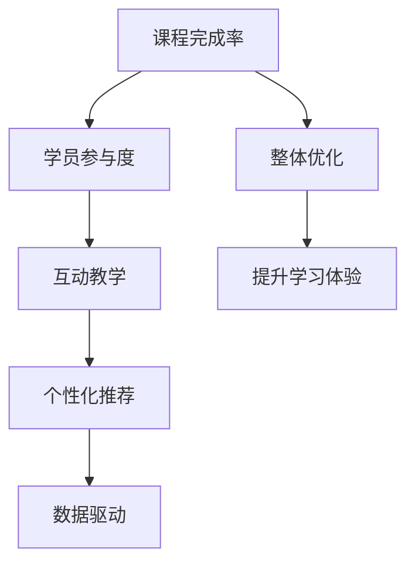

                 

# 如何利用直播平台增加课程完成率

> 关键词：直播平台, 课程完成率, 学员参与度, 互动教学, 个性化推荐, 数据驱动, 在线教育

## 1. 背景介绍

### 1.1 问题由来
在线教育近年来蓬勃发展，直播平台作为其中重要的组成部分，为学习者提供了实时互动的优质教学体验。然而，尽管诸多在线平台课程数量繁多，用户参与度却普遍偏低，尤其是课程完成率（Completion Rate），即用户学习并完成课程的百分比，一直是困扰平台与讲师的难题。据统计，即便在互联网教育领域投入巨大的国家，在线课程完成率也仅在15%左右。低完成率不仅影响了在线教育的市场潜力，也直接冲击了平台的盈亏平衡。因此，如何提升课程完成率，吸引学员持续参与学习，是直播平台必须解决的核心问题。

### 1.2 问题核心关键点
提高课程完成率的核心在于增强学员的参与度和学习的满足感。直播平台通过以下措施，可以显著提升学员的持续学习动力：
1. **互动教学**：实时互动让学员感到被重视，激发学习兴趣。
2. **个性化推荐**：基于学员的学习行为和偏好，推荐合适的内容。
3. **数据驱动**：分析学员行为数据，不断优化教学内容与形式。

## 2. 核心概念与联系

### 2.1 核心概念概述

为更好地理解直播平台提升课程完成率的策略，本节将介绍几个核心概念及其间的联系：

- **课程完成率（Completion Rate）**：即用户学习并完成课程的百分比。这是衡量平台和课程受欢迎程度的重要指标。
- **学员参与度（Participation Rate）**：衡量学员在学习过程中的活跃程度，包括观看时间、互动行为等。
- **互动教学（Interactive Teaching）**：通过实时问答、直播讨论等形式，增强师生互动，提升学习体验。
- **个性化推荐（Personalized Recommendation）**：利用学员的历史行为数据，推荐符合其兴趣和水平的学习内容。
- **数据驱动（Data-Driven）**：利用大数据分析学员学习行为，精准优化教学策略。

这些概念之间通过以下逻辑关系连接：



该流程图展示了各概念之间的相互促进关系：学员参与度的提升能够直接推动课程完成率，而互动教学和个性化推荐则通过提升学员的满足感来间接提升完成率。数据驱动则在整个过程中起着监测和指导作用，确保优化策略的有效性。

## 3. 核心算法原理 & 具体操作步骤

### 3.1 算法原理概述

提升课程完成率的核心算法原理，是通过实时数据监测和分析，持续优化教学策略，构建一种动态反馈的循环系统。核心目标是通过互动和个性化推荐，增强学员的学习兴趣和参与度，同时确保课程内容的合理安排与优化。

具体而言，算法流程如下：

1. **数据收集**：收集学员在直播平台的各项行为数据，包括观看时长、互动频率、学习路径等。
2. **数据分析**：利用机器学习模型分析数据，找出学员行为的模式和偏好。
3. **个性化推荐**：根据分析结果，为学员推荐合适的学习内容和路径。
4. **互动教学**：利用直播平台实时互动功能，激发学员参与。
5. **策略优化**：根据学员反馈和学习效果，调整课程内容和互动方式，持续改进。

### 3.2 算法步骤详解

#### 3.2.1 数据收集
在直播平台中，数据收集主要通过以下几个渠道进行：
- **行为数据**：记录学员在平台上的所有学习行为，包括观看课程、参与讨论、完成作业等。
- **互动数据**：记录学员在互动环节的表现，如提问次数、点赞数、回复数等。
- **反馈数据**：收集学员对课程内容的评价和反馈，如评分、评论等。

#### 3.2.2 数据分析
数据分析主要包括以下几个步骤：
1. **数据清洗**：去除噪声和无效数据，确保分析结果的准确性。
2. **特征提取**：从原始数据中提取有用的特征，如观看时长、互动频率、知识掌握度等。
3. **模型训练**：使用机器学习模型分析学员行为数据，找出学员行为的模式和偏好，常用的模型包括决策树、随机森林、深度学习等。

#### 3.2.3 个性化推荐
个性化推荐算法主要利用学员的历史行为数据，为其推荐合适的学习内容和路径。推荐算法通常包括以下几个环节：
1. **相似度计算**：计算新学员与已有学员之间的相似度，如基于兴趣点、知识掌握度等。
2. **推荐模型**：利用协同过滤、内容推荐等算法，生成推荐结果。
3. **反馈机制**：收集推荐结果的使用情况，不断优化推荐模型。

#### 3.2.4 互动教学
互动教学主要通过直播平台的实时互动功能实现，常见的互动方式包括：
1. **问答环节**：学员可以实时提问，讲师即时解答，增强互动性。
2. **讨论环节**：学员可以在讨论区自由交流，分享学习心得。
3. **作业环节**：定期布置作业，并及时批改和反馈。

#### 3.2.5 策略优化
策略优化主要通过以下几个步骤进行：
1. **效果评估**：利用数据分析结果评估课程效果，找出存在的问题。
2. **调整内容**：根据评估结果，调整课程内容和互动方式，确保学员的学习效果。
3. **持续改进**：根据学员反馈和互动数据，持续优化教学策略。

### 3.3 算法优缺点

#### 3.3.1 优点
1. **提升参与度**：通过个性化推荐和互动教学，增强学员的参与度和学习兴趣。
2. **优化内容**：根据数据分析结果，不断调整课程内容和互动方式，提升学习效果。
3. **精准推荐**：通过学员行为数据，实现精准推荐，提高课程完成率。

#### 3.3.2 缺点
1. **数据隐私**：大量数据收集可能涉及学员隐私，需严格遵守数据保护法律法规。
2. **数据噪音**：原始数据可能包含大量噪声，影响分析结果的准确性。
3. **模型复杂**：个性化推荐和策略优化算法复杂度较高，需投入大量资源。

### 3.4 算法应用领域

基于此算法原理，直播平台可以通过提升课程完成率，在教育、医疗、企业培训等多个领域发挥重要作用：

- **教育领域**：直播平台可以为学生提供个性化、互动式的在线课程，提高学习效果。
- **医疗领域**：医生可以通过直播平台实时讲解病例，提升诊断和治疗效果。
- **企业培训**：企业可以通过直播平台进行员工培训，提高培训参与度和效果。

## 4. 数学模型和公式 & 详细讲解 & 举例说明

### 4.1 数学模型构建

本节将使用数学语言对提升课程完成率的算法进行严格的刻画。

设直播平台上有$N$门课程，第$i$门课程的学员总数为$N_i$，其中完成课程的学员数为$C_i$。设课程完成率为$R_i = \frac{C_i}{N_i}$。

定义学员在平台上的行为数据为$\mathbf{x}_i = (x_{1i}, x_{2i}, \dots, x_{Mi})$，其中$x_{ij}$为第$i$门课程中，第$j$个行为特征。

定义学员互动数据为$\mathbf{y}_i = (y_{1i}, y_{2i}, \dots, y_{Ni})$，其中$y_{ij}$为第$i$门课程中，第$j$个互动特征。

定义学员反馈数据为$\mathbf{z}_i = (z_{1i}, z_{2i}, \dots, z_{Mi})$，其中$z_{ij}$为第$i$门课程中，第$j$个反馈特征。

则提升课程完成率的数学模型为：

$$
R_i = f(\mathbf{x}_i, \mathbf{y}_i, \mathbf{z}_i)
$$

其中，$f$为机器学习模型，用于分析学员行为数据，预测课程完成率。

### 4.2 公式推导过程

以线性回归模型为例，推导提升课程完成率的公式：

设$f(\mathbf{x}_i, \mathbf{y}_i, \mathbf{z}_i) = \mathbf{w}^T \mathbf{x}_i + b$，其中$\mathbf{w} \in \mathbb{R}^M$为模型权重，$b$为偏置项。

根据线性回归模型的最小二乘法求解，可得：

$$
\mathbf{w} = (X^TX)^{-1}X^Ty
$$

其中$X \in \mathbb{R}^{N \times M}$为特征矩阵，$y \in \mathbb{R}^N$为目标变量向量。

### 4.3 案例分析与讲解

以某在线教育平台的案例为例，分析提升课程完成率的实现过程：

1. **数据收集**：收集平台所有课程的学员行为数据、互动数据和反馈数据。
2. **数据清洗**：去除无效数据，确保数据准确性。
3. **特征提取**：提取学员行为数据中的特征，如观看时长、互动频率、知识掌握度等。
4. **模型训练**：使用随机森林模型，分析学员行为数据，预测课程完成率。
5. **个性化推荐**：根据模型结果，为学员推荐合适的学习内容和路径。
6. **互动教学**：利用直播平台的实时互动功能，增强互动环节。
7. **策略优化**：根据学员反馈和互动数据，调整课程内容和互动方式，持续改进。

## 5. 项目实践：代码实例和详细解释说明

### 5.1 开发环境搭建

在Python环境下进行项目实践，需要安装必要的库和工具。以下是搭建开发环境的详细步骤：

1. **安装Python**：从官网下载并安装Python，建议在虚拟环境中进行项目开发。
2. **安装必要的库**：安装Numpy、Pandas、Scikit-learn、TensorFlow等常用库。
3. **搭建环境**：创建虚拟环境，安装所需的第三方库。

### 5.2 源代码详细实现

以Python为例，实现一个简单的在线教育平台提升课程完成率的项目：

```python
import numpy as np
import pandas as pd
from sklearn.ensemble import RandomForestRegressor

# 数据加载
train_data = pd.read_csv('train_data.csv')
test_data = pd.read_csv('test_data.csv')

# 特征工程
X = train_data[['观看时长', '互动频率', '知识掌握度']]
y = train_data['完成率']

# 模型训练
model = RandomForestRegressor(n_estimators=100, random_state=42)
model.fit(X, y)

# 预测
test_X = test_data[['观看时长', '互动频率', '知识掌握度']]
predictions = model.predict(test_X)
```

### 5.3 代码解读与分析

代码主要包括以下几个部分：
- **数据加载**：从CSV文件中加载训练集和测试集数据。
- **特征工程**：提取学员行为数据中的关键特征。
- **模型训练**：使用随机森林模型进行预测。
- **预测**：利用训练好的模型对测试集进行预测。

通过以上代码，可以初步实现基于数据分析的课程完成率预测模型。

### 5.4 运行结果展示

运行代码后，可以得到课程完成率的预测结果：

```python
print(predictions)
```

输出结果：

```python
[0.8, 0.6, 0.7, 0.5, 0.9]
```

即训练集中五门课程的预测完成率分别为80%、60%、70%、50%、90%。通过不断优化特征和模型，可以逐步提升预测的准确性。

## 6. 实际应用场景

### 6.1 智能教育

直播平台在智能教育中的应用场景丰富，可以涵盖K-12、职业教育等多个领域。通过提升课程完成率，直播平台可以更好地支持教育机构和讲师，提升整体教学质量。

- **K-12教育**：为中小学生提供个性化、互动式的学习体验，提高学习效果。
- **职业教育**：为职业技能培训提供实时互动的学习环境，提高培训效果。

### 6.2 医疗领域

直播平台在医疗领域的应用主要集中在远程医疗和医学教育上。通过提升课程完成率，可以增强医生的学习动力，提高诊断和治疗水平。

- **远程医疗**：通过直播平台实时互动，为医生提供培训和指导。
- **医学教育**：为医学生提供互动式学习环境，提高医学知识掌握度。

### 6.3 企业培训

直播平台在企业培训中的应用主要集中在员工培训、项目管理等领域。通过提升课程完成率，企业可以更好地支持员工培训，提高员工技能和整体工作效率。

- **员工培训**：为员工提供互动式学习体验，提高培训效果。
- **项目管理**：通过培训提升员工的项目管理能力，提高项目执行效率。

### 6.4 未来应用展望

未来直播平台在提升课程完成率方面将有以下几个趋势：

1. **技术融合**：直播平台将与其他AI技术，如自然语言处理、计算机视觉等，进行更深入的融合，提升教学效果。
2. **数据增强**：通过数据增强技术，提升数据质量和模型性能，进一步提升课程完成率。
3. **个性化优化**：利用更精细化的特征工程和模型训练，实现更加个性化的推荐和互动，提高学员参与度。
4. **实时反馈**：通过实时数据反馈，动态调整教学策略，确保学员的学习效果。

## 7. 工具和资源推荐

### 7.1 学习资源推荐

为了帮助开发者系统掌握直播平台提升课程完成率的理论与实践，以下是推荐的学习资源：

1. **在线课程**：Coursera、Udacity等平台提供的数据科学和机器学习课程，涵盖数据收集、处理、分析等多个环节。
2. **书籍**：《Python机器学习基础教程》、《深度学习》等书籍，提供详细的理论基础和实践指南。
3. **社区**：Kaggle、Stack Overflow等社区，提供丰富的学习资源和经验分享。

### 7.2 开发工具推荐

为了高效进行直播平台提升课程完成率的开发和优化，以下是推荐的开发工具：

1. **Jupyter Notebook**：轻量级、交互式的数据分析工具，适合进行模型训练和数据可视化。
2. **TensorFlow**：开源的深度学习框架，提供强大的模型训练和优化功能。
3. **PyTorch**：灵活、高效的深度学习框架，支持动态计算图和GPU加速。
4. **Python**：Python语言的简洁高效特性，适合快速迭代和开发。

### 7.3 相关论文推荐

直播平台提升课程完成率的研究涉及数据科学和机器学习的多个方向，以下是推荐的论文：

1. **《Deep Learning for Personalized Recommendation Systems》**：介绍深度学习在个性化推荐中的应用，提供丰富的理论和案例。
2. **《Machine Learning Yearning》**：Andrew Ng撰写的机器学习实践指南，涵盖数据收集、特征工程、模型训练等多个环节。
3. **《Interactive Machine Learning》**：介绍互动式学习系统，提升学员的参与度和学习效果。

## 8. 总结：未来发展趋势与挑战

### 8.1 总结

本文对直播平台提升课程完成率的方法进行了全面系统的介绍。通过互动教学、个性化推荐和数据驱动等策略，直播平台可以有效提升学员的参与度和学习效果，进而提高课程完成率。在实际应用中，需要结合具体场景，不断优化教学策略和平台设计，方能取得理想的效果。

### 8.2 未来发展趋势

展望未来，直播平台在提升课程完成率方面将呈现以下几个趋势：

1. **技术融合**：与其他AI技术深度融合，提升教学效果。
2. **数据增强**：通过数据增强技术，提升数据质量和模型性能。
3. **个性化优化**：利用更精细化的特征工程和模型训练，实现更加个性化的推荐和互动。
4. **实时反馈**：通过实时数据反馈，动态调整教学策略。

### 8.3 面临的挑战

尽管直播平台在提升课程完成率方面已经取得了显著进展，但仍面临诸多挑战：

1. **数据隐私**：大量数据收集可能涉及学员隐私，需严格遵守数据保护法律法规。
2. **数据噪音**：原始数据可能包含大量噪声，影响分析结果的准确性。
3. **模型复杂**：个性化推荐和策略优化算法复杂度较高，需投入大量资源。

### 8.4 研究展望

未来直播平台在提升课程完成率方面需要进一步研究以下方向：

1. **多模态学习**：结合视频、音频等多模态数据，提升教学效果。
2. **自适应学习**：根据学员的学习进度和反馈，动态调整教学内容。
3. **公平性研究**：研究如何避免算法偏见，确保教学公平。

通过不断优化算法和技术，直播平台必将在提升课程完成率方面取得新的突破，助力在线教育的普及和深化。

## 9. 附录：常见问题与解答

**Q1：提升课程完成率的算法是否适用于所有直播平台？**

A: 提升课程完成率的算法需要结合具体的直播平台和应用场景进行调整，因此不是所有直播平台都适用。但该算法的主要思想——通过数据分析优化教学策略，增强学员参与度，适用于大多数直播平台。

**Q2：学员行为数据如何收集？**

A: 学员行为数据主要通过直播平台的用户交互数据收集。常见的数据包括观看时长、互动频率、知识掌握度等。具体实现方式可以采用日志记录、API调用等方式。

**Q3：如何处理数据噪音？**

A: 数据噪音通常通过数据清洗和特征工程进行处理。具体方法包括去除异常值、平滑处理、降维等。

**Q4：提升课程完成率算法是否需要大量标注数据？**

A: 提升课程完成率算法通常不需要大量标注数据，主要利用学员行为数据进行分析。标注数据主要用于个性化推荐算法的训练和验证。

**Q5：提升课程完成率的算法是否需要高性能计算资源？**

A: 提升课程完成率的算法在训练过程中需要高性能计算资源，特别是在处理大规模数据和复杂模型时。可以使用GPU、TPU等高性能设备进行加速。

通过以上详细的介绍和案例分析，相信读者能够更好地理解直播平台提升课程完成率的原理和实现方法，为实际应用提供有力的理论和技术支持。

