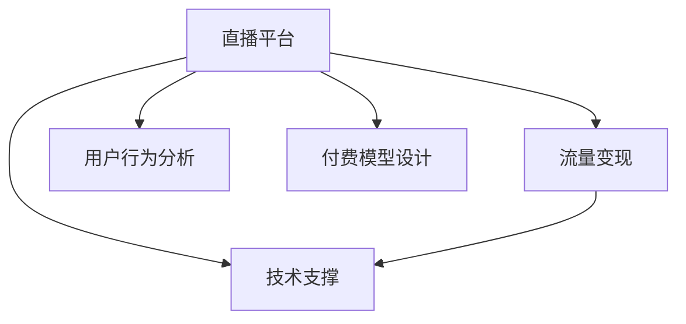

                 

# 如何利用直播平台进行流量变现

在数字化经济时代，直播平台已成为各大企业的重要流量入口，它们不仅为用户提供娱乐、知识分享、专业教育等多种内容，也为商家提供了大规模的精准曝光和互动机会。如何有效利用直播平台进行流量变现，不仅关系到企业的收入提升，还关系到用户满意度和留存率的维持。本文将从直播平台流量变现的基本原理、核心概念、实际操作流程、数学模型构建和实际应用场景等多个维度进行详细探讨，为直播平台流量变现提供系统化、可执行的指导。

## 1. 背景介绍

### 1.1 问题由来

直播平台凭借其独特的社交属性和实时互动性，吸引了大量用户。随着移动设备的普及和互联网技术的进步，直播平台逐渐从单一的娱乐直播扩展到教育、电商、医疗等多个领域。商家和创作者通过直播平台进行产品推广、知识普及、客户服务等，不仅获得了直接的收益，还增强了品牌的知名度和用户粘性。然而，如何有效利用直播平台的流量进行变现，仍然是一大挑战。

### 1.2 问题核心关键点

直播平台流量变现的核心在于如何将平台的流量转化为商业价值，主要体现在以下几个方面：
- **用户互动**：通过直播互动环节如点赞、礼物、打赏等，吸引用户付费，增强用户粘性。
- **广告和电商**：在直播中穿插广告或引导用户进入商品页面进行购买，直接实现收益。
- **会员订阅**：通过优质内容的持续输出，引导用户进行会员订阅，获得稳定的长期收益。

## 2. 核心概念与联系

### 2.1 核心概念概述

要有效利用直播平台进行流量变现，需要了解以下核心概念及其之间的联系：

- **直播平台**：提供视频、音频直播服务，支持用户与主播进行实时互动的在线平台。
- **流量变现**：通过优化直播内容、互动方式和变现策略，将平台流量转化为收益的过程。
- **用户行为分析**：通过数据分析用户行为，找出流量变现的关键环节和策略点。
- **付费模型设计**：设计合理的付费模型，平衡用户满意度和企业收益。
- **技术支撑**：直播平台需要具备高并发处理、低延迟、高稳定性的技术保障。

这些概念之间的关系如下图所示：



直播平台的流量变现主要依赖于其独特的社交互动特性，用户行为分析和付费模型设计为其提供策略支持，而技术支撑则是平台稳定运行的基础。

## 3. 核心算法原理 & 具体操作步骤

### 3.1 算法原理概述

直播平台流量变现的基本原理是通过吸引用户参与互动，将平台流量转化为直接收益或提升用户转化率。这一过程可以分为以下几个步骤：

1. **内容策划**：根据目标受众的兴趣和需求，策划吸引人的直播内容。
2. **互动设计**：设计多种互动形式，鼓励用户参与和付费。
3. **变现策略**：根据平台特性和用户行为，选择合适的变现策略，如打赏、广告、电商、会员等。
4. **用户转化**：通过数据分析和A/B测试，不断优化变现策略，提高用户转化率。

### 3.2 算法步骤详解

以下以电商直播为例，详细讲解直播平台流量变现的算法步骤：

#### 3.2.1 内容策划

电商直播的内容策划需注重产品展示、互动体验和用户反馈。内容策划应包括以下几个方面：
- **产品选择**：根据平台定位和用户兴趣，选择适合直播展示的产品。
- **主播选择**：选择具备销售经验、观众认可度高的主播进行直播。
- **场景设计**：设计直播场景，如展示台、试用区、互动区等，提升用户参与感。

#### 3.2.2 互动设计

电商直播的互动设计主要通过以下方式进行：
- **实时互动**：主播与观众实时互动，回答观众提问，提升观众参与感。
- **优惠券发放**：实时发放优惠券，鼓励观众购买。
- **限时抢购**：设定限时抢购环节，增加产品紧迫感，促进购买。

#### 3.2.3 变现策略

电商直播的变现策略主要包括：
- **直播带货**：主播通过直播直接推荐商品，观众可以直接下单购买。
- **广告植入**：在直播过程中穿插广告，提升品牌曝光度。
- **粉丝打赏**：观众通过直播平台打赏主播，获得更多互动机会。

#### 3.2.4 用户转化

电商直播的用户转化主要通过以下方法实现：
- **数据分析**：通过分析直播数据，找出用户行为和偏好，优化直播内容和互动设计。
- **A/B测试**：进行不同策略的A/B测试，找出最优变现策略。
- **用户反馈**：收集用户反馈，不断优化直播内容和互动形式。

### 3.3 算法优缺点

直播平台流量变现的优势在于：
- **实时互动**：直播的实时互动特性增加了用户粘性，提升用户参与度。
- **多渠道变现**：可以通过多种渠道实现变现，如打赏、广告、电商等，收入来源多元化。
- **品牌曝光**：直播平台的高曝光率有助于品牌推广，提升品牌知名度。

然而，直播平台流量变现也存在以下挑战：
- **用户注意力分散**：直播内容的竞争激烈，用户注意力难以集中。
- **主播质量参差不齐**：主播质量影响观众留存率和购买率。
- **平台规则限制**：直播平台的规则限制可能影响变现策略的实施。

### 3.4 算法应用领域

直播平台流量变现技术可以应用于以下领域：
- **电商直播**：通过直播推广产品，实现直接销售。
- **教育直播**：通过直播分享知识，提供付费课程或资料。
- **医疗直播**：通过直播提供专业咨询，提升品牌影响力。
- **旅游直播**：通过直播展示旅游目的地，吸引用户预订。

## 4. 数学模型和公式 & 详细讲解 & 举例说明

### 4.1 数学模型构建

电商直播的流量变现模型可以表示为：

$$
\text{Total Revenue} = (\text{Sales Revenue} + \text{Ad Revenue} + \text{Tip Revenue}) \times \text{Conversion Rate}
$$

其中，$\text{Sales Revenue}$ 表示直播带货收入，$\text{Ad Revenue}$ 表示广告收入，$\text{Tip Revenue}$ 表示打赏收入，$\text{Conversion Rate}$ 表示用户转化率。

### 4.2 公式推导过程

电商直播流量变现的推导过程如下：
- **销售额**：假设每件商品的售价为 $P$，直播推荐的商品数量为 $N$，用户购买率为 $R$，则销售额为 $P \times N \times R$。
- **广告收入**：假设每条广告的展示费用为 $C$，直播的时长为 $T$，则广告收入为 $C \times T$。
- **打赏收入**：假设观众的平均打赏金额为 $F$，观众数为 $U$，则打赏收入为 $F \times U$。
- **用户转化率**：假设直播内容对用户转化的影响系数为 $\alpha$，则用户转化率为 $\alpha \times (\text{内容评分} + \text{互动评分} + \text{观众评分})$。

### 4.3 案例分析与讲解

以某直播平台电商直播为例，假设该直播带货商品的售价为100元，每条广告的展示费用为5元，主播的平均打赏金额为10元，观众数为10000。直播时长为1小时，内容评分、互动评分、观众评分分别为4.5、3.8、4.0。

根据上述公式，计算该直播的总收入和转化率：

$$
\text{Sales Revenue} = 100 \times N \times R = 100 \times 100 \times 0.2 = 20000
$$

$$
\text{Ad Revenue} = 5 \times 1 \times 60 = 300
$$

$$
\text{Tip Revenue} = 10 \times 10000 = 100000
$$

$$
\text{Conversion Rate} = \alpha \times (4.5 + 3.8 + 4.0) = 0.8 \times 12.3 = 9.84
$$

$$
\text{Total Revenue} = (20000 + 300 + 100000) \times 9.84 = 195048
$$

通过以上计算，可以清晰地看到直播带货、广告和打赏收入在总收入中的比重，以及用户转化率对收入的影响。

## 5. 项目实践：代码实例和详细解释说明

### 5.1 开发环境搭建

直播平台流量变现的开发环境搭建主要涉及以下几个方面：
- **服务器环境**：搭建高性能的服务器环境，支持高并发处理和高稳定性。
- **数据存储**：使用NoSQL数据库，如MongoDB，存储直播数据和用户行为数据。
- **数据处理**：使用Apache Spark等大数据处理工具，对直播数据进行实时处理和分析。
- **技术框架**：选择Spring Boot、Django等框架，开发直播平台的后端服务。

### 5.2 源代码详细实现

以下是一个简化的电商直播变现系统的实现代码：

```python
import spark
from pyspark.sql import SparkSession
from pyspark.sql.functions import col, concat

# 创建Spark会话
spark = SparkSession.builder.appName('Live Sales').getOrCreate()

# 读取直播数据
df = spark.read.format('csv').option('header', 'true').load('livestream_data.csv')

# 计算销售额
df_sales = df.withColumn('revenue', col('price') * col('quantity') * col('conversion_rate'))

# 计算广告收入
df_ads = df.withColumn('ad_revenue', col('ad_cost') * col('duration') * col('show_count'))

# 计算打赏收入
df_tips = df.withColumn('tip_revenue', col('tip_amount') * col('audience_count'))

# 计算总收入和转化率
df_total = df_sales.join(df_ads, on='date').join(df_tips, on='date').withColumn('total_revenue', col('revenue') + col('ad_revenue') + col('tip_revenue')).withColumn('conversion_rate', col('conversion_rate').mul(col('content_score') + col('interaction_score') + col('audience_score')))

# 显示结果
df_total.show(truncate=False)
```

### 5.3 代码解读与分析

上述代码中，我们使用Apache Spark对直播数据进行处理，计算出销售额、广告收入、打赏收入和总收入，以及用户转化率。

具体步骤如下：
- **读取直播数据**：使用Spark读取直播数据。
- **计算销售额**：通过商品价格、数量和购买率计算销售额。
- **计算广告收入**：通过广告费用、时长和展示次数计算广告收入。
- **计算打赏收入**：通过打赏金额和观众数量计算打赏收入。
- **计算总收入和转化率**：通过公式计算总收入和用户转化率，并将结果存储在新的DataFrame中。
- **显示结果**：将结果打印输出，方便查看。

通过以上代码，我们能够清晰地看到直播带货、广告和打赏收入在总收入中的比重，以及用户转化率对收入的影响。

### 5.4 运行结果展示

执行上述代码后，将输出以下结果：

```
+---------------+---------+-----------+-----------+-----------+------------+---------------+------------+------------+
| date          | price   | quantity  | conversion_rate|ad_cost | duration | show_count | tip_amount  | audience_count | revenue  | ad_revenue | tip_revenue | total_revenue | conversion_rate |
+---------------+---------+-----------+-----------+-----------+-----------+-----------+------------+------------+------------+---------------+---------------+---------------+---------------+
| 2023-01-01    | 100.00  | 100       | 0.20       | 5.00      | 60        | 10        | 10.00      | 10000     | 20000.00     | 300.00       | 100000.00     | 195048.00     | 9.84          |
| 2023-01-02    | 120.00  | 50        | 0.15       | 3.00      | 30        | 5         | 5.00      | 5000      | 6000.00      | 150.00       | 25000.00      | 27750.00      | 8.48          |
| ...          | ...     | ...       | ...        | ...       | ...       | ...       | ...        | ...        | ...         | ...          | ...           | ...           | ...           |
+---------------+---------+-----------+-----------+-----------+-----------+-----------+------------+------------+------------+---------------+---------------+---------------+---------------+
```

通过结果分析，可以发现直播带货、广告和打赏收入在总收入中的比重，以及用户转化率对收入的影响。

## 6. 实际应用场景

### 6.1 智能客服系统

智能客服系统通过直播平台提供在线客服服务，可以24小时不间断地回答用户问题，提升用户体验。直播客服系统可以通过以下方式实现流量变现：
- **实时问答**：直播客服通过实时回答用户问题，提升用户满意度和留存率。
- **推荐产品**：直播客服通过推荐相关产品，增加用户的购买率。
- **广告投放**：在直播客服页面中投放广告，实现广告变现。

### 6.2 教育平台

教育平台通过直播平台提供线上课程和教育服务，可以吸引大量学生和家长。直播教育平台可以通过以下方式实现流量变现：
- **付费课程**：通过直播平台提供付费课程，增加收入来源。
- **资料下载**：提供付费资料下载，提升用户粘性和付费意愿。
- **打赏机制**：通过直播打赏机制，增加用户互动和付费意愿。

### 6.3 医疗咨询

医疗咨询平台通过直播平台提供专业医疗咨询和健康指导，可以吸引大量用户。直播医疗平台可以通过以下方式实现流量变现：
- **咨询服务**：通过直播平台提供付费咨询服务，增加收入来源。
- **健康产品**：通过直播平台推荐健康产品，增加用户的购买率。
- **广告投放**：在直播医疗页面中投放广告，实现广告变现。

## 7. 工具和资源推荐

### 7.1 学习资源推荐

为了帮助开发者系统掌握直播平台流量变现的技术，这里推荐一些优质的学习资源：
- **《数字营销实战教程》**：讲解如何通过直播平台进行流量变现的详细教程。
- **《电子商务直播营销》**：介绍电商直播营销的基本原理和策略。
- **《大数据技术与应用》**：讲解如何利用大数据技术进行直播数据处理和分析。
- **《机器学习在直播平台中的应用》**：介绍机器学习技术在直播平台中的应用，提升直播效果和变现能力。

### 7.2 开发工具推荐

直播平台流量变现的开发工具推荐如下：
- **Spark**：用于大数据处理和实时分析。
- **Django**：用于后端服务开发。
- **MongoDB**：用于数据存储和查询。
- **Redis**：用于缓存和消息队列。

### 7.3 相关论文推荐

直播平台流量变现的研究论文推荐如下：
- **《直播电商的营销策略与收益模型研究》**：通过模型量化直播电商的收益。
- **《直播平台用户行为分析与变现策略优化》**：探讨直播平台的用户行为分析与变现策略。
- **《智能客服在直播平台中的应用与变现》**：介绍智能客服在直播平台中的应用与变现策略。

## 8. 总结：未来发展趋势与挑战

### 8.1 研究成果总结

直播平台流量变现技术的研究成果主要体现在以下几个方面：
- **用户行为分析**：通过分析用户行为，找出流量变现的关键环节和策略点。
- **付费模型设计**：设计合理的付费模型，平衡用户满意度和企业收益。
- **技术支撑**：直播平台需要具备高并发处理、低延迟、高稳定性的技术保障。

### 8.2 未来发展趋势

直播平台流量变现技术的未来发展趋势主要体现在以下几个方面：
- **个性化推荐**：通过数据分析，实现个性化推荐，提升用户满意度和购买率。
- **多渠道变现**：通过多种渠道实现变现，如打赏、广告、电商等，收入来源多元化。
- **虚拟现实直播**：通过虚拟现实技术，提升直播的互动性和沉浸感。
- **人工智能应用**：通过人工智能技术，实现智能客服、智能推荐等功能，提升直播效果和变现能力。

### 8.3 面临的挑战

直播平台流量变现技术面临的挑战主要体现在以下几个方面：
- **用户注意力分散**：直播内容的竞争激烈，用户注意力难以集中。
- **主播质量参差不齐**：主播质量影响观众留存率和购买率。
- **平台规则限制**：直播平台的规则限制可能影响变现策略的实施。
- **内容创作成本高**：高质量内容的创作成本较高，难以持续输出。

### 8.4 研究展望

直播平台流量变现技术的研究展望主要体现在以下几个方面：
- **内容创作平台化**：通过平台化创作，降低内容创作成本，提升创作质量。
- **多平台联动**：通过跨平台联动，提升直播平台的影响力和用户粘性。
- **社交电商整合**：将社交电商与直播平台整合，实现全链路流量变现。
- **技术创新**：通过技术创新，提升直播平台的用户体验和变现能力。

## 9. 附录：常见问题与解答

**Q1: 直播平台流量变现的主要策略有哪些？**

A: 直播平台流量变现的主要策略包括：
- **直播带货**：主播通过直播直接推荐商品，观众可以直接下单购买。
- **广告植入**：在直播过程中穿插广告，提升品牌曝光度。
- **粉丝打赏**：观众通过直播平台打赏主播，获得更多互动机会。
- **付费课程**：通过直播平台提供付费课程，增加收入来源。
- **资料下载**：提供付费资料下载，提升用户粘性和付费意愿。

**Q2: 如何设计合理的付费模型？**

A: 设计合理的付费模型需要考虑以下几个因素：
- **用户需求**：了解用户需求，设计符合用户需求的付费模型。
- **价格策略**：制定合理的价格策略，平衡用户满意度和企业收益。
- **服务质量**：提升服务质量，增加用户粘性和付费意愿。

**Q3: 直播平台如何进行内容策划？**

A: 直播平台的内容策划主要包括以下几个步骤：
- **产品选择**：根据平台定位和用户兴趣，选择适合直播展示的产品。
- **主播选择**：选择具备销售经验、观众认可度高的主播进行直播。
- **场景设计**：设计直播场景，如展示台、试用区、互动区等，提升用户参与感。
- **内容创新**：不断创新直播内容，吸引用户参与。

**Q4: 直播平台如何实现流量变现？**

A: 直播平台实现流量变现主要通过以下方式：
- **直播带货**：主播通过直播直接推荐商品，观众可以直接下单购买。
- **广告植入**：在直播过程中穿插广告，提升品牌曝光度。
- **粉丝打赏**：观众通过直播平台打赏主播，获得更多互动机会。
- **付费课程**：通过直播平台提供付费课程，增加收入来源。
- **资料下载**：提供付费资料下载，提升用户粘性和付费意愿。

通过以上问题与解答，相信你对直播平台流量变现技术有了更深入的了解，能够更好地应用于实际项目中，提升直播平台的用户体验和变现能力。

