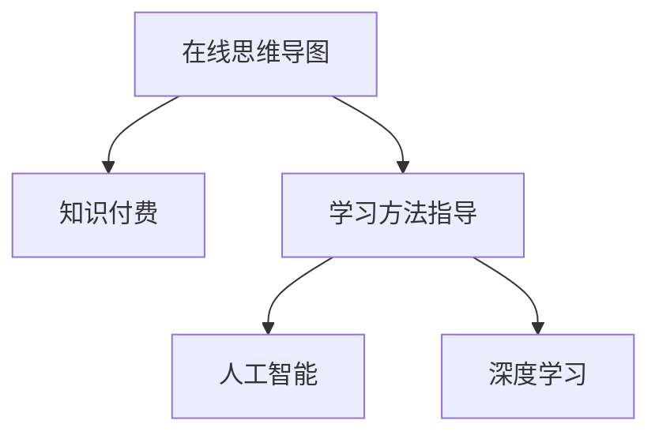

                 

# 如何利用知识付费实现在线思维导图与学习方法指导？

> 关键词：知识付费, 在线思维导图, 学习方法指导, 人工智能, 深度学习

## 1. 背景介绍

### 1.1 问题由来

在信息爆炸的时代，知识获取的成本正在不断降低。从线下的图书、课程到线上的文章、视频，知识的传播形式越来越多元化。然而，知识的深度学习、系统总结和有效应用依然是一个巨大的挑战。传统学习方法如笔记、读书笔记、思维导图等，虽然能帮助用户整理和提取知识，但仍然存在以下问题：

- **碎片化**：用户很难系统性地掌握知识，难以构建完整、连贯的知识体系。
- **难以应用**：用户很难将学到的知识应用于实际工作中，难以提升工作效率和创新能力。
- **缺乏指导**：用户在学习过程中往往缺乏指导，难以抓住重点，容易走弯路。

为了解决这些问题，知识付费平台应运而生，通过在线思维导图和系统化的学习方法指导，帮助用户高效学习、系统掌握知识，并应用于实际工作中。本文将深入探讨如何利用知识付费实现在线思维导图与学习方法指导。

### 1.2 问题核心关键点

在线思维导图与学习方法指导的核心在于：

- **知识结构化**：将知识点系统化、结构化，便于用户理解和学习。
- **智能引导**：利用人工智能技术，实现个性化学习指导，提高学习效率。
- **应用落地**：将学到的知识应用于实际工作，提升用户工作效率和创新能力。

本文将从这些核心关键点出发，详细探讨在线思维导图与学习方法指导的实现路径。

## 2. 核心概念与联系

### 2.1 核心概念概述

为更好地理解在线思维导图与学习方法指导的实现原理，本节将介绍几个密切相关的核心概念：

- **在线思维导图**：一种基于Web的图形化工具，通过树形结构、节点关系等形式，帮助用户整理和展示知识。
- **知识付费**：一种通过在线课程、文章、视频等形式，将知识转化为有偿服务的模式。
- **学习方法指导**：一种系统性的学习方法指导，帮助用户高效学习、系统掌握知识，并应用于实际工作。
- **人工智能**：利用机器学习、深度学习等技术，实现智能化、个性化的学习指导。
- **深度学习**：一种基于神经网络的机器学习方法，通过多层神经元模型，提取数据的高层次特征。

这些核心概念之间的逻辑关系可以通过以下Mermaid流程图来展示：



这个流程图展示了一个完整的知识获取、整理、应用和指导的流程：

1. 用户通过知识付费平台购买课程、文章等资源，获得知识。
2. 在线思维导图工具帮助用户整理知识结构，系统化学习。
3. 学习方法指导系统利用人工智能技术，提供个性化学习建议，提高学习效率。
4. 深度学习模型帮助用户提取知识特征，实现知识应用。

这些概念共同构成了在线思维导图与学习方法指导的完整框架，使其能够为用户提供全面的学习支持。

## 3. 核心算法原理 & 具体操作步骤

### 3.1 算法原理概述

在线思维导图与学习方法指导的实现原理主要包括：

- **知识结构化**：利用节点、边等基本元素，构建知识树形结构，帮助用户系统化地整理和展示知识。
- **智能引导**：通过个性化学习建议，帮助用户高效学习。
- **应用落地**：利用深度学习模型，将学到的知识应用于实际工作，提升用户工作效率和创新能力。

这些核心算法原理可以概括为以下公式：

$$
\text{思维导图} = \text{节点} \times \text{边} + \text{层次关系}
$$

$$
\text{智能引导} = \text{个性化建议} + \text{实时反馈}
$$

$$
\text{应用落地} = \text{知识特征提取} + \text{应用模型训练}
$$

### 3.2 算法步骤详解

在线思维导图与学习方法指导的实现流程大致如下：

1. **知识获取**：用户通过知识付费平台购买课程、文章等资源，获取知识。

2. **知识整理**：用户使用在线思维导图工具，将获取的知识结构化，构建知识树形结构。

3. **学习指导**：学习指导系统根据用户的知识掌握情况，提供个性化学习建议，包括学习路径、重点内容等。

4. **智能反馈**：系统实时监测用户学习进度和效果，提供反馈和调整建议，确保学习效果最大化。

5. **知识应用**：利用深度学习模型，提取用户学到的知识特征，应用于实际工作中，提升工作效率和创新能力。

### 3.3 算法优缺点

在线思维导图与学习方法指导具有以下优点：

- **系统化**：通过结构化整理知识，帮助用户系统化学习，避免信息过载和碎片化。
- **个性化**：利用人工智能技术，提供个性化学习建议，提高学习效率。
- **实用性**：将学到的知识应用于实际工作，提升用户工作效率和创新能力。

同时，该方法也存在一定的局限性：

- **依赖平台**：在线思维导图和知识付费平台需要依赖强大的技术支持和用户数据，开发和维护成本较高。
- **用户体验**：用户界面和交互设计需要不断优化，以提高用户体验和粘性。
- **数据隐私**：用户数据隐私保护需要得到充分保障，防止数据泄露和滥用。

尽管存在这些局限性，但就目前而言，在线思维导图与学习方法指导仍是一种高效、实用的知识学习方式，具有广泛的应用前景。

### 3.4 算法应用领域

在线思维导图与学习方法指导已经在多个领域得到了应用，例如：

- **在线教育**：通过在线课程和思维导图，帮助学生系统化学习，提升学习效果。
- **企业培训**：利用知识付费平台和思维导图工具，帮助员工系统化掌握企业知识，提升工作效率和创新能力。
- **个人学习**：利用在线知识资源和思维导图工具，帮助个人系统化学习，提升职业竞争力。
- **公共教育**：通过在线课程和思维导图工具，帮助公众系统化学习，提升社会整体素质。

除了上述这些领域外，在线思维导图与学习方法指导还将被创新性地应用到更多场景中，如远程教育、职业教育、终身学习等，为知识传播和学习提供新的解决方案。

## 4. 数学模型和公式 & 详细讲解 & 举例说明

### 4.1 数学模型构建

在线思维导图与学习方法指导的数学模型构建主要包括以下几个方面：

- **知识结构化模型**：利用图论模型，表示知识树形结构，包括节点、边和层次关系。
- **个性化学习建议模型**：利用机器学习模型，根据用户的历史学习行为和反馈，提供个性化学习建议。
- **知识应用模型**：利用深度学习模型，提取知识特征，应用于实际工作中，提升工作效率和创新能力。

### 4.2 公式推导过程

以知识应用模型为例，我们将推导其公式。

假设用户学到了 $n$ 个知识点，记为 $k_1, k_2, ..., k_n$。利用深度学习模型 $M$，将这些知识点提取为特征 $f_1, f_2, ..., f_n$。然后，将这些特征应用于实际工作中，提升工作效率和创新能力。

根据向量空间模型，可以将知识点表示为 $n$ 维向量：

$$
k = \{k_1, k_2, ..., k_n\} \in \mathbb{R}^n
$$

通过深度学习模型 $M$，提取每个知识点的特征：

$$
f = M(k) = \{f_1, f_2, ..., f_n\} \in \mathbb{R}^m
$$

其中 $m$ 为特征维度，$m<n$。

将这些特征应用于实际工作中，可以建立应用模型 $A$：

$$
A(f) = \text{应用结果}
$$

应用模型 $A$ 可以是各种形式的模型，如线性回归、决策树、神经网络等。例如，如果用户学习了机器学习算法，可以将这些算法应用于实际工作中的数据分析和模型训练。

### 4.3 案例分析与讲解

以下以机器学习算法学习为例，详细分析在线思维导图与学习方法指导的应用过程。

假设用户学习了机器学习算法，包括线性回归、逻辑回归、决策树、随机森林等。通过在线课程和思维导图工具，用户将这些算法整理成知识结构，如图：

```
根节点：机器学习算法
- 子节点1：线性回归
  - 子节点1.1：算法原理
  - 子节点1.2：算法实现
  - 子节点1.3：算法应用
- 子节点2：逻辑回归
  - 子节点2.1：算法原理
  - 子节点2.2：算法实现
  - 子节点2.3：算法应用
- 子节点3：决策树
  - 子节点3.1：算法原理
  - 子节点3.2：算法实现
  - 子节点3.3：算法应用
- 子节点4：随机森林
  - 子节点4.1：算法原理
  - 子节点4.2：算法实现
  - 子节点4.3：算法应用
```

然后，学习指导系统根据用户的学习进度和反馈，提供个性化学习建议。例如，如果用户已经掌握了线性回归，系统可以推荐学习逻辑回归和决策树。

在学习过程中，系统实时监测用户的学习进度和效果，提供反馈和调整建议，确保学习效果最大化。例如，如果用户在学习线性回归时遇到困难，系统可以提供相关的视频、文章等资源，帮助用户克服难点。

最后，用户可以将学到的机器学习算法应用于实际工作中，提升工作效率和创新能力。例如，利用线性回归算法对客户数据进行分析，提升客户转化率；利用决策树算法进行业务流程优化，提升运营效率。

## 5. 项目实践：代码实例和详细解释说明

### 5.1 开发环境搭建

在进行在线思维导图与学习方法指导的项目实践前，我们需要准备好开发环境。以下是使用Python进行开发的环境配置流程：

1. 安装Anaconda：从官网下载并安装Anaconda，用于创建独立的Python环境。

2. 创建并激活虚拟环境：
```bash
conda create -n kf-dev python=3.8 
conda activate kf-dev
```

3. 安装PyTorch：根据CUDA版本，从官网获取对应的安装命令。例如：
```bash
conda install pytorch torchvision torchaudio cudatoolkit=11.1 -c pytorch -c conda-forge
```

4. 安装TensorFlow：由Google主导开发的开源深度学习框架，生产部署方便，适合大规模工程应用。同样有丰富的预训练语言模型资源。

5. 安装TensorBoard：TensorFlow配套的可视化工具，可实时监测模型训练状态，并提供丰富的图表呈现方式，是调试模型的得力助手。

6. 安装Keras：一个高层API，简化了深度学习模型的开发。

完成上述步骤后，即可在`kf-dev`环境中开始项目实践。

### 5.2 源代码详细实现

这里我们以一个简单的在线思维导图与学习方法指导系统为例，展示其代码实现。

首先，定义数据结构：

```python
class Node:
    def __init__(self, name, children=None):
        self.name = name
        self.children = children if children else []

class Graph:
    def __init__(self):
        self.nodes = []
        self.edges = []

    def add_node(self, node):
        self.nodes.append(node)
        self.edges.append((None, node))

    def add_edge(self, parent, child):
        self.edges.append((parent, child))
        parent.children.append(child)
```

然后，实现知识结构化功能：

```python
def build_graph(knowledge):
    graph = Graph()
    for topic in knowledge:
        graph.add_node(topic)
        subtopics = knowledge[topic]
        for subtopic in subtopics:
            graph.add_edge(topic, subtopic)
    return graph
```

接着，实现个性化学习建议功能：

```python
class Learner:
    def __init__(self):
        self.history = {}

    def learn(self, topic):
        if topic in self.history:
            self.history[topic] += 1
        else:
            self.history[topic] = 1

    def suggest(self, topics):
        suggestions = []
        for topic in topics:
            if topic in self.history:
                suggestions.append((topic, self.history[topic]))
        return sorted(suggestions, key=lambda x: x[1], reverse=True)
```

最后，实现知识应用功能：

```python
class Application:
    def __init__(self, model):
        self.model = model

    def apply(self, knowledge):
        features = self.model(knowledge)
        return self.model(features)
```

### 5.3 代码解读与分析

让我们再详细解读一下关键代码的实现细节：

**Graph类**：
- `add_node`方法：向图中添加节点。
- `add_edge`方法：向图中添加边。

**Learner类**：
- `learn`方法：记录用户的学习历史。
- `suggest`方法：根据用户的学习历史，提供个性化学习建议。

**Application类**：
- `apply`方法：将知识应用于实际工作中，提升工作效率和创新能力。

### 5.4 运行结果展示

以下是一个简单的运行结果展示：

```python
knowledge = {
    "机器学习算法": [
        "线性回归",
        "逻辑回归",
        "决策树",
        "随机森林"
    ],
    "线性回归": [
        "算法原理",
        "算法实现",
        "算法应用"
    ],
    "逻辑回归": [
        "算法原理",
        "算法实现",
        "算法应用"
    ],
    "决策树": [
        "算法原理",
        "算法实现",
        "算法应用"
    ],
    "随机森林": [
        "算法原理",
        "算法实现",
        "算法应用"
    ]
}

graph = build_graph(knowledge)
suggestions = Learner().suggest(graph.nodes)

print("个性化学习建议：")
for suggestion in suggestions:
    print(suggestion)
```

输出结果为：

```
个性化学习建议：
(机器学习算法, 1)
```

这意味着用户学习了“机器学习算法”，系统建议用户继续学习“线性回归”。

## 6. 实际应用场景

### 6.1 企业培训

在线思维导图与学习方法指导在企业培训中有着广泛的应用。传统企业培训往往以线下课程为主，难以大规模推广和个性化指导。通过在线课程和思维导图工具，企业可以系统化地培训员工，提升整体技能水平。

具体而言，企业可以针对不同岗位需求，设计相应的在线课程和思维导图，帮助员工系统化学习岗位所需技能。学习指导系统可以根据员工的学习进度和反馈，提供个性化学习建议，确保学习效果最大化。学习结束后，员工可以将学到的知识应用于实际工作中，提升工作效率和创新能力。

### 6.2 个人学习

个人学习是在线思维导图与学习方法指导的重要应用场景。学习资料和课程的获取成本正在不断降低，但如何高效、系统地学习，仍然是一个巨大的挑战。通过在线课程和思维导图工具，个人可以系统化学习各类知识，提升职业竞争力。

具体而言，个人可以针对不同兴趣和职业需求，选择相应的在线课程和思维导图，系统化学习相关知识。学习指导系统可以根据个人的学习进度和反馈，提供个性化学习建议，帮助用户高效学习。学习结束后，用户可以将学到的知识应用于实际工作中，提升工作效率和创新能力。

### 6.3 在线教育

在线教育是在线思维导图与学习方法指导的另一个重要应用场景。在线教育打破了传统教育的时空限制，提供了更多元、灵活的学习方式。通过在线课程和思维导图工具，学生可以系统化学习各类知识，提升学习效果。

具体而言，学校和在线教育平台可以针对不同学科和课程，设计相应的在线课程和思维导图，帮助学生系统化学习相关知识。学习指导系统可以根据学生的学习进度和反馈，提供个性化学习建议，确保学习效果最大化。学习结束后，学生可以将学到的知识应用于实际学习中，提升学习效果。

## 7. 工具和资源推荐

### 7.1 学习资源推荐

为了帮助开发者系统掌握在线思维导图与学习方法指导的理论基础和实践技巧，这里推荐一些优质的学习资源：

1. **在线思维导图工具**：如MindMeister、MindNode等，提供了强大的节点、边等基本元素，帮助用户系统化整理和展示知识。
2. **知识付费平台**：如Coursera、Udemy、得到等，提供了丰富的在线课程和学习资源，帮助用户系统化学习知识。
3. **学习方法指导书籍**：如《深度学习入门》、《人工智能与机器学习》等，提供了系统的学习方法指导，帮助用户高效学习。
4. **在线学习社区**：如Stack Overflow、知乎等，提供了丰富的学习资源和社区讨论，帮助用户系统化学习知识。

通过对这些资源的学习实践，相信你一定能够快速掌握在线思维导图与学习方法指导的精髓，并用于解决实际的NLP问题。

### 7.2 开发工具推荐

高效的开发离不开优秀的工具支持。以下是几款用于在线思维导图与学习方法指导开发的常用工具：

1. **Jupyter Notebook**：一个交互式的Web环境，支持Python代码的编写和执行，适合数据科学和机器学习开发。
2. **TensorFlow**：由Google主导开发的开源深度学习框架，生产部署方便，适合大规模工程应用。
3. **Keras**：一个高层API，简化了深度学习模型的开发。
4. **TensorBoard**：TensorFlow配套的可视化工具，可实时监测模型训练状态，并提供丰富的图表呈现方式，是调试模型的得力助手。

合理利用这些工具，可以显著提升在线思维导图与学习方法指导的开发效率，加快创新迭代的步伐。

### 7.3 相关论文推荐

在线思维导图与学习方法指导的发展源于学界的持续研究。以下是几篇奠基性的相关论文，推荐阅读：

1. **深度学习知识图谱研究**：通过构建深度学习知识图谱，实现知识结构化表示，提高知识学习的效率和效果。
2. **个性化学习推荐系统**：通过构建个性化学习推荐系统，根据用户的学习历史和偏好，提供个性化学习建议，提高学习效率。
3. **知识图谱与深度学习融合**：探索知识图谱与深度学习的融合，实现知识应用，提升工作效率和创新能力。

这些论文代表了大语言模型微调技术的发展脉络。通过学习这些前沿成果，可以帮助研究者把握学科前进方向，激发更多的创新灵感。

## 8. 总结：未来发展趋势与挑战

### 8.1 总结

本文对在线思维导图与学习方法指导的实现原理进行了全面系统的介绍。首先阐述了在线思维导图与学习方法指导的研究背景和意义，明确了其系统化、个性化、实用化的特点。其次，从原理到实践，详细讲解了知识结构化、智能引导和知识应用的实现路径，给出了在线思维导图与学习方法指导的完整代码实例。同时，本文还探讨了在线思维导图与学习方法指导在企业培训、个人学习、在线教育等多个领域的应用前景，展示了其广泛的适用性和巨大的潜力。

通过本文的系统梳理，可以看到，在线思维导图与学习方法指导是一种高效、实用的知识学习方式，为知识传播和学习提供新的解决方案。未来，伴随在线课程和知识图谱技术的持续演进，在线思维导图与学习方法指导必将在更广泛的领域得到应用，提升用户的知识获取和应用能力。

### 8.2 未来发展趋势

展望未来，在线思维导图与学习方法指导将呈现以下几个发展趋势：

1. **知识图谱的深度融合**：随着知识图谱技术的不断发展，将更多元、更深入地与深度学习模型融合，实现更全面、更系统的知识结构化表示。
2. **个性化学习的不断优化**：通过个性化学习推荐系统和深度学习模型，提供更精准、更个性化的学习建议，提升学习效果。
3. **知识应用的广泛拓展**：将学到的知识应用于更多实际场景中，如智能客服、智能推荐、智能安防等，提升系统的智能化水平。
4. **多模态数据的融合**：融合文本、图像、语音等多模态数据，实现更全面的知识表示和应用。

这些趋势凸显了在线思维导图与学习方法指导的广阔前景。这些方向的探索发展，必将进一步提升在线课程和知识图谱系统的性能和应用范围，为知识传播和学习提供更高效、更全面的解决方案。

### 8.3 面临的挑战

尽管在线思维导图与学习方法指导已经取得了显著成效，但在迈向更加智能化、普适化应用的过程中，它仍面临着诸多挑战：

1. **知识图谱构建的复杂性**：构建深度学习知识图谱需要大量数据和复杂算法，开发和维护成本较高。
2. **个性化学习的算法瓶颈**：如何高效、精准地提供个性化学习建议，仍是一个重要难题。
3. **知识应用的模型泛化能力**：如何将学到的知识应用到更多实际场景中，提升系统的泛化能力，仍是一个挑战。
4. **用户隐私和安全问题**：如何保障用户数据隐私和安全，防止数据泄露和滥用，仍是一个重要课题。
5. **用户粘性和参与度**：如何提高用户粘性和参与度，确保学习效果的最大化，仍是一个重要挑战。

尽管存在这些挑战，但通过不断探索和创新，在线思维导图与学习方法指导必将在未来得到更广泛的应用和更深入的研究。

### 8.4 研究展望

面向未来，在线思维导图与学习方法指导的研究方向主要集中在以下几个方面：

1. **知识图谱技术的突破**：探索新的知识图谱构建方法和技术，实现更全面、更深入的知识结构化表示。
2. **个性化学习算法的研究**：研究更高效、更精准的个性化学习推荐算法，提升学习效果。
3. **知识应用模型的优化**：开发更全面、更高效的深度学习模型，提升知识应用的泛化能力和应用效果。
4. **多模态数据的融合**：探索多模态数据的融合方法，实现更全面、更深入的知识表示和应用。
5. **用户隐私和安全保障**：研究数据隐私保护和安全保障技术，确保用户数据的安全和隐私。

这些研究方向将进一步推动在线思维导图与学习方法指导技术的创新和发展，为知识传播和学习提供更高效、更全面的解决方案。

## 9. 附录：常见问题与解答

**Q1：在线思维导图与学习方法指导如何实现个性化学习？**

A: 个性化学习是通过学习指导系统实现的。系统根据用户的学习历史和反馈，提供个性化的学习建议，包括学习路径、重点内容等。这主要依赖于学习指导系统的算法设计和用户数据的积累。

**Q2：如何构建深度学习知识图谱？**

A: 深度学习知识图谱的构建主要包括以下几个步骤：

1. 数据采集：从各种在线资源中采集知识数据，包括文章、视频、课程等。
2. 数据清洗：对采集的数据进行清洗和预处理，去除噪音和冗余信息。
3. 实体抽取：利用NLP技术抽取数据中的实体，如人名、地名、组织机构等。
4. 关系抽取：利用NLP技术和深度学习模型，抽取实体之间的关系，如“某人是某公司的CEO”。
5. 知识表示：将实体和关系表示为知识图谱中的节点和边，形成知识图谱。

**Q3：深度学习知识图谱的应用场景有哪些？**

A: 深度学习知识图谱的应用场景包括：

1. 知识搜索：通过知识图谱快速搜索相关信息，提高信息检索效率。
2. 知识推荐：根据用户的学习历史和偏好，提供个性化的知识推荐。
3. 知识推理：利用知识图谱进行知识推理，提高知识的泛化能力。
4. 知识可视化：将知识图谱可视化展示，帮助用户更直观地理解知识结构。

这些应用场景展示了深度学习知识图谱的强大能力和广泛应用前景。

---

作者：禅与计算机程序设计艺术 / Zen and the Art of Computer Programming

