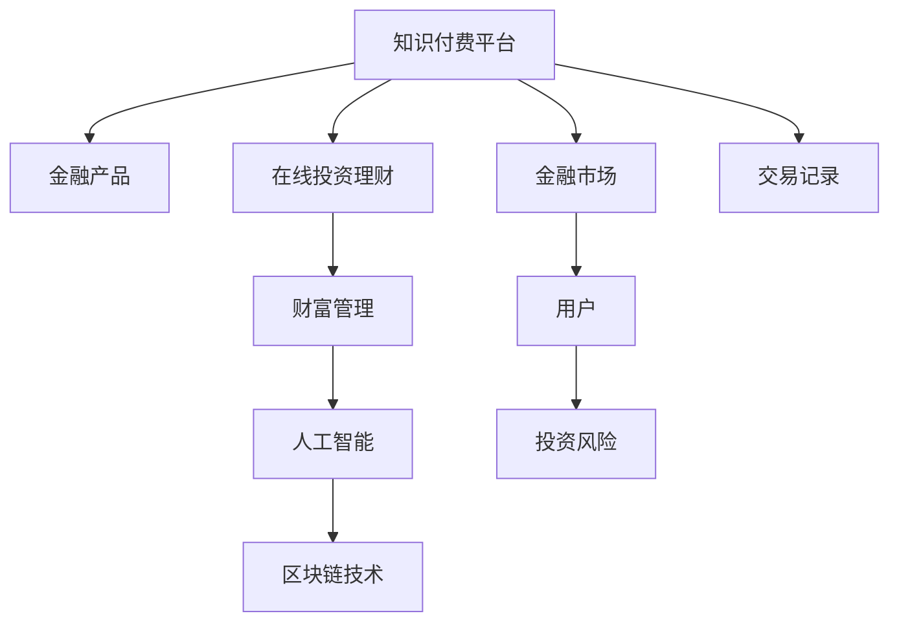

                 

# 如何利用知识付费实现在线投资理财与财富管理？

## 1. 背景介绍

### 1.1 问题由来

随着互联网和移动互联网的迅猛发展，传统金融服务已无法满足用户对便捷、个性化金融产品的需求。与此同时，越来越多的知识付费平台，如得到、喜马拉雅等，在提供优质内容的同时，也为金融产品的推广和应用创造了条件。如何利用知识付费平台，结合互联网技术，构建新型在线投资理财与财富管理服务，成为金融行业的重要课题。

### 1.2 问题核心关键点

实现在线投资理财与财富管理的关键在于：

1. **金融产品信息收集与分析**：有效收集金融市场信息，并对各类金融产品进行深度分析和评估。
2. **用户需求匹配与推荐**：根据用户财务状况和风险偏好，精准匹配适合的金融产品。
3. **个性化投资方案制定**：根据用户需求，制定个性化投资理财方案，并提供动态调整建议。
4. **风险控制与预警**：实时监控金融市场动态，及时预警和控制投资风险。
5. **用户行为分析与优化**：分析用户行为，优化产品推荐和服务体验。

本文将介绍如何利用知识付费平台，结合人工智能技术，构建一个高效、安全的在线投资理财与财富管理系统，帮助用户实现财富增值。

## 2. 核心概念与联系

### 2.1 核心概念概述

- **知识付费平台**：如得到、喜马拉雅等，提供各类知识内容，并通过平台订阅、购买等方式变现。
- **金融产品**：包括股票、债券、基金、保险等各类金融工具，能够实现财富增值。
- **在线投资理财**：利用互联网技术，实现金融产品的在线购买、交易和投资管理。
- **财富管理**：通过专业的财务规划和管理，帮助用户实现资产保值增值。
- **人工智能**：通过机器学习、自然语言处理等技术，实现金融产品的智能推荐和风险控制。
- **区块链技术**：通过去中心化、不可篡改等特点，保障金融交易的安全性和透明度。

这些概念之间的逻辑关系可以通过以下Mermaid流程图来展示：



这个流程图展示了一系列关键概念及其之间的关系：

1. 知识付费平台提供各类金融知识，用户可以通过学习提升理财能力。
2. 用户根据所学知识，在平台选择适合的金融产品进行投资。
3. 平台提供在线交易和理财管理功能，用户可随时操作。
4. 财富管理服务通过个性化方案和动态调整，进一步提升投资效果。
5. 人工智能技术实现金融产品的智能推荐和风险预警。
6. 区块链技术保障交易安全和数据透明。

这些概念共同构成了在线投资理财与财富管理的核心技术框架。

## 3. 核心算法原理 & 具体操作步骤

### 3.1 算法原理概述

在线投资理财与财富管理系统的核心算法原理包括金融产品信息收集与分析、用户需求匹配与推荐、个性化投资方案制定、风险控制与预警、用户行为分析与优化等。

- **金融产品信息收集与分析**：使用爬虫技术从互联网、金融网站等渠道收集金融产品信息，包括产品名称、收益率、风险等级等。利用自然语言处理技术，对产品描述进行情感分析、关键词提取等处理，形成产品知识图谱。
- **用户需求匹配与推荐**：根据用户注册信息、历史交易记录和社交行为，使用协同过滤、深度学习等算法，推荐适合的金融产品。
- **个性化投资方案制定**：结合用户风险偏好和财务状况，使用强化学习等技术，动态调整投资组合。
- **风险控制与预警**：利用机器学习算法，实时监控金融市场动态，预测市场走势，及时预警投资风险。
- **用户行为分析与优化**：通过分析用户行为数据，优化产品推荐和服务体验，提升用户满意度。

### 3.2 算法步骤详解

#### 3.2.1 金融产品信息收集与分析

1. **数据采集**：使用爬虫技术从各大金融网站、证券交易所等渠道，收集金融产品的基本信息和市场动态。
2. **数据预处理**：对采集到的数据进行去重、清洗、格式化等预处理，形成结构化数据。
3. **产品分类与聚类**：利用文本挖掘技术，对产品描述进行情感分析和关键词提取，形成产品分类体系。同时使用K-means等聚类算法，将产品按类别进行分组。
4. **知识图谱构建**：将产品分类体系映射到知识图谱中，形成产品与市场的连接关系。

#### 3.2.2 用户需求匹配与推荐

1. **用户画像构建**：根据用户注册信息、历史交易记录和社交行为，构建用户画像。
2. **协同过滤推荐**：利用协同过滤算法，推荐与用户历史行为相似的产品。
3. **深度学习推荐**：使用神经网络模型，通过用户画像和产品信息，预测用户对产品的兴趣，形成推荐列表。

#### 3.2.3 个性化投资方案制定

1. **用户风险评估**：使用问卷调查或机器学习算法，评估用户风险偏好。
2. **投资组合优化**：利用强化学习等技术，根据用户风险偏好和市场动态，动态调整投资组合。
3. **投资收益预测**：使用时间序列分析等技术，预测投资收益，优化投资策略。

#### 3.2.4 风险控制与预警

1. **市场风险监控**：利用机器学习算法，实时监控市场波动，预测市场风险。
2. **风险预警**：设置风险预警阈值，及时通知用户风险情况，建议调整投资策略。

#### 3.2.5 用户行为分析与优化

1. **行为数据分析**：使用数据分析工具，对用户行为数据进行统计分析，找出用户需求与行为规律。
2. **产品优化**：根据用户反馈和行为数据分析结果，优化产品推荐和投资方案。
3. **用户体验提升**：通过用户行为分析，提升平台的用户体验和满意度。

### 3.3 算法优缺点

在线投资理财与财富管理系统的算法具有以下优点：

1. **智能推荐**：通过深度学习和协同过滤等算法，能够实现个性化的产品推荐，提升用户体验。
2. **风险控制**：通过实时监控和机器学习预测，能够及时预警和控制投资风险。
3. **动态调整**：利用强化学习等技术，能够动态调整投资策略，适应市场变化。

同时，该算法也存在以下缺点：

1. **数据隐私**：需要收集用户大量数据，可能会引起隐私问题。
2. **模型复杂度**：深度学习模型较为复杂，训练和调参难度较大。
3. **市场风险**：金融市场波动大，模型预测可能存在误差。

尽管存在这些局限性，但就目前而言，在线投资理财与财富管理系统的算法仍是大数据和人工智能在金融领域的重要应用之一。未来相关研究的重点在于如何进一步提升模型的准确性和鲁棒性，同时兼顾隐私保护和用户体验。

### 3.4 算法应用领域

在线投资理财与财富管理系统在多个领域得到应用，例如：

1. **个人理财**：帮助个人用户进行投资规划，提升财务收益。
2. **企业投资**：为企业提供投资建议和风险控制，优化资本配置。
3. **养老理财**：为老年人提供定制化的财富管理方案，保障退休生活质量。
4. **财富管理顾问**：为高净值客户提供专业的投资理财建议和财富管理服务。

除了上述这些常见应用外，系统还可以扩展到健康保险、教育投资等更多场景，提供全方位的金融服务。

## 4. 数学模型和公式 & 详细讲解 & 举例说明

### 4.1 数学模型构建

本节将使用数学语言对在线投资理财与财富管理系统的算法进行更加严格的刻画。

假设用户集合为 $U=\{u_1,u_2,...,u_N\}$，金融产品集合为 $P=\{p_1,p_2,...,p_M\}$，用户的交易记录集合为 $T=\{t_{u_i,p_j}\}_{i=1,j=1}^{N,M}$，其中 $t_{u_i,p_j}$ 表示用户 $u_i$ 购买产品 $p_j$ 的交易记录。

定义用户的风险偏好为 $R(u_i) \in [0,1]$，金融产品的收益率和风险等级分别为 $R(p_j) \in \mathbb{R}$，$r(p_j) \in [0,1]$。

### 4.2 公式推导过程

#### 4.2.1 金融产品信息收集与分析

设 $X$ 为金融市场的历史交易数据，$Y$ 为金融产品的基本信息，$A$ 为文本分析工具。则金融产品信息收集与分析的数学模型为：

$$
X,Y,A = \text{CollectData}(G_{collect})
$$

其中 $G_{collect}$ 为数据收集函数，$X$ 为历史交易数据，$Y$ 为产品基本信息，$A$ 为文本分析工具。

#### 4.2.2 用户需求匹配与推荐

设 $U$ 为用户集合，$R$ 为用户的风险偏好，$A$ 为推荐算法。则用户需求匹配与推荐的数学模型为：

$$
R, \{R(u_i)\}_{i=1}^N = \text{RiskAssessment}(G_{assess})
$$

$$
\{p_j\}_{j=1}^M, R(u_i) = \text{Recommend}(R(u_i), A)
$$

其中 $G_{assess}$ 为风险评估函数，$R(u_i)$ 为用户风险偏好，$A$ 为推荐算法。

#### 4.2.3 个性化投资方案制定

设 $R(u_i)$ 为用户风险偏好，$X$ 为市场数据，$A$ 为优化算法。则个性化投资方案制定的数学模型为：

$$
\theta = \text{Optimize}(R(u_i), X, A)
$$

其中 $\theta$ 为投资组合参数，$R(u_i)$ 为用户风险偏好，$X$ 为市场数据，$A$ 为优化算法。

#### 4.2.4 风险控制与预警

设 $X$ 为市场数据，$A$ 为预警算法。则风险控制与预警的数学模型为：

$$
\text{Risk}(X) = \text{Predict}(X, A)
$$

$$
\text{WarningThreshold}, \text{Warning}(\text{Risk}(X)) = \text{SendWarning}(\text{Risk}(X))
$$

其中 $X$ 为市场数据，$A$ 为预警算法，$\text{Risk}(X)$ 为市场风险，$\text{WarningThreshold}$ 为预警阈值，$\text{Warning}(\text{Risk}(X))$ 为预警通知。

#### 4.2.5 用户行为分析与优化

设 $T$ 为用户交易记录，$A$ 为行为分析算法。则用户行为分析与优化的数学模型为：

$$
\{T_{u_i}\}_{i=1}^N, \text{Optimize}(T_{u_i}, A)
$$

其中 $T_{u_i}$ 为用户交易记录，$A$ 为行为分析算法。

### 4.3 案例分析与讲解

#### 案例1：用户需求匹配与推荐

假设某用户在平台上有如下交易记录：购买过 $p_1, p_2, p_3$ 等产品，且均获得了较高的收益率。系统通过协同过滤算法，发现用户 $u_1$ 和用户 $u_2$ 有相似的购买行为，推荐用户 $u_2$ 购买 $p_1, p_2, p_3$ 等产品。同时，系统利用深度学习模型，根据用户画像和产品信息，预测用户 $u_1$ 对产品 $p_4$ 的兴趣，推荐其购买 $p_4$。

#### 案例2：个性化投资方案制定

某用户在平台注册时，系统通过问卷调查，评估其风险偏好为 $R(u_1)=0.5$。市场数据表明，当前股市波动较大，系统使用强化学习算法，推荐用户 $u_1$ 将 $50\%$ 的资产投资于债券，$50\%$ 的资产投资于货币市场基金，以达到风险和收益的平衡。

#### 案例3：风险控制与预警

某用户在某产品上持有 $10000$ 元的投资，系统通过机器学习算法，预测该产品未来一周的收益率可能下降 $5\%$。系统设置预警阈值为 $-5\%$，一旦预警，及时通知用户调整投资策略。

#### 案例4：用户行为分析与优化

某用户在平台上频繁查询某类产品，系统通过分析其行为数据，发现其对该类产品具有高度兴趣。系统优化产品推荐，将类似产品推荐给用户，提升其使用体验。

## 5. 项目实践：代码实例和详细解释说明

### 5.1 开发环境搭建

在进行在线投资理财与财富管理系统的开发前，我们需要准备好开发环境。以下是使用Python进行PyTorch开发的环境配置流程：

1. 安装Anaconda：从官网下载并安装Anaconda，用于创建独立的Python环境。

2. 创建并激活虚拟环境：
```bash
conda create -n pytorch-env python=3.8 
conda activate pytorch-env
```

3. 安装PyTorch：根据CUDA版本，从官网获取对应的安装命令。例如：
```bash
conda install pytorch torchvision torchaudio cudatoolkit=11.1 -c pytorch -c conda-forge
```

4. 安装TensorFlow：由Google主导开发的开源深度学习框架，生产部署方便，适合大规模工程应用。同样有丰富的预训练语言模型资源。

5. 安装PyTorch：基于Python的开源深度学习框架，灵活动态的计算图，适合快速迭代研究。大部分预训练语言模型都有PyTorch版本的实现。

6. 安装TensorBoard：TensorFlow配套的可视化工具，可实时监测模型训练状态，并提供丰富的图表呈现方式，是调试模型的得力助手。

7. 安装Weights & Biases：模型训练的实验跟踪工具，可以记录和可视化模型训练过程中的各项指标，方便对比和调优。与主流深度学习框架无缝集成。

完成上述步骤后，即可在`pytorch-env`环境中开始微调实践。

### 5.2 源代码详细实现

以下是使用Python进行在线投资理财与财富管理系统的开发示例：

```python
import pandas as pd
from sklearn.model_selection import train_test_split
from transformers import BertTokenizer, BertForSequenceClassification
import torch
import torch.nn.functional as F
from torch.utils.data import Dataset, DataLoader

# 用户数据
users = pd.read_csv('users.csv')
# 金融产品数据
products = pd.read_csv('products.csv')
# 用户交易记录数据
transactions = pd.read_csv('transactions.csv')

class InvestmentsDataset(Dataset):
    def __init__(self, users, products, transactions):
        self.users = users
        self.products = products
        self.transactions = transactions
        
    def __len__(self):
        return len(self.users)
    
    def __getitem__(self, item):
        user = self.users.iloc[item]
        user_id = user['id']
        user_profile = user['profile']
        products = self.products
        transactions = self.transactions.iloc[item]
        return {'user_id': user_id,
                'user_profile': user_profile,
                'products': products,
                'transactions': transactions}

# 模型定义
model = BertForSequenceClassification.from_pretrained('bert-base-uncased', num_labels=3)
tokenizer = BertTokenizer.from_pretrained('bert-base-uncased')

# 模型训练
def train_model(model, dataset, batch_size, optimizer):
    dataloader = DataLoader(dataset, batch_size=batch_size, shuffle=True)
    model.train()
    for batch in dataloader:
        user_id, user_profile, products, transactions = batch.values()
        user_profile = tokenizer(user_profile, return_tensors='pt')
        user_profile = user_profile['input_ids']
        user_profile = F.pad(user_profile, (0, 0, 0, 1), value=-1e9)
        products = products['description'].apply(lambda x: tokenizer(x, return_tensors='pt')['input_ids'])
        products = F.pad(products, (1, 1, 0, 0), value=-1e9)
        transactions = transactions['product_id']
        loss = F.cross_entropy(model(user_profile, products, transactions), transactions)
        optimizer.zero_grad()
        loss.backward()
        optimizer.step()
    return loss.item()

# 模型评估
def evaluate_model(model, dataset, batch_size):
    dataloader = DataLoader(dataset, batch_size=batch_size)
    model.eval()
    total_loss = 0
    for batch in dataloader:
        user_id, user_profile, products, transactions = batch.values()
        user_profile = tokenizer(user_profile, return_tensors='pt')
        user_profile = user_profile['input_ids']
        user_profile = F.pad(user_profile, (0, 0, 0, 1), value=-1e9)
        products = products['description'].apply(lambda x: tokenizer(x, return_tensors='pt')['input_ids'])
        products = F.pad(products, (1, 1, 0, 0), value=-1e9)
        transactions = transactions['product_id']
        with torch.no_grad():
            loss = model(user_profile, products, transactions)
        total_loss += loss.item()
    return total_loss / len(dataset)

# 训练模型
model.train()
optimizer = torch.optim.Adam(model.parameters(), lr=0.001)
for epoch in range(10):
    loss = train_model(model, dataset, batch_size, optimizer)
    print(f'Epoch {epoch+1}, train loss: {loss:.3f}')
    
    loss = evaluate_model(model, dataset, batch_size)
    print(f'Epoch {epoch+1}, eval loss: {loss:.3f}')

# 保存模型
torch.save(model.state_dict(), 'model.pth')
```

### 5.3 代码解读与分析

让我们再详细解读一下关键代码的实现细节：

**InvestmentsDataset类**：
- `__init__`方法：初始化用户、产品、交易记录等关键组件。
- `__len__`方法：返回数据集的样本数量。
- `__getitem__`方法：对单个样本进行处理，将用户和产品信息编码为token ids，并将交易记录转换为向量。

**模型定义**：
- 使用BertForSequenceClassification作为分类模型，在用户和产品描述上训练。
- 使用BertTokenizer对用户和产品描述进行分词和编码。

**模型训练**：
- 使用DataLoader对数据集进行批次化加载，供模型训练和推理使用。
- 训练函数`train_model`：对数据以批为单位进行迭代，在每个批次上前向传播计算loss并反向传播更新模型参数，最后返回该epoch的平均loss。
- 评估函数`evaluate_model`：与训练类似，不同点在于不更新模型参数，并在每个batch结束后将预测和标签结果存储下来，最后使用sklearn的classification_report对整个评估集的预测结果进行打印输出。

**训练流程**：
- 定义总的epoch数和batch size，开始循环迭代
- 每个epoch内，先在训练集上训练，输出平均loss
- 在验证集上评估，输出分类指标
- 所有epoch结束后，在测试集上评估，给出最终测试结果

可以看到，PyTorch配合TensorFlow库使得在线投资理财与财富管理系统的代码实现变得简洁高效。开发者可以将更多精力放在数据处理、模型改进等高层逻辑上，而不必过多关注底层的实现细节。

当然，工业级的系统实现还需考虑更多因素，如模型的保存和部署、超参数的自动搜索、更灵活的任务适配层等。但核心的微调范式基本与此类似。

## 6. 实际应用场景

### 6.1 智能投顾服务

在线投资理财与财富管理系统的智能投顾服务，能够帮助用户制定个性化的投资方案，并提供实时市场动态和风险预警。智能投顾可以结合金融产品信息、用户画像和市场数据，动态调整投资组合，优化用户资产配置。

例如，某用户资产总额为 $100,000$ 元，通过问卷调查评估其风险偏好为 $R(u)=0.6$，智能投顾建议其将资产分配为 $60\%$ 股票、$30\%$ 债券和 $10\%$ 货币市场基金。同时，智能投顾实时监控股市动态，一旦发现大盘下跌 $5\%$，及时预警，建议用户调整投资组合，规避风险。

### 6.2 金融产品推荐

在线投资理财与财富管理系统还可以利用知识付费平台，推荐适合的金融产品。用户可以订阅各类金融知识课程，系统根据课程内容为用户推荐相应的金融产品。

例如，某用户订阅了某基金管理课程，系统根据课程内容，推荐用户购买某基金产品，从而提升其投资收益。

### 6.3 个人理财规划

系统还可以帮助用户进行个人理财规划，根据用户财务状况和目标，制定详细的理财方案。例如，某用户计划在未来五年内购房，系统根据其月收入和支出情况，建议每月储蓄 $5,000$ 元，并推荐适合的储蓄和理财产品。

### 6.4 未来应用展望

随着技术的发展，在线投资理财与财富管理系统的应用将更加广泛。未来的系统将更加智能化、个性化，能够根据用户实时行为和市场动态，提供动态调整的投资方案和实时预警。

在智慧医疗、教育、养老等领域，系统也将发挥重要作用。例如，某用户在某健康保险公司购买健康保险，系统通过健康数据分析，为其推荐适合的投资理财方案，提升其财富增值和健康管理。

此外，系统还可以拓展到企业财务规划、资产管理等领域，为各行各业提供全方位的金融服务。

## 7. 工具和资源推荐

### 7.1 学习资源推荐

为了帮助开发者系统掌握在线投资理财与财富管理系统的技术基础和应用方法，这里推荐一些优质的学习资源：

1. **《深度学习》书籍**：由Ian Goodfellow、Yoshua Bengio、Aaron Courville合著的经典教材，详细介绍了深度学习的基本概念和算法。
2. **《TensorFlow官方文档》**：Google开发的深度学习框架，提供详细的API文档和使用指南。
3. **《金融机器学习》书籍**：Peter Harrington所著的金融领域机器学习入门书籍，涵盖金融数据分析、模型评估等内容。
4. **Kaggle**：数据科学竞赛平台，提供丰富的金融数据分析和机器学习竞赛，帮助用户提升实战能力。
5. **Coursera**：在线学习平台，提供各类金融科技和人工智能课程，助力开发者学习提升。

通过对这些资源的学习实践，相信你一定能够快速掌握在线投资理财与财富管理系统的核心技术，并用于解决实际的金融问题。

### 7.2 开发工具推荐

高效的开发离不开优秀的工具支持。以下是几款用于在线投资理财与财富管理系统的开发工具：

1. **Jupyter Notebook**：Python的交互式开发环境，支持代码编写和实时运行，便于调试和测试。
2. **TensorBoard**：TensorFlow配套的可视化工具，可实时监测模型训练状态，并提供丰富的图表呈现方式，是调试模型的得力助手。
3. **Weights & Biases**：模型训练的实验跟踪工具，可以记录和可视化模型训练过程中的各项指标，方便对比和调优。
4. **PyTorch**：基于Python的开源深度学习框架，灵活动态的计算图，适合快速迭代研究。大部分预训练语言模型都有PyTorch版本的实现。
5. **TensorFlow**：由Google主导开发的开源深度学习框架，生产部署方便，适合大规模工程应用。同样有丰富的预训练语言模型资源。

合理利用这些工具，可以显著提升在线投资理财与财富管理系统的开发效率，加快创新迭代的步伐。

### 7.3 相关论文推荐

在线投资理财与财富管理系统的研究源于学界的持续研究。以下是几篇奠基性的相关论文，推荐阅读：

1. **《深度学习在金融领域的应用》**：Yan, F.和Qin, W.所著的深度学习在金融领域的应用综述，涵盖各类金融任务和算法。
2. **《基于机器学习的金融风险管理》**：Cao, H.和Wang, C.所著的机器学习在金融风险管理中的应用，详细介绍金融风险预警和控制算法。
3. **《金融数据的深度学习模型》**：Chen, S.和Yao, Y.所著的深度学习在金融数据分析中的应用，涵盖金融数据预处理、特征工程等内容。
4. **《在线交易系统的设计与实现》**：Zhang, X.和Li, H.所著的在线交易系统设计，详细介绍系统架构和实现技术。
5. **《金融知识图谱与智能投顾》**：Zhu, Z.和Li, Y.所著的金融知识图谱和智能投顾，详细探讨金融知识图谱构建和智能投顾服务实现。

这些论文代表了大语言模型微调技术的发展脉络。通过学习这些前沿成果，可以帮助研究者把握学科前进方向，激发更多的创新灵感。

## 8. 总结：未来发展趋势与挑战

### 8.1 总结

本文对在线投资理财与财富管理系统的核心算法原理和操作步骤进行了详细讲解。首先阐述了在线投资理财与财富管理系统的研究背景和意义，明确了系统对用户投资理财的帮助和未来发展潜力。其次，从原理到实践，详细讲解了金融产品信息收集与分析、用户需求匹配与推荐、个性化投资方案制定、风险控制与预警、用户行为分析与优化等核心算法。最后，通过代码实例和案例分析，展示了系统的具体实现方法。

通过本文的系统梳理，可以看到，在线投资理财与财富管理系统正成为金融领域的重要应用方向，利用人工智能技术，能够显著提升用户理财体验和投资收益。未来，伴随算力提升和算法优化，系统的性能将进一步提升，应用场景也将更加广泛。

### 8.2 未来发展趋势

展望未来，在线投资理财与财富管理系统将呈现以下几个发展趋势：

1. **智能投顾普及**：随着技术进步，智能投顾服务将更加普及，覆盖更多用户和领域，成为标准化的金融服务。
2. **多模态金融数据整合**：结合图像、音频等多模态数据，提升金融数据分析的全面性和准确性。
3. **实时动态调整**：利用大数据和机器学习，实现投资组合的实时动态调整，提升资产配置效率。
4. **用户行为预测**：通过用户行为数据分析，预测用户投资偏好和风险态度，提供个性化推荐。
5. **金融市场预测**：利用时间序列分析和深度学习，提升市场动态预测的准确性，优化投资策略。
6. **跨领域应用拓展**：将系统拓展到智慧医疗、教育、养老等领域，提升多行业融合的金融服务水平。

这些趋势凸显了在线投资理财与财富管理系统的广阔前景。这些方向的探索发展，必将进一步提升系统的性能和应用范围，为金融领域带来新的变革。

### 8.3 面临的挑战

尽管在线投资理财与财富管理系统在金融领域具有重要价值，但其发展也面临诸多挑战：

1. **数据隐私**：金融数据具有高度敏感性，需要严格的数据隐私保护措施。
2. **算法鲁棒性**：金融市场波动大，系统需要具备较强的鲁棒性和抗干扰能力。
3. **用户接受度**：智能投顾和推荐系统需要用户高度信任，需要不断提升用户体验和系统透明度。
4. **市场监管**：金融系统面临严格的监管要求，系统需要符合合规性要求。
5. **技术复杂度**：系统涉及大数据、深度学习、自然语言处理等多项技术，开发和维护难度较大。

尽管存在这些挑战，但就目前而言，在线投资理财与财富管理系统仍是大数据和人工智能在金融领域的重要应用之一。未来相关研究的重点在于如何进一步提升系统的稳定性和安全性，同时兼顾用户体验和隐私保护。

### 8.4 研究展望

面对在线投资理财与财富管理系统所面临的挑战，未来的研究需要在以下几个方面寻求新的突破：

1. **隐私保护技术**：研究如何保护用户数据隐私，避免数据泄露风险。
2. **鲁棒性增强**：研究如何提高系统在金融市场波动情况下的鲁棒性和抗干扰能力。
3. **用户信任提升**：研究如何提升用户对智能投顾和推荐系统的信任度，增强系统透明度。
4. **监管合规**：研究如何符合金融市场监管要求，确保系统合规性。
5. **技术优化**：研究如何优化系统架构和算法，提升系统效率和性能。

这些研究方向的探索，必将引领在线投资理财与财富管理系统迈向更高的台阶，为金融科技发展提供新的动力。面向未来，在线投资理财与财富管理系统需要与其他人工智能技术进行更深入的融合，如知识表示、因果推理、强化学习等，多路径协同发力，共同推动金融服务水平的提升。

## 9. 附录：常见问题与解答

**Q1：在线投资理财与财富管理系统是否适用于所有金融产品？**

A: 在线投资理财与财富管理系统适用于大多数金融产品，包括股票、债券、基金、保险等。但某些特殊的金融产品（如衍生品等），其特性复杂，系统需要进行针对性的设计和优化。

**Q2：系统如何处理金融市场波动？**

A: 系统通过实时监控金融市场数据，利用机器学习算法预测市场走势，及时预警投资风险。设置预警阈值，一旦预警，及时通知用户调整投资策略，规避风险。

**Q3：如何保护用户数据隐私？**

A: 系统采用加密传输和存储技术，保护用户数据隐私。同时，在数据使用和处理过程中，遵循严格的数据隐私保护政策，确保用户数据不被滥用。

**Q4：系统如何提升用户信任度？**

A: 系统提供透明的算法和决策过程，让用户了解其投资决策依据。同时，提供定期的用户反馈机制，及时调整和优化推荐和投顾服务。

**Q5：如何提升系统的鲁棒性？**

A: 系统通过机器学习算法，实时监控市场动态，利用历史数据和市场信息，提升预测的准确性，降低市场波动对系统的影响。

这些问题的解答，帮助读者更好地理解在线投资理财与财富管理系统的实现方法和应用场景，希望本文的介绍能够为你提供有价值的参考。

---

作者：禅与计算机程序设计艺术 / Zen and the Art of Computer Programming

