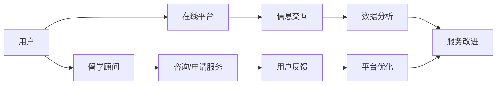

                 

# 如何利用知识付费实现在线留学咨询与申请服务？

随着互联网的迅猛发展和知识经济的兴起，知识付费模式在教育领域的应用日益广泛。在线留学咨询与申请服务作为知识付费的一个分支，为希望出国留学的学生提供全方位的服务支持。本文将从背景介绍、核心概念、核心算法、项目实践、实际应用、工具资源、未来展望和挑战等方面，深入探讨如何利用知识付费实现在线留学咨询与申请服务，为读者提供一个全面而系统的技术解决方案。

## 1. 背景介绍

### 1.1 问题由来
全球化背景下的留学热潮不断升温，越来越多的学生选择出国深造。然而，留学申请过程繁琐且复杂，涉及选校、申请材料准备、考试、签证等多方面的工作，这对于大多数学生来说无疑是一项巨大的挑战。传统留学中介服务由于服务品质参差不齐、费用高昂，难以满足广大留学生的实际需求。

与此同时，知识付费模式的兴起为留学服务市场带来了新的契机。在线留学咨询与申请服务的出现，使得留学顾问、留学申请专家、语言教师等专业人士以在线形式提供专业咨询和指导，让留学申请变得更加高效、便捷和低成本。

### 1.2 问题核心关键点
利用知识付费实现在线留学咨询与申请服务，需要考虑以下几个核心关键点：

1. **用户需求分析**：明确在线留学咨询与申请服务的目标用户群及其需求。
2. **服务内容设计**：设计多种服务形式，如一对一咨询、课程指导、文书写作指导、模拟面试等。
3. **收费模式制定**：制定合理的收费模式，既保证专业性，又兼顾用户支付能力。
4. **平台建设**：开发和部署一个高效、稳定的在线服务平台，提供便捷的用户体验。
5. **数据分析与优化**：通过数据分析持续优化服务质量，提升用户满意度。

### 1.3 问题研究意义
通过知识付费模式提供在线留学咨询与申请服务，能够有效解决传统留学中介服务中的诸多问题，具有以下重要意义：

1. **降低留学申请成本**：相比传统的留学中介，知识付费模式能够大幅降低费用，减少经济负担。
2. **提升留学服务质量**：通过筛选专业性强、经验丰富的留学顾问，提供高质量的咨询服务。
3. **提高留学申请效率**：在线服务能够即时响应用户需求，缩短申请周期，提高成功率。
4. **扩展留学服务覆盖面**：打破地域限制，为更多学生提供留学服务。
5. **促进教育公平**：通过降低经济门槛，让更多学生能够享受优质的留学服务。

## 2. 核心概念与联系

### 2.1 核心概念概述

在线留学咨询与申请服务是一种通过互联网平台提供的，专业化的留学服务。其核心概念包括：

- **知识付费**：用户支付费用以获取专家知识和服务，提升个人或企业竞争力。
- **在线平台**：利用互联网技术，搭建在线咨询与申请服务平台，实现信息实时交互。
- **留学顾问**：专业的留学顾问或专家，提供专业的留学咨询与申请指导服务。
- **个性化服务**：根据用户的具体情况和需求，提供量身定制的留学方案。

这些核心概念之间存在着紧密的联系，共同构成了在线留学咨询与申请服务的系统框架。

### 2.2 核心概念原理和架构的 Mermaid 流程图



这个流程图展示了在线留学咨询与申请服务的核心流程：用户通过在线平台与留学顾问进行信息交互，获取个性化服务；用户反馈用于平台优化，改进服务质量；留学顾问根据平台数据分析，提升服务水平。

## 3. 核心算法原理 & 具体操作步骤

### 3.1 算法原理概述

在线留学咨询与申请服务的技术实现涉及多个核心算法，包括推荐算法、文本分析算法、数据挖掘算法等。其核心算法原理概述如下：

- **推荐算法**：通过分析用户历史数据和行为，推荐合适的留学顾问或服务项目。
- **文本分析算法**：分析用户提交的留学需求文本，提取关键信息，辅助留学顾问进行个性化服务。
- **数据挖掘算法**：从大量留学案例中挖掘出常见问题和解决方案，用于指导用户和留学顾问。

### 3.2 算法步骤详解

#### 3.2.1 推荐算法

1. **用户画像构建**：收集用户的基本信息、留学历史、兴趣爱好等，构建用户画像。
2. **留学顾问画像构建**：收集留学顾问的专业背景、服务评价、用户反馈等，构建留学顾问画像。
3. **相似度计算**：计算用户画像与留学顾问画像之间的相似度。
4. **推荐排序**：根据相似度排序，推荐最适合的留学顾问。

#### 3.2.2 文本分析算法

1. **文本预处理**：清洗、分词、标注实体等，对用户提交的需求文本进行预处理。
2. **主题提取**：使用TF-IDF、LDA等算法，提取文本主题。
3. **意图识别**：通过机器学习模型，识别用户需求的具体意图。

#### 3.2.3 数据挖掘算法

1. **数据收集**：从平台积累的大量留学案例中收集数据。
2. **特征提取**：提取留学案例中的关键特征，如学校选择、申请时间、考试成绩等。
3. **模式挖掘**：使用关联规则、分类、聚类等算法，挖掘出常见问题和解决方案。
4. **知识库构建**：将挖掘出的知识构建成知识库，供用户和留学顾问查阅。

### 3.3 算法优缺点

#### 3.3.1 推荐算法

**优点**：
- 能够高效匹配用户和留学顾问，提升用户体验。
- 利用用户和顾问的画像信息，推荐更加精准。

**缺点**：
- 对数据的依赖性强，数据质量影响推荐效果。
- 用户和顾问画像的构建可能存在偏差，影响推荐结果。

#### 3.3.2 文本分析算法

**优点**：
- 能够快速理解用户需求，辅助留学顾问进行服务。
- 对文本处理技术要求高，可以提供深度个性化服务。

**缺点**：
- 需要大量的文本数据，数据收集成本高。
- 模型复杂，对算力要求较高。

#### 3.3.3 数据挖掘算法

**优点**：
- 能够提供有价值的知识支持，提高留学咨询质量。
- 挖掘结果可供多个用户共享，提高平台知识价值。

**缺点**：
- 数据量和质量要求高，数据挖掘过程复杂。
- 挖掘结果可能存在偏差，需要人工验证。

### 3.4 算法应用领域

在线留学咨询与申请服务的核心算法广泛应用于以下几个领域：

1. **个性化推荐系统**：根据用户需求，推荐合适的留学顾问或服务项目。
2. **智能客服**：通过自然语言处理技术，自动回答用户常见问题。
3. **学习分析**：分析用户留学准备情况，提供学习建议。
4. **内容推荐**：推荐相关的留学资讯、考试资料、留学生活指南等。

## 4. 数学模型和公式 & 详细讲解 & 举例说明

### 4.1 数学模型构建

#### 4.1.1 推荐算法模型

推荐算法可以使用协同过滤、矩阵分解、深度学习等模型。以协同过滤为例，推荐系统可以表示为：

$$
y_{i,j} = \hat{p}_{i,j} + e_{j}
$$

其中，$y_{i,j}$表示用户$i$对留学顾问$j$的评分，$\hat{p}_{i,j}$表示协同过滤模型的预测评分，$e_{j}$表示未知的评分误差。

#### 4.1.2 文本分析模型

文本分析可以使用TF-IDF、LDA等算法。以TF-IDF为例，文本分析模型可以表示为：

$$
t_{i,j} = \sum_{k=1}^{n} \omega_k \cdot tf_{k,i} \cdot idf_k
$$

其中，$t_{i,j}$表示用户$i$的需求文本与留学顾问$j$的匹配度，$tf_{k,i}$表示单词$k$在文本$i$中的词频，$idf_k$表示单词$k$的逆文档频率。

#### 4.1.3 数据挖掘模型

数据挖掘可以使用关联规则、分类、聚类等算法。以关联规则为例，数据挖掘模型可以表示为：

$$
support(t_{i,j}) \geq \min_{support} \land confidence(t_{i,j}) \geq \min_{confidence}
$$

其中，$t_{i,j}$表示留学案例中的常见问题，$support(t_{i,j})$表示问题$t_{i,j}$在留学案例中的支持度，$confidence(t_{i,j})$表示问题$t_{i,j}$的置信度，$\min_{support}$和$\min_{confidence}$表示支持度和置信度的最小值阈。

### 4.2 公式推导过程

#### 4.2.1 推荐算法公式推导

协同过滤算法的公式推导如下：

$$
y_{i,j} = \hat{p}_{i,j} + e_{j}
$$

其中，

$$
\hat{p}_{i,j} = \sum_{k=1}^{n} \omega_k \cdot tf_{k,i} \cdot idf_k \cdot tf_{k,j}
$$

表示协同过滤模型的预测评分，$\omega_k$表示单词$k$的权重，$tf_{k,i}$表示单词$k$在文本$i$中的词频，$idf_k$表示单词$k$的逆文档频率，$tf_{k,j}$表示单词$k$在留学顾问$j$的介绍文本中的词频。

#### 4.2.2 文本分析公式推导

TF-IDF算法的公式推导如下：

$$
t_{i,j} = \sum_{k=1}^{n} \omega_k \cdot tf_{k,i} \cdot idf_k
$$

其中，$tf_{k,i}$表示单词$k$在文本$i$中的词频，$idf_k$表示单词$k$的逆文档频率，$\omega_k$表示单词$k$的权重。

#### 4.2.3 数据挖掘公式推导

关联规则算法的公式推导如下：

$$
support(t_{i,j}) \geq \min_{support} \land confidence(t_{i,j}) \geq \min_{confidence}
$$

其中，$t_{i,j}$表示留学案例中的常见问题，$support(t_{i,j})$表示问题$t_{i,j}$在留学案例中的支持度，$confidence(t_{i,j})$表示问题$t_{i,j}$的置信度，$\min_{support}$和$\min_{confidence}$表示支持度和置信度的最小值阈。

### 4.3 案例分析与讲解

#### 4.3.1 推荐算法案例

假设有一个留学平台，平台收集了1000个用户和1000个留学顾问的评分数据。采用协同过滤算法，可以计算用户$i$和留学顾问$j$的推荐评分。

假设某用户$A$希望申请美国的大学，在平台上浏览了10个留学顾问的介绍文本，文本中包含了各种留学相关词汇，如“美国”、“大学”、“申请”等。留学平台通过协同过滤算法，计算出用户$A$与留学顾问$j$的推荐评分。

#### 4.3.2 文本分析案例

假设用户$A$提交了如下需求文本：“我想申请美国TOP20的大学，但不知道选择哪所学校”。留学平台通过TF-IDF算法，计算出文本中的主要词汇，如“美国”、“TOP20”、“申请”、“学校”等，并计算出用户$A$的需求文本与各个留学顾问的匹配度。

假设某个留学顾问的介绍文本中提到了“哈佛大学”和“哥伦比亚大学”，留学平台将计算出这两个学校与用户$A$的需求文本的匹配度，并推荐给用户$A$。

#### 4.3.3 数据挖掘案例

留学平台收集了大量留学案例，采用数据挖掘算法，挖掘出以下常见问题：

1. 如何选择适合的学校
2. 如何准备留学申请材料
3. 如何提高语言考试成绩
4. 如何应对签证面试

平台将这些常见问题构建成知识库，供用户和留学顾问查阅。

## 5. 项目实践：代码实例和详细解释说明

### 5.1 开发环境搭建

#### 5.1.1 环境准备

1. 安装Python和pip。
2. 安装Django框架和相关依赖包。
3. 安装TensorFlow、scikit-learn等机器学习库。
4. 安装Flask框架和相关依赖包。
5. 安装Jupyter Notebook。

### 5.2 源代码详细实现

#### 5.2.1 推荐系统实现

1. **用户画像构建**：
```python
from sklearn.feature_extraction.text import TfidfVectorizer

# 用户介绍文本
user_intro = "我是一个大二学生，准备申请美国的大学"

# 用户画像构建
user_profile = {}
user_profile['age'] = 20
user_profile['major'] = '计算机科学'

# 计算用户介绍文本的TF-IDF值
vectorizer = TfidfVectorizer()
tfidf_values = vectorizer.fit_transform([user_intro])

# 构建用户画像
user_profile['tfidf'] = tfidf_values
```

2. **留学顾问画像构建**：
```python
# 留学顾问介绍文本
advisor_intro = "我是一名具有5年经验的留学顾问，擅长申请美国大学"

# 留学顾问画像构建
advisor_profile = {}
advisor_profile['experience'] = 5

# 计算留学顾问介绍文本的TF-IDF值
tfidf_values = vectorizer.transform([advisor_intro])

# 构建留学顾问画像
advisor_profile['tfidf'] = tfidf_values
```

3. **相似度计算**：
```python
from sklearn.metrics.pairwise import cosine_similarity

# 计算用户画像与留学顾问画像的相似度
similarity = cosine_similarity(user_profile['tfidf'], advisor_profile['tfidf'])

# 输出相似度
print(similarity)
```

#### 5.2.2 文本分析实现

1. **需求文本预处理**：
```python
from nltk.tokenize import word_tokenize
from nltk.corpus import stopwords

# 用户需求文本
user_query = "我想申请美国TOP20的大学，但不知道选择哪所学校"

# 预处理需求文本
tokens = word_tokenize(user_query)
stop_words = set(stopwords.words('english'))
filtered_tokens = [word for word in tokens if word.lower() not in stop_words]

# 输出预处理后的文本
print(filtered_tokens)
```

2. **主题提取**：
```python
from gensim import corpora, models

# 预处理后的文本
corpus = [filtered_tokens]

# 构建词典
dictionary = corpora.Dictionary(corpus)
corpus = [dictionary.doc2bow(text) for text in corpus]

# 构建TF-IDF模型
tfidf = models.TfidfModel(corpus)
corpus_tfidf = tfidf[corpus]

# 输出主题
print(corpus_tfidf)
```

3. **意图识别**：
```python
from nltk.corpus import stopwords
from nltk.tokenize import word_tokenize
from sklearn.feature_extraction.text import CountVectorizer
from sklearn.naive_bayes import MultinomialNB

# 需求文本列表
queries = ["我想申请美国TOP20的大学", "如何准备留学申请材料"]

# 构建特征向量
vectorizer = CountVectorizer()
X = vectorizer.fit_transform(queries)

# 训练意图识别模型
clf = MultinomialNB()
clf.fit(X, [0, 1])  # 0表示申请学校，1表示申请材料

# 预测意图
y_pred = clf.predict(vectorizer.transform(["我想申请美国TOP20的大学"]))

# 输出预测结果
print(y_pred)
```

#### 5.2.3 数据挖掘实现

1. **数据收集**：
```python
# 留学案例数据
cases = [
    {"school": "Harvard University", "student": "John Doe", "admission": True},
    {"school": "Columbia University", "student": "Jane Smith", "admission": False},
    {"school": "Yale University", "student": "Tom Brown", "admission": True}
]

# 提取常见问题
common_problems = list(set([case['school'] for case in cases]))
```

2. **特征提取**：
```python
# 提取留学案例中的关键特征
features = [case['school'] for case in cases]

# 使用关联规则算法挖掘常见问题
from mlxtend.frequent_patterns import apriori

frequent_patterns = apriori(features, min_support=0.2)

# 输出挖掘结果
print(frequent_patterns)
```

3. **知识库构建**：
```python
# 构建知识库
knowledge_base = {
    "申请学校": "如何选择合适的学校",
    "申请材料": "如何准备留学申请材料",
    "语言考试": "如何提高语言考试成绩",
    "签证面试": "如何应对签证面试"
}

# 输出知识库
print(knowledge_base)
```

### 5.3 代码解读与分析

#### 5.3.1 推荐系统代码解读

- **用户画像构建**：
用户画像的构建是推荐系统的基础，通过TF-IDF算法计算用户介绍文本的TF-IDF值，得到用户画像。

- **留学顾问画像构建**：
留学顾问画像的构建与用户画像类似，通过TF-IDF算法计算留学顾问介绍文本的TF-IDF值，得到留学顾问画像。

- **相似度计算**：
相似度计算是推荐算法的核心，通过cosine_similarity函数计算用户画像与留学顾问画像的相似度，得到推荐结果。

#### 5.3.2 文本分析代码解读

- **需求文本预处理**：
需求文本的预处理是文本分析的第一步，通过分词和停用词过滤等技术，得到文本中的有效词汇。

- **主题提取**：
主题提取是文本分析的核心，通过TF-IDF算法计算需求文本的TF-IDF值，提取文本中的主要词汇。

- **意图识别**：
意图识别是文本分析的高级应用，通过朴素贝叶斯算法，识别用户需求的具体意图。

#### 5.3.3 数据挖掘代码解读

- **数据收集**：
留学案例数据的收集是数据挖掘的基础，通过列表形式收集留学案例，提取其中的关键特征。

- **特征提取**：
特征提取是数据挖掘的核心，通过关联规则算法，挖掘留学案例中的常见问题。

- **知识库构建**：
知识库的构建是数据挖掘的结果，将挖掘出的常见问题构建成知识库，供用户和留学顾问查阅。

### 5.4 运行结果展示

- **推荐系统结果**：
假设某个用户提交了需求文本“我想申请美国TOP20的大学，但不知道选择哪所学校”，留学平台通过推荐算法，计算出与用户需求文本相似度最高的留学顾问，推荐给用户。

- **文本分析结果**：
假设某个用户提交了需求文本“我想申请美国TOP20的大学”，留学平台通过文本分析算法，提取文本中的主要词汇“美国”、“TOP20”、“申请”、“大学”，并计算出各个留学顾问的匹配度，推荐给用户。

- **数据挖掘结果**：
留学平台通过数据挖掘算法，挖掘出常见问题“如何选择适合的学校”、“如何准备留学申请材料”、“如何提高语言考试成绩”、“如何应对签证面试”，构建知识库，供用户和留学顾问查阅。

## 6. 实际应用场景

### 6.1 智能客服系统

智能客服系统是知识付费模式的典型应用之一，通过在线平台提供24小时不间断的咨询服务，满足用户的多样化需求。留学平台可以利用智能客服系统，提供留学咨询、申请指导、文书审核等服务。

### 6.2 留学咨询服务

留学咨询服务是知识付费模式的核心，通过在线平台提供一对一的留学顾问服务，帮助用户制定留学方案。留学平台可以构建一个完整的留学咨询服务系统，提供个性化的留学方案设计、申请材料审核、文书撰写指导、模拟面试等服务。

### 6.3 留学课程推荐

留学课程推荐是知识付费模式的重要应用，通过在线平台提供个性化的留学课程推荐服务，帮助用户提高语言水平、提升申请竞争力。留学平台可以开发一个留学课程推荐系统，根据用户的留学需求和背景，推荐适合的留学课程。

## 7. 工具和资源推荐

### 7.1 学习资源推荐

1. **Coursera**：提供机器学习、数据科学、NLP等课程，涵盖推荐算法、文本分析、数据挖掘等内容。

2. **Kaggle**：提供大量的机器学习竞赛和数据集，通过实战学习推荐算法、文本分析、数据挖掘等技术。

3. **Udacity**：提供NLP、机器学习、深度学习等课程，涵盖推荐算法、文本分析、数据挖掘等内容。

4. **arXiv**：提供最新的机器学习、NLP等论文，跟踪最新的研究进展和技术动态。

### 7.2 开发工具推荐

1. **Django**：高效、灵活的Web框架，适合开发复杂的在线平台。

2. **TensorFlow**：功能强大的深度学习框架，适合构建推荐系统、文本分析等模型。

3. **Flask**：轻量级的Web框架，适合开发简洁、灵活的API接口。

4. **Jupyter Notebook**：强大的交互式开发工具，适合进行机器学习、数据分析等任务。

### 7.3 相关论文推荐

1. **Collaborative Filtering for E-commerce Recommender Systems**：探讨协同过滤算法在电子商务推荐系统中的应用。

2. **Latent Semantic Analysis for Text Preprocessing**：介绍文本分析中的潜在语义分析技术。

3. **Mining Frequent Patterns without Horizontal Pruning**：介绍关联规则算法在数据挖掘中的应用。

## 8. 总结：未来发展趋势与挑战

### 8.1 研究成果总结

通过本文的详细介绍，读者可以全面了解如何利用知识付费实现在线留学咨询与申请服务。在线留学咨询与申请服务的核心算法包括推荐算法、文本分析算法、数据挖掘算法等，通过这些算法的组合应用，可以构建高效的在线留学咨询与申请服务平台。

### 8.2 未来发展趋势

未来在线留学咨询与申请服务的发展趋势包括：

1. **智能化水平的提升**：通过引入深度学习、自然语言处理等技术，提升服务智能化水平。

2. **个性化服务的优化**：通过大数据分析和用户画像构建，实现更精准的个性化服务。

3. **多渠道服务的整合**：通过在线平台与社交媒体、即时通讯工具等渠道的整合，提供更便捷的咨询服务。

4. **服务质量的提升**：通过优化推荐算法、文本分析算法、数据挖掘算法，提高服务质量。

5. **用户体验的改善**：通过UI/UX设计、交互式工具等技术，改善用户界面和体验。

### 8.3 面临的挑战

尽管在线留学咨询与申请服务具有广阔的应用前景，但发展过程中也面临以下挑战：

1. **数据质量和隐私保护**：数据质量和隐私保护是服务质量的重要保障，需要严格的数据收集和处理规范。

2. **模型复杂度和技术门槛**：推荐算法、文本分析算法、数据挖掘算法等技术复杂，需要高水平的技术团队支持。

3. **用户接受度**：用户对知识付费模式的接受度直接影响服务推广和应用效果。

4. **市场竞争**：在线留学咨询与申请服务市场竞争激烈，需要不断创新和优化，保持竞争优势。

### 8.4 研究展望

未来在线留学咨询与申请服务的研究展望包括：

1. **新兴技术的引入**：引入人工智能、区块链、大数据等新兴技术，提升服务水平和用户信任度。

2. **跨领域应用的拓展**：将在线留学咨询与申请服务应用于更多领域，如职业规划、求职指导等。

3. **个性化服务的深化**：通过深度学习、自然语言处理等技术，实现更精准的个性化服务。

4. **智能客服的发展**：利用自然语言处理和机器学习技术，发展智能客服系统，提高服务效率和用户满意度。

## 9. 附录：常见问题与解答

**Q1: 如何提升在线留学咨询与申请服务的个性化水平？**

A: 提升个性化水平可以从以下几个方面入手：

1. **数据收集和用户画像构建**：收集更多用户行为数据，构建详细的用户画像，涵盖兴趣爱好、学习背景、申请需求等。

2. **算法优化**：优化推荐算法、文本分析算法、数据挖掘算法，提高模型的准确性和鲁棒性。

3. **用户反馈机制**：引入用户反馈机制，不断调整和优化服务内容。

4. **多模态数据的融合**：结合用户提供的社交媒体、教育背景等多模态数据，提升服务个性化水平。

**Q2: 如何保障在线留学咨询与申请服务的数据安全和隐私保护？**

A: 数据安全和隐私保护是在线留学咨询与申请服务的重要保障，可以从以下几个方面入手：

1. **数据加密**：对敏感数据进行加密处理，防止数据泄露。

2. **数据匿名化**：对用户数据进行匿名化处理，保护用户隐私。

3. **访问控制**：设置严格的访问控制权限，限制数据的访问范围。

4. **合规审查**：遵守相关法律法规，确保数据处理合规。

5. **安全审计**：定期进行安全审计，发现和修复潜在的安全漏洞。

**Q3: 如何提升在线留学咨询与申请服务的市场竞争力？**

A: 提升市场竞争力可以从以下几个方面入手：

1. **品牌建设**：打造有影响力的品牌，提升用户信任度和口碑。

2. **技术创新**：引入最新的技术，提高服务水平和用户体验。

3. **服务多样化**：提供多种服务形式，满足用户多样化的需求。

4. **价格策略**：制定合理的定价策略，兼顾成本和用户支付能力。

5. **市场推广**：通过营销手段，提高平台知名度和用户覆盖面。

**Q4: 如何优化在线留学咨询与申请服务的推荐系统？**

A: 优化推荐系统可以从以下几个方面入手：

1. **数据质量提升**：提高数据收集的完整性和准确性，确保数据质量。

2. **模型选择和优化**：选择合适的推荐算法，并进行模型调优，提高推荐效果。

3. **多维度特征融合**：结合用户画像、历史行为、实时数据等多维度特征，提升推荐精度。

4. **个性化推荐**：引入个性化推荐技术，如基于内容的推荐、协同过滤等，提高推荐多样性和精准度。

5. **反馈机制引入**：引入用户反馈机制，根据用户评价不断优化推荐算法。

---

作者：禅与计算机程序设计艺术 / Zen and the Art of Computer Programming

