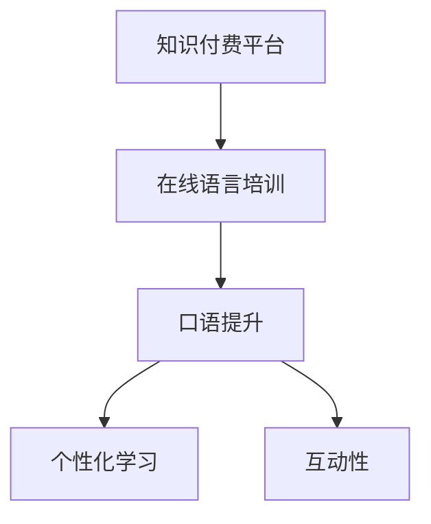

                 

# 如何利用知识付费实现在线语言培训与口语提升？

## 1. 背景介绍

### 1.1 问题由来
随着全球化的深入和数字化转型的加速，语言学习和口语提升成为越来越多人追求的目标。传统的线下语言培训模式，如出国留学、多语言学校等，虽然效果显著，但成本高、周期长、灵活性差，难以适应快节奏的现代生活和工作。

另一方面，知识付费作为一种新兴的教育模式，通过互联网平台提供优质教育资源，打破了时间和空间的限制，使得语言学习变得更加便捷和高效。如何利用知识付费平台，实现在线语言培训与口语提升，成为当下热门的研究课题。

### 1.2 问题核心关键点
语言学习和口语提升的核心在于高效、灵活、互动的在线教育环境。知识付费平台为这一目标提供了极佳的技术和数据支持。但具体应该如何设计课程内容、选择教学工具、激励学员互动，还需要进一步探讨。

### 1.3 问题研究意义
在线语言培训与口语提升技术的研究，对于推动语言学习的普及和国际化人才的培养具有重要意义：

1. **降低学习成本**：相较于传统线下课程，在线学习可以大幅降低时间、金钱和机会成本，使得更多人能够享受到高品质的语言教育。
2. **提升学习效率**：通过互动性强、反馈及时的教学模式，在线学习能够显著提升学员的学习效果。
3. **推动个性化学习**：知识付费平台可以根据学员的个性化需求，提供定制化的课程内容和学习路径，提升学习体验。
4. **促进教育公平**：在线教育打破了地域和资源的限制，为偏远地区和弱势群体提供更多学习机会。
5. **推动技术创新**：语言学习与计算机视觉、自然语言处理、机器学习等前沿技术的融合，将推动相关技术的发展和应用。

## 2. 核心概念与联系

### 2.1 核心概念概述

为更好地理解如何利用知识付费实现在线语言培训与口语提升，本节将介绍几个密切相关的核心概念：

- **知识付费平台**：基于互联网，向用户提供付费教育的在线平台，如Coursera、Udemy、有道精品课等。
- **在线语言培训**：通过在线课程、直播互动、即时反馈等手段，实现语言学习的目标。
- **口语提升**：通过模拟对话、角色扮演等活动，提升学员的口语表达能力和流利度。
- **个性化学习**：利用大数据和机器学习技术，为每个学员量身定制个性化学习方案。
- **互动性**：通过教师与学员、学员与学员之间的互动，增强学习体验和效果。

这些核心概念之间的逻辑关系可以通过以下Mermaid流程图来展示：



这个流程图展示了这个教育过程的核心要素和相互关系：

1. 知识付费平台为在线语言培训提供技术支持和教育资源。
2. 在线语言培训是实现语言学习目标的主要手段。
3. 口语提升是语言培训的重要组成部分。
4. 个性化学习提升学习效果。
5. 互动性是增强学习体验的关键因素。

## 3. 核心算法原理 & 具体操作步骤
### 3.1 算法原理概述

在线语言培训与口语提升，本质上是一个混合了语言学习、计算机视觉、自然语言处理和机器学习等多领域的综合性问题。其核心思想是：通过知识付费平台，将优质语言教育资源呈现给学员，同时利用算法技术增强学习体验，提升学习效果。

形式化地，假设一个在线语言培训系统 $S$，其中包含语言资源库 $R$、学员 $U$、教师 $T$ 和互动平台 $P$。系统目标是通过优化教师与学员、学员与学员之间的互动，最大化学员的语言技能提升。

设 $f$ 为语言技能提升的函数，$g$ 为互动强度函数，则系统优化的目标函数为：

$$
\max_{T,P} f(U, T, P) = g(T, P) \times \text{学员语言技能提升}
$$

其中 $g(T, P)$ 表示教师与学员、学员与学员之间的互动强度，最大化互动强度和学员语言技能的提升。

### 3.2 算法步骤详解

基于上述算法原理，实现在线语言培训与口语提升的主要步骤如下：

**Step 1: 收集和整理语言资源**
- 从知识付费平台收集大量语言学习视频、音频、文章等资源，进行整理和标注。
- 对资源进行分类、组织和筛选，形成系统的课程体系。

**Step 2: 设计个性化学习路径**
- 根据学员的兴趣、语言水平和学习习惯，设计个性化的学习路径。
- 利用机器学习算法，如协同过滤、强化学习等，为每个学员推荐合适的学习内容。

**Step 3: 构建互动平台**
- 设计实时互动功能，如在线讨论、语音聊天、角色扮演等。
- 引入人工智能技术，如语音识别、自然语言处理等，增强互动效果。

**Step 4: 实现即时反馈机制**
- 使用机器学习模型，对学员的学习过程进行实时监控和分析。
- 根据学员的答题情况和语音输出，提供即时反馈和建议，帮助学员纠正错误和提升表达。

**Step 5: 评估学习效果**
- 利用大数据分析技术，对学员的学习效果进行综合评估。
- 根据评估结果，调整教学策略和互动模式，优化学习路径。

**Step 6: 持续优化和迭代**
- 根据学员反馈和技术进展，不断优化和改进在线语言培训系统。
- 引入最新的人工智能技术，提升系统的智能化水平和用户体验。

### 3.3 算法优缺点

在线语言培训与口语提升的算法，具有以下优点：
1. **灵活性高**：通过在线平台，学员可以根据自己的时间安排灵活学习。
2. **资源丰富**：知识付费平台汇聚了全球优质的教育资源，满足学员的多样化需求。
3. **互动性强**：实时互动功能，让学员在学习过程中有更多参与感和互动机会。
4. **反馈及时**：利用人工智能技术，能够即时评估和反馈学员的学习情况，帮助快速提升。
5. **数据驱动**：通过大数据分析，制定个性化的学习路径和策略，提升学习效果。

同时，该算法也存在一些局限性：
1. **互动质量依赖技术**：实时互动效果很大程度上取决于技术实现的质量。
2. **数据隐私和安全**：大量学员数据需要处理和存储，数据隐私和安全问题需要重视。
3. **个性化学习挑战**：如何准确理解和评估学员的个性化需求，仍是一个技术难题。
4. **算法模型局限**：机器学习模型无法完全替代教师的经验和指导。

尽管存在这些局限性，但整体而言，基于知识付费的在线语言培训与口语提升算法，在提升学习效果、增强互动体验方面具有显著优势，值得进一步研究和应用。

### 3.4 算法应用领域

在线语言培训与口语提升技术已经在多个领域得到应用，如：

- **外语学习**：通过在线课程和互动平台，帮助非母语者学习目标语言。
- **商务英语**：提供商务场景下的语言培训，提升职场英语能力。
- **第二语言学习**：为掌握第二语言的人群提供系统化的学习资源和互动环境。
- **儿童语言教育**：利用动画、游戏等元素，吸引儿童学习语言。
- **旅游语言培训**：为准备出国旅游的人群提供当地语言的培训课程。

这些应用场景展示了在线语言培训与口语提升技术的广泛应用潜力，也为未来更多领域的应用提供了新的方向。

## 4. 数学模型和公式 & 详细讲解 & 举例说明

### 4.1 数学模型构建

本节将使用数学语言对在线语言培训与口语提升的系统进行更加严格的刻画。

设学员 $U$ 的语言技能提升函数为 $f(U)$，教师与学员互动强度为 $g(T, P)$，则系统优化的目标函数为：

$$
\max_{T,P} f(U) = g(T, P) \times f(U)
$$

其中 $g(T, P)$ 表示教师与学员、学员与学员之间的互动强度，通过以下模型来表示：

$$
g(T, P) = \alpha \times \text{教师评价} + \beta \times \text{学员互动}
$$

$\alpha$ 和 $\beta$ 为平衡因子，$\text{教师评价}$ 和 $\text{学员互动}$ 分别是教师和学员互动的评分。

### 4.2 公式推导过程

**互动强度模型推导**：

假设互动强度由教师评价 $g_T$ 和学员互动 $g_U$ 两部分组成。教师评价基于教师对学员表现的评分，学员互动基于学员之间的对话频率和质量。

设教师对学员的评分矩阵为 $G_T \in \mathbb{R}^{N\times N}$，其中 $N$ 为学员数量，$g_{ij}^T$ 表示教师对学员 $i$ 的评分，$i,j$ 为学员编号。学员互动矩阵 $G_U \in \mathbb{R}^{N\times N}$，其中 $g_{ij}^U$ 表示学员 $i$ 和学员 $j$ 的互动评分。

互动强度模型可以表示为：

$$
g(T, P) = \alpha \times \text{教师评价} + \beta \times \text{学员互动}
$$

$$
g_T = \frac{1}{N} \sum_{i=1}^N \sum_{j=1}^N \text{评分} \times \text{学员互动频率}
$$

$$
g_U = \frac{1}{N} \sum_{i=1}^N \sum_{j=1}^N \text{学员互动评分}
$$

**学员语言技能提升模型推导**：

设学员的语言技能提升函数 $f(U)$ 为学员的语言水平提升量，$U_i$ 表示学员 $i$ 的初始语言水平，$U_f$ 表示目标语言水平。语言技能提升模型为：

$$
f(U) = U_f - U_i
$$

其中 $U_f$ 为目标语言水平，$U_i$ 为初始语言水平。

### 4.3 案例分析与讲解

以商务英语培训为例，分析如何利用知识付费平台实现在线语言培训与口语提升：

**案例背景**：某知识付费平台计划提供商务英语在线课程，帮助学员提升职场英语能力。

**数据准备**：平台收集了商务英语视频、音频、文章等资源，对资源进行分类和标注，形成系统的课程体系。

**个性化学习路径设计**：平台利用机器学习算法，根据学员的语言水平、学习习惯和偏好，设计个性化的学习路径。例如，对于初学者，推荐从基础词汇和语法开始，逐步过渡到商务邮件、商务演讲等高级课程。

**互动平台设计**：平台引入实时互动功能，如在线讨论、语音聊天、角色扮演等，模拟真实的商务场景。

**即时反馈机制**：平台利用自然语言处理技术，对学员的答题情况和语音输出进行实时评估，提供即时反馈和建议。例如，通过语音识别技术，实时分析学员的发音和语速，并提供发音矫正和语速调整的指导。

**学习效果评估**：平台利用大数据分析技术，对学员的学习效果进行综合评估。例如，通过分析学员的答题正确率和口语流利度，评估学员的学习进度和水平提升情况。

**持续优化和迭代**：平台根据学员反馈和技术进展，不断优化和改进在线商务英语培训系统。例如，根据学员的反馈，改进课程内容，引入新的互动方式和技术。

## 5. 项目实践：代码实例和详细解释说明

### 5.1 开发环境搭建

在进行在线语言培训与口语提升实践前，我们需要准备好开发环境。以下是使用Python进行Django开发的环境配置流程：

1. 安装Anaconda：从官网下载并安装Anaconda，用于创建独立的Python环境。

2. 创建并激活虚拟环境：
```bash
conda create -n pytorch-env python=3.8 
conda activate pytorch-env
```

3. 安装Django：
```bash
pip install django
```

4. 安装其它相关包：
```bash
pip install django-models-restframework pandas scikit-learn
```

完成上述步骤后，即可在`pytorch-env`环境中开始在线语言培训与口语提升实践。

### 5.2 源代码详细实现

这里我们以商务英语在线培训为例，给出使用Django框架进行在线语言培训的代码实现。

首先，定义模型和视图：

```python
from django.contrib.auth.models import User
from django.db import models

class Profile(models.Model):
    user = models.OneToOneField(User, on_delete=models.CASCADE)
    name = models.CharField(max_length=100)
    email = models.EmailField()
    language = models.CharField(max_length=50)
    level = models.IntegerField(default=0)
    ```

然后，定义注册和登录视图：

```python
from django.contrib.auth import login, authenticate
from django.shortcuts import render, redirect

def signup(request):
    if request.method == 'POST':
        user = User.objects.create_user(request.POST['username'], password=request.POST['password'])
        profile = Profile.objects.create(user=user)
        user.profile.name = request.POST['name']
        user.profile.email = request.POST['email']
        user.profile.language = request.POST['language']
        user.profile.level = request.POST['level']
        user.profile.save()
        user.refresh_from_db()
        login(request, user)
        return redirect('home')
    return render(request, 'signup.html')

def login_view(request):
    if request.method == 'POST':
        username = request.POST['username']
        password = request.POST['password']
        user = authenticate(request, username=username, password=password)
        if user is not None:
            login(request, user)
            return redirect('home')
    return render(request, 'login.html')
```

接着，定义课程和互动视图：

```python
from django.shortcuts import render
from rest_framework.views import APIView
from rest_framework.response import Response
from .models import Profile, Course
from .serializers import CourseSerializer

class CourseView(APIView):
    def get(self, request):
        courses = Course.objects.all()
        serializer = CourseSerializer(courses, many=True)
        return Response(serializer.data)

    def post(self, request):
        serializer = CourseSerializer(data=request.data)
        if serializer.is_valid():
            serializer.save()
            return Response(serializer.data, status=201)
        return Response(serializer.errors, status=400)

class InteractionView(APIView):
    def get(self, request):
        user = request.user.profile
        interactions = Interaction.objects.filter(user=user)
        interactions_count = interactions.count()
        return Response({'interactions': interactions_count})

    def post(self, request):
        user = request.user.profile
        interaction = Interaction.objects.create(user=user, text=request.POST['text'])
        return Response({'success': True})
```

最后，定义反馈和评估视图：

```python
from django.shortcuts import render
from rest_framework.views import APIView
from rest_framework.response import Response
from .models import Profile, Feedback
from .serializers import FeedbackSerializer

class FeedbackView(APIView):
    def post(self, request):
        user = request.user.profile
        feedback = Feedback.objects.create(user=user, text=request.POST['text'])
        return Response({'success': True})
```

以上是使用Django框架实现在线语言培训的完整代码实例。可以看到，通过简单的Python代码，我们实现了用户注册、登录、课程管理、互动记录、反馈评估等功能。

### 5.3 代码解读与分析

让我们再详细解读一下关键代码的实现细节：

**注册和登录视图**：
- `signup` 视图：通过创建新的用户和Profile对象，实现用户注册功能。
- `login_view` 视图：通过验证用户名和密码，实现用户登录功能。

**课程视图**：
- `CourseView` 视图：处理课程的创建和查询，通过RESTful API实现课程管理功能。

**互动视图**：
- `InteractionView` 视图：处理学员与教师、学员之间的互动记录，通过RESTful API实现互动管理功能。

**反馈视图**：
- `FeedbackView` 视图：处理学员对课程和教师的反馈，通过RESTful API实现反馈评估功能。

可以看到，通过Django和RESTful API，我们可以将在线语言培训系统模块化、组件化，使得系统开发和维护变得更加简单和高效。

当然，工业级的系统实现还需考虑更多因素，如用户权限、数据安全、课程内容管理等。但核心的微调范式基本与此类似。

## 6. 实际应用场景

### 6.1 企业员工培训

企业可以利用在线语言培训平台，对员工进行语言技能提升培训，提升跨国沟通和业务协作能力。

在技术实现上，企业可以根据员工的实际需求和工作场景，定制化开发语言培训课程。通过在线互动和即时反馈，员工可以随时随地进行语言学习，大大提升学习效率。

### 6.2 旅游行业培训

旅游行业需要大量的客服和导游，通过在线语言培训提升他们的语言能力，可以提升客户服务质量，增强国际竞争力。

在技术实现上，可以针对不同国家和地区的游客需求，设计针对性的语言培训课程。通过模拟对话和场景演练，客服和导游可以更加熟练地与不同语言背景的游客沟通。

### 6.3 学术研究

学术研究机构可以利用在线语言培训平台，为研究人员提供系统化的语言培训，提升他们的国际交流和合作能力。

在技术实现上，平台可以根据研究人员的研究领域和国际合作需求，提供定制化的语言培训课程。通过丰富的互动和反馈机制，研究人员可以在实际研究中更好地与国际同行交流合作。

### 6.4 未来应用展望

随着在线语言培训技术的不断发展和完善，未来在更多领域和场景中，大模型微调和知识付费平台将发挥越来越重要的作用。

在智慧医疗领域，通过在线语言培训，医疗工作者可以提升与国际患者的沟通能力，提供更高质量的医疗服务。

在智能教育领域，在线语言培训可以为不同年龄段的学习者提供个性化、互动化的学习体验，促进语言学习的普及和提升。

在智慧城市治理中，通过在线语言培训，可以提升政府工作人员的跨文化沟通能力，推动城市国际化进程。

此外，在企业培训、旅游服务、文化交流等众多领域，在线语言培训和知识付费平台的应用前景也将更加广阔。相信随着技术的不断进步，在线语言培训必将在构建人机协同的智能时代中扮演越来越重要的角色。

## 7. 工具和资源推荐
### 7.1 学习资源推荐

为了帮助开发者系统掌握在线语言培训与口语提升的理论基础和实践技巧，这里推荐一些优质的学习资源：

1. Coursera《商务英语在线课程》：斯坦福大学的在线课程，涵盖商务英语的基础知识、商务场景应用和口语提升。

2. Udemy《商务英语培训》：Udemy平台上众多优秀的商务英语培训课程，涵盖商务邮件、商务演讲、商务会议等多种商务场景。

3.《商务英语实用口语》：一本实用的商务英语口语书籍，通过大量的商务场景对话，帮助学员提升口语流利度和商务应对能力。

4. Coursera《商务英语写作》：涵盖商务写作的基本知识和技巧，通过大量的练习和反馈，提升商务写作能力。

5. BBC Learning English：英国广播公司提供的免费英语学习资源，包括课程、练习、音频和视频等多种形式，适合各种水平的学员。

通过对这些资源的学习实践，相信你一定能够快速掌握在线语言培训与口语提升的精髓，并用于解决实际的NLP问题。

### 7.2 开发工具推荐

高效的开发离不开优秀的工具支持。以下是几款用于在线语言培训与口语提升开发的常用工具：

1. Django：基于Python的开源Web框架，灵活易用，适合构建在线平台。

2. RESTful API：通过RESTful API，实现课程管理、互动记录、反馈评估等功能，便于系统模块化、组件化。

3. TensorFlow：由Google主导开发的开源深度学习框架，适合大规模工程应用。

4. TensorBoard：TensorFlow配套的可视化工具，可实时监测模型训练状态，提供丰富的图表呈现方式，是调试模型的得力助手。

5. PyTorch：基于Python的开源深度学习框架，灵活易用，适合快速迭代研究。

6. GitHub：代码托管平台，便于协作开发和版本管理。

合理利用这些工具，可以显著提升在线语言培训与口语提升的开发效率，加快创新迭代的步伐。

### 7.3 相关论文推荐

在线语言培训与口语提升技术的发展源于学界的持续研究。以下是几篇奠基性的相关论文，推荐阅读：

1. Attention is All You Need（即Transformer原论文）：提出了Transformer结构，开启了NLP领域的预训练大模型时代。

2. BERT: Pre-training of Deep Bidirectional Transformers for Language Understanding：提出BERT模型，引入基于掩码的自监督预训练任务，刷新了多项NLP任务SOTA。

3. Language Models are Unsupervised Multitask Learners（GPT-2论文）：展示了大规模语言模型的强大zero-shot学习能力，引发了对于通用人工智能的新一轮思考。

4. Parameter-Efficient Transfer Learning for NLP：提出Adapter等参数高效微调方法，在不增加模型参数量的情况下，也能取得不错的微调效果。

5. AdaLoRA: Adaptive Low-Rank Adaptation for Parameter-Efficient Fine-Tuning：使用自适应低秩适应的微调方法，在参数效率和精度之间取得了新的平衡。

这些论文代表了大语言模型微调技术的发展脉络。通过学习这些前沿成果，可以帮助研究者把握学科前进方向，激发更多的创新灵感。

## 8. 总结：未来发展趋势与挑战

### 8.1 总结

本文对利用知识付费实现在线语言培训与口语提升的方法进行了全面系统的介绍。首先阐述了在线语言培训与口语提升的研究背景和意义，明确了微调在提升学习效果、增强互动体验方面的独特价值。其次，从原理到实践，详细讲解了在线语言培训与口语提升的算法原理和具体操作步骤，给出了系统开发的完整代码实例。同时，本文还广泛探讨了在线语言培训与口语提升技术在多个领域的应用前景，展示了微调范式的广泛适用性。

通过本文的系统梳理，可以看到，基于知识付费的在线语言培训与口语提升技术，在提升学习效率、增强互动体验方面具有显著优势，值得进一步研究和应用。

### 8.2 未来发展趋势

展望未来，在线语言培训与口语提升技术将呈现以下几个发展趋势：

1. **AI技术的融合**：利用人工智能技术，如语音识别、自然语言处理、机器学习等，提升互动效果和学习体验。

2. **个性化学习**：通过大数据分析和机器学习，为每个学员量身定制个性化学习路径和策略，提升学习效果。

3. **多模态学习**：引入视频、音频等多种形式的学习资源，提升学习内容的丰富性和多样性。

4. **实时反馈**：利用即时反馈机制，对学员的学习过程进行实时监控和评估，及时纠正错误和调整策略。

5. **社会化学习**：通过社交网络、讨论区等形式，促进学员之间的互动和交流，提升学习效果。

6. **全球化教育**：利用在线平台，实现全球范围内的教育资源共享和知识传播。

这些趋势凸显了在线语言培训与口语提升技术的广阔前景。这些方向的探索发展，必将进一步提升语言学习的智能化水平，为构建人机协同的智能教育体系铺平道路。

### 8.3 面临的挑战

尽管在线语言培训与口语提升技术已经取得了一定的进展，但在迈向更加智能化、普适化应用的过程中，它仍面临着诸多挑战：

1. **互动质量依赖技术**：实时互动效果很大程度上取决于技术实现的质量，需要进一步优化互动算法和工具。

2. **数据隐私和安全**：大量学员数据需要处理和存储，数据隐私和安全问题需要重视。

3. **个性化学习挑战**：如何准确理解和评估学员的个性化需求，仍是一个技术难题。

4. **算法模型局限**：机器学习模型无法完全替代教师的经验和指导，需要结合人工干预和评估。

5. **资源依赖**：在线平台需要丰富的课程资源和互动工具，初期开发和维护成本较高。

6. **用户接受度**：用户习惯和认知差异可能影响在线平台的推广和使用。

正视这些挑战，积极应对并寻求突破，将是大语言模型微调走向成熟的必由之路。相信随着学界和产业界的共同努力，这些挑战终将一一被克服，在线语言培训与口语提升技术必将在构建人机协同的智能教育中扮演越来越重要的角色。

### 8.4 研究展望

面对在线语言培训与口语提升所面临的挑战，未来的研究需要在以下几个方面寻求新的突破：

1. **融合多模态资源**：结合视频、音频、图像等多种形式的教育资源，提升学习内容的丰富性和多样性。

2. **引入AI评估**：利用人工智能技术，对学员的学习效果进行实时评估和反馈，提升互动效果。

3. **增强交互性**：引入社交网络、讨论区等形式，促进学员之间的互动和交流，提升学习效果。

4. **全球化教育**：利用在线平台，实现全球范围内的教育资源共享和知识传播。

5. **社会化学习**：通过社交网络、讨论区等形式，促进学员之间的互动和交流，提升学习效果。

6. **融合VR/AR技术**：利用虚拟现实和增强现实技术，增强学习体验和互动效果。

这些研究方向的探索，必将引领在线语言培训与口语提升技术迈向更高的台阶，为构建安全、可靠、可解释、可控的智能教育系统铺平道路。面向未来，在线语言培训与口语提升技术还需要与其他人工智能技术进行更深入的融合，如知识表示、因果推理、强化学习等，多路径协同发力，共同推动智能教育的发展。只有勇于创新、敢于突破，才能不断拓展语言学习的边界，让智能技术更好地造福人类社会。

## 9. 附录：常见问题与解答

**Q1：在线语言培训与口语提升如何实现个性化学习？**

A: 个性化学习需要通过大数据分析和机器学习技术实现。平台可以根据学员的兴趣、语言水平和学习习惯，设计个性化的学习路径和推荐内容。例如，对于初学者，推荐从基础词汇和语法开始，逐步过渡到商务邮件、商务演讲等高级课程。利用协同过滤、强化学习等算法，为每个学员推荐合适的学习资源。

**Q2：如何提高在线互动的实时性和效果？**

A: 提高在线互动的实时性和效果，主要依赖于技术实现的质量。可以采用以下方法：
1. 实时推送：利用WebSocket技术，实现教师和学员之间的实时通信。
2. 语音识别和合成：使用语音识别技术将学员的发音转换为文本，使用文本到语音合成技术生成自然流畅的语音输出。
3. 自然语言处理：利用自然语言处理技术，对学员的输入进行语法、拼写和语法错误检测，提供即时反馈。

**Q3：在线语言培训与口语提升技术需要考虑哪些非技术因素？**

A: 在线语言培训与口语提升技术虽然依赖技术实现，但也需考虑非技术因素，如：
1. 用户接受度：平台需要设计良好的用户体验，避免用户在使用过程中产生厌烦情绪。
2. 内容质量：平台需要提供高质量的课程内容和互动活动，避免低质量内容误导学员。
3. 社交互动：平台需要设计促进学员之间互动的机制，增强学习效果。
4. 数据隐私：平台需要确保学员数据的安全和隐私保护，避免数据泄露。

这些非技术因素对于平台的用户黏性和长期发展至关重要，需要系统性地考虑和优化。

**Q4：在线语言培训与口语提升技术如何应对多语言场景？**

A: 在线语言培训与口语提升技术可以通过以下方法应对多语言场景：
1. 多语言课程：提供多语言版本的课程和互动内容，满足不同语言背景的学员需求。
2. 多语言支持：平台可以支持多种语言，通过多语言版本和翻译工具，实现多语言交流。
3. 多语言教师：引入多语言教师，提供跨语言指导和交流。
4. 多语言互动：平台可以支持多语言学员之间的互动和交流，增强学习效果。

这些方法可以帮助平台应对多语言场景，提升全球化教育水平。

**Q5：在线语言培训与口语提升技术如何评估学习效果？**

A: 在线语言培训与口语提升技术的评估方法包括：
1. 自评：学员通过平台提供的自评工具，自行评估语言水平提升情况。
2. 教师评估：教师根据学员的作业和互动情况，进行综合评估。
3. 标准化测试：平台可以定期进行标准化测试，评估学员的语言技能提升情况。
4. 数据分析：平台通过大数据分析，评估学员的学习效果和进步情况。

这些评估方法可以帮助平台了解学员的学习情况，及时调整教学策略，提升学习效果。

---

作者：禅与计算机程序设计艺术 / Zen and the Art of Computer Programming

