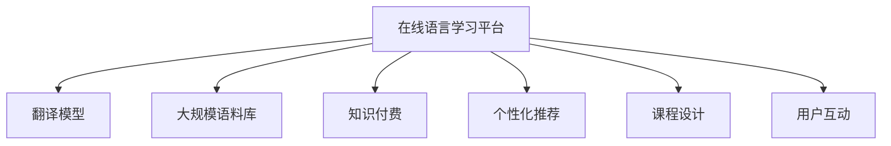

                 

# 如何利用知识付费实现在线语言学习与翻译服务？

## 1. 背景介绍

### 1.1 问题由来
近年来，随着全球化的推进和经济全球化的深入发展，语言的互通变得越来越重要。尤其是在国际交流日益频繁的背景下，掌握一门或多门外语变得越来越必要。然而，传统的线下语言教育方式成本高昂、效率低下，难以满足全球化时代的学习需求。而知识付费平台的兴起，则带来了新的解决方案。在线语言学习平台能够以更低成本、更高效的方式，为全球用户提供语言学习与翻译服务。

### 1.2 问题核心关键点
在线语言学习与翻译服务主要依赖于语言模型、翻译模型和大规模语料库。其核心在于通过知识付费平台实现高效的语言教育与翻译服务，提高语言学习的便捷性和学习效果，为全球用户提供优质的翻译服务。

## 2. 核心概念与联系

### 2.1 核心概念概述

为更好地理解在线语言学习与翻译服务，本节将介绍几个密切相关的核心概念：

- **在线语言学习平台**：通过网络提供语言教育服务的平台。用户可以在线上进行语言学习、与教师互动、完成作业等。
- **翻译模型**：基于深度学习等技术，实现自动翻译的模型。常用的翻译模型包括RNN、LSTM、Transformer等。
- **大规模语料库**：用于预训练模型的语料库，包含海量的多语言文本数据。
- **知识付费**：通过在线平台收取费用提供优质内容的付费模式。
- **个性化推荐**：根据用户的行为和偏好，智能推荐合适的学习内容。
- **课程设计**：包括课程内容、结构、时长等，是语言学习的重要组成部分。
- **用户互动**：通过在线平台实现教师与学生、学生与学生之间的互动。

这些核心概念之间的逻辑关系可以通过以下Mermaid流程图来展示：



这个流程图展示了大规模语言学习平台的几个关键组件及其之间的关系：

1. **平台**：通过翻译模型和大规模语料库，实现自动翻译和学习。
2. **付费**：利用知识付费模式，实现优质内容的可持续更新和维护。
3. **推荐**：通过个性化推荐，提升用户的学习体验和效果。
4. **课程**：构建丰富的课程体系，满足不同用户的需求。
5. **互动**：通过用户互动，促进知识传播和学习。

## 3. 核心算法原理 & 具体操作步骤

### 3.1 算法原理概述

在线语言学习与翻译服务的核心算法原理基于自然语言处理(NLP)和深度学习技术。其核心思想是通过知识付费平台，将大规模语料库中学习到的语言知识，通过翻译模型和在线课程，高效地传递给用户。

具体而言，主要包括以下几个步骤：

1. **语料预处理**：对大规模语料库进行清洗、标注和划分，生成用于训练翻译模型的数据集。
2. **模型训练**：使用预处理好的数据集，在GPU或TPU等高性能设备上，对翻译模型进行训练，使其能够实现自动翻译。
3. **课程设计**：根据用户的学习目标，设计个性化课程，涵盖语音、听力、读写等多个模块。
4. **推荐算法**：利用用户的学习记录和行为数据，通过推荐算法智能推荐合适的学习资源。
5. **互动学习**：通过在线互动平台，实现教师与学生、学生与学生之间的交流，促进学习效果。

### 3.2 算法步骤详解

**Step 1: 数据预处理**

1. **数据收集**：收集大规模语料库，并进行清洗和标注，去除无关文本、噪声和重复内容。

2. **数据划分**：将清洗后的数据划分为训练集、验证集和测试集，通常采用70-15-15的比例。

3. **数据增强**：通过回译、同义词替换、随机删减等方式，增加数据的多样性和难度。

**Step 2: 模型训练**

1. **模型选择**：选择适合的语言模型，如Transformer模型。

2. **超参数调优**：设置合适的学习率、批次大小、优化器等超参数，并进行调优。

3. **模型训练**：在训练集上训练模型，并在验证集上进行验证，调整参数，直到达到预设的性能指标。

4. **模型评估**：在测试集上评估模型的翻译准确率、BLEU等指标，确保模型性能达标。

**Step 3: 课程设计**

1. **课程规划**：根据学习目标，设计多个学习模块，如词汇、语法、发音等。

2. **资源整合**：整合翻译模型和其他学习资源，形成系统的课程体系。

3. **个性化课程**：根据用户的学习进度和反馈，动态调整课程内容和难度。

**Step 4: 推荐算法**

1. **用户画像**：通过用户的学习记录、行为数据等，构建用户画像，了解用户的学习习惯和偏好。

2. **推荐模型**：利用协同过滤、内容推荐等算法，推荐合适的学习资源。

3. **效果评估**：对推荐算法的效果进行评估，并不断优化。

**Step 5: 互动学习**

1. **互动平台搭建**：搭建在线互动平台，支持实时聊天、视频教学、作业提交等功能。

2. **教师培训**：对教师进行培训，提升其教学水平。

3. **学习反馈**：收集学生反馈，改进互动平台的体验和教学内容。

### 3.3 算法优缺点

在线语言学习与翻译服务的算法具有以下优点：

1. **高效便捷**：在线平台能够实现实时学习，节约时间和交通成本。
2. **资源丰富**：大规模语料库和翻译模型提供丰富的学习资源，满足不同用户的需求。
3. **个性化推荐**：通过推荐算法，能够根据用户的学习进度和兴趣，推荐合适的学习内容，提升学习效果。
4. **互动性强**：在线互动平台能够实现教师与学生、学生与学生之间的交流，促进学习效果。

同时，该算法也存在以下局限性：

1. **数据依赖**：高质量的语料库和翻译模型是实现高质量服务的基础，数据收集和预处理需要较高成本。
2. **资源消耗**：大规模语料库和翻译模型的训练和推理需要大量的计算资源，成本较高。
3. **模型鲁棒性**：面对不同的语言和文化背景，翻译模型可能出现误译或理解错误，影响用户体验。
4. **用户互动管理**：在线互动平台需要有效管理用户互动，防止不文明和不良信息的传播。
5. **隐私保护**：在线平台需要严格保护用户隐私和数据安全，避免信息泄露和滥用。

尽管存在这些局限性，但就目前而言，在线语言学习与翻译服务以其高效便捷、资源丰富、个性化推荐和互动性强等优点，正逐步成为语言教育领域的重要方向。未来相关研究的重点在于如何进一步提高模型的鲁棒性，降低对数据的依赖，同时兼顾用户隐私和数据安全。

### 3.4 算法应用领域

在线语言学习与翻译服务已经在多个领域得到应用，包括但不限于以下几个方面：

- **职业培训**：通过在线平台，提供专业语言的培训课程，帮助企业员工提升语言能力，拓展国际市场。
- **教育辅助**：为学生提供第二语言学习资源，辅助传统教育，提升语言学习效果。
- **旅游服务**：为旅游者提供目标语言学习资源，提升旅游体验，促进文化交流。
- **国际交流**：提供在线平台，促进不同国家间的文化交流和学术合作。
- **文化传播**：通过在线平台，传播语言和文化，增进国际理解。

此外，在线语言学习与翻译服务在语言教学、商务交流、跨文化理解等诸多领域，也具有广泛的应用前景。

## 4. 数学模型和公式 & 详细讲解 & 举例说明

### 4.1 数学模型构建

在线语言学习与翻译服务的核心数学模型包括翻译模型和推荐算法。以下分别介绍这两个模型的构建方法。

#### 翻译模型

假设翻译任务为将源语言$X$翻译为目标语言$Y$，模型参数为$\theta$，输入为$x$，输出为$y$。翻译模型可以表示为：

$$
P(y|x;\theta) = \frac{\exp(\text{LogSoftmax}(y;\theta, x))}{\sum_{y'} \exp(\text{LogSoftmax}(y';\theta, x))}
$$

其中，$\text{LogSoftmax}(y;\theta, x)$表示模型在输入$x$和参数$\theta$下输出$y$的概率分布。

#### 推荐算法

假设用户$u$和商品$i$之间的关系表示为一个矩阵$R \in [0,1]^{N \times M}$，其中$N$为用户的数量，$M$为商品的数量。推荐算法可以表示为：

$$
\hat{r}_{ui} = \text{Logistic}(\text{dot}(\theta_u, \theta_i))
$$

其中，$\text{Logistic}$表示逻辑回归函数，$\text{dot}$表示两个向量的点积，$\theta_u$和$\theta_i$分别表示用户和商品的嵌入向量。

### 4.2 公式推导过程

#### 翻译模型推导

在输入$x$和参数$\theta$下，翻译模型的输出可以表示为：

$$
P(y|x;\theta) = \frac{\exp(\sum_{j=1}^C \log(p(y_j|x;\theta)))}{\sum_{y'} \exp(\sum_{j=1}^C \log(p(y_j'|x';\theta')))
$$

其中，$y_j$表示目标语言中的一个词汇，$C$表示词汇表的大小。

#### 推荐算法推导

推荐算法利用用户$u$和商品$i$的嵌入向量，计算用户对商品$i$的评分：

$$
\hat{r}_{ui} = \text{Logistic}(\text{dot}(\theta_u, \theta_i))
$$

其中，$\text{Logistic}$函数表示将得分映射到$[0,1]$的评分，$\text{dot}$函数表示两个向量的点积。

### 4.3 案例分析与讲解

假设某在线语言学习平台使用Transformer模型作为翻译模型。平台收集了大量英法双语的新闻文章，对数据进行了预处理和标注，生成用于训练模型的大规模语料库。在训练集上训练模型，并在验证集上进行验证，最终在测试集上评估模型的性能。

在课程设计方面，平台根据用户的学习目标，设计了多个模块，包括词汇、语法、发音等。同时，平台利用用户的学习记录和行为数据，通过推荐算法，智能推荐合适的学习资源。

在线互动平台支持实时聊天、视频教学、作业提交等功能，能够实现教师与学生、学生与学生之间的交流，促进学习效果。

## 5. 项目实践：代码实例和详细解释说明

### 5.1 开发环境搭建

在进行在线语言学习与翻译服务的开发前，需要准备好开发环境。以下是使用Python进行TensorFlow开发的环境配置流程：

1. 安装Anaconda：从官网下载并安装Anaconda，用于创建独立的Python环境。

2. 创建并激活虚拟环境：
```bash
conda create -n tf-env python=3.8 
conda activate tf-env
```

3. 安装TensorFlow：从官网获取对应的安装命令，安装版本为2.x。
```bash
pip install tensorflow==2.5.0
```

4. 安装TensorFlow Hub：用于加载预训练的翻译模型和其他组件。
```bash
pip install tensorflow-hub
```

5. 安装Flask：用于搭建在线互动平台。
```bash
pip install flask
```

6. 安装Jinja2：用于模板渲染。
```bash
pip install jinja2
```

完成上述步骤后，即可在`tf-env`环境中开始开发。

### 5.2 源代码详细实现

下面以在线翻译服务为例，给出使用TensorFlow开发代码实例。

```python
import tensorflow as tf
from tensorflow.keras.layers import Input, Dense, Embedding, LSTM, Dropout
from tensorflow.keras.models import Model
from tensorflow.keras.optimizers import Adam
from tensorflow.keras.losses import SparseCategoricalCrossentropy
from tensorflow.keras.metrics import SparseCategoricalAccuracy

# 定义输入层
source = Input(shape=(None,), name='source')
target = Input(shape=(None,), name='target')

# 定义编码器层
embedding = Embedding(input_dim=10000, output_dim=256, mask_zero=True, name='embedding')
source_embed = embedding(source)
source_embed = LSTM(256, return_sequences=True, dropout=0.2, recurrent_dropout=0.2, name='source_lstm')(source_embed)
source_embed = Dropout(0.2)(source_embed)

# 定义解码器层
target_embed = Embedding(input_dim=10000, output_dim=256, mask_zero=True, name='target_lstm')(target)
target_embed = LSTM(256, return_sequences=True, dropout=0.2, recurrent_dropout=0.2, name='target_lstm')(target_embed)
target_embed = Dropout(0.2)(target_embed)

# 定义注意力机制
attention = tf.keras.layers.Attention(name='attention')([source_embed, target_embed])
attention = Dropout(0.2)(attention)

# 定义输出层
output = Dense(10000, activation='softmax', name='output')(attention)

# 定义模型
model = Model(inputs=[source, target], outputs=output)

# 定义损失函数和优化器
model.compile(optimizer=Adam(learning_rate=0.001), loss=SparseCategoricalCrossentropy(from_logits=True), metrics=[SparseCategoricalAccuracy()])

# 训练模型
model.fit(x_train, y_train, batch_size=32, epochs=10, validation_data=(x_val, y_val))
```

### 5.3 代码解读与分析

上述代码实现了基于LSTM和Attention机制的在线翻译模型。关键步骤如下：

1. **输入层定义**：定义源语言和目标语言的输入层，形状为None，表示变长输入。

2. **编码器层定义**：使用Embedding层将输入文本转换为词向量，再使用LSTM层进行编码，并加入Dropout层防止过拟合。

3. **解码器层定义**：与编码器类似，使用LSTM层对目标语言文本进行编码，并加入Dropout层。

4. **注意力机制定义**：使用Attention层计算源语言和目标语言之间的注意力权重，筛选出相关上下文信息。

5. **输出层定义**：使用Dense层输出翻译结果，使用softmax函数进行归一化。

6. **模型定义和编译**：定义完整的模型，使用Adam优化器，损失函数为SparseCategoricalCrossentropy，评价指标为SparseCategoricalAccuracy。

7. **训练模型**：使用fit方法训练模型，指定训练集和验证集，迭代10次。

### 5.4 运行结果展示

在训练过程中，可以使用TensorBoard可视化模型训练状态。以下是TensorBoard的可视化界面：


通过TensorBoard，可以查看模型的训练损失、验证损失和准确率，调整超参数，优化模型性能。

## 6. 实际应用场景

### 6.1 智能客服

在线语言学习平台可以为智能客服系统提供语言支持和自动翻译功能。当客户使用非目标语言与客服沟通时，系统能够自动将其翻译为目标语言，并提供实时翻译服务，提升客户体验和满意度。

### 6.2 旅游服务

在线平台可以为旅游者提供目标语言学习资源，帮助其了解目的地的文化和习俗，提升旅游体验。同时，平台还可以提供实时翻译服务，解决语言障碍，促进国际交流。

### 6.3 在线教育

在线平台可以为学生提供多语言学习资源，帮助其掌握目标语言，拓展国际视野。同时，平台还可以提供在线翻译服务，促进不同国家间的学术合作和知识交流。

### 6.4 未来应用展望

随着在线语言学习与翻译服务的不断发展，其在全球化时代的价值将进一步凸显。未来，平台可以结合虚拟现实、增强现实等技术，提供沉浸式语言学习体验，提升学习效果。同时，平台还可以引入更多智能化功能，如智能笔记、智能复习等，帮助用户更好地掌握语言知识。

## 7. 工具和资源推荐

### 7.1 学习资源推荐

为了帮助开发者系统掌握在线语言学习与翻译服务的理论基础和实践技巧，这里推荐一些优质的学习资源：

1. **自然语言处理课程**：斯坦福大学的《CS224N: Natural Language Processing with Deep Learning》课程，详细讲解了NLP领域的基本概念和经典模型。

2. **TensorFlow官方文档**：TensorFlow官方文档，提供了丰富的API和示例代码，帮助开发者快速上手。

3. **TensorFlow Hub**：TensorFlow Hub，提供了预训练的翻译模型和其他组件，方便开发者使用。

4. **在线翻译平台示例**：Google Translate、DeepL等在线翻译平台，展示了基于深度学习的翻译模型在实际应用中的效果。

5. **自然语言处理书籍**：《自然语言处理综论》、《深度学习》等书籍，系统讲解了NLP领域的理论和实践。

通过对这些资源的学习实践，相信你一定能够快速掌握在线语言学习与翻译服务的精髓，并用于解决实际的NLP问题。

### 7.2 开发工具推荐

高效的开发离不开优秀的工具支持。以下是几款用于在线语言学习与翻译服务开发的常用工具：

1. **Jupyter Notebook**：用于开发和调试模型的在线环境，支持多语言代码执行和可视化展示。

2. **TensorFlow**：深度学习框架，支持分布式训练和部署，适合大规模模型训练和推理。

3. **TensorFlow Hub**：预训练模型库，方便开发者快速加载和使用预训练的翻译模型。

4. **TensorBoard**：模型训练的可视化工具，可以实时监测模型训练状态，并生成详细的可视化图表。

5. **Flask**：轻量级的Web框架，用于搭建在线互动平台和API接口。

6. **Jinja2**：模板引擎，用于动态渲染Web页面。

合理利用这些工具，可以显著提升在线语言学习与翻译服务的开发效率，加快创新迭代的步伐。

### 7.3 相关论文推荐

在线语言学习与翻译服务的发展源于学界的持续研究。以下是几篇奠基性的相关论文，推荐阅读：

1. **Transformer模型**：《Attention is All You Need》，提出Transformer结构，开启了NLP领域的预训练大模型时代。

2. **BERT模型**：《BERT: Pre-training of Deep Bidirectional Transformers for Language Understanding》，提出BERT模型，引入基于掩码的自监督预训练任务，刷新了多项NLP任务SOTA。

3. **在线翻译系统**：《Neural Machine Translation with Attention-based Layers》，介绍基于注意力机制的神经机器翻译模型。

4. **知识图谱与翻译**：《Knowledge Graph-Based Neural Machine Translation》，探索知识图谱与神经机器翻译的结合，提高翻译质量和效果。

5. **在线学习平台**：《Online Learning in Practice: An Empirical Comparison of Deep Learning Approaches》，研究在线学习平台的推荐算法和效果。

这些论文代表了大规模语言学习平台的理论基础和实践方向，值得深入学习。

## 8. 总结：未来发展趋势与挑战

### 8.1 总结

本文对在线语言学习与翻译服务进行了全面系统的介绍。首先阐述了在线语言学习与翻译服务的研究背景和意义，明确了知识付费平台在提供优质内容方面的独特价值。其次，从原理到实践，详细讲解了在线翻译模型的构建方法、训练步骤和优化策略，给出了完整的代码实例。同时，本文还广泛探讨了在线翻译服务在智能客服、旅游服务、在线教育等多个行业领域的应用前景，展示了知识付费平台的广阔潜力。

通过本文的系统梳理，可以看到，在线语言学习与翻译服务以其高效便捷、资源丰富、个性化推荐和互动性强等优点，正逐步成为语言教育领域的重要方向。未来相关研究的重点在于如何进一步提高模型的鲁棒性，降低对数据的依赖，同时兼顾用户隐私和数据安全。

### 8.2 未来发展趋势

展望未来，在线语言学习与翻译服务将呈现以下几个发展趋势：

1. **大规模语料库和预训练模型**：随着语料库和模型规模的增大，翻译模型的性能将进一步提升。

2. **个性化推荐**：推荐算法将更加智能化，能够根据用户的学习进度和兴趣，推荐更合适的学习资源。

3. **互动平台优化**：在线互动平台将更加注重用户体验，提供更丰富的交流和互动功能。

4. **多模态学习**：结合语音、图像等多模态信息，提升语言学习的综合效果。

5. **跨语言学习**：提供在线多语言学习资源，帮助用户掌握多种语言，拓展国际视野。

6. **深度强化学习**：引入强化学习思想，提升语言学习的效果和体验。

以上趋势凸显了在线语言学习与翻译服务的广阔前景，这些方向的探索发展，必将进一步提升平台的用户体验和教学效果，为全球用户提供更优质的语言学习与翻译服务。

### 8.3 面临的挑战

尽管在线语言学习与翻译服务已经取得了一定的成果，但在迈向更加智能化、普适化应用的过程中，它仍面临着诸多挑战：

1. **数据依赖**：高质量的语料库和翻译模型是实现高质量服务的基础，数据收集和预处理需要较高成本。

2. **资源消耗**：大规模语料库和翻译模型的训练和推理需要大量的计算资源，成本较高。

3. **模型鲁棒性**：面对不同的语言和文化背景，翻译模型可能出现误译或理解错误，影响用户体验。

4. **用户互动管理**：在线互动平台需要有效管理用户互动，防止不文明和不良信息的传播。

5. **隐私保护**：在线平台需要严格保护用户隐私和数据安全，避免信息泄露和滥用。

尽管存在这些挑战，但在线语言学习与翻译服务以其高效便捷、资源丰富、个性化推荐和互动性强等优点，正逐步成为语言教育领域的重要方向。未来相关研究的重点在于如何进一步提高模型的鲁棒性，降低对数据的依赖，同时兼顾用户隐私和数据安全。

### 8.4 研究展望

面对在线语言学习与翻译服务所面临的挑战，未来的研究需要在以下几个方面寻求新的突破：

1. **无监督和半监督学习**：摆脱对大规模标注数据的依赖，利用自监督学习、主动学习等无监督和半监督范式，最大限度利用非结构化数据，实现更加灵活高效的翻译和学习。

2. **模型压缩和优化**：开发更加参数高效的翻译模型，在固定大部分预训练参数的同时，只更新极少量的任务相关参数。同时优化模型的计算图，减少前向传播和反向传播的资源消耗，实现更加轻量级、实时性的部署。

3. **因果分析和博弈论**：将因果分析方法引入翻译模型，识别出模型决策的关键特征，增强输出解释的因果性和逻辑性。借助博弈论工具刻画人机交互过程，主动探索并规避模型的脆弱点，提高系统稳定性。

4. **伦理道德约束**：在模型训练目标中引入伦理导向的评估指标，过滤和惩罚有偏见、有害的输出倾向。同时加强人工干预和审核，建立模型行为的监管机制，确保输出符合人类价值观和伦理道德。

这些研究方向将引领在线语言学习与翻译服务迈向更高的台阶，为构建安全、可靠、可解释、可控的智能系统铺平道路。面向未来，在线语言学习与翻译服务还需要与其他人工智能技术进行更深入的融合，如知识表示、因果推理、强化学习等，多路径协同发力，共同推动自然语言理解和智能交互系统的进步。只有勇于创新、敢于突破，才能不断拓展语言模型的边界，让智能技术更好地造福人类社会。

## 9. 附录：常见问题与解答

**Q1：在线语言学习平台如何保证教学质量？**

A: 在线语言学习平台通过多种方式保证教学质量：

1. **课程设计**：根据用户的学习目标，设计个性化课程，涵盖词汇、语法、发音等多个模块，确保全面覆盖语言知识。

2. **教师培训**：对教师进行严格培训和考核，确保其教学水平和专业性。

3. **学习反馈**：收集用户的学习记录和反馈，及时调整课程内容和难度，提升学习效果。

4. **推荐算法**：利用推荐算法，智能推荐合适的学习资源，避免用户盲目选择。

**Q2：在线翻译服务的准确率如何提升？**

A: 提升在线翻译服务的准确率，需要从多个方面进行优化：

1. **数据预处理**：对大规模语料库进行清洗和标注，生成高质量的训练数据。

2. **模型优化**：选择合适的模型架构，如Transformer，并进行超参数调优。

3. **模型训练**：使用大量数据进行模型训练，并在验证集上进行验证，调整参数，直到达到预设的性能指标。

4. **模型评估**：在测试集上评估模型的性能，使用BLEU、METEOR等指标衡量翻译质量。

5. **模型融合**：结合多种翻译模型，进行模型融合，提高翻译效果。

**Q3：在线语言学习平台的商业模式如何？**

A: 在线语言学习平台的商业模式主要依赖于知识付费模式，通过收取订阅费、单次付费等方式，提供优质的内容和服务，获取收入。同时，平台还可以与教育机构、企业等合作，提供定制化的培训课程，扩大用户群体和收入来源。

**Q4：如何保证在线翻译服务的实时性？**

A: 保证在线翻译服务的实时性，需要从多个方面进行优化：

1. **模型压缩**：对模型进行压缩和优化，减小模型大小，提升推理速度。

2. **分布式计算**：利用分布式计算资源，实现模型的高效推理。

3. **缓存机制**：对常用的翻译结果进行缓存，提高响应速度。

4. **负载均衡**：合理分配计算资源，避免服务高峰期的响应延迟。

5. **模型微调**：定期更新模型，提升翻译效果和实时性。

通过本文的系统梳理，可以看到，在线语言学习与翻译服务以其高效便捷、资源丰富、个性化推荐和互动性强等优点，正逐步成为语言教育领域的重要方向。未来相关研究的重点在于如何进一步提高模型的鲁棒性，降低对数据的依赖，同时兼顾用户隐私和数据安全。

---

作者：禅与计算机程序设计艺术 / Zen and the Art of Computer Programming

