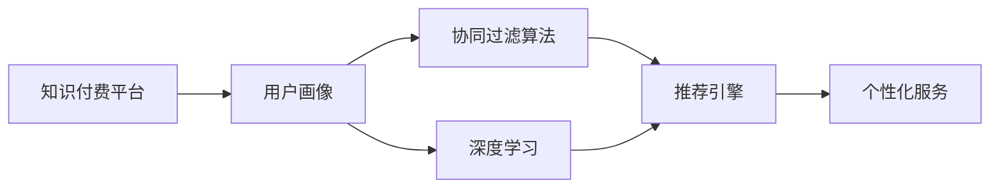

                 

# 如何利用知识付费实现智能化推荐与个性化服务？

> 关键词：知识付费, 智能化推荐, 个性化服务, 用户画像, 协同过滤, 深度学习, 强化学习

## 1. 背景介绍

随着互联网的迅猛发展和智能技术的不断进步，在线教育、电子书、远程咨询等知识付费服务迅速崛起，成为知识传播的新兴形式。然而，知识付费平台的内容繁杂，用户获取信息时面临信息过载的挑战。如何帮助用户在海量内容中筛选出最有价值的信息，提升知识获取的效率，是当前知识付费行业亟待解决的重要问题。

为了解决这一问题，智能化推荐与个性化服务应运而生。基于用户的行为数据、兴趣偏好、社交关系等，构建详细的用户画像，并通过算法推荐系统，为每位用户量身定制最匹配的内容推荐。这种个性化服务不仅能够提升用户体验，还能显著提高平台的转化率和用户粘性，带来巨大的商业价值。

## 2. 核心概念与联系

### 2.1 核心概念概述

在知识付费领域，智能化推荐与个性化服务涉及多个核心概念，包括知识付费平台、用户画像、协同过滤算法、深度学习、强化学习等。

- **知识付费平台**：指基于互联网，向用户提供有价值内容的服务平台，如Coursera、Udemy、得到等。
- **用户画像**：指通过对用户行为数据的收集和分析，构建出用户多维度的标签和兴趣偏好，形成用户画像。
- **协同过滤算法**：基于用户行为相似性，推荐相似用户喜爱的内容。分为基于用户的协同过滤和基于项目的协同过滤。
- **深度学习**：通过多层神经网络结构，提取用户行为数据中的深层次特征，提升推荐准确性。
- **强化学习**：通过奖励机制，指导算法不断优化推荐策略，提高用户满意度。

这些概念之间相互关联，共同构成了知识付费中智能化推荐与个性化服务的基础。

### 2.2 核心概念原理和架构的 Mermaid 流程图



这个流程图展示了知识付费平台从用户画像出发，利用协同过滤和深度学习算法，构建推荐引擎，最终实现个性化服务的过程。

## 3. 核心算法原理 & 具体操作步骤
### 3.1 算法原理概述

智能化推荐与个性化服务的核心原理是通过构建用户画像，利用协同过滤算法和深度学习算法，为每位用户生成个性化推荐列表，提升知识获取效率和用户体验。

具体而言，算法流程包括以下几个步骤：

1. 数据收集：收集用户的行为数据，包括浏览、点赞、评论、购买等。
2. 用户画像：通过机器学习算法，提取用户行为数据中的关键特征，构建用户画像。
3. 协同过滤：根据用户画像和行为数据，找到行为相似的用户，为其推荐相似用户喜欢的内容。
4. 深度学习：利用神经网络模型，挖掘更深层次的用户兴趣和行为特征，提升推荐效果。
5. 强化学习：通过奖励机制，优化推荐策略，提高用户满意度。

### 3.2 算法步骤详解

**Step 1: 数据收集与预处理**

- **行为数据收集**：用户登录、浏览、点击、购买等行为都会被记录下来。
- **数据清洗**：去除噪音数据，填补缺失值，进行异常值检测。
- **特征工程**：提取有意义的特征，如浏览时长、点击位置、购买频率等。

**Step 2: 用户画像构建**

- **用户特征提取**：通过统计和聚类算法，提取用户的关键特征，形成用户标签。
- **用户兴趣建模**：利用机器学习算法，构建用户兴趣模型，描述用户对不同内容的偏好。
- **用户画像融合**：将用户行为数据、兴趣模型和标签融合，形成详细的用户画像。

**Step 3: 协同过滤算法**

- **基于用户的协同过滤**：找到与目标用户行为相似的其他用户，为其推荐相似用户喜欢的内容。
- **基于项目的协同过滤**：找到与目标内容受欢迎程度相似的其他内容，推荐给目标用户。

**Step 4: 深度学习算法**

- **用户行为编码**：将用户行为数据编码成高维向量，表示用户的兴趣和偏好。
- **特征表示学习**：利用神经网络模型，学习用户行为数据的深层次特征表示。
- **推荐模型训练**：通过深度学习算法，训练推荐模型，输出推荐列表。

**Step 5: 强化学习算法**

- **奖励机制设计**：定义用户满意度的评估标准，如点击率、购买率等。
- **推荐策略优化**：利用强化学习算法，优化推荐策略，最大化用户满意度。

### 3.3 算法优缺点

**优点**：
- **个性化推荐**：通过用户画像和协同过滤算法，为用户生成个性化推荐列表，提升用户体验。
- **高效推荐**：深度学习算法可以挖掘深层次的用户行为特征，提升推荐效果。
- **持续优化**：强化学习算法可以根据用户反馈不断优化推荐策略，提高推荐精度。

**缺点**：
- **数据需求大**：需要收集大量用户行为数据，对用户隐私保护提出挑战。
- **模型复杂**：协同过滤和深度学习算法需要复杂的模型结构和高性能计算资源。
- **算法复杂**：强化学习算法需要大量实验调参，计算复杂度高。

### 3.4 算法应用领域

智能化推荐与个性化服务技术可以应用于各种知识付费平台，如在线教育、电子书、远程咨询等，提升用户的学习体验和平台转化率。具体应用包括：

- **课程推荐**：根据用户的兴趣和行为，推荐最适合的课程和学习内容。
- **电子书推荐**：为用户推荐感兴趣的电子书和阅读材料。
- **咨询师推荐**：根据用户问题，推荐最适合的咨询师和专家。
- **内容订阅**：为用户推荐感兴趣的主题和频道，提高用户粘性。
- **广告投放**：通过用户画像和行为特征，精准投放广告，提升广告效果。

## 4. 数学模型和公式 & 详细讲解 & 举例说明

### 4.1 数学模型构建

在知识付费领域，推荐系统通常基于协同过滤和深度学习算法。这里我们以协同过滤算法为例，介绍其数学模型构建。

协同过滤算法分为基于用户的协同过滤和基于项目的协同过滤。这里以基于用户的协同过滤算法为例，建立推荐模型的数学模型。

假设用户集为 $U$，物品集为 $I$，用户 $u$ 对物品 $i$ 的评分 $r_{ui}$ 为一个实数，且 $r_{ui} \in [0,1]$。协同过滤的目标是找到与用户 $u$ 行为相似的其他用户 $v$，根据 $v$ 对物品的评分预测 $u$ 对物品的评分，从而生成推荐列表。

### 4.2 公式推导过程

假设用户 $u$ 的邻居用户集为 $N_u$，对于每个邻居用户 $v$，计算其与 $u$ 的相似度 $s_{uv}$，常见的相似度计算方法包括余弦相似度、皮尔逊相关系数等。

基于用户的协同过滤算法中，预测用户 $u$ 对物品 $i$ 的评分 $r_{ui}$ 的公式为：

$$
\hat{r}_{ui} = \sum_{v \in N_u} s_{uv} \times r_{vi}
$$

其中 $s_{uv}$ 表示用户 $u$ 和 $v$ 的相似度，$r_{vi}$ 表示用户 $v$ 对物品 $i$ 的评分。

### 4.3 案例分析与讲解

以基于用户的协同过滤算法为例，分析其应用场景和局限性。

**应用场景**：
- **电商推荐**：基于用户的购物行为，推荐其他用户喜欢的商品。
- **音乐推荐**：根据用户听歌记录，推荐相似用户喜爱的歌曲。
- **视频推荐**：根据用户观看记录，推荐相似用户喜爱的视频。

**局限性**：
- **数据稀疏性**：当用户集或物品集较大时，存在数据稀疏性问题。
- **冷启动问题**：对于新用户和新物品，难以找到足够的相似用户和物品进行推荐。

## 5. 项目实践：代码实例和详细解释说明

### 5.1 开发环境搭建

为实现基于协同过滤的推荐系统，需要安装以下开发工具：

- **Python 3.x**：推荐语言，需安装Anaconda或Miniconda。
- **Pandas**：用于数据处理和分析。
- **NumPy**：用于数值计算。
- **Scikit-learn**：用于机器学习算法。
- **PyTorch**：用于深度学习算法。
- **TensorBoard**：用于可视化模型训练过程。
- **Gunicorn**：用于部署Web应用。

### 5.2 源代码详细实现

以下是一个简单的基于协同过滤的推荐系统代码实现，包括数据预处理、用户画像构建、协同过滤算法等关键环节。

```python
import pandas as pd
import numpy as np
from sklearn.metrics.pairwise import cosine_similarity
from sklearn.model_selection import train_test_split
from sklearn.decomposition import TruncatedSVD

# 数据预处理
data = pd.read_csv('data/user_behavior.csv', sep=',')
data = data.dropna()  # 去除缺失值
data = data.drop_duplicates()  # 去除重复记录

# 构建用户画像
user_counts = data.groupby('user_id').size().reset_index(name='count')
user_interests = data.groupby('user_id')['item_id'].value_counts().reset_index(name='interest_count')
user_interests = user_interests.groupby(['user_id', 'item_id'])['count'].sum().unstack().fillna(0).to_dict()

# 构建相似度矩阵
similarity_matrix = cosine_similarity(user_interests.values)

# 协同过滤算法
uids = data['user_id'].unique()
uid_counts = user_counts[uids].values
uv_similarity = similarity_matrix

# 定义预测函数
def predict_r(u, item_id, similarity_matrix):
    if len(similarity_matrix) == 0:
        return np.mean(similarity_matrix)
    similarity = similarity_matrix[u]
    weights = (uv_similarity * similarity).mean(axis=1)
    weights = weights / np.sqrt(np.sum(weights**2))
    return weights.dot(similarity)

# 生成推荐列表
recommend_items = {}
for uid in uids:
    if uid not in user_counts:
        continue
    u_interests = user_interests[uid].to_list()
    u_items = [x for x in u_interests if x > 0]
    u_weights = [x for x in weights[u] if x > 0]
    # 预测用户对物品的评分
    u_r = np.mean([predict_r(uid, item_id, similarity_matrix) for item_id in u_items])
    # 生成推荐列表
    recommend_items[uid] = [item_id for item_id in range(1, 1001) if item_id not in u_items]

# 可视化推荐结果
import matplotlib.pyplot as plt
plt.figure(figsize=(10, 5))
plt.bar(range(len(u_items)), u_r, color='blue')
plt.show()
```

### 5.3 代码解读与分析

上述代码实现了基于协同过滤算法的推荐系统，具体步骤如下：

**数据预处理**：
- 使用Pandas读取数据文件，并去除缺失值和重复记录。

**构建用户画像**：
- 统计每个用户对不同物品的兴趣数量，构建用户画像。
- 利用Scikit-learn的cosine_similarity计算用户画像的相似度矩阵。

**协同过滤算法**：
- 遍历每个用户，计算其对每个物品的预测评分。
- 定义预测函数，利用相似度矩阵计算预测评分。
- 生成推荐列表，排除已访问的物品，生成个性化推荐列表。

**可视化推荐结果**：
- 使用Matplotlib可视化推荐结果，展示每个用户对物品的评分。

## 6. 实际应用场景

### 6.1 在线教育平台推荐

在线教育平台如Coursera、edX等，需要为用户推荐最适合的课程和学习内容。利用协同过滤和深度学习算法，可以基于用户的行为数据和学习历史，为用户生成个性化推荐列表，提升学习效率和满意度。

具体实现时，可以将课程信息、学习路径、学习时间等信息作为推荐系统的输入，利用协同过滤和深度学习算法，为用户推荐最匹配的课程和章节。此外，还可以通过强化学习算法，根据用户的学习效果和反馈，不断优化推荐策略。

### 6.2 电子书推荐平台

电子书推荐平台如Amazon Kindle、豆瓣读书等，需要为用户推荐感兴趣的电子书和阅读材料。利用协同过滤和深度学习算法，可以基于用户的阅读记录和偏好，生成个性化推荐列表，提升阅读体验。

具体实现时，可以将用户的阅读记录、评分、评论等信息作为推荐系统的输入，利用协同过滤和深度学习算法，为用户推荐最匹配的电子书。此外，还可以通过强化学习算法，根据用户的阅读效果和反馈，不断优化推荐策略。

### 6.3 远程咨询平台

远程咨询平台如智慧树、微医等，需要为用户推荐最适合的咨询师和专家。利用协同过滤和深度学习算法，可以基于用户的问题和历史咨询记录，为用户生成个性化推荐列表，提高咨询效率和满意度。

具体实现时，可以将用户的咨询记录、评分、评论等信息作为推荐系统的输入，利用协同过滤和深度学习算法，为用户推荐最匹配的咨询师和专家。此外，还可以通过强化学习算法，根据用户的咨询效果和反馈，不断优化推荐策略。

## 7. 工具和资源推荐

### 7.1 学习资源推荐

- **《Python数据分析与数据可视化》**：介绍Python数据分析和数据可视化工具，适合入门学习。
- **《深度学习入门：基于Python的理论与实现》**：介绍深度学习的基本理论和实现方法，适合进阶学习。
- **《协同过滤推荐系统》**：介绍协同过滤推荐系统的原理和实现方法，适合深入学习。
- **《强化学习基础》**：介绍强化学习的基本原理和实现方法，适合深入学习。

### 7.2 开发工具推荐

- **PyTorch**：基于Python的深度学习框架，支持动态计算图，适合深度学习应用开发。
- **TensorFlow**：谷歌开源的深度学习框架，支持静态计算图和动态计算图，适合大规模工程应用。
- **Gunicorn**：用于部署Web应用的Python工具，支持多进程和异步处理。
- **Jupyter Notebook**：用于数据科学和机器学习开发的交互式编程环境，支持代码编写、可视化展示和数据探索。
- **TensorBoard**：用于可视化模型训练过程的Python工具，支持动态图展示和实时数据监测。

### 7.3 相关论文推荐

- **《基于协同过滤的推荐系统》**：介绍协同过滤推荐系统的基本原理和实现方法，适合入门学习。
- **《深度学习在推荐系统中的应用》**：介绍深度学习算法在推荐系统中的应用，适合进阶学习。
- **《强化学习在推荐系统中的应用》**：介绍强化学习算法在推荐系统中的应用，适合深入学习。
- **《知识付费平台中的智能化推荐与个性化服务》**：介绍知识付费平台中的智能化推荐与个性化服务技术，适合应用实践。

## 8. 总结：未来发展趋势与挑战

### 8.1 未来发展趋势

随着人工智能技术的发展，智能化推荐与个性化服务技术将呈现出以下几个趋势：

1. **数据驱动**：推荐系统将更加依赖于数据驱动，通过多维度数据融合，提升推荐精度和效果。
2. **个性化**：推荐系统将更加个性化，根据用户的多维度行为和特征，生成高度定制化的推荐列表。
3. **实时性**：推荐系统将更加实时，能够快速响应用户的行为和偏好变化，提供即时的个性化推荐。
4. **多模态融合**：推荐系统将结合多模态数据，如文本、图像、视频等，提升推荐效果。
5. **跨领域应用**：推荐系统将广泛应用于电商、教育、医疗等多个领域，提升各领域的信息获取效率和用户体验。

### 8.2 面临的挑战

尽管智能化推荐与个性化服务技术在知识付费领域展现了强大的潜力，但在实现过程中仍面临诸多挑战：

1. **数据隐私**：如何保护用户隐私，防止数据泄露和滥用，是当前推荐系统面临的重要挑战。
2. **冷启动问题**：对于新用户和新物品，如何有效进行推荐，是推荐系统面临的难点。
3. **推荐算法复杂**：推荐算法涉及复杂的机器学习模型和深度学习模型，对计算资源和技术水平要求较高。
4. **实时性要求高**：推荐系统需要实时响应用户行为变化，对算法实时性和计算效率要求较高。
5. **推荐效果不理想**：如何提升推荐效果，防止推荐内容单调乏味，是推荐系统面临的重要问题。

### 8.3 研究展望

未来的智能化推荐与个性化服务研究将侧重于以下几个方向：

1. **数据隐私保护**：探索如何在推荐系统中保护用户隐私，防止数据泄露和滥用。
2. **推荐算法优化**：开发更加高效、简洁的推荐算法，提升推荐效果和实时性。
3. **多模态数据融合**：探索如何结合多模态数据，提升推荐效果和用户体验。
4. **跨领域应用扩展**：探索推荐系统在其他领域的适用性和优化方法。

总之，智能化推荐与个性化服务技术将成为知识付费领域的重要技术手段，通过不断的技术创新和实践优化，将为用户带来更优质的服务和体验，推动知识付费平台的商业化进程。

## 9. 附录：常见问题与解答

**Q1: 如何收集用户行为数据？**

A: 用户行为数据的收集可以通过前端页面、后台日志等方式进行。具体实现时，可以利用Web爬虫技术，定时抓取用户的行为记录，并存储到数据库中。

**Q2: 如何处理数据稀疏性问题？**

A: 数据稀疏性问题可以通过数据填充、降维等方法进行处理。具体实现时，可以使用矩阵补零法、矩阵分解等方法，提高推荐系统的准确性。

**Q3: 如何选择协同过滤算法？**

A: 选择协同过滤算法需要考虑数据规模、用户数量等因素。基于用户的协同过滤算法适用于用户数量较少、物品数量较多的场景，而基于项目的协同过滤算法适用于物品数量较少、用户数量较多的场景。

**Q4: 如何使用深度学习算法提升推荐效果？**

A: 使用深度学习算法需要构建神经网络模型，选择合适的损失函数和优化器。具体实现时，可以使用Keras、TensorFlow等深度学习框架，构建推荐模型，并使用交叉验证等方法进行调参。

**Q5: 如何使用强化学习算法优化推荐策略？**

A: 使用强化学习算法需要定义奖励机制，并选择合适的强化学习算法。具体实现时，可以使用Q-Learning、Deep Q-Network等算法，并利用奖励机制进行模型训练和优化。

综上所述，智能化推荐与个性化服务技术在知识付费领域具有广阔的应用前景和巨大的商业价值。通过不断探索和创新，推荐系统将为用户带来更优质的服务和体验，推动知识付费平台的商业化进程。

